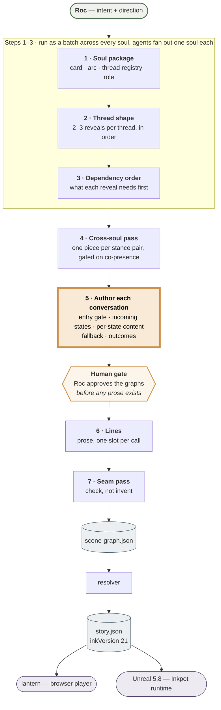

# Where the Choice Designer sits in the pipeline

The agent submitted for Assignment #5 runs **step 5** of the storyline authoring process
([`plans/2026-08-03-storyline-authoring-process.md`](../../plans/2026-08-03-storyline-authoring-process.md)).

## The pipeline, one sentence per step

1. **Soul package** — the Architect fills each NPC seed into a persona card with its arc, thread registry and role, so every thread names the card field it reveals.
2. **Thread shape** — each thread gets two or three reveals in order, plus where it leaves off on day 5, checked against the fact budget.
3. **Dependency order** — what each reveal needs before it can land, so no reveal depends on something unreachable and no flag is written without a reader.
4. **Cross-soul pass** — one shared piece per stance pair, gated on both souls being present, with every pair's fact feeding a thread on both sides.
5. **Author each conversation — THE CHOICE DESIGNER.** **Takes a thread document whose conversation sections read *Awaiting Choice designer* and fills them with structure — choice nodes, gates, options, outcomes and fallbacks — as content blocks and mermaid graphs, under the rule that all four incoming states walk without dead-ending.**
6. **Lines** — the Content agent writes the prose afterward, one slot per call, against the pinned card fields.
7. **Seam pass** — a final check that every cross-soul beat has an owner; it checks rather than invents.

## The dividing line

Step 5 exists because "what gets revealed" and "when it can be reached" are two different decisions.
The seat split off the Narrative Architect on 2026-08-04:

| Seat | Step | Owns | The line |
|---|---|---|---|
| Narrative Architect | 1–4 | Cards, arc, threads, thread shape, dependency order, how many conversations a thread gets | **revealed** |
| **Choice Designer** | **5** | **The conversations inside that frame** | **reachable** |
| Lines | 6 | The prose | **spoken** |

Two properties of that position are worth naming:

- **It is gated on both sides.** It never runs before step 3, because dependency order and the flag table are its *inputs*, not its outputs. And Roc approves its graphs before step 6 writes a single word — structure is cheap to redo, prose is not.
- **Its output is executable.** The mermaid graphs are not illustrations of a design held elsewhere; every label is a real schema field, and the design compiles through `scene-graph.json` into ink and runs in the game.

---

*A wider frame exists: [`narrative-pipeline/pipeline.md`](../../narrative-pipeline/pipeline.md) describes the
full 13-step generation procedure, from steering and intake through verification, the tell-purge, QA and the
final gate. The 7 steps above are the authoring process for one thread, which is the loop this agent runs in.*
