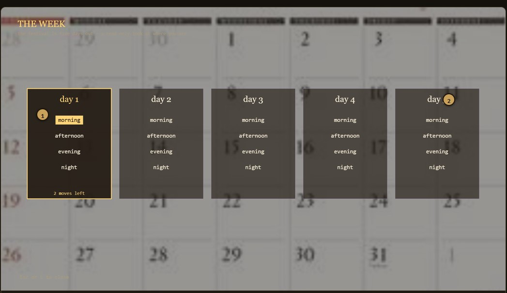
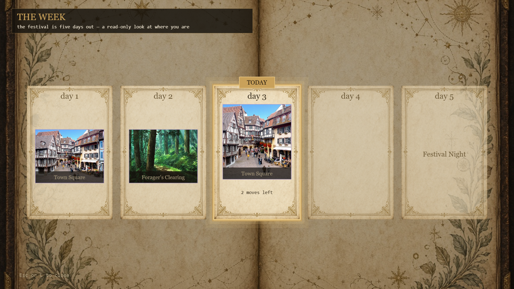
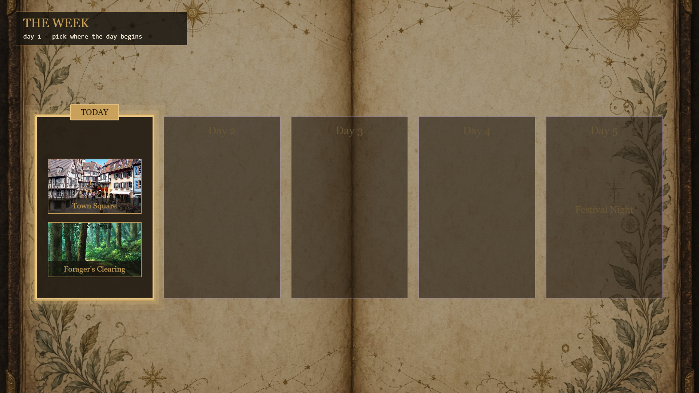
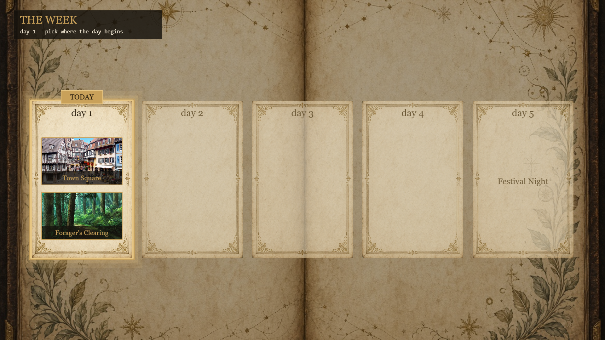
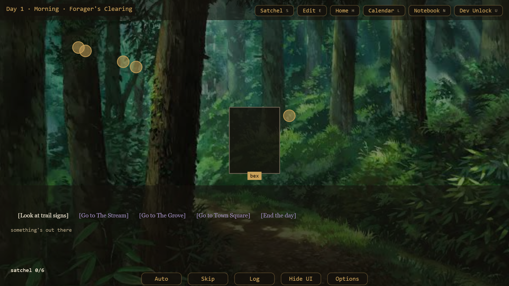
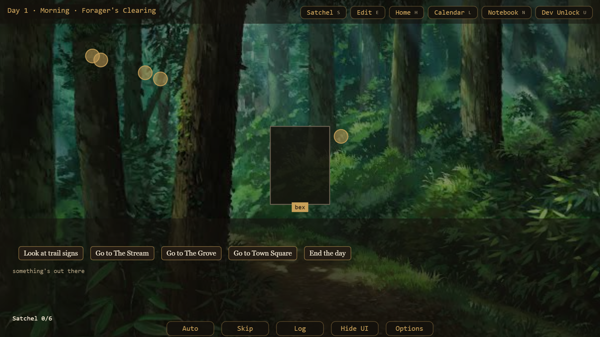
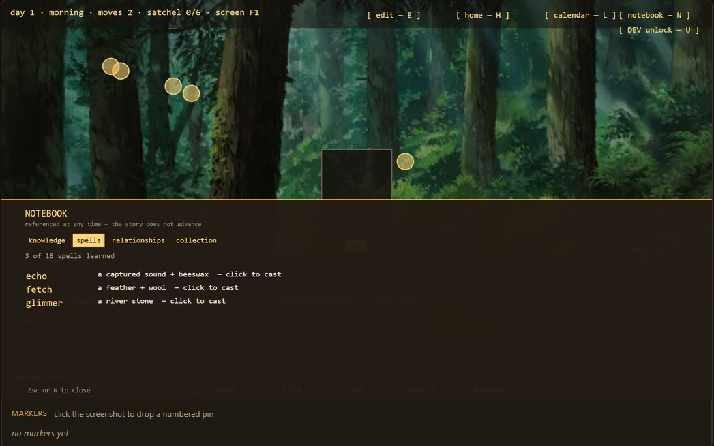
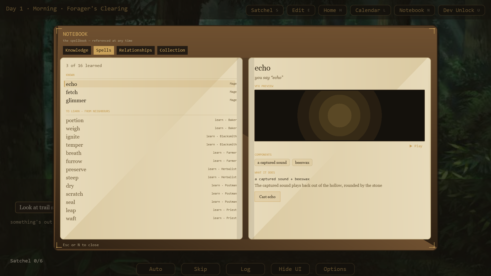
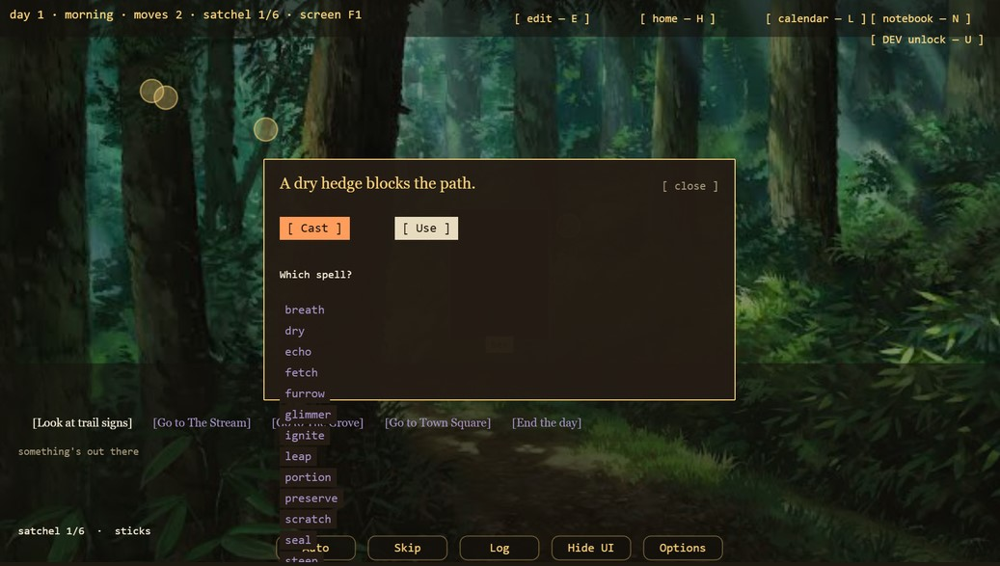
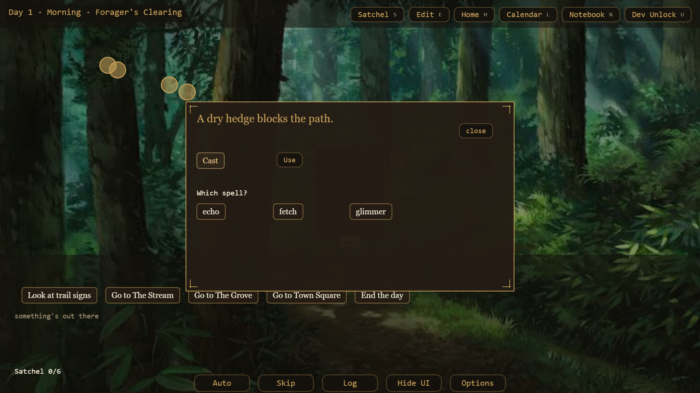

# Assignment 07 — Style Guide Agent (UI)

**A self-correcting Generator → Evaluator → Refiner loop that enforces the VISUAL style rules of my capstone game, screen by screen.**

The game is a cozy roguelite point-and-click adventure set in a hand-painted village. This is an application of the GER pattern and Styleguide to the game's UI.

## What's in this folder

| Path | What it is |
|---|---|
| `style-guide.md` | **The style guide.** Six constraint types, every rule pulled from the game's own design system (`gdd/14-visual-style-guide.md`) |
| `loop/ui-builder.md` | The **Generator / Refiner** contract. One seat: it builds a screen, and on a fix pass it refines from the Evaluator's reason |
| `loop/ui-verifier.md` | The **Evaluator** contract. Judges a rendered screenshot against the style guide and returns a SCORE + REASON |
| `loop/score.mjs` | The deduction table. **Where SCORE comes from** — runnable, offline |
| `loop/fixtures/` | The recorded runs. Each screen's real findings, before and after. Replays with no render |
| `evidence/` | The before/after screenshots, from real `playtest.mjs` renders this session |

The two contracts in `loop/` are copies of the **live** agent seats at `agents/ui-builder.md` and `agents/ui-verifier.md`. This is not a throwaway pipeline. The seats that scored these screens are the seats that build my game's UI.

---

## What I built

An automated loop that builds a game UI screen, renders it, scores the screenshot against my game's written visual rules, and rebuilds it from the reason it failed. No human touches the loop while it runs.

I added a new section to my GDD: `gdd/14-visual-style-guide.md`, a design system derived from four approved mockups and the shipped `theme.ts`. I also added a **score derived from those rules** (`loop/score.mjs`), a **machine-readable findings format** the Evaluator emits, and a **set of real screens that broke specific rules** so the loop had something to catch.

The loop maps cleanly onto the brief's three roles:

| Brief | My seat | What it does |
|---|---|---|
| **Generator** | UI Builder | Ports a screen to the design system and renders it |
| **Evaluator** | UI Verifier | Looks at the screenshot, names the broken §14 rule, returns SCORE + REASON |
| **Refiner** | UI Builder (fix pass) | Takes the Evaluator's reason and rebuilds only what it named |

---

## The style guide

Six constraint types. The brief asks for three. Full rules, with their §14 sources and the token values, are in **`style-guide.md`**. In short:

| Constraint | The rule | Scored as |
|---|---|---|
| **Palette** | Chrome is night/leather, a card is light parchment, the one accent is lantern gold `#c9a15a`. Never a raw hex | `token.hardcoded_hex`, `palette.off_brand_fill` |
| **Typography & casing** | Title Case for labels and buttons; UPPERCASE for small kickers; normal case for screen titles | `type.wrong_case` |
| **Legibility** | Text clears the 4.5:1 AA floor over its own backdrop; HUD text on painted art gets a night scrim | `legibility.contrast` (scales) |
| **Button families** | HUD chrome uses the shipped dialogue-pill families recolored to gold, never per-screen bracket text | `component.wrong_family` |
| **Panels & material** | Framed board / parchment card / diegetic object. The day card is a light framed page; the satchel is a pouch | `palette.off_brand_fill`, `layout.mismatch` |
| **VFX & render fidelity** | Spell VFX stays in its pane; particles emit at their anchor. A whole class of defect is green under tests | `motion.render_bug`, `asset.missing` |

---

## The Evaluator

### Where SCORE comes from

**No model is ever asked for a number.** The Verifier looks at the screenshot, names which §14 rule broke, and quotes the file and line. The arithmetic happens in code, in `loop/score.mjs`.

```js
export const RULES = {
  "type.wrong_case":        { cost: 2, class: "refinable"  },
  "token.hardcoded_hex":    { cost: 2, class: "refinable"  },
  "palette.off_brand_fill": { cost: 4, class: "refinable"  },
  "component.wrong_family": { cost: 6, class: "refinable"  },
  "layout.mismatch":        { cost: 6, class: "refinable"  },
  "motion.render_bug":      { cost: 6, class: "refinable"  },
  "legibility.contrast":    { cost: 6, class: "refinable", scales: "contrast" },
  "asset.missing":          { cost: 6, class: "structural" },
  "reference.defect":       { cost: 6, class: "structural" },
}
```

The weights are **recovery cost**, not severity by feel. A 2 is a grep-and-replace — a lower-case label, a raw hex. A 6 is "the screen has to be rebuilt or an asset supplied." `SCORE = 10 − Σ recovery cost`.

Legibility is the one rule with a real distance, so it is the one that **scales**: cost grows with how far the text sits below the 4.5:1 AA floor. That is what makes the grade continuous rather than a pass/fail test wearing a number. Two washed-out screens do not score the same. Real output, no render needed:

```
SCORE 10/10 | PASS       | No rule in the style guide was broken. Matches §14.
SCORE  6/10 | FIDELITY   | [-4] palette.off_brand_fill: dark panel fill on the light book.
SCORE  2/10 | FIDELITY   | [-6] component.wrong_family … [-2] type.wrong_case …
SCORE  1/10 | STRUCTURAL | [-3] legibility.contrast (scaled) … [-6] reference.defect …
```

Run it yourself: `node loop/score.mjs --table` and `node loop/score.mjs --replay all`.

### The verdict routes on the KIND of finding, never the score

An `asset.missing` or a `reference.defect` is **structural**: no amount of re-theming conjures a painting that does not exist, or overrules a reference the whole game shares. Those stop the loop and go to a human. Everything else routes back to the Builder as a fix pass. A threshold like "refine below 7" would collapse that distinction — a 6 from a dark fill is fixable by trying again; a 6 from a missing asset is not. The breaker reads the flag, not the number.

This is the same discipline the narrative version of this assignment used (now `assignment-7-old/`), where a model judged voice and code scored distance from a rule. A visual style guide is scored the same way.

---

## The Refiner

The Refiner is the Builder, handed the Evaluator's reason and told what to keep. A fix pass is not a blind rebuild: the Verifier's `fixes[]` name the file and the line, so the Builder changes exactly what broke and nothing else. It re-renders and hands the shot back to the Evaluator. `clean` (10/10) is the only ship.

---

## Before / After

Five screens, six violation classes, every score verbatim from `loop/score.mjs`. Replay any of them with `node loop/score.mjs --replay <name>`. The brief asks for three; these are the clearest.

```
DEMO-1-legibility   1/10 → 10/10   the old calendar: a washed header + a structural backdrop-bleed
DEMO-2-palette      6/10 → 10/10   off-brand fill, refined
DEMO-3-component    4/10 → 10/10   bracket text refined into the §14 pill family
DEMO-4-notebook     2/10 → 10/10   a flat HUD panel refined into the leather-book spellbook
DEMO-5-cast         2/10 → 10/10   the cast modal refined onto §14 pills
```

### Example 1 — The calendar, and the grader that learned to see it

This is the one that proves the loop is self-correcting, because the Evaluator got it wrong first.

**BEFORE** · the old calendar



The day-start calendar was handed to the Verifier, and it **passed clean** — a 10. But look at it: dark boxes punched onto a printed paper calendar, the "THE WEEK" header washing out over the bright paper, and the backdrop's own printed numbers (28, 29, 30, 1…) bleeding straight through the cards. The Verifier had graded *fidelity to the reference* and never asked whether the screen read.

> **SCORE: 1/10 · STRUCTURAL**
> `[-3] legibility.contrast` — the "THE WEEK" subtitle at ~3.1:1 over the bright paper, under the 4.5 AA floor.
> `[-6] reference.defect` — the printed calendar backdrop bleeds its day numbers through the cards. A human must supply a clean backdrop; no re-theme removes the print.

So the **Evaluator's own contract was tightened** — a legibility check and a "reads well, not just matches the reference" rule were added to `ui-verifier.md`. Re-run, the tightened grader **caught the exact defect it had just passed**, with a file and a line. The reference defect is structural, so it stopped the loop and went to a human — who swapped in a celestial-book backdrop with no printed numbers, dropped the time-of-day clutter, gave every day its own light gold-framed parchment page, and put a night plaque behind the header.

**AFTER** · the current calendar



The screen that scored 1 and the screen that scored 10 are the same week. What changed is a backdrop asset, a scrim, and a card treatment — and a grader that now measures whether text can be read, not just whether it copies a reference.

### Example 2 — Palette. A dark box where the page should be parchment

**BEFORE** · the day cards



> **SCORE: 6/10 · FIDELITY**
> `[-4] palette.off_brand_fill` — Day cards fill with `COLOR.panel` (`#241c14`, the dark HUD-chrome tone) as boxes on the light hand-painted book. §5.2 rules a day card is a light canvas/parchment page, not dark chrome. `LocationSelectScene.ts:152`.

**AFTER** · refined



> **SCORE: 10/10** — No rule in the style guide was broken. Matches §14.

Nothing about the before is broken code. It renders, the labels are there, the layout is right. It fails because dark chrome punched holes in a light page — and the labels went dark-on-dark and stopped reading, which is the palette rule and the legibility rule arriving together. The refiner's fix was to swap the fill for the game's actual parchment-card treatment. No linter flags "this box is the wrong material for this surface." Only a screenshot judged against §5.2 does.

### Example 3 — Component. Bracket text where the game speaks in pills

**BEFORE** · the in-game move/action choices



> **SCORE: 4/10 · FIDELITY**
> `[-6] component.wrong_family` — the move/action choices render as bare bracketed text (`[Look at trail signs]`, `[Go to Town Square]`) at hand-tuned offsets. §4 rules an on-screen choice is the shipped dialogue-pill family recolored to lantern gold — the same pill the VN dialogue choices already use. `TraversalRow.ts:117`.

**AFTER** · refined



> **SCORE: 10/10** — No rule in the style guide was broken. Matches §14.

The dialogue choices in this game were already §14 pills. The move row beside them was still bare bracket text, so the same screen offered two different button vocabularies at once. That is what `component.wrong_family` catches — not a broken control, a control that doesn't belong to the family the game already speaks. The refiner rebuilt each choice as the dialogue pill, matching fill, border, radius and font token-for-token, and stripped the literal `[ ]` the pill makes redundant. It also carried a rule the reference exposed: a blocked choice now reads muted, never red, because a move you cannot take yet is a fact about the world, not an error you made. Now the whole interface — HUD nav, move choices, dialogue, control bar, menus — speaks one pill.

### Example 4 — Layout & material. A HUD strip where the spellbook should be a book

**BEFORE** · the old notebook



> **SCORE: 2/10 · FIDELITY**
> `[-6] layout.mismatch` — the notebook is a flat dark panel stuck to the bottom of the screen. This game's material language makes the spellbook a real LEATHER BOOK, so §5 wants a two-page framed board, not a HUD strip. `NotebookScene.ts`.
> `[-2] type.wrong_case` — the tabs read lower-case (`knowledge`, `spells`, `relationships`, `collection`); §14 casing is Title Case.

**AFTER** · refined



> **SCORE: 10/10** — No rule in the style guide was broken. Matches §14.

`layout.mismatch` catches "right content, wrong object." Every fact in the flat panel is also in the book — but a panel is menu chrome and the book is a thing the character owns. In a game about a village you learn by living in it, the spellbook being an actual *book* you open — a page per spell, a live preview of its cue — is not decoration. It is the material language the style guide exists to protect.

### Example 5 — Component, in a modal. The cast prompt's own buttons

**BEFORE** · the old cast prompt



> **SCORE: 2/10 · FIDELITY**
> `[-6] component.wrong_family` — the cast modal's `[ Cast ]` / `[ Use ]` actions and the "Which spell?" picker rows are flat bracket / background-fill text, not §14 pills. `HedgeCastPrompt.ts:84`.
> `[-2] type.wrong_case` — the header and nav around it read lower-case (`day 1 · morning · moves 2 · satchel 1/6 · screen F1`, `[ notebook — N ]`); §14 casing is Title Case. `CollectScene.ts`.

**AFTER** · refined



> **SCORE: 10/10** — No rule in the style guide was broken. Matches §14.

The cast prompt is the loop at full scale: one screen carried the old long lower-case header, bracket nav, a bare-text spell grid, and two flat modal buttons — four off-brand controls at once. The refiner took them a finding at a time — header to `Day 1 · Morning · <screen>`, nav to a packed pill row, the move choices to pills, and finally the modal's own actions and spell grid to the §14 pill — until a screenshot of the whole thing broke no rule.

### Honest notes on these runs

- **Every before here is a real saved screenshot.** All five before/after pairs are genuine renders — the befores captured before the migration, the afters from `playtest.mjs` this session. Nothing is reconstructed or mocked.
- **The self-correction in Example 1 is on the record.** The Verifier's first (wrong) 10 and the tightened re-grade that caught the bleed are documented in the migration handoff and in `ui-verifier.md`'s own history section. The before image is the state it wrongly passed; the after is what shipped once the reference defect went to a human.
- **The same loop ran well beyond these five.** This session it also carried a font-consistency pass (33 raw font sites moved onto the §14 tokens, a mono screen-title corrected to the display serif) and a Title-Case sweep of every menu label. The examples here are the clearest scored ones; the method scaled to the whole interface.
- **`legibility.contrast` is estimated from the palette.** The 3.1:1 figure is read off the token pairing and the backdrop, not measured pixel-by-pixel. §14 lists the measured ratios for the on-brand pairings (e.g. `canvas/inkOnCanvas 10.9:1`); the washed-out case is a pairing that falls below 4.5.
- **The scores are computed, never typed.** Every number above comes out of `loop/score.mjs` from the findings JSON in `loop/fixtures/`. Change a fixture, the score changes. No number in this document was chosen by hand.

---

## Pipeline connection

This UI Builder/Verifier loop runs whenever a screen is built or redesigned, scoring the rendered screenshot against `gdd/14-visual-style-guide.md` before that screen is allowed into a playable build — the same gate the narrative Style-Guide Agent applies to dialogue, moved to the interface.

---

## A note on "do not intervene"

The loop runs with nobody inside it. The Builder renders, the Verifier scores the screenshot, the Builder refines from the reason, and the score is computed in code without asking anyone anything.

**The human gate sits after the loop, not inside it.** That is the whole reason the structural verdict exists. A missing painting or an off-brand shared reference names a cause the Builder cannot fix by trying again — sending it back would burn a render and return the same defect. The loop exits instead and hands a human a named reason. Example 1 is exactly that: the reference defect stopped the loop, and a person supplied the backdrop. An autonomous loop needs somewhere to put the problems it cannot solve. That is what the gate is for.

---

## Appendix — running it

```bash
cd loop

# The rule table — every §14 violation and its recovery cost.
node score.mjs --table

# Replay the graded before/after set above. No render, no API key.
node score.mjs --replay all

# Score one screen.
node score.mjs --replay DEMO-2-palette.before
```

A fixture is the Verifier's findings for one screen, exactly as it returned them from a real render. The `*.after.json` files are empty — the refined screen that broke no rule. The Evaluator and Refiner themselves are the agent seats in `loop/ui-builder.md` and `loop/ui-verifier.md`, run against the live game in `phaser/` with `phaser/tools/playtest.mjs` for the render.
