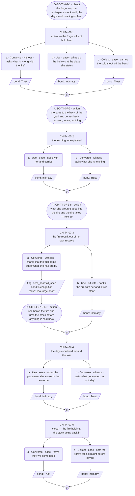
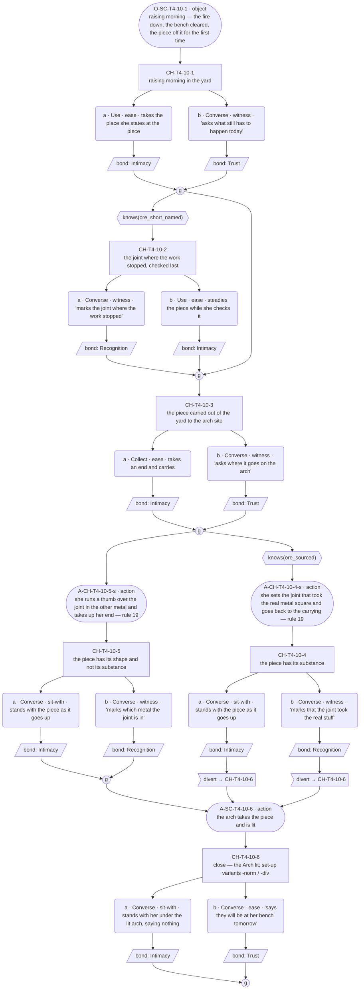

# `ilsa-forge-short` — v01

**This life only.** Ilsa is dealt Blacksmith this run (card approved + final 2026-07-25; role-goal: forge the Lantern Arch centerpiece), so the staging below is the forge and yard (`world:ilsas-forge`, ratified in [`../../../narrative-pipeline/npc-codex.md`](../../../narrative-pipeline/npc-codex.md)). The thread's identity — id, open question, the facet it opens — is ratified in [`../../../cast/ilsa-blacksmith-threads.md`](../../../cast/ilsa-blacksmith-threads.md). Everything here is the Blacksmith instance and does not survive a reshuffle.

**Open question:** The centerpiece cannot be finished out of her own yard — and asking is the thing she does not do.

**Status:** Architect brief complete, authored 2026-08-09. **Choice design ran 2026-08-09** — C1–C4 carry content blocks and mermaid graphs; 5 / 7 / 8 / 6 choice nodes; action slots placed. **GRAPHS APPROVED by Roc, 2026-08-10.** **Prose written 2026-08-10** — C1–C4 line files exist in `lines/`. Structural changes remain a re-spec through Roc, not a quiet edit. **Reconciliation pass 2026-08-09:** three of the file's four open items are closed in place by Roc's rulings of that date (`ex-ore-seam`'s screen, `ore_sourced`'s dual nature, C4's divert); one contradiction inside the brief is newly raised and stays open.

**This thread is the role-goal's *tension*, never the role-goal.** A role-goal is a situation, not a thread (ruled 2026-08-09 — Roc); the licensed exception is a row stating the want-×-role-goal tension, in the `toby-feast-short` form, and that is this row. The Arch itself stays `world-`; the centerpiece is the pressure, and what this thread follows is a woman who gives and does not ask, put in front of a shortfall she cannot close out of her own hands.

**It shares one event with [`ilsa-kin-no-show`](ilsa-kin-no-show.md), deliberately.** Bram was bringing the special ore and did not come, so his no-show and the Blacksmith mishap are **one event** (`offstage:bram`, amended 2026-08-09). `ilsa-kin-no-show` reads it as an absence she covers; this thread reads it as work stopped by a thing she will not ask for. **The ore's non-arrival is declared once, in `ilsa-kin-no-show` C1, and referenced free here** — reference is free and uncapped, and a delta slot re-declaring it is a structural flag (`guardrails.md` check 3). Nothing in this thread may re-declare it, and **nothing here may re-spec `ilsa-kin-no-show`**, whose C2 is under separate repair.

---

## Thread shape

**One shortfall in three states, plus its outcome, across four conversations.** The shortfall escalates rather than accumulates — this is a chain, not `ilsa-kin-no-show`'s diamond, and the difference is the point: her absence-thread accrues instances of one known fact in any order, and her work-thread runs one gap that gets larger until it cannot be substituted. Each state is a thing she cannot make, and each is answered the same way — she puts her own in its place and re-makes the plan without remark — until the last one, which her own hands cannot cover.

Three reveals across **four conversations**.

| # | Reveal | Fact | Card field | Staged this life as |
|---|---|---|---|---|
| R1 | Substitution is her answer to a shortfall — she spends her own rather than ask | cast | `conviction` · `essence_descriptor` | The forge will not hold heat; she rebuilds the fire out of a reserve she had put by for herself |
| R2 | The line she does not cross — her name goes in the giving column of the raising sheet and never in the asking one | cast | `conviction` · `deflection_target` | A part is missing, and the public sheet that exists for exactly this ask goes by her unused |
| R3 | The shortfall she cannot substitute her way out of | situation (referenced from `ilsa-kin-no-show` C1, **no new cast fact**) | `conviction` costed | The special ore is not in town, the work stops at a fitting-place it cannot pass, and she still does not ask |

**Conversation allocation** — the Architect's call, and the constraint the Choice designer works inside:

| Conversation | Scene id | Carries |
|---|---|---|
| C1 | `SC-T4-07` | R1 — the forge will not hold heat; she rebuilds it out of her own reserve and re-orders the day around the loss |
| C2 | `SC-T4-08` | R2 — a part is missing. The raising sheet is in the yard, a public instrument for asking, and she uses it only to put hands *in* |
| C3 | `SC-T4-09` | R3 — the ore is not in town. Work stops at a fitting-place it cannot pass; the yard gets rearranged around the gap instead |
| C4 | `SC-T4-10` | No new reveal — **the outcome**, in one of two authored forms (below) |

Scene ids are the next free block on T4 (The Workshop) after `SC-T4-01`/`-02` (wired) and `SC-T4-03`–`-06` (reserved by `ilsa-kin-no-show`); **proposed, for downstream to confirm against the id registry** — code mints ids, this table only reserves the shape.

**C4 is a real close with two authored endings, and neither is a loss state** (`world:centerpiece-wrong-metal`, ratified 2026-08-09 — Roc).

- **Shape without substance (the ungated outcome).** The ore never came, so the centerpiece is not finished — it is *shaped*: right silhouette, wrong material, worked in replacement metal she sourced herself, and she knows it. She does not announce it and did not ask for help sourcing it. That is the thread's whole cost, and it is the outcome the thread was built to be able to reach. **A design that treats it as failure has the thread backwards.**
- **The Arch completed (`knows(ore_sourced)`).** If the player sourced the real ore, the piece can actually be finished. She does not thank them for it — per her card the giver is put down for the raising, not thanked — and the substance arrives without the asking ever having happened, which is the only way she could have received it.

**What the thread does not do.** It does not repair the family, deliver Bram, or make her ask (`canon_flags` 3 — the player is a witness; ease, never fix). The player may hand her the ore; no option, examinable or outcome makes her request it. She is not wrong to work around the gap, and nothing here corrects her.

---

## What happens across the thread

A woman who has never in her life asked for anything is given a job that cannot be done out of her own yard. First the fire will not hold, and she feeds it out of what she had put by — nobody is told, and the day is quietly re-planned around the loss. Then a part is missing, and there is a sheet in the yard with a column for exactly this, and her name goes in the other column. Then the thing she cannot substitute: the special ore is not in town, the work stops at a place it cannot pass, and she rearranges the yard around the gap rather than name it. And then the raising comes anyway, and the Arch is lit over a piece that either has its substance or only its shape — because someone else went and got it, or because nobody did and she finished it out of what she had.

**Where it leaves off on day 5: closed, both ways.** This thread closes. What it does not do is resolve the want — the woman who does not ask still has not asked, in either ending, and the ending where the player fetched the ore is not a conversion. It is the world doing for her once what she does daily for everyone else, unasked, which is the family-pressure pool's second row running with the player as the non-relative. **Nothing may point at that.**

---

## Dependency order

    C1 (R1) ──> C2 (R2) ──> C3 (R3) ──> C4 (outcome)

- **C1 needs nothing.** Zero-knowledge entry. It must work as the player's first contact with Ilsa this week — no sibling thread, no prior scene, no `ilsa-kin-no-show` beat assumed.
- **C2 needs C1 complete.** The sheet only reads as a refusal once the player has seen her cover a shortfall out of her own pocket. Reached cold it is a blacksmith signing up for a work party.
- **C3 needs C2 complete.** The ore is the third state of the same gap; without the first two it is a supply problem, not a cost.
- **C4 needs C3 complete.**
- **Entry gates are completion only — never a knowledge flag.** `toby-the-shelf` C4 gates entry on a missable knowledge flag and the standing note under its C2 records the cost: a reveal lost outright rather than shallowed, which R5 forbids. Here every knowledge flag gates content *inside* a conversation; all three reveals are delivered by situation, so the fallback player receives every one of them in full and only the depth varies.

### Flags

| Flag | Set by | Read by |
|---|---|---|
| `heat_shortfall_seen` | C1 (marking that the fire is being fed out of her own reserve — the spoken deep pick), or the `ex-forge-fire` examinable **(PROPOSED — not built)** | C2, C3 |
| `sheet_giving_only` | C2 (marking which column her name is in — the spoken deep pick), or the `ex-raising-sheet` examinable **(PROPOSED — not built)** | C3 |
| `ore_short_named` | C3 (marking that the work has stopped for a thing she will not ask for — the spoken deep pick), or the `ex-fitting-place` examinable **(PROPOSED — not built)** | C4 |
| `ore_sourced` | **Outside this thread** — the cave ore pickup / key-item delivery, `ex-ore-seam` **(PROPOSED — not built; F7, the cave, ruled by Roc 2026-08-09)**. **`ore_sourced` is both a knowledge flag and a key item** (ruled by Roc, 2026-08-09): the key item comes from the cave, and the gate stays `knows(ore_sourced)` | C4 |

**Every flag has a reader.** No flag may be added without one, and the Choice designer may not add one at all — the table is part of the brief.

`ore_sourced` is the only flag this thread reads that no conversation in it sets, and that is deliberate: the branch is earned in the world, not in the room. Code owns the mechanism by which delivering the ore records the flag; this brief only declares that C4 reads `knows(ore_sourced)`. **Ruled 2026-08-09 (Roc): the two are not alternatives — `ore_sourced` is a knowledge flag *and* a key item.** The key item is what the player carries out of the cave; the flag is what the gate reads. The gate stays `knows(ore_sourced)`, inside the existing predicate vocabulary, and no predicate is added.

### Facts read per conversation

C1 reads none · C2 reads one (`heat_shortfall_seen`) · C3 reads two (`heat_shortfall_seen`, `sheet_giving_only`) · C4 reads two (`ore_short_named`, `ore_sourced`). R6's ceiling is two. **C4 does not additionally read `sheet_giving_only`** — wanting a third fact is a gate decision, not the designer's.

---

## Delta declarations

Stated against [`../../../cast/ilsa.md`](../../../cast/ilsa.md)'s `delta_rule` (floor one, ceiling two cast facts solo, situation uncapped, reference free). The second apron, the empty bench-end, the count, and the centerpiece are already reference-free from the gated 2026-07-25 run and from `ilsa-kin-no-show` C1.

| Conversation | `delta_cast` | `delta_situation` |
|---|---|---|
| C1 | She keeps a reserve of her own put by against her own winter, and spends it on a shortfall rather than ask anyone for theirs — **one** | The forge will not hold heat this week; the day's plan is re-made around the loss |
| C2 | Her name goes on the raising sheet only in the column that gives hands; she has never written in the other one — **one** | A part the centerpiece needs is missing, and the sheet stands in the yard while the work waits |
| C3 | None — "quietly covers a gap so no one notices" is `essence_descriptor`, reference; the ore's non-arrival is `ilsa-kin-no-show` C1's declared situation and is **referenced, never re-declared** (check 3) | The work stops at the fitting-place; the yard is rearranged around the gap |
| C4 | None — the outcome is situation, and re-declaring the reserve or the sheet is exactly what the delta rule flags | Raising day. Either the piece finished in replacement metal — the shape and not the substance — or, on `knows(ore_sourced)`, the piece completed in the real material |

Every scene clears the floor. Two cast facts total across four conversations, both in the first half, both of the same class the card names — a possession and a line she does not cross — and neither is a feeling, an interpretation, or a statement of her stance (`canon_flags` 8: she never states her own trait).

**No `delta_relational` anywhere in this thread.** No second carded soul is present in any of the four conversations; Bram is offstage and stays offstage.

---

## Constraints on the conversation design

- **Entry gate is the previous conversation in this thread completing. Nothing else.** Completion gates the sequence; knowledge gates the content (R3).
- **There is no negation in the predicate vocabulary.** `not knows(x)` is not a predicate and never was — the resolver parses `^knows\(([^)]+)\)$`, so a gate using one compiles to nothing and the branch is silently unreachable. This is what broke `ilsa-kin-no-show` C2 and it may not be repeated here. **Express every not-knowing case as the ungated fallback**: the knowing case takes the gated node, everyone else walks the path rule 4 already required to exist.
- **C4's two endings are mutually exclusive, so the split is a `divert`, not a negation.** The shape-without-substance outcome is the **ungated spine** — the path every player walks who did not source the ore. The completed-Arch outcome is a **gated node, `knows(ore_sourced)`, that diverts past the replacement-metal beats to the close.** This is the one shape that expresses "either/or" inside a vocabulary with no `not`. **Approved by Roc, 2026-08-09**, and separately **sanctioned under the schema's five-condition divert test** (`../../../narrative-pipeline/templates/choice-node-schema.md`, ruled 2026-08-09, superseding the old "flags every divert" rule) — the five conditions are checked one by one in C4's content block. It is not re-escalated.
- **Every incoming state must walk without dead-ending.** C3 and C4 each read two facts: four states apiece, all authored.
- **One state is always the fallback** — "you finished the last conversation and learned nothing from it." It is a real state a real player reaches, and here it still receives all three reveals, because all three are delivered by situation.
- **A missed fact makes the thread shallower, never rerouted** (R5). Picks decide depth, never receipt.
- **Missed things stay in the world.** Every closed path names the examinable that reopens it — see the table below. Nothing catches an undeclared pickup: check 11 joins declarations to builds, so a thread declaring nothing passes every gate with its paths closed permanently.
- **Options are equal weight.** Marking a substitution says out loud what she arranged precisely so nobody would have to; letting it stand respects the arrangement and costs the same beat. No option is the correct answer; no counter keys off repetition (guardrail 10, `guardrails.md` check 2).
- **Bond weights:** Recognition 3, Trust 2, Intimacy 2. The deep path records Recognition, the shallow path Intimacy or Trust.
- **No `bond_band` predicates anywhere in this thread.** `arc_turn_bond_gate` is her only bond-gated payoff (`canon_flags` 11); a second is drift. Their absence is canon barring a device, which is a pass, not a gap — record it and move on.
- **Nothing here reaches for the echo.** `ilsa_second_apron` fires on a bond level, is voiced by Mara, lives in its own scenes and is the seam pass's work. No conversation may fire it, gate on its bond level, or move the apron.
- **Nobody asks on her behalf, and nobody tells her to ask.** A player option that instructs, advises, or nudges her toward asking is the defect this thread would die of — it converts a witness into a fixer (`canon_flags` 3) and makes the shortfall a problem to solve rather than a cost to see. The player may **do** (fetch, work, source the ore); the player may **mark**; the player may not counsel.
- **Marking, not naming** (ruled 2026-08-09 — Roc). A mark places a fact and stops — no verdict, no motive, no consolation. "The sheet has your name in one column" marks. "You never ask anyone for anything" names. Naming is barred to everyone, including her.
- **No third party names the shortfall either.** Bex is nowhere near this thread; his licence to name a feeling is precisely the device this shape refuses.
- **No sanctioned long run anywhere in this thread** (rule 20). Her 75-word licence covers lineage and household history only, and there is no lineage here — a run about the work, the ore, or the shortfall is barred twice over (`voice_enforcement`, failure mode 3). Zero marked runs, which matches the corpus rate.
- **A shortfall converted to arithmetic is Toby's move, not hers** (failure mode 4). State-the-shortfall-then-allocate with a number in it is his licensed line and was already caught once on this card (line 2's 2026-08-07 rewrite). Her answer to a shortfall is **placement and substitution**, not accounting.
- **Heavy beats take her carded shape:** a fragment, then an observable act — a reach that stops partway, a plate set and left — then a shorter fragment or nothing at all. The weight beat of this thread is C3's stopped work and C4's finished-wrong piece, and neither may be carried by a longer line.
- **Certainty stays warm** (`canon_flags` 5, failure mode 1). Her arrangements are inclusion as standing fact, never orders, and never brusqueness. A line where refusing help reads as pride, prickliness or rebuff is a defect: she is not refusing, she is not asking, and those are different things.
- **The flat end is a pause, not a chill** (`canon_flags` 6).
- **No World Truth is stated in-scene** (`canon_flags` 8), and no scene grants her a fix as a reward.
- **The set place is narrative, never mechanical** (`canon_flags` 14). Her inclusion produces no `gift` key item and writes no key-item record. **The ore is the reverse direction and is legitimate**: a `gift` key item runs player → NPC only, which is exactly what sourcing the ore is.

### Pacing

A thread may be entered **once per time slot**; the day's opening slot belongs to the festival arc; later slots allow multiple threads (GP-93). Four conversations fit in two days minimum.

**Nothing here may assume which slots, which days, or how much clock separates them.** The shortfall's three states are ordered by the thread, not by the calendar, and C4 lands on raising day whenever the player arrives at it. A player may take all four across two days or spread them over five.

### Id conventions

Per [`../../../narrative-pipeline/templates/id-label-convention.md`](../../../narrative-pipeline/templates/id-label-convention.md), binding on every id minted after 2026-08-09.

Choice nodes `CH-T4-07-1`, `-2`, … · options `-a`, `-b` · player line `L-CH-T4-07-1-a-p` · response `L-CH-T4-07-1-a-r1`. Code mints final ids; these reserve shape only.

- **Every id carries a human-readable label at first mention in prose** — the id in backticks, an em dash, the gist verbatim from the mermaid label. One gist per id, minted once, in the graph.
- **Any id whose tail crosses into a nested child carries the segment readout**, one `›` per segment, with the word *child* mandatory: `CH-T4-07-2-a-1-b` (node 2 › option a › child 1 › option b).
- **Variant selectors:** path variants are `-norm` (gather) / `-div` (divert) and nothing else, ever — C4's divert is where this thread will need them. State variants take the **flag name verbatim**, two flags joined by `-and-`. No bare base id sits beside variants. A slot wanting both a path and a state variant surfaces to Roc.

### Proposed examinables

**PROPOSED — not built. None of these exists in `tools/resolver/data/screen-specs.json` today.** Downstream wires them; until then every pickup path naming them does not work, and `node tools/resolver/src/cli.ts check-examinables --threads …` will flag them as not-built, which is the legitimate mid-authoring state. Proposing examinables is legitimate and part of the writing pass (Roc, 2026-08-04); asserting one exists is not.

| id | Screen | Sets | Reopens |
|---|---|---|---|
| `ex-forge-fire` | T4 | `heat_shortfall_seen` | C1's closed path — a player who never marks what the fire is being fed with. It is the only route into C2's and C3's deep beats for that player, and only while those conversations are still unplayed |
| `ex-raising-sheet` | T4 | `sheet_giving_only` | C2's closed path — a player who never reads which column her name is in. Reopens C3's and C4's deep beats, and only while they are unplayed. (`world:arch-raising` already establishes the sheet as a public standing object) |
| `ex-fitting-place` | T4 | `ore_short_named` | C3's closed path — a player who never marks the stopped work. Reopens C4's deep beat. The fitting-place the piece cannot pass is already staged as an object slot in `ilsa-kin-no-show` C1; this makes the same thing examinable |
| `ex-ore-seam` | **F7 — the cave** (ruled by Roc, 2026-08-09) | `ore_sourced` | Not a reopener of a conversational path but the **branch's entry** — the only route to C4's completed-Arch outcome. Declared here because C4 reads the flag it sets, and because an undeclared pickup is invisible to check 11 by construction |

T4's wired examinables today are `tools` (`clue_tier: hard-key`, `region: r_tools`) and `recipe_board` (`hard-key`, `r_recipe_board`). **Neither is reused**: `tools` and `recipe_board` are hard-key examinables already carrying their own function, and overloading one to set a thread flag would make the pickup depend on a lock the thread does not own. Verified against `tools/resolver/data/screen-specs.json`, 2026-08-09.

**`ex-forge-fire` and `ex-raising-sheet` are load-bearing.** The chain means a player who marks nothing in C1 reaches C3 with both gated beats shut, and C4 with one. The pickups are what make R5 true for this thread rather than assumed.

**`ex-ore-seam` is the most load-bearing declaration in the document.** Without it there is no route to the second ending at all, and the branch Roc ratified on 2026-08-09 exists only in prose. Its screen was ruled **F7, the cave** by Roc on 2026-08-09; it remains PROPOSED and unbuilt.

---

## Conversations

**For the Choice designer.** One section per conversation, each with a content block and a mermaid node graph. **Roc approves the shape before any prose is written.**

The content block says what is open, what is closed and what she reveals, per incoming state. The graph shows the choice nodes, their gates, the options and where each rejoins. **Action-slot convention as in [`toby-the-shelf.md`](toby-the-shelf.md):** description beats are stadium shapes, `A-` (action) / `O-` (object) ids, suffixed `-s` (set-up interleave) or `-r` (response run); the label carries the slot id, type and a structural gist, and Lines writes the words.

**Devices canon barred, recorded once so their absence is not read as a gap** (choice-designer contract, "a thread's canon may bar a device"). **Bond-band variants** are barred by `canon_flags` 11 — `arc_turn_bond_gate` is her only bond-gated payoff. **Non-`knows` predicates** are barred by this thread's own staging: `npc_present()` has nobody to name (no second carded soul appears anywhere, Bram is offstage and stays offstage) and `day >= n` contradicts the pacing rule that nothing may assume days or slots. So rule 16's variety runs on the three devices left: **nesting** (C2), a **`divert`** (C4, Architect-specified and approved by Roc 2026-08-09), and **three-option nodes** (C1, C3). Each conversation carries a different one, and no two share a skeleton.

**Choice-node counts: C1 5 · C2 7 · C3 8 · C4 6.** Seed 6, range 4–9, no two alike (rule 15). The counts rise with the shortfall and settle at the close, which is the chain the thread shape asks for.

### C1 — `SC-T4-07`

**Carries R1. Reads no prior facts — one incoming state (zero knowledge). Must work as the player's first contact with Ilsa this week, with no sibling thread and no `ilsa-kin-no-show` beat assumed. 5 choice nodes, all top-level, all ungated. Variety device: a three-option node (node 1). Action layer: 4 description slots (3 `action`, 1 `object`) against ~13 dialogue slots on the deep walk — ratio ≈ 1:3.3. Carded souls present: Ilsa only. No walk-ons.**

**Content block.**

- **Incoming state: zero knowledge (the only state).** All of R1 is scene business and arrives whatever the player picks: the forge will not hold heat, she fetches from the back of the yard without saying what from, what she brings goes into the fire, and the day's work is re-ordered around the loss. Nothing is gated, because nothing prior exists to gate on. Picks decide depth only.
- **Her answer to the shortfall is placement and substitution, never accounting.** No node lets her state the shortfall and then allocate against a number — that is Toby's licensed move and was caught once on this card already (`voice_enforcement`, failure mode 4). She re-orders the day and puts people somewhere; nothing is counted out loud.
- **Node 1 (`CH-T4-07-1` — arrival; the forge low, the day's work waiting on heat it has not got; ungated, three options).** First contact. Ask what is wrong with the fire (spoken — records Trust; she answers with what the day now is, not with a diagnosis), take up the bellows at the place she states (deed — records Intimacy; she does not offer the place, she states it, and the telling is warm because the place was already theirs), or carry the cold stock off the bench out of the way (deed — records Trust). All three record. Equal weight: asking turns the morning into talk, the bellows joins the work, moving the stock clears the way for whatever she decides — none is the correct read of a yard whose fire is down, and none of the three is what the conversation is about.
- **Node 2 (`CH-T4-07-2` — she goes to the back of the yard and comes back carrying, and does not say what she has gone for; ungated).** Go with her and carry (deed — records Intimacy) or ask what she is fetching (spoken — records Trust; the attention turned on her is answered by putting the asker somewhere — `deflection_target` — and the question about the fuel is left standing without ever being refused). Both record.
- **Node 3 (`CH-T4-07-3` — what she brought goes into the forge, and it is her own store, put by against her own winter; ungated — the deep pick and the conversation's weight beat).** Mark that the fuel came out of what she had put by (spoken — **sets `heat_shortfall_seen`**, records Recognition, moves the thread) or bank the fire with her and let it stand (deed — records Intimacy). **Marking, not naming:** the option places the fact — this came out of her own store — and stops. No verdict, no motive, no consolation, and nothing about what it says of her. Her response neither confirms a stance nor defends the choice: a flat fragment, then the fire is banked and the stock turned. **She does not state her own trait** (`canon_flags` 8) and is given no beat in which she could. Equal weight: marking says out loud what she arranged precisely so nobody would have to, and turns attention on her, which she deflects; banking the fire respects the arrangement and spends the same beat.
- **Node 4 (`CH-T4-07-4` — the day's plan re-made around the loss; she re-orders the work and puts the player somewhere in the new order; ungated).** Take the new placement (deed — records Intimacy) or ask what got moved out of today (spoken — records Trust; the answer is tomorrow's and today's arrangement stated flat, already decided, and **not a tally of what the week has cost** — the recent span comes back rounded off, `precision_profile`'s loose half). Both record.
- **Node 5 (`CH-T4-07-5` — close; the fire holding, the centerpiece stock going back into it; ungated).** Say they will come back (spoken — records Trust; she answers with a placement, already decided) or set the yard's tools straight before leaving (deed — records Intimacy). Both record. **The flat end is a pause, not a chill** (`canon_flags` 6).
- **No accrual.** Nothing keys off repeated selection; `heat_shortfall_seen` is set-once knowledge, not a tally, and no option's repetition is threshold-bearing.
- **Closed path.** A player who never marks where the fuel came from leaves without `heat_shortfall_seen`: `CH-T4-08-2` — the second thing covered out of her own shop — and `CH-T4-09-2` — the fire she made up, running for work that has stopped — never open. The fire stays in the world: the proposed `ex-forge-fire` examinable (T4, **PROPOSED — not built**) sets the flag later, and only while C2 and C3 are unplayed. The shallow run still delivers first contact, the whole of R1 and five full beats.
- **Action slots (rule 18).** Four, typed and placed; Lines writes them:
  - `O-SC-T4-07-1` (`object`, scene opening, before node 1) — the forge low, the centerpiece stock cold on the bench, the day's work laid out waiting on heat. R1's surface arrives as a thing seen before anyone speaks.
  - `A-SC-T4-07-2` (`action`, spine, node-1 gather → node 2) — she goes to the back of the yard and comes back carrying, without a word about where she went.
  - `A-CH-T4-07-3-s` (`action`, inside node 3's set-up) — what she brought goes into the fire and the fire takes. Part of the rule-19 build below; a spoken slot cannot carry it, because it is a thing she does and never mentions (check 8).
  - `A-CH-T4-07-3-a-r` (`action`, inside node 3 option `-a`'s response run) — she banks the fire and turns the stock before anything is said back. The gap between the mark and her answer is this slot.
- **Rule-19 build — node 3, the conversation's weight beat.** Built action → fragment → action → shorter fragment: `A-CH-T4-07-3-s` (her own store going into the forge) → the player's mark on option `-a` (its own ≤12-word fragment) → a short flat fragment from her, the fact confirmed and nothing added → `A-CH-T4-07-3-a-r` (the fire banked, the stock turned) → a shorter fragment: the day's placement, declarative, complete. Nothing explains, defends or consoles (failure mode 2). On option `-b` the run closes on the action slot with the substitution unremarked. **The weight never moves into a longer line.**
- **No sanctioned long run (rule 20).** Barred throughout this thread: her 75-word licence covers lineage and household history only, and a run about the work, the fire or the shortfall is barred twice over. None placed.
- **Walk-ons (rule 21).** None.

### C2 — `SC-T4-08`

**Carries R2. Reads one prior fact: `heat_shortfall_seen`. Two incoming states. 7 choice nodes (6 top-level + 1 nested). Variety device: nesting to depth 1, under the sheet. Action layer: 5 description slots (3 `action`, 2 `object`) against ~18 dialogue slots on the deep walk — ratio ≈ 1:3.6. Carded souls present: Ilsa only. No walk-ons — the neighbours signing the sheet are business inside the object and action slots, and nobody speaks.**

**Content block.**

- **Scene business, both states.** The fire holds now; a part the centerpiece needs is not in the shop. The raising sheet stands on its post in the yard, a public instrument with a column for hands offered and a column for hands wanted, and names are going down it. She writes hers in the giving column and hands the sheet on, and the missing part goes unwritten. Then she takes another way at the same joint out of her own stock. **All of R2 is situation** — it happens in front of every player who reaches this conversation, whatever they pick. What the picks decide is whether the player has read the columns closely enough to hold which one her name is in.
- **She never states the line she does not cross, and no option asks her to.** She has no beat in which she explains the sheet, declines the other column, or says what she will and will not do. Her side of R2 is entirely *where the name goes*, and the design gives her nothing else. **Nobody asks on her behalf and nobody tells her to ask** — no option instructs, advises or nudges (`canon_flags` 3). The player may do, and may mark.
- **Node 1 (`CH-T4-08-1` — arrival; the fire holding, the piece part-shaped, one thing not in the shop; ungated).** Ask what is missing (spoken — records Trust; she names the part as a thing the work needs and moves straight to what happens next) or take the place at the bench she states and work (deed — records Intimacy). Both record.
- **Node 2 (`CH-T4-08-2` — the second shortfall read against the first: she is again making a gap up out of her own shop; gated `knows(heat_shortfall_seen)`).** Reference beat, no new fact. Mark that the fire and this both came out of her own shop (spoken — records Recognition) or take up the covering work beside her (deed — records Intimacy). **The not-knowing case is the ungated fallback, never a negated gate:** if the flag is unset the node auto-skips to its gather and the player walks the rest of the conversation, which is the path rule 4 already required. **This is a knowledge gate, not a counter** — it reads a set-once flag and reads it once; nothing here keys off how many times anything was picked (check 2).
- **Node 3 (`CH-T4-08-3` — the sheet on its post, names going down it; ungated).** Read down the sheet where it stands (deed — records Intimacy; **opens the nested child**) or ask who else is down for hands (spoken — records Trust; she answers by placing people, which is the answer and also the deflection). Both record.
  - **Nested child (`CH-T4-08-3-a-1` (node 3 › option a › child 1) — the two columns close up: her name in the giving one, more than once, and never in the other; the deep pick).** Mark which column her name is in (spoken — **sets `sheet_giving_only`**, records Recognition, moves the thread) or put their own name in the giving column beside hers (deed — records Intimacy). **Marking, not naming:** the option states which column and stops. It may not say what that means about her, may not observe that she never uses the other one as a fact about her character, and may not console. Her response is `canon_flags` 6's ground: a flat fragment confirming where the name is, an act, and then the sentence that would have to explain the other column does not arrive. **It is a pause and not a chill** — nothing sharpens, nothing speeds up, the warmth is unbroken through it. Equal weight: marking says out loud what the columns say silently and turns attention on her; signing beside her joins the giving and costs the same beat.
  - **Why nesting and not a flag-gated sibling.** The close reading of the columns exists *only* as the content of having read the sheet. As a flag-gated sibling node its set-up would print ungated — every player who never looked at the sheet would still read "her name in the one column and not the other" as framing — and everyone else would take a silent skip past it. Nesting contains the beat inside the option that earns it and removes the flag, the guard and the fallback line with it.
- **Node 4 (`CH-T4-08-4` — she puts her name down in the giving column, hands the sheet on, and the missing part goes unwritten; ungated — the conversation's weight beat).** Hand the sheet on to the next pair of hands (deed — records Intimacy) or ask what the missing part does in the piece (spoken — records Trust; she answers with the work, flat, and **not with arithmetic** — no shortfall converted to a number). Both record. **The weight beat here is an act, not a line:** `A-CH-T4-08-4-s` below. A spoken slot cannot carry it at all, because the whole content is a thing she does and does not mention (check 8).
- **Node 5 (`CH-T4-08-5` — she takes another way at the same joint, out of her own stock; ungated).** Work the substitute with her (deed — records Intimacy) or ask whether the other way holds (spoken — records Trust; the answer is decided, warm and short, and she is **not refusing help — she is not asking**, which is a different thing, failure mode 1). Both record.
- **Node 6 (`CH-T4-08-6` — close; the sheet still standing with the one column unused, the work going on; ungated).** Say they will be at the raising (spoken — records Trust; she answers with a placement, already decided) or set the sheet straight on its post before leaving (deed — records Intimacy). Both record.
- **Incoming state: `heat_shortfall_seen` (deep).** All seven nodes reachable; the walk is 1 → 2 → 3 (with child, on option `-a`) → 4 → 5 → 6.
- **Incoming state: fallback (finished C1, marked nothing).** Node 2 auto-skips; the walk is 1 → 3 → 4 → 5 → 6, with the child still reachable and `sheet_giving_only` still settable. Five beats, the whole sheet, the whole substitution. **Shallower, not rerouted** — what the fallback player loses is only the *pairing*: they see the name go in the giving column without having seen the fire fed out of her own store first.
- **No accrual.** No counter, tally or repetition-keyed unlock; both flags in play are set-once knowledge.
- **Closed paths.** Missed `heat_shortfall_seen`: the proposed `ex-forge-fire` (T4, **PROPOSED — not built**) reopens node 2 and `CH-T4-09-2`, and only while those conversations are unplayed. Missed `sheet_giving_only` (never read down the sheet, or read it and took the child's `-b`): the proposed `ex-raising-sheet` (T4, **PROPOSED — not built**) reopens `CH-T4-09-5` — the sheet still up, her name in the one column — because the sheet is a standing public object that persists in the yard.
- **Action slots (rule 18).** Five description beats:
  - `O-SC-T4-08-1` (`object`, scene opening, before node 1) — the fire holding, the centerpiece part-shaped on the bench, and the one thing that is not in the shop.
  - `O-SC-T4-08-3` (`object`, spine, node-2 gather → node 3) — the raising sheet on its post, two columns, names down the one side. The instrument arrives as a thing seen before anybody speaks, which is what makes node 4 readable.
  - `A-CH-T4-08-4-s` (`action`, inside node 4's set-up) — she writes in the giving column, hands the sheet on, and the other column is not touched. **R2's whole mechanism is this act.**
  - `A-CH-T4-08-3-a-1-a-r` (node 3 › option a › child 1 › option a › response) (`action`, inside the child option `-a`'s response run) — she squares the sheet on its post and goes back to the bench. The pause after the mark is this slot, and nothing follows it.
  - `A-SC-T4-08-5` (`action`, spine, node-4 gather → node 5) — she takes the other way at the joint out of her own stock, without announcing that it is a substitution.
- **Rule-19 build — the child node, the mark on the columns.** Built act → fragment → action → nothing: `A-CH-T4-08-4-s` is the scene's act, and the mark's own run is the player's ≤12-word fragment → a short flat fragment from her, the column confirmed and nothing added → `A-CH-T4-08-3-a-1-a-r` (the sheet squared, the turn back to the bench) → **no closing fragment**. The sentence runs out and the silence stands as the last beat of the option. On the child's option `-b` the run closes on the deed with the columns unremarked.
- **No sanctioned long run (rule 20).** Barred throughout this thread; none placed.
- **Walk-ons (rule 21).** None. The neighbours putting their names down are business inside `O-SC-T4-08-3` and `A-CH-T4-08-4-s` and speak no line; if Lines needs one to speak, that is a re-spec through Roc, not a quiet addition.

```mermaid
flowchart TD
  OS1(["O-SC-T4-08-1 · object<br>the fire holding, the piece part-shaped, the one thing not in the shop"])
  OS1 --> N1["CH-T4-08-1<br>arrival — a part the centerpiece needs is missing"]
  N1 --> N1a("a · Converse · witness · 'asks what is missing'")
  N1 --> N1b("b · Use · ease · takes the place at the bench she states and works")
  N1a --> R1a[/"bond: Trust"/]
  R1a --> J1(("g"))
  N1b --> R1b[/"bond: Intimacy"/]
  R1b --> J1
  J1 --> G2{{"knows(heat_shortfall_seen)"}}
  G2 --> N2["CH-T4-08-2<br>the second gap, made up out of her own shop again"]
  N2 --> N2a("a · Converse · witness · 'marks that the fire and this both came out of her own shop'")
  N2 --> N2b("b · Use · ease · takes up the covering work beside her")
  N2a --> R2a[/"bond: Recognition"/]
  R2a --> J2(("g"))
  N2b --> R2b[/"bond: Intimacy"/]
  R2b --> J2
  J1 --> J2
  J2 --> OS3(["O-SC-T4-08-3 · object<br>the raising sheet on its post, two columns, names down the one side"])
  OS3 --> N3["CH-T4-08-3<br>the sheet standing in the yard"]
  N3 --> N3a("a · Collect · witness · reads down the sheet where it stands")
  N3 --> N3b("b · Converse · witness · 'asks who else is down for hands'")
  N3b --> R3b[/"bond: Trust"/]
  R3b --> J3(("g"))
  N3a --> R3a[/"bond: Intimacy"/]
  subgraph S3a["CH-T4-08-3-a"]
    C3["CH-T4-08-3-a-1<br>the two columns close up — her name in the one, never the other"]
    C3 --> C3a("a · Converse · witness · 'marks which column her name is in'")
    C3 --> C3b("b · Use · ease · puts their own name in the giving column beside hers")
    C3a --> RC3a[/"flag: sheet_giving_only<br>bond: Recognition<br>move: ilsa-forge-short"/]
    RC3a --> AC3r(["A-CH-T4-08-3-a-1-a-r · action<br>she squares the sheet on its post and goes back to the bench — the pause"])
    AC3r --> JC3(("g_CH-T4-08-3-a"))
    C3b --> RC3b[/"bond: Intimacy"/]
    RC3b --> JC3
  end
  R3a --> C3
  JC3 --> J3
  J3 --> AS4(["A-CH-T4-08-4-s · action<br>she writes in the giving column and hands the sheet on; the other column untouched — rule 19"])
  AS4 --> N4["CH-T4-08-4<br>her name goes in the giving column"]
  N4 --> N4a("a · Use · ease · hands the sheet on to the next pair of hands")
  N4 --> N4b("b · Converse · witness · 'asks what the missing part does in the piece'")
  N4a --> R4a[/"bond: Intimacy"/]
  R4a --> J4(("g"))
  N4b --> R4b[/"bond: Trust"/]
  R4b --> J4
  J4 --> AS5(["A-SC-T4-08-5 · action<br>she takes another way at the joint out of her own stock, unannounced"])
  AS5 --> N5["CH-T4-08-5<br>the substitute worked in"]
  N5 --> N5a("a · Use · ease · works the substitute with her")
  N5 --> N5b("b · Converse · witness · 'asks whether the other way holds'")
  N5a --> R5a[/"bond: Intimacy"/]
  R5a --> J5(("g"))
  N5b --> R5b[/"bond: Trust"/]
  R5b --> J5
  J5 --> N6["CH-T4-08-6<br>close — the sheet still up, the one column unused"]
  N6 --> N6a("a · Converse · ease · 'says they will be at the raising'")
  N6 --> N6b("b · Collect · ease · sets the sheet straight on its post before leaving")
  N6a --> R6a[/"bond: Trust"/]
  R6a --> J6(("g"))
  N6b --> R6b[/"bond: Intimacy"/]
  R6b --> J6
```

### C3 — `SC-T4-09`

**Carries R3 — situation, referenced from `ilsa-kin-no-show` C1 and never re-declared (check 3). Reads two prior facts: `heat_shortfall_seen`, `sheet_giving_only` — four incoming states, all authored. 8 choice nodes, all top-level — the thread's high count, because this is the conversation the whole chain has been escalating toward. Variety devices: a three-option node; two gates placed non-adjacently. Action layer: 5 description slots (3 `action`, 2 `object`) against ~17 dialogue slots on the deep walk — ratio ≈ 1:3.4. Carded souls present: Ilsa only. No walk-ons.**

**Content block.**

- **All four states.** The yard mid-work; the piece has come up to the fitting-place and will not pass it in the metal she has, because the special ore is not in town. **The ore's non-arrival is `ilsa-kin-no-show` C1's declared situation and is referenced here, never re-declared** — nothing in this conversation delivers it as new. What this conversation's `delta_situation` declares is the state change: the work stops, and the yard gets rearranged around the gap. R3 is delivered by situation, so the fallback player receives the whole of it; the two gated nodes decide only how much of the chain the player can hold behind it.
- **Nothing corrects her, and nobody names the shortfall.** No option instructs, advises or nudges her toward asking; no third party names it either — Bex is nowhere near this thread, and his licence to name a feeling is precisely the device this shape refuses. She is not wrong to work around the gap.
- **The two gates sit apart, at node 2 and node 5, and are never conjoined.** Each is a bare `knows()` the resolver can parse; there is no `&&` and no negation anywhere. Placing them apart rather than back-to-back is deliberate and is what makes this conversation an escalating chain rather than a pairing: each gated beat reads the shortfall *before it* against the one in the room, so the two single-flag states are structurally distinct from each other and neither collapses into the fallback.
- **Node 1 (`CH-T4-09-1` — arrival; the yard mid-work, the piece up to the fitting-place; ungated, three options).** Ask what is left to do (spoken — records Trust; the recent span comes back rounded off and the answer arrives as an arrangement rather than an account), take up the work at the place she states (deed — records Intimacy), or stand with the piece where it stops (deed — records Trust). All three record; none of the three is a reading of the stop, which is what node 3 is for.
- **Node 2 (`CH-T4-09-2` — the fire she rebuilt out of her own store is holding, and it is holding for work that has stopped; gated `knows(heat_shortfall_seen)`).** Reference beat, no new fact. Mark that the fire she made up herself is running for a piece that cannot go on (spoken — records Recognition) or keep the fire fed anyway (deed — records Intimacy). **Not-knowing is the ungated fallback:** the node auto-skips and the player continues at node 3.
- **Node 3 (`CH-T4-09-3` — the fitting-place; the piece will not pass it and she sets it down; ungated — the deep pick and the thread's weight beat).** Mark that the work has stopped for a thing that is not in town (spoken — **sets `ore_short_named`**, records Recognition, moves the thread) or set the piece down at the fitting-place and leave it where it stopped (deed — records Intimacy). **Marking, not naming:** the option states that the work has stopped and what for, and stops there. It may not say what she should do about it, may not observe that there is a way to get it, and may not console. Her response is a fragment, an act and then nothing — she runs out of sentence, and **nothing fills the gap** (failure mode 2).
- **Node 4 (`CH-T4-09-4` — the yard rearranged around the gap; the stopped piece moved off the bench and other work brought forward; ungated).** Carry the stopped piece to where she points (deed — records Intimacy) or ask what comes forward instead (spoken — records Trust; she answers with the new order, decided, and never with a count of what the week has cost). Both record. **This is the essence working:** the gap covered by placement so nobody has to remark on it.
- **Node 5 (`CH-T4-09-5` — the sheet still on its post, her name in the one column, while the work waits; gated `knows(sheet_giving_only)`).** Mark that the sheet is still up and her name is still in the one column (spoken — records Recognition) or square the sheet on its post and leave it (deed — records Intimacy). **This node is the thread's highest-risk beat and its option is a mark, not counsel.** It states where the sheet is and where the name is, and stops — it does not say she could use the other column, does not tell her to, and does not diagnose why she does not. A version of option `-a` that advises is the defect this thread would die of (`canon_flags` 3). Her response is the deflection doing its job: attention turned on her comes back as somebody getting put somewhere. Same skip rule when the flag is unset.
- **Node 6 (`CH-T4-09-6` — she works the parts of the piece that can still go on, and the gap is left as a gap; ungated).** Work the parts that can go on (deed — records Intimacy) or ask what the ore does in the piece (spoken — records Trust; her answer is the substance/shape distinction delivered as a fact about the work, which is what makes C4's two endings legible without either being announced in advance). Both record.
- **Node 7 (`CH-T4-09-7` — the end of the day with the piece where it stopped; she states tomorrow's order and puts the player in it; ungated).** Take the place she states (deed — records Intimacy) or say they will come back (spoken — records Trust). Both record.
- **Node 8 (`CH-T4-09-8` — close; the fire banked down for the night, the fitting-place left as it is; ungated).** Set the tools by the stopped piece straight (deed — records Intimacy) or ask what time the raising is (spoken — records Trust; she answers with the arrangement). Both record. Nothing here resolves, and no beat grants her a fix as a reward.
- **The four walks, traced.** Both flags: 1 → 2 → 3 → 4 → 5 → 6 → 7 → 8 (eight beats). `heat_shortfall_seen` only: 1 → 2 → 3 → 4 → 6 → 7 → 8 (seven — the fire held against the stop, the sheet unread). `sheet_giving_only` only: 1 → 3 → 4 → 5 → 6 → 7 → 8 (seven — the sheet held against the stop, the fire unread). Fallback, marked nothing: 1 → 3 → 4 → 6 → 7 → 8 (six beats, and the whole of R3 from the opening object slot). **No state dead-ends and no state sees zero content.**
- **No accrual.** No counter, tally or repetition-keyed unlock; the one flag set here is set-once knowledge.
- **Closed paths.** `ex-forge-fire` (T4, **PROPOSED**) reopens node 2 while C3 is unplayed; `ex-raising-sheet` (T4, **PROPOSED**) reopens node 5 while C3 is unplayed; a player who never marks the stop leaves without `ore_short_named` and the proposed `ex-fitting-place` (T4) reopens `CH-T4-10-2` while C4 is unplayed. The fitting-place persists in the yard, which is what makes that pickup honest rather than a convenience.
- **Action slots (rule 18).** Five description beats:
  - `O-SC-T4-09-1` (`object`, scene opening, before node 1) — the yard mid-work: the piece up to the fitting-place and no further, the fire running. R3's whole surface delivered to every state before anybody speaks.
  - `A-CH-T4-09-3-s` (`action`, inside node 3's set-up) — she brings the piece to the fitting-place, it does not pass, and she sets it down. **The thread's weight beat is this act**; a spoken slot cannot carry it (check 8).
  - `A-CH-T4-09-3-a-r` (`action`, inside node 3 option `-a`'s response run) — she moves the stopped piece off the bench before anything is said back.
  - `A-SC-T4-09-4` (`action`, spine, node-3 gather → node 4) — the yard re-arranged around the gap, other work brought forward, nothing said about any of it.
  - `O-CH-T4-09-5-s` (`object`, inside node 5's set-up, gated entry only) — the sheet on its post, names down the one column. Node 5's spoken option points at this slot.
- **Rule-19 build — node 3, the thread's weight beat.** Built action → fragment → action → nothing: `A-CH-T4-09-3-s` (the piece brought up, not passing, set down) → the player's mark on option `-a` (its own ≤12-word fragment) → a short flat fragment from her that stops partway → `A-CH-T4-09-3-a-r` (the stopped piece moved off the bench) → **no closing fragment**. The declarative that carries her fails to finish and nothing arrives after it — her pressure-tell, and not Toby's shorter sentence or Mara's displaced one (failure mode 4). On option `-b` the run closes on the deed with the stop unremarked. **No longer line carries any of it.**
- **No sanctioned long run (rule 20).** Barred throughout this thread, and this is the conversation where the temptation is greatest, because the subject is a piece of work with a history. A run about the work, the ore or the shortfall is barred twice over. None placed.
- **Walk-ons (rule 21).** None.

```mermaid
flowchart TD
  OS1(["O-SC-T4-09-1 · object<br>the yard mid-work — the piece up to the fitting-place and no further"])
  OS1 --> N1["CH-T4-09-1<br>arrival — the work up against the fitting-place"]
  N1 --> N1a("a · Converse · witness · 'asks what is left to do'")
  N1 --> N1b("b · Use · ease · takes up the work at the place she states")
  N1 --> N1c("c · Converse · sit-with · stands with the piece where it stops")
  N1a --> R1a[/"bond: Trust"/]
  R1a --> J1(("g"))
  N1b --> R1b[/"bond: Intimacy"/]
  R1b --> J1
  N1c --> R1c[/"bond: Trust"/]
  R1c --> J1
  J1 --> G2{{"knows(heat_shortfall_seen)"}}
  G2 --> N2["CH-T4-09-2<br>the rebuilt fire running for work that has stopped"]
  N2 --> N2a("a · Converse · witness · 'marks that the fire she made up is running for a piece that cannot go on'")
  N2 --> N2b("b · Use · ease · keeps the fire fed anyway")
  N2a --> R2a[/"bond: Recognition"/]
  R2a --> J2(("g"))
  N2b --> R2b[/"bond: Intimacy"/]
  R2b --> J2
  J1 --> J2
  J2 --> AS3(["A-CH-T4-09-3-s · action<br>she brings the piece to the fitting-place, it does not pass, she sets it down — rule 19"])
  AS3 --> N3["CH-T4-09-3<br>the work stops at the fitting-place"]
  N3 --> N3a("a · Converse · witness · 'marks that the work has stopped for a thing not in town'")
  N3 --> N3b("b · Use · sit-with · sets the piece down and leaves it where it stopped")
  N3a --> R3a[/"flag: ore_short_named<br>bond: Recognition<br>move: ilsa-forge-short"/]
  R3a --> AS3r(["A-CH-T4-09-3-a-r · action<br>she moves the stopped piece off the bench before anything is said back"])
  AS3r --> J3(("g"))
  N3b --> R3b[/"bond: Intimacy"/]
  R3b --> J3
  J3 --> AS4(["A-SC-T4-09-4 · action<br>the yard re-arranged around the gap; other work brought forward"])
  AS4 --> N4["CH-T4-09-4<br>the yard rearranged around the gap"]
  N4 --> N4a("a · Collect · ease · carries the stopped piece to where she points")
  N4 --> N4b("b · Converse · witness · 'asks what comes forward instead'")
  N4a --> R4a[/"bond: Intimacy"/]
  R4a --> J4(("g"))
  N4b --> R4b[/"bond: Trust"/]
  R4b --> J4
  J4 --> G5{{"knows(sheet_giving_only)"}}
  G5 --> OS5(["O-CH-T4-09-5-s · object<br>the sheet on its post, names down the one column"])
  OS5 --> N5["CH-T4-09-5<br>the sheet still up while the work waits"]
  N5 --> N5a("a · Converse · witness · 'marks that the sheet is still up and her name still in the one column'")
  N5 --> N5b("b · Collect · sit-with · squares the sheet on its post and leaves it")
  N5a --> R5a[/"bond: Recognition"/]
  R5a --> J5(("g"))
  N5b --> R5b[/"bond: Intimacy"/]
  R5b --> J5
  J4 --> J5
  J5 --> N6["CH-T4-09-6<br>the parts that can still go on"]
  N6 --> N6a("a · Make · ease · works the parts that can go on")
  N6 --> N6b("b · Converse · witness · 'asks what the ore does in the piece'")
  N6a --> R6a[/"bond: Intimacy"/]
  R6a --> J6(("g"))
  N6b --> R6b[/"bond: Trust"/]
  R6b --> J6
  J6 --> N7["CH-T4-09-7<br>the day's end — tomorrow's order stated, the player placed in it"]
  N7 --> N7a("a · Use · ease · takes the place she states")
  N7 --> N7b("b · Converse · ease · 'says they will come back'")
  N7a --> R7a[/"bond: Intimacy"/]
  R7a --> J7(("g"))
  N7b --> R7b[/"bond: Trust"/]
  R7b --> J7
  J7 --> N8["CH-T4-09-8<br>close — the fire banked, the fitting-place left as it is"]
  N8 --> N8a("a · Collect · ease · sets the tools by the stopped piece straight")
  N8 --> N8b("b · Converse · witness · 'asks what time the raising is'")
  N8a --> R8a[/"bond: Intimacy"/]
  R8a --> J8(("g"))
  N8b --> R8b[/"bond: Trust"/]
  R8b --> J8
```

### C4 — `SC-T4-10`

**No new reveal — the outcome, in one of two authored forms. Reads two prior facts: `ore_short_named`, `ore_sourced` — four incoming states, all authored. It does **not** read `sheet_giving_only`; wanting a third fact is a gate decision, not the designer's. 6 choice nodes, all top-level. Variety device: the `divert` — Architect-specified, and approved by Roc on 2026-08-09 as the shape that expresses two mutually exclusive endings in a vocabulary with no negation. Action layer: 4 description slots (3 `action`, 1 `object`) against ~13 dialogue slots on the longest walk — ratio ≈ 1:3.3. Carded souls present: Ilsa only. No walk-ons.**

**Content block.**

- **The split, drawn exactly as specified.** The shape-without-substance outcome is the **ungated spine** — node 5, which every player walks who did not source the ore. The completed-Arch outcome is a **gated node, `knows(ore_sourced)`** — node 4 — **both of whose options `divert` past node 5 to the close.** There is no negation anywhere: the not-sourced case is not a gate, it is the path rule 4 already required to exist. **The divert is approved by Roc, 2026-08-09, and is not re-escalated.**
- **The divert is sanctioned under the schema's five-condition test** (`../../../narrative-pipeline/templates/choice-node-schema.md`, ruled 2026-08-09 — the test supersedes the older rule that flagged every divert). Checked one by one:
  1. **Relocation, not a topic choice.** The piece leaves the yard for the arch site and goes up; both of node 4's options are the player going with it, not the player picking a subject. This is the condition that leans hardest on Roc's explicit approval, and it is recorded as leaning on it rather than as passing silently.
  2. **The reveal survives.** C4 carries no reveal at all — it is the outcome — and everything it re-touches was delivered as situation in C1–C3. Nothing is behind the divert.
  3. **The diverted branch records something.** Both of node 4's options record: Intimacy on `-a`, Recognition on `-b`. Neither is a cheap exit.
  4. **Every flag the divert skips is recoverable.** It skips no flag: **no flag is set anywhere in C4**, on either path.
  5. **It lands where every incoming state reaches.** Both diverts land on `CH-T4-10-6`, which the ungated spine also reaches through its own gather; all four incoming states arrive there.
- **Neither ending is framed as the correct one, and here is the machinery that keeps it that way.** (1) **The two endings are structurally identical**: node 4 and node 5 carry the same option shapes — one deed that stands with the piece as it goes up, one spoken mark on what the joint is made of — and record the same pair, Intimacy and Recognition. Neither carries more, neither carries `canon_write`, and the rank rule (check 10) is clean. (2) **Both reach the same close node**, `CH-T4-10-6`, which differs only by a set-up variant, so no ending gets a longer or fuller ending than the other. (3) **The spine is the default, not the failure**: it is the ungated path, the one the thread was built to be able to reach, and nothing in the design apologises for it or treats the piece as unfinished — it is finished, in replacement metal she sourced herself. (4) **No response scolds the other outcome**, and no beat anywhere states that the sourced ending is the better one. **A design that treats the shape-only outcome as a loss has the thread backwards, and this one does not.**
- **`ore_sourced` is both a knowledge flag and a key item** (Roc, 2026-08-09). The gate is written `knows(ore_sourced)` so it sits inside the existing predicate vocabulary; the key item the player carries out of the cave is the fiction of how the flag is obtained. **`ex-ore-seam` sits in the CAVE, screen F7** (Roc, 2026-08-09) — the brief's open item 1 is closed and the examinables table's "screen unassigned" is superseded by that ruling.
- **The ore arrives without the asking ever having happened, and she does not thank the player for it.** Per her card the giver is put down for the raising, not thanked; her warmth is inclusion, and being thanked as an event is what inclusion refuses. No option in node 4 lets the player claim the delivery, and no response makes an occasion of it. **The player-as-comparison is never pointed at** — nothing here says the world did for her what she does for everyone else.
- **Node 1 (`CH-T4-10-1` — raising morning in the yard; the fire down, the bench cleared, the piece off the bench for the first time; ungated).** Take the place she states at the piece (deed — records Intimacy) or ask what still has to happen today (spoken — records Trust; she answers with the order of the day, already decided). Both record.
- **Node 2 (`CH-T4-10-2` — the joint where the work stopped is the thing she checks last, and she checks it; gated `knows(ore_short_named)`).** Reference beat, no new fact, and **neutral to both endings** — it plays the same whichever metal that joint is in. Mark the joint where the work stopped (spoken — records Recognition) or steady the piece while she checks it (deed — records Intimacy). **Not-knowing is the ungated fallback:** the node auto-skips and the player continues at node 3.
- **Node 3 (`CH-T4-10-3` — the piece is carried out of the yard to the arch site; ungated).** Take an end and carry (deed — records Intimacy) or ask where it goes on the arch (spoken — records Trust). Both record. This is the last shared beat before the split.
- **Node 4 (`CH-T4-10-4` — the completed-Arch outcome; gated `knows(ore_sourced)`; both options `divert` → `CH-T4-10-6`).** The piece has its substance: what the player brought went in, was never remarked on, and is not remarked on now. Stand with the piece as it goes up (deed — records Intimacy) or mark that the joint took the real stuff (spoken — records Recognition). **Marking, not naming:** the option states what the metal is and stops — it may not claim the fetching, may not ask to be thanked, and may not say what any of it means. Her response is a fragment, an act, and nothing after it. **Equal weight within the node:** standing with it lets the piece be the whole event; marking says out loud what the joint is made of and turns attention toward how it got there, which she deflects by placing somebody. Neither is a reward for having fetched the ore — the fetching happened in the world, and this conversation neither scores it nor congratulates it.
- **Node 5 (`CH-T4-10-5` — the ungated spine; the shape and not the substance).** The piece is finished in the replacement metal she sourced herself: right silhouette, wrong material, and she knows it. **She does not announce it and did not ask for help sourcing it.** Stand with the piece as it goes up (deed — records Intimacy) or mark which metal the joint is in (spoken — records Recognition). **Marking, not naming:** the option states the metal and stops — no verdict on the work, no consolation, and nothing about what it cost her. Her response is a fragment, an act, and nothing after it; the sentence that would have to account for the substitution does not arrive, and **nothing fills the gap**. **This is a real ending, not a failure**, and no slot in it reads as an apology.
- **Node 6 (`CH-T4-10-6` — close; the Arch lit over the piece; ungated).** Reached by the spine's gather and by node 4's divert. Its set-up takes two variants and nothing else: `-norm` (arriving off the gather — the piece with its shape) and `-div` (arriving off the divert — the piece with its substance), per the `-norm`/`-div` vocabulary the id convention fixes. **The options and their records are identical on both paths**, which is the point. Stand with her under the lit arch and say nothing (deed — records Intimacy) or say they will be at her bench tomorrow (spoken — records Trust; she answers with a placement, already decided). Both record. **The want is not resolved in either ending:** the woman who does not ask still has not asked, and nothing points at it.
- **The four walks, traced.** Neither flag: 1 → 3 → 5 → 6-`norm` (four beats). `ore_short_named` only: 1 → 2 → 3 → 5 → 6-`norm` (five). `ore_sourced` only: 1 → 3 → 4 → *divert* → 6-`div` (four). Both: 1 → 2 → 3 → 4 → *divert* → 6-`div` (five). **No state dead-ends and no state sees zero content**, and the two endings sit at the same beat counts as each other, which is deliberate.
- **No accrual.** No counter, tally or repetition-keyed unlock; **no flags are set in this conversation at all** — it is the thread's reader, and everything it reads was set upstream, by a declared examinable, or in the world.
- **Closed paths.** Missed `ore_short_named`: the proposed `ex-fitting-place` (T4, **PROPOSED — not built**) reopens node 2, and only while C4 is unplayed. Missed `ore_sourced`: this one is not a closed conversational path but a branch never entered — the proposed `ex-ore-seam` (**F7, the cave** — Roc, 2026-08-09; **PROPOSED — not built**) is its only entry, and a player who never goes gets the ungated spine, which is a complete ending and not a loss.
- **Action slots (rule 18).** Four description beats:
  - `O-SC-T4-10-1` (`object`, scene opening, before node 1) — raising morning: the fire down, the bench cleared, the piece off the bench for the first time.
  - `A-CH-T4-10-4-s` (`action`, inside node 4's set-up — divert path only) — she sets the joint that took the real metal square and goes back to the carrying. **The divert side's weight beat**, and an act, because there is no line in which she could say what arrived.
  - `A-CH-T4-10-5-s` (`action`, inside node 5's set-up — spine only) — she runs a thumb over the joint in the other metal and takes up her end. **The spine's weight beat**, and the mirror of the slot above: same shape, same length, no apology in it.
  - `A-SC-T4-10-6` (`action`, into node 6 from both the spine's gather and the divert) — the arch takes the piece and is lit.
- **Rule-19 build — nodes 4 and 5, built identically so the endings weigh the same.** Both run action → fragment → nothing: the node's set-up action slot (`A-CH-T4-10-4-s` or `A-CH-T4-10-5-s`) → the player's mark on option `-b` (its own ≤12-word fragment) → a short flat fragment from her, the metal confirmed and nothing added → **no closing fragment**. On option `-a`, the deed, the run closes on the set-up action slot with the metal unremarked. **Neither weight beat may be carried by a longer line**, and the two must be built to the same length, because a fuller ending on either side is the ranking this conversation exists to avoid.
- **No sanctioned long run (rule 20).** Barred throughout this thread; none placed. **The thread ships with zero marked runs**, which matches the corpus rate.
- **Walk-ons (rule 21).** None. The raising crowd is business inside `A-SC-T4-10-6` and speaks no line.

---

## Card fields the designer must not contradict

- **`conviction`** — family above all; loyal to blood, and slow to accept that loyalty runs both ways. Bond level moves *whether she notices tending is required*; it never moves *blood first*. This thread costs the belief from the **giving** side: what is given is never asked for, so a shortfall she cannot close alone is the one pressure the role can apply to her.
- **`deflection_target`** — turn attention on her and she puts somebody somewhere. Asked about the shortfall, she answers by placing the asker: the conversation becomes about where people are and it feels answered, because somebody really did get a spot.
- **`precision_profile`** — exact across long spans, loose across recent ones. What was promised last week, by whom, and when comes back rounded off — which is precisely what lets a shortfall go unexamined. She never tallies the week's gaps; the player does.
- **`warmth_channel`** — inclusion. She assumes you in; the place was already yours. A line that welcomes is a defect, and so is one that thanks the player for the ore as an event.
- **`essence_descriptor`** — quietly covers a gap so no one notices. In this thread the gap is in the work rather than at the table, and the covering is the same motion.
- **She is never converted** (`canon_flags` 1) — the endpoint is *blood is tended*, never *blood is chosen*. Nothing here lands near chosen-family, and the player-as-comparison is never pointed at.
- **The player is a witness** (`canon_flags` 3). Ease, never fix. Sourcing the ore eases the work; it repairs nothing and delivers nobody.
- **Pressure is accumulated small absence** (`canon_flags` 4). No betrayal set-piece, no dramatic wound. The forge failing to hold heat is a bad week, not a disaster.
- **Nothing essence-side depends on `blacksmith`** (`canon_flags` 7). She may be the postman at twenty next life; the shape of this thread — the giver who will not ask — must still read true.
- **No line Juno could speak unchanged** (`canon_flags` 10, failure mode 5).

---

## Open — needs Roc

**Three items closed 2026-08-09 by Roc's rulings, recorded in place rather than deleted. One item newly raised and open.**

1. ~~**`ex-ore-seam`'s screen is unassigned.**~~ **CLOSED — ruled 2026-08-09 (Roc): `ex-ore-seam` sits in the CAVE, screen F7.** `world:the-forest` fixed that the ore unlocks a forest screen and named none of F1–F8; F7 is now named. The examinable remains **PROPOSED — not built**, so the `knows(ore_sourced)` branch is still unreachable until downstream wires it, but that is a build item, not a Roc item. Applied throughout: the flag table, the examinables table, and C4's closed-paths note all read F7.
2. ~~**C4's `divert` needs the standing divert approval.**~~ **CLOSED — approved 2026-08-09 (Roc), and separately sanctioned under the schema's five-condition divert test** (`../../../narrative-pipeline/templates/choice-node-schema.md`, ruled 2026-08-09, superseding "flags every divert"). The five conditions are checked one by one in C4's content block; conditions 2–5 pass cleanly, and condition 1 — relocation rather than topic choice — is recorded as resting on Roc's explicit approval.
3. ~~**Whether `ore_sourced` is a knowledge flag or reads off key-item state.**~~ **CLOSED — ruled 2026-08-09 (Roc): it is both.** The key item comes from the cave; the gate stays `knows(ore_sourced)`. C4's graph does not change and no predicate is added.
4. **CLOSED (Roc, 2026-08-10) — the flag table was wrong; `sheet_giving_only` is read by C3 only.** The table said *Read by: C3, C4*. Three independent sources disagreed with it and agreed with each other: the *Facts read per conversation* line states outright that C4 does not additionally read it; C4's graph carries exactly two gates, `knows(ore_short_named)` and `knows(ore_sourced)`; and all four traced walks touch nothing else. Roc ruled the table stale rather than the design wrong — the reader list is now C3. Nothing was redesigned, R6's ceiling of two is not approached, and no walk changed. The flag still has a reader, so it was never write-only.
