# `ilsa-kin-no-show` — v01

**This life only.** Ilsa is dealt Blacksmith this run (card approved + final 2026-07-25; role-goal: forge the Lantern Arch centerpiece), so the staging below is the forge and yard (`world:ilsas-forge`, ratified in `narrative-pipeline/npc-codex.md`). The thread's identity rides on `cast/ilsa.md`; the id `ilsa-kin-no-show` is the one minted in `narrative-pipeline/arc-festival-slice.md`'s Threads to Not Drop table ("Someone the Kinbound counts as family keeps not turning up"). Everything here is the Blacksmith instance and does not survive a reshuffle.

**Open question:** What does she do with an absence?

**Graphs approved by Roc, 2026-08-09.** C1 lines written and approved for import to Lantern.
**Status:** Architect brief complete, authored 2026-08-09. **GRAPHS APPROVED by Roc, 2026-08-10** — the approval covers the redesigned C2, which landed before it. **Prose written 2026-08-10:** C2, C3 and C4 line files exist in `lines/` alongside the earlier approved C1, and were verified 2026-08-10 — full graph coverage, no ceiling breach, every gate a bare `knows()`, and Bram name-only throughout. **C2 redesigned 2026-08-09 for `GP-124`** — the arrival beat was drawn as a `knows` / `not knows` pair, and `not knows(x)` is not a predicate (the resolver parses `^knows\(([^)]+)\)$`), so the branch compiled to nothing and was silently unreachable. Roc ruled 2026-08-09 to redesign rather than extend the compiler. The negated gate is gone: the not-knowing case is now the **ungated arrival node** and the knowing case is a **gated sibling** reading `knows(bench_end_taken)`. Reveal, dependency order, flag table and node count (7) are unchanged; **the redrawn C2 graph was gated by Roc on 2026-08-10, in the same approval recorded above.** Lines then ran C2–C4; all four conversations have prose. *(Corrected 2026-08-11 — this sentence still said C2 awaited its gate and that Lines had run C1 only, contradicting the approval two sentences earlier and the files on disk. Left standing it would have told whoever runs the engine import that three quarters of this thread did not exist.)* The waiver below applies to **C1 only** and is kept for the record: it ran against the candidate graph, on Roc's instruction for this production pass (`lines/ilsa-kin-no-show-C1.md`) — the graph-before-prose gate was consciously waived for this one conversation by the run brief, not by this seat. C2–C4 have no prose.

**This thread builds on the gated Kinbound run, not around it.** The 2026-07-25 scene (`ilsa_forge_centerpiece_week`, approved and final) already established: the yard, the centerpiece in progress, the slack tub, the second apron and tongs at the empty bench-end, the near bench-end given to the player ("The near end of the bench is yours"), Bram's word that he can't come to the arch raising, and the reach toward the empty bench-end that stops partway. All of that is delivered canon and **reference-free here** — this thread re-enters that world and accrues on it; it re-delivers none of it as delta.

---

## Thread shape

**One standing fact and two instances across four conversations, arranged as a diamond, not a chain.** Nothing is hidden and nothing is ever named. The arc doc fixes her pressure as **accumulated small absence** — so the structure *is* accumulation: the same yard revisited while the centerpiece visibly advances, each middle conversation carrying one instance of the same known fact behaving one size larger, in whichever order the player arrives. The weight is distributed across the middle rather than saved for a reveal, and the thread closes by **arrangement** — her engine — with the absence never once said out loud, by her, by the player's options, or by anyone else.

Stated against the other two so the difference is checkable: Toby hides a pattern and accumulates *evidence* toward a third party naming it, ending open. Mara hides nothing and turns once, in the middle, on a recomposition. Ilsa hides nothing **and never turns**: the second apron means on day one exactly what it means on the last day; what accrues is instances and their cost, and the close converts the gap into an arrangement instead of a sentence — because a sentence is the one thing she does not have for it (card `voice_register`: she runs out of sentence; nobody in her family ever said an absence out loud).

| Conversation | Scene id | Carries |
|---|---|---|
| C1 | `SC-T4-03` | S — the standing arrangement, staged: the laid-out second place at the bench, the count she keeps against a number she never says, and this week's word from Bram — he is bringing the special ore for the centerpiece. The player is put on the near end, which is already theirs |
| C2 | `SC-T4-04` | I1 — **the absence**: the promised day arrives and Bram does not. No message this time. His tools go out in the morning and are put away at dusk, and she closes the gap by arrangement |
| C3 | `SC-T4-05` | I2 — **the cover**: Bram's promised part of the work is found already done — by her, unmentioned, left to be assumed his. The tending is hers and one-directional, and the cover is the tell |
| C4 | `SC-T4-06` | Re-touch, no new cast fact — raising eve, the centerpiece done. She counts out hands for the raising and the count still includes Bram's pair; the reach toward the second apron starts and does not finish, witnessed. Then the close: the gap covered by assignment — the player put down for the raising, near end, standing |

Scene ids are the next free block on T4 (The Workshop) after the wired `SC-T4-01`/`-02`; **proposed, for downstream to confirm against the id registry** — code mints ids, this table only reserves the shape.

**C2 and C3 are deliberately order-free, and the design must keep them so.** Each instance is self-contained: the cover found *before* the witnessed no-show reads as her doing his part ahead of the day so nobody will notice on it; found *after*, it reads as the cover of record. Both readings are true and neither depends on the other having played. Each middle conversation reads the other's flag for its deep beat only — whichever came second lands deeper, in either order, which is what accrual means structurally. Neither may reference the other's events outside that flag-gated beat.

---

## What happens across the thread

The centerpiece advances, visit by visit — that is real and visible, and it is half of why the player comes back; the other half is that a place at the bench is standing and theirs. Around the work, one fact repeats at growing sizes. First the standing arrangement: a second place laid out every day for someone who is not there, tools counted out against a number she never says, and word that Bram is bringing the special ore this week. Then the day he doesn't, and what she does with it — no complaint, no remark, the gap converted to an arrangement in the flat declarative present. Then the discovery that his part of the work already got done, by her, early, and left wearing his name. Then the eve of the raising: the finished centerpiece, the count still holding his pair of hands, and the one beat where her grammar shows its wound — the reach that starts and does not finish. And then she does what she always does: covers the gap by assignment, and the player is in the count.

**Where it leaves off on day 5: closed by arrangement, absence unspoken.** This thread does not end open — Toby's does — and it does not end on a recomposition — Mara's does. It ends the way she ends things: arranged. The wound is witnessed, never processed; the belief's qualification (given → tended) is carried entirely by accumulated instances the player stood inside, never by a beat that states it. The arc-turn payoff (`ilsa_second_apron`) fires on a bond level, lives in its own scenes, is voiced by Mara, and is the seam pass's work — **nothing in these four conversations may reach for the echo, gate on its bond level, or move the apron.** Per canon flag 3 the player is a witness: no pick contacts Bram, sends word, repairs anything, or makes her family show up.

**Why a player comes back:** to work. The centerpiece is at a new stage each visit, the near bench-end is theirs by standing arrangement, and the thread's whole pull is that being counted in is warm while what happens to the other end of the bench accrues in the corner of the eye. Toby's player returns for the next reveal; Mara's returns to re-see; Ilsa's returns because they have a place.

---

## Dependency order

    C1 (S) ──> C2 (I1) ──┐
       └────> C3 (I2) ──┴──> C4 (re-touch, close)

- **C1 needs nothing.** Zero-knowledge entry; must work as the player's first contact with Ilsa this week. The standing arrangement is staged as scene business, present whatever the player picks.
- **C2 needs C1 complete. C3 needs C1 complete. Neither needs the other** — either order, or interleaved with other souls' threads across the week.
- **C4 needs C2 and C3 both complete. Entry gates are completion only — never a knowledge flag.** Toby's C4 gates entry on a missable knowledge flag and the standing flag under his C2 records the cost: a reveal lost outright rather than shallowed, which R5 forbids. Here every knowledge flag gates content *inside* a conversation; the fallback player still receives every instance in full, because all four deliveries are situation, not picks.

### Flags

| Flag | Set by | Read by |
|---|---|---|
| `bench_end_taken` | C1 (taking the assigned place and working — a deed, the player act of accepting the standing arrangement) | C2, C3 |
| `absence_witnessed` | C2 (marking the no-show for what it is — the spoken deep pick; the shallow player worked through the day and let the arrangement stand) | C3, C4 |
| `cover_witnessed` | C3 (marking whose hands did Bram's part — the spoken deep pick; the shallow player lets the cover stand) | C2, C4 |

**Every flag has a reader.** No flag may be added without one. All three flags deliberately get **no pickup examinables**: `bench_end_taken` is a player act — an examinable cannot accept a place on someone's behalf — and the two witness flags are readings of a moment that only exists in the room; missing them shallows the later deep beats per R5 and closes nothing, because no entry gate and no delivery reads any of them.

### Facts read per conversation

C1 reads none · C2 reads two (`bench_end_taken`, `cover_witnessed` — the latter only populated if C3 played first) · C3 reads two (`bench_end_taken`, `absence_witnessed` — mirror case) · C4 reads two (`absence_witnessed`, `cover_witnessed`). R6's ceiling is two.

---

## Delta declarations

Stated against `cast/ilsa.md`'s `delta_rule` (floor one, ceiling two cast facts solo, situation uncapped, reference free — and the second apron, the empty bench-end and the centerpiece are already reference-free from the gated run).

| Conversation | `delta_cast` | `delta_situation` |
|---|---|---|
| C1 | The count staged as a thing: she lays out tools and places against a number she never says, one set more than the hands that come — **one** (the habit is carded in `notice_and_want`; this is its first staged delivery) | Centerpiece one stage past the gated run's; Bram's word: he is bringing the special ore this week |
| C2 | None — the instance is situation, and her closing-by-arrangement is essence already delivered | The promised day; Bram does not come and no message comes; his tools out at morning, away at dusk |
| C3 | None — "quietly covers a gap so no one notices" is `essence_descriptor`, reference; the instance is situation | Bram's part of the work found done, early, unmentioned, left to be assumed his |
| C4 | None — the unfinished reach is a re-touch of the gated run's line 5, witnessed at closer range; re-delivering it as a slot is exactly what the delta rule flags | Raising eve; the centerpiece finished on the bench; the raising's count made in front of the player |

Every scene clears the floor through `delta_situation`; no scene spends a cast slot after C1, and that is the shape working — this thread accrues instances of known facts, it does not stack new ones.

---

## Constraints on the conversation design

- **Entry gates are completion only.** Knowledge gates content inside conversations, never entry.
- **Every incoming state must walk without dead-ending.** C4 reads two facts: four states, all authored. One state is always the fallback — finished both middles, marked nothing — and it exits through real content: the reach happens in front of that player too, because it is situation.
- **A missed fact makes the thread shallower, never rerouted** (R5). All four deliveries are situation; picks decide depth, never receipt.
- **Options are equal weight.** Marking the absence says out loud what her whole family keeps unsaid — it costs her footing exactly as working the bellows respects it; letting a cover stand is as real a choice as naming whose hands made it. No option is correct; no counter keys off repetition.
- **Bond weights:** Recognition 3, Trust 2, Intimacy 2. The deep path records Recognition; the shallow path records Intimacy or nothing.
- **Nobody names anything, anywhere in this thread — structural rule, not a style note.** Ilsa has no sentence for the absence (card: she runs out of sentence; failure mode 2 bars filling the pause). No walk-on remarks on it. No player option makes a speech of it — the deep spoken picks *mark* (short, flat, witness-shaped), they never diagnose, console, or explain. And Bex is nowhere near this thread: his licence to name feelings is exactly the device this shape refuses, the same way Toby's C4 namer was the device Mara's re-authoring refused.
- **No betrayal set-piece** (canon flag 4). C2 is a day like other days on which one thing does not happen. The no-show is small, undramatic, and absorbed into work; a version where it lands as an event has imported the wrong size.
- **The player as the quiet comparison — staged, never stated.** The family-pressure pool's second row ("a non-relative quietly does the thing family didn't; the comparison lands on its own; nobody names it") is running throughout this thread, and the non-relative is the player: at the bench, on the promised day, in the raising's count. No line, slot, or option may point at this. It is the thread's floor, not one of its beats.
- **No sanctioned long run anywhere in this thread.** Her licence is lineage and household history only — and a lineage run here would need household facts no canon supplies (inventing ancestors to fill it is the check-4 defect). The absence is barred from long runs absolutely (failure mode 3). Zero marked runs, which matches the corpus rate.
- **Heavy beats take her carded shape:** a fragment, then an observable act — a reach that stops partway, a plate set and left — then a shorter fragment or nothing at all. The C4 reach beat is fragment → action → nothing: the sentence that fails to finish is the grammar tell (`settled-certainty ↔ wordless-pause`), and nothing follows it, least of all an explanation.
- **Certainty stays warm** (canon flag 5, failure mode 1). The arrangements — "you're on the bellows," the raising assignment — are inclusion as standing fact, never orders. A close that reads as her *recruiting a replacement for Bram* is the defect this whole thread would die of: the player is added to the count; nobody is subtracted, and the second apron stays laid out on the last day exactly as on the first.
- **The set place is narrative, never mechanical** (canon flag 14). Nothing here renders her inclusion as a `gift` key item or writes a key-item record.
> **Amended 2026-08-09 (Roc).** Bram's errand was authored as *scroll-work* before the ore link existed. **He was bringing the special ore for the centerpiece** — so the Blacksmith mishap "the special ore can't be sourced in town" and his no-show are **one event** (`offstage:bram`, amended; `../../../cast/ilsa-blacksmith-threads.md`). The registry is the authority here and this spec has been brought into line.
>
> **What that means for the conversation design.** The absence now has a shape on the bench: work stops for want of a thing she cannot make. The ore not arriving is **one `delta_situation`**, declared once and referenced free by both threads — `ilsa-kin-no-show` reads it as an absence she covers, `ilsa-forge-short` as work stopped by a thing she will not ask for. Do not declare it twice; a delta slot re-declaring a delivered fact is a structural flag (check 3).

- **Bram stays name-only** (canon flag 13, `offstage:bram`). The ore promise is one more instance of the established word-sent pattern — an event, not backstory. No relation, reason, or history may be stated or implied by any slot; his tools and his part of the work are staged things, not characterization.
- **Voice constraints the designer must not fight:** her ordinary line sits in the world's 5–7 band, flat declarative present, no proposal grammar, no question mark. Under weight the sentence neither shortens (Toby) nor relocates (Mara) — it fails to finish. A shortfall converted to arithmetic is Toby's move; an object dated into the past is Mara's; neither belongs here (failure mode 4). And no line Juno could speak unchanged (failure mode 5).

### Pacing

A thread may be entered once per time slot; the day's opening slot belongs to the festival arc; later slots allow multiple threads (GP-93). Four conversations fit in two days minimum. Nothing here may assume which slots, which days, or how much clock separates them — C2's "promised day" is whichever day the player walks in on that conversation; the promise names a week, not a date, so the schedule can never contradict it. The diamond also means C2 and C3 can flank other souls' scenes in any interleaving, which is the point of building her middle order-free: accumulation should survive the player's calendar, not depend on it.

### Id conventions

Choice nodes `CH-T4-03-1`, `-2`, … · options `-a`, `-b` · player line `L-CH-T4-03-1-a-p` · response `L-CH-T4-03-1-a-r1`. Code mints final ids; these reserve shape only.

### Proposed examinables

**None.** Nothing in this thread is hidden, no delivery can be missed, and all three flags are player acts or in-the-room readings no examinable can reproduce (rationale in the Flags section). T4's examinables stay as wired; a pickup here would be a solution with no problem. This is a deliberate structural difference from `toby-the-shelf`, whose one pickup (`ex-shelf`) is load-bearing because his pattern is hidden and missable — hers is neither.

---

## States

| Conversation | Reads | Incoming states |
|---|---|---|
| C1 | none | 1 — zero knowledge, must work as first contact |
| C2 | `bench_end_taken` · `cover_witnessed` | 4 — the place-holder states gate shared-work texture (a player with a standing place works the day from inside it; a visitor watches it); `cover_witnessed` (C3 first) gates the deep beat: having seen her do his part, the player can watch her close this gap as the same move at a different size |
| C3 | `bench_end_taken` · `absence_witnessed` | 4 — mirror of C2: `absence_witnessed` (C2 first) gates the deep beat — knowing the day he didn't come, the done work reads as cover, not diligence |
| C4 | `absence_witnessed` · `cover_witnessed` | 4 — both (the deepest state: the reach that does not finish lands as the week's whole accrual surfacing in grammar; the deep pick is standing into the count without a word — Recognition) / either (one instance held; the reach reads at half depth) / neither (fallback: the reach still happens, the close still arranges the player in — a real visit exiting through real content) |

---

## Marking, not naming (ruled 2026-08-09 — Roc)

Her canon bars anyone **naming** the absence; the design needs deep picks that **mark** it. The line between them, ratified: **a mark places a fact and stops — no verdict, no motive, no consolation.** "The tools are still out" marks. "He let you down" names. "You must be worried" names, and consoles on top. A mark may be spoken by the player or another soul; naming is barred to everyone, including Ilsa.

## Conversations

**Choice designer, 2026-08-09.** One section per conversation: a content block and a mermaid graph. **Roc approves the shape before any prose is written** (C1's prose exception is recorded in the Status note). Node counts 6 / 7 / 5 / 4 — all inside 4–9, no two alike (rule 15; C4 sits at the low end on purpose: the close is spare, and the eve's weight lives in situation and description, not in picks). Thread-level variety (rule 16): a three-option node (C1), nesting to depth 1 (C1, C2), a drawn arrival variant carried as an ungated base plus a gated sibling (C2), split knowledge gates (C3, C4). **No diverts** (none needed, none flagged) and **no `bond_band` gates anywhere — canon flag 11 bars bond-gating in this thread.** Zero marked long runs in all four conversations: her licence is lineage only, and lineage is barred here (Architect constraint), so rule 20's correct count is none.

**Action-slot convention** (as `toby-the-shelf.md`): description beats are stadium shapes, `A-` (action) / `O-` (object) ids, suffixed `-s` (set-up interleave) or `-r` (response run). The label carries the slot id, type, and a structural gist; Lines writes the words.

### C1 — `SC-T4-03`

**Carries S. Reads no prior facts — one incoming state (zero knowledge); must work as first contact with Ilsa this week. 6 choice nodes (5 top-level + 1 nested). Variety: a three-option node; nesting to depth 1. Action layer: 5 description slots (3 `action`, 2 `object`) against ~15 dialogue slots on the deep walk — ratio ≈ 1:3.**

**Content block.**

- **Incoming state: zero knowledge (the only state).** The standing arrangement is staged as scene business before anyone speaks: the bench laid out with tool sets counted along it, one set more than the hands that come — the count's first staged delivery (`delta_cast` 1) as a thing seen, not a thing said. The second apron at the far end and the near end being the player's are gated-run canon, reference-free. The centerpiece one stage on and Bram's ore word are the `delta_situation`, delivered by the situation whatever the player picks.
- **Node 1 (`CH-T4-03-1`, ungated, three options).** First contact at the fire. Ask what stage the centerpiece is at (spoken — records Trust; work-plain answer), step in on the yard work at hand (deed — records Intimacy, shared work), or ask about the tools counted out along the bench (spoken — records Recognition, the count marked). Her response to the count being asked about is `deflection_target` working: she answers by putting the player somewhere — the conversation becomes about where people are, and it feels answered because the player really did get a spot. Nothing about absence is said or implied; there is no absence yet. Equal weight: asking about the count turns attention on her arrangements, which she deflects; the work question and the deed respect the surface and cost the same beat. All three record, differing in kind.
- **Node 2 (`CH-T4-03-2`, ungated).** The assignment stands — near end, bellows, stated as already true (re-touch of the gated run's line 2; reference, not delta; no welcome line anywhere — a welcome would make belonging an event, `warmth_channel` defect). Take the near end and take up the work (deed — **sets `bench_end_taken`**, moves the thread: the player act of accepting the standing arrangement) or keep her company without taking up the work (spoken — records Intimacy). Equal weight: taking the place enters the standing arrangement and spends the visit at the bellows; keeping company leaves the arrangement standing and unclaimed — and the place stays theirs either way; no response remarks on the decline (certainty stays warm, canon flag 5).
- **Node 3 (`CH-T4-03-3`, ungated).** The work between hands — the piece at its stage, what remains before the raising. Ask where the centerpiece sits on the arch (spoken — records Trust) or clear the bench of scale ahead of the next heat (deed — records Intimacy). Both record.
- **Node 4 (`CH-T4-03-4`, ungated).** The ore word. Preceded by `O-SC-T4-03-4` — the stage the work cannot pass, staged as a thing. She states Bram's word as arrangement, flat declarative present: he is bringing the special ore this week (`delta_situation`, declared **here, once** — `ilsa-forge-short` references it free; Bram name-only, an event, not backstory, canon flag 13). Ask what the special ore is for (spoken — records Trust; her answer is short pieces about the work — **no long run**: her licence is lineage only) or set the next day's work forward on the bench (deed — records Intimacy).
  - **Nested child (`CH-T4-03-4-a-1`, inside option `-a`).** The answer settles back to the bench, and the far end sits inside it — the place already waiting for him and the ore, tended as she talks (`A-CH-T4-03-4-a-1-s`). Note that the far end is already set for him (spoken — records Recognition; witness-shaped, no diagnosis) or turn back to the heat with her (deed — records Intimacy). **Why nesting and not a flag-gate:** the beat exists only as the asker's aftermath; a flag-gated sibling would print its set-up to players who never asked, and everyone else would take a silent skip.
- **Node 5 (`CH-T4-03-5`, ungated).** Leave-taking, dusk edge. Square the near-end tools before going (deed — records Intimacy) or say they'll be back for the next heat (spoken — records Trust). Both record.
- **Closed paths.** None — nothing here is hidden; a player who never takes the place simply arrives at C2/C3 as a visitor (the `bench_end_taken`-false texture), which is shallower, never rerouted (R5). No examinables proposed, per the brief.
- **Action slots (rule 18).** Five:
  - `O-SC-T4-03-1` (`object`, scene opening) — the bench laid out, tool sets counted along it, one set more than the hands present; the near end clear. The count arrives as a picture before node 1 can ask about it.
  - `A-SC-T4-03-2` (`action`, spine, node-1 gather → node 2) — she works the stock; the yard absorbs the player into the day. Shared-work texture carried by hands, not lines.
  - `O-SC-T4-03-4` (`object`, spine, node-3 gather → node 4) — the stage the work cannot pass without the ore: the fitting-place waiting, staged as a thing the ore word then answers.
  - `A-CH-T4-03-4-a-1-s` (`action`, the nested child's set-up) — as she finishes the answer she squares the far-end tools a hand truer. The tending performed and unmentioned — a spoken slot cannot carry it.
  - `A-SC-T4-03-5` (`action`, node 5's set-up) — she sets the near end straight for tomorrow without a word. `warmth_channel` staged, never stated.
- **Rule-19 build.** C1 deliberately carries no weight beat — the standing arrangement is warm and ordinary, and the thread's accrual depends on day one being a good day. The nearest thing, the child's noted far end, resolves by deflection (an act, `A-CH-T4-03-4-a-1-s`, then a flat fragment), not by any unfinished sentence — the grammar wound is C4's alone.
- **No sanctioned long run (rule 20).** The ore answer is the one candidate and it fails the licence test: her run is lineage/household only. None placed.
- **Walk-ons (rule 21).** None.

```mermaid
flowchart TD
  OS1(["O-SC-T4-03-1 · object<br>the bench laid out — one tool set more than the hands present; near end clear"])
  OS1 --> N1["CH-T4-03-1<br>first contact at the fire — centerpiece a stage on"]
  N1 --> N1a("a · Converse · witness · 'asks what stage the centerpiece is at'")
  N1 --> N1b("b · Use · ease · steps in on the yard work at hand")
  N1 --> N1c("c · Converse · witness · 'asks about the tools counted out along the bench'")
  N1a --> R1a[/"bond: Trust"/]
  R1a --> J1(("g"))
  N1b --> R1b[/"bond: Intimacy"/]
  R1b --> J1
  N1c --> R1c[/"bond: Recognition"/]
  R1c --> J1
  J1 --> AS2(["A-SC-T4-03-2 · action<br>she works the stock; the yard absorbs the player into the day"])
  AS2 --> N2["CH-T4-03-2<br>the assignment stands — near end, bellows, already true"]
  N2 --> N2a("a · Use · ease · takes the near end and takes up the work")
  N2 --> N2b("b · Converse · sit-with · 'keeps her company without taking up the work'")
  N2a --> R2a[/"flag: bench_end_taken<br>move: ilsa-kin-no-show"/]
  R2a --> J2(("g"))
  N2b --> R2b[/"bond: Intimacy"/]
  R2b --> J2
  J2 --> N3["CH-T4-03-3<br>the work between hands — what remains before the raising"]
  N3 --> N3a("a · Converse · witness · 'asks where the centerpiece sits on the arch'")
  N3 --> N3b("b · Use · ease · clears the bench of scale ahead of the next heat")
  N3a --> R3a[/"bond: Trust"/]
  R3a --> J3(("g"))
  N3b --> R3b[/"bond: Intimacy"/]
  R3b --> J3
  J3 --> OS4(["O-SC-T4-03-4 · object<br>the stage the work cannot pass — the fitting-place waiting on the ore"])
  OS4 --> N4["CH-T4-03-4<br>the ore word — Bram brings the special ore this week"]
  N4 --> N4a("a · Converse · witness · 'asks what the special ore is for'")
  N4 --> N4b("b · Use · ease · sets the next day's work forward on the bench")
  N4a --> R4a[/"bond: Trust"/]
  subgraph S4a["CH-T4-03-4-a"]
    AS4s(["A-CH-T4-03-4-a-1-s · action<br>she squares the far-end tools a hand truer as she talks"])
    AS4s --> C4a["CH-T4-03-4-a-1<br>the far end sits inside the answer — his place already waiting"]
    C4a --> C4aa("a · Converse · witness · 'notes the far end is already set for him'")
    C4a --> C4ab("b · Use · sit-with · turns back to the heat with her")
    C4aa --> RC4a[/"bond: Recognition"/]
    RC4a --> JC4(("g_CH-T4-03-4-a"))
    C4ab --> RC4b[/"bond: Intimacy"/]
    RC4b --> JC4
  end
  R4a --> AS4s
  JC4 --> J4(("g"))
  N4b --> R4b[/"bond: Intimacy"/]
  R4b --> J4
  J4 --> AS5(["A-SC-T4-03-5 · action<br>she sets the near end straight for tomorrow without a word"])
  AS5 --> N5["CH-T4-03-5<br>leave-taking at the dusk edge"]
  N5 --> N5a("a · Use · ease · squares the near-end tools before going")
  N5 --> N5b("b · Converse · ease · 'says they'll be back for the next heat'")
  N5a --> R5a[/"bond: Intimacy"/]
  R5a --> J5(("g"))
  N5b --> R5b[/"bond: Trust"/]
  R5b --> J5
```

### C2 — `SC-T4-04`

**Carries I1 — the absence. Reads two prior facts: `bench_end_taken`, `cover_witnessed` (populated only if C3 played first) — four incoming states. 7 choice nodes (6 top-level + 1 nested); the arrival beat is drawn as two nodes per rule 22 — an ungated base every state walks, and a gated sibling that adds the standing-place texture. Variety: a drawn arrival variant carried as ungated base + gated sibling; nesting to depth 1. Action layer: 5 description slots (3 `action`, 2 `object`) against ~18 dialogue slots on the deepest walk — ratio ≈ 1:3.6.**

**Content block.**

- **Redesigned 2026-08-09 for `GP-124`.** The first draw split the arrival between `knows(bench_end_taken)` and `not knows(bench_end_taken)`. **`not knows(x)` is not a predicate** — the resolver parses `^knows\(([^)]+)\)$`, with no `not`, no `!`, no `&&` — so the negated branch compiled to nothing and was silently unreachable, and the arrival beat's fallback player had no arrival node at all. Roc ruled 2026-08-09 to redesign around it rather than extend the compiler, because a negated gate fails silently and a redesign fails loudly at the gate. **There is no negation anywhere in this conversation.** The not-knowing case is expressed the only way the vocabulary allows: as the **ungated node** — which rule 4 already required to exist, because the fallback state is exactly that player — with the knowing case as a **gated sibling**. Nothing asks whether the player *did not* know. The reveal, the dependency order, the flag table and the node count are unchanged; only how the content is reached has moved.
- **Scene business, all states.** The promised day, and Bram does not come; no message this time. His tools go out at morning with the rest and are put away at dusk (`delta_situation`). The day is a day like other days on which one thing does not happen — no set-piece, no event-sized landing (canon flag 4). The ore's non-arrival is **referenced, never re-declared** — C1 declared it; a delta slot restating it is check 3's structural flag.
- **Node 1 (`CH-T4-04-1` — arrival on the promised day, from the yard side; ungated).** The base arrival, and the one every incoming state walks. The day is met from where a person standing in the yard meets it: the fire up, the work laid out, Bram's set out at the far end with the rest and not yet touched. Ask how the day is going (spoken — records Trust; her answer is the day stated as arrangement, and the recent particulars come back rounded off, `precision_profile` as reference) or stay at the yard edge through a heat (deed — records Intimacy). Both record. Equal weight: asking puts the day into words she keeps flat; standing through a heat takes it as it is and costs the same beat. **This is the fallback's content, authored as content and not as an apology** (rule 5) — it delivers the promised day whole, because the day is situation.
- **Node 2 (`CH-T4-04-2` — the day worked from inside the standing place; gated `knows(bench_end_taken)`).** What the standing arrangement adds, and nothing else: her plan already has the player's hands in it, and the day is worked from inside rather than watched. Take up their end and the day's first heat (deed — records Intimacy) or ask what the day was to be (spoken — records Trust; the plan named flat, Bram's part sitting in it unremarked). Both record. **The not-knowing case is the ungated node above, never a negated gate:** if the flag is unset this node auto-skips to its gather and the player continues at node 3, which is the path rule 4 already required. Missing it shallows — the visitor meets the day from the yard side instead of from inside the plan — and never reroutes (R5). **This is a knowledge gate, not a counter:** a set-once flag, read once; nothing keys off how many times anything was picked (check 2).
- **Node 3 (`CH-T4-04-3` — the day passes and no word comes; ungated).** The day passes and no word comes. Ask whether any word came (spoken — records Trust; the answer is a fact confirmed flat — none came — and then somebody gets put somewhere, `deflection_target`) or keep the work moving through the afternoon (deed — records Intimacy). Both record; neither remark treats the day as an event.
- **Node 4 (`CH-T4-04-4` — the tools going away in front of the player; ungated — the deep pick).** Dusk: she puts Bram's tools away, the same motion as every dusk (`A-SC-T4-04-4` precedes the node). Mark the day for what it was — short, flat, witness-shaped, the promised day and no one came (spoken — **sets `absence_witnessed`**, records Recognition, moves the thread) or help put the tools away and let the arrangement stand (deed — records Intimacy). Equal weight: marking says out loud what her whole family keeps unsaid and costs her footing exactly as much as stowing tools respects it; the shallow player has still received the instance in full, because the no-show is situation. Her response to being marked is **not** the unfinished sentence — that is C4's beat alone — it is her engine: the gap converted to an arrangement, tomorrow's placement stated in the flat declarative present (rule-19 build below).
  - **Nested child (`CH-T4-04-4-a-1` (node 4 › option a › child 1) — the gap closed by arrangement, tomorrow's placement stated).** The arrangement stated, the moment sits between them. Stand into it without another word (`Converse` + sit-with as a silent deed — records Intimacy) or answer the placement plainly, confirming their part (spoken — records Trust). **Why nesting and not a flag-gate:** the beat exists only as the marked moment's aftermath; a gated sibling would print its framing to players who let the day stand.
- **Node 5 (`CH-T4-04-5` — the same move at a different size; gated `knows(cover_witnessed)` — the C3-first deep beat).** Having watched her do his part, the player can watch her close this gap as the same move at a different size. Mark that this gap, too, is already covered (spoken — records Recognition; a witness's reading, not a diagnosis) or stand with her at the racked tools, saying nothing (deed — records Intimacy). Auto-skips when the gate is false; missing it shallows, never reroutes.
- **Node 6 (`CH-T4-04-6` — close, the second place stays laid for tomorrow; ungated).** The day ends as a day. Set the near-end tools away alongside hers (deed — records Intimacy) or say they'll come by tomorrow (spoken — records Trust).
- **The four walks, traced.** Both flags: 1 → 2 → 3 → 4 (child on option `-a`) → 5 → 6, seven beats. `bench_end_taken` only: 1 → 2 → 3 → 4 → 6, six. `cover_witnessed` only (C3 played first, the place never taken): 1 → 3 → 4 → 5 → 6, six. **Fallback — finished C1, took no place, marks nothing: 1 → 3 → 4 → 6, five beats and the whole of I1**, because every part of the instance is situation: the tools out at morning, the day with nothing arriving in it, the tools going away at dusk, the second place still laid at the close. **No state dead-ends and no state sees zero content**, and no state depends on a predicate the resolver cannot parse.
- **No accrual.** No counter, tally or repetition-keyed unlock; both flags read here are set-once knowledge and each is read once.
- **Closed paths.** None reopenable and none proposed: `absence_witnessed` is an in-the-room reading no examinable can reproduce (brief's Flags rationale); missing it shallows C3/C4 per R5.
- **Diverts.** None in this conversation, so the schema's five-condition sanctioning test does not engage; nothing is flagged under it. The either/or the old draw was reaching for is carried by ungated base + gated sibling, which needs no divert because both states walk the same spine.
- **Action slots (rule 18).** Five:
  - `O-SC-T4-04-1` (`object`, scene opening) — morning: Bram's tools out at the far end, set out with the rest. The promised day arrives as things, not as an announcement.
  - `A-SC-T4-04-2` (`action`, spine, node-2 gather → node 3 — reached by every state, whether node 2 played or was skipped) — the day's work moves along; nothing in it arrives. The gap shown as the shape of an ordinary afternoon.
  - `A-SC-T4-04-4` (`action`, node 4's set-up) — at dusk she puts Bram's tools away, the same motion as every dusk. The instance's picture; part of the rule-19 build.
  - `A-CH-T4-04-4-a-r` (`action`, inside node 4 option `-a`'s response run) — she finishes racking the tools before anything is said back. The pause between mark and answer is this slot.
  - `O-CH-T4-04-5-s` (`object`, node 5's set-up, gated entry only) — the rack at dusk, his tools stowed among the rest, indistinguishable. What "already covered" looks like.
- **Rule-19 build — node 4 option `-a`, the marked no-show (I1's weight beat).** Player's mark (its own ≤12-word fragment) → a short flat fragment from her (fact confirmed, nothing more) → `A-CH-T4-04-4-a-r` (the tools finish going away) → a shorter fragment: tomorrow's arrangement, declarative, complete. Her sentences all finish in C2 — the grammar failing is saved for C4 — and no slot explains, consoles, or fills (failure mode 2).
- **No sanctioned long run (rule 20).** None qualifies; lineage is barred in this thread. None placed.
- **Walk-ons (rule 21).** None — no messenger arrives, which is the point: this time, no word comes.

```mermaid
flowchart TD
  OS1(["O-SC-T4-04-1 · object<br>morning — Bram's tools out at the far end with the rest"])
  OS1 --> N1["CH-T4-04-1<br>arrival on the promised day, from the yard side"]
  N1 --> N1a("a · Converse · witness · 'asks how the day is going'")
  N1 --> N1b("b · Use · sit-with · stays at the yard edge through a heat")
  N1a --> R1a[/"bond: Trust"/]
  R1a --> J1(("g"))
  N1b --> R1b[/"bond: Intimacy"/]
  R1b --> J1
  J1 --> G2{{"knows(bench_end_taken)"}}
  G2 --> N2["CH-T4-04-2<br>the day worked from inside the standing place"]
  N2 --> N2a("a · Use · ease · takes up their end and the day's first heat")
  N2 --> N2b("b · Converse · witness · 'asks what the day was to be'")
  N2a --> R2a[/"bond: Intimacy"/]
  R2a --> J2(("g"))
  N2b --> R2b[/"bond: Trust"/]
  R2b --> J2
  J1 --> J2
  J2 --> AS2(["A-SC-T4-04-2 · action<br>the day's work moves along; nothing in it arrives"])
  AS2 --> N3["CH-T4-04-3<br>the day passes; no word comes"]
  N3 --> N3a("a · Converse · witness · 'asks whether any word came'")
  N3 --> N3b("b · Use · ease · keeps the work moving through the afternoon")
  N3a --> R3a[/"bond: Trust"/]
  R3a --> J3(("g"))
  N3b --> R3b[/"bond: Intimacy"/]
  R3b --> J3
  J3 --> AS4(["A-SC-T4-04-4 · action<br>at dusk she puts Bram's tools away — the same motion as every dusk"])
  AS4 --> N4["CH-T4-04-4<br>the tools going away in front of the player"]
  N4 --> N4a("a · Converse · witness · 'marks the day for what it was — flat, short'")
  N4 --> N4b("b · Use · sit-with · helps put the tools away, lets the day stand")
  N4a --> R4a[/"flag: absence_witnessed<br>bond: Recognition<br>move: ilsa-kin-no-show"/]
  subgraph S4a["CH-T4-04-4-a"]
    AS4r(["A-CH-T4-04-4-a-r · action<br>she finishes racking the tools before anything is said back"])
    AS4r --> C4["CH-T4-04-4-a-1<br>the gap closed by arrangement — tomorrow's placement stated"]
    C4 --> C4a("a · Converse · sit-with · stands into the arrangement without another word")
    C4 --> C4b("b · Converse · ease · 'answers the placement plainly'")
    C4a --> RC4a[/"bond: Intimacy"/]
    RC4a --> JC4(("g_CH-T4-04-4-a"))
    C4b --> RC4b[/"bond: Trust"/]
    RC4b --> JC4
  end
  R4a --> AS4r
  JC4 --> J4(("g"))
  N4b --> R4b[/"bond: Intimacy"/]
  R4b --> J4
  J4 --> G5{{"knows(cover_witnessed)"}}
  G5 --> OS5(["O-CH-T4-04-5-s · object<br>the rack at dusk — his tools stowed among the rest, indistinguishable"])
  OS5 --> N5["CH-T4-04-5<br>the same move at a different size"]
  N5 --> N5a("a · Converse · witness · 'marks that this gap, too, is already covered'")
  N5 --> N5b("b · Use · sit-with · stands with her at the racked tools, saying nothing")
  N5a --> R5a[/"bond: Recognition"/]
  R5a --> J5(("g"))
  N5b --> R5b[/"bond: Intimacy"/]
  R5b --> J5
  J4 --> J5
  J5 --> N6["CH-T4-04-6<br>close — the second place stays laid for tomorrow"]
  N6 --> N6a("a · Use · ease · sets the near-end tools away alongside hers")
  N6 --> N6b("b · Converse · ease · 'says they'll come by tomorrow'")
  N6a --> R6a[/"bond: Intimacy"/]
  R6a --> J6(("g"))
  N6b --> R6b[/"bond: Trust"/]
  R6b --> J6
```

### C3 — `SC-T4-05`

**Carries I2 — the cover. Reads two prior facts: `bench_end_taken`, `absence_witnessed` (populated only if C2 played first) — four incoming states, the mirror of C2. 5 choice nodes, all top-level. Variety: two split knowledge gates rather than a conjoined pair, so the two mid states are structurally distinct. Action layer: 4 description slots (2 `action`, 2 `object`) against ~13 dialogue slots on the deepest walk — ratio ≈ 1:3.2.**

**Content block.**

- **Scene business, all states.** Bram's part of the raising work is found already done — finished, cooled, stacked at the far end, standing under his name on the raising sheet (`delta_situation`). Done by her, early, unmentioned, left to be assumed his. Nothing is hidden: the tell is staged in the open — the finished pieces show the same hand as the centerpiece beside them, one hand's habit across both (an observable likeness, Lines makes it concrete; no interiority). Whether this plays before C2 (done ahead of the day so nobody will notice on it) or after (the cover of record), the scene reads whole — nothing here references C2's events outside node 4's gate.
- **Node 1 (`CH-T4-05-1`, ungated).** Arrival among the finished pieces. Ask when Bram's part got done (spoken — records Trust; her answer rounds the recent off — sometime this week — `precision_profile`'s loose half staged, no evasion performed) or take up their own work at the near end (deed — records Intimacy).
- **Node 2 (`CH-T4-05-2`, gated `knows(bench_end_taken)`).** The standing place inside the changed plan: the player's own day is already laid out around the finished part. Take the laid-out work (deed — records Intimacy) or mark that their own share was set out before they came (spoken — records Trust). The visitor auto-skips; shallower, never rerouted.
- **Node 3 (`CH-T4-05-3`, ungated — the deep pick).** Whose hands the work shows. Mark whose hands did Bram's part — short, flat, a witness naming a maker, not a motive (spoken — **sets `cover_witnessed`**, records Recognition, moves the thread) or stack the pieces with the rest and let them stay his (deed — records Intimacy). Equal weight: naming her hands takes the cover off work she covered precisely so nobody would have to notice; letting the cover stand is as real a choice and keeps the assumption the sheet already carries. Her response neither defends nor explains the cover (failure mode 2): a flat fact-fragment, an act (rule-19 build below), a shorter fragment — and the sheet is not corrected; nothing she says re-assigns the name.
- **Node 4 (`CH-T4-05-4`, gated `knows(absence_witnessed)` — the C2-first deep beat).** Knowing the day he didn't come, the done work reads as cover, not diligence. Mark that the work was ready before it was owed (spoken — records Recognition; witness-shaped, placing two facts side by side without a verdict) or stand at the far end with her a moment, saying nothing (deed — records Intimacy). Auto-skips when false.
- **Node 5 (`CH-T4-05-5`, ungated).** Close: the finished part goes into the raising plan. Carry the finished pieces to the raising crate with her (deed — records Intimacy) or ask what remains before raising eve (spoken — records Trust; her count of what remains is flat and complete — nobody is subtracted from it). The fallback walk (1 → 3 → 5) still receives the whole instance; the cover is situation.
- **Closed paths.** None reopenable, none proposed — `cover_witnessed` is an in-the-room reading, per the brief.
- **Action slots (rule 18).** Four:
  - `O-SC-T4-05-1` (`object`, scene opening) — the far end: Bram's part finished, cooled, stacked; his name on the raising sheet above it. The cover as a picture before a word is spent on it.
  - `A-SC-T4-05-2` (`action`, spine, node-2 gather → node 3) — she moves between her own work and the finished pile, tending both without distinction. The one-directional tending shown, never remarked.
  - `A-CH-T4-05-3-a-r` (`action`, inside node 3 option `-a`'s response run) — she sets the piece she is holding down with the rest, under the sheet as it stands. The cover kept, performed; part of the rule-19 build.
  - `O-CH-T4-05-4-s` (`object`, node 4's set-up, gated entry only) — the raising sheet: his name standing over finished work, the dates on nothing. What the deep state is looking at.
- **Rule-19 build — node 3 option `-a`, the cover marked (I2's weight beat).** Player's mark (≤12-word fragment) → a short flat fragment (the fact allowed, not argued) → `A-CH-T4-05-3-a-r` (the piece set down under his name) → a shorter fragment, complete, and about the raising rather than the hands. Her sentences finish; the wound stays C4's.
- **No sanctioned long run (rule 20).** None placed — the one information-shaped candidate (what remains before the eve) is a short count, and lineage is barred.
- **Walk-ons (rule 21).** None.

```mermaid
flowchart TD
  OS1(["O-SC-T4-05-1 · object<br>Bram's part finished and stacked at the far end — his name on the raising sheet"])
  OS1 --> N1["CH-T4-05-1<br>arrival among the finished pieces"]
  N1 --> N1a("a · Converse · witness · 'asks when Bram's part got done'")
  N1 --> N1b("b · Use · ease · takes up their own work at the near end")
  N1a --> R1a[/"bond: Trust"/]
  R1a --> J1(("g"))
  N1b --> R1b[/"bond: Intimacy"/]
  R1b --> J1
  J1 --> G2{{"knows(bench_end_taken)"}}
  G2 --> N2["CH-T4-05-2<br>the standing place inside the changed plan"]
  N2 --> N2a("a · Use · ease · takes the laid-out work")
  N2 --> N2b("b · Converse · witness · 'marks that their own share was set out before they came'")
  N2a --> R2a[/"bond: Intimacy"/]
  R2a --> J2(("g"))
  N2b --> R2b[/"bond: Trust"/]
  R2b --> J2
  J2 --> AS2(["A-SC-T4-05-2 · action<br>she tends her own work and the finished pile without distinction"])
  AS2 --> N3["CH-T4-05-3<br>whose hands the work shows"]
  N3 --> N3a("a · Converse · witness · 'marks whose hands did Bram's part'")
  N3 --> N3b("b · Use · sit-with · stacks the pieces with the rest, lets them stay his")
  N3a --> R3a[/"flag: cover_witnessed<br>bond: Recognition<br>move: ilsa-kin-no-show"/]
  R3a --> AS3(["A-CH-T4-05-3-a-r · action<br>she sets the piece down with the rest, under the sheet as it stands"])
  AS3 --> J3(("g"))
  N3b --> R3b[/"bond: Intimacy"/]
  R3b --> J3
  J3 --> G4{{"knows(absence_witnessed)"}}
  G4 --> OS4(["O-CH-T4-05-4-s · object<br>the raising sheet — his name standing over finished work"])
  OS4 --> N4["CH-T4-05-4<br>the done work against the day nobody came"]
  N4 --> N4a("a · Converse · witness · 'marks that the work was ready before it was owed'")
  N4 --> N4b("b · Use · sit-with · stands at the far end with her, saying nothing")
  N4a --> R4a[/"bond: Recognition"/]
  R4a --> J4(("g"))
  N4b --> R4b[/"bond: Intimacy"/]
  R4b --> J4
  J4 --> N5["CH-T4-05-5<br>close — the finished part goes into the raising plan"]
  N5 --> N5a("a · Collect · ease · carries the finished pieces to the raising crate with her")
  N5 --> N5b("b · Converse · witness · 'asks what remains before raising eve'")
  N5a --> R5a[/"bond: Intimacy"/]
  R5a --> J5(("g"))
  N5b --> R5b[/"bond: Trust"/]
  R5b --> J5
```

### C4 — `SC-T4-06`

**Re-touch and close. Reads two facts: `absence_witnessed`, `cover_witnessed` — four incoming states, all walking; entry gates are completion of C2 and C3 only. 4 choice nodes — the low end of the range, sized down on purpose: the eve's two heaviest beats (the count and the reach) are situation and description, delivered to every state, and picks decide only depth. Variety: the paired single-fact gates make the two mid states structurally distinct. Action layer: 4 description slots (2 `action`, 2 `object`) against ~10 dialogue slots on the deepest walk — ratio ≈ 1:2.5, dense on purpose: two of the four are the thread's heaviest beats.**

**Content block.**

- **Scene business, all four states.** Raising eve; the centerpiece finished on the bench (`delta_situation`). She counts out hands for the raising in front of the player — pairs of tools set out along the bench for tomorrow — and the count still includes Bram's pair (`notice_and_want` in motion, delivered as things, per the card: the count is never a number said aloud). Then the reach: her sentence stops partway, the reach toward the second apron starts and does not finish, and **nothing follows** — no slot after the reach comments, explains, or resumes the sentence (fragment → action → nothing; the grammar tell, witnessed by every state because it is situation). Then the close: the gap covered by assignment — the player put down for the raising, near end, standing. Nobody is subtracted; the second apron lies where it has lain all week (canon flag 5's defect — the close reading as recruiting a replacement — is guarded in the equal-weight note of node 4 and in the final object slot).
- **Node 1 (`CH-T4-06-1`, ungated).** The finished piece between them. Mark the piece done (spoken — records Trust) or help square the yard for morning (deed — records Intimacy). Both record.
- **Node 2 (`CH-T4-06-2`, gated `knows(absence_witnessed)`).** The count against the day he didn't come. Mark that the count still holds the promised pair (spoken — records Recognition; a witness's count, no verdict) or leave the count as she made it (deed — records Intimacy). Auto-skips when false.
- **Node 3 (`CH-T4-06-3`, gated `knows(cover_witnessed)`).** The count against the covered part: his work travels to the raising tomorrow, finished, under his name. Mark that his part goes to the raising finished (spoken — records Recognition) or load it onto the cart with the rest, unremarked (deed — records Intimacy). Auto-skips when false. For the both-flags player, nodes 2 and 3 land in sequence — the week's whole accrual counted out just before the reach; for either mid state, one lands; the fallback player passes straight from node 1 to the reach, which is still theirs in full.
- **The reach (spine, between node 3's gather and node 4 — situation, not a pick).** A short dialogue fragment: her raising arrangement, and the sentence stops partway (Lines writes the stop; failure mode 2 bars anything finishing it) → `A-SC-T4-06-4` (the reach toward the second apron starts and does not finish) → nothing. Node 4's set-up does not refer back to it.
- **Node 4 (`CH-T4-06-4`, ungated).** The close: she puts the player down for the raising — near end, standing — the gap covered by assignment, stated in the flat declarative present. Stand into the count without a word (`Converse` + sit-with as a silent deed — records Recognition, the deep pick: taking the place the way she gives it, as standing fact) or answer the assignment plainly (spoken — records Trust). Equal weight: silence takes belonging unremarked, which is her whole grammar; answering in words is the player's own voice and neither response treats either as the better guest. **The player is added to the count; nobody is subtracted** — no response beat may read as Bram's place being given away, and the closing object slot shows his place still laid.
- **Fallback state (finished both middles, marked nothing).** Walks 1 → reach → 4: the count made in front of them, the reach witnessed, the close arranging them in — a real visit exiting through real content. Shallower only in that nodes 2 and 3 never open.
- **Closed paths.** None; both gated nodes are depth, not receipt, and nothing here is ever unreachable for good (this thread's deliberate difference from Toby's C4, noted in the brief).
- **Action slots (rule 18).** Four:
  - `O-SC-T4-06-1` (`object`, scene opening) — the centerpiece finished on the bench; the yard squared for the eve.
  - `A-SC-T4-06-2` (`action`, spine, node-1 gather onward) — she counts out hands for the raising: pairs of tools set out along the bench, one pair more than will come. The count made as things in front of the player.
  - `A-SC-T4-06-4` (`action`, spine, after node 3's gather) — the reach toward the second apron starts and does not finish. The thread's heaviest beat; part of the rule-19 build. Nothing follows it.
  - `O-SC-T4-06-5` (`object`, scene close, after node 4's gather) — the second apron at the far end, tongs beside it; the near end squared for morning. The last image: both places standing.
- **Rule-19 build — the reach (the beat the thread exists for).** Fragment → action → **nothing**: her arrangement-sentence stops partway (a short `dialogue` slot that does not finish) → `A-SC-T4-06-4` → no slot. Node 4 opens on the close's own business, not on the reach. The other weight beat, the close itself, is fragment → object: her assignment (short, complete, warm) → `O-SC-T4-06-5`, and on option `-a` the scene may end on the object slot with no further dialogue — the arrangement standing as the thread's last word without a word.
- **No sanctioned long run (rule 20).** Barred twice over: nothing here is lineage, and both heavy beats are grief-shaped. None placed.
- **Walk-ons (rule 21).** None. Bex is nowhere near this scene by structural rule, and no third party attends the eve.

```mermaid
flowchart TD
  OS1(["O-SC-T4-06-1 · object<br>the centerpiece finished on the bench; the yard squared for the eve"])
  OS1 --> N1["CH-T4-06-1<br>the finished piece between them"]
  N1 --> N1a("a · Converse · witness · 'marks the piece done'")
  N1 --> N1b("b · Use · ease · helps square the yard for morning")
  N1a --> R1a[/"bond: Trust"/]
  R1a --> J1(("g"))
  N1b --> R1b[/"bond: Intimacy"/]
  R1b --> J1
  J1 --> AS2(["A-SC-T4-06-2 · action<br>she counts out hands for the raising — one pair of tools more than will come"])
  AS2 --> G2{{"knows(absence_witnessed)"}}
  G2 --> N2["CH-T4-06-2<br>the count against the day he didn't come"]
  N2 --> N2a("a · Converse · witness · 'marks that the count still holds the promised pair'")
  N2 --> N2b("b · Use · sit-with · leaves the count as she made it")
  N2a --> R2a[/"bond: Recognition"/]
  R2a --> J2(("g"))
  N2b --> R2b[/"bond: Intimacy"/]
  R2b --> J2
  J2 --> G3{{"knows(cover_witnessed)"}}
  G3 --> N3["CH-T4-06-3<br>the count against the covered part — his work travels finished, under his name"]
  N3 --> N3a("a · Converse · witness · 'marks that his part goes to the raising finished'")
  N3 --> N3b("b · Collect · sit-with · loads it onto the cart with the rest, unremarked")
  N3a --> R3a[/"bond: Recognition"/]
  R3a --> J3(("g"))
  N3b --> R3b[/"bond: Intimacy"/]
  R3b --> J3
  J3 --> AS4(["A-SC-T4-06-4 · action<br>the reach toward the second apron starts and does not finish — nothing follows"])
  AS4 --> N4["CH-T4-06-4<br>the close — the player put down for the raising: near end, standing"]
  N4 --> N4a("a · Converse · sit-with · stands into the count without a word")
  N4 --> N4b("b · Converse · ease · 'answers the assignment plainly'")
  N4a --> R4a[/"bond: Recognition"/]
  R4a --> J4(("g"))
  N4b --> R4b[/"bond: Trust"/]
  R4b --> J4
  J4 --> OS5(["O-SC-T4-06-5 · object<br>the second apron at the far end, tongs beside it; the near end squared for morning"])
```

### Designer's verification (contract checklist, walked 2026-08-09)

- All incoming states traced: C1 has one; C2's four walk (ungated arrival, then the two single-flag gates in sequence; fallback = 1 → 3 → 4 → 6); C3's four walk (fallback = 1 → 3 → 5); C4's four walk (fallback = 1 → reach → 4). No dead ends; every fallback exits through real content.
- Flags: only the three in the brief's table are set, each by its named conversation, each with its named readers; every gate reads a flag set upstream. No examinables (per brief).
- Facts read per conversation match the brief's declared counts: 0 / 2 / 2 / 2.
- No option reads as sanctioned; every no-record branch was eliminated — all options record, differing in kind (Recognition vs Trust vs Intimacy vs flag), never rank. No counters, no repetition-keyed anything.
- Node counts 6 / 7 / 5 / 4, all in band, none shared (C2's count is unchanged by the `GP-124` redesign). Variety devices: three-option node (C1), nesting ×2 (C1, C2), a drawn arrival variant as ungated base + gated sibling (C2), split single-fact gates (C3, C4). No diverts anywhere, so the schema's five-condition test does not engage. No `bond_band` predicates (canon flag 11). **No negation anywhere in the file** — every gate is a bare `knows()` the resolver parses, and every not-knowing case is an ungated path.
- Action ratios: ≈1:3 (C1), 1:3.6 (C2), 1:3.2 (C3), 1:2.5 (C4, dense on purpose). Weight beats built fragment → action → fragment(/nothing): C2 node 4-a, C3 node 3-a, C4 reach and close. Zero marked long runs in all four scenes (lineage barred here). No walk-ons anywhere in the thread.
- Escalations: none required — no divert, no fourth option, no third fact, no nesting past depth 1.

---

## Card fields the designer must not contradict

- **`deflection_target`** — turn attention on her and she puts somebody somewhere; the conversation becomes about where people are and feels answered because somebody really did get a seat.
- **`precision_profile`** — exact across long spans, loose across recent ones; three generations sharp, three days ago blurred — which is precisely what lets an absence go unexamined. The design leans on this: she never tallies the week's instances, the player does.
- **`warmth_channel`** — inclusion. She assumes you in; the place was already yours, and telling you it was set for you would make belonging an event. A line that welcomes is a defect.
- **`conviction`** — family above all; bond level moves whether she notices tending is required, never blood-first.
- **She is never converted** (canon flag 1) — the endpoint is *blood is tended*, never *blood is chosen*; no beat here lands anywhere near chosen-family, and the player-as-comparison is never pointed at.
- **The flat end is a pause, not a chill** (canon flag 6). She loses the sentence; she does not harden.
- **The player is a witness** (canon flag 3). Ease, never fix; nothing repairs the family or delivers Bram.
- **`arc_turn_bond_gate` is the only bond-gated echo** (canon flag 11) — nothing in this thread gates on a bond level.
- **No World Truth is ever stated in-scene** (canon flag 8), and no scene grants Ilsa a fix. She is not wrong to lay the place, and nothing here corrects her.
