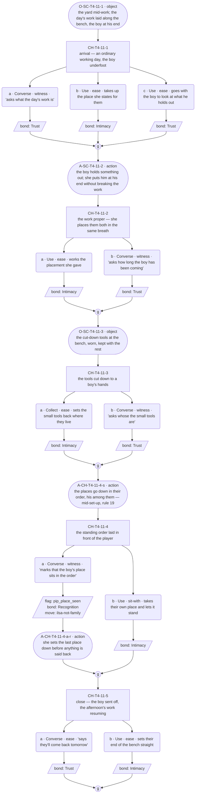

# `ilsa-not-family` — v01

**This life only.** Ilsa is dealt Blacksmith this run, so the staging below is the forge and yard (`world:ilsas-forge`) and the bench she keeps places at. The thread's identity — id, open question, the facet it opens — is ratified in [`../../../cast/ilsa-blacksmith-threads.md`](../../../cast/ilsa-blacksmith-threads.md). **The relations it runs on are per-life and re-key at the reshuffle** (`rel:ilsa-juno`, `rel:ilsa-pip`, ratified 2026-08-09 — Roc): next life the sister and the stand-in grandson are dealt to other souls, and nothing here survives that.

**Open question:** Who is allowed at the table she keeps?

**Status:** Architect brief complete, authored 2026-08-09. **Choice design ran 2026-08-09** — C1–C3 carry content blocks and mermaid graphs; action slots placed. **C2 re-specced 2026-08-09 (Roc): the guest Juno brings is the player.** The unnamed walk-on is deleted and C2's graph is redrawn — 5 / 7 / 6 choice nodes (C2 was 8). **GRAPHS APPROVED by Roc, 2026-08-10.** **Prose written 2026-08-10** — C1–C3 line files exist in `lines/`. Structural changes remain a re-spec through Roc, not a quiet edit.

**The thread built on another NPC.** Under the three-thread cap (festival arc · essence · another NPC) this is Ilsa's third slot, and the other NPC is **Juno, her sister**. It is **not** a `pair-` thread: Juno is a texture soul, owns no registry, and the `pair-` prefix requires declaration in both. A cross-thread with a soul who has no registry belongs to the soul who has one.

**What it reveals, and what no other row of hers reveals:** not what she believes but **what the belief refuses** — and that she breaks it herself, for Pip, without ever calling it the same thing.

---

## Thread shape

**Two seatings, two rules, and an old argument that re-runs and does not resolve.** Nothing here is hidden and nothing is a twist: both seatings are in the open from the first conversation, and what accrues is the player's ability to hold them side by side. `ilsa-kin-no-show` accrues instances of one absence; `ilsa-forge-short` escalates one gap; this thread does neither — it puts two facts in the same room and lets the player be the only one who ever sets them next to each other.

Three reveals across **three conversations**.

| # | Reveal | Fact | Card field | Staged this life as |
|---|---|---|---|---|
| R1 | The exception, uncounted — a boy who is not blood has a standing place in the order at her bench | cast | `warmth_channel` · `notice_and_want` | Tools cut down to Pip's hands kept at the bench, his place in the standing order, and he is never remarked on as an exception |
| R2 | The rule, kept in the arrangement rather than said — the not-blood guest gets a place *added at the end*, never a place *in the order* | cast · relational | `conviction` · `deflection_target` | Juno brings **the player** — not blood — to a family occasion; Ilsa lays them a place at once, and lays it last |
| R3 | The two seatings side by side, and neither woman moves | re-touch of R1 and R2, **no new cast fact** | `conviction`'s cost · the grammar tell | The old argument re-runs in front of the player, in the shape both sisters already know, and ends where it always ends |

**Conversation allocation** — the Architect's call, and the constraint the Choice designer works inside:

| Conversation | Scene id | Carries |
|---|---|---|
| C1 | `SC-T4-11` | R1 — an ordinary working visit with Pip underfoot at the forge; his place, his tools, his work, and no word anywhere that he is an exception to anything |
| C2 | `SC-T4-12` | R2 — the family occasion. Juno arrives with **the player** as her guest; the place gets laid at the end of the order; the argument runs |
| C3 | `SC-T4-13` | R3 — after. The bench keeps both seatings, the argument is old and does not resolve, and neither sister has moved |

Scene ids are the next free block on T4 (The Workshop) after `SC-T4-01`/`-02` (wired), `SC-T4-03`–`-06` (reserved by `ilsa-kin-no-show`) and `SC-T4-07`–`-10` (reserved by `ilsa-forge-short`); **proposed, for downstream to confirm against the id registry** — code mints ids, this table only reserves the shape.

**All three conversations stage on T4.** The family occasion is a `delta_situation` in her own yard — the bench cleared and laid for the eve — not a new location, not a new building, and not a codex entry: situations are state, never standing world facts.

---

## What happens across the thread

There is a boy at the forge who is not hers and who has a place in the order of places she lays. Nobody says so; his tools are the right size and his spot is where it always is, and if you asked her she would put you somewhere rather than answer. Then her sister asks the player to a family occasion — somebody who is not family, brought to a thing that is for family, which is the one thing about Juno she does not like — and the argument they have had for forty years takes about ninety seconds because neither of them needs a preamble for it any more. A place gets laid for the player before any of that starts — of course it does; she has never in her life left somebody standing — and it gets laid last, at the end, after the order. Then it is over, and the bench still has both of those seatings on it, and the only person in the village who has put them next to each other is the player, who is sitting in one of them.

**Where it leaves off on day 5: unresolved, on purpose.** Neither converts. Juno's stance is bias-tier always and she never wins the argument; Ilsa is never converted, and the endpoint is *blood is tended*, never *blood is chosen* (`canon_flags` 1). **Any design that lands this thread on chosen-family collapses Ilsa into Juno and is rerouted.** What moves is not her position — it is what the player can see of what the position costs.

---

## Dependency order

    C1 (R1) ──> C2 (R2) ──> C3 (R3, close)

- **C1 needs nothing.** Zero-knowledge entry. It must work as the player's first contact with Ilsa this week, and it must work as an ordinary good day at the forge — the exception only reads as an exception later, and never to her.
- **C2 needs C1 complete.** The player's own place landing at the end of the order means nothing to a player who has not seen the order, and Pip's place inside it is the order's whole point. Reached cold it is a family squabble about a dinner guest.
- **C3 needs C2 complete.**
- **Entry gates are completion only — never a knowledge flag.** All three reveals are delivered by situation: Pip's place is staged whatever the player picks, the argument runs whether or not the player engages it, and the laid places are objects in the room. Picks decide depth, never receipt.

### Flags

| Flag | Set by | Read by |
|---|---|---|
| `pip_place_seen` | C1 (marking that the boy's place is in the order and always has been — the spoken deep pick), or the **wired `tools` examinable** (T4, `r_tools`, `clue_tier: hard-key`) — **merged into `tools` by Roc, 2026-08-09**, replacing the proposed `ex-bench-small-tools` | C2, C3 |
| `guest_place_last` | C2 (marking where the player's own place went — the spoken deep pick), or the `ex-place-order` examinable **(PROPOSED — not built)** | C3 |

**Every flag has a reader.** No flag may be added without one, and the Choice designer may not add one at all.

**The argument itself gets no flag.** It is situation — it runs in front of every player who reaches C2, and a flag recording that someone watched it would be a flag for having been in the room. C3's deep beat needs the two *seatings*, not the argument, which is why the two flags are the ones above.

### Facts read per conversation

C1 reads none · C2 reads one (`pip_place_seen`) · C3 reads two (`pip_place_seen`, `guest_place_last`). R6's ceiling is two.

---

## Delta declarations

Stated against [`../../../cast/ilsa.md`](../../../cast/ilsa.md)'s `delta_rule`. The second apron, the empty bench-end, the count and the centerpiece are already reference-free.

| Conversation | `delta_cast` | `delta_relational` | `delta_situation` |
|---|---|---|---|
| C1 | She keeps a set of tools cut down to a boy's hands at the bench, and his place sits in the standing order of places she lays — **one** | None — Ilsa is the only carded soul carrying a fact here | An ordinary working day at the forge with the boy underfoot; the centerpiece work going on around him |
| C2 | She lays places in a fixed order she does not vary, and a guest gets one added at the end of it — **one** | The two of them have one argument they re-run rather than settle, and both know its shape well enough to take their positions without a preamble — **one** | The family occasion in the yard: the bench cleared and laid for the eve; Juno arrives with the player, whom she asked |
| C3 | None — the two seatings are R1 and R2 re-touched at closer range, and re-delivering either as a slot is exactly what the delta rule flags | None | After the occasion: both places still on the bench, the order as she laid it |

**Check 3's ceiling in C2, stated so the designer does not have to guess.** Juno and Pip are **texture souls: they appear as situations and carry no `delta_cast` of their own.** A cast fact must feed one of *that soul's own* threads, and neither has a registry to feed — so C2 declares one cast fact (Ilsa's) plus one relational, which sits inside the two-or-more-cast-members ceiling (1 per cast member + 1 relational) on any reading. **No fact of Juno's or Pip's may be declared anywhere in this thread.** **Ruled 2026-08-09 (Roc): a texture soul present in a scene *may* carry cast facts but does not have to — the conservative reading this brief takes is permitted, not required.** The reading stands as written here because neither Juno nor Pip has a registry for a fact to feed; it is a choice, not a ceiling. *(Closed — see the foot of this file.)*

**The relational fact is bound to the pair and does not travel.** `rel:ilsa-juno` re-keys at the reshuffle; the *shape* that travels with Ilsa is a stance held against someone who disproves it, never "her sister Juno."

---

## Constraints on the conversation design

- **Entry gate is the previous conversation in this thread completing. Nothing else.**
- **There is no negation in the predicate vocabulary.** `not knows(x)` is not a predicate — the resolver parses `^knows\(([^)]+)\)$`, and a gate using negation compiles to nothing, leaving the branch silently unreachable. This is exactly what broke `ilsa-kin-no-show` C2. **Express every not-knowing case as the ungated fallback**: the knowing case takes the gated node, everyone else walks the path rule 4 already required to exist. **No divert is expected in this thread**; if the design finds it needs one, that is an escalation to Roc.
- **Ilsa never states her stance** (`canon_flags` 8). Her blood-first belief is bias-tier and shows as repeated behavior and third-party notice only. **She may not say the occasion is for family, may not object in words, and may not explain the order of places.** Her objection is *in the arrangement* — where the place goes — and that is the entire mechanism of R2. A design in which she argues her position out loud has replaced her with a woman who has a thesis.
- **Juno carries the spoken side of the argument, and never wins it.** Her stance is bias-tier always (`npc-codex.md`, `soul:juno`); she is warm, she says her thing, and nothing she says converts her sister or is meant to. She is also **not gated, not scored, and not a thread owner** — she is present as situation. Her card is a draft at the human gate; Lines writes her to it and to her declared band (7–12 words), not to Ilsa's.
- **No line Ilsa speaks may be one Juno could speak unchanged** (`canon_flags` 10, failure mode 5). Both women gather people, which is exactly why this thread is the highest-risk place in the project for that drift: same surface warmth, opposite engine — Juno *chose* everyone at her table and can say so; Ilsa was *born* to hers and has no reason to remark on belonging at all. Every line in C2 is a Verifier target.
- **Pip is never called an exception, by anyone.** He is `rel:ilsa-pip`: a stand-in grandson, not blood, treated as kin, underfoot at the forge. **She never counts it as the same thing**, and the design must not let her notice the contradiction. If she sees it, the thread is over and she has been converted by argument, which her canon forbids.
- **Marking, not naming** (ruled 2026-08-09 — Roc). A mark places a fact and stops — no verdict, no motive, no consolation. "His place is in the order" marks. "You already do what she does" names, and converts on top. **Naming is barred to everyone, including the player's options and including Juno.** Juno may state her own stance warmly; she may not diagnose her sister.
- **The player may not adjudicate.** No option settles the argument, takes a side that closes it, moves or refuses the place laid for the player, or gets Ilsa to concede. The argument is old and does not resolve; a player option that resolves it is the same defect as a fix (`canon_flags` 3 — the player is a witness).
- **Every incoming state must walk without dead-ending.** C3 reads two facts: four states, all authored.
- **One state is always the fallback** — finished C2, marked nothing. It still receives both seatings and the whole argument, because all three reveals are situation.
- **A missed fact makes the thread shallower, never rerouted** (R5).
- **Missed things stay in the world.** Every closed path names the examinable that reopens it — see the table below. Nothing catches an undeclared pickup: check 11 only joins declarations to builds, so a thread declaring nothing passes every gate with its paths closed permanently.
- **Options are equal weight.** Marking where a place went says out loud what the arrangement said silently, and costs her footing exactly as much as letting the arrangement stand respects it. No option is correct; no counter keys off repetition (check 2).
- **Bond weights:** Recognition 3, Trust 2, Intimacy 2. The deep path records Recognition, the shallow path Intimacy or Trust.
- **No `bond_band` predicates** (`canon_flags` 11) — their absence is canon barring a device, which is a pass.
- **Nothing here reaches for the echo** (`ilsa_second_apron`), gates on its bond level, or moves the apron.
- **No sanctioned long run** (rule 20). Her 75-word licence is lineage and household history only — and this is the one thread in the project where a lineage run would be tempting, because the subject is whose table this is. **It is barred here**: `ilsa-whose-table` is **deferred by Roc, 2026-08-09, and is not to be touched**, precisely because canon names no parents and no ancestors and the run's content would have to be invented (the check-4 defect). **No conversation in this thread may deliver household history, name a parent, or date the table.** Juno being her sister supplies a shared household and no facts about it.
- **Certainty stays warm** (`canon_flags` 5, failure mode 1). Laying the player's place last is not a snub performed coldly — she lays it, immediately, because she has never left anybody standing. The whole reveal depends on the warmth being real and the order being real at the same time. A version where she is cool to the player has thrown the thread away for a cheap beat, and — since the guest is the player — would also read as the game judging them, which nothing here is permitted to do.
- **The flat end is a pause, not a chill** (`canon_flags` 6). If the argument gets near the thing she has no sentence for, she runs out of sentence — she does not sharpen and does not speed up, and nothing fills the gap (failure mode 2).
- **Heavy beats take her carded shape:** a fragment, then an observable act, then a shorter fragment or nothing. C2's laying of the player's place is the thread's weight beat and it is an **act**, not a line — a spoken slot cannot carry it at all.
- **A shortfall converted to arithmetic is Toby's move; an object dated into the past is Mara's** (failure mode 4). Neither belongs here. Counting places aloud is especially tempting in this thread and is exactly the Toby drift: her count is never a number said out loud, it is places laid.
- **The set place is narrative, never mechanical** (`canon_flags` 14). Nothing here renders her inclusion as a `gift` key item or writes a key-item record.
- **No World Truth is stated in-scene** (`canon_flags` 8), and no scene grants her a fix.

### Pacing

A thread may be entered **once per time slot**; the day's opening slot belongs to the festival arc; later slots allow multiple threads (GP-93). Three conversations fit in two days minimum.

**Nothing here may assume which slots, which days, or how much clock separates them.** C2's family occasion is whichever evening the player walks in on that conversation — the occasion is a state of the yard, not a date on the calendar, so the schedule can never contradict it.

### Id conventions

Per [`../../../narrative-pipeline/templates/id-label-convention.md`](../../../narrative-pipeline/templates/id-label-convention.md), binding on every id minted after 2026-08-09.

Choice nodes `CH-T4-11-1`, `-2`, … · options `-a`, `-b` · player line `L-CH-T4-11-1-a-p` · response `L-CH-T4-11-1-a-r1`. Code mints final ids; these reserve shape only.

- **Every id carries a human-readable label at first mention in prose** — the id in backticks, an em dash, the gist verbatim from the mermaid label. One gist per id, minted once, in the graph.
- **Nested ids carry the segment readout**, one `›` per segment, the word *child* mandatory: `CH-T4-12-3-a-1-b` (node 3 › option a › child 1 › option b).
- **Variant selectors:** state variants take the **flag name verbatim** (`-pip_place_seen`), two flags joined by `-and-` (`-pip_place_seen-and-guest_place_last`). Path variants are `-norm` / `-div` and nothing else — and no divert is expected here. No bare base id sits beside variants.

### Examinables

**One wired, one proposed.** `tools` exists in `tools/resolver/data/screen-specs.json` today; `ex-place-order` does not. Downstream wires the proposed one and adds the knowledge flag to the wired one; until then the pickup paths do not work, and `check-examinables` will flag `ex-place-order` not-built, which is the legitimate mid-authoring state.

| id | Screen | Status | Sets | Reopens |
|---|---|---|---|---|
| `tools` | T4, `r_tools` | **WIRED** — `clue_tier: hard-key`, verbatim from `screen-specs.json`, read 2026-08-09 | `pip_place_seen` | C1's closed path — a player who never marks that the boy's place is in the order. It is the only route into C2's and C3's deep beats for that player, and only while those conversations are still unplayed. The tools are a standing object at the bench, so the pickup is sticky and repeatable |
| `ex-place-order` | T4 | **PROPOSED — not built** | `guest_place_last` | C2's closed path — a player who never marks where their own place went. Reopens C3's deep beat, and only while C3 is unplayed. The laid places persist on the bench after the occasion, which is what makes this examinable honest rather than a convenience |

**`ex-bench-small-tools` is retired — merged into `tools` by Roc, 2026-08-09.** The earlier brief kept them separate on the argument that `tools` is a hard-key examinable with its own function and the thing this thread needs examinable is the cut-down set and its place in the order, not the forge's toolage. Roc ruled merge. `tools` carries `knowledge_flag: pip_place_seen` **in addition to** its existing hard-key clue function; the flag it sets and the path it reopens are unchanged from the retired declaration. **This brief does not edit `screen-specs.json`** — wiring the flag onto the existing entry is downstream's, and the entry's own standing note there ("confirm `tools` is truly hard-key") is unresolved and untouched by this ruling.

T4's other wired examinable is `recipe_board` (`hard-key`, `r_recipe_board`); it is not reused.

**Both pickups are load-bearing.** The chain means a player who marks nothing in C1 arrives at C3 with both gated beats shut and the thread's entire point — the two seatings held side by side — unreachable for the run. R5 says a missed fact makes a thread shallower, never lost; these two declarations are the only thing that makes that true here.

---

## Conversations

**For the Choice designer.** One section per conversation, each with a content block and a mermaid node graph. **Roc approves the shape before any prose is written.**

The content block says what is open, what is closed and what she reveals, per incoming state. The graph shows the choice nodes, their gates, the options and where each rejoins. **Action-slot convention as in [`toby-the-shelf.md`](toby-the-shelf.md):** description beats are stadium shapes, `A-` (action) / `O-` (object) ids, suffixed `-s` (set-up interleave) or `-r` (response run); the label carries the slot id, type and a structural gist, and Lines writes the words.

**Two carded souls are in the room in C2, and no walk-on** — Juno is named in the content block as a present soul (she has a card and a codex entry), and the not-blood guest at the occasion is **the player**, re-specced by Roc 2026-08-09. There is nobody in C2 for Lines to write in the walk-on band.

### C1 — `SC-T4-11`

**Carries R1. Reads no prior facts — one incoming state (zero knowledge). Must work as first contact with Ilsa this week and as an ordinary good day at the forge. 5 choice nodes, all top-level. Variety device: a three-option node. Action layer: 5 description slots (3 `action`, 2 `object`) against ~14 dialogue slots on the deep walk — ratio ≈ 1:2.8, at the dense end because two of the five sit in beats Pip drives, where his card requires 1:2 or better. Carded souls present: Ilsa and Pip. No walk-ons.**

**Content block.**

- **Incoming state: zero knowledge (the only state).** The whole of R1 is staged as scene business and arrives whatever the player picks: a set of tools cut down to a boy's hands kept at the bench with the rest, a boy underfoot working at his own end, and the standing order of places she lays with his place in it. Nothing in the conversation is gated, because nothing prior exists to gate on; picks decide depth only. **He is never called an exception, and she never remarks on him belonging** — the design gives her no beat in which she could.
- **Pip is a carded texture soul, not a walk-on** (rule 21). He speaks in his own declared band (3–8 words, deflecting to the found thing) and his weight rides `action` slots at 1:2 in the beats he drives — `A-SC-T4-11-2` and node 5's send-off. Lines must not write him in the walk-on band, and must not write him aware he carries any weight.
- **Node 1 (`CH-T4-11-1` — arrival; the day's work laid along the bench, the boy at his end; ungated, three options).** First contact. Ask what the day's work is (spoken — records Trust), take up the place she states for them (deed — records Intimacy; she does not offer it, she states it), or go with the boy to look at what he is holding out (deed — records Trust; his enlistment taken up). All three record. Equal weight: asking turns the day into talk, taking the place joins the work, going with the boy leaves both — none is the correct read of a working yard, and none of the three is what the conversation is about.
- **Node 2 (`CH-T4-11-2` — the work proper; she places the player and the boy in the same breath; ungated).** Work the placement she gave (deed — records Intimacy) or ask how long the boy has been coming (spoken — records Trust). Her answer to the ask is the card doing two things at once: the recent span comes back rounded off (`precision_profile`, loose half, referenced not slotted) and the attention turned on her is answered by putting somebody somewhere (`deflection_target`). **She does not date him, does not classify him, and does not say what he is to her.** Both record.
- **Node 3 (`CH-T4-11-3` — the cut-down tools at the bench; ungated).** Set the small tools back where they live when he leaves them out (deed — records Intimacy) or ask whose the small tools are (spoken — records Trust). Asked whose, she answers **where they live**, in the flat declarative present — the ownership question answered as a placement. That non-answer is the reveal's whole grammar and it is not a dodge performed coldly; the tools are kept with the rest because keeping them there was never a decision.
- **Node 4 (`CH-T4-11-4` — the places for the midday break go down in their order, his among them; ungated — the deep pick).** Mark that the boy's place sits in the order (spoken — **sets `pip_place_seen`**, records Recognition, moves the thread) or take their own place in the order and let it stand (deed — records Intimacy). **Marking, not naming:** the option states where the place is and stops — no verdict, no "so he counts as family", no consolation. Her response neither agrees nor disagrees: a fact confirmed flat, then somebody gets put somewhere. **She does not notice the contradiction and is given no beat in which she could** — the ruling that would end the thread. Equal weight: marking says out loud what the arrangement says silently and turns attention on her, which she deflects; taking the place respects the arrangement and spends the same beat. The shallow player still receives R1 in full, because the tools, the boy and the order are all situation.
- **Node 5 (`CH-T4-11-5` — close; the boy is sent off on his round and the afternoon's work resumes; ungated).** Say they will come back tomorrow (spoken — records Trust; she answers with tomorrow's arrangement, already decided) or set their end of the bench straight before leaving (deed — records Intimacy). Both record.
- **No accrual.** Nothing in this conversation keys off repeated selection; `pip_place_seen` is set-once knowledge, not a tally, and no option's repetition is threshold-bearing.
- **Closed path.** A player who never marks the order leaves without `pip_place_seen`: `CH-T4-12-2` — the order read with the boy's place in it — and `CH-T4-13-2` — the boy's place has not moved — never open. The tools stay in the world: the wired `tools` examinable (T4, `r_tools`, sticky, repeatable — **once it carries the knowledge flag**) sets the flag later, and only while C2 and C3 are unplayed. The shallow run still delivers first contact, the staging and five full beats.
- **Action slots (rule 18).** Five, typed and placed; Lines writes them:
  - `O-SC-T4-11-1` (`object`, scene opening, before node 1) — the yard mid-work; the day's work laid along the bench, the boy at his own end of it. R1's surface arrives as a thing seen before anyone speaks.
  - `A-SC-T4-11-2` (`action`, spine, node-1 gather → node 2) — the boy holds something out; she puts him at his end without breaking the work. Pip's enlistment and her placement in one picture, neither remarked.
  - `O-SC-T4-11-3` (`object`, node 3's set-up) — the cut-down tools at the bench, worn, kept with the rest. Node 3's spoken option points at this slot.
  - `A-CH-T4-11-4-s` (`action`, inside node 4's set-up) — the places go down in their order, his among them, and nothing is said about any of them. Part of the rule-19 build below.
  - `A-CH-T4-11-4-a-r` (`action`, inside node 4 option `-a`'s response run) — she sets the last place down before anything is said back. The gap between the mark and her answer is this slot.
- **Rule-19 build — node 4, the conversation's weight beat.** The places going down is what the scene exists for, and it is built fragment → action → fragment: the player's mark (its own ≤12-word fragment) → a short flat fragment from her (fact confirmed, nothing added) → `A-CH-T4-11-4-a-r` (the last place set down) → a shorter fragment: the placement, declarative, complete. Her sentences all finish here — the grammar failing belongs to C2 — and nothing explains, defends or consoles (failure mode 2).
- **No sanctioned long run (rule 20).** Barred outright in this thread: her 75-word licence is lineage and household history, and no conversation here may deliver household history, name a parent, or date the table. None placed.
- **Walk-ons (rule 21).** None.

### C2 — `SC-T4-12`

**Carries R2. Reads one prior fact: `pip_place_seen`. Two incoming states. 7 choice nodes (6 top-level + 1 nested) — down from 8 in the pre-re-spec draw, because the separate beat of greeting a stranger is gone: the guest is the player, so arrival and claim are one node. Variety devices: nesting to depth 1; a three-option node. Action layer: 6 description slots (4 `action`, 2 `object`) against ~17 dialogue slots on the deep walk — ratio ≈ 1:2.8, at the dense end because the two heaviest beats in the conversation are both acts. Carded souls present: Ilsa and Juno. Walk-ons: none.**

**Re-specced 2026-08-09 (Roc): Juno's guest is the player.** The earlier draw had Juno bring an unnamed walk-on and the player watch the place go on at the end of the order. The mechanism is the same and the reveal is unchanged; what changes is who receives it. The thread's question is *who is allowed at the table she keeps*, and with the player as the guest the answer is **felt rather than observed** — the player is personally handed the place that goes on last. It also fits Juno exactly: she chooses people, and the player is the newcomer Mage.

**Content block.**

- **Scene business, both states.** The family occasion in her own yard: the bench cleared and laid for the eve, the places down in the fixed order she does not vary (`delta_situation`). Juno brings the player, whom she asked. Ilsa lays them a place at once, and lays it at the end, after the order. Then the argument runs. **All of R2 is situation** — it happens to every player who reaches this conversation, whatever they pick.
- **The laying comes before the argument, and that ordering is load-bearing.** Her rule fires on its own, out of `notice_and_want` — somebody is standing at an edge, so they get moved in — not as a concession extracted by her sister and not as a retort to her. If the place were laid *after* the argument it would read as the argument's outcome, which would make one of the two women right. It is laid first, immediately, and the argument that follows changes nothing about it in either direction.
- **This is the sanctioned form of player contrast, and it takes no act by the player.** The persona-card schema permits a contrast only when the player's *mere presence* creates the collision ([`../../../narrative-pipeline/templates/persona-card-schema.md`](../../../narrative-pipeline/templates/persona-card-schema.md); ruled 2026-08-03 — Roc), and Ilsa's card already records exactly that one: a player whose bonds must be re-made from nothing is standing evidence against her belief that bonds are automatic. This conversation **stages that existing contrast and invents no new one.** The collision exists the moment the player is in the yard at a bench laid by blood; every option, including doing nothing at all, leaves it exactly as it is. **No option manufactures the contrast, and none dissolves it.**
- **Ilsa never states her stance, anywhere in this conversation.** She has no beat in which she objects, explains the order, says the occasion is for family, or says anything at all about the player's place other than where it is. Her whole side of the argument is *where the place goes*, and the design gives her nothing else. Juno carries the spoken side.
- **Juno is a carded texture soul, present, not a walk-on** (rule 21). Lines writes her to her own declared band (7–12 words, warmer and a touch longer than Ilsa's 5–7), her warmth arriving as **claim** — the kin-word spoken over the player in front of everyone and left standing — against Ilsa's warmth arriving as **assumption**. No line either woman speaks may be one the other could speak unchanged; every line here is a Verifier target (Ilsa `canon_flags` 10, failure mode 5).
- **How this is kept from reading as the game judging the player.** Six things do it, and every one of them is structural rather than tonal:
  1. **The place is laid at once.** She never leaves anybody standing, and the design gives her no beat in which she hesitates, weighs the player, or is seen to decide. There is no moment in which the player is a question.
  2. **Node 5 exists for exactly this** — the eve proceeds and the player at the added end is fed, passed things, spoken to, and included in everything from there to the close. This node was already load-bearing in the pre-re-spec draw; with the player as guest it is **critical, and it is strengthened**: it is no longer one beat of inclusion but the state the rest of the conversation runs in, and the close plays inside it.
  3. **Nothing is scored, and nothing is recorded about the player.** No `canon_write`, no bond penalty anywhere in the conversation, no flag recording that the player was the guest, and no outcome that reads differently later because of it. The only flag set is `guest_place_last`, which records **where a place is**, not who sat in it.
  4. **The warmth is unbroken through the whole beat** (`canon_flags` 5). She is not cool to the player at any point, and a version where she is has thrown the thread away for a cheap beat. Her certainty is warm and her order is real at the same time — that simultaneity is the entire reveal.
  5. **No option is a grievance and no response is a rebuke.** The player may mark where the place went; the player may not object, ask to be moved, decline the place, or be told anything about themself. No response beat scolds an unpicked option (check 10).
  6. **The flat end is a pause, not a chill** (`canon_flags` 6). Where her sentence runs out, nothing sharpens and nothing speeds up, and nothing fills the gap.
- **How neither soul becomes the correct one.** (1) **The laying precedes the argument**, so Ilsa's rule is never a response to Juno and Juno never wins by Ilsa being cold. (2) **No option adjudicates** — no pick settles the argument, moves the place, refuses it, takes a side that closes it, or gets either woman to concede (`canon_flags` 3: the player is a witness, and here the player is a witness to something happening to them). (3) **Juno's own cost is present in her exactness** — the nested child has her name the day she decided to ask the player, exactly, which is her stance carrying its own weight: a bond with a beginning has an end. It is stated as her habit, never as a diagnosis of her. (4) **Nothing records more for either side.** The two Recognition marks in the conversation are `CH-T4-12-2-a` and `CH-T4-12-3-a`, and both record where a place is; neither records who was right. (5) **Nobody converts and nothing adjudicates** — no record anywhere favours either side, and the village keeps arguing (guardrail 10 bars the sanctioned option, and the same logic bars the sanctioned soul).
- **Marking, not naming, and it binds the player hardest here.** The player is now inside the fact, which makes naming the live temptation. No option may say what the placement means, put it beside the boy's place, say anything about either woman, or say anything about the player's own standing. A mark states where a thing is and stops.
- **Node 1 (`CH-T4-12-1` — Juno brings the player into the yard for the eve and claims them in the kin-word in front of everyone; ungated, three options).** Greet Ilsa at her own bench (spoken — records Trust; she answers the way she answers everything, by placing somebody), take up the last of the carrying with Juno (deed — records Intimacy), or let the kin-word stand without answering it (deed — records Intimacy). All three record. Equal weight: greeting turns the arrival into talk, carrying joins the eve's work, letting it stand leaves both — none is the correct read of being brought somewhere. **Nobody corrects Juno's kin-word and Juno explains it to nobody**, and no option lets the player accept or decline it.
- **Node 2 (`CH-T4-12-2` — the laid bench read with the order already known; gated `knows(pip_place_seen)`).** Reference beat, no new fact. Mark that the boy's place is in the order tonight as well (spoken — records Recognition) or help carry the last things down the bench-side (deed — records Intimacy). **The not-knowing case is the ungated fallback, never a negated gate:** if the flag is unset the node auto-skips to its gather and the player walks the rest of the conversation, which is the path rule 4 already required. No predicate in this thread uses negation. **Neither option is about the player's own place**, which has not been laid yet — this node reads the order, and the order only.
- **Node 3 (`CH-T4-12-3` — the player's place goes down, at once, at the end of the order; ungated — the deep pick and the thread's weight beat).** Mark where their own place went (spoken — **sets `guest_place_last`**, records Recognition, moves the thread) or take the place she laid and let the arrangement stand (deed — records Intimacy). **Marking, not naming:** the option says where the place is and stops. It may not say what it means, may not put it beside the boy's place, may not complain, may not thank, and may not tell either woman anything about herself. Her response is where `canon_flags` 6 lands: a flat fragment confirming the fact, an act, and then the sentence that would have to explain the order does not arrive. **It is a pause and not a chill** — nothing sharpens, nothing speeds up, nothing fills the gap, and the warmth is unbroken through it. Equal weight: marking says out loud what the arrangement said silently and costs her footing exactly as much as sitting down in the place respects it.
- **Node 4 (`CH-T4-12-4` — the argument, taken up without a preamble and over in about ninety seconds, with the player already seated in the thing it is about; ungated, three options).** Stay where they are and take it in (deed — records Intimacy), ask Juno how she came to ask them (spoken — records Trust; **opens the nested child**), or keep the eve's work moving through it (deed — records Trust). Equal weight: none of the three joins a side, and each costs the same beat. This is not a confrontation scene (`canon_flags` 4): the eve's work does not stop for it, and **neither woman addresses the player during it** — the argument is forty years old and is not about tonight's guest, which is what keeps the player from being its subject.
  - **Nested child (`CH-T4-12-4-b-1` (node 4 › option b › child 1) — Juno answers with the day she decided to ask the player, exactly, and the argument ends where it always ends).** Let the placement stand (deed — records Intimacy; Ilsa answers the point by putting somebody somewhere and does not answer it in words) or ask Juno to finish what she was saying (spoken — records Trust; she finishes it warmly, on record, and nothing about the eve changes). **Why nesting and not a flag-gate:** this beat exists only as the answer to having asked Juno; a flag-gated sibling would print Juno's answer as framing to every player who never asked, and everyone else would take a silent skip through the argument's second half.
- **Node 5 (`CH-T4-12-5` — the eve proceeds; the player at the added end is fed, passed things, and in everything from here to the close; ungated).** Pass things back down the bench from the added end (deed — records Intimacy) or ask Ilsa something ordinary about the work (spoken — records Trust; she answers it as she would answer anyone at her bench, and the answer ends in a placement). **This node is the thread's guarantee that the certainty stayed warm** (`canon_flags` 5) and, since the re-spec, the guarantee that the rule never plays as a snub at the player: the place went last and the person in it is one of the room's. **The state it establishes runs through node 6** — nothing after this beat takes it back. A version of this conversation without node 5 has thrown the thread away for a cheap beat.
- **Node 6 (`CH-T4-12-6` — close; Juno says her thing once more, warmly, and it converts nobody; the eve ends and the places stay as laid; ungated).** Let it stand without answering (deed — records Intimacy) or mark that Juno used the kin-word again (spoken — records Trust; a mark on Juno's grammar, not a verdict on either sister and not a claim on the word). Both record. **Nothing here resolves**: no concession, no repair, no last word, and the player leaves the eve having been included in all of it and seated at the end of it, both.
- **Incoming state: `pip_place_seen` (deep).** All seven nodes reachable; the walk is 1 → 2 → 3 → 4 (with child, on option `-b`) → 5 → 6.
- **Incoming state: fallback (finished C1, marked nothing).** Node 2 auto-skips; the walk is 1 → 3 → 4 → 5 → 6 — five beats, the whole laying, the whole argument, the whole inclusion, and `guest_place_last` still settable. Shallower, not rerouted. What the fallback player loses is only the *pairing* — they receive their place at the end without having seen the order it went after.
- **No accrual.** No counter, tally, or repetition-keyed unlock anywhere; both flags are set-once knowledge.
- **Closed paths.** Missed `pip_place_seen`: the wired `tools` examinable (T4, `r_tools`, sticky, repeatable — **once it carries the knowledge flag**) reopens node 2 and `CH-T4-13-2`, and only while those conversations are unplayed. Missed `guest_place_last` (never marked at node 3): the proposed `ex-place-order` (T4) reopens `CH-T4-13-3` — the added place is still there — because the laid places persist on the bench after the occasion.
- **Action slots (rule 18).** Six description beats:
  - `O-SC-T4-12-1` (`object`, scene opening, before node 1) — the yard cleared for the eve; the bench laid, the places down in their order, the count of them settled before anybody arrives. The order arrives as a thing seen before anybody speaks, which is what makes node 3's ending readable.
  - `A-CH-T4-12-1-s` (`action`, inside node 1's set-up) — Juno brings the player in through the yard and claims them in the kin-word in front of everyone; nobody corrects it. Her warmth-as-claim shown, not narrated.
  - `A-CH-T4-12-3-s` (`action`, inside node 3's set-up) — she lays the player a place, at once, and lays it at the end of the order. **The thread's weight beat is this act.** A spoken slot cannot carry it at all (check 8): it is a thing she does and never mentions.
  - `A-CH-T4-12-3-a-r` (`action`, inside node 3 option `-a`'s response run) — she straightens the added place and turns back to the eve. The pause after the mark is this slot, and nothing follows it.
  - `A-CH-T4-12-4-s` (`action`, inside node 4's set-up) — both women take their positions without a preamble, and the eve's work does not stop. Forty years of shortcut carried by the picture, so no line has to say the argument is old.
  - `O-SC-T4-12-5` (`object`, spine, node-4 gather → node 5) — the bench in full: the order, and one place added at the end of it, with somebody in it who is being passed things. The two arrangements as one picture, stated by nobody.
- **Rule-19 build — node 3, the laying and the mark.** Built act → fragment → action → nothing: `A-CH-T4-12-3-s` (the place laid, last) → the player's mark on option `-a` (its own ≤12-word fragment) → a short flat fragment from her, the fact confirmed and nothing added → `A-CH-T4-12-3-a-r` (the added place straightened, the turn back to the eve) → **no closing fragment**. The sentence runs out and the silence stands as the last beat of the option. The weight never moves into a longer line, and no slot explains, defends, apologises or consoles. On option `-b` the run closes on the set-up act with the arrangement unremarked.
- **No sanctioned long run (rule 20).** Barred in this thread, and this is the conversation where it would be most tempting, because the subject is whose table this is. `ilsa-whose-table` is deferred by Roc and not touched; no household history, no parent, no date on the table. Juno carries nothing that needs one. None placed.
- **Walk-ons (rule 21).** **None.** The walk-on guest of the pre-re-spec draw is deleted; the not-blood guest is the player, who has no band and is written under the player entry in `register.md`.

```mermaid
flowchart TD
  OS1(["O-SC-T4-12-1 · object<br>the yard cleared for the eve; the bench laid, places down in their order"])
  OS1 --> AS1(["A-CH-T4-12-1-s · action<br>Juno brings the player in and claims them in the kin-word; nobody corrects it"])
  AS1 --> N1["CH-T4-12-1<br>brought to the eve as Juno's guest"]
  N1 --> N1a("a · Converse · ease · 'greets Ilsa at her own bench'")
  N1 --> N1b("b · Use · ease · takes up the last of the carrying with Juno")
  N1 --> N1c("c · Converse · sit-with · lets the kin-word stand without answering it")
  N1a --> R1a[/"bond: Trust"/]
  R1a --> J1(("g"))
  N1b --> R1b[/"bond: Intimacy"/]
  R1b --> J1
  N1c --> R1c[/"bond: Intimacy"/]
  R1c --> J1
  J1 --> G2{{"knows(pip_place_seen)"}}
  G2 --> N2["CH-T4-12-2<br>the laid bench read with the order known"]
  N2 --> N2a("a · Converse · witness · 'marks that the boy's place is in the order tonight too'")
  N2 --> N2b("b · Collect · ease · helps carry the last things down the bench-side")
  N2a --> R2a[/"bond: Recognition"/]
  R2a --> J2(("g"))
  N2b --> R2b[/"bond: Intimacy"/]
  R2b --> J2
  J1 --> J2
  J2 --> AS3(["A-CH-T4-12-3-s · action<br>she lays the player a place at once, at the end of the order — rule 19"])
  AS3 --> N3["CH-T4-12-3<br>the place laid last"]
  N3 --> N3a("a · Converse · witness · 'marks where their own place went'")
  N3 --> N3b("b · Use · sit-with · takes the place she laid, lets the arrangement stand")
  N3a --> R3a[/"flag: guest_place_last<br>bond: Recognition<br>move: ilsa-not-family"/]
  R3a --> AS3r(["A-CH-T4-12-3-a-r · action<br>she straightens the added place and turns back to the eve — the pause"])
  AS3r --> J3(("g"))
  N3b --> R3b[/"bond: Intimacy"/]
  R3b --> J3
  J3 --> AS4(["A-CH-T4-12-4-s · action<br>both take their positions without a preamble; the eve's work does not stop"])
  AS4 --> N4["CH-T4-12-4<br>the old argument, re-run in about ninety seconds"]
  N4 --> N4a("a · Converse · sit-with · stays where they are and takes it in")
  N4 --> N4b("b · Converse · witness · 'asks Juno how she came to ask them'")
  N4 --> N4c("c · Use · ease · keeps the eve's work moving through it")
  N4a --> R4a[/"bond: Intimacy"/]
  R4a --> J4(("g"))
  N4c --> R4c[/"bond: Trust"/]
  R4c --> J4
  N4b --> R4b[/"bond: Trust"/]
  subgraph S4b["CH-T4-12-4-b"]
    C4["CH-T4-12-4-b-1<br>Juno names the day she decided to ask them; the argument ends where it always ends"]
    C4 --> C4a("a · Converse · sit-with · lets the placement stand")
    C4 --> C4b("b · Converse · witness · 'asks Juno to finish what she was saying'")
    C4a --> RC4a[/"bond: Intimacy"/]
    RC4a --> JC4(("g_CH-T4-12-4-b"))
    C4b --> RC4b[/"bond: Trust"/]
    RC4b --> JC4
  end
  R4b --> C4
  JC4 --> J4
  J4 --> OS5(["O-SC-T4-12-5 · object<br>the bench in full — the order, and one place added at the end, being passed things"])
  OS5 --> N5["CH-T4-12-5<br>the eve proceeds; the player is included in everything"]
  N5 --> N5a("a · Use · ease · passes things back down the bench from the added end")
  N5 --> N5b("b · Converse · ease · 'asks Ilsa something ordinary about the work'")
  N5a --> R5a[/"bond: Intimacy"/]
  R5a --> J5(("g"))
  N5b --> R5b[/"bond: Trust"/]
  R5b --> J5
  J5 --> N6["CH-T4-12-6<br>close — Juno says her thing once more; nothing resolves"]
  N6 --> N6a("a · Converse · sit-with · lets it stand without answering")
  N6 --> N6b("b · Converse · witness · 'marks that Juno used the kin-word again'")
  N6a --> R6a[/"bond: Intimacy"/]
  R6a --> J6(("g"))
  N6b --> R6b[/"bond: Trust"/]
  R6b --> J6
```

### C3 — `SC-T4-13`

**Carries R3 — a re-touch of R1 and R2 at closer range, no new cast fact. Reads two prior facts: `pip_place_seen`, `guest_place_last` — four incoming states, all authored. 6 choice nodes, all top-level — the seed count. Variety devices: a three-option node; the two knowledge gates are split rather than conjoined, so the two mid states are structurally distinct and neither is fallback-identical. Action layer: 4 description slots (2 `action`, 2 `object`) against ~13 dialogue slots on the deep walk — ratio ≈ 1:3.2. Carded souls present: Ilsa and Pip. No walk-ons.**

**Content block.**

- **All four states.** After the occasion: the yard back at work, and **both seatings still on the bench** — the places as she laid them, with the added one still at the end (`delta_situation`). R3 is delivered by the situation, so the fallback player receives the whole of it; the two gated nodes decide only whether the player can *hold the two side by side*, which is the thread's whole point and the reason both pickups are load-bearing.
- **Nothing resolves and nobody has moved.** No node revisits the argument to settle it, no option gets a concession, and the order she lays tomorrow is the order she laid before. The endpoint is *blood is tended*, never *blood is chosen*. **The player is the only person in the village who has put the two seatings next to each other, and the design keeps that reading entirely on the player's side** — neither woman states it, and no option lets the player tell either of them about herself.
- **Pip is a carded texture soul, not a walk-on** (rule 21); he drives node 5, where his weight rides the action slot at his 1:2 density and his line stays in the 3–8 band, deflecting to a found thing off the round. He is never called an exception, by anyone, and he is unaware of carrying anything.
- **Node 1 (`CH-T4-13-1` — the yard back at work, the bench as she left it; ungated, three options).** Ask how the eve went (spoken — records Trust; the recent comes back rounded off, `precision_profile`'s loose half, and the answer arrives as an arrangement rather than an account), take up work at their own end (deed — records Intimacy), or stay with the bench as it was left, saying nothing (deed — records Intimacy). All three record; none of the three is a reading of the bench, which is what nodes 2 and 3 are for.
- **Node 2 (`CH-T4-13-2` — the boy's place, back in the standing order for an ordinary day; gated `knows(pip_place_seen)`).** Mark that his place has not moved (spoken — records Recognition) or work at the place next to it (deed — records Intimacy). Reference, not delta — R1 re-touched, nothing new declared. **The not-knowing case is the ungated fallback**, never a negated gate: the node auto-skips and the player continues at node 4.
- **Node 3 (`CH-T4-13-3` — the added place still at the end, not cleared away; gated `knows(guest_place_last)`).** Mark that the added place is still there (spoken — records Recognition) or work around it and leave it where it is (deed — records Intimacy). Same skip rule when the flag is unset.
- **The both-flags walk is the thread's payoff and it is built from adjacency, not from a conjoined gate.** For the player carrying both flags, node 2 lands and node 3 lands immediately after it, so the two arrangements arrive back to back with nothing between them and nothing said about either. That sequencing is the whole delivery of R3's "side by side": **no option names the pairing, because naming it converts** — the mark on each node states where a place is and stops. Splitting the gates rather than conjoining them also keeps the two single-flag states structurally distinct instead of collapsing them into the fallback, and keeps every predicate a bare `knows()` the resolver can parse.
- **Node 4 (`CH-T4-13-4` — the everyday resumes; the eve's things go back and the standing order comes out unchanged; ungated).** Ask whether tomorrow changes (spoken — records Trust; the answer is tomorrow's arrangement stated flat, and nothing in it has moved) or set the eve's things away with her (deed — records Intimacy). Both record. This node is what the fallback player gets instead of the pairing, and it delivers the thread's endpoint honestly: the order survived the argument.
- **Node 5 (`CH-T4-13-5` — the boy comes back through on his round and takes his place without asking; ungated).** Leave the moment unremarked (deed — records Intimacy) or ask him about the round (spoken — records Trust; he deflects to something he found, exactly, and the occasion of it is fog). **Nobody remarks on him having a place** — not Ilsa, not the player, not Pip. The beat is a picture of R1 still true after R2, and its whole force is that nothing about it is treated as notable.
- **Node 6 (`CH-T4-13-6` — close; both seatings on the bench, the argument old and unfinished; ungated).** Say they will come to the next one (spoken — records Trust; she answers with a placement, already decided) or leave the bench as she laid it (deed — records Intimacy). Both record. The thread ends unresolved on purpose.
- **The four walks, traced.** Both flags: 1 → 2 → 3 → 4 → 5 → 6 (six beats, the pairing). `pip_place_seen` only: 1 → 2 → 4 → 5 → 6 (five beats — the boy's place held, the guest's unread). `guest_place_last` only: 1 → 3 → 4 → 5 → 6 (five beats — the added place held, the order it went after unread). Fallback, marked nothing: 1 → 4 → 5 → 6 (four beats, and R3's surface in full from the opening object slot). **No state dead-ends and no state sees zero content.**
- **No accrual.** No counter, tally or repetition-keyed unlock; no flags are set in this conversation at all — it is the thread's reader, and everything it reads was set upstream or by a declared examinable.
- **Closed paths.** Both are reopenable while C3 is unplayed: the wired `tools` examinable (T4, `r_tools` — **once it carries the knowledge flag**) sets `pip_place_seen` and reopens node 2; `ex-place-order` (T4, PROPOSED) sets `guest_place_last` and reopens node 3. Both are load-bearing — a player who marks nothing in C1 and C2 and examines neither reaches the close of the thread with the pairing unreachable for the run, which is the shape R5 forbids being permanent.
- **Action slots (rule 18).** Four description beats:
  - `O-SC-T4-13-1` (`object`, scene opening, before node 1) — the bench after the eve: the places as she laid them, and the added one still at the end. R3's whole surface delivered to every state before anybody speaks.
  - `O-CH-T4-13-3-s` (`object`, inside node 3's set-up, gated entry only) — the added place at the end of the bench, still set, the eve's other things already gone. Node 3's spoken option points at this slot.
  - `A-SC-T4-13-4` (`action`, spine, node-3 gather → node 4) — the eve's things go back and the standing order comes out unchanged. Nothing moved, shown rather than said.
  - `A-CH-T4-13-5-s` (`action`, inside node 5's set-up) — the boy comes through on the round, takes his place without asking, and holds something out. Pip's beat carried by the act, per his card's density rule.
- **Rule-19 build — node 3, the conversation's weight beat.** The added place still standing is the beat that lets the two seatings be held together, and it is built object → fragment → nothing: `O-CH-T4-13-3-s` (the place, still set) → the player's mark (its own ≤12-word fragment) → a short flat fragment from her, which is a placement rather than an answer — and the run may close there, on the arrangement, with nothing following. On option `-b` the beat closes on the object slot with no dialogue at all. No longer line carries any of it.
- **No sanctioned long run (rule 20).** Barred in this thread; none placed. The thread ships with zero marked runs.
- **Walk-ons (rule 21).** None. Pip is carded; Juno does not appear.

```mermaid
flowchart TD
  OS1(["O-SC-T4-13-1 · object<br>the bench after — places as she laid them, the added one still at the end"])
  OS1 --> N1["CH-T4-13-1<br>the yard back at work"]
  N1 --> N1a("a · Converse · witness · 'asks how the eve went'")
  N1 --> N1b("b · Use · ease · takes up work at their own end")
  N1 --> N1c("c · Converse · sit-with · stays with the bench as it was left")
  N1a --> R1a[/"bond: Trust"/]
  R1a --> J1(("g"))
  N1b --> R1b[/"bond: Intimacy"/]
  R1b --> J1
  N1c --> R1c[/"bond: Intimacy"/]
  R1c --> J1
  J1 --> G2{{"knows(pip_place_seen)"}}
  G2 --> N2["CH-T4-13-2<br>the boy's place, back in the standing order"]
  N2 --> N2a("a · Converse · witness · 'marks that his place has not moved'")
  N2 --> N2b("b · Use · sit-with · works at the place next to it")
  N2a --> R2a[/"bond: Recognition"/]
  R2a --> J2(("g"))
  N2b --> R2b[/"bond: Intimacy"/]
  R2b --> J2
  J1 --> J2
  J2 --> G3{{"knows(guest_place_last)"}}
  G3 --> OS3(["O-CH-T4-13-3-s · object<br>the added place at the end, still set — rule 19"])
  OS3 --> N3["CH-T4-13-3<br>the added place has not been cleared"]
  N3 --> N3a("a · Converse · witness · 'marks that the added place is still there'")
  N3 --> N3b("b · Use · sit-with · works around it, leaves it where it is")
  N3a --> R3a[/"bond: Recognition"/]
  R3a --> J3(("g"))
  N3b --> R3b[/"bond: Intimacy"/]
  R3b --> J3
  J2 --> J3
  J3 --> AS4(["A-SC-T4-13-4 · action<br>the eve's things go back; the standing order comes out unchanged"])
  AS4 --> N4["CH-T4-13-4<br>the everyday resumes"]
  N4 --> N4a("a · Converse · witness · 'asks whether tomorrow changes'")
  N4 --> N4b("b · Collect · ease · sets the eve's things away with her")
  N4a --> R4a[/"bond: Trust"/]
  R4a --> J4(("g"))
  N4b --> R4b[/"bond: Intimacy"/]
  R4b --> J4
  J4 --> AS5(["A-CH-T4-13-5-s · action<br>the boy comes through on the round, takes his place, holds something out"])
  AS5 --> N5["CH-T4-13-5<br>the boy back through, his place taken without asking"]
  N5 --> N5a("a · Use · sit-with · leaves the moment unremarked")
  N5 --> N5b("b · Converse · ease · 'asks the boy about the round'")
  N5a --> R5a[/"bond: Intimacy"/]
  R5a --> J5(("g"))
  N5b --> R5b[/"bond: Trust"/]
  R5b --> J5
  J5 --> N6["CH-T4-13-6<br>close — both seatings on the bench, nothing settled"]
  N6 --> N6a("a · Converse · ease · 'says they'll come to the next one'")
  N6 --> N6b("b · Use · sit-with · leaves the bench as she laid it")
  N6a --> R6a[/"bond: Trust"/]
  R6a --> J6(("g"))
  N6b --> R6b[/"bond: Intimacy"/]
  R6b --> J6
```

---

## Card fields the designer must not contradict

- **`conviction`** — family above all; loyal to blood, and slow to accept that loyalty runs both ways. No bond state buys this out. This thread costs the belief by holding it against a sister who disproves it daily and against her own exception, and **it does not move it**.
- **`warmth_channel`** — inclusion. She assumes you into the group rather than welcoming you into it: the plate is down before anyone said you were coming, and nobody is told it was set for them, because telling them would make belonging an event. **This is why the player gets a place at all**, and why the place going last is the whole reveal.
- **`deflection_target`** — turn attention on her and she puts somebody somewhere. Asked why the order is the order, she seats the asker.
- **`notice_and_want`** — she notices the count before the conversation, and anyone standing at an edge, and moves them in without asking. The player, brought by Juno to a bench already laid, is standing at an edge. Both of her rules fire at once, and that is the thread.
- **`precision_profile`** — exact across long spans, loose across recent ones. **Do not spend the long-span half here**: the lineage run is barred (see constraints), and `ilsa-whose-table` is deferred and not to be touched.
- **She is never converted** (`canon_flags` 1) — the endpoint is *blood is tended*, never *blood is chosen*. Any beat resolving toward chosen-family collapses her into Juno and is rerouted.
- **The conviction survives** (`canon_flags` 2). "Family above all" is true of her at the end of the arc.
- **The player is a witness** (`canon_flags` 3). Nothing repairs the family, settles the argument, or delivers Bram — and `offstage:bram` stays absent: adding present kin must never resolve the one who does not come.
- **Pressure is accumulated small absence** (`canon_flags` 4). The argument is not a confrontation scene; it is ninety seconds of a thing they have both said before.
- **Juno separation is load-bearing** (`canon_flags` 10). Any interchangeable line between them is a Verifier flag.
- **Nothing essence-side depends on `older` or on `blacksmith`** (`canon_flags` 7).

---

## Open — needs Roc

**Nothing in this file is open.** All three items are closed by rulings of 2026-08-09; they are recorded here rather than deleted so the reasoning is not re-litigated.

1. ~~**The guest Juno brings has no name and no entry.**~~ **MOOT — closed 2026-08-09 (Roc).** The guest is the player. The unnamed walk-on device is deleted along with everything that depended on it, and the question of what to name the guest no longer exists. `offstage:juno-household` is untouched and stays proposed; nothing in this thread builds on it.
2. ~~**Check 3's ceiling when a texture soul is present.**~~ **CLOSED — ruled 2026-08-09 (Roc): a texture soul present in a scene *may* carry cast facts but does not have to.** The conservative reading is **permitted, not required**. This brief keeps it: C2 declares one `delta_cast` (Ilsa's) plus one `delta_relational`, and no fact of Juno's or Pip's is declared anywhere, because neither has a registry for a fact to feed. That is now a choice on the record rather than a ceiling.
3. ~~**`ex-bench-small-tools` versus the wired `tools` examinable on T4.**~~ **CLOSED — ruled 2026-08-09 (Roc): merge.** `ex-bench-small-tools` is retired from the declaration table; the wired `tools` examinable (T4, `r_tools`, `clue_tier: hard-key`) carries `pip_place_seen`, and the path it reopens is unchanged. **Downstream, not a Roc item:** `screen-specs.json` still has to gain `knowledge_flag: pip_place_seen` on the `tools` entry, and that entry's own standing note there — "confirm `tools` is truly hard-key" — remains unresolved and is not touched by this ruling.
