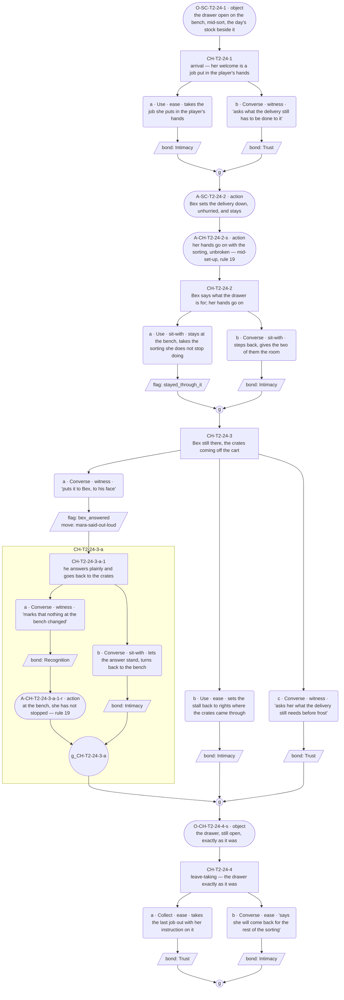

# `mara-said-out-loud` — v01

**This life only.** Mara is dealt Herbalist this run (ratified 2026-08-07), so the staging below is the herb stall on Market Row (`world:maras-stall`, `world:market-row`) and Bex is dealt Farmer, which is what puts him at a market stall with something in his hands. The thread's identity rides on [`cast/mara.md`](../../../cast/mara.md); the row is ratified in [`cast/mara-herbalist-threads.md`](../../../cast/mara-herbalist-threads.md). Everything here is the Herbalist instance and does not survive a reshuffle — **including the relation**: `rel:` entries are per-life and re-key at the reshuffle. What travels is the *shape* of the loss, not who else shared it.

**Open question:** Is the keeping something she has decided, or something she has not looked at?

**Status:** Architect brief authored 2026-08-09. **Choice design ran 2026-08-09** — both conversations carry a content block and a mermaid graph; 5 nodes in C1, 7 in C2; action slots placed. **GRAPHS APPROVED by Roc, 2026-08-10.** **Prose written 2026-08-10** — C1–C2 line files exist in `lines/`. Structural changes remain a re-spec through Roc, not a quiet edit.

**This is the built-on-another-NPC row** of Mara's three (festival arc · essence · another NPC). The other NPC is **Bex, her brother** (`rel:bex-mara`, ratified 2026-08-09), and he is a **texture soul with no registry and no threads of his own** — he appears here as a situation in Mara's scenes, never as a thread holder. Nothing accrues to him: no bond score, no conviction, no echo, no arc (his canon flag 8).

---

> **On naming, precisely (ruled 2026-08-09 — Roc).** What is barred is **Mara naming**. Her personality will not say the thing, and **no line of hers anywhere in this thread does.** It is *not* a bar on naming happening near her: another soul may name what she keeps, and Bex is the one who would. `mara-village-notices` was rejected as proposed, not as a shape — that row put the naming in the village's mouth, which is Toby's device; this one puts it in her brother's, to her face, and spends it on a different fact.
>
> **What Bex may name and what he may not.** He names **what the drawer is for** — the keeping, out loud, plainly. He does **not** name Adren. `prop:adrens-doll` is `mara-set-for-two`'s single delivery — the one object Mara gives a full provenance run to and the only time she says the name of the person the drawer is for — and this thread does not pre-empt it, reach for it, or gate on it. **The name `offstage:adren` does not appear in this thread at all**, in any slot, from any speaker.

---

## Thread shape

**A hinge that does not turn. Two deliveries across two conversations.**

Stated against the other three live threads so the difference is checkable. `toby-the-shelf` accumulates evidence toward an outside naming and ends open on a held breath. `mara-set-for-two` turns once, in the middle, on a recomposition the player performs. `ilsa-kin-no-show` accrues instances in any order and closes by arrangement. **This one is built around the single event the other three are built to avoid** — somebody says it out loud — and its content is the **non-effect**. The naming lands, is heard, and moves nothing; and then the reason it moves nothing turns out not to be that she cannot hear it.

| # | Delivery | Fact | Card field | Staged this life as |
|---|---|---|---|---|
| D1 | It gets said, to her face, and nothing changes | cast (the relation) + situation (the saying) | `deflection_target` under the one pressure it is not built for · `conviction` unmoved | Bex at the stall with the day's delivery; he says what the drawer is for, plainly, in the player's hearing. Her hands do not change what they are doing, and the sorting goes on |
| D2 | He has said it before — so the keeping is a decision she has already made, not a thing she has not looked at | cast | `essence_descriptor`'s belief priced as a choice · `precision_profile` (the stop, in front of a person, one step earlier than usual) | Bex back at the stall, named back by the player, answering plainly: this is not the first time. The drawer is exactly as it was. She goes on tending, and the not-changing is now legible as a position held rather than a fact unnoticed |

**Conversation allocation** — the Architect's call, and the constraint the Choice designer works inside:

| Conversation | Scene id | Screen | Carries |
|---|---|---|---|
| C1 | `SC-T2-24` | T2, Market Row | D1 |
| C2 | `SC-T2-25` | T2, Market Row | D2 |

Scene ids are proposed: the next free block on T2 after `mara-tonic-frost`'s reserved `SC-T2-22`/`-23`. **Downstream confirms against the id registry** — code mints ids; this table reserves shape only.

**Why two and not three, stated so the decision is reviewable.** The other two Mara threads run three conversations each; this one runs two on purpose. Its content is a *non-change*, and a non-change stretched over three visits stops being a held position and becomes weather — the technique note's watch-out, in the direction of placid drift. A third conversation was considered and rejected twice over: a re-touch would show the same drawer unchanged a third time, which D2 has already made legible, and the natural candidates for a third beat are rows Roc has already ruled on — a kept thing claimed back (`mara-claimed-back`, **rejected**) and the village remarking on her (`mara-village-notices`, **rejected**). **If Roc wants a third, the honest one is a beat where she is named back a second time and the answer is identical** — and that is a decision for the gate, not for this seat.

**No quiet beat.** A quiet beat costs a full time block (ruled 2026-08-06), and in a two-conversation thread it would be half the thread bought for no delivery. C1's non-change already *is* the silence this thread trades in, and it carries a delivery.

---

## What happens across the thread

Her brother comes to the stall with the day's delivery, the way he does. In front of the player he says what the drawer is for — short, level, to her face, no advice attached and no reason given, which is how he says everything. She keeps sorting. Nothing in her hands changes, no answer comes, and the not-changing is the scene: the player watches a sentence that should land not land, and watches her go on doing the thing it was about. Second visit: he is back, and a player who wants to can put it to him. He answers plainly, because that is what he does when he is named back — he has said it before. Not once, in front of a stranger. Before. The drawer is exactly where it was. What that turns is nothing in the world and everything in the reading: she is not a woman who has never heard it. She has heard it, and she is still keeping, and that is a position, not a blind spot.

**Where it leaves off on day 5: held.** This thread does not end open (Toby's), does not end on a recomposition (`mara-set-for-two`'s), and does not close by arrangement (Ilsa's). It ends on a **position, understood and unbudged** — the player now knows the keeping is chosen, and knowing it changes nothing about her, which is the same non-effect the thread opened with, one turn deeper.

**Nothing here moves her, corrects her, or converts anyone.** Bex's naming never does the player's work (his canon flag 4) — it moves no other soul's arc, substitutes for no corrective act, sets no flag about anyone's inner life, and delivers no World Truth. He tells the truth and it changes nothing, and **that non-effect is canon.** He is a voice in the argument, never its verdict (his flag 5): no beat frames his answer as the sane one and no soul converts to it. Neither of them reads the other's response as the same grief, and no slot may state that they are — the seam is the player's to see, and it belongs to the codex, not to a line.

**Why a player comes back:** because a sentence landed and did nothing, and there is a person standing there who knows why.

---

## Dependency order

    mara-set-for-two (complete) ──> C1 (D1) ──> C2 (D2)

**Cross-thread entry gate (ruled 2026-08-09 — Roc): `mara-set-for-two` must complete before this thread opens.** The doll's name lands first. This is v01's first hard cross-thread precondition, and it supersedes the "either order works" claim this brief originally flagged for Roc's call (see Delta declarations and Flagged to Roc, below, both updated to record the ruling rather than the open question). **Consequence for the design:** the player already knows whose the doll was by the time Bex names what the drawer is for, so nothing in C1 or C2 may stage the naming as the player's first knowledge that the drawer is for anyone — Bex's line lands on a keeping the player can already put a name to, not on an anonymous one. This is a scene-composition consequence, not a structural one: no node, gate, or flag changes.

- **`mara-set-for-two` needs to be complete before this thread's C1 is reachable.** Entry gate, thread-level, per the 2026-08-09 ruling.
- **C1 needs nothing else.** Zero-knowledge entry within the thread. It must work as the player's first contact with Mara *and* with Bex this week — no sibling thread, no prior scene. The naming is situation: it happens in front of whoever is there, whatever they pick.
- **C2 needs C1 complete. Entry gate is completion only — deliberately not a knowledge flag.** `toby-the-shelf`'s C4 gates entry on a missable knowledge flag and the standing flag under its C2 records the cost: a reveal lost outright rather than shallowed, which R5 forbids. Here both knowledge flags gate content *inside* C2, and a fallback player walks both conversations and receives D1 and D2 in full.

### Flags

| Flag | Set by | Read by |
|---|---|---|
| `stayed_through_it` | C1 (staying at the bench through the naming and after — taking the sorting she does not stop doing, rather than following Bex out or stepping back from the pair of them) | C2 |
| `bex_answered` | C1 (naming him back — putting it to Bex, to his face, while he is still there; per his canon flag 9 he answers plainly and does not deflect) | C2 |

**Every flag has a reader.** No flag may be added without one. Note against the `shelf_named` precedent: neither flag is written in the last conversation, so nothing is write-only by construction.

**Both flags are player acts, and neither is a fact about anyone's inner life.** That distinction is load-bearing: Bex's canon flag 4 bars his naming from setting a knowledge flag about another soul's inner life, so no flag in this thread records what Mara feels, knows, or has decided. `bex_answered` records that the player spoke to Bex. What his answer *contains* is D2, and D2 arrives by situation.

### Facts read per conversation

C1 reads none · C2 reads two (`stayed_through_it`, `bex_answered`). R6's ceiling is two.

### No negation, anywhere

**`not knows(x)` is not a predicate and never was.** The resolver parses `^knows\(([^)]+)\)$` — no `not`, no `!`, no `&&` — so a gate written with negation compiles to nothing and its branch is silently unreachable. This cost `ilsa-kin-no-show` C2 a full redesign (`GP-124`, Roc's ruling 2026-08-09: redesign, do not extend the compiler). **Every not-knowing case in this thread is expressed as the ungated fallback**: the knowing player takes the gated node, everyone else walks the path that rule 4 already required to exist. The state table below is written that way and the Choice designer must keep it so.

---

## Delta declarations

Stated against `cast/mara.md`'s `delta_rule` (floor one, ceiling two cast facts solo, situation uncapped, reference free). **Other cast are present in both conversations, so the cast-fact ceiling is one, not two.**

| Conversation | `delta_cast` | `delta_situation` |
|---|---|---|
| C1 | Bex is her brother — **one** (`rel:bex-mara`, ratified; first staged delivery) | Festival week at the stall; Bex's delivery arriving; the drawer being sorted as ordinary business |
| C2 | He has said it before — **one** | The week one state further; lanterns further along Market Row; the drawer unchanged since C1 |

The drawer, the corner, the sorting and the past-tense habit are **reference-free** and are not re-declared here — `mara-set-for-two` delivers them, and a delta slot re-declaring a delivered fact unchanged is a structural flag back to this seat, never a prose flag to Content. Both scenes clear the floor on their cast slot alone.

**Ordering across threads — ruled, not a claim (Roc, 2026-08-09).** `mara-set-for-two` must complete before this thread opens; the doll's name lands first. The two threads still deliver **different facts** — his is *that it is chosen*, hers is *whose it was* — but they are no longer order-independent: Bex's plain sentence now always lands on a person the player already holds a name for, never on a drawer whose contents are still anonymous. This closes the ordering problem the registry flagged on the `mara-set-for-two` row and supersedes the "either order works" claim this brief originally carried; see the entry gate under Dependency order, above.

---

## Constraints on the conversation design

- **Entry gate is the previous conversation in this thread completing. Nothing else.** Completion gates the sequence; knowledge gates content inside conversations.
- **Every incoming state must walk without dead-ending.** C2 reads two facts: four states, all authored. One state is always the fallback — finished C1, marked nothing — and it exits through real content, because D2 arrives by situation.
- **A missed fact makes the thread shallower, never rerouted** (R5). Both deliveries arrive by situation; picks decide depth, never receipt.
- **Options are equal weight.** Staying at the bench through the naming takes the job she is still holding out and declines the exit; following Bex takes the question to the person who will answer it. Neither is the correct read of the room and no counter keys off repetition (guardrail check 2).
- **Bond weights:** Recognition 3, Trust 2, Intimacy 2. The deep path records Recognition; the shallow path records Intimacy or nothing. **Bex takes no bond record of any kind** — he has no bond score (his canon flag 8), so an option spent on him records against Mara or records nothing, never against him.
- **The non-change is the content, and it must not be softened.** Her hands do not falter, slow, pause meaningfully, or resume. Nothing in her face is described as registering it. A beat where the naming visibly costs her something has written the scene this thread exists instead of.
- **She does not answer, anywhere, in any state.** No player option produces a Mara line that confirms, denies, qualifies, or acknowledges the naming, and none produces one that explains the drawer. That is the bar, verbatim: **Mara naming is barred**, and her `voice_enforcement` failure mode 4 makes the moment she can say what the drawer does to her the moment the arc is spent in a sentence. If pressed, the beat takes the carded grief shape — fragments divided by action slots: she wipes a clean thing, closes the drawer, straightens what was straight — and then her welcome is an imperative, so the answer to being asked about herself is a job put into the player's hands.
- **Bex's voice constraints the designer must not fight** (his card is a draft awaiting the gate; the flags below are ratified rulings on it): naming lines run **3–8 words**, plain, never verbose — his licence is to name a feeling, not to talk about one (flag 3). He names **only to faces, only in the present**, and never attaches advice, comfort, or interpretation of cause (flag 6): no *because*, no *you should*, no theory of why she keeps. His `deflection_target` stays empty forever — a Bex line that routes a feeling onto a task or an object is a flag, exactly inverse to every other carded soul (flag 2). Warmth is invariant and its channel is **levelness**; grave, hushed, ceremonial, smug, or diagnostic delivery is a defect (flag 7). Told to stop, he stops without apology and without updating the underlying decision (flag 9).
- **No long run anywhere in this thread, from either of them. Zero marked runs.** Mara's one run per scene is licensed for an object's provenance only and this life's belongs to `prop:adrens-doll` in `mara-set-for-two`; **any long run about the loss itself is barred absolutely** (her failure mode 3, canon flag 12). Bex is barred from any long run about a feeling with no exception (his flag 3). Between them there is no legal long run in this thread, which is the correct result — the whole material is a short sentence and a silence.
- **Nothing here reaches for the doll, the whistle, or the seam pass.** The doll's name is `mara-set-for-two`'s C2 delivery. The child's whistle is visible staging, gets no attention, and is not for sale (`conviction`). The drawer must stay writable for the seam pass — canon flag 4: `ilsa_second_apron` pays off through this drawer in Mara's voice, returning an unclaimed object unremarked — so **nothing in either conversation may empty the drawer, inventory it, or give anything in it a provenance**.
- **No third party beyond Bex.** No walk-on remarks on the naming, on her, or on the pair of them. The standing to remark exists (canon flag 5) and is spent here on Bex and on nobody else; a second outside voice would run Toby's accumulate-to-outside-naming device inside Mara's set.
- **She is never released** (canon flag 2). Being told plainly is not a step toward letting go; no beat may frame it as one, and the drawer is in the same state on the last day as the first. **No World Truth is stated in-scene and no scene grants Mara a fix** — she is not wrong to tend, and Bex does not correct her.
- **Voice constraints for Mara:** her band is 12–25 words against the village median of 5–7; a Mara line clipped to 5–7 reads as Toby. **The gap between the two bands is doing structural work in this thread** — her brother's 3–8 against her 12–25 is the two engines audible side by side, and collapsing either toward the other erases it. The past tense arrives uninvited and unremarked in her lines and she never explains it; no player option makes her (canon flag 5). The spread governs tense placement only — not tempo, not uptake, not warmth (canon flag 9).
- **Held distinct from Linnet** (`voice_enforcement` failure mode 5): Bex naming what the drawer is *for* must not resolve the keeping to one habit for one person, precisely known. He names the keeping, not its object — she keeps everything, for anyone, and goes vague when asked who any of it is for.

### Pacing

A thread may be entered **once per time slot**; the day's opening slot belongs to the festival arc; later slots allow multiple threads (GP-93). Two conversations fit in a minimum of one day.

**Nothing here may assume which slots, which days, or how much clock separates them.** C2's "he has said it before" refers to time before the story opens, never to a countable number of visits, so no spacing can contradict it. `role-workplace.json` (provisional) puts Mara at T2 mornings; both conversations are T2 and neither requires a second screen.

**Bex must be present in both conversations** — `npc_present(bex)` is schema predicate vocabulary and is available to the Choice designer, but presence here is **scene composition, not a gate**: he is staged into both scenes, so no walk reaches either conversation without him. A design that makes his presence conditional loses D1 and D2 outright, which R5 forbids.

### Id conventions

Per [`narrative-pipeline/templates/id-label-convention.md`](../../../narrative-pipeline/templates/id-label-convention.md). Choice nodes `CH-T2-24-1`, `-2`, … · options `-a`, `-b` · player line `L-CH-T2-24-1-a-p` · response `L-CH-T2-24-1-a-r1`. Code mints final ids; these reserve shape only.

**Every id gets its label at first mention in prose** — the id in backticks, an em dash, the gist, the gist minted once in the mermaid graph and reused verbatim everywhere after. Any id whose tail crosses into a nested child additionally carries the segment readout, with the word **child** mandatory. **Variant selectors:** path variants are `-norm` / `-div` and nothing else; state variants take the flag name verbatim, two flags joined by `-and-` (ruled 2026-08-09) — so the C2 pair, if the set-up varies by state, mints `-s-stayed_through_it-and-bex_answered` and `-s-bex_answered`, never a shape word. A slot wanting both a path and a state variant surfaces to Roc.

### Proposed examinables

**None — and this is a declaration, not an omission.** Guardrail check 11 joins declared examinables to built ones; a thread that declares nothing has nothing to join and passes every gate with its paths closed permanently, which is exactly the hole the 2026-08-09 ruling exists to close. So the reasoning is stated rather than left implicit:

- **No path in this thread closes.** No entry gate reads a knowledge flag, and both deliveries arrive by situation, so every player walks both conversations and receives D1 and D2 in full. What the two flags buy is depth inside C2. Missing them shallows C2 per R5 and closes nothing.
- **Neither flag is reproducible by an examinable, so a pickup would be a lie about what the flag means.** `stayed_through_it` records that the player stood in the room while a sentence did not land — a thing that exists only in the moment, which no object can hand back. `bex_answered` records that Bex answered *to the player's face*, which is the only way he ever answers (his canon flag 6, present tense, to faces); an examinable that set it would be an object claiming to have been spoken to.
- **The drawer is deliberately not an examinable**, per `mara-set-for-two`: opened unaccompanied it delivers that thread's material as scenery, and nothing here changes that.

T2's wired examinables today are `stall_goods` and `ex-shelf` (Toby's, `knowledge_flag: shelf_seen`). `ex-tending` (`mara-set-for-two`'s), and `ex-tonic-shelf` and `ex-mended-basket` (`mara-tonic-frost`'s) are declared and not yet built. This thread adds nothing to that list.

### Declared inventions (guardrails check 12)

**None.** Everything this thread stands on is already ratified in [`narrative-pipeline/npc-codex.md`](../../../narrative-pipeline/npc-codex.md): `soul:bex`, `soul:mara`, `rel:bex-mara`, `world:maras-stall`, `world:market-row`. Bex arriving at a market stall with a farmer's delivery is scene colour under the invention loop's quantities-are-colour rule and proposes no codex entry. **`offstage:adren` is ratified and is deliberately not used** — see the naming box above.

---

## States

| Conversation | Reads | Incoming states |
|---|---|---|
| C1 | none | 1 — zero knowledge, must work as first contact with both souls this week |
| C2 | `stayed_through_it` · `bex_answered` | 4 — both (the full read: someone who stood inside the non-change and then asked the person who caused it) / `bex_answered` only (the answer without having been in the silence it explains) / `stayed_through_it` only (the silence held, the reason arriving cold from him) / neither (fallback, **ungated**: he is there, he answers what he is asked, D2 arrives by situation, and a real visit exits through real content) |

Each not-knowing state above is the **ungated fallback path**, never a negated gate.

---

## Card fields the designer must not contradict

### Mara

- **`deflection_target`** — the object at hand and its history. Ask her about herself and she picks something up and gives its provenance; true, freely given, about her not at all. **Here it is under the one pressure it is not built for** — a statement rather than a question — and it holds anyway, because she is not required to answer a statement.
- **`precision_profile`** — exact about things, vague about people. The sentences stop where a person begins. **The stop is authored content, never a bug**, and in this thread it happens without her ever having started.
- **`warmth_channel`** — restoration of what is already had, never anticipation of what will be needed. She does not mention having mended anything.
- **`conviction`** — she will not leave, will not let the festival lapse, will not have the anchor moved; the whistle is not for sale and **no bond state buys the conviction out** (canon flag 8). Bond level may move whether she can *say* what the drawer is; it never moves won't-leave, won't-let-it-lapse — and no bond state in this thread makes her say it.
- **Warmth is invariant.** The past tense is never wistful, never a complaint, never a bid for the listener's sympathy, never a chill toward whoever is in the room (canon flags 6, 9).
- **She never states her own trait** and no World Truth is spoken in-scene (canon flag 5). Beauty is stated as plain fact about the thing, never as her feeling about it (canon flag 7).
- **She is never released** (canon flag 2). **Grief beats are fragments divided by action slots** (canon flag 12); a long run tagged quiet is a flag.

### Bex

- **`deflection_target` is empty forever** (his canon flag 2) — a line that routes a feeling onto a task, an object, or a placement is a flag, exactly inverse to every other carded soul.
- **Plain, never verbose** (flag 3). Naming lines run 3–8 words. Any long run about a feeling is barred with no exception.
- **His naming never does the player's work** (flag 4). It moves no arc, substitutes for no corrective act, sets no flag about another soul's inner life, delivers no World Truth. **The non-effect is canon.**
- **A voice in the argument, not its verdict** (flag 5). No beat frames his stance as the sane one; nobody converts to it; his plainness keeps its costs.
- **Only to faces, only in the present, never with advice, comfort, or cause** (flag 6). He is exact about whether a feeling is there and fallible about why.
- **Warmth is invariant, channel levelness** (flag 7). Grave, hushed, ceremonial, smug, or diagnostic delivery is a defect.
- **Social-only** (flag 8): no bond score, no conviction, no echo, no arc, no threads owned. Nothing accrues to him.
- **Named back, he answers plainly and does not deflect; told to stop, he stops** without apology and without updating the underlying decision (flag 9). **This is the mechanism D2 rides on.**

---

## Conversations

**For the Choice designer.** One section per conversation, each to receive a content block and a mermaid node graph in the fixed convention. **Roc approves the shape before any prose is written.**

**Action-slot convention (contract rules 18–21).** Description beats — `action` and `object` slots — are drawn as **stadium** shapes: `AS1(["A-SC-T2-24-2 · action structural gist"])`. The label carries the slot id, the slot type, and a structural gist; Lines writes the words, per the register's action-note rules (name the actor and the thing, no interiority, handling verbs). A stadium on a spine edge is a scene-level beat between nodes; a stadium inside an option branch belongs to that option's response run; a stadium on a node's entry edge marked `-s` interleaves with that node's set-up. Ids: `A-` (action) or `O-` (object) plus the scene or choice id, suffixed `-s` (set-up interleave) or `-r` (response run).

### C1 — `SC-T2-24`

**Carries D1. Reads no prior facts — one incoming state (zero knowledge). Must work as first contact with Mara *and* with Bex this week. 5 choice nodes (4 top-level + 1 nested). Variety devices (rule 16): a three-option node; nesting to depth 1. Action layer (rules 18–21): 5 description slots (3 `action`, 2 `object`) against ~14 dialogue slots on the deep walk — ratio ≈ 1:2.8, at the dense end of the band on purpose, because the delivery this conversation carries is a non-event and a non-event is made of description. Zero marked long runs. No walk-ons.**

**Content block.**

- **Incoming state: zero knowledge (the only state).** Nothing is closed. The stall is staged with the drawer open on the bench, mid-sort, as ordinary business — visible whatever the player picks, never opened out, never inventoried, nothing in it given a provenance (`mara-set-for-two`'s material is not reached for). Bex is staged into the scene with the day's delivery; his presence is scene composition, not a gate, so no walk misses him. D1 arrives by situation: he says what the drawer is for in the player's hearing at node 2's set-up, whatever the player picked at node 1, and nothing in the scene turns on whether the player was looking.
- **Node 1 (`CH-T2-24-1` — arrival; her welcome is a job put in the player's hands, ungated).** Bex's cart is being unloaded at the edge of the stall and the day's stock is half-set. Take the job she puts in the player's hands (deed — records Intimacy; being enlisted into the tending is how she lets someone in) or ask what the delivery still has to be done to it (spoken — records Trust; she answers with the practical, exact and freely given, `precision_profile`'s exact half on stock and stall, never on the drawer). Both record, differing in kind. **Equal weight:** taking the job spends the beat inside her tending; asking spends it on the work she is exact about. Neither is a read of the room, because the room has not happened yet. **No accrual:** nothing keys off repeating either.
- **Node 2 (`CH-T2-24-2` — Bex says what the drawer is for; her hands go on, ungated).** The turn, and the delivery. His naming is the node's set-up, not an option, so it lands on every walk. Stay at the bench and take the sorting she does not stop doing (deed — sets `stayed_through_it`) or step back and give the two of them the room (deed — records Intimacy). **The non-change is the content and is not softened:** her hands do not falter, slow, pause or resume, nothing in her face is described as registering it, and she says nothing about it in either branch. She has not been asked a question, and she is not required to answer a statement — `deflection_target` under the one pressure it is not built for, holding. **Equal weight:** staying takes a job that is still being held out and puts the player inside a silence that is not theirs; stepping back declines to stand in it and leaves the two of them what belongs to them. Neither is the correct read, and no response scolds the other pick. **Why the flag option records no bond:** `stayed_through_it` is knowledge of a moment, and hanging a bond delta on it would price standing still in a room as the deeper act; the sibling's Intimacy and the flag are asymmetric in kind, never in rank.
- **Node 3 (`CH-T2-24-3` — Bex still there, the crates coming off the cart, ungated, three options).** Reachable from both node-2 branches, because he does not leave when he has finished the sentence — he goes back to what he was doing, which is canon. Put it to him, to his face, while he is still there (spoken — sets `bex_answered`, moves the thread; opens the nested child below), set the stall back to rights where the crates came through (deed — records Intimacy against Mara; restoration of what was already had, her `warmth_channel`, and the only bond this option pair may record, since **Bex takes no bond record of any kind**), or ask her what the delivery still needs before frost (spoken — records Trust; ordinary business, and she takes it). **Equal weight:** naming him back gets the plainest answer in the conversation and gets nothing else; the other two spend the beat on the work, which is where she is. The thread move rides the **player's act of asking**, never Bex's answer — his line moves nothing, sets no flag about anyone's inner life, and delivers no World Truth.
  - **Nested child (`CH-T2-24-3-a-1` — he answers plainly and goes back to the crates, inside option `-a`).** Named back, he answers: level, short, no cause attached, no advice, no theory of why she keeps, and then he is done with the subject. Mark that nothing at the bench changed (spoken — records Recognition, the deepest read in the conversation, and it is the player's read, not his) or let the answer stand and turn back to the bench (deed — records Intimacy). Both record. **Why nesting and not a flag-gate:** this beat exists only as an answer to being asked. A flag-gated sibling would print its set-up to players who never asked — the framing of a plain answer nobody sought — and every other player would walk past a silent skip. `stayed_through_it` also cannot serve as that gate: it records staying, not asking, and the two are independent by design.
- **Node 4 (`CH-T2-24-4` — leave-taking; the drawer exactly as it was, ungated).** Take the last job out with her instruction on it (deed — records Trust) or say the player will come back for the rest of the sorting (spoken — records Intimacy; it hands her the one thing she takes, which is more tending). Both record. The scene ends with the drawer in the state it opened in.
- **Closed paths.** None. Every node is ungated; nothing in this conversation reads a fact, so nothing closes and no examinable is required (see **Proposed examinables** above — the declaration of none is deliberate).
- **Action slots (rule 18).** Five description beats, typed and placed; Lines writes them:
  - `O-SC-T2-24-1` (`object`, scene opening, before node 1) — the drawer open on the bench, mid-sort, the day's stock beside it. Present before anyone speaks, contents unremarked and uncounted.
  - `A-SC-T2-24-2` (`action`, spine, node-1 gather → node 2) — Bex sets the delivery down, unhurried, and stays.
  - `A-CH-T2-24-2-s` (`action`, inside node 2's set-up) — her hands go on with the sorting, unbroken. The non-effect is a thing the player watches; it has no legal spoken rendering, so it is typed `action` (check 8). Part of the rule-19 build below.
  - `A-CH-T2-24-3-a-1-r` (`action`, inside the nested child, option `-a`'s response run) — at the bench, she has not stopped. Part of the second rule-19 build below.
  - `O-CH-T2-24-4-s` (`object`, inside node 4's set-up) — the drawer, still open, exactly as it was. Not emptied, not inventoried, nothing in it given a history — the seam pass's material stays writable.
- **Rule-19 builds — the two beats that carry weight.**
  - **Node 2's set-up, the naming.** Built fragment → action → fragment: Bex's naming line (3–8 words, level, to her face) → `A-CH-T2-24-2-s` (her hands go on) → a shorter Bex fragment returning to the delivery, ordinary, no cause attached. The silence between the fragments is the action slot; the weight is never moved into a longer line, and the second fragment is **his**, because a Mara fragment here would be an answer.
  - **The nested child, option `-a`, marking that nothing changed.** Player line (its own ≤12-word fragment) → a short Bex fragment → `A-CH-T2-24-3-a-1-r` (she has not stopped) → shortest fragment. The run may close on the action slot.
- **No sanctioned long run (rule 20).** None placed, and none is legal: Mara's one run per scene is licensed for an object's provenance only and this life's belongs to `prop:adrens-doll` in `mara-set-for-two`, while any run about the loss itself is barred absolutely; Bex is barred from any long run about a feeling with no exception. Zero marked runs is the correct result for material that is a short sentence and a silence.
- **Walk-ons (rule 21).** None. Bex is carded, not a walk-on, and takes his own band — 3–8 words, level, never the walk-on band's warmer, explaining register. No third party remarks on the naming, on her, or on the pair of them.

### C2 — `SC-T2-25`

**Carries D2. Entry gate is C1 completing — no knowledge entry gate, per the Architect's dependency order. Reads two prior facts: `stayed_through_it`, `bex_answered` — four incoming states, all authored, all ungated at entry. 7 choice nodes (6 top-level + 1 nested). Variety devices (rule 16): nesting to depth 1; a three-option node; the two knowledge gates are split rather than conjoined, so the two mid states are structurally distinct rather than fallback-identical. Action layer (rules 18–21): 6 description slots (4 `action`, 2 `object`); the deep walk sees all six against ~17 dialogue slots — ratio ≈ 1:2.8; the fallback walk sees four against ~11 — ≈ 1:2.75. Zero marked long runs. No walk-ons.**

**Content block.**

- **Scene business, all four states.** The week one state further, lanterns further along Market Row, and the drawer unchanged since C1 — open on the bench, still mid-sort, still not opened out and still not inventoried. Bex is back with the day's delivery, staged in, not gated. **D2 arrives by situation at node 2's set-up**, which is ungated and on every walk: he names it again, the same way, and says plainly that it is not the first time. That is a fact about **his own past act**, not a fact about Mara's inner life, so it sets no flag and his card's flag 4 is not touched. The two knowledge flags buy depth after it, never receipt of it.
- **Node 1 (`CH-T2-25-1` — the week further on; her welcome is a job again, ungated).** Take the job she puts in the player's hands (deed — records Intimacy) or ask what still needs doing before frost (spoken — records Trust; her exactness lands on stock, lanterns and the stall, never on the drawer's contents). Both record, differing in kind. The fallback player's conversation opens on real content.
- **Node 2 (`CH-T2-25-2` — he names it again, and plainly not the first time; her hands go on, ungated, three options).** The delivery, to every state. Ask him how long he has been saying it (spoken — records nothing at this level; it opens the nested child, and **every path through the child records**, so no walk through this option ends recordless — that is why the silent branch here is not a polite decline in equal-weight clothing), keep sorting beside her and take the next handful (deed — records Intimacy), or turn the talk to the delivery (spoken — records Trust; ordinary business, which he takes without noticing it was offered him). **Her hands go on exactly as in C1** — no falter, no pause, nothing in her face described as registering it, and no line of hers confirms, denies, qualifies or explains. **Equal weight:** asking gets a plain answer about him and nothing about her; sorting beside her spends the beat inside the tending the sentence was about; turning to the delivery leaves both of them the ordinary business, which is what they are both doing anyway. No response scolds an unpicked option. **No accrual:** nothing counts how often the player asks, and asking twice across the thread unlocks nothing.
  - **Nested child (`CH-T2-25-2-a-1` — he answers how long, plainly, and goes back to the crates, inside option `-a`).** Level, short, present tense, to her face, no cause attached — he does not say why she keeps and does not say what it costs anyone. Mark that the drawer is in the same state it was in last time (spoken — records Recognition) or let the answer stand and turn back to the bench (deed — records Intimacy). Both record. **Why nesting and not a flag-gate:** the answer exists only as an answer to the question; a flag-gated sibling would print its framing to every player who never asked, and the rest would take a silent skip through it. `bex_answered` cannot serve as that gate either — it is set in C1 and gates node 4, and reusing it here would make one prior act do two structurally different jobs in one scene.
- **Node 3 (`CH-T2-25-3` — the bench work the player took a hand in, still unfinished, gated `knows(stayed_through_it)`).** Opens only for a player who stayed through the naming in C1. The same job, at the same place in it, with the drawer open beside it and untouched. Take it up again where it was left (deed — records Intimacy) or mark that it is exactly where it was left (spoken — records Recognition). **Her answer to being marked is a job**: she puts the next handful into the player's hands, which is her welcome shape in the answer position — practical, exact about the work, and about herself not at all. She does not confirm what was said last time, because she has not been asked about it and would not answer if she were. If the gate is false the node auto-skips to its gather.
- **Node 4 (`CH-T2-25-4` — a second putting-to-him, gated `knows(bex_answered)`).** Opens only for a player who named him back in C1 and knows he answers. Put it to him a second time, to his face (spoken — records Recognition, moves the thread; the move rides the player's act, not his answer) or tell him to leave it (spoken — records Trust; per his flag 9 he stops at once, without apology and without updating the decision under it, and he does not unsay what he said). **Equal weight, and this is the pair the thread has to get right:** pressing gets the plainest answer available and changes nothing — the drawer is in the same state after it as before; stopping him is the only move in either conversation that changes anything at all, and what it changes is whether he speaks, not what she keeps. Neither response scolds. **Neither pick is framed as protecting her, and neither is framed as correcting him** — the scene does not treat his naming as a harm to be stopped or as a truth to be finished, which is exactly how he stays a voice in the argument and never its verdict. If the gate is false the node auto-skips.
- **Node 5 (`CH-T2-25-5` — the delivery done, the row getting on with the lanterns, ungated).** Reference beat, no new fact, nothing re-declared. Carry the empties out to the cart (deed — records Intimacy) or ask her what the lanterns still need (spoken — records Trust; the exact half, on the row and the work). Both record. It keeps the week legible without re-spending D1 or D2.
- **Node 6 (`CH-T2-25-6` — leave-taking; the drawer where it was, ungated).** She puts a last job in the player's hands. Take it and go (deed — records Intimacy) or say the player will come back for the rest (spoken — records Trust). Both record. The thread ends **held**: nothing closed, nothing released, the drawer in the state it was in on the first day.
- **The four incoming states, traced.**
  - **Both (`stayed_through_it` and `bex_answered`) — the full read.** 1 → 2 (child if asked) → 3 → 4 → 5 → 6. Six top-level nodes; the deepest walk, and the only one carrying both Recognition beats.
  - **`stayed_through_it` only — the silence held, the reason arriving cold from him.** 1 → 2 (child if asked) → 3 → 5 → 6. Node 4 auto-skips.
  - **`bex_answered` only — the answer without having stood in the silence it explains.** 1 → 2 (child if asked) → 4 → 5 → 6. Node 3 auto-skips.
  - **Neither — the fallback, ungated throughout.** 1 → 2 (child if asked) → 5 → 6. Four full nodes plus the child if the player asks, D2 delivered whole at node 2's set-up, and the visit exits through real content, not an apology. Shallower, never rerouted. **No negated gate anywhere:** the not-knowing cases are this path, not a predicate.
- **Closed paths.** None. Neither flag gates entry, both deliveries arrive by situation, and a missed flag shallows C2 rather than closing it — which is why the thread declares no examinables, and why neither flag is reproducible by one (both are player acts in a moment, stated above).
- **Action slots (rule 18).** Six description beats:
  - `O-SC-T2-25-1` (`object`, scene opening, before node 1) — the drawer open on the bench, unchanged since C1; lanterns further along the row. The week's new state and the drawer's unchanged one, in one picture.
  - `A-CH-T2-25-2-s` (`action`, inside node 2's set-up) — her hands go on with the sorting, unbroken, the same as before. Part of the rule-19 build below.
  - `A-CH-T2-25-2-a-1-r` (`action`, inside the nested child, option `-b`'s response run) — he goes back to the crates; the subject is finished for him.
  - `O-CH-T2-25-3-s` (`object`, inside node 3's set-up) — the unfinished sorting, at the same place in it.
  - `A-CH-T2-25-4-s` (`action`, inside node 4's set-up) — he sets the crate down before he answers.
  - `A-SC-T2-25-6` (`action`, node 6's set-up) — she puts a last job in the player's hands.
- **Rule-19 builds — the two beats that carry weight.**
  - **Node 2's set-up, the naming repeated.** Fragment (his naming, 3–8 words, level) → `A-CH-T2-25-2-s` (her hands go on) → shorter fragment (his, that it is not the first time). D2 lands in the shortest fragment in the scene, divided by an action slot, and never in a longer line.
  - **Node 4 option `-a`, the second putting-to-him.** Player line (≤12 words) → `A-CH-T2-25-4-s` (the crate set down) → a short Bex fragment → shortest fragment. The answer is plain and the drawer is unmoved on either side of it; the collapse the beat refuses to make is the point of building it this way.
- **No sanctioned long run (rule 20).** None placed. Same reason as C1, and it is absolute here: her licensed run is provenance-only and spent elsewhere this life, any run about the loss is barred, and Bex is barred from a long run about a feeling with no exception. Zero marked runs in the thread.
- **Walk-ons (rule 21).** None. No third party remarks on the naming, on her, or on the pair of them; the standing to remark is spent on Bex and on nobody else.

```mermaid
flowchart TD
  OS1(["O-SC-T2-25-1 · object<br>the drawer open on the bench, unchanged; lanterns further along the row"])
  OS1 --> N1["CH-T2-25-1<br>the week further on — her welcome is a job again"]
  N1 --> N1a("a · Use · ease · takes the job she puts in the player's hands")
  N1 --> N1b("b · Converse · witness · 'asks what still needs doing before frost'")
  N1a --> R1a[/"bond: Intimacy"/]
  R1a --> J1(("g"))
  N1b --> R1b[/"bond: Trust"/]
  R1b --> J1
  J1 --> AS2s(["A-CH-T2-25-2-s · action<br>her hands go on with the sorting, unbroken — mid-set-up, rule 19"])
  AS2s --> N2["CH-T2-25-2<br>he names it again, and plainly not the first time"]
  N2 --> N2a("a · Converse · witness · 'asks him how long he has been saying it'")
  N2 --> N2b("b · Use · sit-with · keeps sorting beside her, takes the next handful")
  N2 --> N2c("c · Converse · ease · 'turns the talk to the delivery'")
  subgraph S2a["CH-T2-25-2-a"]
    C1["CH-T2-25-2-a-1<br>he answers how long, plainly, and goes back to the crates"]
    C1 --> C1a("a · Converse · witness · 'marks that the drawer is in the same state as last time'")
    C1 --> C1b("b · Converse · sit-with · lets the answer stand, turns back to the bench")
    C1a --> RC1a[/"bond: Recognition"/]
    RC1a --> JC(("g_CH-T2-25-2-a"))
    C1b --> RC1b[/"bond: Intimacy"/]
    RC1b --> ASC(["A-CH-T2-25-2-a-1-r · action<br>he goes back to the crates; the subject is finished for him"])
    ASC --> JC
  end
  N2a --> C1
  JC --> J2(("g"))
  N2b --> R2b[/"bond: Intimacy"/]
  R2b --> J2
  N2c --> R2c[/"bond: Trust"/]
  R2c --> J2
  J2 --> G3{{"knows(stayed_through_it)"}}
  G3 --> OS3(["O-CH-T2-25-3-s · object<br>the unfinished sorting, at the same place in it"])
  OS3 --> N3["CH-T2-25-3<br>the bench work the player took a hand in, still unfinished"]
  N3 --> N3a("a · Use · ease · takes it up again where it was left")
  N3 --> N3b("b · Converse · witness · 'marks that it is exactly where it was left'")
  N3a --> R3a[/"bond: Intimacy"/]
  R3a --> J3(("g"))
  N3b --> R3b[/"bond: Recognition"/]
  R3b --> J3
  J3 --> G4{{"knows(bex_answered)"}}
  G4 --> AS4s(["A-CH-T2-25-4-s · action<br>he sets the crate down before he answers — mid-set-up, rule 19"])
  AS4s --> N4["CH-T2-25-4<br>a second putting-to-him"]
  N4 --> N4a("a · Converse · witness · 'puts it to him a second time, to his face'")
  N4 --> N4b("b · Converse · ease · 'tells him to leave it'")
  N4a --> R4a[/"bond: Recognition<br>move: mara-said-out-loud"/]
  R4a --> J4(("g"))
  N4b --> R4b[/"bond: Trust"/]
  R4b --> J4
  J4 --> N5["CH-T2-25-5<br>the delivery done, the row getting on with the lanterns"]
  N5 --> N5a("a · Collect · ease · carries the empties out to the cart")
  N5 --> N5b("b · Converse · witness · 'asks her what the lanterns still need'")
  N5a --> R5a[/"bond: Intimacy"/]
  R5a --> J5(("g"))
  N5b --> R5b[/"bond: Trust"/]
  R5b --> J5
  J5 --> AS6(["A-SC-T2-25-6 · action<br>she puts a last job in the player's hands"])
  AS6 --> N6["CH-T2-25-6<br>leave-taking — the drawer where it was"]
  N6 --> N6a("a · Collect · ease · takes the last job and goes")
  N6 --> N6b("b · Converse · ease · 'says she will come back for the rest'")
  N6a --> R6a[/"bond: Intimacy"/]
  R6a --> J6(("g"))
  N6b --> R6b[/"bond: Trust"/]
  R6b --> J6
```

> **Devices canon barred, recorded rather than left as absences (contract, "a thread's canon may bar a device").**
> - **`divert`** — none, and none proposed. A divert collapses a visit, and a collapsed visit is a change; this thread's whole delivery is that the sentence lands and alters nothing. `toby-the-shelf` C2's divert is right there because the naming *does* cost the visit; here it would write the scene this thread exists instead of.
> - **Bond-band variants** — declined. Mara's canon flag 8 states that the only thing bond level may move is whether she can *say* what the drawer is, and this thread bars her saying it in every state and at every band. A band-varied node would therefore either vary something bond does not govern, or produce the one line the thread forbids.
> - **A non-`knows` predicate** — unavailable, not skipped. `npc_present(bex)` is the obvious candidate and the brief rules it out explicitly: his presence is scene composition, and gating on it would lose D1 and D2 outright. `day >= n` is barred by the no-clock-assumptions rule. `bond_band` is barred above. The two devices actually used are nesting and a three-option node, which satisfies rule 16.

---

## Flagged to Roc

1. **Bex's card is a draft awaiting the human gate.** Every constraint cited above is a ratified ruling on it, but the card as a whole has not passed. If the gate changes his naming licence, this thread's D1 changes with it — the whole row is built on flag 4's non-effect and flag 9's answers-when-named-back.
2. **CLOSED — ruled 2026-08-09 (Roc): the doll's name lands first.** `mara-set-for-two` must complete before this thread's C1 opens. This is v01's first hard cross-thread precondition. The registry's ordering flag on the `mara-set-for-two` row is resolved by the gate, not by the "either order works" claim this brief originally carried (see Dependency order and Delta declarations, above, both updated to record the ruling).
3. **Two conversations, not three** (Thread shape, above). Reviewable at the gate; the third beat this seat would author if asked is stated there.
4. **What Bex says out loud is not written here and is not this seat's to write** — the Choice designer draws where it lands, Lines writes the words, and both are bound by his 3–8 words, present tense, to her face, no cause attached.
