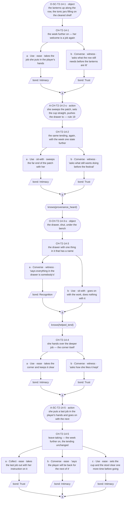

# `mara-set-for-two` — v01

**This life only.** Mara is dealt Herbalist this run (ratified 2026-08-07; role-goal: brew the festival tonic that wards off the first frost), so the staging below is the herb stall on Market Row (`world:maras-stall`, `world:market-row` — both ratified in `narrative-pipeline/npc-codex.md`). The thread's identity rides on `cast/mara.md`; the id `mara-set-for-two` is the one minted in `narrative-pipeline/arc-festival-slice.md`'s Threads to Not Drop table ("The corner 'set for two' and the drawer's unclaimed objects"). Everything here is the Herbalist instance and does not survive a reshuffle.

**Open question:** What is the keeping for?

**Status:** Architect brief complete — **re-authored 2026-08-09 after Roc failed the prior registry at the gate** ("its beat structure follows Toby's too closely"; the prior version ran Toby's skeleton — reveal · reveal · quiet beat · outside-naming — in Mara's furniture, and was deleted, not revised). **Choice design ran 2026-08-10** — C1–C3 carry content blocks and mermaid graphs; 6 / 9 / 5 choice nodes; action slots placed. The thread's one marked long run is placed in C2, on `prop:adrens-doll`'s provenance. The one divert (C1) is **sanctioned** — checked against the schema's five-condition sanctioning test (`../../../narrative-pipeline/templates/choice-node-schema.md`, ruled 2026-08-09) and passes. **GRAPHS APPROVED by Roc, 2026-08-10.** **Prose written 2026-08-10** — C1–C3 line files exist in `lines/`. Structural changes remain a re-spec through Roc, not a quiet edit.

**The role stays out of the way on purpose.** The tonic work is the cover the material arrives under — herbs sorted, jars filled, the drawer cleared for shelf space — never the thread's content. A conversation where the tonic deadline supplies pressure has imported the wrong engine: her pressure is time itself (`narrative-pipeline/mara-arc_draft.md`), and this thread's only clock is the festival week advancing under the tending.

---

> **Amended 2026-08-09 (Roc): the one object she names is Adren's old doll.** The spec was authored with Ovin's pocket-knife — a stranger's object, safe to give provenance to. It is her **own sister's**, and Bex's (`rel:bex-mara`, `offstage:adren`).
>
> **Why that is a different beat, and better.** Naming a stranger's knife costs her nothing; naming Adren's doll is the one time she says the name of the person she is keeping the drawer for. It does **not** break `precision_profile` — she gives the *fact* (whose it was, what it survived, how it came to the drawer) and still cannot give the *meaning*. Exact about the thing, silent about what it costs. The stop still happens; it just happens one step later and in front of a name.
>
> **Ovin is not displaced.** His objects stay in the drawer, un-provenanced staging as before (her card's sample line — "That was Ovin's, before" — is unchanged). The doll is the one object that gets the sanctioned run.
>
> **Cross-thread:** Bex buried the same sister and answers it out loud. `mara-said-out-loud` is the thread that pays that off; this one stays hers alone.

## Thread shape

**Kishōtenketsu at thread scale** (`knowledge-base/narrative/kishotenketsu-scene-structure.md`, ratified 2026-08-09 as an available technique — chosen here because her material has no opposition to escalate and her whole thread is a recognition, not a debt). **Two deliveries across three conversations, and the weight falls in the middle.**

The structural inversion of `toby-the-shelf`, stated so the difference is checkable: Toby hides a pattern and accumulates evidence toward an outside naming, ending open. Mara hides nothing — everything she keeps is in plain sight in C1. What the thread delivers is not new facts but a **recomposition**: one name, arriving in C2 attached to one object, forces everything already seen to read differently, and C3 shows the same tending again so the player can do the re-seeing. No quiet beat. No third-party namer. No held breath — the thread completes when the pattern is fully legible and still entirely unexplained.

| Movement | Conversation | Scene id | Carries |
|---|---|---|---|
| ki + shō | C1 | `SC-T2-12` | D1 — the whole material, staged plainly: the corner set for two, and the drawer of unclaimed things. Both cast facts, both in open view, neither treated by her as remarkable |
| ten | C2 | `SC-T2-13` | D2 — one object in the drawer has a name: the cloth doll with the re-stitched arm was **Adren's** — her own sister's, and Bex's (`offstage:adren`, ratified). The name is delivered by situation, in passing, as she sorts; the full provenance — the thread's one sanctioned long run — is player-elicited |
| ketsu | C3 | `SC-T2-14` | Nothing new. The same stall, the week one state further, the same tending — now legible. Reference only; the deep reads are what the player does with the recomposition |

Scene ids are the next free block on T2 after Toby's `SC-T2-08`–`11`; **proposed, for downstream to confirm against the id registry** — code mints ids, this table only reserves the shape.

**Why the ten is not a twist and not a reveal in Toby's sense:** nothing was withheld. The drawer was met in C1 as what it visibly is. The doll's name adds an *adjacent* fact — one unclaimed thing is somebody's — and the violence is done by juxtaposition: if one is somebody's, all of them are, and so is the corner, and so is the swept patch. Nothing in the world changes; everything already seen reads differently. That recombination happens in the player, which is why C3 exists: it is the return to the opening material, not a beat that advances anything.

---

## What happens across the thread

First visit: the whole of it, plainly. A second stool and cup kept clear at the stall's end; a patch of paving swept when it is already clean; a drawer of unclaimed things under the bench. She treats none of it as worth remarking, puts a job in the player's hands (her welcome is an imperative — card `voice_register`), and gets on with festival-week stall work. Second visit: sorting the drawer to clear shelf space for tonic jars, she gives one object its name in passing — "That was Ovin's, before" — and, asked, gives the doll its full history: everything about the object, nothing about the person. The sentences stop where they stop. Third visit: the week further on, lanterns up on Market Row, and the same tending happening again — and now the player can see what they are looking at, because a drawer of junk became a drawer of things kept against return, and a spare stool became the same act at a different size. She never says who any of it is for, and nobody asks her to.

**Where it leaves off on day 5: complete and unexplained.** This thread does not end open — that is Toby's ending and the seam pass's business over there. It ends when the pattern is fully legible: the player has seen everything, understood the shape of it, and been enlisted into the tending itself, which is the nearest thing to an answer she gives anyone. Ovin stays exactly as the codex locks him: a name attached to an object, relationship unstated **permanently**. Any conversation shape that would let the player extract who Ovin is has exceeded the brief and contradicts `precision_profile` — the sentences stopping is content, not a gap. Clutch → transform is arc machinery (`narrative-pipeline/mara-arc_draft.md`, unratified) and no beat here moves her belief, models release, or decodes the drawer.

**Why a player comes back:** not for a next reveal — there is none after C2 — but because she keeps handing them a piece of the work, and because the week keeps moving under it. The return visits are the tending experienced from inside.

---

## Dependency order

    C1 (ki·shō) ──> C2 (ten) ──> C3 (ketsu)

- **C1 needs nothing.** Zero-knowledge entry; must work as the player's first contact with Mara this week. The corner, the patch and the drawer are staged as scene business — present whatever the player picks.
- **C2 needs C1 complete. Entry gate is completion only.** The doll's name arrives by situation, so D2's surface cannot be missed; `tending_seen` gates only C2's deep beat (the name landing on the *corner* too), never entry or delivery.
- **C3 needs C2 complete. Entry gate is completion only — deliberately not a knowledge flag.** Toby's C4 gates entry on a missable knowledge flag and the standing flag under his C2 records the cost: a reveal lost outright rather than shallowed, which R5 forbids. Here every knowledge flag gates content *inside* a conversation; a fallback player still walks all three conversations and receives both deliveries in full.

### Flags

| Flag | Set by | Read by |
|---|---|---|
| `tending_seen` | C1 (connecting the corner and the drawer as one act), or the `ex-tending` examinable **(PROPOSED — does not exist yet)** | C2 |
| `provenance_heard` | C2 (asking after the doll — receiving the full provenance run, not just the name) | C3 |
| `helped_tend` | C2 (taking the sorting she puts in the player's hands and holding the job) | C3 |

**Every flag has a reader.** No flag may be added without one. `provenance_heard` and `helped_tend` deliberately get **no pickup examinables**: the first is a spoken delivery only she can make, the second is a player act — an examinable cannot enlist someone who was not there to be handed the job. Missing either shallows C3 per R5 and closes nothing.

### Facts read per conversation

C1 reads none · C2 reads one (`tending_seen`) · C3 reads two (`provenance_heard`, `helped_tend`). R6's ceiling is two.

---

## Delta declarations

Stated against `cast/mara.md`'s `delta_rule` (floor one, ceiling two cast facts solo, situation uncapped, reference free).

| Conversation | `delta_cast` | `delta_situation` |
|---|---|---|
| C1 | The corner set for two (stool, cup, the patch swept past clean) · the drawer of unclaimed things — **two, at ceiling** | Stall open for festival week; tonic herbs coming in |
| C2 | The doll in the drawer was Adren's — **one** | Lantern-hanging begun on Market Row; the drawer being sorted to clear shelf space for tonic jars |
| C3 | None — the ketsu re-touches; delivering a new cast fact here would break the movement | The week one state further; tonic jars filling on the cleared shelf |

The corner, the drawer, the doll and the past-tense habit are **reference-free** from delivery onward: later scenes may act on them without spending deltas. A delta slot re-declaring any of them unchanged is a structural flag back to this seat. C3 satisfies the delta floor through `delta_situation` alone — it is not a quiet beat and claims no exemption; the situation moving while the tending does not is the ketsu.

---

## Constraints on the conversation design

- **Entry gate is the previous conversation in this thread completing. Nothing else.** Completion gates the sequence; knowledge gates content inside conversations.
- **Every incoming state must walk without dead-ending.** C3 reads two facts: four states, all authored. One state is always the fallback — finished C2, learned nothing from it — and it exits through real content.
- **A missed fact makes the thread shallower, never rerouted** (R5). Both deliveries arrive by situation; picks decide depth, never receipt.
- **Missed things stay in the world.** If a path is closed, name the examinable that reopens it.
- **Options are equal weight.** Asking after the doll turns talk toward a person, which is where her sentences stop; holding the job she hands out respects the work. No option is correct; no counter keys off repetition.
- **Bond weights:** Recognition 3, Trust 2, Intimacy 2. The deep path records Recognition; the shallow path records Intimacy or nothing.
- **The shō must refuse escalation.** C1's second half deepens the same material — more texture, the work continuing — and plants no trouble. The technique note's watch-out applies in both directions: no manufactured friction, and no placid drift either. The ten must exert force; if nothing reads differently after C2, the thread is three panels of weather.
- **The ten is one beat, not a spread.** The doll's name lands in a single slot (the technique note's rule: a ten spread across three slots is a plot development). The provenance run that follows is elaboration of the ten, not a second one.
- **The sanctioned long run lands in C2 and nowhere else.** Her card sanctions one run of up to 75 words per scene, provenance only. The doll's history is that run — the one marked run in the thread. **Barred absolutely: any long run about the loss itself.** If a player presses who Ovin is, the sentences stop arriving (`precision_profile`), and the beat takes the carded grief shape — fragments divided by action slots: she wipes a clean thing, closes the drawer, straightens what was straight.
- **The ketsu is not a moral.** No beat in C3 states what was recognized — that would speak a World Truth or hand her her own trait, both barred. C3 shows the material again; the player supplies the sentence. A legitimate ketsu option is doing nothing with it, unrecorded — the no-record pick is structural here, not filler.
- **The drawer stays writable for the seam pass.** Canon flag 4: `ilsa_second_apron` pays off through this drawer — Mara returns the kept apron without comment on who it was for. Nothing in C2's sorting may empty the drawer, inventory it exhaustively, or give the apron a provenance run; the second apron may sit visible as staging and gets no attention. The child's whistle likewise: visible, never given a run, never conflated with Ovin's doll (card `conviction`).
- **Voice constraints the designer must not fight:** her band is 12–25 words against the village median; a Mara line clipped to 5–7 reads as Toby. Her welcome is an imperative — C1 and C3 open with her putting a job in the player's hands, not a greeting. The past tense arrives uninvited and unremarked in her own lines throughout; she never explains it and no player option makes her (canon flag 5). No third party remarks on it in this thread — the standing to do so exists (canon flag 5) and is deliberately unspent, because this thread's engine is the player's seeing, not an outside naming.
- **Held distinct from Linnet** (card `voice_enforcement`, failure mode 5): the kept corner reads as *everything, for anyone, vague when asked* — never one habit for one person, precisely known. A C1 shape that lets the corner resolve to a single legible person has written Linnet. The C2 ten does not breach this: Ovin names an **object's** past holder, not who the corner is set for — the recomposition widens the keeping, it never narrows it to a person.

### Pacing

A thread may be entered once per time slot; the day's opening slot belongs to the festival arc; later slots allow multiple threads (GP-93). Three conversations fit in a minimum of a day and a half; nothing here may assume which slots, which days, or how much clock separates them — the ketsu reads correctly at any spacing because the situation deltas, not the calendar, carry "further on." Mara's Herbalist row puts her at T2 mornings and F1 afternoons (`role-workplace.json`, provisional); this thread is authored for the T2 stall and does not require an F1 scene.

### Id conventions

Choice nodes `CH-T2-12-1`, `-2`, … · options `-a`, `-b` · player line `L-CH-T2-12-1-a-p` · response `L-CH-T2-12-1-a-r1`. Code mints final ids; these reserve shape only.

### Proposed examinables

**Not built. Downstream wires these into `tools/resolver/data/screen-specs.json`; until then the pickup path naming them does not work.** T2's wired examinables today are `stall_goods` and `ex-shelf` (Toby's).

| id | Screen | Sets | Reopens |
|---|---|---|---|
| `ex-tending` | T2 | `tending_seen` | C2's deep beat — a player who never connected the corner and the drawer in C1 can still arrive at the ten with the connection held, **and only while C2 is still unplayed** — C2 does not replay. Sticky, repeatable. The examinable is the corner and the swept patch seen as one kept thing |

**`ex-tending` is the thread's only pickup and it is load-bearing for depth, not for delivery:** no entry gate reads a knowledge flag, both deliveries arrive by situation, so a player who misses everything still walks all three conversations and receives D1 and D2 — they lose the deep reads, which is R5 working as intended. The drawer is deliberately **not** an examinable: opened unaccompanied it delivers D2 as scenery, and the doll's name only means anything spoken in her voice, at her pace, in passing, with the sentences stopping where they stop.

---

## States

| Conversation | Reads | Incoming states |
|---|---|---|
| C1 | none | 1 — zero knowledge, must work as first contact |
| C2 | `tending_seen` | 2 — deep (the name lands on the corner too; Recognition available) / fallback (the name lands on the drawer only; the run still hearable, the job still takeable) |
| C3 | `provenance_heard` · `helped_tend` | 4 — both (the full ketsu: watching the tending knowing what the drawer holds, and being handed the deeper job — the corner itself: set the cup back, mind the stool) / `provenance_heard` only (the re-seeing without the enlistment) / `helped_tend` only (the enlistment without the depth — she hands over the job either way) / neither (fallback: the same stall, the same work, a real visit that exits through real content) |

---

## Card fields the designer must not contradict

- **`deflection_target`** — ask her about herself and she picks a thing up and gives its history; the provenance is true, freely given, and says nothing about her.
- **`precision_profile`** — exact about things, vague about people. She can date the doll's mend; ask who anything is for and the sentences stop arriving. The stop is authored content, never a bug.
- **`warmth_channel`** — restoration. Anything of the player's she has quietly mended comes back without comment; mending that reads as anticipating a need is Toby's channel and a defect.
- **`conviction`** — she will not leave, will not let the festival lapse, will not have the anchor moved; the child's whistle is not for sale.
- **Warmth is invariant.** The past tense is never wistful, never a bid for sympathy, never a chill toward whoever is in the room (canon flags 6, 9 — the slip governs tense placement only).
- **She is never released** (canon flag 2). No beat models letting go; C3's whole design honors this — the tending continues, unchanged, and being understood does not move her.
- **No World Truth is ever stated in-scene**, and no scene grants Mara a fix. She is not wrong to tend, and nothing here corrects her.

---

## Conversations

**For the Choice designer.** One section per conversation, each carrying a content block and a mermaid node graph in the fixed convention. **Roc approves the shape before any prose is written.**

**Action-slot convention (contract rules 18–21).** Description beats — `action` and `object` slots — are drawn as **stadium** shapes: `AS1(["A-SC-T2-12-2 · action structural gist"])`. The label carries the slot id, the slot type and a structural gist; Lines writes the words, per the register's action-note rules (name the actor and the thing, no interiority, handling verbs). A stadium on a spine edge is a scene-level beat between nodes; a stadium inside an option branch belongs to that option's response run; a stadium on a node's entry edge marked `-s` interleaves with that node's set-up. Ids: `A-` (action) or `O-` (object) plus the scene or choice id, suffixed `-s` (set-up interleave) or `-r` (response run).

> **The shape this thread does not have, stated once so the gate can check it.** The prior version of this thread was failed for running Toby's skeleton, and sameness now runs in three directions, because the player meets all three of Mara's threads (contract rule 16).
>
> - **Not `toby-the-shelf`.** Toby accumulates evidence toward an outside naming and ends open, with a quiet beat and an entry gate on a missable knowledge flag. Here **nothing accumulates**: C1's three material panels are laterally equal and none depends on another, no third party names anything, there is no quiet beat, no entry gate reads a flag, and the thread ends legible rather than open.
> - **Not `mara-tonic-frost`.** That thread is a ratchet with an order it cannot escape, its centre a traverse at F1 carrying a divert and the only depth-2 nest in Mara's material. Here the order is a **recomposition** rather than a progression, the divert sits in **C1** and is an errand down the row rather than a walk away from a mend, and the nesting is **two sequential children under one option at depth 1** — the run and the stop where it stops — never a grandchild.
> - **Not `mara-said-out-loud`.** That thread is two conversations built on a second carded soul present in both, with its gates split late in C2 and zero marked long runs. Here there is **no second soul in any scene**, the thread's single sanctioned long run is placed and marked, and the conversations get **wider then narrower then shorter** (6 → 9 → 5) rather than the flat 5 → 7.
> - **The topology is the difference, and it is checkable.** C1 is a **hub of parallel panels** converging on one connective node. C2 is a **funnel** — one pick opens everything the conversation is for. C3 is a **short mirror** — the same material re-touched, the two flags gating separate nodes, and the shortest conversation in Mara's set.

### C1 — `SC-T2-12`

**Carries D1. Reads no prior facts — one incoming state (zero knowledge). Must work as first contact with Mara this week. 6 choice nodes, all top-level, no nesting. Variety devices (rule 16): a three-option node; a sanctioned `divert`. Action layer (rules 18–21): 5 description slots (2 `action`, 3 `object`) against ~18 dialogue slots on the deep walk — ratio ≈ 1:3.6; the diverted walk sees 4 against ~14 — ≈ 1:3.5. Zero marked long runs. No walk-ons.**

**Content block.**

- **Incoming state: zero knowledge (the only state).** Nothing is closed. The whole of D1 is staged in open view and is delivered by situation on every walk: the second stool and the cup kept clear at the stall's end, the patch of paving swept when it is already clean, and the drawer of unclaimed things under the bench. She treats none of it as remarkable and no set-up narrates it as strange. Her welcome is an imperative, so the scene opens with a job going into the player's hands, not a greeting.
- **The panels are lateral, not cumulative — this is the structural answer to the failed version.** Nodes 2, 3 and 4 each show one piece of the material whole, and **none of them depends on, references, or builds toward another**. No node's set-up says "and another thing"; nothing counts how many the player engaged with; no gate reads any of them. The connective node exists as a single optional pick, not as a total.
- **Node 1 (`CH-T2-12-1` — arrival; the stall mid-set for festival week and a job going into the player's hands, ungated).** Take the job she puts in the player's hands (deed — records Intimacy; being enlisted into the tending is how she lets someone in) or ask what the tonic herbs still want doing (spoken — records Trust; `precision_profile`'s exact half, freely given, on the work and never on her). Both record, differing in kind. **Equal weight:** taking the job spends the beat inside her tending; asking spends it on the thing she is exact about, and she takes both without preferring either. **No accrual:** nothing counts jobs taken, here or across the thread.
- **Node 2 (`CH-T2-12-2` — the stall's end: a second stool and a cup kept clear, ungated).** The first panel. It is staged as ordinary furniture in use nowhere — clear, not laid out, not explained. Set the cup back where it was after moving it (deed — records Intimacy; restoration of what was already there, her `warmth_channel` in the player's hands) or ask whether the stool is wanted at the other end (spoken — records Trust; her answer is practical, about the stall and the space, and stops where a person would begin). Both record. **Held distinct from Linnet:** nothing in the set-up or either response lets the corner resolve to one legible person, and her answer names no one.
- **Node 3 (`CH-T2-12-3` — the paving swept past clean, ungated).** The second panel, and part of the same cast fact as the corner. She sweeps a patch that is already clean while talking about the week. Take the broom and finish the pass (deed — records Intimacy) or ask how often the patch gets done (spoken — records Trust; she gives a number, exactly, the way she prices a repair, and attaches nothing to it). Both record. Nothing here remarks on the oddity; the player supplies that or does not.
- **Node 4 (`CH-T2-12-4` — the drawer of unclaimed things under the bench, ungated).** The third panel. The drawer is opened as scene business and stays that way: **not emptied, not inventoried, nothing in it given a history.** The second apron and the child's whistle may sit visible and get no attention — the seam pass's material (canon flag 4) stays writable and the whistle is not for sale (`conviction`). Slide the drawer back under the bench for her (deed — records Intimacy) or ask whether anything in it is spoken for (spoken — records Trust; her answer is about the drawer's use and the shelf above it, and the sentences stop before a person). Both record. **The doll is not named here** — C2 owns the ten, and node 4 delivers a drawer of unclaimed things, not a catalogue.
- **Node 5 (`CH-T2-12-5` — the two ends of the stall in one look; the connective node, ungated, three options).** The only node in C1 that puts two panels in the same frame, and it is a pick, never a total. Say the corner and the drawer are the same act (spoken — **sets `tending_seen`**; her answer is the work in front of her and then a job, and she neither confirms nor denies the reading, which is `deflection_target` under a statement rather than a question), keep the sorting going at the bench (deed — records Intimacy), or take the crate down the row to where the lanterns are going up (deed — records Trust, **and diverts to node 6**). **Equal weight:** naming the two ends as one act gets the plainest non-answer in the conversation and buys depth in C2; staying with the sorting spends the beat inside the tending; the errand is a real use of the block and takes the player somewhere the stall is not. No response scolds an unpicked option, and the reading is never confirmed for the player who makes it. **No accrual:** `tending_seen` is set-once knowledge and nothing counts how often the player looks at either end.
  > **DIVERT — SANCTIONED.** `CH-T2-12-5-c` is `rejoin: divert → CH-T2-12-6`. Checked against the schema's five-condition sanctioning test (`../../../narrative-pipeline/templates/choice-node-schema.md`, ruled 2026-08-09), all five hold. **(1) Relocation, not a topic choice** — the player physically leaves the stall's end and walks the crate down Market Row; it is a place, not a subject. **(2) The reveal survives** — D1 is delivered whole at nodes 2, 3 and 4, all ungated and all ahead of the pick, so the diverted player has met the corner, the patch and the drawer before the divert exists as an option. **(3) The diverted branch records** — Trust. **(4) The skipped flag is recoverable** — the only flag on the skipped path is `tending_seen`, reopened by the proposed `ex-tending` while C2 is still unplayed. **(5) It lands where every state reaches** — node 6, the leave-taking, which is on every walk. The alternative considered was a plain gather, and it was rejected because the beats between the pick and the close belong to the bench: a player twenty yards down the row hanging lanterns is not standing at the stall's end to have them.
- **Node 6 (`CH-T2-12-6` — leave-taking; the week's work still open behind her, ungated; divert target).** Take the job she sends the player off with (deed — records Trust) or say the player will come back for the rest of the sorting (spoken — records Intimacy; more tending is the one thing she takes). Both record. The stall is left in the state it opened in.
- **Closed path.** A player who never says the corner and the drawer are one act leaves without `tending_seen`: C2's node 5 is shallower for it and **nothing is lost outright** — D2 arrives by situation in C2 whatever happened here. The proposed `ex-tending` (T2 — the corner and the swept patch seen as one kept thing) reopens it, **and only while C2 is still unplayed**; conversations do not replay.
- **Action slots (rule 18).** Five description beats, typed and placed; Lines writes them:
  - `O-SC-T2-12-1` (`object`, scene opening, before node 1) — the stall mid-set for festival week, the herbs coming in. The week's state as a thing seen before anyone speaks.
  - `O-CH-T2-12-2-s` (`object`, inside node 2's set-up) — the second stool and the cup at the stall's end, clear.
  - `A-CH-T2-12-3-s` (`action`, inside node 3's set-up) — she sweeps the patch that is already clean, and goes on talking about the week. The panel is an act she performs and does not mention, which has no legal spoken rendering (check 8).
  - `O-CH-T2-12-4-s` (`object`, inside node 4's set-up) — the drawer of unclaimed things, open on its runners under the bench. Contents unremarked and uncounted.
  - `A-SC-T2-12-6` (`action`, node 6's set-up) — she puts the last job in the player's hands.
- **Rule-19 build — the panels landing side by side.** No single beat in C1 carries the thread's weight; the weight is the juxtaposition and it lands in C2. The one place C1 comes near it is node 5's set-up, built fragment → action → fragment: a short fragment about the bench work → `A-CH-T2-12-3-s`'s counterpart at the far end (the cup and the stool in the same look, carried by `O-CH-T2-12-2-s`'s object already placed) → a shorter fragment, hers, about what still wants doing. Nothing is moved into a longer line.
- **No sanctioned long run (rule 20).** None placed. The thread's single marked run belongs to `prop:adrens-doll` in C2 and nowhere else; giving the stool, the cup or the drawer a history here would spend the licence on the wrong object and stand a second run beside the one that matters.
- **Walk-ons (rule 21).** None. No third party remarks on her, on the corner or on the past tense — the standing to do so exists (canon flag 5) and is deliberately unspent in this thread.

```mermaid
flowchart TD
  OS1(["O-SC-T2-12-1 · object<br>the stall mid-set for festival week, the herbs coming in"])
  OS1 --> N1["CH-T2-12-1<br>arrival — the stall mid-set, a job going into the player's hands"]
  N1 --> N1a("a · Use · ease · takes the job she puts in the player's hands")
  N1 --> N1b("b · Converse · witness · 'asks what the tonic herbs still want doing'")
  N1a --> R1a[/"bond: Intimacy"/]
  R1a --> J1(("g"))
  N1b --> R1b[/"bond: Trust"/]
  R1b --> J1
  J1 --> OS2(["O-CH-T2-12-2-s · object<br>the second stool and the cup at the stall's end, clear"])
  OS2 --> N2["CH-T2-12-2<br>the stall's end — a second stool and a cup kept clear"]
  N2 --> N2a("a · Use · ease · sets the cup back where it was")
  N2 --> N2b("b · Converse · witness · 'asks whether the stool is wanted at the other end'")
  N2a --> R2a[/"bond: Intimacy"/]
  R2a --> J2(("g"))
  N2b --> R2b[/"bond: Trust"/]
  R2b --> J2
  J2 --> AS3(["A-CH-T2-12-3-s · action<br>she sweeps the patch that is already clean, going on talking about the week"])
  AS3 --> N3["CH-T2-12-3<br>the paving swept past clean"]
  N3 --> N3a("a · Use · ease · takes the broom and finishes the pass")
  N3 --> N3b("b · Converse · witness · 'asks how often the patch gets done'")
  N3a --> R3a[/"bond: Intimacy"/]
  R3a --> J3(("g"))
  N3b --> R3b[/"bond: Trust"/]
  R3b --> J3
  J3 --> OS4(["O-CH-T2-12-4-s · object<br>the drawer of unclaimed things, open on its runners under the bench"])
  OS4 --> N4["CH-T2-12-4<br>the drawer of unclaimed things under the bench"]
  N4 --> N4a("a · Use · ease · slides the drawer back under the bench")
  N4 --> N4b("b · Converse · witness · 'asks whether anything in it is spoken for'")
  N4a --> R4a[/"bond: Intimacy"/]
  R4a --> J4(("g"))
  N4b --> R4b[/"bond: Trust"/]
  R4b --> J4
  J4 --> N5["CH-T2-12-5<br>the two ends of the stall in one look"]
  N5 --> N5a("a · Converse · witness · 'says the corner and the drawer are the same act'")
  N5 --> N5b("b · Use · sit-with · keeps the sorting going at the bench")
  N5 --> N5c("c · Collect · ease · takes the crate down the row to the lantern-hanging")
  N5a --> R5a[/"flag: tending_seen"/]
  R5a --> J5(("g"))
  N5b --> R5b[/"bond: Intimacy"/]
  R5b --> J5
  N5c --> R5c[/"bond: Trust"/]
  R5c --> D5>"divert → CH-T2-12-6"]
  J5 --> AS6(["A-SC-T2-12-6 · action<br>she puts the last job in the player's hands"])
  D5 --> AS6
  AS6 --> N6["CH-T2-12-6<br>leave-taking — the week's work still open behind her"]
  N6 --> N6a("a · Collect · ease · takes the job she sends the player off with")
  N6 --> N6b("b · Converse · ease · 'says she will come back for the rest of the sorting'")
  N6a --> R6a[/"bond: Trust"/]
  R6a --> J6(("g"))
  N6b --> R6b[/"bond: Intimacy"/]
  R6b --> J6
```

### C2 — `SC-T2-13`

**Carries D2 — the ten. Entry gate is C1 completing. Reads one prior fact: `tending_seen` — two incoming states, the not-knowing one ungated. 9 choice nodes (7 top-level + 2 sequential nested children under one option, both at depth 1). Variety devices (rule 16): a three-option node; nesting with **two children in array order under a single option**, which nothing else in Mara's material does. Action layer (rules 18–21): 7 description slots (4 `action`, 3 `object`); the deep walk sees all seven against ~27 dialogue slots — ratio ≈ 1:3.9; the shallow walk sees six against ~22 — ≈ 1:3.7. **The thread's one marked long run is here** (rule 20). No walk-ons.**

**This conversation is a funnel, and that is its structural signature.** C1 spreads sideways across three equal panels; C2 narrows. Everything the conversation exists for hangs off **one pick at node 3**, and the two children under it run in array order — the run, then the stop where it stops — so the beat goes *further in* twice rather than further along. The nodes after it are the drawer closing and the shelf filling: the funnel's other side, deliberately ordinary.

**Content block.**

- **Scene business, both states.** Lantern-hanging begun along Market Row; the drawer out on the bench, being sorted to clear shelf space for tonic jars. **D2 arrives by situation and cannot be missed:** node 3's set-up is ungated and on every walk — sorting, in passing, she gives one object its name. `tending_seen` gates one node's content and nothing else; it never gates entry and never gates delivery.
- **The ten is one beat, not a spread.** The name lands in a single slot inside node 3's set-up and nowhere else. The provenance run that follows is elaboration of the ten, not a second one, and it is player-elicited.
- **The drawer stays writable.** Nothing here empties it, inventories it, or gives the second apron or the child's whistle a provenance; both may sit visible as staging and get no attention (canon flag 4, `conviction`). The doll is the one object that gets the run.
- **Node 1 (`CH-T2-13-1` — the week one state further; lanterns going up along the row and the sorting already begun, ungated).** Her welcome is an imperative again. Take a share of the sorting (deed — records Intimacy) or ask what the shelf is being cleared for (spoken — records Trust; the tonic jars, exact, and the role stays cover rather than content). Both record, differing in kind.
- **Node 2 (`CH-T2-13-2` — the drawer up on the bench, the shelf above it waiting, ungated).** Set the sorted things back in as she hands them over (deed — records Intimacy; restoration of what is already there, her `warmth_channel`) or ask what is going up on the shelf first (spoken — records Trust). Both record. The drawer's contents are handled, never catalogued: no set-up lists what is in it and no response names a second object.
- **Node 3 (`CH-T2-13-3` — **the ten**: a cloth doll with a re-stitched arm, and she gives it a name in passing, ungated, three options).** The thread's centre. The name arrives inside the set-up, in her own voice, at her own pace, while her hands go on with the sort — **the one time Mara says Adren's name** (`offstage:adren`, and it appears in no other thread from any speaker). Ask after it (spoken — **sets `provenance_heard`**; opens the two nested children below), take the next thing she hands over and let the name stand (deed — records Intimacy), or ask what else is going to the shelf (spoken — records Trust; the work, which is where she is). **Equal weight:** asking gets the fullest thing she gives anyone and gets nothing about her; letting it stand spends the beat inside the sort where she already is; turning to the shelf takes the ordinary business she offered. No response scolds an unpicked option, and nothing frames asking as the caring pick — her answer is freely given either way, because provenance costs her nothing. **No accrual:** `provenance_heard` is set-once knowledge and nothing counts how often the player asks after anything.
  - **Nested child 1 (`CH-T2-13-3-a-1` — the provenance run; node 3 › option a › child 1).** She gives the object entirely: whose it was, what it survived, how it came to the drawer, and the year of the mend on the arm, dated the way she dates a hinge. **This is the thread's single sanctioned long run and the mark goes on the content item** — `L-CH-T2-13-3-a-1-s`, `dialogue`, up to 75 words. **It carries information, not grief** (rule 20, check 8): it is exposition by the one person with standing to deliver it, and every sentence in it is about the object. She says nothing about what keeping it costs her, nothing about the person beyond the fact of whose it was, and no line states her own trait. **This is `deflection_target` working, not her explaining herself** — the conversation feels answered while she has said nothing about herself at all, and the exception the thread carries is the *name*, never the meaning. Ask when the arm was mended (spoken — records Trust; she gives the year, exact) or take the doll and set it back in the drawer for her (deed — records Intimacy). Both record. **Why nesting and not a flag-gate:** the run exists only as an answer to being asked. A flag-gated sibling would print the framing of a delivered provenance to every player who never asked, and every one of them would then walk past a silent skip — and `provenance_heard` cannot serve as the gate either, since it is set by the very option the child hangs off, making the gate and its trigger one act.
  - **Nested child 2 (`CH-T2-13-3-a-2` — the sentences stop where they stop; node 3 › option a › child 2, playing after child 1 in array order).** The run ends and nothing follows it. She is exact about the thing and gives nothing about the person, and her hands go back to the sort. **The stop is authored content, never a gap** (`precision_profile`), and it is built as the carded grief shape — fragments divided by action slots, never a run. No option in this child asks her what the keeping is for, and none produces a Mara line that explains it: **Mara never names in the sense that is barred.** Let the stop stand and go on sorting with her (deed — records Intimacy) or mark that she dated the mend and not the year the doll came in (spoken — records Recognition; the player's read, precise about her precision, and she answers with the next thing into the player's hands). Both record. **Why a second child rather than a longer first one:** the run and the stop are two beats with an act between them, and putting the stop inside child 1 would make it the run's tail — which is exactly the shape rule 19 bars, weight carried by a longer line.
- **Node 4 (`CH-T2-13-4` — the doll back in the drawer, the drawer back under the bench, the shelf room made, ungated).** Deliberately ordinary, and on every walk. Slide the drawer home (deed — records Intimacy) or ask whether the shelf will hold the count (spoken — records Trust). Both record. Nothing in the set-up remarks on what has just been said, and she does not return to it.
- **Node 5 (`CH-T2-13-5` — the stall's end again, the cup and the stool in the same look as the drawer, gated `knows(tending_seen)`).** The deep beat, and the recomposition made available: the name has landed on an object in the drawer, and this node puts the corner in the same frame while she does the same tending. Say the corner is kept the way the drawer is (spoken — records Recognition, the deepest read in the conversation and **the player's read, never hers**; her answer is the thing in her hands and then a job) or set the cup and the stool clear again and say nothing of it (deed — records Intimacy). **Equal weight:** the marking gets no confirmation and no denial from her; the setting-clear spends the beat keeping the thing as it is, which is where she is. **Held distinct from Linnet:** the recomposition **widens** the keeping — if one unclaimed thing is somebody's, all of them are — and no beat narrows it to one habit for one person, precisely known. If the gate is false the node auto-skips to its gather; that is the ungated fallback path, not a negated gate.
- **Node 6 (`CH-T2-13-6` — the tonic jars going up on the cleared shelf, the job still in the player's hands, ungated).** Keep the job through to the end and load the shelf with her (deed — **sets `helped_tend`**, the player act of holding the job she handed out) or ask where each jar goes (spoken — records Trust; exact, freely given, about the work). Both record, differing in kind. `helped_tend` is a deed and gets no pickup by design: an examinable cannot enlist someone who was not there to be handed the job.
- **Node 7 (`CH-T2-13-7` — leave-taking; the lanterns further along the row, the drawer under the bench, ungated).** Take the last job out with her instruction on it (deed — records Trust) or say the player will be back for the rest (spoken — records Intimacy). Both record.
- **The two incoming states, traced.**
  - **`tending_seen` (deep).** 1 → 2 → 3 (children 1 and 2 if the doll is asked after) → 4 → 5 → 6 → 7.
  - **Fallback, ungated (finished C1, learned nothing).** 1 → 2 → 3 (children if asked) → 4 → 6 → 7; node 5 auto-skips. Six top-level nodes, **D2 delivered whole** — the name lands in node 3's set-up on every walk, and the run is still hearable and the job still takeable. Shallower, never rerouted.
- **Closed path.** Missing `tending_seen` closes node 5's read only, and the proposed `ex-tending` reopens it while C2 is unplayed. `provenance_heard` and `helped_tend` deliberately get no pickup — the first is a spoken delivery only she can make, the second is a player act — and missing either shallows C3 per R5 and closes nothing.
- **Action slots (rule 18).** Seven description beats:
  - `O-SC-T2-13-1` (`object`, scene opening, before node 1) — lanterns going up along Market Row; the drawer out on the bench, mid-sort. The week's new state and the sorting in one picture.
  - `A-SC-T2-13-2` (`action`, spine, node-1 gather → node 2) — she hands sorted things across, one at a time, and the shelf above the bench comes clear.
  - `A-CH-T2-13-3-s` (`action`, inside node 3's set-up) — the doll comes out of the drawer, the re-stitched arm turned to the light, and her hands go on with the sort. Part of the rule-19 build below.
  - `O-CH-T2-13-3-a-1-s` (`object`, inside child 1's set-up) — the mend on the arm, the stitching a different thread from the rest. The thing the run is about, seen before it is spoken.
  - `A-CH-T2-13-3-a-2-s` (`action`, inside child 2's set-up) — she sets the doll down and goes back to the sort. The stop is an act, not a silence in a line. Part of the rule-19 build below.
  - `O-CH-T2-13-5-s` (`object`, inside node 5's set-up) — the cup and the stool at the stall's end, clear, with the drawer under the bench behind them.
  - `A-SC-T2-13-7` (`action`, node 7's set-up) — she puts a last job in the player's hands.
- **Rule-19 builds — the two beats that carry weight.**
  - **Node 3's set-up, the name landing.** Built fragment → action → fragment: a short fragment as the doll comes up out of the drawer → `A-CH-T2-13-3-s` (the arm turned to the light, her hands going on) → a shorter fragment carrying the name. **The ten lands in the shortest fragment in the scene** and is never moved into a longer line. The marked long run is a *separate* beat, one pick later, and is information rather than weight — which is precisely why the two are not the same slot.
  - **Child 2, the stop.** A fragment, hers, about the object → `A-CH-T2-13-3-a-2-s` (the doll set down, back to the sort) → shortest fragment, or the run may close on the action slot. Fragments divided by action beats, per canon flag 12; there is no long run anywhere near the loss.
- **The sanctioned long run (rule 20).** **One, marked, on the content item:** `L-CH-T2-13-3-a-1-s` — child 1's set-up, `dialogue`, ceiling 75 words, provenance of `prop:adrens-doll`. It is the only marked run in this conversation and the only one in the thread; both of Mara's other threads ship zero and say so. It qualifies on the source's own terms — exposition an explainer with standing is delivering — and **it is barred from being a grief beat**: it says whose the doll was, what it survived, how it came to the drawer and when the arm was mended, and it says nothing about what any of that costs her.
- **Walk-ons (rule 21).** None. No third party is at the stall and nobody remarks on her.

```mermaid
flowchart TD
  OS1(["O-SC-T2-13-1 · object<br>lanterns going up along Market Row; the drawer out on the bench, mid-sort"])
  OS1 --> N1["CH-T2-13-1<br>the week one state further — lanterns going up, the sorting begun"]
  N1 --> N1a("a · Use · ease · takes a share of the sorting")
  N1 --> N1b("b · Converse · witness · 'asks what the shelf is being cleared for'")
  N1a --> R1a[/"bond: Intimacy"/]
  R1a --> J1(("g"))
  N1b --> R1b[/"bond: Trust"/]
  R1b --> J1
  J1 --> AS2(["A-SC-T2-13-2 · action<br>she hands sorted things across; the shelf above the bench comes clear"])
  AS2 --> N2["CH-T2-13-2<br>the drawer up on the bench, the shelf above it waiting"]
  N2 --> N2a("a · Use · ease · sets the sorted things back in as she hands them over")
  N2 --> N2b("b · Converse · witness · 'asks what is going up on the shelf first'")
  N2a --> R2a[/"bond: Intimacy"/]
  R2a --> J2(("g"))
  N2b --> R2b[/"bond: Trust"/]
  R2b --> J2
  J2 --> AS3s(["A-CH-T2-13-3-s · action<br>the doll out of the drawer, the mended arm turned to the light — rule 19"])
  AS3s --> N3["CH-T2-13-3<br>the ten — the doll with the re-stitched arm, and she gives it a name in passing"]
  N3 --> N3a("a · Converse · witness · 'asks after the doll'")
  N3 --> N3b("b · Use · sit-with · takes the next thing she hands over, lets the name stand")
  N3 --> N3c("c · Converse · ease · 'asks what else is going to the shelf'")
  N3a --> R3a[/"flag: provenance_heard"/]
  subgraph S3a["CH-T2-13-3-a"]
    OC1(["O-CH-T2-13-3-a-1-s · object<br>the mend on the arm, stitched in a different thread"])
    OC1 --> C1["CH-T2-13-3-a-1<br>the provenance run — whose it was, what it survived, how it came to the drawer<br>MARKED LONG RUN: L-CH-T2-13-3-a-1-s, ≤75 words, information"]
    C1 --> C1a("a · Converse · witness · 'asks when the arm was mended'")
    C1 --> C1b("b · Use · ease · takes the doll and sets it back in the drawer for her")
    C1a --> RC1a[/"bond: Trust"/]
    RC1a --> JC1(("g_CH-T2-13-3-a-1"))
    C1b --> RC1b[/"bond: Intimacy"/]
    RC1b --> JC1
    JC1 --> AC2(["A-CH-T2-13-3-a-2-s · action<br>she sets the doll down and goes back to the sort — rule 19"])
    AC2 --> C2n["CH-T2-13-3-a-2<br>the sentences stop where they stop"]
    C2n --> C2a("a · Use · sit-with · lets the stop stand, goes on sorting with her")
    C2n --> C2b("b · Converse · witness · 'marks that she dated the mend and not the year it came in'")
    C2a --> RC2a[/"bond: Intimacy"/]
    RC2a --> JC2(("g_CH-T2-13-3-a"))
    C2b --> RC2b[/"bond: Recognition"/]
    RC2b --> JC2
  end
  R3a --> OC1
  JC2 --> J3(("g"))
  N3b --> R3b[/"bond: Intimacy"/]
  R3b --> J3
  N3c --> R3c[/"bond: Trust"/]
  R3c --> J3
  J3 --> N4["CH-T2-13-4<br>the doll back in the drawer, the drawer back under the bench, the shelf room made"]
  N4 --> N4a("a · Use · ease · slides the drawer home")
  N4 --> N4b("b · Converse · witness · 'asks whether the shelf will hold the count'")
  N4a --> R4a[/"bond: Intimacy"/]
  R4a --> J4(("g"))
  N4b --> R4b[/"bond: Trust"/]
  R4b --> J4
  J4 --> G5{{"knows(tending_seen)"}}
  G5 --> OS5(["O-CH-T2-13-5-s · object<br>the cup and the stool at the stall's end, the drawer under the bench behind them"])
  OS5 --> N5["CH-T2-13-5<br>the corner in the same look as the drawer"]
  N5 --> N5a("a · Converse · witness · 'says the corner is kept the way the drawer is'")
  N5 --> N5b("b · Use · sit-with · sets the cup and the stool clear again, says nothing of it")
  N5a --> R5a[/"bond: Recognition"/]
  R5a --> J5(("g"))
  N5b --> R5b[/"bond: Intimacy"/]
  R5b --> J5
  J5 --> N6["CH-T2-13-6<br>the tonic jars going up on the cleared shelf, the job still in the player's hands"]
  N6 --> N6a("a · Use · ease · keeps the job through to the end, loads the shelf with her")
  N6 --> N6b("b · Converse · witness · 'asks where each jar goes'")
  N6a --> R6a[/"flag: helped_tend"/]
  R6a --> J6(("g"))
  N6b --> R6b[/"bond: Trust"/]
  R6b --> J6
  J6 --> AS7(["A-SC-T2-13-7 · action<br>she puts a last job in the player's hands"])
  AS7 --> N7["CH-T2-13-7<br>leave-taking — the lanterns further along the row, the drawer under the bench"]
  N7 --> N7a("a · Collect · ease · takes the last job out with her instruction on it")
  N7 --> N7b("b · Converse · ease · 'says the player will be back for the rest'")
  N7a --> R7a[/"bond: Trust"/]
  R7a --> J7(("g"))
  N7b --> R7b[/"bond: Intimacy"/]
  R7b --> J7
```

### C3 — `SC-T2-14`

**Carries the ketsu — nothing new. Entry gate is C2 completing — no knowledge entry gate, per the Architect's dependency order. Reads two prior facts: `provenance_heard`, `helped_tend` — four incoming states, all authored, all ungated at entry. 5 choice nodes, all top-level, no nesting. Variety devices (rule 16): a three-option node; the two knowledge gates are **split** rather than conjoined, so the two mid states are structurally distinct rather than fallback-identical. Action layer (rules 18–21): 4 description slots (2 `action`, 2 `object`); the deep walk sees all four against ~15 dialogue slots — ratio ≈ 1:3.75; the fallback walk sees three against ~9 — ≈ 1:3. Zero marked long runs. No walk-ons.**

**This is the shortest conversation in Mara's set, and the shortness is the ketsu.** C1 spread, C2 funnelled; C3 re-touches and stops. Five nodes, no nesting, no divert, no new fact — the material shown again while the week has moved under it. It sits at the low end of rule 15's range on purpose and is not a quiet beat: it carries a `delta_situation` and claims no exemption.

**Content block.**

- **Scene business, all four states.** The week one state further — lanterns up along Market Row, tonic jars filling on the cleared shelf — and the same tending happening again: the corner still set, the patch still swept, the drawer still under the bench. **Nothing new is delivered and nothing is re-declared as a delta.** The corner, the drawer, the doll and the past-tense habit are reference-free from delivery onward, so C3 acts on them freely without spending a slot.
- **The ketsu is not a moral.** No beat states what was recognized; no set-up narrates the re-seeing; no line of hers hands her her own trait, and no World Truth is spoken. The material is shown and the player supplies the sentence — which is why the no-record pick below is structural rather than filler.
- **She is never released, and nothing corrects her.** The tending continues, unchanged, and being understood does not move her. No beat models letting go, and no option offers her a fix.
- **Node 1 (`CH-T2-14-1` — the week further on; her welcome is a job again, ungated).** Take the job she puts in the player's hands (deed — records Intimacy) or ask what the row still needs before the lanterns are lit (spoken — records Trust; the exact half, on the work and the week). Both record, differing in kind. The fallback player's visit opens on real content.
- **Node 2 (`CH-T2-14-2` — the same tending, again: the patch swept, the cup clear, the drawer shut, ungated).** The ketsu's core beat, on every walk and in every state. She does the same things in the same order while the week is visibly further along. Sweep the far end of the patch with her (deed — records Intimacy) or ask what still wants doing before the festival (spoken — records Trust; her answer is a list of ordinary jobs, exact, with nothing attached). Both record. **Nothing in the set-up says the tending means anything**; the situation has moved and the tending has not, and that juxtaposition is the whole beat.
- **Node 3 (`CH-T2-14-3` — the drawer under the bench, with one thing in it that has a name, gated `knows(provenance_heard)`).** The re-seeing, available only to a player who heard the run. The drawer is shut and stays shut — **not opened, not inventoried, nothing given a second provenance** — and the doll is not produced again. Say that everything in the drawer is somebody's (spoken — records Recognition, the deepest read in the thread and **the player's read, never hers**; her answer is the job in her hands, and she neither confirms nor denies) or **go on with the work and do nothing with it (deed — records nothing)**. **Equal weight, and the no-record side is the design, not a decline:** the brief makes doing nothing with the recomposition a legitimate ketsu response, and pricing it with a bond delta would make the recognition a thing the player is paid for, which is the sanctioned-option defect check 10 exists to catch. **This is the thread's one option pair where a side records nothing (rule 17), and it is right here** because the alternative — recording something for silence — states that the silence was itself a move toward her, and this thread's ending is a player's understanding that changes nothing about her. If the gate is false the node auto-skips to its gather; that is the ungated fallback path, not a negated gate.
- **Node 4 (`CH-T2-14-4` — she hands over the deeper job: the corner itself, gated `knows(helped_tend)`).** Opens only for a player who took the sorting in C2 and held it. Her welcome is an imperative and this is its furthest reach: set the cup back, mind the stool, keep that end clear. **Being enlisted into the tending is the nearest thing to an answer she gives anyone**, and she says nothing about what the corner is for — the job is the whole of it. Take the corner and keep it clear (deed — records Intimacy) or ask how she likes it kept (spoken — records Trust; she gives the instruction exactly, the way she prices a repair, and the sentences stop before a person). Both record, and both sit below node 3's Recognition on purpose: this is the enlistment-without-the-depth state and the depth rule prices it. If the gate is false the node auto-skips.
- **Node 5 (`CH-T2-14-5` — leave-taking; the week further on, the tending unchanged, ungated, three options).** Take the last job out with her instruction on it (deed — records Trust), say the player will be back for the next of it (spoken — records Intimacy; more tending is the one thing she takes), or set the cup and the stool clear one more time before going (deed — records Intimacy; restoration of what was already there, her `warmth_channel` in the player's hands). All three record. **Equal weight:** none of them names anything, none gets a confirmation, and no response scolds an unpicked option. The thread ends **complete and unexplained**: the pattern fully legible, nothing said about it by anyone, and the tending going on behind the player.
- **The four incoming states, traced.**
  - **Both (`provenance_heard` and `helped_tend`) — the full ketsu.** 1 → 2 → 3 → 4 → 5. Watching the tending knowing what the drawer holds, and being handed the deeper job.
  - **`provenance_heard` only — the re-seeing without the enlistment.** 1 → 2 → 3 → 5. Node 4 auto-skips.
  - **`helped_tend` only — the enlistment without the depth.** 1 → 2 → 4 → 5. Node 3 auto-skips; she hands the corner over either way.
  - **Neither — the fallback, ungated throughout.** 1 → 2 → 5. Three full nodes, the same stall and the same tending one week further on, and the visit exits through real content rather than an apology. Shallower, never rerouted. **No negated gate anywhere:** the not-knowing cases are this path, not a predicate.
- **Closed paths.** Nothing is closed at entry, and nothing is lost in any state — C3 delivers no new fact, so no state can miss one. `provenance_heard` and `helped_tend` have no pickups by design (stated in the flag table); missing either shallows C3, which is R5 working as intended. **No flag is written in this conversation**, so nothing here is write-only — the `shelf_named` defect cannot recur by construction.
- **Action slots (rule 18).** Four description beats:
  - `O-SC-T2-14-1` (`object`, scene opening, before node 1) — the lanterns up along the row, the tonic jars filling on the cleared shelf. The week's furthest state, seen before anyone speaks.
  - `A-CH-T2-14-2-s` (`action`, inside node 2's set-up) — she sweeps the patch, sets the cup straight, pushes the drawer to. The ketsu is an act she performs and does not mention, which has no legal spoken rendering (check 8). Part of the rule-19 build below.
  - `O-CH-T2-14-3-s` (`object`, inside node 3's set-up) — the drawer, shut, under the bench. Not opened and not counted.
  - `A-SC-T2-14-5` (`action`, node 5's set-up) — she puts a last job in the player's hands and goes on with the next.
- **Rule-19 build — the one beat that carries weight.** **Node 2's set-up, the same tending against a moved week.** Built fragment → action → fragment: a short fragment, hers, about the week and the lanterns → `A-CH-T2-14-2-s` (the patch, the cup, the drawer) → a shorter fragment, hers, about what still wants doing. The recognition is the gap between the fragments and belongs to the player; it is never moved into a longer line, and no slot states it.
- **No sanctioned long run (rule 20).** None placed, and none legal after C2: her licence is one run per scene for an object's provenance, and this life's is spent on `prop:adrens-doll` in C2. Giving anything in C3 a history would stand a second run beside the one that matters, and any run about the loss itself is barred absolutely.
- **Walk-ons (rule 21).** None. No third party remarks on her, on the corner or on the past tense anywhere in this thread — the standing exists (canon flag 5) and is deliberately unspent, because this thread's engine is the player's seeing.

> **Devices canon barred, recorded rather than left as absences (contract, "a thread's canon may bar a device").**
> - **Bond-band variants** — barred, not skipped. Canon flag 8 states that the only thing bond level may move is whether she can *say* what the drawer is, and this thread bars her saying it in every state: the sanctioned exception it carries is the doll's **provenance**, which is `deflection_target` working and is freely given at any band. A band-varied node would therefore vary something bond does not govern, or produce the one beat the thread forbids.
> - **Non-`knows` predicates** — unavailable, not skipped. `npc_present(mara)` is scene composition in all three conversations, so gating on it would lose a delivery; `day >= n` is barred by the no-clock-assumptions rule (Pacing); `bond_band` is barred above. The devices actually used are a `divert`, nesting with two sequential children at depth 1, and three-option nodes, which satisfies rule 16.
> - **A quiet beat** — none. The brief allocates three conversations to two deliveries and a ketsu, and C3 carries a `delta_situation` and claims no exemption; a quiet beat would spend a full time block (ruled 2026-08-06) on the movement C3 already performs.
> - **A depth-2 nest** — declined rather than barred. `mara-tonic-frost` C2 holds the only depth-2 nest in Mara's material, and repeating it here would run the same shape twice in one soul's set for a beat that does not need it: the run and the stop are **sequential** children, not an answer inside an answer.

---

## Flagged to Roc

1. **Nothing structural.** No node wants a fourth option, no conversation reads a third fact, no nesting goes past depth 1, and the single divert passes all five sanctioning conditions (stated in C1's content block).
2. **`ex-tending` is PROPOSED and not built** — already declared above by the Architect; restated here because C1's only closed path names it. Until it is wired into `tools/resolver/data/screen-specs.json`, that pickup does not work and `tending_seen` is C1-only. Guardrail check 11 will flag it, correctly, until then.
3. **The marked long run is the thread's one licence spend, and it is placed on `prop:adrens-doll`** at `L-CH-T2-13-3-a-1-s`. Both sibling Mara threads declare zero marked runs against this placement; if the gate moves the run, all three threads change together.
