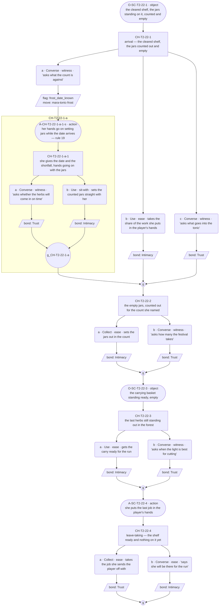

# `mara-tonic-frost` — v01

**This life only.** Mara is dealt Herbalist this run (ratified 2026-08-07; role-goal: brew the festival tonic that wards off the first frost), so the staging below is the herb stall on Market Row (`world:maras-stall`, `world:market-row`) and the forest run for the last herbs (`F1`, Forager's Clearing). The thread's identity rides on [`cast/mara.md`](../../../cast/mara.md); the row is ratified in [`cast/mara-herbalist-threads.md`](../../../cast/mara-herbalist-threads.md). Everything here is the Herbalist instance and does not survive a reshuffle.

**Open question:** The tonic must be *finished* before the frost — and finishing is the one thing her tending exists to never do. What does she do with work that has an end?

**Status:** Architect brief authored 2026-08-09. **Choice design ran 2026-08-09** — C1–C3 carry content blocks and mermaid graphs; 5 / 8 / 7 choice nodes; action slots placed. The F1 afternoon slot for C2 was **approved by Roc 2026-08-09**, discharging *Flagged to Roc* item 2 below. The one divert (C2) is **sanctioned** — checked against the schema's five-condition sanctioning test (`../../../narrative-pipeline/templates/choice-node-schema.md`, ruled 2026-08-09) and passes. **GRAPHS APPROVED by Roc, 2026-08-10.** **Prose written 2026-08-10** — C1–C3 line files exist in `lines/`. Structural changes remain a re-spec through Roc, not a quiet edit.

**This is Mara's one licensed want × role-goal tension row** (ruling 2026-08-09 — a role-goal is a situation, not a thread; the licensed exception is the row stating the tension, in the `toby-feast-short` form). **The tonic itself stays `delta_situation`** — uncapped, stateful, and the cover the material arrives under. A beat where the tonic is the content rather than the pressure has restated the role-goal, which the ruling rejects.

**The other threads may not borrow this engine.** The `mara-set-for-two` spec's guard is retained and now points here: the tonic deadline supplies pressure to **this row only**. A cast thread leaning on the frost date has imported the wrong engine.

---

> **The shelf is already cleared when C1 opens. This is load-bearing, not staging convenience.** `mara-shelf-room` — what gives way when the tonic work needs the room the keeping holds — is **deferred by Roc (2026-08-09) and is not to be touched.** No beat in this thread may put the tonic work in competition with the drawer, the second stool, the cup, or the swept patch; no option may ask her to move any of them; nothing here may make the keeping cost the role anything or the role cost the keeping anything. The collision is already spent as C2's cover in `mara-set-for-two` and its live status is Roc's call. **The pressure in this thread is the frost date against her hands, never the drawer against the shelf.**

---

## Thread shape

**A ratchet, not a recomposition and not an accumulation.** Three reveals across **three conversations**, each one the same work at a further state, with a date fixed at the start that the situation walks toward.

Stated against the other three live threads so the difference is checkable. `toby-the-shelf` hides a pattern and accumulates evidence toward an outside naming, ending open. `mara-set-for-two` hides nothing and turns once, in the middle, on a recomposition. `ilsa-kin-no-show` hides nothing and never turns, accruing instances in any order. **This one has an order it cannot escape and a thing that genuinely completes** — the only Mara thread where something finishes — and what it delivers is what finishing costs a soul whose whole engine is not-finishing. The question stays open because the finishing answers nothing: the jars are full, the frost lands, and her hands are already on something that has no end.

| # | Reveal | Fact | Card field | Staged this life as |
|---|---|---|---|---|
| R1 | The work has an end and a date | situation | `role_tag` at work · the week as visible state | The cleared shelf, the jars standing empty and counted out, and the herbs still out in the forest with the frost due |
| R2 | Given finishable work, her hands leave it for work that does not finish | cast | `essence_descriptor` · `warmth_channel` | Mid-run, against the weather, she stops to mend a thing that already holds — and the minutes are spent against the frost, in front of the player |
| R3 | The finished thing is the one thing at the stall she does not touch again | re-touch of R2 at the other end — no new cast fact | `backstory_guideline`'s core, priced | The jars full on the shelf; her hands already on something unfinished, and the finished shelf left alone |

**Conversation allocation** — the Architect's call, and the constraint the Choice designer works inside:

| Conversation | Scene id | Screen | Carries |
|---|---|---|---|
| C1 | `SC-T2-22` | T2, Market Row | R1 |
| C2 | `SC-F1-03` | F1, Forager's Clearing | R2 |
| C3 | `SC-T2-23` | T2, Market Row | R3 |

Scene ids are proposed: the next free block on T2 after `mara-set-for-two`'s `SC-T2-12`–`14`, and the next free scene on F1. **Downstream confirms against the id registry** — code mints ids; this table reserves shape only.

**No quiet beat.** Three conversations is the floor this thread can carry, and a quiet beat costs a full time block (ruled 2026-08-06). There is no room for one against a date, and a lull inside a race would flatten the only pressure the row owns.

**C2 is the thread's only non-T2 conversation, and that is deliberate.** All three of Mara's threads otherwise live at the stall. The forest run is where the role can put finishable work in the player's hands at a place where her keeping has no furniture to hide behind — the mend in R2 lands because there is nothing else there for her hands to be doing.

---

## What happens across the thread

She is given a job with a count and a date. First visit: the shelf cleared, the jars out and empty, the herbs still standing in the forest, the frost due — and she puts a share of it in the player's hands, because that is her welcome. Second visit, out at the clearing with the weather coming: the work is a race, and partway through it she stops. Not for a rest and not for the player — for a thing of the work that has come loose and still holds fine, which she mends, visibly, taking the time it takes, while the light goes. Third visit: the jars are full on the cleared shelf, counted, done before the frost. The festival gets its tonic; her conviction was never in doubt. And the finished shelf is the only thing at that stall her hands do not go back to.

**Where it leaves off on day 5: finished, and unchanged.** This thread does not end open (Toby's ending) and does not end on a recomposition (`mara-set-for-two`'s). It ends **completed and inert** — the one thing in Mara's material that reaches an end, reaching it, and nothing moving in her because of it. That is the price the row exists to show: finishing is available to her, she does it well, and it is not what her tending is for.

**No fail state.** The tonic is finished by the frost in every walk. Her `conviction` will not let the festival lapse and no bond state buys that out (canon flag 8), so a walk where the tonic fails is off-card, and the arc doc's pool rule holds too — every mishap row is a hook, never a punishment. What the player's picks change is **whether they were in the work**, never whether it gets done. The registry's "done or short" is the *situation's* texture — a fuller or thinner run of herbs, more or less margin against the date — and it is `delta_situation`, never Mara's failing and never a loss ending.

**Why a player comes back:** the count is visibly closing, and she keeps handing them a piece of it. This is the only Mara thread with a progress bar, and it is the one legitimate use of one in her material.

---

## Dependency order

    C1 (R1) ──> C2 (R2) ──> C3 (R3)

- **C1 needs nothing.** Zero-knowledge entry. It must work as the player's first contact with Mara this week — no sibling thread, no prior scene. The cleared shelf and the empty jars are staged as scene business, present whatever the player picks.
- **C2 needs C1 complete. Entry gate is completion only.** R2 arrives by situation — the mend happens in front of whoever is there — so the delivery cannot be missed. `frost_date_known` gates C2's deep beat only, never entry and never delivery.
- **C3 needs C2 complete. Entry gate is completion only — deliberately not a knowledge flag.** `toby-the-shelf`'s C4 gates entry on a missable knowledge flag and the standing flag under its C2 records the cost: a reveal lost outright rather than shallowed, which R5 forbids. Here every knowledge flag gates content *inside* a conversation, and a fallback player walks all three and receives all three reveals.

### Flags

| Flag | Set by | Read by |
|---|---|---|
| `frost_date_known` | C1 (asking what the count is against — receiving the date and the shortfall, not just the job), or the `ex-tonic-shelf` examinable **(PROPOSED — does not exist yet)** | C2, C3 |
| `drift_seen` | C2 (staying with the mend, or marking that the errand stopped — the deep pick; the shallow player keeps gathering and the mend happens behind them), or the `ex-mended-basket` examinable **(PROPOSED — does not exist yet)** | C3 |
| `herbs_carried` | C2 (taking a share of the run and carrying it back — a deed, the player act of being in the work) | C3 |

**Every flag has a reader.** No flag may be added without one. Note against the `shelf_named` precedent: no flag here is written in the last conversation, so nothing is write-only by construction.

**`herbs_carried` deliberately gets no pickup** — it is a player act, and an examinable cannot carry a load for someone who was not there to take it. Missing it shallows C3 per R5 and closes nothing.

### Facts read per conversation

C1 reads none · C2 reads one (`frost_date_known`) · C3 reads two (`drift_seen`, `herbs_carried`). R6's ceiling is two.

### No negation, anywhere

**`not knows(x)` is not a predicate and never was.** The resolver parses `^knows\(([^)]+)\)$` — no `not`, no `!`, no `&&` — so a gate written with negation compiles to nothing and its branch is silently unreachable. This cost `ilsa-kin-no-show` C2 a full redesign (`GP-124`, Roc's ruling 2026-08-09: redesign, do not extend the compiler). **Every not-knowing case in this thread is expressed as the ungated fallback**: the knowing player takes the gated node, everyone else walks the path that rule 4 already required to exist. The state tables below are written that way and the Choice designer must keep them so.

---

## Delta declarations

Stated against `cast/mara.md`'s `delta_rule` (floor one, ceiling two cast facts solo, situation uncapped, reference free).

| Conversation | `delta_cast` | `delta_situation` |
|---|---|---|
| C1 | None — the count and the job are role and situation; her welcome-as-imperative is carded `voice_register`, reference | Shelf cleared, jars out and empty and counted; the last herbs still standing in the forest; the frost due this week |
| C2 | She mends a thing of the work that is not broken, unasked, while the work waits — **one** (the unasked mending travels with `mara`, canon flag 3; this is its first staged delivery in this thread's furniture) | The run against the weather at the clearing; the light going; the carry filling |
| C3 | None — R3 is the R2 fact seen at the other end of the week; a new cast slot here would break the ratchet | The jars full and counted on the cleared shelf; the frost landed or landing; the festival supplied |

Every scene clears the floor. C1 and C3 clear it through `delta_situation` alone — the week advancing state by state is a new `delta_situation` each time, not one restated (`delta_rule`) — and neither is a quiet beat, so neither claims the exemption. The cleared shelf, the jar count, the mended thing and the frost date are **reference-free from delivery onward**; a delta slot re-declaring any of them unchanged is a structural flag back to this seat, never a prose flag to Content.

---

## Constraints on the conversation design

- **Entry gate is the previous conversation in this thread completing. Nothing else.** Completion gates the sequence; knowledge gates content inside conversations.
- **Every incoming state must walk without dead-ending.** C3 reads two facts: four states, all authored. One state is always the fallback — finished C2, learned nothing from it — and it exits through real content, because R3 arrives by situation.
- **A missed fact makes the thread shallower, never rerouted** (R5). All three reveals arrive by situation; picks decide depth, never receipt.
- **Missed things stay in the world.** Both knowledge flags have declared pickups; see Proposed examinables.
- **Options are equal weight.** Asking what the count is against turns talk toward the deadline, which is the role's business and not hers; taking the job respects the work she actually offered. Staying with the mend costs the run minutes; keeping gathering respects the date. No option is correct; no counter keys off repetition (guardrail check 2).
- **Bond weights:** Recognition 3, Trust 2, Intimacy 2. The deep path records Recognition; the shallow path records Intimacy or nothing.
- **The mend must not read as a mistake, a lapse, or a symptom.** She is not distracted and she is not failing the role. She sees a thing coming loose and mends it, which is what she does, and the cost is real and unremarked. A beat that frames the mend as her losing the thread of the work has written a flaw where the card has an engine, and a beat where the player must correct her has granted Mara a fix, which is barred.
- **The mend is restoration, never anticipation.** Her `warmth_channel` keeps whole what already exists; a mend that reads as her supplying what someone will need next is Toby's channel and is a defect (card, held-distinct rule).
- **The role stays out of the way of the essence, even here.** The Herbalist deal is plot-inert on purpose (`role_tag`, ratified 2026-08-07). This row is the one place the role manufactures pressure, and it manufactures pressure **against her hands**, not against her keeping. Nothing may let the job explain the essence — the not-the-job failure.
- **No sanctioned long run anywhere in this thread. Zero marked runs.** Her one run per scene is licensed for an object's provenance only, and the provenance run this life belongs to `prop:adrens-doll` in `mara-set-for-two` C2. Giving a working basket a history here would spend the licence on the wrong object and put a second run beside the one that matters. **Barred absolutely: any long run about the loss itself** (`voice_enforcement` failure mode 3). If a heavy beat lands, it takes the carded grief shape — fragments divided by action slots: she wipes a clean thing, closes the drawer, straightens what was straight.
- **Nothing in this thread reaches for the drawer, the corner, the whistle or the doll.** They may sit in view as staging at T2 and get no attention. The drawer must stay writable for the seam pass (canon flag 4: `ilsa_second_apron` pays off through it in Mara's voice), and the doll's name is `mara-set-for-two`'s single delivery and is not pre-empted here.
- **No third party names anything.** The standing to remark on her exists (canon flag 5) and is unspent in this thread; the outside-naming device belongs to `mara-said-out-loud`, and duplicating it here would run the same mechanism twice in one soul's set.
- **She is never released** (canon flag 2). Finishing the tonic is not a step toward letting go, and no beat may frame it as one. **No World Truth is stated in-scene, and no scene grants Mara a fix** — she is not wrong to tend, and finishing does not correct her.
- **Voice constraints the designer must not fight:** her band is 12–25 words against the village median of 5–7; a Mara line clipped to 5–7 reads as Toby, which is the failure her declared band exists to prevent. Her welcome is an imperative — C1 and C3 open with her putting a job in the player's hands, not a greeting. The past tense arrives uninvited and unremarked in her own lines and she never explains it; no player option makes her (canon flag 5). The spread governs tense placement only — not tempo, not uptake, not warmth (canon flag 9).
- **Held distinct from Linnet** (`voice_enforcement` failure mode 5): nothing in this thread may resolve her tending to one habit for one person, precisely known.

### Pacing

A thread may be entered **once per time slot**; the day's opening slot belongs to the festival arc; later slots allow multiple threads (GP-93). Three conversations fit in a minimum of a day and a half.

**Nothing here may assume which slots, which days, or how much clock separates them.** The frost is a week, not a date on the calendar — the situation states carry "nearer," so the ratchet reads correctly at any spacing and the schedule can never contradict the deadline. `role-workplace.json` (provisional) puts Mara at T2 mornings and F1 afternoons, which C2 requires: the forest run is an afternoon conversation.

### Id conventions

Per [`narrative-pipeline/templates/id-label-convention.md`](../../../narrative-pipeline/templates/id-label-convention.md). Choice nodes `CH-T2-22-1`, `-2`, … · options `-a`, `-b` · player line `L-CH-T2-22-1-a-p` · response `L-CH-T2-22-1-a-r1`. Code mints final ids; these reserve shape only.

**Every id gets its label at first mention in prose** — the id in backticks, an em dash, the gist, the gist minted once in the mermaid graph and reused verbatim everywhere after. Any id whose tail crosses into a nested child additionally carries the segment readout, with the word **child** mandatory. **Variant selectors:** path variants are `-norm` / `-div` and nothing else; state variants take the flag name verbatim, two flags joined by `-and-` (ruled 2026-08-09). A slot wanting both a path and a state variant surfaces to Roc.

### Proposed examinables

**PROPOSED. Not built. Downstream wires these into `tools/resolver/data/screen-specs.json`; until then the pickup paths naming them do not work.** T2's wired examinables today are `stall_goods` and `ex-shelf` (Toby's, `knowledge_flag: shelf_seen`); F1's is `trail_signs`. `ex-tending` (`mara-set-for-two`'s) is declared and also not yet built.

| id | Screen | Sets | Reopens |
|---|---|---|---|
| `ex-tonic-shelf` | T2 | `frost_date_known` | C1's closed path — a player who took the job without asking what the count was against. Reaches C2's deep beat (the minutes the mend costs, read against a date the player holds) and C3's deep read, **and only while the conversation it feeds is still unplayed**; conversations do not replay. The examinable is the cleared shelf with the jars counted out against the week |
| `ex-mended-basket` | T2 | `drift_seen` | C2's closed path — a player who kept gathering while the mend happened behind them. Reaches C3's deep beat, **and only while C3 is still unplayed.** The examinable is the carry the herbs came back in, the fresh mend visible on it — her mends make a thing last and do not erase what happened to it (ruled 2026-08-09, `prop:tobys-shirt`), so the mend stays legible after the fact |

**Both are load-bearing for depth, not for delivery.** No entry gate reads a knowledge flag and all three reveals arrive by situation, so a player who misses everything still walks all three conversations and receives R1, R2 and R3 — they lose the deep reads, which is R5 working as intended.

**The drawer is deliberately not an examinable**, per `mara-set-for-two`: opened unaccompanied it delivers that thread's material as scenery. Nothing here changes that.

### Declared inventions (guardrails check 12)

Typed, PROPOSED, for the Verifier and Roc's gate; the Orchestrator transcribes ratified entries to `narrative-pipeline/npc-codex.md`.

| id | Type | What | Status |
|---|---|---|---|
| `prop:maras-carrying-basket` | prop | The carry the forest run goes out and comes back in. Ordinary working kit at `world:maras-stall`; it is the thing she stops to mend in R2, and it comes back with the mend visible. **Not given a provenance run** — the sanctioned run this life is `prop:adrens-doll`'s | **PROPOSED** |
| `ex-tonic-shelf` · `ex-mended-basket` | examinable | Above | **PROPOSED** |

Nothing else is invented. The cleared shelf, the jar count and the frost deadline are the ratified registry row's own terms; the forest herb run is the arc doc's per-occupation mishap pool, Herbalist row (*an early frost threatens the last herbs still out in the forest* — Collect, forest-screen, race the weather), played straight as a hook rather than a fail state; `world:maras-stall`, `world:market-row` and F1 are ratified.

---

## States

| Conversation | Reads | Incoming states |
|---|---|---|
| C1 | none | 1 — zero knowledge, must work as first contact with Mara this week |
| C2 | `frost_date_known` | 2 — deep (the mend's minutes land against a date the player holds; Recognition available) / fallback, **ungated** (the mend still happens in front of them, and reads as her mending something; the run and the carry are unaffected) |
| C3 | `drift_seen` · `herbs_carried` | 4 — both (the full ratchet: the finished shelf read by someone who saw her hands leave finishable work and who carried part of the load) / `drift_seen` only (the reading without having been in the work) / `herbs_carried` only (in the work, without the reading — she hands over the next job either way) / neither (fallback, **ungated**: the jars are full, the frost is landing, the festival is supplied, and a real visit exits through real content) |

Each not-knowing state above is the **ungated fallback path**, never a negated gate.

---

## Card fields the designer must not contradict

- **`deflection_target`** — the object at hand and its history. Ask her about herself and she picks something up and gives its provenance; true, freely given, and about her not at all. **In this thread the deflection is available but the run is not** — see the zero-marked-runs constraint.
- **`precision_profile`** — exact about things, vague about people. She can price the repair and date the mend from memory; ask who anything is for and the sentences stop arriving. The stop is authored content, never a bug.
- **`warmth_channel`** — restoration of what is already had, never anticipation of what will be needed. She does not mention having mended anything.
- **`conviction`** — she will not leave, will not let the festival lapse, will not have the anchor moved; the whistle is not for sale and no bond state buys it out. **The tonic gets finished because of this, not in spite of it.**
- **Warmth is invariant.** The past tense is never wistful, never a complaint, never a bid for sympathy, never a chill toward whoever is in the room (canon flags 6, 9).
- **She never states her own trait** and no World Truth is spoken in-scene (canon flag 5). Beauty is stated as plain fact about the thing, never as her feeling about it (canon flag 7).
- **She is never released** (canon flag 2). Transform, not release; no beat models, pre-empts or implies letting go.
- **Grief beats are fragments divided by action slots** (canon flag 12). A long run tagged quiet is a flag.

---

## Conversations

**For the Choice designer.** One section per conversation, each to receive a content block and a mermaid node graph in the fixed convention. **Roc approves the shape before any prose is written.**

**Action-slot convention (contract rules 18–21).** Description beats — `action` and `object` slots — are drawn as **stadium** shapes: `AS1(["A-SC-T2-22-2 · action structural gist"])`. The label carries the slot id, the slot type and a structural gist; Lines writes the words, per the register's action-note rules (name the actor and the thing, no interiority, handling verbs). A stadium on a spine edge is a scene-level beat between nodes; a stadium inside an option branch belongs to that option's response run; a stadium on a node's entry edge marked `-s` interleaves with that node's set-up. Ids: `A-` (action) or `O-` (object) plus the scene or choice id, suffixed `-s` (set-up interleave) or `-r` (response run).

> **The ruling this design was built to (Roc, 2026-08-09).** Mara's F1 afternoon slot is approved; the three-conversation shape stands and C2 plays at the clearing. Flag 2 under **Flagged to Roc** is discharged by that ruling and the design does not hedge against it.

### C1 — `SC-T2-22`

**Carries R1. Reads no prior facts — one incoming state (zero knowledge). Must work as first contact with Mara this week. 5 choice nodes (4 top-level + 1 nested). Variety devices (rule 16): a three-option node; nesting to depth 1. Action layer (rules 18–21): 4 description slots (2 `action`, 2 `object`) against ~14 dialogue slots on the deep walk — ratio ≈ 1:3.5. Zero marked long runs. No walk-ons.**

**Content block.**

- **Incoming state: zero knowledge (the only state).** Nothing is closed. The shelf is staged **already cleared** — the jars standing out on it, counted, empty — and the last herbs still out in the forest with the frost due. That staging is present whatever the player picks and is never put in competition with the drawer, the second stool, the cup or the swept patch: nothing in this conversation asks her to move any of them, notices what was cleared away, or makes the keeping cost the role anything. `mara-shelf-room` stays untouched. R1 arrives by situation — the count and the date are the week's visible state, not a pick.
- **Node 1 (`CH-T2-22-1` — arrival; the cleared shelf, the jars counted out and empty, ungated, three options).** Her welcome is an imperative, so the scene opens with a share of the work going into the player's hands rather than a greeting. Ask what the count is against (spoken — sets `frost_date_known`, moves the thread; she gives the date and the shortfall, exact, and opens the nested child below), take the share of the work she puts in the player's hands (deed — records Intimacy; being enlisted into the tending is how she lets someone in), or ask what goes into the tonic (spoken — records Trust; `precision_profile`'s exact half, freely given, on the work and never on her). **Equal weight:** asking what the count is against turns the talk toward the deadline, which is the role's business and not hers, and buys the date at the cost of the beat; taking the job spends the beat inside the work she actually offered; asking what goes in spends it on the thing she is exact about. No response scolds an unpicked option and none of the three is the correct read. **No accrual:** nothing counts how often the player takes a job, and no repeat of any option unlocks anything.
  - **Nested child (`CH-T2-22-1-a-1` — she gives the date and the shortfall, hands going on with the jars; node 1 › option a › child 1).** She prices the week the way she prices a repair: how many jars, how many days, what is still standing out in the forest. Present tense, exact, no alarm — the shortfall stated through the things and the days, never a deficit solved down into steps. *(Amended — ruled by Roc 2026-08-10: shortfall-then-arithmetic is Toby's licensed device, part of his self-versus-other axis; Mara's equivalent is the count carried through the objects and their state. This sentence formerly read "the shortfall is arithmetic".)* Ask whether the herbs will come in on time (spoken — records Trust; her answer is the practical one and it is not a promise about herself) or set the counted jars straight with her (deed — records Intimacy). Both record, differing in kind. **Why nesting and not a flag-gate:** the date-and-shortfall beat exists only as an answer to being asked. A flag-gated sibling would print its framing — the count already spoken — to every player who never asked, and every one of them would then walk past a silent skip. `frost_date_known` also cannot serve as that gate, because it is set by the very option the child hangs off, so the gate and its trigger would be the same act.
- **Node 2 (`CH-T2-22-2` — the empty jars, counted out for the count she named, ungated).** Set the jars out in the count (deed — records Intimacy) or ask how many the festival takes (spoken — records Trust; exact, and it is the festival's number, not hers). Both record. The beat is the work, not the shelf's history; nothing here remarks on what the shelf held before.
- **Node 3 (`CH-T2-22-3` — the last herbs still standing out in the forest, ungated).** She names what is still to bring in and when the light is best for cutting; beauty is stated as plain fact about the light, never as her feeling about it (canon flag 7). Get the carry ready for the run (deed — records Intimacy) or ask when the light is best (spoken — records Trust). Both record. This is where the forest run is put in front of the player without C2 being promised as a scene.
- **Node 4 (`CH-T2-22-4` — leave-taking; the shelf ready and nothing on it yet, ungated).** Take the job she sends the player off with (deed — records Trust) or say the player will be there for the run (spoken — records Intimacy; it hands her more tending, which is the one thing she takes). Both record.
- **Closed path.** A player who never asks what the count is against leaves without `frost_date_known`: C2's node 5 and C3 are shallower for it, and nothing is lost outright. The proposed `ex-tonic-shelf` (T2 — the cleared shelf with the jars counted out against the week) reopens it **while the conversation it feeds is still unplayed**. The shallow run still delivers R1 in full: the count, the empty jars and the herbs still out are all staged.
- **Action slots (rule 18).** Four description beats, typed and placed; Lines writes them:
  - `O-SC-T2-22-1` (`object`, scene opening, before node 1) — the cleared shelf with the jars standing on it, counted and empty. R1's surface as a thing seen before anyone speaks.
  - `A-CH-T2-22-1-a-1-s` (`action`, inside the nested child's set-up; node 1 › option a › child 1 › set-up) — her hands go on setting jars while the date arrives. Part of the rule-19 build below.
  - `O-SC-T2-22-3` (`object`, spine, node-2 gather → node 3) — the carrying basket standing ready, empty. `prop:maras-carrying-basket` enters as ordinary working kit with no history attached.
  - `A-SC-T2-22-4` (`action`, node 4's set-up) — she puts the last job in the player's hands.
- **Rule-19 build — the child, the date landing.** Built fragment → action → fragment: a short fragment carrying the count → `A-CH-T2-22-1-a-1-s` (her hands going on with the jars) → a shorter fragment carrying the date. The weight of a fixed deadline is never moved into a longer line, and the beat carries information rather than grief, which is why it is still not a marked run — see below.
- **No sanctioned long run (rule 20).** None placed, and none is legal in this thread: her one run per scene is licensed for an object's provenance only, and this life's provenance run belongs to `prop:adrens-doll` in `mara-set-for-two`. The basket is deliberately given no history here.
- **Walk-ons (rule 21).** None.

### C2 — `SC-F1-03`

**Carries R2. Entry gate is C1 completing. Reads one prior fact: `frost_date_known` — two incoming states, the not-knowing one ungated. 8 choice nodes (6 top-level + 1 nested child + 1 nested grandchild). Variety devices (rule 16): nesting to **depth 2** — the only depth-2 nest in Mara's material; a `rejoin: divert`; a three-option node. Action layer (rules 18–21): 6 description slots (3 `action`, 3 `object`); the deep walk sees all six against ~18 dialogue slots — ratio ≈ 1:3; the diverted walk sees four against ~10 — ≈ 1:2.5, denser, which is right for a visit the player spent walking away from the talk. Zero marked long runs. No walk-ons.**

**How this conversation is built differently from the two T2 ones, stated so it is checkable.** C1 and C3 are **bench conversations**: a fixed place, a spine of ungated nodes, one knowledge gate each, and the player standing where she stands. C2 is a **traverse** — the scene moves across the clearing with the light going, the player's position in it is a choice rather than a given, and the structure carries that in three ways no T2 conversation here has: the divert (a player may physically walk on down the treeline and the beats beside her stop being reachable), the depth-2 nest (the one place the conversation goes *further in* rather than further along), and the deed flag set at the walk-out rather than at a bench. At the stall her keeping has furniture to hide behind and the graph reflects it — every T2 node is something to pick up. Here there is nothing but the work and the weather, so the graph's shape is where the player *is*, not what they take.

**Content block.**

- **Scene business, both states.** The clearing with the light already going and the stand still standing; the run is a race and the carry is filling. **R2 arrives by situation and cannot be missed:** node 3's set-up is ungated and on every walk — partway through, she stops, turns the carry over, and mends a binding that has come loose and still holds fine, taking the time it takes while the light goes. Every player sees it, whatever they then do. `frost_date_known` gates one node's content and nothing else; it never gates entry and never gates delivery.
- **The mend is not a mistake and there is no fail state anywhere in this conversation.** She is not distracted, not lapsing, not failing the role and not to be corrected: no option offers to finish the mend for her, hurry her, or take the carry off her, and no response frames the minutes as an error. What the picks change is whether the player was in the work; the run comes in and the tonic gets made in every walk. "Done or short" is the situation's texture — a fuller or thinner carry, more or less margin — carried in her count of the things, never in her failing.
- **She never names.** No option produces a Mara line that confirms, denies, qualifies or explains what her stopping is for. Asked about the stopping she answers with the object and the work — how long the binding has been on it, what the mend takes, what still wants cutting — and then a handful goes into the player's hands, which is her welcome shape in the answer position. That is `deflection_target` and `precision_profile` doing their jobs, and it is authored content, never a stall. **The mend is restoration, never anticipation:** she keeps a thing that already exists whole, and nothing in the beat reads as her supplying what someone will need next.
- **Node 1 (`CH-F1-03-1` — arrival at the clearing, the light already going, ungated).** Take a share of the run and work the near stand (deed — records Intimacy) or ask what she is cutting first (spoken — records Trust; exact about the plants and the order of the work). Both record, differing in kind. **Equal weight:** working takes the job without being handed it; asking spends the beat on the thing she is exact about, and neither is a read of what is about to happen.
- **Node 2 (`CH-F1-03-2` — the run itself, the carry filling, ungated).** Work the near stand alongside her (deed — records Intimacy) or ask what the frost takes first (spoken — records Trust). Both record. This is the beat that establishes the race, so that node 3's stop has something to cost.
- **Node 3 (`CH-F1-03-3` — she stops mid-run and mends the loose binding, ungated, three options).** The delivery, and the thread's centre. The set-up is the mend; the options are where the player puts themselves. Stay with it and hold the carry steady while she works (deed — sets `drift_seen`), mark that the errand has stopped (spoken — sets `drift_seen`; opens the nested child below), or keep gathering along the treeline while the mend goes on behind (deed — records Intimacy, **and diverts to node 6**). **Equal weight:** the two deep picks differ in modality, not in rank — one stands in the minutes, the other says them out loud — and the third buys the run's minutes back at the cost of not being there for what follows. Nothing scolds the player who walks on and nothing frames staying as the kind pick. **No accrual:** `drift_seen` is set-once knowledge, not a tally, and nothing counts stops or mends.
  > **DIVERT — SANCTIONED (ruled 2026-08-09 — Roc).** `CH-F1-03-3-c` is `rejoin: divert → CH-F1-03-6`. Checked against the schema's five-condition sanctioning test (`../../../narrative-pipeline/templates/choice-node-schema.md`, ruled 2026-08-09) and passes. The alternative considered was a normal gather with nodes 4 and 5 gated so they simply do not appear; the divert was preferred because nodes 4 and 5 are beats that exist only beside her — the mend finishing in front of you, and the minutes read against the date — and a player who has walked twenty yards down the treeline is not present for either. Skipping them is the structure honoring where the player put themselves, not a punishment: the diverted player still reaches the walk-out, still receives R2 whole (the set-up is ungated and precedes the pick, and the mended carry comes back visible at node 6), still records a bond, and can still take `herbs_carried`. What they lose is `drift_seen`, which the proposed `ex-mended-basket` reopens while C3 is unplayed, and node 5's deep read, which is lost for that walk — shallower, never rerouted.
  - **Nested child (`CH-F1-03-3-b-1` — she answers the marking with the work; node 3 › option b › child 1).** Named as having stopped, she does not answer the stopping. She prices the mend and dates the binding from memory — exact, present tense, the past arriving uninvited about the object and unremarked by her — and the next handful goes into the player's hands. Ask how long the mend will take against the light (spoken — records Trust; **opens the depth-2 grandchild**) or take the handful and work beside her (deed — records Intimacy). Both record. **Why nesting and not a flag-gate:** this answer exists only as an answer to being asked. A flag-gated sibling would print the framing of a priced, dated mend to every player who stayed silent or walked on, and all of them would then take a silent skip through it.
    - **Nested grandchild, depth 2 (`CH-F1-03-3-b-1-a-1` — she gives the time it takes and does not shorten it; node 3 › option b › child 1 › option a › child 1).** She answers with a number, the way she answers every question about a thing, and the mend gets the time it needs while the light goes. Let the time stand and hold the light for her (deed — records Intimacy) or mark that the carry was holding fine before she started (spoken — records Recognition, the deepest read in the conversation and the player's read, not hers). Both record. **Why depth 2 and why the cost is worth it.** The schema's measured cost is real — a nested option runs about 3.5× the paths — and the flag-gate alternative is worse in a specific way here: the beat is *the answer to a follow-up inside an answer*, and there is no flag that could gate it without being set by the very question it answers. The alternative that does not use nesting is deleting the beat, and the beat is the one place in the thread where the minutes are stated as a number by the person spending them, with no bench, no drawer and no jar to route it through. This is the thread's single depth-2 nest and nothing else in Mara's material goes past depth 1.
- **Node 4 (`CH-F1-03-4` — the mend finished, the carry back on her arm, the run picking up, ungated on the non-divert path).** Take the carry and get the run moving again (deed — records Intimacy) or ask what is still to cut (spoken — records Trust). Both record. The beat is deliberately ordinary: the mend is over, unremarked by her, and the work resumes without ceremony.
- **Node 5 (`CH-F1-03-5` — what is left standing, against the light, gated `knows(frost_date_known)`).** The deep beat: the minutes the mend cost, read against a date the player is holding. Her side is the count through the objects — what still stands, which of it the light and the night allow, what the jars take from it — delivered exact and without alarm, because the count comes in. *(Amended — ruled by Roc 2026-08-10: shortfall-then-arithmetic — a deficit stated and solved down into steps — is Toby's licensed device, part of his self-versus-other axis; her equivalent is the count carried by the things and their state. This sentence formerly read "Her side is arithmetic".)* Put the minutes against the count she gave (spoken — records Recognition) or work faster beside her and say nothing of it (deed — records Intimacy). **Equal weight:** naming the count turns the talk to the deadline, which is the role's business; working faster takes the shortfall as a thing to be done rather than said. **Neither pick is a correction and no response treats the mend as the reason for anything** — she does not defend the minutes, and the player is never offered the chance to fix her. If the gate is false the node auto-skips to its gather; that is the ungated fallback path and not a negated gate.
- **Node 6 (`CH-F1-03-6` — the walk out, the carry full with the fresh mend on it, ungated; divert target).** Carry the full basket back down the trail (deed — sets `herbs_carried`, the player act of having been in the work) or ask what goes in first at the shelf (spoken — records Trust). Both record, differing in kind. The mend is visible on the carry on both branches — her mends make a thing last and do not erase what happened to it — so R2's evidence leaves the clearing with the player.
- **The two incoming states, traced.**
  - **`frost_date_known` (deep).** 1 → 2 → 3 (child and grandchild if asked) → 4 → 5 → 6. Or, on the divert, 1 → 2 → 3c → 6.
  - **Fallback, ungated (finished C1, learned nothing).** 1 → 2 → 3 (child and grandchild if asked) → 4 → 6; node 5 auto-skips. Five top-level nodes, R2 delivered whole, `drift_seen` and `herbs_carried` both still settable. Shallower, never rerouted, and the visit exits through real content.
- **Closed path.** Missed `frost_date_known` closes node 5's read only; the proposed `ex-tonic-shelf` (T2) reopens it while C2 is still unplayed. Missed `drift_seen` — the player who walked on — is reopened by the proposed `ex-mended-basket` (T2, the carry with the fresh mend visible on it) while C3 is unplayed. `herbs_carried` has no pickup by design: an examinable cannot carry a load for someone who was not there.
- **Action slots (rule 18).** Six description beats:
  - `O-SC-F1-03-1` (`object`, scene opening, before node 1) — the stand still standing and the light already low.
  - `A-SC-F1-03-2` (`action`, spine, node-1 gather → node 2) — the cutting, and the carry filling. The race shown rather than said.
  - `A-CH-F1-03-3-s` (`action`, inside node 3's set-up) — she stops, turns the carry over, and starts on the loose binding. R2 is an act she performs and does not mention, which no spoken slot can carry. Part of the rule-19 build below.
  - `A-CH-F1-03-3-b-1-a-1-r` (`action`, inside the grandchild, option `-b`'s response run; node 3 › option b › child 1 › option a › child 1 › option b › response run) — the binding pulled tight; the mend holds. Part of the rule-19 build below.
  - `O-CH-F1-03-5-s` (`object`, inside node 5's set-up) — what is left standing, against the light. The shortfall as a thing the player can see before it is counted.
  - `O-CH-F1-03-6-s` (`object`, inside node 6's set-up) — the full carry with the fresh mend visible on it.
- **Rule-19 builds — the two beats that carry weight.**
  - **Node 3's set-up, the stop.** Built fragment → action → fragment: a short fragment as the work pauses → `A-CH-F1-03-3-s` (the carry turned over, the binding taken up) → a shorter fragment, hers, about the thing in her hands and not about stopping. The silence between the fragments is the action slot, and the cost of the minutes is never given a longer line.
  - **The grandchild, option `-b`, the carry was holding fine.** Player line (its own ≤12-word fragment) → a short fragment → `A-CH-F1-03-3-b-1-a-1-r` (the binding pulled tight) → shortest fragment. The run may close on the action slot.
- **No sanctioned long run (rule 20).** None placed and none legal. The child's priced, dated mend is the one information-shaped candidate in the thread and it is deliberately **not** marked: her licensed run is for an object's provenance and this life's belongs to `prop:adrens-doll` in `mara-set-for-two`, so giving a working basket a history here would spend the licence on the wrong object and stand a second run beside the one that matters. It is built as short exact pieces divided by the action slots instead.
- **Walk-ons (rule 21).** None. No third party is at the clearing and nobody remarks on her — the standing to remark is unspent in this thread and the outside-naming device belongs to `mara-said-out-loud`.

```mermaid
flowchart TD
  OS1(["O-SC-F1-03-1 · object<br>the stand still standing, the light already low"])
  OS1 --> N1["CH-F1-03-1<br>arrival at the clearing, the light already going"]
  N1 --> N1a("a · Collect · ease · takes a share of the run and works the near stand")
  N1 --> N1b("b · Converse · witness · 'asks what she is cutting first'")
  N1a --> R1a[/"bond: Intimacy"/]
  R1a --> J1(("g"))
  N1b --> R1b[/"bond: Trust"/]
  R1b --> J1
  J1 --> AS2(["A-SC-F1-03-2 · action<br>the cutting, and the carry filling"])
  AS2 --> N2["CH-F1-03-2<br>the run itself, the carry filling"]
  N2 --> N2a("a · Collect · ease · works the near stand alongside her")
  N2 --> N2b("b · Converse · witness · 'asks what the frost takes first'")
  N2a --> R2a[/"bond: Intimacy"/]
  R2a --> J2(("g"))
  N2b --> R2b[/"bond: Trust"/]
  R2b --> J2
  J2 --> AS3s(["A-CH-F1-03-3-s · action<br>she stops, turns the carry over, starts on the loose binding — rule 19"])
  AS3s --> N3["CH-F1-03-3<br>she stops mid-run and mends the loose binding"]
  N3 --> N3a("a · Converse · sit-with · stays with it, holds the carry steady")
  N3 --> N3b("b · Converse · witness · 'marks that the errand has stopped'")
  N3 --> N3c("c · Collect · ease · keeps gathering along the treeline")
  N3a --> R3a[/"flag: drift_seen"/]
  R3a --> J3(("g"))
  N3b --> R3b[/"flag: drift_seen"/]
  subgraph S3b["CH-F1-03-3-b"]
    C1["CH-F1-03-3-b-1<br>she answers the marking with the work — prices the mend, dates the binding"]
    C1 --> C1a("a · Converse · witness · 'asks how long the mend will take against the light'")
    C1 --> C1b("b · Use · sit-with · takes the handful and works beside her")
    C1a --> RC1a[/"bond: Trust"/]
    subgraph S3b1a["CH-F1-03-3-b-1-a"]
      C2n["CH-F1-03-3-b-1-a-1<br>she gives the time it takes and does not shorten it"]
      C2n --> C2a("a · Converse · sit-with · lets the time stand, holds the light for her")
      C2n --> C2b("b · Converse · witness · 'marks that the carry was holding fine'")
      C2a --> RC2a[/"bond: Intimacy"/]
      RC2a --> JC2(("g_CH-F1-03-3-b-1-a"))
      C2b --> RC2b[/"bond: Recognition"/]
      RC2b --> ASC2(["A-CH-F1-03-3-b-1-a-1-r · action<br>the binding pulled tight; the mend holds — rule 19"])
      ASC2 --> JC2
    end
    RC1a --> C2n
    JC2 --> JC1(("g_CH-F1-03-3-b"))
    C1b --> RC1b[/"bond: Intimacy"/]
    RC1b --> JC1
  end
  R3b --> C1
  JC1 --> J3
  N3c --> R3c[/"bond: Intimacy"/]
  R3c --> D3>"divert → CH-F1-03-6"]
  J3 --> N4["CH-F1-03-4<br>the mend finished, the carry back on her arm, the run picking up"]
  N4 --> N4a("a · Collect · ease · takes the carry and gets the run moving again")
  N4 --> N4b("b · Converse · witness · 'asks what is still to cut'")
  N4a --> R4a[/"bond: Intimacy"/]
  R4a --> J4(("g"))
  N4b --> R4b[/"bond: Trust"/]
  R4b --> J4
  J4 --> G5{{"knows(frost_date_known)"}}
  G5 --> OS5(["O-CH-F1-03-5-s · object<br>what is left standing, against the light"])
  OS5 --> N5["CH-F1-03-5<br>the minutes read against the date the player holds"]
  N5 --> N5a("a · Converse · witness · 'puts the minutes against the count she gave'")
  N5 --> N5b("b · Use · sit-with · works faster beside her, says nothing of it")
  N5a --> R5a[/"bond: Recognition"/]
  R5a --> J5(("g"))
  N5b --> R5b[/"bond: Intimacy"/]
  R5b --> J5
  J5 --> OS6(["O-CH-F1-03-6-s · object<br>the full carry with the fresh mend visible on it"])
  D3 --> OS6
  OS6 --> N6["CH-F1-03-6<br>the walk out — divert target"]
  N6 --> N6a("a · Collect · ease · carries the full basket back down the trail")
  N6 --> N6b("b · Converse · ease · 'asks what goes in first at the shelf'")
  N6a --> R6a[/"flag: herbs_carried"/]
  R6a --> J6(("g"))
  N6b --> R6b[/"bond: Trust"/]
  R6b --> J6
```

### C3 — `SC-T2-23`

**Carries R3. Entry gate is C2 completing — no knowledge entry gate, per the Architect's dependency order. Reads two prior facts: `drift_seen`, `herbs_carried` — four incoming states, all authored, all ungated at entry. 7 choice nodes (6 top-level + 1 nested). Variety devices (rule 16): a three-option node; nesting to depth 1; the two knowledge gates are split rather than conjoined, so the two mid states are structurally distinct rather than fallback-identical. Action layer (rules 18–21): 5 description slots (3 `action`, 2 `object`); the deep walk sees all five against ~16 dialogue slots — ratio ≈ 1:3.2; the fallback walk sees three against ~11 — ≈ 1:3.7. Zero marked long runs. No walk-ons.**

**Content block.**

- **Scene business, all four states.** The jars full and counted on the cleared shelf, the frost landing, the festival supplied. **R3 arrives by situation:** the finished shelf is there and her hands are already on something else, visible whatever the player picks and in every incoming state. The two flags buy depth after it, never receipt of it. Nothing here is put in competition with the drawer, the second stool, the cup or the swept patch; they may sit in view and get no attention, and the drawer stays writable for the seam pass.
- **Nothing here releases her and nothing corrects her.** Finishing the tonic is not a step toward letting go and no beat frames it as one; no World Truth is spoken; no option grants her a fix. The conversation ends **completed and inert** — the work done, well, on time, and nothing in her moved by it.
- **She never names.** No option produces a Mara line that confirms, denies, qualifies or explains why the finished shelf is the one thing her hands do not go back to. Asked anything that points at it, her answer is the object already in her hands and its practical state, and then a job — `deflection_target` routing to the thing at hand, `precision_profile` exact about the thing and stopping where a person begins. The reading is the player's throughout, and every Recognition record below is a record of the player's read, never of her saying it.
- **Node 1 (`CH-T2-23-1` — the week's end; her welcome is a job again, and the job is not the tonic, ungated, three options).** Take the job she puts in the player's hands (deed — records Intimacy) or ask whether the count came out (spoken — records Trust; exact, done, and no ceremony attached to it) or name that the shelf is full (spoken — moves the thread; her answer goes to what is in her hands now). **Equal weight:** the job spends the beat inside the tending; the count is the role's business, which she answers plainly; naming the shelf full is the only pick that turns the talk to the finishing, and what it gets is the thing she is holding instead. No response scolds an unpicked option. **No accrual:** nothing counts jobs taken, across this conversation or the thread.
- **Node 2 (`CH-T2-23-2` — the finished shelf, and her hands not on it, ungated).** The R3 beat proper, delivered as behavior. Stand with the finished shelf and say nothing of it (deed — records Intimacy) or ask what the shelf still needs (spoken — records Trust; the answer routes straight past it to the unfinished thing at hand, which is `deflection_target` working exactly as carded). Both record. Nothing in the set-up narrates why her hands do not go to it.
- **Node 3 (`CH-T2-23-3` — the mended carry back at the stall, the mend legible on it, gated `knows(drift_seen)`).** Opens only for a player who stayed with the mend or marked it. The carry stands among finished work with the mend still visible — her mends make a thing last and do not erase what happened to it. Mark that the mend outlasted the run (spoken — records Recognition, the deepest read in the conversation) or set the carry back where it lives (deed — records Intimacy). **Equal weight:** the marking is the player's read of what her hands chose that afternoon and gets no confirmation from her; putting the carry away spends the beat on keeping the thing whole, which is where she is. If the gate is false the node auto-skips to its gather — the ungated fallback path, not a negated gate.
- **Node 4 (`CH-T2-23-4` — the herbs the player carried down, now in the jars, gated `knows(herbs_carried)`).** Opens only for a player who carried a share back. She can say which jars hold what came down that afternoon, exactly, the way she can date a hinge — `precision_profile`'s exact half, and it is about the work, not about the player and not about herself. Take the next job the same way (deed — records Intimacy) or ask what happens to the shelf after the festival (spoken — records Trust; her answer is the frost and the jars, practical, and it does not become a statement about her). Both record and both sit below node 3's Recognition on purpose: this is the in-the-work-without-the-reading state, and the depth rule prices it. If the gate is false the node auto-skips.
- **Node 5 (`CH-T2-23-5` — the unfinished thing already in her hands, ungated).** The other end of the ratchet, on every walk. Take a part of it and work it with her (deed — records Intimacy; **opens the nested child below**) or ask whether the tonic was the last of it (spoken — records Trust; the answer is the work still standing, and the past tense arrives uninvited about the object and goes unremarked by her). Both record.
  - **Nested child (`CH-T2-23-5-a-1` — working beside her, the finished shelf behind them, untouched; node 5 › option a › child 1).** She says how long the unfinished thing has been going and what it still wants, exact and present-tense, hands moving. Mark that she has not gone back to the shelf (spoken — records Recognition; the player's read, and her answer is the thing at hand and then a job, never an account of herself) or work on without marking it (deed — records Intimacy). Both record. **Why nesting and not a flag-gate:** the beat is only legible from inside the shared work — the finished shelf is *behind* them because the player is at her bench with their hands in the unfinished thing. A flag-gated sibling would print that framing to a player who never picked up the work, and every one of them would take a silent skip through it. Neither existing flag can serve as the gate: both are set in C2 and both already gate their own nodes here, and reusing one would make a single prior act do two structurally different jobs in one scene.
- **Node 6 (`CH-T2-23-6` — leave-taking; the frost landing, the festival supplied, the finished shelf untouched behind her, ungated).** Take the last job out with her instruction on it (deed — records Trust) or say the player will come back for the rest of the unfinished thing (spoken — records Intimacy; more tending is the one thing she takes). Both record. The thread ends completed and inert: the jars full, the shelf finished, her hands elsewhere, and nothing moved.
- **The four incoming states, traced.**
  - **Both (`drift_seen` and `herbs_carried`) — the full ratchet.** 1 → 2 → 3 → 4 → 5 (child if the work is taken up) → 6. The finished shelf read by someone who saw her hands leave finishable work and who carried part of the load.
  - **`drift_seen` only — the reading without having been in the work.** 1 → 2 → 3 → 5 (child if taken) → 6. Node 4 auto-skips.
  - **`herbs_carried` only — in the work without the reading.** 1 → 2 → 4 → 5 (child if taken) → 6. Node 3 auto-skips; she hands over the next job either way.
  - **Neither — the fallback, ungated throughout.** 1 → 2 → 5 (child if taken) → 6. Four top-level nodes plus the child, R3 delivered whole at nodes 2 and 5 by situation, and the visit exits through real content rather than an apology. Shallower, never rerouted. **No negated gate anywhere:** the not-knowing cases are this path, not a predicate.
- **Closed paths.** Nothing is closed at entry and no reveal is lost in any state. `drift_seen` missed in C2 is reopened by the proposed `ex-mended-basket` while C3 is still unplayed; `herbs_carried` has no pickup by design and its absence shallows node 4 out of the walk, which is R5 working as intended. No flag is written in this conversation, so nothing here is write-only.
- **Action slots (rule 18).** Five description beats:
  - `O-SC-T2-23-1` (`object`, scene opening, before node 1) — the jars full and counted on the cleared shelf. R3's surface as a thing seen before anyone speaks.
  - `A-CH-T2-23-2-s` (`action`, inside node 2's set-up) — she passes the finished shelf and her hands do not go to it. The reveal is an absence of an act, which no spoken slot can carry. Part of the rule-19 build below.
  - `O-CH-T2-23-3-s` (`object`, inside node 3's set-up) — the carry with the mend still legible on it, standing among finished work.
  - `A-CH-T2-23-5-s` (`action`, inside node 5's set-up) — the unfinished thing already in her hands. Part of the rule-19 build below.
  - `A-SC-T2-23-6` (`action`, node 6's set-up) — she puts a last job in the player's hands.
- **Rule-19 builds — the two beats that carry weight.**
  - **Node 2's set-up, the finished shelf her hands do not go to.** Built fragment → action → fragment: a short fragment about the count being out → `A-CH-T2-23-2-s` (she passes the shelf, hands elsewhere) → a shorter fragment, hers, about the thing she is holding. The reveal is the gap between the fragments and is never moved into a longer line.
  - **Node 5's set-up, the work that has no end.** Fragment → `A-CH-T2-23-5-s` (the unfinished thing already in her hands) → shorter fragment. Same shape, the other end of the ratchet.
- **No sanctioned long run (rule 20).** None placed. The child's account of how long the unfinished thing has been going is the nearest candidate and is deliberately built as short exact pieces divided by the action slot: her licensed run is provenance-only and is spent on `prop:adrens-doll` in `mara-set-for-two`, and any run about the loss itself is barred absolutely. **Zero marked runs across the whole thread.**
- **Walk-ons (rule 21).** None. No third party names anything anywhere in this thread.

```mermaid
flowchart TD
  OS1(["O-SC-T2-23-1 · object<br>the jars full and counted on the cleared shelf"])
  OS1 --> N1["CH-T2-23-1<br>the week's end — her welcome is a job again, and the job is not the tonic"]
  N1 --> N1a("a · Use · ease · takes the job she puts in the player's hands")
  N1 --> N1b("b · Converse · witness · 'asks whether the count came out'")
  N1 --> N1c("c · Converse · witness · 'names that the shelf is full'")
  N1a --> R1a[/"bond: Intimacy"/]
  R1a --> J1(("g"))
  N1b --> R1b[/"bond: Trust"/]
  R1b --> J1
  N1c --> R1c[/"move: mara-tonic-frost"/]
  R1c --> J1
  J1 --> AS2s(["A-CH-T2-23-2-s · action<br>she passes the finished shelf and her hands do not go to it — rule 19"])
  AS2s --> N2["CH-T2-23-2<br>the finished shelf, and her hands not on it"]
  N2 --> N2a("a · Converse · sit-with · stands with the finished shelf, says nothing of it")
  N2 --> N2b("b · Converse · witness · 'asks what the shelf still needs'")
  N2a --> R2a[/"bond: Intimacy"/]
  R2a --> J2(("g"))
  N2b --> R2b[/"bond: Trust"/]
  R2b --> J2
  J2 --> G3{{"knows(drift_seen)"}}
  G3 --> OS3(["O-CH-T2-23-3-s · object<br>the carry with the mend still legible on it, among finished work"])
  OS3 --> N3["CH-T2-23-3<br>the mended carry back at the stall"]
  N3 --> N3a("a · Converse · witness · 'marks that the mend outlasted the run'")
  N3 --> N3b("b · Use · sit-with · sets the carry back where it lives")
  N3a --> R3a[/"bond: Recognition"/]
  R3a --> J3(("g"))
  N3b --> R3b[/"bond: Intimacy"/]
  R3b --> J3
  J3 --> G4{{"knows(herbs_carried)"}}
  G4 --> N4["CH-T2-23-4<br>the herbs the player carried down, now in the jars"]
  N4 --> N4a("a · Collect · ease · takes the next job the same way")
  N4 --> N4b("b · Converse · witness · 'asks what happens to the shelf after the festival'")
  N4a --> R4a[/"bond: Intimacy"/]
  R4a --> J4(("g"))
  N4b --> R4b[/"bond: Trust"/]
  R4b --> J4
  J4 --> AS5s(["A-CH-T2-23-5-s · action<br>the unfinished thing already in her hands — rule 19"])
  AS5s --> N5["CH-T2-23-5<br>the unfinished thing already in her hands"]
  N5 --> N5a("a · Use · ease · takes a part of it and works it with her")
  N5 --> N5b("b · Converse · witness · 'asks whether the tonic was the last of it'")
  N5a --> R5a[/"bond: Intimacy"/]
  subgraph S5a["CH-T2-23-5-a"]
    C1["CH-T2-23-5-a-1<br>working beside her, the finished shelf behind them, untouched"]
    C1 --> C1a("a · Converse · witness · 'marks that she has not gone back to the shelf'")
    C1 --> C1b("b · Use · sit-with · works on without marking it")
    C1a --> RC1a[/"bond: Recognition"/]
    RC1a --> JC1(("g_CH-T2-23-5-a"))
    C1b --> RC1b[/"bond: Intimacy"/]
    RC1b --> JC1
  end
  R5a --> C1
  JC1 --> J5(("g"))
  N5b --> R5b[/"bond: Trust"/]
  R5b --> J5
  J5 --> AS6(["A-SC-T2-23-6 · action<br>she puts a last job in the player's hands"])
  AS6 --> N6["CH-T2-23-6<br>leave-taking — the frost landing, the finished shelf untouched behind her"]
  N6 --> N6a("a · Collect · ease · takes the last job out with her instruction on it")
  N6 --> N6b("b · Converse · ease · 'says she will come back for the rest of the unfinished thing'")
  N6a --> R6a[/"bond: Trust"/]
  R6a --> J6(("g"))
  N6b --> R6b[/"bond: Intimacy"/]
  R6b --> J6
```

> **Devices canon barred, recorded rather than left as absences (contract, "a thread's canon may bar a device").**
> - **Bond-band variants** — barred, not skipped. Mara's canon flag 8 states that the only thing bond level may move is whether she can *say* what the drawer is; this thread bars her naming in every state, so a band-varied node would either vary something bond does not govern or produce the one beat the thread forbids.
> - **Non-`knows` predicates** — unavailable. `npc_present(mara)` is scene composition in all three conversations, so gating on it would lose a reveal; `day >= n` is barred by the no-clock-assumptions rule; `bond_band` is barred above. The devices actually used are nesting to depth 1 and depth 2, a `divert`, and three-option nodes, which satisfies rule 16 with room to spare.
> - **A quiet beat** — barred by the brief (no room against a date), and none is designed.

---

## Flagged to Roc

1. **Scene ids and the F1 block.** `SC-T2-22`/`-23` follow `toby-kept-and-returned`'s reserved `SC-T2-19`–`21`, itself after `toby-feast-short`'s `SC-T2-15`–`18`, after `mara-set-for-two`'s reserved `SC-T2-12`–`14`; `SC-F1-03` assumes `SC-F1-01`/`-02` are the F1 block's first two. No F1 scene is wired in `scene-graph.json` today, so the F1 numbering is a reservation with nothing to collide with yet. Downstream confirms; code mints.
2. **CLOSED — ruled 2026-08-09 (Roc): Mara's F1 afternoon slot is approved.** C2 keeps its F1 screen and the three-conversation shape stands.
3. **CLOSED — ruled 2026-08-09 (Roc): `prop:maras-carrying-basket` is approved.** The invention (declared above, check 12) stands as written; no substitution needed.
