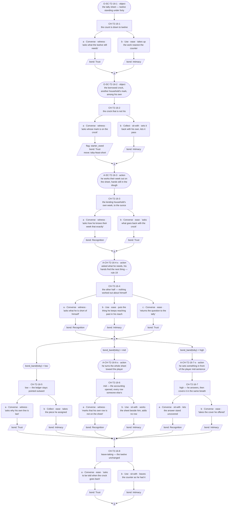
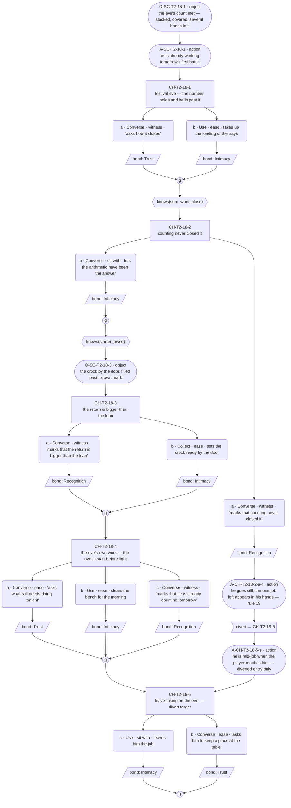

# `toby-feast-short` — v01

**This life only.** Toby is dealt Baker this run (card approved + final 2026-07-25; role-goal: the communal feast), so the staging below is ovens, orders and a counter — `world:tobys-bakery`, ratified in `narrative-pipeline/npc-codex.md`. The thread's identity — id, open question, what it reveals — is ratified in `cast/toby-baker-threads.md` and the id is the one minted in `narrative-pipeline/arc-festival-slice.md`'s Threads to Not Drop table (row 1, "The Baker's feast can't be finished alone"). Everything here is the Baker instance and does not survive a reshuffle.

**Open question:** Can the feast be finished at all?

**Status:** Architect brief complete, authored 2026-08-09. **Choice design ran 2026-08-09** — C1–C4 carry content blocks and mermaid graphs; 6 / 8 / 9 / 5 choice nodes; action slots placed; one marked long run (C1); one divert (C4), approved by Roc 2026-08-09. **GRAPHS APPROVED by Roc, 2026-08-10.** **Prose written 2026-08-10** — C1–C4 line files exist in `lines/`. Structural changes remain a re-spec through Roc, not a quiet edit.

**This thread is the licensed exception to "a role-goal is a situation, not a thread"** (ruled 2026-08-09 — Roc; `../../../plans/_handoffs/2026-08-09-session-handoff.md` §3). Every other civic goal in v01 is `delta_situation` and takes no thread row. This one takes a row because of the tension in it, stated once here and never restated as a beat:

| The want | The role-goal | The tension the thread runs on |
|---|---|---|
| To be the one they could not do without — worth proven by being needed (`primal_seed`, `notice_and_want`) | A communal feast, on a fixed night, for a turnout nobody can count in advance | **A feast cannot be finished alone.** The role-goal manufactures receive-beats faster than he can convert them, so the only route to the thing that would prove him is the one thing he cannot do. Every state change of the shortfall hands him another job to give away and another hand he has to take |

The tension is the reason for the row. **No scene states it, no option points at it,** and no beat resolves it — the shortfall closes, the tension does not.

**This thread builds on the gated Giver run, not around it.** The 2026-07-25 scene `bakery-feast-dough` (approved and final, `../../../cast/toby.md`) already delivered: the feast dough went flat overnight, forty loaves short if the whole square turns out, festival night fixed, and the flask refilled and set by the door. All of it is delivered canon and **reference-free here** — this thread re-enters that world one state later and accrues on it. **The flat dough is never re-declared.** Situation is stateful (`../../../narrative-pipeline/guardrails.md` check 3), and a delta slot restating a delivered situation is a structural flag.

---

## Thread shape

**Four states of one number, across four conversations.** Nothing here is hidden and nothing turns; what changes is the shortfall, and the reveals are what the player watches him *do* to it. The registry's move column fixes the sequence — dough flat → starter begged → twelve down from forty → holds — and the flat dough is behind us, so the four conversations take the remaining three states plus the one the week is actually for.

Stated against his other two threads so the difference is checkable, and so no two rows reveal the same thing (`cast/toby-baker-threads.md`): `toby-the-shelf` shows the reflex **working** on gifts and ends on a held breath. `toby-kept-and-returned` shows the reflex **failing to engage**. This thread shows the reflex **under load** — the machine at full tilt on a problem large enough that its shape is visible from outside, and it closes on the situation while leaving the soul exactly where it started.

Three reveals across **four conversations**.

| # | Reveal | Fact | Card field | Staged this life as |
|---|---|---|---|---|
| R1 | **The conversion.** A shortfall arrives and is arithmetic before it is trouble — a number, a next step, and a job in somebody's hands before distress can register | cast | `role_tag` · tempo | Starter begged off a neighbour: the gap becomes a quantity, a return date, and an errand handed over |
| R2 | **The exact half.** He can state another household's needs and the loan's return to the ounce, and has nothing to say about what asking cost him | cast | `precision_profile` | Twelve down from forty, with the lending household's own week accounted for in the same breath |
| R3 | **The arithmetic *is* the deflection.** The last of the number will not come off by counting, and instead of saying so he does the sum again | re-touch of R1 at load, one new cast fact | `deflection_target` | The same total worked a third time while festival night does not move |

**Conversation allocation** — the Architect's call, and the constraint the Choice designer works inside:

| Conversation | Scene id | Carries |
|---|---|---|
| C1 | `SC-T2-15` — the starter begged off a neighbour | R1 |
| C2 | `SC-T2-16` — twelve down from forty | R2 |
| C3 | `SC-T2-17` — the last twelve will not come off by counting | R3 |
| C4 | `SC-T2-18` — festival eve, the number holds | Nothing new — re-touch and close |

Scene ids are the next free block on **T2 (Market Row)** after `SC-T2-11`, which `toby-the-shelf` reserved; `SC-T2-04` and `SC-T2-07` are the wired legacy scenes. **Proposed — code mints ids; this table reserves shape only.**

**No quiet beat in this thread, on purpose.** `toby-the-shelf` C3 is the quiet beat in Toby's week and it costs a full time block (ruled 2026-08-06). This thread is the engine the festival arc runs on and every conversation moves the situation, so there is no slot here that carries none. A second quiet beat inside one soul's week would spend the pacing twice.

---

## What happens across the thread

A number is short and a night is fixed, and neither of those changes. What changes is the number, four times.

First he closes part of the gap by asking — a starter begged off a neighbour, which is the one move in the thread where he is the one receiving, and he converts it before anyone can call it that: it is a quantity, a date it goes back, and an errand for whoever is standing there. Then the gap is twelve, and the twelve is where the exactness shows — he can account the lending household's own week to the ounce in the same breath as his own, and cannot account for himself at all. Then the twelve stops moving. Counting has done what counting can do, and the rest of it needs hands and hours nobody has spare; he does the sum a third time instead of saying that. Then it is the eve, and the number holds. It holds because a scatter of other people did things, and the arithmetic he is so fast with is the one arithmetic he does not do out loud.

**Where it leaves off on day 5: the situation closed, the soul open.** This is deliberate and it is the anti-goal working (`../../../cast/toby.md`, Arc): the feast is not a fix, and no beat here grants him one. The player may have carried half of it and he will still convert their part into something owed. **Nothing in these four conversations may close the arc question, fire `toby-unopened-jam`, or move the shelf.** The echo needs `gave_unowed` **and** `shelf_named` and pays off cross-soul in the seam pass (`toby-the-shelf`, R7) — this thread does not reach for it and does not gate on it.

**Why a player comes back:** the number. It is different every visit and it is legible in one glance, and the week's real question — whether it will come off at all — is answered by the world rather than by a pick. The pull is a countdown the player can put their hands in.

---

## Dependency order

    C1 (R1) ──> C2 (R2) ──> C3 (R3) ──> C4 (close)

- **C1 needs nothing.** Zero-knowledge entry. It must work as the player's first contact with Toby this week — no sibling thread, no prior scene beyond the gated run's world.
- **C2 needs C1 complete.**
- **C3 needs C2 complete.**
- **C4 needs C3 complete.**

**Entry gates are completion only — never a knowledge flag.** `toby-the-shelf` C4 gates entry on a missable flag, and the standing note under its C2 records the cost: a reveal lost outright rather than shallowed, which R5 forbids. Not repeated here. Every knowledge flag below gates content *inside* a conversation; all four situation states are delivered to every incoming state, because the shortfall is public and true whoever walked in.

### Flags

| Flag | Set by | Read by |
|---|---|---|
| `count_is_turnout` — the forty counts who might come, not who ordered | C1, or the `ex-order-slate` examinable **(PROPOSED)** | C3 |
| `starter_owed` — the starter is borrowed, against a stated return | C2, or the `ex-starter-crock` examinable **(PROPOSED)** | C3, C4 |
| `sum_wont_close` — the player has watched the same total worked again in place of an answer | C3, or the `ex-tally-sheet` examinable **(PROPOSED)** | C4 |

**Every flag has a reader. No flag may be added without one.** The write-only flag is the defect step 3 exists to catch (`shelf_named` in v01).

**C4 sets no flag.** It is the last conversation in the thread and nothing downstream in this thread reads one; a flag minted here to be read by the seam pass would be a cross-thread dependency the seam pass has not asked for. If the seam pass later needs the feast's outcome, that is an Architect change to this table, not a flag added in the graph.

### Facts read per conversation

C1 reads none · C2 reads none · C3 reads two · C4 reads two. R6's ceiling is two.

**C3 and C4 read different pairs on purpose.** All three flags wanted a reader in C4 and that would have been three facts in one conversation. `count_is_turnout` is read in C3, where it makes the refusal-to-shrink land as a refusal rather than a preference; `starter_owed` carries into both.

---

## Delta declarations

Stated against `../../../cast/toby.md`'s `delta_rule` (floor one, ceiling two cast facts solo, situation uncapped, reference free). Every conversation clears the floor through `delta_situation`; the gated run's flat dough, forty-short and fixed night are reference throughout and are never re-declared.

| Conversation | `delta_cast` | `delta_situation` |
|---|---|---|
| C1 | **He bakes against the turnout, not the orders** — the number counts whoever might walk into the square, including everyone who ordered nothing, so nobody in the village is outside his count. **One.** A habit; soul-bound; travels with `toby` and never with the bakery *(invention — declared below)* | A starter begged off a neighbour's household to replace the dead one; the day's baking restarts behind it |
| C2 | None — the exactness is `precision_profile`, carded, and this is its staged delivery under load, not a new fact | Twelve down from forty, with the lending household's own week to be covered before the loan goes back |
| C3 | **He will not cut the number.** Asked to bake for who is confirmed rather than who might come, he does not — the total is not negotiable downward. **One.** A line he does not cross; soul-bound *(invention — declared below)* | The last twelve will not come off by counting; the hours and hands the rest needs do not exist, and festival night does not move |
| C4 | None — the close is a re-touch of R1 at rest, and re-delivering it as a slot is exactly what check 3 flags | Festival eve: the number holds. It closed because several other people did things, in pieces, at different times |

**Two cast facts across four conversations, one each in C1 and C3, both inside the solo ceiling.** They are the same engine seen twice and they are not the same fact: the first is a habit (what the number counts), the second is a line he does not cross (that the number does not come down). The habit is what makes the line make sense, which is why C3's gate reads `count_is_turnout`.

**Declared inventions (guardrails check 12, `narrative-pipeline/npc-codex.md` checked first).** Both are typed `soul` facts bound to `soul:toby`, both extend the card rather than contradicting it, and neither duplicates an existing codex entry:

1. **The turnout basis of the count.** The codex and the card carry "forty loaves short if the whole square turns out" as committed line 01; what is new is that this is the *rule* he counts by rather than that morning's estimate. Reuse-before-invent applied: no existing entry states how his numbers are arrived at.
2. **He will not cut the number.** Nothing in the codex or the card states a line he does not cross about quantity. `conviction` covers care with strings, not counts. New.

Both are **PROPOSED canon** and enter through the loop — declared here, routed to Roc's gate, transcribed to the codex on ratification. Until ratified they bind nothing downstream.

**Quantities are scene colour** (ruled 2026-08-09). Forty and twelve are the *shape* of the thread — a number that shrinks and then stops — and a later scene counting differently contradicts nothing. What is canon-bearing is that a number exists, that it is a turnout, and that it stops moving before it reaches zero.

**Cross-thread situation sharing: none.** No other live thread touches the feast shortfall, so nothing here needs the declare-once-reference-after treatment Ilsa's ore takes. If the seam pass stages the feast itself, its situation is the feast happening, not the shortfall closing.

---

## Constraints on the conversation design

- **Entry gates are completion only.** Knowledge gates content inside a conversation, never entry.
- **Every incoming state must walk without dead-ending.** C3 and C4 read two facts each: four states apiece, all authored.
- **One state is always the fallback** — finished the last conversation, learned nothing. It is a real state a real player reaches, and it exits through real content, because all four situation states are delivered by the situation rather than by a pick.
- **A missed fact makes the conversation shallower, never rerouted** (R5). Every shortfall state is received in full by every state; picks decide depth only.
- **Missed things stay in the world.** Three pickups are declared below, one per flag.
- **Options are equal weight** (guardrail 10). No option is the correct answer; no counter keys off repetition (check 2). **This constraint is under unusual pressure in this thread and the design must hold it:** a shortfall with a fixed deadline is the exact shape that makes helping read as the right answer. It is not. Taking the errand and staying at the counter are the same beat spent differently, and **no amount of help may accumulate into anything** — not a threshold, not an unlock, not a warmer register. The number closing is the world's doing, not a payout.
- **No scene may make the player the reason the feast holds.** C4's situation is explicit that it closed in pieces, by several people, at different times. A close that credits the player converts the thread into a reward ladder and breaks check 2 and the arc's anti-goal in one move.
- **Bond weights:** Recognition 3, Trust 2, Intimacy 2. The deep path records Recognition, the shallow path Intimacy — the depth rule, never inverted.
- **Nothing here states the tension in the exception row.** He never says the feast cannot be finished alone, never says he needs help, and no third party says it for him. The role-goal does the work; naming it hands the player the answer.
- **The sanctioned long run is legal in this thread and is a trap in it.** Toby's card permits one run of up to 75 words per scene, **for logistics, arithmetic or instruction only**, barred wherever he is receiving, thanked or seen, and barred at a payoff (`canon_flags` 8, amended 2026-08-06). This is the one Toby thread whose material actually qualifies — the shortfall broken into quantities and steps. **C1 and C2 are where it belongs, at most one per scene.** It is **barred in C3**, where the sum being re-done is the weight beat and a long run there would put the weight in the words, exactly against rule 19; and **barred in C4**, where the question of how it held is a beat he gets shorter at, not longer. Choice designer places the mark or declines it; declining is a legitimate pass.
- **Asking is receiving, and C1 is the only place in this thread he does it.** The starter is begged. The design must not soften that into a trade, an arrangement, or a favour returned in advance — and it must not let him linger in it either: the conversion is the reveal, so the asking is already past when the scene opens and what the player sees is the arithmetic that covers it.
- **Warmth is invariant.** He goes flat and short while receiving, and a line that reads brusque, clipped, dismissive, transactional or irritated is a defect even when it is flat and short. Under a deadline the temptation is a busy, curt Toby; busy is tempo, and warmth is not on that scale.

### Pacing

A thread may be entered **once per time slot**; the day's opening slot belongs to the festival arc; later slots allow multiple threads (GP-93). Four conversations fit in two days minimum.

**Nothing here may assume which slots, which days, or how much clock separates them.** The states are ordered, not dated: "festival eve" in C4 is whichever visit the player arrives on for that conversation, and no scene may name a day count, because a player may take all four in two days or spread them over five.

**One scheduling note the design must respect:** this thread carries the festival arc and therefore surfaces every run, which makes it the likeliest first contact the player has with Toby all week. C1 must work cold for a player who has met nobody.

### Id conventions

Choice nodes `CH-T2-15-1`, `-2`, … · options `-a`, `-b` · nested child `CH-T2-15-1-a-1` · player line `L-CH-T2-15-1-a-p` · response `L-CH-T2-15-1-a-r1` · action and object slots `A-`/`O-` plus the scene or choice id, suffixed `-s` (set-up interleave) or `-r` (response run). Code mints final ids; these reserve shape only.

**Labels are mandatory** (`../../../narrative-pipeline/templates/id-label-convention.md`, GP-114). Every id gets its gist at first mention in any prose section, minted once in the mermaid graph and reused verbatim after. Any id crossing into a nested child additionally carries the segment readout, with the word **child** — `CH-T2-15-1-a-1-b` (node 1 › option a › child 1 › option b).

**Variant selectors follow the 2026-08-09 scheme.** Path variants are `-norm` (gather) and `-div` (divert) and nothing else. State variants take the **flag name verbatim**, two flags joined by `-and-`: a C4 set-up varying by both facts mints `-s-starter_owed-and-sum_wont_close` and `-s-sum_wont_close`. No bare base id sits beside variants; a slot wanting both a path and a state variant surfaces to Roc.

**There is no negation in the predicate vocabulary.** `not knows(x)` is not a predicate — the resolver parses `^knows\(([^)]+)\)$`, and a gate drawn with a negation compiles to nothing and silently unreaches its branch (`GP-124`; ruled 2026-08-09 to redesign rather than extend the compiler). Express not-knowing as the **ungated fallback**: the knowing case takes the gated node, everyone else walks the path rule 4 already requires to exist.

### Proposed examinables

**Not built. Downstream wires these into `tools/resolver/data/screen-specs.json`; until then the pickup paths naming them do not work.** Every one of them is marked PROPOSED and every one is declared because a path closes without it — a thread that declares nothing has nothing for guardrail check 11 to join, and passes every gate with its closed paths closed permanently.

| id | Screen | Sets | Reopens |
|---|---|---|---|
| `ex-order-slate` — the day's slate at the counter, the turnout figure written beside the order tally | T2 | `count_is_turnout` | C1's closed path — a player who never asks where the number comes from. It is the only route to C3's gated beat, **and only while C3 is still unplayed** |
| `ex-starter-crock` — the borrowed crock with another household's mark on it, standing among his own | T2 | `starter_owed` | C2's closed path — a player who never asks whose starter it is. Reopens C3's and C4's deep beats, **while those conversations are still unplayed** |
| `ex-tally-sheet` — the sheet with the same total worked more than once, the workings not rubbed out | T2 | `sum_wont_close` | C3's closed path — a player who never marks the sum being re-done. Reopens C4's deep beat, **while C4 is still unplayed** |

**The timing qualifier is load-bearing and applies to all three.** A conversation does not replay, so an examinable only helps a player who reaches it *before* the conversation that reads its flag. This is the shape that cost `toby-the-shelf` a reveal, and here it costs only depth — nothing in this thread is gated at entry, so a late pickup makes the next conversation shallower and closes nothing.

**T2's wired examinables today are `stall_goods` and `ex-shelf`** (`tools/resolver/data/screen-specs.json`, regions `r_stall_goods` and `r_ex_shelf`). All three proposals above are new. *(Note for the record: `ex-shelf` — the shelf of unopened jars behind the counter — **is now built**, contrary to the standing PROPOSED note in `toby-the-shelf.md`. That file is complete and out of scope for this pass; correcting its note is a separate edit.)*

---

## Conversations

**For the Choice designer.** One section per conversation, each to receive a content block and a mermaid node graph. **Roc approves the shape before any prose is written.**

The content block says what is open, what is closed and what he reveals, per incoming state. The graph shows the choice nodes, their gates, the options and where each rejoins. Description beats — `action` and `object` slots — are drawn as stadium shapes, per the convention established in `toby-the-shelf.md`.

**Devices available in this thread:** nesting to depth 2, `divert`, three-option nodes, drawn state variants, `bond_band(toby)` variants and the other non-`knows` predicates. **Nothing in Toby's canon bars bond gating** — canon flag 9 keeps bond host-side and unsurfaced, which is a rule about display, not about gates, and `toby-the-shelf` C4 uses bond bands already. **Barred by this brief:** negation in any gate, a knowledge entry gate on any conversation, and a marked long run in C3 or C4.

### C1 — `SC-T2-15`

**Carries R1. Reads no prior facts — one incoming state (zero knowledge). Must work cold as first contact with Toby this week. 6 choice nodes (5 top-level + 1 nested child). Variety devices: a three-option node; nesting to depth 1; the thread's single marked long run. Action layer: 5 description slots (3 `action`, 2 `object`) against ~18 dialogue slots on the deep walk — ratio ≈ 1:3.6.**

**Content block.**

- **Incoming state: zero knowledge (the only state).** The asking is already past when the scene opens — the borrowed crock is on the bench and the day's baking has restarted behind it. What the player walks in on is the conversion, not the beg. Every node here is open to everyone; nothing is gated, because nothing prior exists to gate on. R1 is delivered by the situation: the gap arrives as a quantity, a return date and a job in somebody's hands whatever the player picks, and the picks decide how much of the machinery is visible.
- **Node 1 (`CH-T2-15-1` — the day restarted, ovens going again).** Ungated. Ask what the morning cost him (spoken — records Trust; he answers with what the morning *produced*, which is the deflection working at low load) or take up the nearest part of the work (deed — records Intimacy). Both record, differing in kind. Equal weight: asking turns attention on him and gets the turn back pointed outward; putting hands on the work takes the cover he is offering and spends the same beat.
- **Node 2 (`CH-T2-15-2` — the number said out loud).** Ungated, and the scene's information beat: the gap broken into a quantity, a date the crock goes back, and the next step. **The thread's one marked long run sits on this node's set-up** (rule 20, below). Ask where the number comes from (spoken — **sets `count_is_turnout`**, records Recognition, moves the thread; the deep read, and the only route to C3's gated refusal) or ask what comes next instead (spoken — records Trust; the step taken without its basis). Equal weight: the basis question is the one he has least practice being asked and it costs him footing; taking the next step is what he is actually offering and moves the day. Records differ in kind and in depth, never in rank.
  - **Nested child (`CH-T2-15-2-a-1` (node 2 › option a › child 1) — nothing about the count is an estimate, and he names who it includes).** Inside option `-a`. Let the count stand unquestioned (deed — records Intimacy) or name that the count includes everyone who ordered nothing (spoken — records Recognition; the cast fact seen from outside rather than stated by him). **Why nesting and not a flag-gate:** this beat exists only as an answer to being asked where the number comes from — a flag-gated sibling would print its framing to every player who never asked, and every non-asking player would walk a silent skip through it. The cost is real (the schema's measured 3.5× on scene paths); it is paid once in this conversation, at depth 1, on the node that carries R1.
- **Node 3 (`CH-T2-15-3` — the errand handed over, three options).** Ungated. Before anything can be said about the asking, a job is in somebody's hands. Take the errand (deed — records Intimacy), ask who else is carrying a piece of it (spoken — records Trust; his answer accounts other households exactly, `precision_profile` as reference, not a slot), or ask what happens to the errand if nobody takes it (spoken — records Recognition; it puts the manufacturing of jobs in view without naming it). Equal weight: all three cost the beat, and refusing the errand is not scolded — he re-routes it and the day goes on. Records differ in kind.
- **Node 4 (`CH-T2-15-4` — the return named in advance).** Ungated. The string attached before anyone can call the starter a gift (`conviction`; the card is explicit that stating the return *is* the string, so this is not a counter-example to it). Mark that he said the return before he said thanks (spoken — records Recognition, the deep read) or set the crock where he will want it next (deed — records Intimacy). **This is the conversation's weight beat** and takes the rule-19 build below. Equal weight: marking it turns attention on him at cost to his footing; setting the crock is the anticipation he runs on, aimed back at him, and he takes it without comment.
- **Node 5 (`CH-T2-15-5` — leave-taking, the day's work ahead of him).** Ungated. Leave him to the ovens (deed — records Intimacy) or ask what to bring back next visit (spoken — records Trust; it lets him assign, which his card says he can always do). Both record.
- **Closed path.** A player who never asks where the number comes from leaves without `count_is_turnout` — node 3 of C3 (`CH-T2-17-3` — asked to bake for who is confirmed, he does not cut the number) never opens for them. The number stays in the world: the proposed `ex-order-slate` examinable (T2, PROPOSED) sets `count_is_turnout` later, and only while C3 is still unplayed. The shallow run still delivers R1 whole — quantity, date, errand — plus five full beats.
- **Action slots (rule 18).** Five description beats, typed and placed; Lines writes them:
  - `O-SC-T2-15-1` (`object`, scene opening, before node 1) — the borrowed crock on the bench among his own. The situation as a thing seen before anyone speaks.
  - `A-SC-T2-15-2` (`action`, spine, node-1 gather → node 2) — he works while he counts; the sum happens over the top of the work, never instead of it. R1's tempo carried by the picture.
  - `O-SC-T2-15-3` (`object`, spine, node-2 gather → node 3) — the day's slate at the counter, the turnout figure written beside the order tally. This is `ex-order-slate`'s referent (PROPOSED), shown here so node 3's options point at something the player has already looked at.
  - `A-CH-T2-15-4-s` (`action`, inside node 4's set-up) — he sets the return date down with the crock. Part of the rule-19 build below.
  - `A-SC-T2-15-5` (`action`, node 5's set-up) — the next tray goes in; the ovens are ahead of the talk.
- **Rule-19 build — node 4, the weight beat.** Built fragment → action → fragment: a short dialogue fragment (the return stated) → `A-CH-T2-15-4-s` (the date set down with the crock) → a shorter fragment. The weight is in the silence between them and never moves into a longer line.
- **Sanctioned long run (rule 20): one, placed here, on `L-CH-T2-15-2-s` — node 2's set-up.** It is the thread's only one and this is the conversation the brief names for it. It carries **information** — what is short, by how much, by when, who has what — which is exactly `canon_flags` 8's licence (logistics, arithmetic, instruction). It is legal here and nowhere else nearby: he is not receiving in it (the asking is already past), not being thanked, not being seen, and this is not a payoff. Ceiling 75 words, marked on the content item, one per scene. It is deliberately *not* on node 4, where the weight is — putting the run on the weight beat is the card's named failure mode 2.
- **Walk-ons (rule 21).** None. The neighbour whose starter was begged never appears and is never named by the design; if Lines needs her named, that is an Architect declaration, not a walk-on this seat may mint.
- **No accrual (check 2).** No option here is repeatable, no flag counts, and the single `thread_move` rides one option on one node.

```mermaid
flowchart TD
  OS1(["O-SC-T2-15-1 · object<br>the borrowed crock on the bench among his own"])
  OS1 --> N1["CH-T2-15-1<br>the day restarted — ovens going again"]
  N1 --> N1a("a · Converse · witness · 'asks what the morning cost him'")
  N1 --> N1b("b · Use · ease · takes up the nearest part of the work")
  N1a --> R1a[/"bond: Trust"/]
  R1a --> J1(("g"))
  N1b --> R1b[/"bond: Intimacy"/]
  R1b --> J1
  J1 --> AS2(["A-SC-T2-15-2 · action<br>he works while he counts; the sum runs over the work"])
  AS2 --> N2["CH-T2-15-2<br>the number said out loud — quantity, return date, next step"]
  N2 --> N2a("a · Converse · witness · 'asks where the number comes from'")
  N2 --> N2b("b · Converse · ease · 'asks what comes next instead'")
  N2a --> R2a[/"flag: count_is_turnout<br>bond: Recognition<br>move: toby-feast-short"/]
  subgraph S2a["CH-T2-15-2-a"]
    C2["CH-T2-15-2-a-1<br>the count is not an estimate — he names who it includes"]
    C2 --> C2a("a · Converse · sit-with · lets the count stand unquestioned")
    C2 --> C2b("b · Converse · witness · 'names that the count includes those who ordered nothing'")
    C2a --> RC2a[/"bond: Intimacy"/]
    RC2a --> JC2(("g_CH-T2-15-2-a"))
    C2b --> RC2b[/"bond: Recognition"/]
    RC2b --> JC2
  end
  R2a --> C2
  JC2 --> J2(("g"))
  N2b --> R2b[/"bond: Trust"/]
  R2b --> J2
  J2 --> OS3(["O-SC-T2-15-3 · object<br>the day's slate — turnout figure beside the order tally"])
  OS3 --> N3["CH-T2-15-3<br>the errand handed over before anything can be said"]
  N3 --> N3a("a · Collect · ease · takes the errand")
  N3 --> N3b("b · Converse · witness · 'asks who else is carrying a piece of it'")
  N3 --> N3c("c · Converse · witness · 'asks what happens to the errand if nobody takes it'")
  N3a --> R3a[/"bond: Intimacy"/]
  R3a --> J3(("g"))
  N3b --> R3b[/"bond: Trust"/]
  R3b --> J3
  N3c --> R3c[/"bond: Recognition"/]
  R3c --> J3
  J3 --> AS4(["A-CH-T2-15-4-s · action<br>he sets the return date down with the crock — mid-set-up, rule 19"])
  AS4 --> N4["CH-T2-15-4<br>the return named in advance — the string attached first"]
  N4 --> N4a("a · Converse · witness · 'marks that he said the return before thanks'")
  N4 --> N4b("b · Use · sit-with · sets the crock where he will want it next")
  N4a --> R4a[/"bond: Recognition"/]
  R4a --> J4(("g"))
  N4b --> R4b[/"bond: Intimacy"/]
  R4b --> J4
  J4 --> AS5(["A-SC-T2-15-5 · action<br>the next tray goes in; the ovens are ahead of the talk"])
  AS5 --> N5["CH-T2-15-5<br>leave-taking — the day's work ahead of him"]
  N5 --> N5a("a · Use · sit-with · leaves him to the ovens")
  N5 --> N5b("b · Converse · ease · 'asks what to bring back next visit'")
  N5a --> R5a[/"bond: Intimacy"/]
  R5a --> J5(("g"))
  N5b --> R5b[/"bond: Trust"/]
  R5b --> J5
```

### C2 — `SC-T2-16`

**Carries R2. Reads no prior facts — one incoming state by knowledge; the conversation's variance is drawn on `bond_band(toby)` instead, which per rule 22 selects between nodes and counts against no fact ceiling. 8 choice nodes (5 spine + 3 band variants, exactly one band node playing per walk — a walk sees 6). Variety devices: bond-band variants, a three-option node. No nesting, no divert, no marked long run. Action layer: 6 description slots authored (4 `action`, 2 `object`); any single walk sees 5 against ~18 dialogue slots — ratio ≈ 1:3.6.**

**Content block.**

- **Incoming states.** A player arrives here having completed C1 either with `count_is_turnout` or without it. C2 reads neither, so both walk the same spine — the shortfall's new state is public and true whoever walked in. What differs is the band the bond stands at, and that difference is drawn: nodes 5, 6 and 7 are the same beat authored three ways, one hexagon each. This is deliberate placement — the second conversation is where a first-contact player is still at low band and a player carrying Toby from another thread is not, so the band variance has something to say here that it would not have at the close.
- **Node 1 (`CH-T2-16-1` — the count is down to twelve, the tally being worked at the counter).** Ungated. Ask what the twelve still needs (spoken — records Trust) or take up the part of the work nearest the counter (deed — records Intimacy). Both record. Equal weight: the question gets a full accounting because accounting is his comfortable direction; the work is the same beat spent with hands.
- **Node 2 (`CH-T2-16-2` — the borrowed crock among his own, another household's mark on it).** Ungated. Ask whose mark is on the crock (spoken — **sets `starter_owed`**, records Trust, moves the thread; his answer states the return in the same breath as the mark) or set it back with his own and let it pass (deed — records Intimacy). Equal weight: asking names the loan and there is no cost to him in naming it, because the return is already stated — that is the point; letting it pass respects a thing he has already closed. Records differ in kind.
- **Node 3 (`CH-T2-16-3` — the lending household's own week, accounted to the ounce).** Ungated, and R2's first half arrives here for every state. Ask how he knows their week that exactly (spoken — records Recognition, the deep read of `precision_profile`) or ask what goes back with the crock (spoken — records Trust). Equal weight: the first asks about him and he answers about them, which is the reveal working; the second asks about them and gets the same answer, which is the reveal working from the other side. Records differ in depth, never in rank.
- **Node 4 (`CH-T2-16-4` — the other half: asked what his own week needs, he has nothing worked out; three options).** Ungated. Ask what he is short of himself (spoken — records Recognition), put the thing he keeps reaching past within his reach (deed — records Intimacy), or return the question to the tally (spoken — records Trust; it hands him the deflection and he takes it, warmth intact). **This is the conversation's weight beat** and takes the rule-19 build below. Equal weight: pressing costs him footing and buys nothing solved; handing him the deflection is a real kindness his card would choose; the deed sits between them. No response scolds the other picks — the card's warmth is invariant and none of these is a wrong move.
- **Nodes 5–7 (`CH-T2-16-5` / `-6` / `-7`, sibling gated nodes, one per `bond_band(toby)` band — exactly one is true, so exactly one plays).** The same beat authored three ways: what he does with the accounting once his own row has been asked after. Bond bands are schema predicate vocabulary, not knowledge, so this reads no fact and the four-state ceiling is untouched.
  - **Low (`CH-T2-16-5` — he keeps the ledger pointed outward, `bond_band(toby) = low`).** He assigns the player a piece of somebody else's week rather than his own. Ask why his own line is last (spoken — records Trust) or take the piece he assigned (deed — records Intimacy).
  - **Mid (`CH-T2-16-6` — he turns the whole sheet toward the player, `bond_band(toby) = mid`).** The accounting opened rather than parcelled out — still every row another household's. Mark that his own row is not on the sheet (spoken — records Recognition) or work the sheet beside him without adding a row (deed — records Intimacy).
  - **High (`CH-T2-16-7` — he answers, then covers it in the same breath, `bond_band(toby) = high`).** He names one thing he needs and supplies the player something before the sentence is finished. Let the answer stand uncovered (deed — records Recognition) or take the cover he offered (spoken — records Intimacy).
- **Node 8 (`CH-T2-16-8` — leave-taking, the twelve unchanged and the crock's return still ahead).** Ungated. Ask to be told when the crock goes back (spoken — records Trust) or leave the counter as he had it (deed — records Intimacy). Both record.
- **Closed path.** A player who never asks whose mark is on the crock leaves without `starter_owed` — `CH-T2-17-4` (the loan counted before his own gap) and `CH-T2-18-3` (the return bigger than the loan) never open for them. The crock stays in the world: the proposed `ex-starter-crock` examinable (T2, PROPOSED) sets `starter_owed` later, and only while those conversations are still unplayed. The shallow run loses depth in C3 and C4 and loses no reveal — R2 is delivered whole at nodes 3 and 4 to every state.
- **Action slots (rule 18).** Six authored; any walk sees five:
  - `O-SC-T2-16-1` (`object`, scene opening, before node 1) — the tally sheet at the counter, twelve standing under forty. The new state of the number shown before it is spoken.
  - `O-SC-T2-16-2` (`object`, spine, node-1 gather → node 2) — the borrowed crock with another household's mark, standing among his own. `ex-starter-crock`'s referent (PROPOSED), so node 2's ask-option points at a thing already seen.
  - `A-SC-T2-16-3` (`action`, spine, node-2 gather → node 3) — he works the other household's week out on the sheet without his hands leaving the dough. R2's exactness shown as speed, not narrated.
  - `A-CH-T2-16-4-s` (`action`, inside node 4's set-up) — asked what he needs, his hands find the next thing. Part of the rule-19 build below.
  - `A-CH-T2-16-6-s` (`action`, mid band, inside node 6's set-up) — he turns the whole sheet toward the player. The opening is the beat, and it is shown.
  - `A-CH-T2-16-7-s` (`action`, high band, inside node 7's set-up) — he sets something in front of the player before the sentence is finished. The cover is an act he performs and does not mention, which no spoken slot can carry (check 8).
- **Rule-19 build — node 4, the weight beat (R2's second half: nothing to say about himself).** Built fragment → action → fragment: a short receiving-flat dialogue fragment → `A-CH-T2-16-4-s` (the hands finding the next thing) → a shorter fragment. Receiving-flat with warmth intact, per the card; the beat gets shorter, never longer.
- **Sanctioned long run (rule 20): considered and declined here.** The accounting of the lending household's week is the thread's second information-shaped candidate and the brief licenses C2 for it. It is declined for two reasons. First, R2's two halves sit one node apart, and the half that follows — nothing worked out about himself — is a *being-seen* beat, where `canon_flags` 8 bars the run absolutely; a run at node 3 would set a length register the very next beat has to break. Second, the exactness reads sharper as short pieces divided by `A-SC-T2-16-3` than as a single stretch. The thread ships exactly one marked run, in C1, which matches the corpus rate.
- **Walk-ons (rule 21).** None. The lending household is accounted for and never appears.
- **No accrual (check 2).** The bond bands *read* the single hidden count; nothing here writes a tally, and no option's repetition is threshold-bearing. One `thread_move`, on one option of node 2.

### C3 — `SC-T2-17`

**Carries R3, the thread's sharpest reveal. Reads two prior facts: `count_is_turnout`, `starter_owed` — four incoming states, all authored. 9 choice nodes (7 top-level + 2 nested, the nesting running to depth 2 — `MAX_NESTING`). Variety devices: nesting to depth 2; a three-option node; the two knowledge gates split rather than conjoined, so the two mid states are structurally distinct instead of fallback-identical. Marked long run barred by the brief and none placed. Action layer: 6 description slots (5 `action`, 1 `object`) against ~22 dialogue slots on the deep walk — ratio ≈ 1:3.7.**

**Content block.**

- **All four states.** The sum being re-done is scene business: the sheet is on the counter with the same total worked more than once and the workings not rubbed out, and he adds the column again in front of whoever walked in. R3 is therefore delivered by the situation to every state — the picks decide how much of the deflection is legible, never whether it happens. Nodes 1, 2, 5, 6 and 7 are open to everyone; node 3 reads `count_is_turnout`, node 4 reads `starter_owed`. The four states walk as: fallback 1(+children)→2→5→6→7 (seven nodes); `count_is_turnout` only 1→2→**3**→5→6→7; `starter_owed` only 1→2→**4**→5→6→7; both 1→2→3→4→5→6→7 (all nine).
- **Node 1 (`CH-T2-17-1` — the same total worked again in front of the player).** Ungated, and the reveal's entry. Ask what changed since the last time he added it (spoken — **sets `sum_wont_close`**, records Recognition, moves the thread) or hold the sheet steady and let the sum run (deed — records Intimacy). Equal weight: the question is the only thing in the scene that points at the re-doing, and it costs him the cover; holding the sheet is company inside the deflection rather than a challenge to it, and his card says company is the thing he can accept. Records differ in depth, never in rank.
  - **Nested child (`CH-T2-17-1-a-1` (node 1 › option a › child 1) — nothing changed, and he starts the column again).** Inside option `-a`. Ask him to say what the number will not do (spoken — records Trust; opens the child below) or let the second pass run without interrupting (deed — records Intimacy).
    - **Nested grandchild (`CH-T2-17-1-a-1-a-1` (node 1 › option a › child 1 › option a › child 1) — he answers with the next step instead of the answer: what the twelve would take in hands and hours).** Depth 2, the ceiling. Take the next step as the answer (deed — records Intimacy) or mark that the step is not the answer (spoken — records Recognition, the sharpest read in the thread). This is R3 arriving as structure rather than as a line: the player asks a question, is handed arithmetic, and the last option is the one place the substitution can be named.
    - **Why nesting to depth 2 and not flag-gated siblings.** The substitution only exists as an answer to being pressed, and the pressing only exists as an answer to having asked what changed — each level is licensed by the one above it and by nothing else. Flag-gated siblings would print two framings to every player who never asked, and every such player would walk two silent skips. The measured cost is real (3.5× scene paths for one nested option, and this scene carries two levels); it is spent once, in the conversation the whole thread builds to, and nowhere else. Depth 2 is the ceiling and this design sits on it, not past it.
- **Node 2 (`CH-T2-17-2` — what is left with nobody on it).** Ungated. The hours and hands the rest needs do not exist, and the way that surfaces is a list of unassigned pieces. Ask what is still without anybody on it (spoken — records Trust) or take one of the unassigned pieces (deed — records Intimacy). Equal weight: taking a piece moves the world and spends the player's block; asking leaves the block and gets the accounting. **Neither is the reason the feast holds** — C4's situation is explicit that it closed in pieces, by several people, and nothing recorded here is read as a contribution total.
- **Node 3 (`CH-T2-17-3` — asked to bake for who is confirmed, he does not cut the number; gated `knows(count_is_turnout)`, three options).** Opens only for a player who learned in C1 that the forty counts turnout rather than orders. That is what makes this land as a refusal rather than a preference: without it, "bake for who is confirmed" is just a different estimate. Ask him to bake for who is confirmed (spoken — records Recognition; the cast fact, a line he does not cross, seen from outside), ask who the extra loaves are for (spoken — records Trust; the answer is everyone who ordered nothing), or set the slate back where he can see the whole figure (deed — records Intimacy). Equal weight: the first is a sound practical read that a reasonable person offers and the scene does not scold; the second takes the count on its own terms; the third leaves it alone. If the gate is false the node auto-skips to the gather.
- **Node 4 (`CH-T2-17-4` — the loan counted before his own gap; gated `knows(starter_owed)`).** Opens only for a player who learned in C2 that the starter is borrowed against a stated return. The return sits inside the same arithmetic and comes off the top before the twelve. Mark that the loan is counted before his own gap (spoken — records Recognition) or ask what the household gets back over the loan (spoken — records Trust; more than came out, and he has the figure ready). If the gate is false the node auto-skips.
- **Node 5 (`CH-T2-17-5` — the ovens' limit, which is not arithmetic).** Ungated. Ask how many the ovens take in a day (spoken — records Trust) or bank the oven for the next batch (deed — records Intimacy). The one constraint in the scene that no amount of counting touches, and it is delivered flatly as capacity rather than as trouble.
- **Node 6 (`CH-T2-17-6` — the third pass; the total worked again while festival night does not move).** Ungated. **The conversation's weight beat**, and R3 at full load. Stay through the third pass without a word (deed — records Intimacy) or mark that the sum has not changed in three passes (spoken — records Recognition). Equal weight: naming it is the only thing that stops the loop and it takes his cover on the day he needs it most; staying is the sit-with his card can receive. Rule-19 build below.
- **Node 7 (`CH-T2-17-7` — leave-taking; the number stands at twelve).** Ungated. Ask what to carry back next visit (spoken — records Trust) or leave the sheet as he had it (deed — records Intimacy). Both record; the fallback player exits through real content.
- **Closed paths.** Missed `count_is_turnout`: node 3 never opens, and `ex-order-slate` (PROPOSED) reopens it only while C3 is unplayed. Missed `starter_owed`: node 4 never opens, `ex-starter-crock` (PROPOSED) the same. Missed `sum_wont_close` — a player who never asks what changed at node 1: `CH-T2-18-2` (counting never closed it) never opens in C4, and `ex-tally-sheet` (PROPOSED) reopens it only while C4 is unplayed. Every miss is depth, never a reveal: R3 arrives in the situation.
- **Action slots (rule 18).** Six description beats:
  - `O-SC-T2-17-1` (`object`, scene opening, before node 1) — the sheet with the same total worked more than once, the workings not rubbed out. `ex-tally-sheet`'s referent (PROPOSED). R3's surface is a thing seen before anybody speaks.
  - `A-CH-T2-17-1-a-1-s` (`action`, the child node's set-up) — he starts the column again. The re-doing is an act he performs and does not mention, which a spoken slot cannot carry at all (check 8); the child's set-up **is** this action slot, and its `#choice:` rides the first option line per the schema.
  - `A-SC-T2-17-2` (`action`, spine, node-1 gather → node 2) — he goes down the list of what still has nobody on it, marking as he goes.
  - `A-CH-T2-17-3-s` (`action`, inside node 3's set-up) — he puts the slate back with the whole figure showing. The refusal is shown before it is spoken, so the spoken half can stay short.
  - `A-SC-T2-17-5` (`action`, spine, node-4 gather → node 5) — he banks the oven and counts the batches off against the door.
  - `A-CH-T2-17-6-s` (`action`, inside node 6's set-up) — the pencil goes back to the top of the column. Part of the rule-19 build below.
- **Rule-19 build — node 6, the third pass.** Built fragment → action → fragment: a short dialogue fragment (the total, again) → `A-CH-T2-17-6-s` (the pencil back to the top) → a shorter fragment. The weight is the return to the top of the column, and it lives in the action slot. A longer line here would be the card's failure mode 2 exactly, which is why the brief bars the marked run in this conversation.
- **No sanctioned long run (rule 20).** Barred here by the brief and correctly: the sum being re-done is the weight beat, and a run would put the weight in the words. None placed.
- **Walk-ons (rule 21).** None.
- **No accrual (check 2).** Node 2 lets the player take a piece of the work and records a bond event of one category, once; nothing counts pieces, nothing thresholds on them, and no repetition is reachable inside the conversation. One `thread_move`, on one option of node 1.

```mermaid
flowchart TD
  OS1(["O-SC-T2-17-1 · object<br>the sheet — the same total worked more than once, workings not rubbed out"])
  OS1 --> N1["CH-T2-17-1<br>he adds the column again in front of the player"]
  N1 --> N1a("a · Converse · witness · 'asks what changed since he last added it'")
  N1 --> N1b("b · Use · sit-with · holds the sheet steady, lets the sum run")
  N1a --> R1a[/"flag: sum_wont_close<br>bond: Recognition<br>move: toby-feast-short"/]
  subgraph S1a["CH-T2-17-1-a"]
    ASC1(["A-CH-T2-17-1-a-1-s · action<br>nothing changed; he starts the column again — the child's set-up"])
    ASC1 --> C1["CH-T2-17-1-a-1<br>the second pass begins"]
    C1 --> C1a("a · Converse · witness · 'asks him to say what the number will not do'")
    C1 --> C1b("b · Converse · sit-with · lets the second pass run uninterrupted")
    C1b --> RC1b[/"bond: Intimacy"/]
    RC1b --> JC1(("g_CH-T2-17-1-a"))
    C1a --> RC1a[/"bond: Trust"/]
    subgraph S1a1a["CH-T2-17-1-a-1-a"]
      C2["CH-T2-17-1-a-1-a-1<br>he answers with the next step — hands and hours, not an answer"]
      C2 --> C2a("a · Converse · sit-with · takes the next step as the answer")
      C2 --> C2b("b · Converse · witness · 'marks that the step is not the answer'")
      C2a --> RC2a[/"bond: Intimacy"/]
      RC2a --> JC2(("g_CH-T2-17-1-a-1-a"))
      C2b --> RC2b[/"bond: Recognition"/]
      RC2b --> JC2
    end
    RC1a --> C2
    JC2 --> JC1
  end
  R1a --> ASC1
  JC1 --> J1(("g"))
  N1b --> R1b[/"bond: Intimacy"/]
  R1b --> J1
  J1 --> AS2(["A-SC-T2-17-2 · action<br>he goes down the list of what has nobody on it"])
  AS2 --> N2["CH-T2-17-2<br>what is left with nobody on it"]
  N2 --> N2a("a · Converse · witness · 'asks what is still without anybody on it'")
  N2 --> N2b("b · Collect · ease · takes one of the unassigned pieces")
  N2a --> R2a[/"bond: Trust"/]
  R2a --> J2(("g"))
  N2b --> R2b[/"bond: Intimacy"/]
  R2b --> J2
  J2 --> G3{{"knows(count_is_turnout)"}}
  G3 --> AS3(["A-CH-T2-17-3-s · action<br>he puts the slate back, whole figure showing"])
  AS3 --> N3["CH-T2-17-3<br>asked to bake for who is confirmed — he does not cut the number"]
  N3 --> N3a("a · Converse · ease · 'asks him to bake for who is confirmed'")
  N3 --> N3b("b · Converse · witness · 'asks who the extra loaves are for'")
  N3 --> N3c("c · Use · sit-with · sets the slate where he can see the whole figure")
  N3a --> R3a[/"bond: Recognition"/]
  R3a --> J3(("g"))
  N3b --> R3b[/"bond: Trust"/]
  R3b --> J3
  N3c --> R3c[/"bond: Intimacy"/]
  R3c --> J3
  J3 --> G4{{"knows(starter_owed)"}}
  G4 --> N4["CH-T2-17-4<br>the loan comes off the top, before his own gap"]
  N4 --> N4a("a · Converse · witness · 'marks that the loan is counted before his own gap'")
  N4 --> N4b("b · Converse · ease · 'asks what the household gets back over the loan'")
  N4a --> R4a[/"bond: Recognition"/]
  R4a --> J4(("g"))
  N4b --> R4b[/"bond: Trust"/]
  R4b --> J4
  J4 --> AS5(["A-SC-T2-17-5 · action<br>he banks the oven, counts the batches off against the door"])
  AS5 --> N5["CH-T2-17-5<br>the ovens' limit — the one thing counting does not touch"]
  N5 --> N5a("a · Converse · witness · 'asks how many the ovens take in a day'")
  N5 --> N5b("b · Use · ease · banks the oven for the next batch")
  N5a --> R5a[/"bond: Trust"/]
  R5a --> J5(("g"))
  N5b --> R5b[/"bond: Intimacy"/]
  R5b --> J5
  J5 --> AS6(["A-CH-T2-17-6-s · action<br>the pencil goes back to the top of the column — mid-set-up, rule 19"])
  AS6 --> N6["CH-T2-17-6<br>the third pass, while festival night does not move"]
  N6 --> N6a("a · Converse · sit-with · stays through the third pass without a word")
  N6 --> N6b("b · Converse · witness · 'marks that the sum has not changed in three passes'")
  N6a --> R6a[/"bond: Intimacy"/]
  R6a --> J6(("g"))
  N6b --> R6b[/"bond: Recognition"/]
  R6b --> J6
  J6 --> N7["CH-T2-17-7<br>leave-taking — the number stands at twelve"]
  N7 --> N7a("a · Converse · ease · 'asks what to carry back next visit'")
  N7 --> N7b("b · Use · sit-with · leaves the sheet as he had it")
  N7a --> R7a[/"bond: Trust"/]
  R7a --> J7(("g"))
  N7b --> R7b[/"bond: Intimacy"/]
  R7b --> J7
```

### C4 — `SC-T2-18`

**Carries nothing new — re-touch of R1 at rest and the close. Reads two prior facts: `starter_owed`, `sum_wont_close` — four incoming states, all authored. Sets no flag, per the brief. 5 choice nodes, the low end of the range and the thread's smallest, on purpose: the close is the one conversation where the situation has already answered the week's question and the picks are what the player does with an answer. Variety device: a `rejoin: divert` — **sanctioned, ruled 2026-08-09**; plus a three-option node. Marked long run barred by the brief and none placed. Action layer: 5 description slots (3 `action`, 2 `object`) authored; any single walk sees 4 against ~12 dialogue slots — ratio ≈ 1:3.**

**Content block.**

- **All four states.** Festival eve. The number holds, and it holds because a scatter of other people did things, in pieces, at different times — that is the situation, delivered in full to every state, and **no node here credits the player with it.** He is already past the count and onto tomorrow. Node 1 and nodes 4 and 5 are open to everyone; node 2 reads `sum_wont_close`, node 3 reads `starter_owed`. The four states walk as: fallback 1→4→5 (three full beats); `starter_owed` only 1→3→4→5; `sum_wont_close` only 1→2→(divert to 5, or →4→5); both 1→2→(divert to 5, or →3→4→5).
- **Node 1 (`CH-T2-18-1` — the count is met and he is already past it).** Ungated. Ask how it closed (spoken — records Trust; his answer is a list of other people's pieces with no line in it for the player's own, which is the arithmetic he is fastest at and the one he does not do out loud) or take up the loading of the trays (deed — records Intimacy). Equal weight: the question gets the whole ledger and none of the reckoning; the deed is the eve's actual work. **The response must not name the player's contribution**, whatever the player did across the week — that is the constraint the whole conversation is built to hold.
- **Node 2 (`CH-T2-18-2` — counting never closed it; gated `knows(sum_wont_close)`).** Opens only for a player who watched the same total worked in place of an answer. Mark that counting never closed it (spoken — records Recognition, **and diverts to node 5**) or let the arithmetic have been the answer (deed — records Intimacy; the moment passes inside this conversation). Equal weight: naming it is the deepest read available and it costs the player the rest of the eve's visit; letting it stand leaves him his cover and buys the fuller scene. Records differ in kind and depth, never in rank. If the gate is false the node auto-skips.
  > **DIVERT — SANCTIONED (ruled 2026-08-09 — Roc).** `CH-T2-18-2-a` is `rejoin: divert → CH-T2-18-5`. Checked against the schema's five-condition sanctioning test (`../../../narrative-pipeline/templates/choice-node-schema.md`, ruled 2026-08-09) and passes. The case for it stands as designed: festival eve is the one night he has no unfinished task standing ready, so when the naming turns attention on him his `deflection_target` has to go and find one — and going to find it is physically leaving the counter, which is what the divert *is*. The counter beats at nodes 3 and 4 are business his flat state cannot carry on that night, and skipping them is the structure honouring the card rather than punishing the pick; the diverted player still reaches the close and still carries the conversation's deepest record. The alternative considered and rejected: nodes 3 and 4 gated so they do not appear after the naming — which would need negation, and there is no negation in the predicate vocabulary (`GP-124`).
- **Node 3 (`CH-T2-18-3` — the crock goes back with more in it than came out; gated `knows(starter_owed)`, non-divert path).** Opens only for a player who knows the starter was borrowed against a stated return. Mark that the return is bigger than the loan (spoken — records Recognition; `conviction` at the close, the string paid over rather than level) or set the crock ready by the door (deed — records Intimacy). If the gate is false the node auto-skips.
- **Node 4 (`CH-T2-18-4` — the eve's own work: the ovens start before light whoever turns up; three options, non-divert path).** Ungated within the path. Ask what still needs doing tonight (spoken — records Trust), clear the bench for the morning (deed — records Intimacy), or mark that he is already counting tomorrow (spoken — records Recognition). Equal weight: all three cost the beat and none of them changes what the morning holds. **This is the fallback state's deep beat** — a player who learned nothing still gets the close, the eve, and a three-option node, not an apology.
- **Node 5 (`CH-T2-18-5` — leave-taking on the eve; gather point and divert target).** Ungated. On the diverted path he is mid-job, flat, warmth intact. Leave him the job (deed — records Intimacy) or ask him to keep a place at the table (spoken — records Trust; it lets him give, which his card says he can always do, and it closes the thread on him supplying somebody rather than on him being thanked). Both record. **Nothing here closes the arc question, fires `toby-unopened-jam`, or moves the shelf**, per the brief: the situation closes and the soul is left exactly where it started.
- **Closed paths.** Missed `sum_wont_close`: node 2 never opens; `ex-tally-sheet` (PROPOSED) reopens it only while C4 is unplayed. Missed `starter_owed`: node 3 never opens; `ex-starter-crock` (PROPOSED) the same. Both are depth, not reveal — C4 carries nothing new by design, so nothing can be lost outright here. **This is the structural difference from `toby-the-shelf` C4**, whose knowledge entry gate could lose R3 entirely; here entry is completion-only and the close reaches every player who got this far.
- **Action slots (rule 18).** Five authored; any walk sees four:
  - `O-SC-T2-18-1` (`object`, scene opening, before node 1) — the eve's count met: stacked, covered, more than one pair of hands in the shapes of it. The close shown as a thing, and the several-people-in-pieces fact carried by the picture rather than announced.
  - `A-SC-T2-18-1` (`action`, between the opening object and node 1) — he is already working tomorrow's first batch. Being past it is shown, never stated.
  - `A-CH-T2-18-2-a-r` (`action`, inside node 2 option `-a`'s response run, before the divert) — he goes still; then the one job left appears in his hands. Part of the rule-19 build below, and the pivot the divert rides.
  - `O-SC-T2-18-3` (`object`, gate → node 3) — the crock by the door, filled past its own mark. Node 3's spoken option points at this slot.
  - `A-CH-T2-18-5-s` (`action`, node 5's set-up, diverted entry only) — he is mid-job when the player reaches him. The non-divert entry arrives at node 5 without it.
- **Rule-19 build — node 2 option `-a`, the naming (the thread's closing weight beat).** Built fragment → action → fragment: the player's line (its own ≤12-word slot) → a short receiving-flat response fragment → `A-CH-T2-18-2-a-r` (the stillness, then the job in his hands) → the shortest fragment, then the divert. The collapse of the visit is what the action slot shows; no longer line carries it.
- **No sanctioned long run (rule 20).** Barred here by the brief, and right: how the number held is a beat he gets shorter at, not longer, and any run about the closing would drift toward a reckoning the design forbids. None placed. **The thread ships exactly one marked run, in C1.**
- **Walk-ons (rule 21).** None. The several people whose pieces closed the number stay offstage and unnamed — naming one would be an invention this seat may not declare, and would also start converting the close into a cast of helpers.
- **No accrual (check 2), and the thread's hardest instance of it.** Nothing in this conversation reads how much the player did across C1–C3; there is no help count, no threshold, no warmer register at the close, and node 1's answer to "how did it close" is authored as other people's pieces regardless of the player's picks. C4 records bond events and no flags and no `thread_move`.

---

## Card fields the designer must not contradict

- **`deflection_target`** — when attention turns on him he finds something that still needs doing and goes to do it. In this thread the unfinished task is the feast itself, which means the deflection is always available and always in character; the design must not read that as him being cornered.
- **`precision_profile`** — exact about what everyone else needs, and by when; he has not worked out what he needs. R2 is this axis and R3 is what happens when it runs out of road.
- **`warmth_channel`** — anticipation. It is already there when you reach for it, and he never says he did it. One stated exception: he may say what his hands did when the doing is visible in the room and he is speaking to a named person; what stays barred is the *reason* the offer was worth making.
- **`conviction`** — he refuses care with no strings attached. The begged starter is not a counter-example: he states the return in the same breath, which is the string being attached in advance.
- **Warmth is invariant.** Flat and short while receiving; a line that reads brusque, clipped, dismissive, transactional or irritated is a defect even when it satisfies every structural check.
- **The animation points one way only.** Animated when attention points outward, flat the moment it turns back on him, and shorter as the beat gets heavier. It is not a mood the scene may turn up for urgency.
- **No World Truth is ever stated in-scene, and no scene grants Toby a fix as a reward.** The feast holding is not a fix.

---

## For Roc — decisions and open items

1. **Two invented cast facts, declared and PROPOSED** (Delta declarations): the turnout basis of the count, and that he will not cut the number. Both are new soul-bound facts on `soul:toby`. They need ratification before the codex records them; the thread is writable either way but C3's reveal rests on the second one.
2. **`toby-kept-and-returned` has no arc-doc row.** The Threads to Not Drop table lists `toby-feast-short` and four others; the slot-C thread ratified in the registry on 2026-08-09 is not in it. The registry says every thread the runtime moves must appear in that table by id. Reconciliation item, not a blocker for this brief.
3. **`giver-receive` is still the id wired into `role-workplace.json`'s Baker row**, `story.json`, `graph.json` and the Lantern fixtures. `toby-feast-short` is the id going forward and the rewire has not been made. Anything generated against this brief will not join to the runtime until it is.
4. **`toby-the-shelf.md` carries a stale note** saying `ex-shelf` is not built. It is built, on T2, region `r_ex_shelf`. Left untouched — that file is complete and outside this pass's scope.
