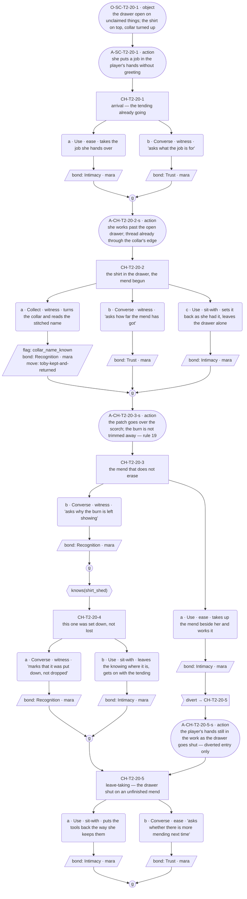

# `toby-kept-and-returned` — v01

**This life only.** Toby is dealt Baker and Mara Herbalist this run, so the staging below is an oven mouth, a rag pile and a drawer under a stall bench — `world:tobys-bakery` and `world:maras-stall`, both ratified in `narrative-pipeline/npc-codex.md`, both on **T2 (Market Row)**. The thread's identity — id, open question, the facet it opens, and the object that carries it — is ratified in `cast/toby-baker-threads.md` (slot C, ruled 2026-08-09 — Roc). The card it must not contradict is `cast/toby.md`. Everything here is the Baker instance and does not survive a reshuffle.

**Open question:** What can be given to a man who converts every gift into a debt?

**Status:** Architect brief complete, authored 2026-08-09. **Choice design ran 2026-08-09** — C1–C3 carry content blocks and mermaid graphs; 7 / 5 / 8 choice nodes; action slots placed. Roc ruled 2026-08-09 that a conversation with only the other soul on screen is **legal** (C2 is Mara-only), and that a thread may declare an examinable on another soul's furniture (`ex-drawer-shirt`) **provided story continuity is honoured**. The one divert (C2) is **sanctioned** — checked against the schema's five-condition sanctioning test (`../../../narrative-pipeline/templates/choice-node-schema.md`, ruled 2026-08-09) and passes. **GRAPHS APPROVED by Roc, 2026-08-10.** **Prose written 2026-08-10** — C1, C2 and C3 line files exist in `lines/`, verified 2026-08-10: full coverage of every node, option and slot; no ceiling breach; C2's bond events all record against Mara, as its Mara-only staging requires; C3 sets no flag, so the close stays a stalled reflex rather than an outcome.

**Owned by Toby, not `pair-`.** It moves *his* arc; Mara's engine is the pressure and is unchanged by it, so her registry is untouched and keeps its three (registry ruling, 2026-08-09). The `pair-` prefix is for a thread bound to the pairing and re-keyed at every reshuffle (`narrative-pipeline/arc-festival-slice.md`); this one is Toby's and travels with him.

**Built on existing machinery, not new.** Objects arriving in Mara's drawer and coming back changed is already canon — `ilsa_second_apron` pays off through that drawer. This extends it. **The drawer is shared with `mara-set-for-two` and `mara-said-out-loud`:** the drawer itself is Mara's locked cast fact and is therefore **reference, free and uncapped**, never a delta slot in this thread. Declare nothing about it; build on it.

---

## Thread shape

**A circuit, then the one thing that breaks it.** Every other Toby row shows the reflex working — supplying, deflecting, converting. This one shows it **failing to engage**, and the failure only reads if the circuit is visible first. So the shape is: he sheds, she keeps, it comes back. The registry's pacing note is explicit that the circuit has to be visible before the return can land, and that the thread wants at least two conversations; it gets three, because the keeping half happens somewhere he is not.

Stated against his other two threads so no two rows reveal the same thing: `toby-the-shelf` shows the reflex converting a gift into goods and ends open, awaiting the seam. `toby-feast-short` shows it under load and closes the situation while leaving the soul untouched. This thread is the **limit of the mechanism** — a gift that cannot be reclassified as a debt, because he owned the thing first and improving it is not a favour he can price.

**Why this and not a claim on him.** Juno choosing him, or Ilsa giving him blood-place, are both *claims*, and a claim is something he can work to deserve. His own thing returned is not a claim: nothing to earn, nothing owed, no occasion to repay against. It is the one shape his defence has no answer for (ruled 2026-08-09 — Roc).

Three reveals across **three conversations**.

| # | Reveal | Fact | Card field | Staged this life as |
|---|---|---|---|---|
| R1 | **The shedding.** Rather than ask for a mend, he reclassifies his own marked thing as stock — receiving is more expensive to him than losing it | cast | `conviction` · `primal_seed` | The scorched shirt goes into the rag pile, the stitched collar folded inward |
| R2 | **The keeping.** What he sheds does not disappear; it is taken in, read, and worked on, by someone who does not think a thing has to be asked for | situation only — no cast fact | `warmth_channel` **by inversion** — someone else's anticipation, pointed at him | The shirt in the drawer among unclaimed things, the collar turned up, the mend begun |
| R3 | **The limit.** It comes back. It was already his, the mend is better than he left it, and there is no occasion to repay against — the reflex finds nothing to do, and the seconds where it finds nothing are the scene | cast + relational | `conviction` at its edge | Mara hands it back patched, the burn shown by the patch, the name intact |

**Conversation allocation** — the Architect's call, and the constraint the Choice designer works inside:

| Conversation | Scene id | Present | Carries |
|---|---|---|---|
| C1 | `SC-T2-19` — the shirt goes in the rag pile | Toby | R1 |
| C2 | `SC-T2-20` — the shirt in the drawer, the mend begun | **Mara only** | R2 |
| C3 | `SC-T2-21` — the shirt handed back, patched | Toby **and** Mara | R3 |

Scene ids are the next free block on T2 after `SC-T2-18`, which this pass's `toby-feast-short.md` reserved (`SC-T2-15`–`18`). **Proposed — code mints ids; this table reserves shape only.**

**C2 has no Toby in it, and that is the design.** The keeping half of the circuit exists in Mara's drawer and nowhere else; staged from his side it would be a man not noticing something, which is an absence of a beat rather than a beat. **C2 spends no `delta_cast` at all** — not Toby's, not Mara's — so it draws nothing from her three-thread budget and cannot be read as borrowing one of her rows. **CLOSED — ruled 2026-08-09 (Roc): a conversation with only the other soul on screen is legal.** See open item 3, below.

---

## What happens across the thread

A sleeve catches at the oven mouth in the middle of an ordinary week's work — no staging, no coincidence, just Tuesday. The shirt has his name stitched inside the collar, from the crowded house he grew up in, where clothes got mixed between too many children and marking one was ordinary practical work and also the only thing in that house that said *this one is yours, distinctly*. A burned shirt at a bakery becomes cleaning rags. He puts it in the pile rather than ask anyone to mend it, because reclassifying it as stock is cheaper to him than receiving, and the pile is also, literally, unclaimed.

Somewhere else on the row, a woman who keeps what other people are done with takes it in. She reads the name. She mends it the way she mends — so the thing lasts, not so that what happened to it disappears.

Then she gives it back, with a patch anyone can see, and his name still in the collar. And every route he has is shut. He cannot repay it, because it was already his. He cannot decline it, for the same reason. He cannot convert it into goods, because there is no order to slip anything into and no shortfall of hers to supply. He cannot call it routine, because she can say when the collar was stitched. What is left is the seconds, and what he does with them.

**Where it leaves off on day 5: the reflex stalled, the object in his hands.** It does not close and it does not pay off. The patch is visible, which means wearing it wears the fact and not wearing it is also a choice — both are live, and the thread ends before either is settled. This is a **different open** from `toby-the-shelf`'s held breath: that one is a state waiting for a specific payoff in a specific later scene; this one is a mechanism that ran out of moves and has not found a new one. **Nothing here may fire `toby-unopened-jam`, set or read `gave_unowed` or `shelf_named`, or move the shelf** — that echo needs both its conditions and pays off cross-soul in the seam pass (`toby-the-shelf`, R7).

**Why a player comes back:** to find out where the shirt went. It is the one thread in Toby's week where the player knows something he does not, and the pull is watching an object travel a circuit its owner cannot see.

---

## Dependency order

    C1 (R1) ──> C2 (R2) ──> C3 (R3)

- **C1 needs nothing.** Zero-knowledge entry; it must work as first contact with Toby this week. The scorch and the rag pile are staged as scene business, present whatever the player picks.
- **C2 needs C1 complete.** The drawer only reads as the other half of a circuit once the player has seen something enter it. Reached cold it is a woman with a mending pile.
- **C3 needs C2 complete.** The return has to be a return.

**Entry gates are completion only — never a knowledge flag.** Both knowledge flags below gate content *inside* a conversation; all three deliveries are situation and reach every incoming state.

### Flags

| Flag | Set by | Read by |
|---|---|---|
| `shirt_shed` — the player watched him put his own marked shirt in the rag pile rather than ask | C1, or the `ex-rag-pile` examinable **(PROPOSED)** | C2, C3 |
| `collar_name_known` — the player has read the stitched name and knows what marking a garment meant in that house | C2, or the `ex-drawer-shirt` examinable **(PROPOSED)** | C3 |

**Every flag has a reader. No flag may be added without one.**

**C3 sets no flag.** It is the last conversation and nothing in this thread reads one after it. What he does with the shirt is deliberately *not* recorded as state: a flag for "he kept it" would make the stall a resolution the seam pass could gate on, and the ruling is that this thread ends on the reflex stalled, not on an outcome. If the seam pass wants the shirt, that is an Architect change to this table.

### Facts read per conversation

C1 reads none · C2 reads one · C3 reads two. R6's ceiling is two.

---

## Delta declarations

Stated against `../../../cast/toby.md`'s `delta_rule` (floor one; ceiling two cast facts in a solo scene, or **one per cast member present plus one relational** in a shared scene; situation uncapped; reference free).

| Conversation | Cast | `delta_relational` | `delta_situation` |
|---|---|---|---|
| C1 | **Toby: one.** The work shirt with his name stitched inside the collar, and what he does with it when it burns — into the rag pile rather than an ask. First staged delivery of `prop:tobys-shirt`; possession plus the reclassifying habit | — | Festival week runs the ovens hot all day; a sleeve catches at the oven mouth mid-work, and the rag pile is where burned cloth goes |
| C2 | **None — neither soul.** Mara's drawer of unclaimed objects and her mends-that-do-not-erase are her locked canon and are reference here, not delta. Toby is not present | — | The shirt is in the drawer among the unclaimed, collar turned up; it has been taken in and the mend is begun |
| C3 | **Toby: one.** The mended shirt re-enters his possession marked — the burn shown by the patch, the name intact — and it does not go back in the pile. **Mara: none, deliberately** (see below) | **One.** Between these two there is **no occasion**: no order of hers to slip something into, no shortfall of hers he has been supplying, no ledger entry either way. It is true only because it is these two in the room, and the reshuffle re-deals it | Festival eve; the mend is finished and the shirt is handed back |

Every conversation clears the floor. C1 and C3 sit at one cast fact each, inside both ceilings; C2 clears on situation alone.

**Mara's cast slot in C3 is deliberately empty, and that needs Roc's eye.** Check 3 says **no cast member is a prop** — a second soul present only to make the first one's beat land is a flag, and each soul's fact must feed one of *that soul's own* threads. Mara is here because the ratified provenance of `prop:tobys-shirt` puts her here: she takes it in, reads the name, and mends it with a visible patch, all of which is her established engine running unchanged rather than a fact invented to serve Toby. Spending a cast slot on her would be the actual defect — it would either duplicate her locked canon or mint a Mara fact from inside Toby's budget, and `canon_flags` 7 bars new facts attributed to Mara. **Open item 1 below.**

**Declared inventions: none.** Everything this thread needs is already ratified canon — `prop:tobys-shirt` carries the collar name, the crowded house, the scorch, the rag pile, Mara taking it in, and the visible patch; `soul:mara` carries the drawer and the mend that does not erase; `soul:toby` carries the conviction the whole thread tests. Reuse-before-invent was applied and found everything in place. **The `delta_relational` in C3 is not an invention** — it is a relational fact, bound to the pair, and by rule it does not travel across lives and does not enter the codex as a soul fact; it is declared in the slot and nowhere else.

**Not an apron, deliberately** (ruled 2026-08-09): `ilsa_second_apron` already pays off through Mara's drawer, and two aprons in one drawer would blur two threads. **No scene may re-dress the shirt as an apron, a cloth or a cover**, and no scene may put Ilsa's apron and this shirt in the same beat.

**Quantities are scene colour.** How many things are in the drawer binds nothing.

---

## Constraints on the conversation design

- **Entry gates are completion only.** Knowledge gates content inside a conversation, never entry.
- **Every incoming state must walk without dead-ending.** C3 reads two facts — four states, all authored. One is always the fallback: finished C2, learned nothing, and it exits through real content, because the return itself is situation and reaches everyone.
- **A missed fact makes the conversation shallower, never rerouted** (R5). The shirt comes back whatever the player noticed.
- **Missed things stay in the world.** Two pickups are declared below, one per flag.
- **Nothing is arranged.** The scorch needs no staging — it is just Tuesday — so the meaning arrives without anyone contriving a coincidence. **No beat may make the burn deliberate, convenient, or noticed-at-the-right-moment**, and no beat may have Mara go looking. A shirt in a rag pile is unclaimed; her route to it needs no contrivance and must not be given one.
- **The mend does not erase.** The patch is **visible** by ruling. A version where the shirt comes back as-new deletes the thread: what makes it unrepayable is partly that it is better than he left it and partly that it still shows what happened.
- **He cannot be given a move.** The whole reveal is that every route is shut. The design must not hand him one: no repay in goods, no order to slip something into, no errand to run for her, no favour discovered mid-scene, and **no third party arriving with a task**. If a beat gives his reflex somewhere to go, that beat has undone R3.
- **And he must not be made articulate about it.** No option, walk-on, or response may name what is happening to him. He does not say he cannot repay it; the player's deep pick **marks** and stops — a fact placed, no verdict, no motive, no consolation. Naming is barred to everyone.
- **The player is a witness here, not a fixer.** No pick repairs anything, and nothing about the shirt is rendered as a key-item record, a `gift`, or an inventory transaction. It is narrative.
- **Options are equal weight** (guardrail 10) and **no counter keys off repetition** (check 2). Being noticed is not a reward for niceness.
- **Bond weights:** Recognition 3, Trust 2, Intimacy 2. Deep path Recognition, shallow Intimacy — never inverted.
- **No sanctioned long run anywhere in this thread.** Toby's licence is logistics, arithmetic or instruction, and it is **barred wherever he is receiving, thanked or seen** (`canon_flags` 8) — which is what all three conversations are. Mara's own length band is 12–25 words and she carries nothing here that needs a run. Zero marked runs, which matches the corpus rate.
- **Weight goes to fragments and description, never to a longer line.** C3's return is the heaviest beat in Toby's week; it is built fragment → action → shorter fragment, or fragment → object → nothing. Under weight he gets **shorter**, not longer, and warmth stays constant through it.
- **Mara is a carded soul, not a walk-on.** She is written to her own card and her own band, and no beat may put her in Toby's clipped, deflecting register. Any actual walk-on in these scenes is named in the content block and takes the walk-on band.
- **Nothing here touches the deferred threads.** `mara-shelf-room` and `ilsa-whose-table` are deferred by Roc and are not to be referenced as live.
- **Nell and Linnet are dealt out of v01.** They may be referenced in dialogue; a reference carries no `delta_cast` slot and sets no flag.

### Pacing

A thread may be entered **once per time slot**; the day's opening slot belongs to the festival arc; later slots allow multiple threads (GP-93). Three conversations fit inside two days minimum.

**Nothing here may assume which slots, which days, or how much clock separates them.** The mend takes as long as the gap between C2 and C3 turns out to be; no beat may name a day count or a duration. C2 must read whole whether the player arrives at it an hour after C1 or three days after.

**One deliberate pacing asymmetry:** C1 and C3 are Toby visits and C2 is a Mara visit, so this thread crosses two souls' hubs. The Choice designer may not assume the player reached C2 from C1 in the same day, and may not assume they have any other Mara thread in progress.

### Id conventions

Choice nodes `CH-T2-19-1`, `-2`, … · options `-a`, `-b` · nested child `CH-T2-19-1-a-1` · player line `L-CH-T2-19-1-a-p` · response `L-CH-T2-19-1-a-r1` · action and object slots `A-`/`O-` plus the scene or choice id, suffixed `-s` (set-up interleave) or `-r` (response run). Code mints final ids; these reserve shape only.

**Labels are mandatory** (`../../../narrative-pipeline/templates/id-label-convention.md`, GP-114). Every id gets its gist at first mention in any prose section, minted once in the mermaid graph and reused verbatim after. Any id crossing into a nested child carries the segment readout, with the word **child** — `CH-T2-21-2-a-1-b` (node 2 › option a › child 1 › option b).

**Variant selectors follow the 2026-08-09 scheme.** Path variants are `-norm` and `-div`, nothing else. State variants take the **flag name verbatim**, two flags joined by `-and-`: a C3 set-up varying by both facts mints `-s-shirt_shed-and-collar_name_known` and `-s-collar_name_known`. No bare base id sits beside variants; a slot wanting both a path and a state variant surfaces to Roc.

**There is no negation in the predicate vocabulary.** `not knows(x)` is not a predicate — the resolver parses `^knows\(([^)]+)\)$`, so a gate drawn with a negation compiles to nothing and its branch is silently unreachable (`GP-124`; ruled 2026-08-09 to redesign rather than extend the compiler). Express not-knowing as the **ungated fallback**.

### Proposed examinables

**Not built. Downstream wires these into `tools/resolver/data/screen-specs.json`; until then the pickup paths naming them do not work.** Both are marked PROPOSED. They are declared because a path closes without them — nothing catches an undeclared pickup, and a thread that declares nothing has nothing for guardrail check 11 to join.

| id | Screen | Sets | Reopens |
|---|---|---|---|
| `ex-rag-pile` — the rag pile by the ovens, a scorched sleeve folded in among the cloths | T2 | `shirt_shed` | C1's closed path — a player who never asks where the burned shirt went. It is the only route to C2's gated beat and to C3's, **and only while those conversations are still unplayed** |
| `ex-drawer-shirt` — the drawer at the stall's end, standing open on unclaimed things; the shirt folded with the collar turned up | T2 | `collar_name_known` | C2's closed path — a player who never reads the name in the collar. Reopens C3's deepest beat, **while C3 is still unplayed** |

**The timing qualifier is load-bearing.** A conversation does not replay, so an examinable helps only a player who reaches it *before* the conversation that reads its flag. Because nothing in this thread is gated at entry, a late pickup costs depth and closes nothing — which is the difference from `toby-the-shelf` C4, where a missed flag cost a reveal outright.

**`ex-drawer-shirt` is the one to build first if only one gets built.** It carries R3's deepest state, and it is also the only examinable in Toby's week that sits on Mara's furniture — which is exactly what Roc's 2026-08-09 ruling clears: a thread may declare an examinable on another soul's furniture, provided story continuity is honoured. **Open item 2 is closed** — see For Roc, below.

**T2's wired examinables today are `stall_goods` and `ex-shelf`** (`tools/resolver/data/screen-specs.json`, regions `r_stall_goods` and `r_ex_shelf`). Both proposals above are new.

---

## Conversations

**For the Choice designer.** One section per conversation, each to receive a content block and a mermaid node graph. **Roc approves the shape before any prose is written.**

The content block says what is open, what is closed and what is revealed, per incoming state. The graph shows the choice nodes, their gates, the options and where each rejoins. Description beats — `action` and `object` slots — are drawn as stadium shapes, per the convention established in `toby-the-shelf.md`, and this thread wants them at the dense end: two of its three weight beats are things rather than speech.

**Devices available in this thread:** nesting to depth 2, `divert`, three-option nodes, drawn state variants, `bond_band(toby)` variants and the other non-`knows` predicates. **Barred by this brief:** negation in any gate, a knowledge entry gate on any conversation, a marked long run anywhere, and any `bond_band(mara)` gate — Mara's card is still at the human gate and nothing may be built against an ungated card's bond model.

### C1 — `SC-T2-19`

**Carries R1. Reads no prior facts — one incoming state, zero knowledge. Must work as first contact with Toby this week. 7 choice nodes: 6 top-level + 1 nested child at depth 1. Variety devices: a three-option node; nesting to depth 1; one in-conversation `knows()` gate reading a flag set inside this same conversation. Action layer: 6 description slots — 4 `action`, 2 `object` — against ~17 dialogue slots on the deep walk, ratio ≈ 1:4. No marked long run. Sets `shirt_shed`. One `thread_move`, on one option of one node.**

**Content block.**

- **Incoming state: zero knowledge, the only state.** Festival week runs the ovens hot all day. The rag pile stands by them, cloth folded on cloth, and it is where burned cloth goes — staged as scene business, present whatever the player picks. **Nothing is arranged:** the sleeve catches mid-work on an ordinary day, and no beat may make the burn deliberate, convenient or noticed at the right moment. R1 is delivered by the situation — the marked shirt goes into the pile rather than into an ask, whoever walked in — and the picks decide how much of the reclassifying is legible. Every node is open to everyone except node 5, which reads a flag this conversation sets.
- **Node 1 (`CH-T2-19-1` — the sleeve catches at the oven mouth, and the tray does not stop).** Ungated. Pull the tray through so he can get clear of the mouth — deed, records Intimacy — or ask whether the arm is all right — spoken, records Trust; he answers about the batch, which is the deflection at its lowest load and the animation pointing the only way it points. Both record, differing in kind. Equal weight: the deed takes the work off him for a beat, the question turns attention on him and gets the turn back outward; neither is the correct answer and neither is scolded.
- **Node 2 (`CH-T2-19-2` — he works on with the scorch on him, the batch unbroken).** Ungated. Ask whether the shirt will mend — spoken, records Trust; his answer prices the cloth as cloth, which is the reclassifying starting before anyone has asked him to receive anything — or take over the part of the work nearest the ovens so his hands are free — deed, records Intimacy. Equal weight: the question is a reasonable practical read a reasonable person offers, and the scene does not correct it; the deed is the same beat spent with hands.
- **Node 3 (`CH-T2-19-3` — the shirt comes off, and the collar turns as he folds it; three options).** Ungated, and the node where the marking is visible without being explained. Ask about the name stitched inside the collar — spoken, records Recognition; he says what the stitching is and not why it is there, which is `precision_profile`'s vague half and **not** an explanation of an offer — or clear the bench so he has somewhere to set it down — deed, records Intimacy — or ask what he will wear for the rest of the week — spoken, records Trust; he answers with what is already put by, exact about logistics. **The collar ask sets no flag:** `collar_name_known` is set by C2 or `ex-drawer-shirt` per the flag table, and this seat adds no setter. Equal weight: the collar question costs him footing, the logistics question is the direction he is comfortable in, the deed leaves the whole thing alone. Records differ in kind and depth, never in rank.
- **Node 4 (`CH-T2-19-4` — the shed: his own marked shirt goes into the rag pile, collar folded inward).** Ungated. **The conversation's weight beat**, and R1 at full strength. Mark that the shirt still has his name in it — spoken, **sets `shirt_shed`**, records Recognition, moves the thread; opens the nested child — or let the pile take it without a word — deed, records Intimacy. Equal weight: marking it turns attention on him at the moment he has just made the thing anonymous, and it buys the player nothing except having seen it; letting it pass leaves him the reclassification he chose and spends the same beat. Rule-19 build below. **The shedding is his act and stays his act:** no option puts the shirt in the pile for him, takes it out, or offers to have it mended by anyone — an offer here would hand his reflex somewhere to go and would pre-empt C2.
  - **Nested child (`CH-T2-19-4-a-1` — node 4 › option a › child 1 — named, he does not take it back out; the cloth is given a use instead).** Inside option `-a`. Ask him to keep it back rather than cut it up — spoken, records Trust; he declines by pricing it as stock, which is the conversion completing in miniature, and he does not say what the shirt was to him — or set the first cloth to its job — deed, records Intimacy. **Why nesting and not a flag-gate:** this beat exists only as an answer to the name having been said aloud. A flag-gated sibling would print its framing to every player who never named it, and every such player would walk a silent skip through it. The schema's measured cost — about 3.5× the scene's path count for one nested option — is paid once here, at depth 1, on the node that carries R1.
- **Node 5 (`CH-T2-19-5`, gated `knows(shirt_shed)` — the pile as a pile: what is in it is what nobody claimed, and his shirt is in it now).** Opens only for a player who named the shed at node 4. Mark that nothing in the pile was ever asked for — spoken, records Recognition — or leave the pile as he stacked it — deed, records Intimacy. If the gate is false the node auto-skips to the gather; **this is the not-knowing case expressed as the ungated fallback**, per `GP-124`, and no negation is drawn anywhere. Equal weight: the mark places a fact and stops; leaving it alone costs the same beat.
- **Node 6 (`CH-T2-19-6` — leave-taking, the ovens damped and the day still ahead of him).** Ungated. Bank the scrap cloth by the bench for him — deed, records Intimacy — or name how much of the day the burn cost the batch — spoken, records Trust; arithmetic is his comfortable direction and the answer points outward. Both record; the shallow-walking player exits through real content, not an apology.
- **Closed path.** A player who never marks the shed leaves without `shirt_shed`: node 5 here never opens, and `CH-T2-20-4` and `CH-T2-21-3` never open later. The shirt stays in the world — the proposed `ex-rag-pile` examinable (T2, PROPOSED) sets `shirt_shed` later, **and only while the conversation that reads it is still unplayed**. The shallow run still delivers R1 whole — the burn, the reclassifying, the pile — plus five full beats. Every miss in this thread costs depth and no reveal, because nothing is gated at entry.
- **Action slots (rule 18).** Six description beats, typed and placed; Lines writes them:
  - `O-SC-T2-19-1` (`object`, scene opening, before node 1) — the ovens running hot and the rag pile beside them, cloth folded on cloth. The pile is a thing the player has already looked at before any option points at it.
  - `A-SC-T2-19-1` (`action`, between the opening object and node 1) — the sleeve catches at the oven mouth and the tray keeps going. The accident shown, never staged and never remarked on.
  - `A-CH-T2-19-3-s` (`action`, inside node 3's set-up) — the shirt comes off and the collar turns as he folds it. The stitched name is seen before it can be spoken about.
  - `A-CH-T2-19-4-s` (`action`, inside node 4's set-up) — he sets the shirt into the pile, collar folded inward. Part of the rule-19 build below.
  - `O-CH-T2-19-4-a-1-s` (`object`, the nested child's set-up) — the shirt where he put it, already under the next cloth. The child's set-up **is** this object slot, and its `#choice:` rides the first option line per the schema; a spoken slot cannot carry a thing having become stock (check 8).
  - `A-SC-T2-19-6` (`action`, node 6's set-up) — he damps the oven down; the batch is ahead of the talk.
- **Rule-19 build — node 4, the shed.** Built fragment → action → fragment: a short dialogue fragment → `A-CH-T2-19-4-s` (the shirt into the pile, collar folded in) → a shorter fragment. The weight is the folding-in of the collar and it lives in the action slot; putting it in a longer line is the card's named failure mode.
- **No sanctioned long run (rule 20).** Barred thread-wide by the brief, and independently barred by `canon_flags` 8 — he is being seen here. None placed.
- **Walk-ons (rule 21).** None. Nobody else is in the bakery, and nobody remarks on the shirt.
- **No accrual (check 2).** No option is repeatable, no flag counts, no bond pattern thresholds, and the single `thread_move` rides one option on one node.
- **Rule 17.** Every option in this conversation records something. No silent-decline pair anywhere in this thread.

```mermaid
flowchart TD
  OS1(["O-SC-T2-19-1 · object<br>the ovens hot, the rag pile beside them, cloth folded on cloth"])
  OS1 --> AS1(["A-SC-T2-19-1 · action<br>the sleeve catches at the oven mouth; the tray keeps going"])
  AS1 --> N1["CH-T2-19-1<br>the burn happens mid-work — an ordinary day"]
  N1 --> N1a("a · Use · ease · pulls the tray through so he can get clear")
  N1 --> N1b("b · Converse · witness · 'asks whether the arm is all right'")
  N1a --> R1a[/"bond: Intimacy · toby"/]
  R1a --> J1(("g"))
  N1b --> R1b[/"bond: Trust · toby"/]
  R1b --> J1
  J1 --> N2["CH-T2-19-2<br>he works on with the scorch, the batch unbroken"]
  N2 --> N2a("a · Converse · witness · 'asks whether the shirt will mend'")
  N2 --> N2b("b · Use · ease · takes the work nearest the ovens so his hands are free")
  N2a --> R2a[/"bond: Trust · toby"/]
  R2a --> J2(("g"))
  N2b --> R2b[/"bond: Intimacy · toby"/]
  R2b --> J2
  J2 --> AS3(["A-CH-T2-19-3-s · action<br>the shirt comes off; the collar turns as he folds it"])
  AS3 --> N3["CH-T2-19-3<br>the collar shows — a name stitched inside it"]
  N3 --> N3a("a · Converse · witness · 'asks about the name stitched in the collar'")
  N3 --> N3b("b · Use · ease · clears the bench so he can set it down")
  N3 --> N3c("c · Converse · ease · 'asks what he will wear the rest of the week'")
  N3a --> R3a[/"bond: Recognition · toby"/]
  R3a --> J3(("g"))
  N3b --> R3b[/"bond: Intimacy · toby"/]
  R3b --> J3
  N3c --> R3c[/"bond: Trust · toby"/]
  R3c --> J3
  J3 --> AS4(["A-CH-T2-19-4-s · action<br>he sets the shirt into the pile, collar folded inward — rule 19"])
  AS4 --> N4["CH-T2-19-4<br>the shed — his own marked shirt becomes stock"]
  N4 --> N4a("a · Converse · witness · 'marks that the shirt still has his name in it'")
  N4 --> N4b("b · Converse · sit-with · lets the pile take it without a word")
  N4a --> R4a[/"flag: shirt_shed<br>bond: Recognition · toby<br>move: toby-kept-and-returned"/]
  subgraph S4a["CH-T2-19-4-a"]
    OSC1(["O-CH-T2-19-4-a-1-s · object<br>the shirt where he put it, already under the next cloth"])
    OSC1 --> C1["CH-T2-19-4-a-1<br>he does not take it back out; the cloth is given a use"]
    C1 --> C1a("a · Converse · witness · 'asks him to keep it back rather than cut it up'")
    C1 --> C1b("b · Use · sit-with · sets the first cloth to its job")
    C1a --> RC1a[/"bond: Trust · toby"/]
    RC1a --> JC1(("g_CH-T2-19-4-a"))
    C1b --> RC1b[/"bond: Intimacy · toby"/]
    RC1b --> JC1
  end
  R4a --> OSC1
  JC1 --> J4(("g"))
  N4b --> R4b[/"bond: Intimacy · toby"/]
  R4b --> J4
  J4 --> G5{{"knows(shirt_shed)"}}
  G5 --> N5["CH-T2-19-5<br>the pile is what nobody claimed — his shirt in it"]
  N5 --> N5a("a · Converse · witness · 'marks that nothing in the pile was ever asked for'")
  N5 --> N5b("b · Use · sit-with · leaves the pile as he stacked it")
  N5a --> R5a[/"bond: Recognition · toby"/]
  R5a --> J5(("g"))
  N5b --> R5b[/"bond: Intimacy · toby"/]
  R5b --> J5
  J5 --> AS6(["A-SC-T2-19-6 · action<br>he damps the oven down; the batch is ahead of the talk"])
  AS6 --> N6["CH-T2-19-6<br>leave-taking — the day still ahead of him"]
  N6 --> N6a("a · Use · sit-with · banks the scrap cloth by the bench for him")
  N6 --> N6b("b · Converse · witness · 'names what the burn cost the batch'")
  N6a --> R6a[/"bond: Intimacy · toby"/]
  R6a --> J6(("g"))
  N6b --> R6b[/"bond: Trust · toby"/]
  R6b --> J6
```

### C2 — `SC-T2-20`

**Carries R2. Mara only on screen — sanctioned by Roc, 2026-08-09. Reads one prior fact: `shirt_shed` — two incoming states. 5 choice nodes, the low end of the range and the thread's smallest, which is right for the half of the circuit that happens where its owner is not. Variety devices: a three-option node; a `rejoin: divert` — **sanctioned, ruled 2026-08-09**. No nesting. Action layer: 5 description slots — 4 `action`, 1 `object` — of which any walk sees 4, against ~12 dialogue slots, ratio ≈ 1:3. No marked long run. Sets `collar_name_known`. One `thread_move`.**

**Content block.**

- **How a Mara-only conversation works inside a Toby-budgeted thread.** Mara's card governs every line and every response here: her band is 12–25 words, her sentences run on and join up, her welcome is a small imperative, and she never names. **All bond events in this conversation record against `mara`** — she is the only soul on screen, and a bond event needs somebody in the room. No Toby bond moves in C2, which is why a player who takes this conversation cheaply loses nothing on his side of the thread; what the conversation buys is `collar_name_known` and C3's deepest beat. **No `delta_cast` is spent on either soul** (Architect's declaration), so nothing here mints a Mara fact and nothing draws on her three-thread budget. The player's business is the tending: she puts a job in their hands, and every option is something they do with the work, the drawer's open face, or the mend.
- **Continuity on the drawer — what this conversation does not do.** The drawer is `mara-set-for-two`'s and is **reference here, free and uncapped**. It is not re-declared, not re-explained, not inventoried, not emptied and not opened as a system: it is standing open on the day's tending because she is working past it, and it is never rendered as lost property or as a place things are released from. Nothing is taken out of it and given to anyone. `prop:adrens-doll` does not appear and no provenance run happens anywhere in this conversation — **the shirt is not narrated**, per the card ruling; what she gives is object-fact in fragments, exact about the thing and silent about the person. Ilsa's second apron is not in any beat.
- **The inversion is hers and stays unremarked.** R2 is `warmth_channel` inverted and pointed at Toby, and **nobody remarks on the symmetry** — she does not, the player cannot make her, and no beat may render the mend as anticipating what he will need. She keeps a thing whole because it came in unclaimed and would otherwise be lost; the mend is aimed at the object and reaches him through it. A beat where she says or implies she is mending it *for him*, or where she says she means to give it back, is written in Toby's channel and is the defect this conversation is most exposed to. She never mentions having done it, and the return in C3 is her keeping running its course, not an intention declared here.
- **Both incoming states.** The drawer stands open on unclaimed things with the shirt folded on top, collar turned up and the thread already through it — situation, delivered whoever walked in, so R2 cannot be missed. Nodes 1, 2, 3 and 5 are open to everyone; node 4 reads `shirt_shed`. The two states walk as: fallback 1→2→3→5 or 1→2→3→(divert)→5; `shirt_shed` 1→2→3→4→5, or the same with the divert, which skips node 4 — see the flag below.
- **Node 1 (`CH-T2-20-1` — arrival; she has a job in the player's hands before anything is said).** Ungated. Take the job she hands over — deed, records Intimacy — or ask what the job is for — spoken, records Trust; she answers with the thing and its condition, not with the reason, which is `deflection_target` running at rest. Both record, differing in kind. Equal weight: being enlisted is how she lets someone in, and asking is answered fully and warmly; neither is corrected.
- **Node 2 (`CH-T2-20-2` — the drawer standing open while she works, the shirt on top with the collar turned up; three options).** Ungated, and the node that carries the flag. Turn the collar and read the stitched name — **deed**, **sets `collar_name_known`**, records Recognition, moves the thread — or ask how far the mend has got — spoken, records Trust; she answers in stitches and in time, exact about the object — or set the shirt back as she had it and leave the drawer alone — deed, records Intimacy. **The reading is the player's own act:** she does not offer it, does not point at it, and does not remark when it happens. Equal weight: reading the name is the deep pick and it takes something that is not the player's business; asking gets the thing accounted exactly; leaving it alone is the same beat spent on restraint. Records differ in kind and depth, never in rank.
- **Node 3 (`CH-T2-20-3` — the mend that does not erase: the patch goes over the scorch, and the burn is not trimmed away).** Ungated. **The conversation's weight beat.** Take up the mend beside her and work it — deed, records Intimacy, **and diverts to node 5** — or ask why the burn is left showing — spoken, records Recognition; she answers about the cloth, because a patch laid over a scorch outlasts one that hides it, and she says nothing about what the showing means. Equal weight: the question is the deep read of the mend and it costs the player the working half of the visit; taking up the mend is the tending experienced from inside and costs them node 4. Rule-19 build below.
  > **DIVERT — SANCTIONED (ruled 2026-08-09 — Roc).** `CH-T2-20-3-a` is `rejoin: divert → CH-T2-20-5`. Checked against the schema's five-condition sanctioning test (`../../../narrative-pipeline/templates/choice-node-schema.md`, ruled 2026-08-09) and passes. The case for it stands as designed: from the moment the player's hands are in the mend, the visit is hands and not talk — node 4 is a beat of standing beside the drawer and marking something about it, and it cannot be played by someone already sewing. Skipping it is the structure honouring her welcome-by-enlistment rather than punishing the pick, and the diverted player still reaches the close with a record on the deepest-costing option. It can skip the conversation's one gated beat, so a player holding `shirt_shed` may take the divert and never play node 4 — that costs depth in this conversation only and closes nothing, because C3's node 3 reads `shirt_shed` directly and is unaffected. The alternative considered and rejected: node 4 gated so it does not appear after the mend is taken up — which needs negation, and there is no negation in the predicate vocabulary (`GP-124`).
- **Node 4 (`CH-T2-20-4`, gated `knows(shirt_shed)` — the player is the only one who knows this one was put down rather than lost).** Opens only for a player who watched the shed in C1. Mark that this one was set down, not dropped — spoken, records Recognition; **a fact placed and stopped**, no verdict, no motive, and her answer stays object-side: it came in unclaimed, it is here, it is being kept — or leave the knowing where it is and get on with the tending — deed, records Intimacy. **She does not say she will give it back**, and no response may have her ask whose it is or work out who he is; the naming bar holds and her vagueness about people is `precision_profile`, not a gap. If the gate is false the node auto-skips to the gather — **the not-knowing case as the ungated fallback**, no negation drawn.
- **Node 5 (`CH-T2-20-5` — leave-taking; the drawer goes shut with the mend unfinished inside, and nothing is said about it).** Ungated; gather point and divert target. On the diverted path the player is still working beside her when the visit ends. Put the tools back the way she keeps them — deed, records Intimacy — or ask whether there is more of the mending to do next time — spoken, records Trust; it enlists the player again, which is the nearest thing to an answer she gives anyone. Both record.
- **Closed paths.** A player who never turns the collar leaves without `collar_name_known`: `CH-T2-21-4` never opens. The shirt stays in the world — the proposed `ex-drawer-shirt` examinable (T2, PROPOSED, on Mara's furniture by Roc's ruling of 2026-08-09) sets it later, **and only while C3 is still unplayed**. Missing it costs depth in C3 and no reveal: the return is situation and reaches every state. A player who reached C2 without `shirt_shed` can still pick it up from `ex-rag-pile` before C3.
- **Action slots (rule 18).** Five description beats; any walk sees four:
  - `O-SC-T2-20-1` (`object`, scene opening, before node 1) — the drawer at the stall's end standing open on unclaimed things, the shirt folded on top with the collar turned up. R2's surface is a thing seen before anybody speaks. This is `ex-drawer-shirt`'s referent (PROPOSED).
  - `A-SC-T2-20-1` (`action`, opening object → node 1) — she puts a job in the player's hands without greeting them. Her welcome shown rather than said.
  - `A-CH-T2-20-2-s` (`action`, inside node 2's set-up) — she works past the open drawer; the thread is already through the collar's edge. The mend begun, and the *begun* is what the picture carries.
  - `A-CH-T2-20-3-s` (`action`, inside node 3's set-up) — she lays the patch over the scorch and does not trim the burn away. Part of the rule-19 build below; the not-erasing is an act, and no spoken slot can carry it (check 8).
  - `A-CH-T2-20-5-s` (`action`, node 5's set-up, **diverted entry only**) — the player's hands are still in the work when the drawer goes shut. The non-divert entry arrives at node 5 without it.
- **Rule-19 build — node 3, the mend that does not erase.** Built fragment → action → fragment: a short dialogue fragment → `A-CH-T2-20-3-s` (the patch over the scorch, the burn left) → a shorter fragment. Her weight goes into the fragments and the action beat, per her card's grief-beat rule and rule 19 both; no line carries it.
- **No sanctioned long run (rule 20).** Mara's licence exists and reaches provenance only — and the shirt is the one object the brief bars from provenance treatment. Barred thread-wide as well. None placed, in this conversation or anywhere in the thread.
- **Walk-ons (rule 21).** None. Nobody passes the stall and nobody remarks on the drawer.
- **No accrual (check 2).** Nothing counts stitches, visits or jobs taken; no threshold, no repetition-keyed unlock, no warmer register earned. One `thread_move`, on one option of node 2.
- **Rule 17.** Every option records. No silent-decline pair.

### C3 — `SC-T2-21`

**Carries R3, the thread's whole point. Toby and Mara both present. Reads two prior facts: `shirt_shed`, `collar_name_known` — four incoming states, all authored. **Sets no flag anywhere and records no `thread_move`**, per the brief: the ending is the reflex stalled, not an outcome, and a flag here would let a later pass gate on it. 8 choice nodes: 6 top-level + 2 nested, the nesting running to depth 2 — `MAX_NESTING`. Variety devices: nesting to depth 2; a three-option node; the two knowledge gates split rather than conjoined, so the two mid states are structurally distinct instead of fallback-identical. Action layer: 7 description slots — 4 `action`, 3 `object` — against ~20 dialogue slots on the deep walk, ratio ≈ 1:3. No marked long run.**

**Content block.**

- **All four states.** Festival eve at the stall's end. The mend is finished, and she hands it back with the patch showing and the name intact. R3 is delivered by the situation to every state — the return happens whoever walked in, and the picks decide only how much of the stalling is legible. Nodes 1, 2, 5 and 6 are open to everyone; node 3 reads `shirt_shed`, node 4 reads `collar_name_known`. The four states walk as: fallback 1→2 (+ children if taken) →5→6; `shirt_shed` only 1→2→**3**→5→6; `collar_name_known` only 1→2→**4**→5→6; both 1→2→3→4→5→6. Each gate is a separate hexagon over a separate node, so the two mid states play different beats rather than the same shallow one.
- **Whose bond moves, and whose card governs which beat.** Both souls are present, so records name their target: node 1's ask, node 4 and node 5's second option record against `mara` and are written to her card and her 12–25 band; nodes 2, 3, 5's other options and node 6 record against `toby` and are written to his — flat and short while receiving, warmth invariant, shorter as the beat gets heavier. **No beat may put Mara in Toby's clipped register**, and no beat may lend him her running sentences.
- **Continuity on the drawer holds here too.** The drawer is not on screen and is not re-explained; the shirt is **handed back, not narrated**, so Mara gives it no provenance run and `prop:adrens-doll`'s run is not pre-empted. She does not say she kept it for him, does not say why she mended it, and does not remark on the name. Every card constraint on her holds unchanged.
- **Every route is shut, and no beat opens one.** There is no order of hers on the counter, no shortfall of hers to supply, no errand, no third party arriving with a task, and nothing here is a key item, a `gift` or an inventory transaction. **The player is a witness, not a fixer**, and no pick repairs anything. His `deflection_target` is allowed to start and to find nothing — that is nodes 2's children — and it is never removed and never satisfied.
- **Nobody names it.** No option, response or walk-on says what is happening to him. The deep picks **mark and stop**: a fact placed, no verdict, no motive, no consolation. He never says he cannot repay it, and Mara never says anything about it at all.
- **Node 1 (`CH-T2-21-1` — the two of them at the stall's end, the folded shirt on the counter between them).** Ungated. Take up the work at hand and leave the counter to them — deed, records Intimacy · toby — or ask her whether the mend is finished — spoken, records Trust · mara; she answers in stitches and time, exact about the object, and does not say whose it is. Both record, differing in kind and in target. Equal weight: the deed gives the moment room, the question gets the object accounted; neither moves the shirt.
- **Node 2 (`CH-T2-21-2` — she hands it back: patch showing, name intact, nothing said about having done it).** Ungated. **The thread's heaviest beat.** Name that the patch is where the burn was — spoken, records Recognition · toby; opens the nested child — or stay still and let the seconds run — deed, records Intimacy · toby. Equal weight: naming places the fact in the room at the moment his footing is worst and gets him shorter, not longer; staying still is the sit-with his card can actually receive, and it is not the lesser pick. Rule-19 build below.
  - **Nested child (`CH-T2-21-2-a-1` — node 2 › option a › child 1 — the reflex starts: his free hand goes looking for the thing to send back with it, and the counter has nothing on it).** Inside option `-a`. Mark that his hands have found nothing — spoken, records Recognition · toby, a fact about the room and not a verdict; opens the grandchild — or give him the seconds and look elsewhere — deed, records Intimacy · toby.
    - **Nested grandchild (`CH-T2-21-2-a-1-a-1` — node 2 › option a › child 1 › option a › child 1 — depth 2, the ceiling: the other route is shut too. It was his before it was handed over, so there is nothing to decline; the reach stops where it started and he gets shorter.)** Let it stand and say nothing more — deed, records Intimacy · toby; the scene may close this run on the action slot with no further line — or mark that it was his before it was given — spoken, records Recognition · toby, the sharpest read in the thread and still only a fact placed. **Neither option resolves anything**, and no response explains, thanks, or converts.
    - **Why nesting to depth 2 and not flag-gated siblings.** Each level exists only as an answer to the one above: the second shut route is only visible once the first has been marked, and the first is only visible once the return has been named. Flag-gated siblings would print two framings to every player who never named the patch, and each of those players would walk two silent skips through the thread's central beat. The measured cost is real — about 3.5× the scene's path count per nested option, and this carries two levels — and it is spent once, here, and nowhere else in the thread.
- **Node 3 (`CH-T2-21-3`, gated `knows(shirt_shed)` — the player is the only one in the room who saw it go into the pile).** Opens only for a player who marked the shed in C1. Mark that it went into the pile and came back out — spoken, records Recognition · toby; his response gets shorter and his hands go to work, warmth intact — or keep what the player saw to themselves and leave him the counter — deed, records Intimacy · toby. Equal weight: the mark is the fullest version of the fact and it costs him his last cover; keeping it is not a polite decline, it is the other half of witnessing. If the gate is false the node auto-skips — **the not-knowing case as the ungated fallback**, no negation drawn.
- **Node 4 (`CH-T2-21-4`, gated `knows(collar_name_known)` — the stitched name came back untouched; she mended around it).** Opens only for a player who read the collar in C2 or from `ex-drawer-shirt`. Mark that the name was left alone — spoken, records Recognition · mara; her answer is object-side, the stitching being older than the burn and no part of what needed the needle, and it does not say why she left it — or fold the collar back down and leave it unremarked — deed, records Trust · mara. If the gate is false the node auto-skips. Equal weight: the mark reads the mend correctly, the fold is the tending done by the player's own hands.
- **Node 5 (`CH-T2-21-5` — the shirt in his hands and nowhere for it to go: it does not go back in the pile, and wearing it and not wearing it are both live; three options).** Ungated. Leave him the choice and turn to the stall work — deed, records Intimacy · toby — or ask Mara for the next piece of the tending — spoken, records Trust · mara; taking the attention off him is a real kindness and is not scored above the others — or mark that the patch shows either way — spoken, records Recognition · toby, a fact about the object that tells him nothing about what to do with it. Equal weight: all three cost the beat and **none of them settles what he does with it**, which is the ending the brief specifies.
- **Node 6 (`CH-T2-21-6` — leave-taking on the eve; the shirt is not in the pile and nothing is settled).** Ungated. Leave the two of them to the stall's end — deed, records Intimacy · mara — or ask what the eve still needs of them — spoken, records Trust · toby; his answer points outward at the festival and away from the counter, which is the animation pointing the only way it points. Both record; the fallback player exits through real content. **Nothing here closes the thread, fires `toby-unopened-jam`, sets or reads `gave_unowed` or `shelf_named`, or moves the shelf.**
- **How the close stays a stalled reflex rather than an outcome.** The conversation sets no flag and records no `thread_move`, so nothing downstream can read what happened here as a result; the last two nodes are authored so that both live options — worn, not worn — stay open, and no response, on any path, states which way it went. What the deepest walk earns is bond records and a fact placed, not a resolution.
- **Closed paths.** Missed `shirt_shed`: node 3 never opens; `ex-rag-pile` (PROPOSED) reopens it only while C3 is unplayed. Missed `collar_name_known`: node 4 never opens; `ex-drawer-shirt` (PROPOSED) the same. Both are depth and no reveal — R3 arrives in the return itself, and the fallback player still walks node 1, node 2 with both nested levels available, a three-option node and the close.
- **Action slots (rule 18).** Seven description beats:
  - `O-SC-T2-21-1` (`object`, scene opening, before node 1) — the folded shirt on the counter between them, patch uppermost. The return is a thing seen before anybody speaks about it.
  - `A-CH-T2-21-2-s` (`action`, inside node 2's set-up) — she puts it into his hands and turns back to what she was doing. Part of the rule-19 build; the not-mentioning-it is an act and no spoken slot can carry it (check 8).
  - `A-CH-T2-21-2-a-1-s` (`action`, the nested child's set-up) — his free hand goes to the counter and finds nothing on it. The child's set-up **is** this action slot, `#choice:` riding the first option line per the schema.
  - `A-CH-T2-21-2-a-1-a-1-s` (`action`, the grandchild's set-up) — the reach stops; he holds the shirt and does not put it down. Part of the rule-19 build.
  - `O-CH-T2-21-4-s` (`object`, inside node 4's set-up) — the collar turned back, the stitched name whole, the patch beside it. Node 4's spoken option points at a thing already seen.
  - `O-CH-T2-21-5-s` (`object`, inside node 5's set-up) — the shirt in his hands, still folded, going nowhere. The unsettled ending is a thing, so the slot is `object`.
  - `A-SC-T2-21-6` (`action`, node 6's set-up) — the lanterns going up along the row past the stall; the eve moves on around the counter.
- **Rule-19 builds — the two beats the thread exists for.**
  - **Node 2, the return:** short dialogue fragment → `A-CH-T2-21-2-s` (the shirt into his hands, she turns back to her work) → shorter fragment. The weight is the turning-back, and it lives in the action slot.
  - **The grandchild, the second shut route:** short fragment → `A-CH-T2-21-2-a-1-a-1-s` (the reach stops; the shirt stays in his hands) → the shortest fragment — and on the sit-with option the run may end on the action slot with no further dialogue, which is the structural form of a reflex with nowhere to go. Under weight he gets shorter, never longer; a longer line here is the card's named failure mode and the brief bars it outright.
- **No sanctioned long run (rule 20).** Barred by the brief and doubly barred by the cards: Toby's licence is logistics, arithmetic or instruction and dies wherever he is receiving, thanked or seen — which is this entire scene — and Mara's reaches provenance only, which the shirt is barred from. **The thread ships zero marked runs**, matching the corpus rate.
- **Walk-ons (rule 21).** None, in this conversation or anywhere in the thread. Nobody passes the stall, nobody remarks on the patch, and no third party arrives with a task — the last of those is a brief constraint, not a preference.
- **No accrual (check 2).** Nothing reads how much the player did across C1 and C2; there is no help count, no threshold, no warmer register at the close, and the return happens identically whatever the player picked. No flags, no `thread_move`, bond events only.
- **Rule 17.** Every option records something. The thread has no silent-decline pair, so no exception needs justifying.

```mermaid
flowchart TD
  OS1(["O-SC-T2-21-1 · object<br>the folded shirt on the counter between them, patch uppermost"])
  OS1 --> N1["CH-T2-21-1<br>festival eve at the stall's end"]
  N1 --> N1a("a · Use · ease · takes up the work at hand, leaves the counter to them")
  N1 --> N1b("b · Converse · witness · 'asks her whether the mend is finished'")
  N1a --> R1a[/"bond: Intimacy · toby"/]
  R1a --> J1(("g"))
  N1b --> R1b[/"bond: Trust · mara"/]
  R1b --> J1
  J1 --> AS2(["A-CH-T2-21-2-s · action<br>she puts it into his hands and turns back to her work — rule 19"])
  AS2 --> N2["CH-T2-21-2<br>the return — patch showing, name intact, nothing said"]
  N2 --> N2a("a · Converse · witness · 'names that the patch is where the burn was'")
  N2 --> N2b("b · Converse · sit-with · stays still and lets the seconds run")
  N2a --> R2a[/"bond: Recognition · toby"/]
  subgraph S2a["CH-T2-21-2-a"]
    ASC1(["A-CH-T2-21-2-a-1-s · action<br>his free hand goes to the counter and finds nothing on it"])
    ASC1 --> C1["CH-T2-21-2-a-1<br>the reflex starts — nothing to send back with it"]
    C1 --> C1a("a · Converse · witness · 'marks that his hands have found nothing'")
    C1 --> C1b("b · Use · sit-with · gives him the seconds, looks elsewhere")
    C1b --> RC1b[/"bond: Intimacy · toby"/]
    RC1b --> JC1(("g_CH-T2-21-2-a"))
    C1a --> RC1a[/"bond: Recognition · toby"/]
    subgraph S2a1a["CH-T2-21-2-a-1-a"]
      ASC2(["A-CH-T2-21-2-a-1-a-1-s · action<br>the reach stops; he holds it and does not put it down — rule 19"])
      ASC2 --> C2["CH-T2-21-2-a-1-a-1<br>the other route is shut — it was his before it was given"]
      C2 --> C2a("a · Use · sit-with · lets it stand, says nothing more")
      C2 --> C2b("b · Converse · witness · 'marks that it was his before it was given'")
      C2a --> RC2a[/"bond: Intimacy · toby"/]
      RC2a --> JC2(("g_CH-T2-21-2-a-1-a"))
      C2b --> RC2b[/"bond: Recognition · toby"/]
      RC2b --> JC2
    end
    RC1a --> ASC2
    JC2 --> JC1
  end
  R2a --> ASC1
  JC1 --> J2(("g"))
  N2b --> R2b[/"bond: Intimacy · toby"/]
  R2b --> J2
  J2 --> G3{{"knows(shirt_shed)"}}
  G3 --> N3["CH-T2-21-3<br>it went into the pile and came back out"]
  N3 --> N3a("a · Converse · witness · 'marks that it went into the pile and came back'")
  N3 --> N3b("b · Use · sit-with · keeps what he saw to himself, leaves him the counter")
  N3a --> R3a[/"bond: Recognition · toby"/]
  R3a --> J3(("g"))
  N3b --> R3b[/"bond: Intimacy · toby"/]
  R3b --> J3
  J3 --> G4{{"knows(collar_name_known)"}}
  G4 --> OS4(["O-CH-T2-21-4-s · object<br>the collar turned back — the stitched name whole, the patch beside it"])
  OS4 --> N4["CH-T2-21-4<br>she mended around the name"]
  N4 --> N4a("a · Converse · witness · 'marks that the stitched name was left alone'")
  N4 --> N4b("b · Use · sit-with · folds the collar back down, leaves it unremarked")
  N4a --> R4a[/"bond: Recognition · mara"/]
  R4a --> J4(("g"))
  N4b --> R4b[/"bond: Trust · mara"/]
  R4b --> J4
  J4 --> OS5(["O-CH-T2-21-5-s · object<br>the shirt in his hands, still folded, going nowhere"])
  OS5 --> N5["CH-T2-21-5<br>nowhere for it to go — worn or not worn, both live"]
  N5 --> N5a("a · Use · sit-with · leaves him the choice, turns to the stall work")
  N5 --> N5b("b · Converse · ease · 'asks Mara for the next piece of the tending'")
  N5 --> N5c("c · Converse · witness · 'marks that the patch shows either way'")
  N5a --> R5a[/"bond: Intimacy · toby"/]
  R5a --> J5(("g"))
  N5b --> R5b[/"bond: Trust · mara"/]
  R5b --> J5
  N5c --> R5c[/"bond: Recognition · toby"/]
  R5c --> J5
  J5 --> AS6(["A-SC-T2-21-6 · action<br>lanterns going up along the row; the eve moves on around the counter"])
  AS6 --> N6["CH-T2-21-6<br>leave-taking — nothing settled"]
  N6 --> N6a("a · Use · sit-with · leaves the two of them to the stall's end")
  N6 --> N6b("b · Converse · ease · 'asks what the eve still needs of them'")
  N6a --> R6a[/"bond: Intimacy · mara"/]
  R6a --> J6(("g"))
  N6b --> R6b[/"bond: Trust · toby"/]
  R6b --> J6
```

---

## Card fields the designer must not contradict

**Toby** (`cast/toby.md` — approved and final):

- **`deflection_target`** — when attention turns on him he finds something that still needs doing and goes to do it. C3's whole beat is this move having nowhere to land; the design must let it start and fail, never remove it.
- **`precision_profile`** — exact about what everyone else needs; he has not worked out what he needs. A shirt of his own is the second category, which is why he has no account of it.
- **`warmth_channel`** — anticipation. It is already there when you reach for it, and he never says he did it. **R2 is this axis inverted and pointed at him**, and nobody in the thread remarks on the symmetry.
- **`conviction`** — he refuses care with no strings attached. C3 is the one shape where refusing is not available, and the conviction is not overturned by it; it simply finds nothing to act on.
- **Warmth is invariant.** He goes flat and short while receiving, and a line that reads brusque, clipped, dismissive, transactional or irritated is a defect even though it is flat and short. C3 is the highest-risk beat in Toby's week for this exact failure.
- **The animation points one way only** — outward. Flat the moment attention turns back on him, and shorter as the beat gets heavier.
- **He never explains an offer**, with the one stated exception: he may say what his hands did when the doing is visible in the room and he is speaking to a named person. The reason an offer was worth making stays barred.
- **`canon_flags` 7** — no new facts may be attributed to Mara or any other soul beyond their locked store.
- **No World Truth is ever stated in-scene, and no scene grants Toby a fix as a reward.** The shirt coming back is not a fix; it is a mechanism finding its edge.

**Mara** (`cast/mara.md` — **draft, awaiting the human gate**; its facts are binding on generation as prepared input until Roc rules otherwise):

- **The drawer of unclaimed objects** travels with `mara`, never with the shop.
- **Her mends make a thing last; they do not erase what happened to it** (ruled 2026-08-09). The visible patch is this rule, not a stylistic choice.
- **She keeps.** Nothing in this thread may have her release, discard, sell, or decide about the shirt on anyone's behalf, and nothing may render the drawer as a lost-property system.
- **The child's whistle is not for sale**, `prop:adrens-doll` is the one object she gives a full provenance run to, and Ovin's objects stay un-provenanced. **The shirt gets none of those treatments** — it is handed back, not narrated.

---

## For Roc — decisions and open items

1. **OPEN — no ruling cited.** **C3 spends no cast fact on Mara, in a shared scene.** Check 3's "no cast member is a prop" is the rule in question. The reasoning is in the Delta declarations: her presence is the ratified provenance of `prop:tobys-shirt`, and spending a slot on her would either duplicate her locked canon or mint a Mara fact from Toby's budget against `canon_flags` 7. **Ruling wanted:** does ratified prop provenance discharge check 3's feed-her-own-thread requirement, or does C3 need a Mara-side fact that feeds `mara-set-for-two` or `mara-said-out-loud`?
2. **CLOSED — ruled 2026-08-09 (Roc): a thread may declare an examinable on another soul's furniture, provided story continuity is honoured.** `ex-drawer-shirt` sits on Mara's furniture and is declared by Toby's thread; the ruling clears it to be wired.
3. **CLOSED — ruled 2026-08-09 (Roc): a conversation with only the other soul on screen is legal.** C2 has only Mara on screen, inside a Toby-budgeted thread, and spends no cast slot from either soul.
4. **The registry says this thread "wants at least two conversations."** It is briefed at three, with the middle one carrying the keeping half. If the budget is tight, the cut is C2, and the cost is that the circuit becomes an inference rather than a thing the player watched.
5. **`toby-kept-and-returned` has no row in the arc doc's Threads to Not Drop table**, which the arc doc requires of every thread the runtime moves. Reconciliation item; not a blocker for this brief.
6. **Mara's card is not gated** (six of eight are not, per the 2026-08-09 handoff §1). This thread reads her locked facts as binding prepared input. If her gate changes the drawer or the mend, C2 and C3 re-spec.
