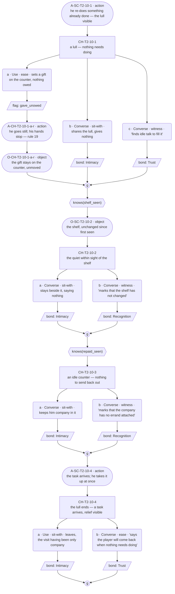
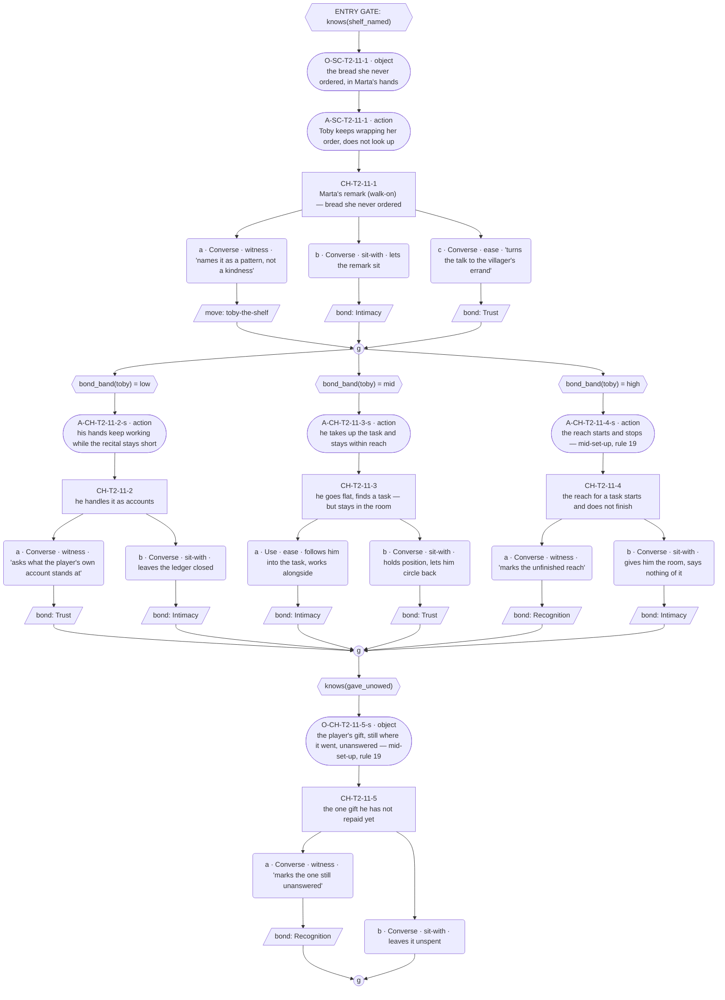

# `toby-the-shelf` — v01

**This life only.** Toby is dealt Baker this run, so the staging below is jars and orders. The thread's identity — id, open question, the card field it reveals — is ratified in `cast/toby.md`. Everything here is the Baker instance and does not survive a reshuffle.

**Open question:** What does he do with what he is given?

**Status:** Architect brief complete. **Choice designer complete** — four conversations, shapes approved by Roc 2026-08-06, action layer added the same day. **Lines complete** — all four conversations authored, gated 2026-08-07, C2 and C4 hand-edited by Roc 2026-08-08 (`narrative-pipeline/register.md` §"Five moves"), imported into `data/scene-graph.json` and emitted into `lantern-projects/v01/ink/souls/toby.ink` with zero placeholder rows. `tools/line-lint.mjs` clean. *(Status line corrected 2026-08-12 — it had gone stale after the Lines pass landed.)*

---

## Thread shape

Three reveals across **four conversations**.

| # | Reveal | Fact | Card field | Staged this life as |
|---|---|---|---|---|
| R1 | The shelf exists | cast | `conviction` | A shelf of jars behind the counter, none opened |
| R2 | The trade — a gift went back out as goods he made, unmentioned | cast | `conviction` · `warmth_channel` | Two rolls added to the giver's next order, unbilled |
| R3 | Someone else has been repaid the same way | re-touch of R2, no new cast fact | `notice_and_want` from outside | Another villager mentions bread she never ordered |

**Conversation allocation** — the Architect's call, and the constraint the Choice designer works inside:

| Conversation | Scene id | Carries |
|---|---|---|
| C1 | `SC-T2-08` | R1 |
| C2 | `SC-T2-09` | R2 |
| C3 | `SC-T2-10` | Nothing — quiet beat, no fact slots |
| C4 | `SC-T2-11` | R3 |

C3 carries no reveal on purpose. `delta_rule` sanctions the quiet beat as "the breathing room later recognition needs, never a gap to fill." It is exempt from the delta floor and still bound by the ceiling.

---

## What happens across the thread

He keeps what he is given and cannot let it stay given. First you see the jars. Then you see one leave — not opened, not eaten, converted into something he made and sent back out, unmentioned. Then someone who is not you says the same thing happened to them, which makes it a pattern rather than a kindness.

**Where it leaves off on day 5: open.** The furthest this thread travels alone is *the player has named the shelf to his face and he has not repaid that one yet.* It does not close. `toby-unopened-jam` pays off only when the player has given him something with nothing owed **and** named the shelf back to him, and per R7 the echo is cross-soul and belongs to the seam pass. The last state is a held breath.

**The thread's job ends at making that state reachable.** *(Confirmed by ruling, 2026-08-06.)* The echo's payoff was proposed as a fifth conversation and **Roc declined it: the payoff lives in the shared festival scene with Ilsa** (`GP-113`). Per R7 an echo may be paid off by a different soul than the one who planted it, which makes it cross-soul and the seam pass's work, not this thread's. `toby_repays_every_gift` is set there, from `shelf_named` + `gave_unowed`. **Nothing in these four conversations may try to fire the echo or close the thread.** The held breath is the correct ending.

---

## Dependency order

    C1 (R1) ──> C2 (R2) ──> C3 (quiet) ──> C4 (R3)

- **C1 needs nothing.** Zero-knowledge entry. It must work as the player's first contact with Toby this week — no sibling thread, no prior scene.
- **C2 needs `shelf_seen`.** The trade only reads as a repay-reflex if the jars are known to be unopened. Reached cold it is a baker giving away rolls.
- **C3 needs C2 complete.**
- **C4 needs `shelf_named`.** A third party's remark only lands once the player has named the pattern to Toby's face. Reached cold it is small talk.

### Flags

| Flag | Set by | Read by |
|---|---|---|
| `shelf_seen` | C1, or the `ex-shelf` examinable **(PROPOSED — does not exist yet)** | C2, C3 |
| `repaid_seen` | C2 | C3 |
| `shelf_named` | C2 | C4 |
| `gave_unowed` | C3 | C4 |

**Every flag has a reader.** `shelf_named` is written by v01's `CH-T2-07-5` and read by nothing today — the write-only flag step 3 exists to catch. Here C4's entry gate reads it. **No flag may be added without a reader.**

### Facts read per conversation

C1 reads none · C2 reads one · C3 reads two · C4 reads two. R6's ceiling is two.

---

## Constraints on the conversation design

- **Entry gate is the previous conversation in this thread completing. Nothing else.** Completion gates the sequence; knowledge gates the content (R3).
- **Every incoming state must walk without dead-ending.** Two facts read means four states.
- **One state is always the fallback** — "you finished the last conversation and learned nothing from it." It is a real state a real player reaches.
- **A missed fact makes the thread shallower, never rerouted** (R5). The shallow path still delivers something.
- **Missed things stay in the world.** If a path is closed, name the examinable that reopens it.

> **`ex-shelf` is PROPOSED, not wired.** An earlier draft of this brief claimed it already existed on T2. It does not. `tools/resolver/data/screen-specs.json` gives T2 exactly one examinable — `stall_goods` (`clue_tier: soft-signpost`, `region: r_stall_goods`). Every reference to `ex-shelf` below is a proposal for downstream to wire, and **no pickup path in this thread works until it is built.** Proposing examinables is legitimate and part of the writing pass (Roc, 2026-08-04); asserting one exists is not. Recording proposed examinables has no home in the GDD or pipeline docs yet — reconciliation item, `GP-110`.
- **Options are equal weight.** No option is the correct answer; no counter keys off repetition (guardrail 10, `guardrails.md` check 2).
- **Bond weights:** Recognition 3, Trust 2, Intimacy 2. The deep path records Recognition, the shallow path records Intimacy or nothing.
- **No `thread_move` in C3.** A quiet beat that moves the thread is not quiet.

### Pacing

A thread may be entered **once per time slot**; the day's opening slot belongs to the festival arc; later slots allow multiple threads (GP-93). The shelf can advance about twice a day, so these four fit in two days minimum.

**Nothing here may assume which slots, which days, or how much clock separates them.** A player may take all four across two days or spread them over five.

**RULED 2026-08-06 — a quiet beat costs a full time block.** It is part of a thread, so it should feel costly (Roc). **C3 stays a standalone conversation and stays expensive on purpose.** Roughly half a day of Toby's cast-thread capacity buys no reveal and no thread move — what it buys is the only place the player can give him something with nothing owed, which is one of the two preconditions the echo needs. Breathing room is not free, and a thread cannot be padded with quiet beats.

### Id conventions

Choice nodes `CH-T2-08-1`, `-2`, … · options `-a`, `-b` · player line `L-CH-T2-08-1-a-p` · response `L-CH-T2-08-1-a-r1`.

v01's `SC-T2-07` carries shelf, flask and feast beats in one scene — the mixed-thread defect. It is left untouched, not re-scoped. These are new ids.

### Proposed examinables

**Not built. Downstream wires these into `tools/resolver/data/screen-specs.json`; until then the pickup paths naming them do not work.**

| id | Screen | Sets | Reopens |
|---|---|---|---|
| `ex-shelf` | T2 | `shelf_seen` | C1's closed path — a player who never asks about the jars. It is also the only route back to C2's naming node **and only while C2 is still unplayed** — see below |

T2's only wired examinable today is `stall_goods` (`clue_tier: soft-signpost`, `region: r_stall_goods`).

**`repaid_seen` and `gave_unowed` are deliberately not given pickups.** Missing the trade makes C3 and C4 shallower, which is R5 working as intended, and `gave_unowed` is a player act rather than a thing in the world — an examinable cannot hand someone a gift they chose not to give.

**`ex-shelf` is load-bearing.** It is the only pickup in the thread, and without it a player who does not ask about the jars in C1 can never reach C4. Building it is not cosmetic.

---

## Conversations

**For the Choice designer.** One section per conversation, each with a content block and a mermaid node graph. **Roc approves the shape before any prose is written.**

The content block says what is open, what is closed and what he reveals, per incoming state. The graph shows the choice nodes, their gates, the options and where each rejoins.

**Action-slot convention (added 2026-08-06 — contract rules 18–21).** Description beats — `action` and `object` slots — are drawn as **stadium** shapes, a shape no prior meaning claims: `AS1(["A-SC-T2-08-2 · action structural gist"])`. The label carries the slot id, the slot type, and a structural gist; Lines writes the words, per the register's action-note rules (name the actor and the thing, no interiority, handling verbs). A stadium on a spine edge is a scene-level beat between nodes; a stadium inside an option branch belongs to that option's response run; a stadium on a node's entry edge marked `-s` interleaves with that node's set-up — the graph shows its presence and coarse position, and the content block states the fragment → action → fragment interleave (rule 19). Ids: `A-` (action) or `O-` (object) plus the scene or choice id, suffixed `-s` (set-up interleave) or `-r` (response run).

### C1 — `SC-T2-08`

**Carries R1. Reads no prior facts — one incoming state (zero knowledge). Must work as first contact with Toby this week. 6 choice nodes (5 top-level + 1 nested). Variety devices: a three-option node; nesting to depth 1. Action layer (added 2026-08-06, rules 18–21): 5 description slots (3 `action`, 2 `object`) against ~15 dialogue slots on the deep walk — ratio ≈ 1:3.**

**Content block.**

- **Incoming state: zero knowledge (the only state).** The shelf of unopened jars is staged as scene business behind the counter — present and visible whatever the player picks. Toby is mid-order; the counter work is the cover R1 arrives under. Everything before the gate is open to everyone; only node 4 and its child are conditional, and both condition on knowledge set inside this same conversation, so no prior fact is read.
- **Node 1 (`CH-T2-08-1`, ungated, three options).** First contact. Ask about the jar shelf (spoken — sets `shelf_seen`, moves the thread), step in on the order at hand (deed — records Intimacy, shared work), or plain talk about the order (spoken — records nothing). The no-record option is deliberate and is one of this thread's two: plain first contact is the zero-commitment cover, and attaching a record to small talk would make even the neutral pick score. Equal weight: asking turns attention on him, which his card deflects; helping and small talk respect the surface and cost the same beat.
- **Node 2 (`CH-T2-08-2`, ungated).** The order work continues. Fetch the next tray before he asks for it (deed — records Intimacy) or ask who the order is for (spoken — records Trust; his answer carries the exact-about-everyone-else texture, `precision_profile`, as reference, not a slot). Both record, differing in kind.
- **Node 3 (`CH-T2-08-3`, ungated).** The thing the player was about to need is already set out — `warmth_channel` staged as business, referenced, not a fact slot. Name that it was already there (spoken — records Trust) or take it and keep the counter moving (deed — records Intimacy). Both record; naming turns attention on him, taking it leaves the habit unremarked.
- **Node 4 (`CH-T2-08-4`, gated `knows(shelf_seen)`).** Opens only if the jars were asked about in node 1. The acknowledged shelf turns attention on him: he goes flat, reaches for an unfinished task (`deflection_target`, warmth intact). Note that none of the jars are opened (spoken — records Recognition, the deep read) or turn back to the order with him (deed — records Intimacy, handing him his cover). If the gate is false the node auto-skips to its gather; the scene continues at node 5 either way.
  - **Nested child (`CH-T2-08-4-a-1`, inside option `-a`).** Noting the unopened jars lands, and mid-deflection he supplies the player something anyway — the repay-reflex firing in miniature. Name that he has just done it again (spoken — moves the thread) or take it without comment (deed — records Intimacy). **Why nesting and not a flag-gate:** this beat belongs only inside the naming option; a flag-gated sibling would print its set-up to players who never named the jars, and every non-naming player would walk past a silent skip.
- **Node 5 (`CH-T2-08-5`, ungated).** Leave-taking. Offer to carry the order out (deed — records Trust) or ask him to keep something back for the player's next visit (spoken — records Intimacy; it lets him give, which his card says he can always do). Both record.
- **Closed path.** A player who never asks about the jars leaves without `shelf_seen`: node 4 and its child never open. The shelf stays in the world — the proposed `ex-shelf` examinable (T2 hub, sticky, repeatable **once built**) would set `shelf_seen` later. The shallow run still delivers first contact, the staging, and three full beats.
- **Action slots (rule 18).** Five description beats, typed and placed; Lines writes them:
  - `O-SC-T2-08-1` (`object`, scene opening, before node 1) — the jar shelf behind the counter, none opened. R1's surface arrives as a thing seen before anyone speaks, so node 1's ask-option points at something the player has already looked at.
  - `A-SC-T2-08-2` (`action`, spine, node-1 gather → node 2) — the order work as a deed: he moves the work along with his hands. Shared-work texture carried by the picture, not a line.
  - `O-SC-T2-08-3` (`object`, spine, node-2 gather → node 3) — the needed thing, already set out. `warmth_channel` staged as an object the player sees before either option names it.
  - `A-CH-T2-08-4-s` (`action`, inside node 4's set-up) — he reaches for an unfinished task. Part of the rule-19 build below.
  - `A-CH-T2-08-4-a-1-s` (`action`, the nested child's set-up — retyped from dialogue) — mid-deflection he sets something in front of the player. The repay-reflex is an act he performs and does not mention, which a spoken slot cannot carry at all (guardrail check 8); the child's set-up **is** this action slot, and its `#choice:` rides the first option line per the schema.
- **Rule-19 build — node 4, the weight beat this conversation carries.** The shelf acknowledged is what the scene exists for, and its set-up is built fragment → action → fragment: a short dialogue fragment (he goes flat) → `A-CH-T2-08-4-s` (the reach for the task) → a shorter fragment. The silence between the fragments is the action slot; the weight never moves into a longer line.
- **No sanctioned long run (rule 20).** Nothing here is exposition, instruction, or a confession answering a question — and Toby's card binds the 40-word ceiling absolutely (`canon_flags` 8), so a marked run would contradict the card (rule 12). None placed.
- **Walk-ons (rule 21).** None in this conversation.

```mermaid
flowchart TD
  OS1(["O-SC-T2-08-1 · object<br>the jar shelf behind the counter, none opened"])
  OS1 --> N1["CH-T2-08-1<br>first contact — counter mid-order, jar shelf in view"]
  N1 --> N1a("a · Converse · witness · 'asks about the shelf of jars'")
  N1 --> N1b("b · Use · ease · steps in on the order at hand")
  N1 --> N1c("c · Converse · witness · 'talks about the order'")
  N1a --> R1a[/"flag: shelf_seen<br>move: toby-the-shelf"/]
  R1a --> J1(("g"))
  N1b --> R1b[/"bond: Intimacy"/]
  R1b --> J1
  N1c --> J1
  J1 --> AS2(["A-SC-T2-08-2 · action<br>he moves the order work along with his hands"])
  AS2 --> N2["CH-T2-08-2<br>the order work continues"]
  N2 --> N2a("a · Use · ease · fetches the next tray before he asks")
  N2 --> N2b("b · Converse · witness · 'asks who the order is for'")
  N2a --> R2a[/"bond: Intimacy"/]
  R2a --> J2(("g"))
  N2b --> R2b[/"bond: Trust"/]
  R2b --> J2
  J2 --> OS3(["O-SC-T2-08-3 · object<br>the needed thing, already set out"])
  OS3 --> N3["CH-T2-08-3<br>the needed thing is already set out"]
  N3 --> N3a("a · Converse · witness · 'names that it was already there'")
  N3 --> N3b("b · Collect · ease · takes it and keeps the counter moving")
  N3a --> R3a[/"bond: Trust"/]
  R3a --> J3(("g"))
  N3b --> R3b[/"bond: Intimacy"/]
  R3b --> J3
  J3 --> G4{{"knows(shelf_seen)"}}
  G4 --> AS4(["A-CH-T2-08-4-s · action<br>he reaches for an unfinished task — mid-set-up, rule 19"])
  AS4 --> N4["CH-T2-08-4<br>the shelf acknowledged — he goes flat, reaches for a task"]
  N4 --> N4a("a · Converse · witness · 'notes that none of the jars are opened'")
  N4 --> N4b("b · Use · ease · turns back to the order with him")
  N4a --> R4a[/"bond: Recognition"/]
  subgraph S4a["CH-T2-08-4-a"]
    AS5(["A-CH-T2-08-4-a-1-s · action<br>he sets something in front of the player — the child's set-up"])
    AS5 --> C1["CH-T2-08-4-a-1<br>mid-deflection he supplies the player something anyway"]
    C1 --> C1a("a · Converse · witness · 'names that he has just done it again'")
    C1 --> C1b("b · Collect · sit-with · takes it without comment")
    C1a --> RC1a[/"move: toby-the-shelf"/]
    RC1a --> JC(("g_CH-T2-08-4-a"))
    C1b --> RC1b[/"bond: Intimacy"/]
    RC1b --> JC
  end
  R4a --> AS5
  JC --> J4(("g"))
  N4b --> R4b[/"bond: Intimacy"/]
  R4b --> J4
  J4 --> N5["CH-T2-08-5<br>leave-taking"]
  N5 --> N5a("a · Collect · ease · offers to carry the order out")
  N5 --> N5b("b · Converse · ease · 'asks him to keep something back for next visit'")
  N5a --> R5a[/"bond: Trust"/]
  R5a --> J5(("g"))
  N5b --> R5b[/"bond: Intimacy"/]
  R5b --> J5
```

### C2 — `SC-T2-09`

**Carries R2. Reads one prior fact: `shelf_seen`. Two incoming states. 7 choice nodes (6 top-level + 1 nested). Variety devices: nesting to depth 1; a `rejoin: divert`. Action layer (added 2026-08-06, rules 18–21): 6 description slots (4 `action`, 2 `object`) against ~17 dialogue slots on the full non-divert walk — ratio ≈ 1:3; the diverted walk runs denser (5 against ~11, ≈ 1:2.2), which is right for the collapsed visit.**

**Content block.**

- **Scene business, both states.** A giver's order is being packed with two extra rolls, unbilled. The trade is staged and visible whoever walks in — R2's surface is delivered by the situation, not by a pick.
- **Node 1 (`CH-T2-09-1`, ungated).** Arrival, the order half-packed. Help pack it (deed — records Intimacy, shared work) or ask whose order it is (spoken — records Trust; his answer carries the household's needs exactly, `precision_profile` as reference). Both record.
- **Node 2 (`CH-T2-09-2`, ungated).** The two extra rolls go in, unbilled, in front of the player. Ask about them (spoken — sets `repaid_seen`, moves the thread) or keep packing and let them pass (deed — records Intimacy). Reached cold, asking reads as a baker giving away rolls — exactly what the Architect specifies — and it still counts as having seen someone repaid.
  - **Nested child (`CH-T2-09-2-a-1`, inside option `-a`).** Asked about the rolls, he labels them routine — the gift mislabeled so no thanks can attach (`warmth_channel`'s foreclosure move). Let the label stand (deed — records Intimacy) or press what the giver did to earn them (spoken — records Trust; he has no ledger entry to point at). **Why nesting and not a flag-gate:** the label beat only exists as an answer to being asked; a flag-gated sibling would print its framing to players who never asked, and everyone else would take a silent skip through it.
- **Node 3 (`CH-T2-09-3`, gated `knows(shelf_seen)`).** The trade connects to the shelf. Name the pattern to his face — the shelf, the gift, the rolls, one motion (spoken — sets `shelf_named`, records Recognition, moves the thread, **and diverts to node 6**: naming it collapses the visit; he goes flat and finds a task, and the scene jumps past the counter work straight to the leave-taking) — or hold the connection unspoken (deed — records Intimacy; the moment passes within this conversation). If the gate is false the node auto-skips.
  > **APPROVED BY ROC 2026-08-06 (divert, schema-required flag now discharged):** `CH-T2-09-3-a` is `rejoin: divert → CH-T2-09-6`. Considered against the alternative — naming rejoins normally and nodes 4 and 5 carry `not knows(shelf_named)` so they simply do not appear — and the divert was kept. Rationale: after the pattern is named, beats 4 and 5 are counter-business his flat state cannot carry; skipping them is the structure honoring the card rather than a punishment — the diverted player still reaches the close, and the records on the naming option are the conversation's deepest.
- **Node 4 (`CH-T2-09-4`, ungated — non-divert path only).** The counter goes on. Ask whether the giver knows what came back to her (spoken — records Trust; he deflects to the order) or stack the finished order for pickup (deed — records Intimacy). Both record.
- **Node 5 (`CH-T2-09-5`, ungated — non-divert path only).** The packed order goes to the shelf by the door, next to tomorrow's. Reference beat, no new information: mark how many of tomorrow's orders carry something extra (spoken — records Trust) or set the last parcel with it (deed — records Intimacy). Keeps the trade legible without re-spending R2.
- **Node 6 (`CH-T2-09-6`, ungated — gather point and divert target).** Leave-taking; on the diverted path he is mid-task, flat, warmth intact. Let him have the task (deed — records Intimacy) or mark that the errand appeared the moment the talk did (spoken — records Recognition, `deflection_target` seen for what it is). Both record.
- **Incoming state: `shelf_seen` (deep).** Nodes 1–6 all reachable; node 3 is where the conversation earns its reveal-adjacent depth and the only place `shelf_named` can be set.
- **Incoming state: fallback (finished C1, learned nothing).** Node 3 auto-skips; the walk is 1 → 2 (with child) → 4 → 5 → 6 — five full beats, `repaid_seen` still settable. Shallower, not rerouted.
- **Closed paths.** Missed `shelf_seen`: the proposed `ex-shelf` (T2, sticky, repeatable once built) would reopen it — but C2 does not replay, so `shelf_named` cannot be set after this conversation completes; see the standing flag below. Missed `repaid_seen` (never asked at node 2): no examinable is wired to reopen it in the brief; C3 runs shallower per R5.
- **Equal weight.** Asking about the rolls turns talk toward what he did (against his grain); packing respects the work. Naming the pattern is an intrusion his card deflects and it costs the player the rest of the counter visit (the divert); letting it pass leaves him his cover and keeps the fuller scene. Records differ in kind, never rank.
- **Action slots (rule 18).** Six description beats:
  - `O-SC-T2-09-1` (`object`, scene opening, before node 1) — the half-packed order on the counter. The scene's business as a thing seen first.
  - `A-SC-T2-09-2` (`action`, spine, node-1 gather → node 2) — the two extra rolls go in, unbilled. R2's surface is a deed the player watches, so it is typed as one; node 2's ask-option points at this slot rather than at narration.
  - `A-CH-T2-09-2-a-1-r` (`action`, inside the nested child, option `-b`'s response run) — pressed for what the giver did to earn the rolls, his hands keep packing; he has no ledger to open, and the non-answer is shown rather than said.
  - `A-CH-T2-09-3-a-r` (`action`, inside node 3 option `-a`'s response run, before the divert) — part of the rule-19 build below.
  - `O-SC-T2-09-5` (`object`, spine, node-4 gather → node 5) — tomorrow's orders by the door, more than one carrying something extra. Node 5's reference beat gets a referent the player can see.
  - `A-CH-T2-09-6-s` (`action`, node 6's set-up, diverted entry only) — he is mid-task when the player reaches him. The non-divert entry arrives at node 6 without it.
- **Rule-19 build — node 3 option `-a`, the naming of the pattern (the thread's central beat).** Built fragment → action → fragment: the player's line (its own ≤12-word fragment) → a short response fragment → `A-CH-T2-09-3-a-r` (he goes still; then the task appears in his hands — the pivot the divert rides) → the shortest response fragment, then the divert. The action slot is what the collapse of the visit looks like; the weight is never given a longer line.
- **No sanctioned long run (rule 20).** Nothing here qualifies, and Toby's card binds the 40-word ceiling absolutely (`canon_flags` 8) — a marked run would contradict the card (rule 12). None placed.
- **Walk-ons (rule 21).** None in this conversation; the giver whose order is packed never appears.

```mermaid
flowchart TD
  OS1(["O-SC-T2-09-1 · object<br>the half-packed order on the counter"])
  OS1 --> N1["CH-T2-09-1<br>arrival — an order half-packed"]
  N1 --> N1a("a · Collect · ease · helps pack the order")
  N1 --> N1b("b · Converse · witness · 'asks whose order it is'")
  N1a --> R1a[/"bond: Intimacy"/]
  R1a --> J1(("g"))
  N1b --> R1b[/"bond: Trust"/]
  R1b --> J1
  J1 --> AS2(["A-SC-T2-09-2 · action<br>the two extra rolls go in, unbilled"])
  AS2 --> N2["CH-T2-09-2<br>two extra rolls go in, unbilled"]
  N2 --> N2a("a · Converse · witness · 'asks about the extra rolls'")
  N2 --> N2b("b · Collect · sit-with · keeps packing, lets them pass")
  N2a --> R2a[/"flag: repaid_seen<br>move: toby-the-shelf"/]
  subgraph S2a["CH-T2-09-2-a"]
    C2["CH-T2-09-2-a-1<br>he labels the rolls routine — the gift mislabeled"]
    C2 --> C2a("a · Converse · sit-with · lets the label stand")
    C2 --> C2b("b · Converse · witness · 'presses what the giver did to earn them'")
    C2a --> RC2a[/"bond: Intimacy"/]
    RC2a --> JC2(("g_CH-T2-09-2-a"))
    C2b --> RC2b[/"bond: Trust"/]
    RC2b --> ASC(["A-CH-T2-09-2-a-1-r · action<br>his hands keep packing — no ledger to open"])
    ASC --> JC2
  end
  R2a --> C2
  JC2 --> J2(("g"))
  N2b --> R2b[/"bond: Intimacy"/]
  R2b --> J2
  J2 --> G3{{"knows(shelf_seen)"}}
  G3 --> N3["CH-T2-09-3<br>the trade connects to the shelf"]
  N3 --> N3a("a · Converse · witness · 'names the pattern to his face'")
  N3 --> N3b("b · Converse · sit-with · holds the connection unspoken")
  N3a --> R3a[/"flag: shelf_named<br>bond: Recognition<br>move: toby-the-shelf"/]
  R3a --> AS3(["A-CH-T2-09-3-a-r · action<br>he goes still; the task appears in his hands — rule 19"])
  AS3 --> D3>"divert → CH-T2-09-6"]
  N3b --> R3b[/"bond: Intimacy"/]
  R3b --> J3(("g"))
  J3 --> N4["CH-T2-09-4<br>the counter goes on"]
  N4 --> N4a("a · Converse · witness · 'asks whether the giver knows'")
  N4 --> N4b("b · Collect · ease · stacks the finished order for pickup")
  N4a --> R4a[/"bond: Trust"/]
  R4a --> J4(("g"))
  N4b --> R4b[/"bond: Intimacy"/]
  R4b --> J4
  J4 --> OS5(["O-SC-T2-09-5 · object<br>tomorrow's orders by the door, more than one carrying extra"])
  OS5 --> N5["CH-T2-09-5<br>the order joins tomorrow's by the door"]
  N5 --> N5a("a · Converse · witness · 'marks how many orders carry something extra'")
  N5 --> N5b("b · Use · sit-with · sets the last parcel with it")
  N5a --> R5a[/"bond: Trust"/]
  R5a --> J5(("g"))
  N5b --> R5b[/"bond: Intimacy"/]
  R5b --> J5
  J5 --> N6["CH-T2-09-6<br>leave-taking — divert target"]
  D3 --> AS6(["A-CH-T2-09-6-s · action<br>he is mid-task when the player reaches him — diverted entry only"])
  AS6 --> N6
  N6 --> N6a("a · Use · sit-with · leaves him to the task he found")
  N6 --> N6b("b · Converse · witness · 'marks that the errand appeared with the talk'")
  N6a --> R6a[/"bond: Intimacy"/]
  R6a --> J6(("g"))
  N6b --> R6b[/"bond: Recognition"/]
  R6b --> J6
```

> **Flagged to Roc (not fixed here):** if the player completes C2 without `shelf_seen`, **node 3** — the node gated on `shelf_seen`, not node 2, which is ungated and sets `repaid_seen` — never opens, and `shelf_named` can never be set. C2 does not replay, so building `ex-shelf` only helps a player who examines it **before finishing C2**. After that, C4's entry gate is closed permanently and **R3 is lost rather than shallowed**, which is what R5 forbids. That is the fall-off-the-thread-untold shape. Architect call, not this seat's. *(Node reference corrected and the `ex-shelf` timing qualified 2026-08-06, after QA found the brief contradicting itself between this note and the Proposed examinables table.)*

### C3 — `SC-T2-10`

**Quiet beat. No reveal, no fact slots, no `thread_move`. Reads two prior facts: `shelf_seen`, `repaid_seen` — four incoming states. The only place the player can give Toby something with nothing owed on it. 4 choice nodes — the low end of the range, sized down on purpose for the quiet beat, not exempt from it. Variety device: a three-option node; the two knowledge gates are split rather than conjoined, so the two mid states are structurally distinct, not fallback-identical. Action layer (added 2026-08-06, rules 18–21): 5 description slots (3 `action`, 2 `object`) against ~11 dialogue slots on the deep walk — ratio ≈ 1:2.2, deliberately at the Ghibli end of the band (1:2.6): the quiet beat is the one conversation whose whole job is silence, and a silence is made of description.**

**Content block.**

- **All four states.** A lull — nothing needs doing, which his card says he cannot sit inside comfortably (`toby-nothing-needs-doing` texture, referenced, no slot). Nodes 1 and 4 are open to everyone; nodes 2 and 3 each read one fact, so the four incoming states walk as: fallback 1→4, `shelf_seen` only 1→2→4, `repaid_seen` only 1→3→4, both 1→2→3→4. No `thread_move` anywhere in this conversation; `gave_unowed` is set-once knowledge, not a fact slot and not a tally.
- **Node 1 (`CH-T2-10-1`, ungated, three options).** The standing option to give, open even to a zero-knowledge player. Set something of the player's own on the counter with nothing owed on it (deed — sets `gave_unowed`; his beat is receiving-flat, warmth intact, and the thing is not repaid within the scene, which is the state C4 and the echo need), share the lull and give nothing (deed — records Intimacy), or find idle talk to fill it (spoken — records Trust; talk gives him footing). The gift records knowledge and no bond on purpose: a gift that scored would make giving the correct answer, and his card makes a gift a load. Equal weight: all three cost the beat; empty hands respect his discomfort as much as the gift tests it. Options differ in kind — flag vs Intimacy vs Trust — never rank.
- **Node 2 (`CH-T2-10-2`, gated `knows(shelf_seen)`).** The lull happens within sight of the shelf, and he catches the player's eye resting on it. Stay beside it without saying anything (deed — records Intimacy; the knowledge sits shared and unspoken) or mark that the shelf has not changed since it was first seen (spoken — records Recognition). Reference, not delta; nothing new passes.
- **Node 3 (`CH-T2-10-3`, gated `knows(repaid_seen)`).** Knowing what leaves the counter unbilled, the player can read the idle counter differently: nothing is being converted right now, and he has nothing to send back out. Keep him company inside exactly that (deed — records Intimacy) or quietly mark that the company has no errand attached (spoken — records Recognition). For the both-flags player this lands after node 2 and completes the pattern-in-the-quiet; for the `repaid_seen`-only player it is the one deep beat.
- **Node 4 (`CH-T2-10-4`, ungated).** The lull ends — a task finally arrives and the relief is visible. Leave, letting the visit have been nothing but company (deed — records Intimacy) or tell him the player will come back when nothing needs doing again (spoken — records Trust). Both record; the fallback player exits through real content, not an apology.
- **Closed paths.** Node 2 reopens later via `ex-shelf` setting `shelf_seen`; `repaid_seen` has no wired examinable (standing note under C2), so node 3 missed is missed for this run per R5.
- **Action slots (rule 18).** Five description beats:
  - `A-SC-T2-10-1` (`action`, scene opening, before node 1) — he re-does something already done. The lull made visible as observable behavior — the `toby-nothing-needs-doing` texture shown, never stated (no interiority, per the register's action-note rules).
  - `A-CH-T2-10-1-a-r` (`action`, inside node 1 option `-a`'s response run) — he goes still; his hands stop. Part of the rule-19 build below.
  - `O-CH-T2-10-1-a-r` (`object`, same response run) — the gift stays on the counter where it was put: not moved to the shelf, not repaid within the scene — exactly the state C4 and the echo need, and the beat is a thing rather than a deed, so the slot is `object`.
  - `O-SC-T2-10-2` (`object`, node 2's premise, gate → node 2) — the shelf, unchanged since it was first seen. Node 2's spoken option points at this slot.
  - `A-SC-T2-10-4` (`action`, node 4's set-up) — the task arrives and he takes it up at once; the relief is shown as speed, never named.
- **Rule-19 build — node 1 option `-a`, the gift (`gave_unowed`, the beat the thread's held breath depends on).** Built deed → fragment → action → object: the surface_action (the gift set down) → a short receiving dialogue fragment (receiving-flat, warmth intact) → `A-CH-T2-10-1-a-r` (the stillness) → `O-CH-T2-10-1-a-r` (the gift, unmoved). The run may end on the object slot with no further line — a response slot may be non-dialogue (schema ruling 1, 2026-08-06) — and the receiving-pair floor of two response slots is met by the run as a whole. No longer line anywhere carries this beat.
- **No sanctioned long run (rule 20).** A quiet beat is the last place one belongs — a marked run carries information and this scene carries none by design; Toby's card also binds the 40-word ceiling absolutely. None placed.
- **Walk-ons (rule 21).** None in this conversation.

### C4 — `SC-T2-11`

**Carries R3. Entry additionally gated on `shelf_named` per the Architect's dependency order. Reads two facts: `shelf_named` (at entry) and `gave_unowed`. 5 choice nodes. Variety devices: bond-band variants (a non-`knows` predicate) — the same beat authored three ways, `SC-T7-toby` style; a three-option node. Action layer (added 2026-08-06, rules 18–21): 6 description slots authored (4 `action`, 2 `object`); any single walk sees 4 (one band node plays) against ~10 dialogue slots — ratio ≈ 1:2.5, dense on purpose: two of the four are the thread's two heaviest beats. Walk-on named: Marta.**

**Content block.**

- **Reachable states — two of four.** Because the Architect gates entry on `shelf_named`, the two `¬shelf_named` states never arrive: no content is authored for them, and this is deliberate, not an oversight. A player without `shelf_named` ends the thread at C3. (`shelf_named` has no pickup examinable, so that closure is permanent — flagged under C2 and in the return summary; entry-gating on knowledge also sits in tension with R3, which is the Architect's to resolve, not this seat's.)
- **Scene business, both reachable states.** Another villager mentions bread she never ordered. R3 is delivered by the situation itself; every pick below is what the player does with it, so the fallback state loses nothing of the reveal.
- **Walk-on named (rule 21): Marta.** Walk-on codex class — business only, no card, no thread, no facts. Lines writes her in the **walk-on band** (register; guardrail check 6, added 2026-08-06): looser and warmer than the carded souls' baseline. She has nothing to hide — no `deflection_target`, no `conviction` — so nothing about her remark is clipped, deflecting, or guarded; it is easy small talk that happens to land on the pattern. Writing her in Toby's register is the named defect this rule exists to prevent.
- **Node 1 (`CH-T2-11-1`, ungated within the scene, three options).** After the remark, with Toby: name it as a pattern — not a kindness to one person but what he does with everything he is given (spoken — moves the thread), let the remark sit unanswered (deed — records Intimacy), or turn the talk to the villager's errand (spoken — records Trust; it hands him the deflection he wants and he takes it gratefully). Equal weight: pressing the pattern turns attention on him at cost to his footing; the other two leave him his cover and spend the same beat. Records differ in kind — thread move vs Intimacy vs Trust — never rank.
- **Nodes 2–4 (`CH-T2-11-2/-3/-4`, sibling gated nodes, one per `bond_band(toby)` band — exactly one is true, so exactly one plays).** The same beat authored three ways: what he does now the pattern is public, per how far the bond has come. Bond bands are schema predicate vocabulary, not knowledge flags, so this reads no additional fact.
  - **Low (`-2`, `bond_band(toby) = low`).** He handles it as accounts — recites what the villager's basket had covered, keeping it transactional-shaped while the warmth stays intact underneath. Ask what the player's own account stands at (spoken — records Trust; he has no answer ready, the `precision_profile` vague half surfacing) or leave the ledger closed (deed — records Intimacy).
  - **Mid (`-3`, `bond_band(toby) = mid`).** He goes flat and finds a task — but stays in the room with it, working within reach instead of leaving. Follow him into the task and work alongside (deed — records Intimacy) or hold position and let him circle back on his own (deed — records Trust).
  - **High (`-4`, `bond_band(toby) = high`).** The reach for a task starts and does not finish — the held reach, in front of the player, for the first time with a witness. Mark the unfinished reach (spoken — records Recognition, the deepest read in the conversation) or give him the room and say nothing of it (deed — records Intimacy).
- **Node 5 (`CH-T2-11-5`, gated `knows(gave_unowed)`).** The one gift he has not repaid yet stands between them. Mark it — theirs is the one still on the shelf, unanswered (spoken — records Recognition) — or leave it unspent (deed — records nothing). The silence is this thread's second and last deliberate no-record option, and it is right here because the held breath **is** the content: the brief ends the thread on an unclosed state, and a record on leaving-it-unspent would cash the breath the seam pass needs intact. Either way the conversation ends open: he has not repaid it, nothing closes. The payoff is cross-soul seam-pass work (R7) and is not reached for here.
- **Incoming state: `shelf_named` and `gave_unowed` (deep).** Walk: 1 → one band node → 5. Ends on the held breath.
- **Incoming state: fallback (`shelf_named`, finished C3 without giving).** Node 5 auto-skips. The conversation still delivers R3 in full — the pattern made public — plus the band beat, and ends on the same open note. Shallower, not rerouted.
- **Closed path.** `gave_unowed` can only be set in C3, which does not replay; there is no wired examinable for it — the brief's table names none — noted in the return summary.
- **Action slots (rule 18).** Six authored; any walk sees four (one band node plays):
  - `O-SC-T2-11-1` (`object`, scene opening) — the bread she never ordered, in Marta's hands. R3's surface as a thing shown before it is spoken about.
  - `A-SC-T2-11-1` (`action`, between Marta's remark and node 1) — through the remark, Toby keeps wrapping her order and does not look up. `deflection_target` observable, never narrated.
  - `A-CH-T2-11-2-s` (`action`, low band, inside node 2's set-up) — his hands keep working the counter while the recital stays transactional-shaped. This is also what keeps the recital *out* of long-run territory: short pieces divided by a handling beat, not one run (see rule 20 below).
  - `A-CH-T2-11-3-s` (`action`, mid band, inside node 3's set-up) — he takes up the task and stays within reach. The staying is the beat, and it is shown.
  - `A-CH-T2-11-4-s` (`action`, high band, node 4's set-up) — the reach that starts and does not finish. An act he performs and does not mention, which no spoken slot can carry (check 8). Part of the rule-19 build below.
  - `O-CH-T2-11-5-s` (`object`, inside node 5's set-up) — the player's gift, still where it went, unanswered. The held breath is a thing, so the slot is `object`. Part of the rule-19 build below.
- **Rule-19 builds — the two beats the thread exists for.**
  - **High band, node 4:** short dialogue fragment → `A-CH-T2-11-4-s` (the reach starts and stops) → shorter fragment. The unfinished reach is the silence; no longer line carries it.
  - **Node 5, the unrepaid gift:** short fragment → `O-CH-T2-11-5-s` (the gift, unanswered) → shortest fragment — and on option `-b` (leave it unspent) the scene may close on the object slot with no further dialogue at all, which is the structural form of the held breath. Shape is fixed here; every word is Lines'.
- **Sanctioned long run (rule 20): considered and not placed.** The low-band recital is the thread's only information-shaped candidate — accounts, delivered by the one explainer with standing (`precision_profile`, exact half). But Toby's card binds the 40-word ceiling absolutely (`voice_register`; `canon_flags` 8), so a marked run would contradict the card (rule 12); the recital is built instead as short pieces divided by `A-CH-T2-11-2-s`. Marta carries nothing that needs one. The thread ships with zero marked runs, which matches the corpus rate — about one per part, most scenes none.

---

## Card fields the designer must not contradict

- **`deflection_target`** — when attention turns on him he finds something that still needs doing and goes to do it.
- **`precision_profile`** — exact about what everyone else needs; has not worked out what he needs.
- **`warmth_channel`** — anticipation. It is already there when you reach for it, and he never says he did it.
- **`conviction`** — he refuses care with no strings attached.
- **Warmth is invariant.** He goes flat and short while receiving, but a line that reads brusque, clipped, dismissive, transactional or irritated is a **defect**, even though it is flat and short.
- **No World Truth is ever stated in-scene, and no scene grants Toby a fix as a reward.**
