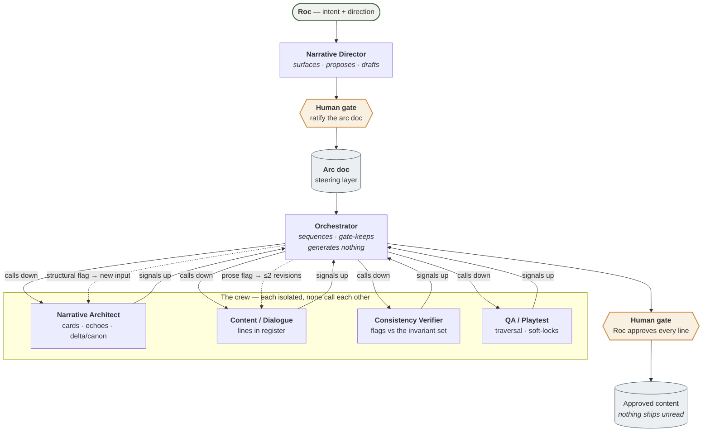

# Crew Agents — runnable role prompts

The dev crew as **runnable role prompts**, one per agent. Each is handed to an isolated subagent so it has only its role's context and returns a typed output — the concrete, executable layer over the roster described in `../../knowledge-base/synthesis/dev-crew-architecture.md`. The generation procedure they run is `../pipeline.md`; the production order across content classes is `../content-stages.md`.

| Agent | File | Feature | Stage(s) |
|---|---|---|---|
| **Narrative Director** | [`narrative-director.md`](narrative-director.md) | Steering — surfaces corpus lore, proposes the arc-doc fields + generative tables, drafts the arc doc for ratification | 1 (Arc) |
| **Orchestrator** | [`orchestrator.md`](orchestrator.md) | Sequencing + gate-keeping (the run-driver protocol, not a subagent) | all |
| **Narrative Architect** | [`narrative-architect.md`](narrative-architect.md) | Structure — persona cards, echo map, delta/canon | 2, 6 |
| **Content / Dialogue** | [`content-dialogue.md`](content-dialogue.md) | All player-facing text, one slot per call, in register | 2, 6 |
| **Spell Schema** | [`spell-schema.md`](spell-schema.md) | Spell records — phrase, components, receiver-outcome matrix; no lines | 3, 7 |
| **Item Schema** | [`item-schema.md`](item-schema.md) | Items derived from spell components; material × category, location pools | 4–5 |
| **Consistency Verifier** | [`consistency-verifier.md`](consistency-verifier.md) | Flags each batch vs the locked invariant set (`../guardrails.md`) + register; flags only | all |
| **QA / Playtest** | [`qa-playtest.md`](qa-playtest.md) | Traversal & functionality; flags only (light until a scene graph exists) | 6–7 |

**Model + effort per agent:** see the assignment table in [`../../pipeline-runs/benchmark-plan.md`](../../pipeline-runs/benchmark-plan.md) — the single source, kept there so config and its benchmark evidence stay together.

**Not in this table:** the **Production / PM** agent, at [`../../agents/production-pm.md`](../../agents/production-pm.md). It is a project-level seat, not a pipeline worker — it runs no step of `../pipeline.md`, the Orchestrator never calls it, and it never contributes to a batch. Roc talks to it directly. See [`../../agents/README.md`](../../agents/README.md) for why that distinction gets its own directory.

## How to write a seat prompt — match the leash to the job (added 2026-08-08)

A seat prompt is the most heavily weighted text in that agent's context, so its register is an instruction whether or not you meant it that way. Pitch each one at the freedom its job actually has:

- **Prose seats — Content, Director.** Many answers are valid and the right one depends on the beat. Steer with **instances**: the target line, the approved pair, the sentence you want more of. A ban names a region and pushes the model to the nearest untouched template — this pipeline measured that, and it is why Content's brief carries a "What the target sounds like" block instead of a banned-construction list (`../pipeline.md` step 8; `../register.md` § "Harvested from Roc's hand pass").
- **Checking seats — Verifier, QA.** Consistency is the whole job and a missed check is a class of defect nobody catches. Steer with an **exact, closed list**, in verdict language, numbered permanently. Verdicts are correct here and nowhere else.
- **Structure seats — Architect, Orchestrator.** In between. Fixed output contracts and hard budgets, latitude on the content inside them.

This is criterion 1.1 of [`../../agents/contract-audit.md`](../../agents/contract-audit.md), the rubric these contracts are audited against — it covers the pipeline seats here as well as the project-level ones, and adds nine more criteria plus four set-wide checks. Run it manually after editing a seat prompt; nothing enforces it.

The failure this rule exists to stop: writing a prose seat in a checking seat's voice. The generator then writes to avoid flags rather than to sound like a person, and every line in the batch pays for it.

## The flow — call down, signal up

**Reading it:** every arrow into a worker is a *prepared input*; every arrow out is a *typed output*. There are no worker-to-worker edges — that is the architecture's core claim, and it is what makes each agent testable in isolation. Flags never route sideways either: they go up to the Orchestrator, which re-dispatches (dashed edges). Gold = human gate.

## The two rules every agent obeys

- **Call down, signal up.** Each agent takes a prepared input from the Orchestrator and returns a typed output. Workers never call each other.
- **The human gate is at the output.** Roc approves; nothing ships unread. The Director's arc doc and the Architect's cards/echoes are hard-gated before they propagate.

## Director vs Architect (the easy-to-confuse pair)

The **Narrative Director** sets *direction* (the arc doc — where the story is going) and never decides for Roc — it surfaces, proposes, drafts. The **Narrative Architect** builds *structure* (cards, echoes, scene graph) *from* the ratified arc doc. Director = showrunner; Architect = blueprint.

## Running a stage

The Orchestrator (Claude) frames the stage, hands each worker its bundle in sequence, collects typed outputs, routes flags (prose → Content ≤2 revisions; structural → Architect), and surfaces the gate. The full call-down/signal-up trail is captured as a run-log under `../../pipeline-runs/`.

**Stage-2 (NPC) sequence:** Narrative Architect → Content → Consistency Verifier → *(QA light)* → Roc's gate.
