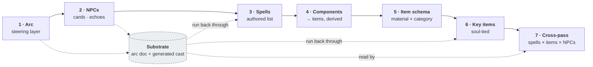

# Content Generation — Stage Order

The production order for a slice's content: which content class we build, in what sequence, and how each new class is run back through the arc to surface interactions. This is the **macro plan**; [`pipeline.md`](pipeline.md) is the **micro procedure** each stage runs its batch through; the arc doc (e.g. [`arc-festival-slice.md`](arc-festival-slice.md)) is the steering substrate stages 2–7 read.

## Why staged

- **Items are derived, not authored top-down.** They fall out of what spells actually need, so nothing is generated that nothing uses.
- **Each class is run back through the arc + the already-generated NPCs**, so interactions are discovered against real context rather than guessed.

*Dashed = the reusable substrate every later class is checked against. Which stage is current is board state — Paca, not this file.*

## The stages

1. **Arc** — write the steering layer (World Truths, Arc Question, spines, threads, anti-goals, generative tables). Nothing generates without it. → an arc doc.
2. **NPCs** — generate the souls: persona cards (essence/role), arc-spine notes, echo templates. Runs `pipeline.md` steps 2–4.
3. **Spells** — author the spell list we want; run it through the arc + NPCs for potential interactions (receiver-determined outcomes per soul).
4. **Components → Items (derived)** — each spell's components become the items that must exist. Bottom-up; no orphan items.
5. **Item schema** — decide the item schema (material × category) and how items run through the pipeline.
6. **Key items** — author the meaningful items we want, **tie each to a soul or to a role**, and run them through the arc + NPCs again for interactions. Top-down.
7. **Final cross-pass** — compare **spells × items × NPCs** to enumerate every possible reaction. The receiver-determined model taken to completion.

## Two kinds of items

- **Derived** (stage 4) — components spells need; mechanical, bottom-up.
- **Key** (stage 6) — author-chosen, tied to a **soul or a role**; the narrative echo-carriers (H3 mementos / keepsakes).

Both land in the same interaction space at stage 7.

**Soul-tied or role-tied (amended 2026-08-04 — Roc).** Stage 6 originally allowed only soul ties. Both now stand, and the difference is what happens at the reshuffle: a **soul-tied** key item travels with the soul across lives, because it belongs to a person; a **role-tied** one stays with the job, so whoever is dealt Baker this life gets the baker's key items and the soul who held it last life does not. Soul ties are the echo-carriers — the drawer of unclaimed objects, the kept whistle. Role ties are the tools and outputs of the work. Tying a role item to a soul would make it vanish when the reshuffle re-deals the job, and tying a soul's keepsake to a role would hand it to a stranger; that consequence, not preference, is what decides which one a given key item takes.

## The reusable substrate

The arc + the generated NPCs is what every later class (spells at 3, key items at 6) is run back through. The arc doc is written once; the cast accretes; each new content class is checked against both — and the final pass reads all three axes together.
