# Architecture record — `phaser/src/`

> Regenerated from disk by the Systems Documentarian (`agents/systems-documentarian.md`)
> on **2026-08-25**. **No `phaser/src/` file changed between this regeneration and the
> previous one** (git history shows nothing committed under `phaser/src/` after the
> 2026-08-24 23:00 regeneration commit) — this pass exists to close a documentation gap,
> not to record new work. The 2026-08-24 pass claimed to walk the tree fresh but missed
> the **entire T14 HUD-relayout track** (`plans/2026-08-23-hud-relayout-ruling.md`,
> GP-203's move-region editor extension), even though every file in it was already on
> disk hours before that regeneration ran: `render/HudBar.ts` (committed 12:53),
> `render/NavRow.ts`'s T14 rewrite (13:37), `render/TraversalRow.ts`'s move-logic removal
> (12:45), `world/view/MoveRegionPlacement.ts`, `world/view/RegionExport.ts`'s
> `regionsFilePayload` addition, `render/MoveRegions.ts`, and `render/EditModeSystem.ts`'s
> two-kind extension (12:53–20:17) were all committed before the 23:00 regeneration
> commit. Three files were entirely absent from the table (`HudBar.ts`, `MoveRegions.ts`,
> `MoveRegionPlacement.ts` — new modules); four more had stale rows (`NavRow.ts`,
> `TraversalRow.ts`, `EditModeSystem.ts`, `RegionExport.ts` — interfaces and
> dependencies changed but the previous table still described their pre-T14 shape). This
> pass corrects all seven. T13 (the year-loop-saves build, phases 0–6) needed no
> correction — its phase-3/4/5 modules were already captured correctly by the 2026-08-24
> pass, and phase 6 is verification-only (no new modules).
>
> This is the landmark map, not `README.md` (the probe pitch) or the session-scoped
> `GAPS.md` / `HANDOFF.md`. The tiering rule it enforces is
> `plans/2026-08-17-phaser-pivot-mode4-plan.md` — "Tiers, and the one rule that holds the line":
>
> ```
> src/world/**    pure — no Phaser, no DOM, no fetch.   vitest deep
> src/mode/**     pure — mode descriptors (data)
> src/systems/**  Phaser-aware, scene-agnostic          vitest light
> src/scenes/**   thin composition only
> src/render/**   Phaser render helpers + authored cue tables
> ```
>
> Files outside these five tiers (`src/ui/`, `src/ink/`, `src/magic/`, `src/boot/`, `src/main.ts`)
> are not governed by the tiering rule; they are surfaced in the **Undocumented / out-of-tier**
> section below rather than forced into a tier row. Three of them — `ink/InkBridge.ts` (the SEAM
> adapter), `magic/CastResolver.ts` (`MagicDB`), and `magic/spellPreview.ts` (the pure cue
> selector the spellbook preview draws through) — are drawn in the diagram because in-scope
> modules genuinely import them, but they carry no tier of their own. `ui/theme.ts` is likewise
> out-of-tier, but as of this session it is no longer a one-way sink for shared constants — see
> the note below the diagram.

---

## Module / interface table

### `src/world/**` — pure logic (vitest deep)

| Module | Tier | Owns (one line) | Public interface | Depended on by |
|---|---|---|---|---|
| `world/events/GameEvents.ts` | world | The seam — a pure `GameEventBus` with an ordered event log | `GameEventBus` (`emit`, `on`, `off`, `log`, `logOf`, `clearLog`, `removeAllListeners`); `GameEvent` union + per-event interfaces; `GameEventType`, `LoggedGameEvent`, `LoggedEventOf`, `GameEventHandler`, `GameEventBusOptions` | GateEngine, GateEvaluator, ReceiverStateStore, SaveCoordinator, CastPipeline, VfxSystem, CueTable, DialogueSystem, DialogueFeed, DialogueLayout, ModeDescriptor, CollectScene, CastScene, NpcTalkSystem, HotspotSystem, spellPreview |
| `world/CastPipeline.ts` | world | Resolve → inventory → knowledge → gates → emit; the one cast path both modes share | `CastPipeline` (`run`); `componentsFromHeld`; ports `CastInventoryPort`/`CastKnowledgePort`/`CastGatePort`; `CastPolicy`, `CastRequest`, `CastReport`, `CastPipelineDeps` | CollectScene, CastScene, HedgeCastPrompt, castPolicy, ModeDescriptor |
| `world/Inventory.ts` | world | Item ids held/discovered/world-placed; applies a cast's consume/produce; save capture | `Inventory` (`give`, `record`, `grantAllMaterials`, `availableOn`, `applyCast`, `worldItemsOn`, `captureState`, `restoreState`, …) | CollectScene, ScreenScene, NotebookScene, and most render systems (type) |
| `world/Knowledge.ts` | world | Spellbook + seen-clues | `Knowledge` (`learn`, `see`, `knows`, `hasSeen`, `spellbook`, `clues`) | CollectScene, ScreenScene, NpcTalkSystem, HedgeCastPrompt, WalkerProbe, NotebookScene, scenes |
| `world/Gates.ts` | world | Legacy graph-derived screen locks (the pre-authored mechanism) | `Gates` (`isCleared`, `clear`, `clearedGates`, `blocking`, `blockingForMoveText`, `screenIdForName`); `parseLock`; `GateRequirement` | CollectScene, ScreenScene, CastScene, ReceiverHotspots, TraversalRow, debugUnlock |
| `world/Cast.ts` | world | Which soul is present on which screen; portrait keys | `Cast` (`hasScene`, `screensFor`, `portraitKey`, `presentOn`); `SoulOnScreen` | CollectScene, ScreenScene, NpcTalkSystem, WalkerProbe |
| `world/Forage.ts` | world | Forage pool offered per screen / day / time-block | `Forage` (`poolFor`, `offer`); `ForageSlot` | ScreenScene, HotspotSystem |
| `world/Decor.ts` | world | HOME keepsake placement (surfaces, occupancy, free/slot modes) | `Decor` (`place`, `moveTo`, `remove`, `flip`, `resize`, `all`, `surfaceAt`, `placeOnSurface`, `occupant`, `surfaces`, `getMode`/`setMode`, `resetForNewLife`, …); `HOME_SURFACES`; `Surface`, `Placement`, `RegionRect`, `HubMode`, `PlacementMode` | HubScene, **HubShelfScene (new)** |
| `world/DayPicks.ts` | world | The calendar's memory — which start `screenId` each past day (1–5) began at; owns one localStorage key | `DayPicks` (`pickFor`, `record`, `all`); `DAY_PICKS_STORAGE_KEY` | LocationSelectScene, DayPicksSlice |
| `world/PlayerSettings.ts` | world | **NEW.** Real, persisted device preferences — pan speed, transition-fade duration, hint strength, drop-confirmation — as a `localStorage`-backed singleton, not a save slice (must survive "New Life") | `PlayerSettings` (getters/setters: `panTauMs`/`panSpeedPercent`, `fadeDurationMs`/`fadeSpeedPercent`, `hintStrength`, `dropConfirmAlways`); `HintStrength`, `HINT_STRENGTH_VALUES`; `PAN_TAU_MIN/MAX`, `FADE_MS_MIN/MAX` | ui/theme.ts (out-of-tier), CollectScene, SatchelScene, HedgeCastPrompt, OptionsScene |
| `world/SatchelLedger.ts` | world | Satchel ↔ item-id reconciliation (pool names vs `item_id`) | `effectiveSatchel`, `poolsToItemIds`, `reJoinInto`; `ConsumedLedger`, `ItemSink` | SatchelStrip, SatchelScene |
| `world/SatchelPockets.ts` | world | Groups the satchel into display pockets | `buildPockets`; `Pocket`, `CarriedFor` | SatchelScene |
| `world/SaveSlotView.ts` | world | Save-slot summary view model, the card's heading line, + "last played" formatting | `buildSaveSlot`, `formatLifeHeading`, `formatLastPlayed`; `SaveSlotView` (now carries `playerName`, `year`) | SaveLoadScene |
| `world/foragePoolToItem.ts` | world | IDENTITY SHIM post-reconciliation (2026-08-23) — `screen-specs.json` authors `item_id`s directly now; kept so call sites stay untouched, deletable post-capstone | `itemForPool`, `poolForItem` | SatchelLedger, SatchelPockets, HotspotSystem, SatchelScene, **DroppedItemHotspots (new)** |
| `world/FestivalScore.ts` | world | **NEW (T9).** Festival-night scoring — tier from completed goals only, bond as a per-soul talk calendar never summed into the tier; the "never a score shown" rule's arithmetic half | `FestivalLedger` (`recordTalk`, `bondOf`, `talkedTo`, `capture`, `restore`); `festivalGoals`, `bondDepthOf`, `tierFor`, `scoreFestival`, `scoreFestivalForRun`; `FESTIVAL_TIERS` (the vocabulary as data, so the rollover can count endings), `FestivalTier`, `FestivalScore`, `FestivalGoalStatus`, `FestivalSoulStanding`, `FestivalScoreInput`, `FestivalLedgerData`, `BondDepth`; `GOAL_COMPLETE_MIN_MOVES`, `BOND_CLOSE_MIN`, `DEFAULT_DAYS_PER_LIFE` | CollectScene, FestivalSlice, DiscoverySlice, DiscoverySummary, FestivalResults (type only) |
| `world/DiscoverySummary.ts` | world | **NEW (T13 Phase 5).** The year-rollover screen's three counters and its one sentence. Owns the ITEMS DENOMINATOR — the run's own obtainable set (forage ∪ approved-spell/receiver `produces` ∪ `always_available` ∪ NPC gifts, minus `persistence: "world"`), a restatement of `audit/rules.ts`'s own `obtainable()` so the two cannot drift; every numerator is an intersection, so it can never exceed its denominator | `obtainableItemIds`, `summarizeDiscovery`, `buildDiscoverySummary`, `formatDiscoveryLine`; `ObtainableItemsInput`, `DiscoveryInput`, `DiscoveryCounts`, `DiscoverySummary` | CollectScene, YearRollover (type only) |
| `world/collectGates.ts` | world | The F7 legacy-hedge fake gate constants | `HEDGE_SCREEN_ID`, `HEDGE_RECEIVER_ID`, `HEDGE_CLEARING_SPELL` | HedgeCastPrompt, **MoveRegions (gap closed this pass — `TraversalRow` no longer imports this; the hedge-gate check moved with the move logic in T14)** |
| `world/npcItems.ts` | world | NPC role → gift `item_id` map | `npcGiftForRole`; `NPC_GIFT_ITEM` | NpcTalkSystem |
| `world/spellGates.ts` | world | Proposed spell → gate id table (the interim gate data feed) | `PROPOSED_SPELL_GATES`, `UNSATISFIABLE_NOTES` | CollectScene, CastScene |
| `world/hash.ts` | world | Deterministic hashing (seed frac, rotating clue index) | `fnv1a`, `seededFrac`, `rotatingClueIndex` | HotspotPlacement, NpcTalkSystem |
| `world/view/PanModel.ts` | world | Backdrop pan/zoom math | `PanModel` (`panFit`, easing); `panFit`, `easeToward`; `PAN_ZOOM`, `PAN_SMOOTH_TAU`, `PanModelOptions` | BackdropSystem, HotspotSystem, ReceiverHotspots, NpcTalkSystem, **RoomZoomModel (new — reuses `panFit` for its own scale/slack math)** |
| `world/view/RoomZoomModel.ts` | world | **NEW.** Pure math for player-driven room zoom/pan (scroll-to-zoom, cursor-anchored; drag-to-pan only once zoomed) — deliberately not `PanModel` (fixed ambient drift vs. explicit player control), but reuses `PanModel.panFit` for the scale/offset/slack triangle | `RoomZoomModel` (`fit`, `reset`, `zoomAt`, `panTo`, `place`, `zoom`, `scale`, `offsetX/Y`, `pannable`, `atFit`, `percentLabel`, `roomLayerTransform`); `ROOM_ZOOM_MIN/MAX/STEP` | HubScene |
| `world/view/HotspotPlacement.ts` | world | Forage / region hotspot placement math + unshaped fallback | `placeForageHotspot`, `planRegionHotspots`, `unshapedRowY`, `nextUnshapedX`, `regionRectToBase`, `baseToPicturePixels`; `HotspotRect`, `SafeBox`, `ForagePlacement`, `RegionHotspotPlan`, … | HotspotSystem, ReceiverHotspots, EditModeSystem, DroppedItemHotspots, **MoveRegionPlacement (gap closed this pass — `regionRectToBase` for the authored-rect case)** |
| `world/view/DialogueLayout.ts` | world | VN layout geometry — box, nameplate, choices, sprite, control bar, backlog | `dialogueBoxRect`, `nameplateLayout`, `choiceStackLayout`, `bodyTextLayout`, `spritePlacement`, `controlBarLayout`, `backlogLayout`, `paginateLines`, `vnFontPx`, `soulDisplayName`, `pillCornerRadius`, `VN_METRICS`, … | DialogueSystem, PhaserDialogueRenderPort, DialogueRenderPort, FakeDialogueRenderPort, TraversalRow, HubScene, **NavRow (new)**, HubShelfScene |
| `world/view/RegionExport.ts` | world | Edit-mode region math (pixel drag → region rect, merge); **gained a whole-file shape (GP-203, 2026-08-24)** once the editor started authoring `moves` as well as `screens` | `pixelDragToRegionRect`, `mergeRegions`, `roundFraction`, **`regionsFilePayload`, `RegionsFile` (new)** | EditModeSystem |
| `world/view/MoveRegionPlacement.ts` | world | **UNDOCUMENTED GAP CLOSED THIS PASS — existed since the T14 HUD-relayout track (2026-08-24 20:04), never in the table.** Pure placement math for a MOVE region (T14 §1's click-to-walk boxes): the authored-rect case (delegates to `HotspotPlacement.regionRectToBase`) plus the load-bearing margin-stacking fallback for every screen with no authored `moves` rect (all of them, today); also owns the one exit-key derivation (`exitMoveInputs`) both `MoveRegions` and `CollectScene`/`EditModeSystem`'s move palette read, so the editor and the renderer can never disagree about which key a screen's exit files under | `exitMoveInputs`, `moveTargetName`, `planMoveRegions`, `moveRegionLabel`; `MoveRegionInput`, `MoveRegionSide`, `MoveRegionPlan`; `FALLBACK_MARGIN_X`, `FALLBACK_WIDTH`, `FALLBACK_BAND`, `FALLBACK_ROW_GAP`, `FALLBACK_MAX_HEIGHT` | MoveRegions, CollectScene |
| `world/gates/GateRule.ts` | world | Authored gate-rule types (cast / bond / time / chain) | `GateRule` union, `CastGateRule`, `BondGateRule`, `TimeGateRule`, `ChainGateRule`, `ChainStep`, `GateRuleKind`, `GateSource`, `BondBand`, `GateRuleTable`, `GateRuleDefect` | GameEvents, GateEvaluator, GateEngine, TraversalRow |
| `world/gates/GateEvaluator.ts` | world | Pure matching of a rule against the cast log + world facts | `evaluateRule`, `matchCastRule`, `matchBondRule`, `matchTimeRule`, `matchChainRule`, `castsFrom`, `heldAt`; `GateWorldFacts`, `GateContext`, `GateEvaluation`, `ChainMatch`, `CastLogEntry` | GateEngine, CollectScene |
| `world/gates/GateEngine.ts` | world | Loads authored gate rules, evaluates/refreshes/clears, emits, refuses unauthored | `GateEngine` (`refresh`, `evaluate`, `isCleared`, `clearedGates`, `restoreCleared`, `attach`, `blocking`, `reportBlocked`, `loadedGateIds`, `refusedGateIds`, `assertLoaded`, …); `authoredContentFrom`, `parseGateRuleTable`, `validateRule`, `screensByGateFrom`; `AUTHORED_GATE_RULES`; `AuthoredContent`, `GateEngineOptions`, `ScreenGateRequirement`, `GateRefresh` | CollectScene, ReceiverHotspots, TraversalRow, debugUnlock |
| `world/receivers/ReceiverState.ts` | world | Receiver-state types + authored-branch shape | `ReceiverStateDef`, `ReceiverRecord`, `AuthoredBranch`, `ReceiverBranchTable`, `ReceiverStatesFile`, `ReceiverStateSnapshot`, `BranchSelection`, `ReceiverDefect`, `ReceiverKey`, `ReceiverStateId` | GameEvents, ReceiverStateStore, statefulCast |
| `world/receivers/ReceiverStateStore.ts` | world | Tracks which state each receiver is in; verbatim authored branch text | `ReceiverStateStore` (`stateOf`, `kindOf`, `record`, `receivers`, `snapshot`, `restore`, `reset`, `defects`); `receiverKey`, `everyAuthoredBranch`, `RECEIVER_STATES`; `ReceiverStateStoreOptions`, `PairKind` | CastPipeline, CollectScene, statefulCast, ReceiverStatesSlice |
| `world/receivers/statefulCast.ts` | world | Runs branch selection BEFORE the no-effect test (the live-bug fix) | `castWithReceiverState`; `StatefulCastRequest`, `StatefulCastResult` | (branch-selection helper; consumed by CastPipeline's state step) |
| `world/save/SaveGame.ts` | world | The `SaveGame` schema + sub-shapes | `SaveGame`, `InventorySave`, `PositionSave`, `SaveClockDisplay`, `SaveSlotInfo`, `SaveLoadDefect`, `SAVE_VERSION` | Inventory, SaveSlotView, SaveCoordinator, ports, scenes |
| `world/save/SaveSlice.ts` | world | Slice contract + `JsonValue` + slice-id union | `SaveSlice`, `JsonValue`, `SaveSliceId`, `SliceRestoreDefect` | CheckedSaveSlice, SaveCoordinator, all slices |
| `world/save/CheckedSaveSlice.ts` | world | Validated-slice base + JSON type guards | `CheckedSaveSlice`; `isRecord`, `isStringArray` | SaveCoordinator, DecorSlice, GatesSlice, KnowledgeSlice, ReceiverStatesSlice, DayPicksSlice |
| `world/save/SaveCoordinator.ts` | world | Capture/restore across slices + ink port; autosave binding | `SaveCoordinator` (`capture`, `save`, `load`, `restore`, `slots`, `hasSave`, `clear`, `sliceIds`, `bindAutosave`); `RegisteredSlice`, `SaveCoordinatorDeps`, `SaveLoadReport` | CollectScene |
| `world/save/SaveStore.ts` | world | Persistence layer over `WebStorage` (read/write/list slots) | `SaveStore`; `webSaveStorage`, `saveKeyFor`, `MemorySaveStorage`; `SaveStorage`, `WebStorageLike`, `SaveReadResult`, `SAVE_KEY_PREFIX` | CollectScene, SaveLoadScene |
| `world/save/InkStatePort.ts` | world | Port for reading/writing ink clock + save state | `InkStatePort`, `InkClock`, `InkSaveState` | SaveCoordinator, SaveGame, LanternInkStatePort |
| `world/save/LanternInkStatePort.ts` | world | Adapts `LanternPlayer` snapshot to the ink save port (no-fork rule) | `LanternInkStatePort`; `LanternSaveHost` | CollectScene |
| `world/save/ports.ts` | world | Inventory/position state ports + in-memory implementations | `InventoryStatePort`, `PositionPort`, `MemoryInventoryState`, `MemoryPosition`, `EMPTY_INVENTORY_SAVE` | SaveCoordinator, CollectScene |
| `world/save/slices/KnowledgeSlice.ts` | world | Save slice for `Knowledge` | `KnowledgeSlice`; `KnowledgePort`, `KnowledgeSaveData` | CollectScene |
| `world/save/slices/GatesSlice.ts` | world | Save slice for cleared gates | `GatesSlice`; `GatesPort`, `GatesSaveData` | CollectScene |
| `world/save/slices/DecorSlice.ts` | world | Save slice for HOME decor (owns the decor localStorage key) | `DecorSlice`; `DECOR_STORAGE_KEY`, `DecorSaveData` | CollectScene |
| `world/save/slices/DayPicksSlice.ts` | world | Save slice for the per-day pick history — moves `DayPicks`'s key's bytes, never parses them (`DecorSlice` posture) | `DayPicksSlice`; `DayPicksSaveData` | CollectScene |
| `world/save/slices/ReceiverStatesSlice.ts` | world | Save slice for receiver states | `ReceiverStatesSlice`; `ReceiverStatesPort`, `ReceiverStatesSaveData` | CollectScene |
| `world/save/slices/FestivalSlice.ts` | world | **NEW (T9).** Save slice for the festival talk-calendar (`FestivalLedger`); restore REPLACES, never merges | `FestivalSlice`; `FestivalLedgerPort`, `FestivalSaveData` | CollectScene |
| `world/save/slices/DiscoverySlice.ts` | world | **NEW (T13 Phase 5).** Save slice for endings reached, cumulative across a life's years. The one slice that OWNS its data rather than wrapping a system — nothing else reads or writes tiers-reached, so a world class to wrap would be a wrapper around a `Set`; restore REPLACES, never merges | `DiscoverySlice` (`record`, `tiersReached`); `DiscoverySaveData` | CollectScene |
| `world/audit/rules.ts` | world | Content-audit rules (authored-but-unwired detection); **gained a 16th rule this session (T19) — `spell-components-unco-located`, the co-location check that catches a recipe whose components no single screen's forage carries all at once** | `audit`, `lockedGateIds`; `AuditInput`, `AuditRuleId`, `AuditResult`, `Finding` (via `report`) | report, rules.test |
| `world/audit/report.ts` | world | Formats an audit result for the console | `formatReport`, `REPORT_ORDER` | rules.test |

### `src/mode/**` — pure mode descriptors (data)

| Module | Tier | Owns (one line) | Public interface | Depended on by |
|---|---|---|---|---|
| `mode/ModeDescriptor.ts` | mode | The mode-as-data contract (systems, forage, gates, save, dialogue …) | `ModeDescriptor`, `SystemId` | modes, CollectScene, LocationSelectScene, SaveLoadScene, SaveCoordinator, SaveGame |
| `mode/modes.ts` | mode | The four mode records + `?mode=` reader | `DAYLIFE`, `COLLECT`, `DISCOVER_HOME`, `MODE5`, `MODES`, `MODE_ORDER`, `modeFromUrl` | ModePickerScene, PreloadScene |
| `mode/castPolicy.ts` | mode | The two cast policies (teaching vs hedge) | `TEACHING_CAST`, `HEDGE_CAST` | modes, CastScene |

No changes this session — walked and confirmed against disk, rows unchanged from 2026-08-19.

### `src/systems/**` — Phaser-aware, scene-agnostic (vitest light)

| Module | Tier | Owns (one line) | Public interface | Depended on by |
|---|---|---|---|---|
| `systems/DialogueSystem.ts` | systems | The VN dialogue layout/controller (line, choices, controls, backlog) | `DialogueSystem` (`showLine`, `enqueueLine`, `showChoices`, `advance`, `pick`, `clear`, `relayout`, `setUiHidden`, `setBacklogOpen`, `setAuto`, `setSkip`, `destroy`, …); `ControlId`, `DialogueLine`, `DialogueChoice`, `DialogueSystemOptions` | mountDialogue, CollectScene, PhaserDialogueRenderPort.test |
| `systems/DialogueFeed.ts` | systems | Bridges `PlayView` lines → `dialogue:line` events on the bus | `DialogueFeed` | CollectScene |
| `systems/DialogueRenderPort.ts` | systems | The render abstraction the VN layout draws through | `DialogueRenderPort`, `ShapeStyle`, `RoundedRectShape`, `TextSpec`, `HitSpec` | PhaserDialogueRenderPort, FakeDialogueRenderPort |
| `systems/PhaserDialogueRenderPort.ts` | systems | Phaser implementation of the dialogue render port | `PhaserDialogueRenderPort`; `PhaserDialogueRenderPortOptions` | mountDialogue, PhaserDialogueRenderPort.test |
| `systems/FakeDialogueRenderPort.ts` | systems | Headless fake render port + live-object counter (leak test) | `FakeDialogueRenderPort`, `fakeDialogueLiveObjects`, `resetFakeDialogueRegistry`; `FakeImage`, `FakeDialogueRenderPortOptions` | (tests) |
| `systems/mountDialogue.ts` | systems | Wires `DialogueSystem` + `PhaserDialogueRenderPort` into a scene | `mountDialogue`; `MountDialogueOptions` | CollectScene |

No changes this session — heavily edited in earlier waves, unchanged on this pass.

### `src/scenes/**` — thin composition

| Module | Tier | Owns (one line) | Public interface | Depended on by |
|---|---|---|---|---|
| `scenes/CollectScene.ts` | scenes | The composition root for modes 2–5 — constructs every system from a `ModeDescriptor`; wires the Options overlay; reads `PlayerSettings.panTauMs` every frame. **Row corrected this pass:** it builds `HudBar` (not `NavRow` directly — `HudBar` mounts `NavRow` as its explore tenant), plus `MoveRegions` for click-to-walk exits and (mode5 only) `EditModeSystem`'s two-kind region/move authoring; calls `MoveRegionPlacement.exitMoveInputs` directly to hand the editor its live move-palette ids | `CollectScene extends Phaser.Scene` | main |
| `scenes/ScreenScene.ts` | scenes | Mode 1 day-life scene (the original path) | `ScreenScene extends Phaser.Scene` | main |
| `scenes/CastScene.ts` | scenes | Standalone cast UI (typed / known / components) | `CastScene extends Phaser.Scene`; `CastMode`, `CastSceneData` | main |
| `scenes/ModePickerScene.ts` | scenes | Mode selection menu | `ModePickerScene extends Phaser.Scene`; `ModePickerData` | main |
| `scenes/LocationSelectScene.ts` | scenes | Day-start picker, laid out as the 5-day calendar; two canonical starts as map thumbnails, past days read from `DayPicks` | `LocationSelectScene extends Phaser.Scene`; `LocationSelectData` | main, SaveLoadScene (by scene key), PreloadScene (by scene key) |
| `scenes/HubScene.ts` | scenes | HOME decoration scene (drives `Decor`); **now owns player-set room zoom/pan (`RoomZoomModel`) and opens `HubShelfScene` (close-up shelf overlay) on click** | `HubScene extends Phaser.Scene`; `HubSceneData` | main |
| `scenes/HubShelfScene.ts` | scenes | **NEW.** The shelf's sixteen cubbies drawn close-up and front-on (own rect table — no shared geometry with the room's isometric shelf); click-to-arm/click-to-place against the same live `Decor` instance `HubScene` holds; paused overlay launched by `HubScene` | `HubShelfScene extends Phaser.Scene`; `HubShelfSceneData` (`decor`, `items`, `discoveredOnly?`, `onClose`); `SHELF_CUBBY_RECTS` | main, HubScene (by scene key) |
| `scenes/NotebookScene.ts` | scenes | Notebook view; the spells tab is a two-page spellbook with a LIVE VFX preview playing each spell's real authored cue | `NotebookScene extends Phaser.Scene`; `NotebookSceneData` | main |
| `scenes/CalendarScene.ts` | scenes | Day/time calendar view | `CalendarScene extends Phaser.Scene`; `CalendarSceneData` | main |
| `scenes/SatchelScene.ts` | scenes | Satchel/pocket inventory view; drop confirmation is now real (`PlayerSettings.dropConfirmAlways`); **now the shared source of the six material glyph-drawing helpers, consumed by `HubScene` and `HubShelfScene`** | `SatchelScene extends Phaser.Scene`; `SatchelSceneData`; **`GlyphKind`, `glyphKindFor`, `GLYPH_FILES`, `GLYPH_TEXTURE_SIZE`, `glyphTextureKey`, `drawLeafGlyph`** | main, HubScene (new), HubShelfScene (new) |
| `scenes/SaveLoadScene.ts` | scenes | The boot-time LIFE PICKER — reads `SaveStore` and binds one live column per `mode.save.slots` entry: Resume / Start-over on a filled life, "Begin a new life here" + an in-scene name field on an empty one. Took over the retired `ResumePromptScene`'s job. **T13 Phase 4: always shown for a slot-set mode (the old "nothing saved, skip it" pass-through survives only for `save: null` modes); hands the chosen slot + typed name on as `ChosenLife`** | `SaveLoadScene extends Phaser.Scene`; `SaveLoadSceneData` (`run`, `ink`, `magic`, `mode`) | main, PreloadScene (by scene key) |
| `scenes/OptionsScene.ts` | scenes | The Options board; Pan Speed / Transition Fade / Hint Strength / Drop Confirmation rows are now LIVE against `PlayerSettings` — the remaining rows (Sound, Text & Speed, Saves) stay INERT previews, honestly labeled, until their own settings exist; global (not descriptor-gated), in-game paused overlay | `OptionsScene extends Phaser.Scene`; `OptionsSceneData` (`onClose`) | main, CollectScene (by scene key) |
| `scenes/SpellTrialScene.ts` | scenes | Spell trial / practice scene | `SpellTrialScene extends Phaser.Scene`; `SpellTrialData` | main |
| `scenes/ChosenLife.ts` | scenes | **NEW (T13 Phase 3).** WHICH LIFE a session is playing — the slot and the player name, as a types-only contract passed BETWEEN scenes. Its own module so `CollectScene` does not carry it (line-count gate) and `LocationSelectScene`, which only forwards the fields, need not import from the scene it routes to | `ChosenLife` (`saveSlot?`, `playerName?`); `CollectSceneData` | CollectScene, LocationSelectScene, SaveLoadScene (by shape) |
| `scenes/debugUnlock.ts` | scenes | Mode 5 debug-unlock wiring helper | `wireMode5DebugUnlock`; `DebugUnlockDeps` | CollectScene |

### `src/render/**` — Phaser render helpers + authored cue tables

| Module | Tier | Owns (one line) | Public interface | Depended on by |
|---|---|---|---|---|
| `render/BackdropSystem.ts` | render | Draws + pans the screen backdrop (uses `PanModel`). Persistent field, so it drops its drawn state on the scene's `shutdown` — otherwise resuming onto the screen the previous life ended on draws nothing (T13 Phase 5) | `BackdropSystem`; `BackdropDeps` | CollectScene |
| `render/HotspotSystem.ts` | render | Forage hotspot markers over the backdrop | `HotspotSystem`; `HotspotDeps` | CollectScene, WalkerProbe |
| `render/DroppedItemHotspots.ts` | render | **Undocumented gap closed this pass — existed since the 2026-08-23 satchel-cluster track.** Renders `Inventory.droppedOn(screen)` as pulsing dots, a sibling of `HotspotSystem` (day's forage draw) not a branch of it — two-sided re-pickup via `LanternPlayer.stashPool` + `Inventory.pickUpDropped` | `DroppedItemHotspots` (`sync`, `reposition`); `DroppedItemDeps` | CollectScene |
| `render/ReceiverHotspots.ts` | render | Cast-on-a-receiver markers ("the approach") | `ReceiverHotspots`; `approachScreens`, `castTargetsFor`; `ReceiverHotspotDeps`, `CastTarget` | CollectScene |
| `render/NpcTalkSystem.ts` | render | NPC presence + talk modal, clue sharing, gifting | `NpcTalkSystem`; `ModalHost`, `NpcTalkDeps` | CollectScene, WalkerProbe |
| `render/SatchelStrip.ts` | render | The satchel strip UI (reads `SatchelLedger`) | `SatchelStrip`; `SatchelStripDeps` | CollectScene |
| `render/TraversalRow.ts` | render | **Row corrected this pass — T14 shrank this to the leftover choice pills.** Was the whole screen-hub choice row including gate/lock state; T14 (`plans/2026-08-23-hud-relayout-ruling.md`) pulled the three screen-hub verbs (`exit`/`wait`/`endday`) out WHOLE — exits (and every gate check that went with them) to `MoveRegions`, wait/end-day to `HudBar`. What is left draws only non-hub choices: `[Look at X]`, scene entries, the festival vignette, `continue`. **No longer imports `Gates`/`GateEngine`/`GateRule`/`world/collectGates` — it no longer knows what a gate is.** `TraversalRowDeps` is unchanged in shape (`scene`, `ink`, `viewWidth`, `bottomBarTop`, `choicesRowTop`) but the deps it dropped (`gates`, `gateEngine`, `authoredGates`, `hedgeCleared`, `openGatedCastPrompt`, `openHedgePrompt`) all moved to `MoveRegionsDeps` | `TraversalRow` (`draw`); `TraversalRowDeps` | CollectScene |
| `render/ModalFrame.ts` | render | Shared modal chrome/frame | `ModalFrame`; `ModalFrameDeps` | CollectScene, HedgeCastPrompt, debugUnlock, **HudBar (gap closed this pass — End-the-Day's one-step confirm)** |
| `render/NavRow.ts` | render | **Row corrected this pass — T14 rewrote this on 2026-08-24 into the HUD bar's explore tenant, and the 2026-08-24 regeneration missed it.** No longer right-aligned/self-standing: draws left-to-right from a caller-given `leftX`, mounted and centred by `render/HudBar.ts`. Tooltips flip to open ABOVE the tile (bottom-anchored bar has no room below); the persistent Decorate caption is cut; gained a FOURTH cluster — §1b's always-drawn Wait tile + "End day · E" text pill, dimmed in place by `setDayActionsEnabled` rather than added/removed. `Tab`/`Shift+Tab` cycle keyboard focus across every control; `Enter`/`Space` activates, `Escape` clears | `NavRow` (`build`, **`measure` (new) — how `HudBar` sizes its plate before drawing**, `setDayActionsEnabled` (new)); `drawNavGlyph`; `NavGlyphKind` (**gained `"hourglass"`**), `NavIconSpec` (**dropped `caption`**), `NavPillSpec` (new — the End-day pill), `NavRowDeps`, `NavRowActions` (**gained `wait`, `endDay`**); `NAV_ROW_HEIGHT` (new, replaces the no-longer-exported `NAV_ICON_SIZE`) | **HudBar (gap closed this pass — CollectScene no longer imports this directly)** |
| `render/HedgeCastPrompt.ts` | render | The gated-cast picker — `open`/`openHedgePrompt`/`openCastOn`; the post-cast "worth trying" hint and the pre-guess plausibility grouping are now gated by `PlayerSettings.hintStrength` (off/subtle/generous) | `HedgeCastPrompt` (`open(message, obstacleNoun, receiverId?, screenId?)`, `openHedgePrompt()`, `openCastOn(receiverId, label, screenId)`); `HedgeCastPromptDeps` | CollectScene, **MoveRegions (gap closed this pass — a gated move region opens this on click, same as a gated traversal pill used to)** |
| `render/EditModeSystem.ts` | render | **Row corrected this pass — doubled in size for GP-203 (2026-08-24, `plans/2026-08-24-move-region-editor-plan.md`), missed by the 2026-08-24 regeneration.** Was hotspot (`screens` map) drawing only; now a TWO-KIND editor — a `[examinables \| moves]` chip switches which of `regions.json`'s two maps the palette/drag/export target, with arming exclusive across both kinds (one drag gesture). The move palette's ids are the screen's LIVE exits, handed in by `CollectScene` via `MoveRegionPlacement.exitMoveInputs` so the editor and `MoveRegions` can never disagree about a screen's exit keys. Converts drag rects through `HotspotPlacement`'s `regionRectToBase`/`baseToPicturePixels` pair (unchanged from the previous pass); export now serializes BOTH maps via `RegionExport.regionsFilePayload` | `EditModeSystem` (`toggle`, `draw(screen, ids, moveIds)`, `isActive`); `EditModeSystemDeps` (**gained `moveRegions`, `onMoveRegionCommitted`**); `RegionKind` (new) | CollectScene |
| `render/HudBar.ts` | render | **UNDOCUMENTED GAP CLOSED THIS PASS — existed since 2026-08-24 12:53 (T14, "One Bar, Three Tenants"), never in the table.** The HUD's one docked bar — draws the plate (a centred capsule hugging the bottom edge) and mounts a tenant; only the **explore** tenant is built (§1+§1b, `NavRow`'s icon clusters plus the day-action cluster) — casting (§2) and dialogue (§3) tenants are deliberately absent, not stubbed. Owns the plate, every hotkey drawn on it (`S N H L O W E`), and §1b's one-step "End the day?" confirm (through `ModalFrame`, since ending a day cannot be undone by clicking again) | `HudBar` (`build(actions, opts)`, `sync(v)`); `HudBarDeps`, `HudBarActions` | CollectScene |
| `render/MoveRegions.ts` | render | **UNDOCUMENTED GAP CLOSED THIS PASS — existed since 2026-08-24 20:05 (T14 §1, "Movement = clickable screen regions, not buttons"), never in the table.** Draws one dashed, clickable region per exit the hub currently offers, filtered on `hubAction === "exit"` (not `kind === "move"`, which also covers day-end). Carries across, VERBATIM, the whole gate-decision surface `TraversalRow` used to own for exits — `blockingGatesFor`, `hintFor`, `describeGateRule`, the "?" tap-to-reveal pin, and the refused-gate-crash fix (`hintFor` filters to describable rule ids instead of asserting one exists, since `G-F4-still`/`G-F8-combine` are refused-at-load and have no parsed rule) — because a move region has to make exactly the same three decisions a move pill made. Geometry is NOT owned here (`world/view/MoveRegionPlacement.ts`); gate/hedge collaborators (`Gates`, `GateEngine`, `PanModel`) arrive via `MoveRegionsDeps`, injected by `CollectScene`, so they are the composition root's wiring rather than direct import edges (the `CastPipelineDeps`-ports convention) | `MoveRegions` (`draw`, `reposition`, `clear`); `MoveRegionsDeps` | CollectScene |
| `render/WalkerProbe.ts` | render | Frozen-key probe surface for the headless walker | `WalkerProbe`; `WalkerProbeDeps` | CollectScene |
| `render/FestivalResults.ts` | render | **NEW (T9) — undocumented gap closed this pass.** The Final Screen's results panel; replaces the old placeholder line with tier prose, attending souls, and finished-goal text — never a number, per the "never a score shown" rule | `FestivalResults` (`sync`); `FestivalResultsDeps` | CollectScene |
| `render/YearRollover.ts` | render | **NEW (T13 Phase 5).** The Final Screen's rollover band — the discovery summary plus "continue into the next year" / "return to main menu". APPENDS to `FestivalResults` (a band under it, flush with its bottom edge), never replaces it; formats and counts nothing itself | `YearRollover` (`sync`, `clear`); `YearRolloverDeps`, `CONTINUE_LABEL`, `MAIN_MENU_LABEL` | CollectScene |
| `render/vfx/VfxSystem.ts` | render | GameEvent → cue playback; attaches to the bus, disposes on detach | `VfxSystem` (`attach`, `detach`, `stopAllCues`); `AnchorResolver`, `VfxDiagnostic`, `VfxSystemOptions`, `VfxStats` (re-exports `CueTable`, `VfxAnchor`, `VfxBackend`, `VfxCue`, `VfxHandle`) | CollectScene, CastScene |
| `render/vfx/VfxBackend.ts` | render | The VFX backend contract + cue/anchor/handle types | `VfxBackend`, `VfxCue`, `VfxAnchor`, `VfxHandle`, `VfxTone`, `VfxKind`, `isAnchoredKind` | VfxSystem, PhaserVfxBackend, FakeVfxBackend, CueTable, NotebookScene, spellPreview |
| `render/vfx/PhaserVfxBackend.ts` | render | Phaser 4 filter/particle implementation of the backend (`play`, `stopAll`, `detach`, `attached`, `liveCount`) | `PhaserVfxBackend`; `PhaserVfxBackendOptions` | CollectScene, CastScene, NotebookScene |
| `render/vfx/FakeVfxBackend.ts` | render | Headless fake backend + live-handle counter (leak test) | `FakeVfxBackend`, `fakeVfxLiveHandles`, `resetFakeVfxRegistry`; `FakePlay` | (tests) |
| `render/vfx/CueTable.ts` | render | Loads/validates the authored cue table; event → cue lookup; neutral fallback | `loadCueTable`, `loadAuthoredCues`, `cueFor`, `findRule`, `ruleMatches`, `AUTHORED_CUES`, `NEUTRAL_FALLBACK`, `findUnreachableRules`, `cueColor`, `cueWeight`, `cueParam`, `channelScaleMatrix`, `clamp01`, `CueRule`, `CueTable`, … | VfxSystem, PhaserVfxBackend, CollectScene, CastScene, NotebookScene, spellPreview |

`HotspotSystem.ts` carries a long run of "auto: update" commits since 2026-08-19 (internal bugfixes/behavior tuning), but its exported interface and import set are unchanged from the previous generation — read fresh against disk, not against commit count, it is not a "changed" row this pass. `TraversalRow.ts` is the opposite case: its commit history looks the same shape (many small "auto: update" commits), but reading it fresh against disk shows the T14 rewrite genuinely shrank its scope and dropped its gate-system imports — see its table row above and the diff below.

---

## Load-bearing seam diagram

Edges are drawn only where a real import (value, JSON data, or the shared event bus as
a construction collaborator) exists in the current source. Type-only imports, shared
constants (`ui/theme`'s `COLOR`/`FONT`, and `DayPicksSlice`'s import of `DAY_PICKS_STORAGE_KEY`),
and stateless utilities are treated as incidental and omitted. `CastPipeline`'s collaborators
(`MagicDB`, `Inventory`, `Gates`, the bus) are injected via `CastPipelineDeps` ports, so they
appear as the composition-root's wiring, not as `CastPipeline` import edges. Secondary scenes
that own a model but sit off the core seam (`HubScene`→`Decor`, `LocationSelectScene`→`DayPicks`,
`SaveLoadScene`→`SaveStore`, `HubScene`/`HubShelfScene`→`SatchelScene`'s glyph helpers,
`HubScene`→`RoomZoomModel`) are captured in the table, not the diagram — `NotebookScene` is
still the one RENDER-tier-backend exception drawn for that reason.
`PlayerSettings`, by contrast, IS drawn: it is a genuine pure-tier singleton with stateful
read/write behavior (not a shared constant), and two of its five real consumers (`CollectScene`,
`HedgeCastPrompt`) are themselves already-drawn nodes. `FestivalScore` (`FestivalLedger`) and
`FestivalResults` are drawn for the same reason as `PlayerSettings`: both are genuine stateful
modules, both are real `CollectScene` imports, not shared constants. The score VALUE itself
flows `FestivalScore → CollectScene → FestivalResults` at runtime, but `FestivalResults` only
imports `FestivalScore`'s TYPES, not its code — so, matching the `CastPipelineDeps`-ports
convention above, no direct `FestivalScore → FestivalResults` edge is drawn; `CollectScene` is
the composition root that actually wires the two.

**Gap closed this pass — the T14 HUD-relayout track, all of it real code, none of it new
since 2026-08-24:** `HudBar` and `MoveRegions` join the RENDER subgraph as first-class nodes
(the same footing as `NavRow`/`TraversalRow`/`EditModeSystem` — they are genuine systems
`CollectScene` constructs, not utility functions). `HudBar → NavRow` is a real value import
(`HudBar` constructs and calls into `NavRow` directly) and is drawn. `MoveRegions`'s
collaborators — `Gates`, `GateEngine`, `PanModel` — arrive as `import type` plus a
constructor-injected instance from `CollectScene`, matching the `CastPipelineDeps`-ports
convention: wired by the composition root, not drawn as `MoveRegions` edges. Two edges from
the previous diagram are corrected because they no longer reflect real imports:
**`TR → GE & GT` is removed** — `TraversalRow.ts` dropped its `Gates`/`GateEngine`/`GateRule`
imports entirely when T14 moved the gate-decision logic to `MoveRegions`, and now imports
nothing from `src/world/gates/` or `world/Gates.ts`. **`EDT → CT` is removed** — reading
`EditModeSystem.ts` fresh, it has never imported `CueTable`; that edge did not describe any
import in the current source and should not have been drawn. `world/view/HotspotPlacement.ts`,
`world/view/MoveRegionPlacement.ts` and `world/view/RegionExport.ts` stay OFF the diagram
(captured in the table only), consistent with how `HotspotPlacement` itself was already
omitted despite four real importers — pure-math utility modules under `world/view/` are a
table-only tier in this diagram's established convention, distinct from the stateful
singletons (`PanModel`, `RoomZoomModel`, `DialogueLayout`, `PlayerSettings`, `FestivalScore`)
that do get nodes.

```mermaid
flowchart TB
  subgraph CONTENT["Authored data — JSON on disk"]
    C5["world/gates/data/gateRules.json"]
    C4["world/receivers/data/receiverStates.json"]
    C6["render/vfx/cues.json"]
  end

  subgraph LOGIC["src/world + src/mode — PURE, vitest deep"]
    BUS(["GameEventBus — the seam"])
    CP["CastPipeline"]
    GE["GateEngine"]
    GV["GateEvaluator"]
    RS["ReceiverStateStore"]
    INV["Inventory"]
    KN["Knowledge"]
    GT["Gates"]
    SL["SatchelLedger + foragePoolToItem"]
    SV["SaveCoordinator + slices"]
    ST["SaveStore"]
    IP["LanternInkStatePort → InkStatePort"]
    MD["ModeDescriptor + modes"]
    PM["PanModel"]
    RZ["RoomZoomModel"]
    DL["DialogueLayout"]
    PS["PlayerSettings"]
    FS["FestivalScore — FestivalLedger"]
  end

  subgraph SEAM["src/ink + src/magic — adapters (out of tier)"]
    IB["InkBridge → LanternPlayer (ink owns the clock)"]
    CR["MagicDB / CastResolver"]
    SP["spellPreview — cue selector"]
  end

  subgraph RENDER["src/systems + scenes + render — PHASER, vitest light"]
    COLL["CollectScene — composition root"]
    SCR["ScreenScene"]
    CAST["CastScene"]
    NB["NotebookScene — spellbook + live preview"]
    BD["BackdropSystem"]
    HS["HotspotSystem"]
    RH["ReceiverHotspots"]
    NPC["NpcTalkSystem"]
    DSY["DialogueSystem"]
    DF["DialogueFeed"]
    HCP["HedgeCastPrompt"]
    TR["TraversalRow"]
    EDT["EditModeSystem"]
    WP["WalkerProbe"]
    VFX["VfxSystem → PhaserVfxBackend"]
    CT["CueTable"]
    NAV["NavRow"]
    HB["HudBar"]
    MR["MoveRegions"]
    FR["FestivalResults"]
  end

  C5 --> GE
  C4 --> RS
  C6 --> CT

  GE -- attach/emit --> BUS
  RS -- emit --> BUS
  SV -- bindAutosave --> BUS
  GE --> GV
  SV --> ST & IP
  IP --> IB
  SL --> INV
  RZ --> PM

  BUS ==>|events only| VFX
  BUS ==> DSY
  DF ==> BUS
  CT --> VFX

  MD --> COLL
  IB --> COLL & SCR & CAST
  CR --> COLL & SCR & CAST
  COLL --> CP & GE & RS & INV & KN & GT & SV & VFX & CT & BD & HS & RH & NPC & DSY & DF & HCP & TR & EDT & WP & HB & MR & FS & FR
  COLL -->|user intent| CP
  PS --> COLL & HCP
  CAST --> CP & VFX & CT
  SCR --> INV & GT & KN
  HCP --> CP
  BD --> PM
  HS --> PM & SL
  RH --> PM & GE
  HB --> NAV
  NB -->|PhaserVfxBackend| VFX
  NB --> CT & SP
  SP --> CT
```



---

## Diff vs previous `ARCHITECTURE.md` (2026-08-24 → 2026-08-25)

**No code changed.** `phaser/src/` has no commits between the previous regeneration
(2026-08-24 23:00) and this one — every difference below is the previous pass's own
miss, corrected now. T13 (year-loop-saves, phases 0–6) needed no correction: its
phase-3/4/5 modules (`ChosenLife.ts`, `SaveLoadScene.ts`'s 3-slot board,
`YearRollover.ts`, `DiscoverySummary.ts`, `world/save/slices/DiscoverySlice.ts`) were
already captured correctly, and phase 6 is verification/closure only (no modules).

**Added (3 modules, all pre-existing on disk since the T14 HUD-relayout track,
2026-08-24 — entirely absent from the previous table):**
- **`render/HudBar.ts`** — the HUD's one docked bar (T14, "One Bar, Three Tenants").
  Draws the plate, mounts the explore tenant (`NavRow`), owns every hotkey on the bar
  and §1b's "End the day?" confirm. Committed 12:53, six hours before the pass that
  missed it.
- **`render/MoveRegions.ts`** — movement as clickable screen regions instead of
  buttons (T14 §1). Carries the whole gate-decision surface for exits over from
  `TraversalRow` verbatim (`blockingGatesFor`, `hintFor`, the refused-gate-crash
  fix). Committed 20:05.
- **`world/view/MoveRegionPlacement.ts`** — pure placement math for a move region,
  including the load-bearing fallback layout for every screen with no authored
  `moves` rect (all of them today), and `exitMoveInputs`, the one exit-key
  derivation both `MoveRegions` and the move-region editor read. Committed 20:04.

**Changed (interface/dependency shape, no tier change — all four already had rows,
but the rows described the pre-T14 shape):**
- **`render/TraversalRow.ts`** — T14 pulled the three screen-hub verbs (`exit`,
  `wait`, `endday`) out WHOLE. Dropped its `Gates`/`GateEngine`/`GateRule`/
  `world/collectGates` imports entirely — the gate-decision logic that used to make
  this the biggest reason `TraversalRow` existed now lives in `MoveRegions`. What
  remains draws only non-hub choices. `TraversalRowDeps`'s field NAMES are
  unchanged, but six of its old fields (`gates`, `gateEngine`, `authoredGates`,
  `hedgeCleared`, `openGatedCastPrompt`, `openHedgePrompt`) no longer exist on it at
  all — they moved to `MoveRegionsDeps`.
- **`render/NavRow.ts`** — rewritten as the HUD bar's explore tenant. Anchor changed
  (left-to-right from a given `leftX`, not self-positioned top-right); tooltips flip
  to open above the tile; the persistent Decorate caption is cut; gained a fourth
  cluster (Wait tile + "End day · E" pill) and a `measure()` method `HudBar` calls
  before drawing its plate. `NAV_ICON_SIZE` export removed, replaced by
  `NAV_ROW_HEIGHT`. No longer a direct `CollectScene` import — `HudBar` is the only
  consumer now.
- **`render/EditModeSystem.ts`** — doubled in size for GP-203
  (`plans/2026-08-24-move-region-editor-plan.md`, 2026-08-24), extending the
  examinables-only hotspot editor into a two-kind `[examinables | moves]` editor.
  `EditModeSystemDeps` gained `moveRegions` and `onMoveRegionCommitted`; the new
  `RegionKind` type discriminates the palette/drag/export target.
- **`world/view/RegionExport.ts`** — gained `regionsFilePayload`/`RegionsFile`, a
  whole-file shape covering both of `regions.json`'s maps, once the editor started
  authoring `moves` as well as `screens` (an export that wrote `{ screens }` alone
  would silently delete every authored move region on paste-back).

**Corrected diagram edges (no import ever existed as drawn):**
- **`TR → GE & GT` removed** — matches `TraversalRow.ts`'s dropped imports above.
- **`EDT → CT` removed** — `EditModeSystem.ts` has never imported `CueTable`;
  re-reading the file fresh against disk found no such import in the current or any
  recent version. This edge should not have been drawn in the prior regeneration and
  is corrected here rather than carried forward.

**`scenes/CollectScene.ts`** — table row corrected to say it builds `HudBar` (which
mounts `NavRow`), not `NavRow` directly, and now also builds `MoveRegions`.

**Removed:** none. **Tier changes:** none.

<details>
<summary>Previous diff (2026-08-23 → 2026-08-24), retained for history</summary>

**Changed by T13 Phase 4 — the real 3-slot lives board, 2026-08-24 (no new
modules; the picker was always meant to land in the scene that already owned the
board):**
- **`scenes/SaveLoadScene.ts`** — 1 real column + 2 hatched dead placeholders
  becomes THREE LIVE COLUMNS, one per entry of `mode.save.slots`. A filled column
  leads with `formatLifeHeading` ("Wren — Year 1, Day 1 · morning") over place,
  spells and last-played, with Resume / Start over; an EMPTY one is interactive
  ("Begin a new life here") — the mechanism that replaces the New Life button T7
  removed — and picking it opens a NAME FIELD ON THE BOARD (a Phaser Text plus one
  `keydown` capture in the same scene, the shape `CastScene` already uses for a
  typed phrase; no new scene, and the card had room). Confirming an empty field
  begins an unnamed life on purpose. **The documented boot pass-through changed:**
  only a mode with NO slots passes through now, so a slot-set mode always sees the
  board, including on a first boot with nothing saved — that is where a slot is
  chosen and a name is typed. A refused (`version-mismatch`) save no longer passes
  through either: its column draws empty WITH THE REASON on it. The scene also
  loads its own `bg:mode-picker` backdrop, which used to arrive only because
  `ModePickerScene` had run first.
- **`world/SaveSlotView.ts`** — `SaveSlotView` gains `playerName` and `year`, read
  verbatim off the save, plus `formatLifeHeading` — the exact heading string, kept
  beside the fields it composes so a unit test pins it instead of a screenshot. An
  unnamed life drops the name and the dash rather than gaining a placeholder.
- **`scenes/CollectScene.ts`** — the Phase-3 `?? mode.save.slots[0]` stub is GONE;
  the board answers on both routes in, and guessing the first slot when a caller
  forgot would autosave over life 1. A slots-declaring mode that reaches play with
  no slot gets no coordinator and a console warning. Separately, `create()`'s ink
  `view`/`error` listeners are now unbound on `shutdown` — the bridge outlives the
  scene, and a leftover listener rendered a torn-down scene into a destroyed
  texture manager. **The line-count gate moved 1140 → 1150** for those two
  additions, documented in the test's own name as every previous bump has been.
- **`GAPS.md` G18 is CLOSED** by this phase (three slots existed in the schema,
  one was reachable).

**Added (1 module, T13 Phase 3 — the `SAVE_VERSION` 2 → 3 bump, 2026-08-24):**
- **`scenes/ChosenLife.ts`** — types only. `ChosenLife` (`saveSlot?`, `playerName?`)
  plus `CollectSceneData`. A mode now offers a SET of save slots, so "which slot"
  can no longer be read off the descriptor and has to ride the scene-data chain
  (`SaveLoadScene → CollectScene`, and `SaveLoadScene → LocationSelectScene →
  CollectScene` on the new-game route). Both fields are optional because Phase 4's
  slot picker and name field do not exist yet; `CollectScene.startSave()` falls
  back to `slots[0]` and `""`, which reproduces the single-slot behaviour exactly.

**Changed by the same bump (interface changes, no tier change):**
- **`world/save/SaveGame.ts`** — `SAVE_VERSION` **2 → 3**, dated and reasoned in
  the constant's own comment. `SaveGame` gains `readonly playerName: string`;
  `SaveSlotInfo` gains it too. ONE bump covers Phase 2's `clockDisplay.year`,
  Phase 3's slot set and player name, and Phase 4's UI, so the number moves once
  for the whole build window. **Same refusal shape as the 1 → 2 bump (T19,
  2026-08-23), not a new one:** a version-2 save is reported as
  `version-mismatch` by `SaveStore.read` and the caller decides; there is no
  migration, no back-fill of the two new fields, and `SAVE_KEY_PREFIX` stays
  `v1`, so the old single-slot `phaser-probe/save/v1/mode5` key is left sitting
  in localStorage unread and undeleted. Pinned by a `SaveLoad.test.ts`
  regression that mirrors the version-1 one and additionally asserts the refused
  bytes are still on disk afterwards.
- **`mode/ModeDescriptor.ts`** — `save.slot: string` becomes
  `save.slots: readonly string[]`; `mode/modes.ts` gives mode5
  `["mode5-1", "mode5-2", "mode5-3"]`. Stated as data rather than derived from
  `id`, matching how the descriptor holds everything else.
- **`world/save/SaveCoordinator.ts`** — `SaveCoordinatorDeps` gains
  `playerName`, and `capture()` stamps it. **Unchanged in SHAPE, deliberately:**
  a coordinator still owns exactly one slot at a time. `world/save/SaveStore.ts`
  passes `playerName` into `list()`. `looksLikeSave` deliberately does NOT check
  the new field — it runs before the version gate, so requiring it would report
  version-2 saves as `unreadable` instead of `version-mismatch`, and the reason
  is what a slot picker shows the player.
- **`scenes/CollectScene.ts`** — `init` takes `CollectSceneData`; resolves the
  session's slot and name from scene data (`?? slots[0]` / `?? ""` as the
  Phase-3 stub) and hands both to `SaveCoordinator`. New public field `saveSlot`,
  read by `tools/adversary/lib/agentApi.mjs`, which can no longer ask the
  descriptor which file is live. **The line-count gate moved 1120 → 1140** in
  `tests/HedgeCastPromptTraversalRow.test.ts`, documented in the test's own name
  as every previous bump has been: T14 had already spent the headroom (1118 of
  1120) and this adds 16 lines of ordinary orchestration wiring, with the
  scene-data contract itself extracted to `scenes/ChosenLife.ts` rather than
  declared inline.
- **`scenes/LocationSelectScene.ts`** — `LocationSelectData extends ChosenLife`
  and both exits to `CollectScene` now go through one `collectData()` helper, so
  they cannot drift on which fields they forward. The scene reads neither field.

**Added (2 real new modules, T9):**
- **`world/FestivalScore.ts`** — festival-night scoring, ruled by Roc 2026-08-23,
  built 2026-08-24. Tier comes from completed festival goals only (1/2/3 →
  Quiet/Warm/Grand); bond is a per-soul talk calendar (`FestivalLedger`, capped one
  count per soul per day) that drives dialogue depth and festival-night turnout but
  is deliberately never summed into the tier — the "two tracks, never colliding"
  rule from `gdd/03-core-loop.md`. Pure, no Phaser.
- **`render/FestivalResults.ts`** — the Final Screen's results panel, replacing an
  authored placeholder line. Renders the tier as prose (never the word
  quiet/warm/grand, never a number), attending souls, and finished-goal text —
  "never a score shown" made literal: nothing in this file is ever handed a number
  to format.

**Removed (1 module, T19):**
- **`world/collectExtraForage.ts`** — deleted. Client-side forage-pool additions
  (T4/F7/F8) are now real, authored entries in every screen's `forage` array
  (Task 1's 2026-08-23 reconciliation made this the natural next cut). Every caller
  that read from it now gets `{}` for `extraForagePools`
  (`tools/content-audit.mjs`) or nothing at all. `foragePoolToItem.ts`, its
  neighbor in the same reconciliation, was NOT deleted — it survives as a
  documented identity shim (see its row above) because deleting it would have
  required touching every call site during freeze week; `collectExtraForage.ts`
  had exactly one caller (the audit) and was cheap to remove outright.

**Tier changes:** none.

**Changed (role / interface / new edges, no tier change):**
- **`world/audit/rules.ts`** — gained a 16th rule, `spell-components-unco-located`
  (T19, "the 16/16 regression"): the original defect four spells (`fetch`, `steep`,
  `temper`, `waft`) had no single screen carrying every component they needed, so a
  player could hold half a recipe forever. Now checkable with no join at all, since
  `screen.forage` is `item_id`s directly. `AuditInput.extraForagePools` is now
  always `{}` from the one real caller (`content-audit.mjs`) — the field itself
  still exists in the type (kept for shape stability) but its doc comment ("`world/
  collectExtraForage.ts` — screen_id -> extra pool names") now names a **deleted
  file**; worth a follow-up comment fix, flagged rather than silently carried.
- **`world/view/HotspotPlacement.ts`** — gained two new exports,
  `regionRectToBase`/`baseToPicturePixels`, and `planRegionHotspots` gained an
  optional fourth `picture` parameter (defaults to `view`) plus `baseX`/`baseY` on
  `RegionHotspotPlan`. Fixes region rects being measured against the canvas instead
  of the (larger, panned) picture. New consumer: `EditModeSystem`, which now
  converts drag rects through this module's pair instead of its own inline math.
- **`render/EditModeSystem.ts`** — the export button is now a styled `ui/buttons.ts`
  pill (`utilityPill`) instead of bracket text, and `clear()` now also resets
  `this.boxes` (a latent leak — a cleared edit-mode session was leaving stale boxes
  behind).
- **`scenes/OptionsScene.ts`** — the "Reset Category" and "Done · Esc" footer labels
  dropped their `[ bracket ]` typography (Roc's note: the pill is already the
  button, brackets on top of it were redundant chrome). No interface change.
- **`render/ModalFrame.ts`** — dropped an unused `VN_METRICS` import from
  `DialogueLayout`; it was never drawn as a diagram edge (not a load-bearing
  dependency) and the table's `depended_on_by` for `DialogueLayout` needed no edit.
- **`world/Inventory.ts`** — `restoreState` now defaults a missing
  `droppedItemsByScreen` to empty rather than throwing, so a save written before
  the 2026-08-23 satchel-cluster track still loads honestly (dropped-items list
  empty, not a crash). No interface change.
- **`world/view/RoomZoomModel.ts`** — `atDefault`/`reset` now compare against
  `homeOffsetY` (a legal opening pan, clamped once the image is measured) instead
  of hardcoding `0`; a bugfix, no interface change.

**Documentation gap closed this pass, not a change on disk:** `render/
DroppedItemHotspots.ts`, `render/FestivalResults.ts`, `world/FestivalScore.ts`, and
`world/save/slices/FestivalSlice.ts` are now rows in the table above.
`DroppedItemHotspots.ts` existed since the 2026-08-23 satchel-cluster track and was
missed by the previous regeneration; the other three are genuinely new this session
(T9) but were also absent from any interim update. All four are load-bearing
`CollectScene` consumers and are now drawn or captured per the rules that already
govern their tier.

</details>

<details>
<summary>Previous diff (2026-08-19 → 2026-08-23), retained for history</summary>

**Added (4 modules):**
- **`world/PlayerSettings.ts`** — the first REAL (non-inert) persisted device-preference
  store: pan speed, transition-fade duration, hint strength, and drop-confirmation, all
  `localStorage`-backed (survives "New Life," unlike a save slice). Five real consumers:
  `ui/theme.ts` (default fade duration), `CollectScene` (live pan tau), `SatchelScene`
  (drop-confirm gate), `HedgeCastPrompt` (hint-strength gate on the "worth trying" pill and
  the pre-guess plausibility grouping), and `OptionsScene` (the rows that read/write it).
  This is the first `OptionsScene` category to graduate from INERT preview to live setting.
- **`world/view/RoomZoomModel.ts`** — pure math for player-driven room zoom/pan (scroll to
  zoom, cursor-anchored; drag pans only once zoomed past Fit). Deliberately not `PanModel`
  (that class is a fixed ambient drift toward the pointer); reuses `PanModel.panFit` directly
  for the scale/offset/slack math rather than re-deriving it. Consumed by `HubScene` only.
- **`scenes/HubShelfScene.ts`** — the Home Hub shelf's sixteen cubbies drawn close-up and
  front-on, as a second SCENE (not a zoomed camera on `HubScene`) because the room draws the
  shelf isometrically and this draws it as a rectangle — no shared point-for-point geometry
  between the two projections, so this file owns its own hand-authored rect table
  (`SHELF_CUBBY_RECTS`). Shares `HubScene`'s live `Decor` instance (passed in, not
  reconstructed) so a cubby filled in either view is the same fact immediately. Registered in
  `main.ts`; launched by `HubScene.openShelfCloseUp()` as a paused overlay.
- **`render/NavRow.ts`** — the HUD nav row extracted out of `CollectScene.create()` (keeping
  that scene under its own 900-line test cap), replacing five-to-six equal-weight text
  buttons with three icon clusters (gear: Satchel/Notebook · world: Home/Calendar · system:
  Options). Hover- and `Tab`-reachable (accessibility parity, not hover-only). Consumed by
  `CollectScene` only.

**Removed:** none. Every module in the 2026-08-19 table is still present on disk with the
same tier.

**Tier changes:** none.

**Changed (role / interface / new edges, no tier change):**
- **`scenes/OptionsScene.ts`** — Pan Speed, Transition Fade, Hint Strength, and Drop
  Confirmation are now live rows against `PlayerSettings`; every other category (Sound,
  Text & Speed, Saves) stays an honestly-labeled INERT preview. `OptionsSceneData` unchanged.
- **`scenes/SatchelScene.ts`** — drop-confirmation is now a real gate
  (`PlayerSettings.dropConfirmAlways` OR the item still has a `carriedFor` need), replacing a
  fixed rule. Separately, it is now the SHARED SOURCE of the six material glyph-drawing
  helpers (`GlyphKind`, `glyphKindFor`, `GLYPH_FILES`, `GLYPH_TEXTURE_SIZE`, `glyphTextureKey`,
  `drawLeafGlyph`) — both `HubScene` and `HubShelfScene` now import these directly rather than
  each drawing their own icon set, a new scene-to-scene dependency captured in the table (not
  the diagram, per the secondary-scene convention).
- **`render/HedgeCastPrompt.ts`** — the "worth trying" post-cast hint and the pre-guess
  plausibility grouping are now gated by `PlayerSettings.hintStrength` (off/subtle/generous)
  instead of always showing.
- **`scenes/CollectScene.ts`** — the old inline HUD button row is gone, replaced by
  `NavRow.build(...)`; `update()` now reads `PlayerSettings.panTauMs` every frame instead of a
  fixed `PAN_SMOOTH_TAU` constant.
- **`scenes/HubScene.ts`** — gained player-set room zoom/pan via `RoomZoomModel` (scroll to
  zoom, drag to pan once zoomed), and now opens `HubShelfScene` as a launched overlay when the
  shelf's merged hint region is clicked. Also picked up the new `SatchelScene` glyph-helper
  import (see above). `HubSceneData` itself is unchanged.
- **`world/Decor.ts`** — no interface or import change (still a zero-import pure module), but
  gained a second consumer: `HubShelfScene` now calls `placeOnSurface`/`occupant`/`surfaces`
  on the SAME `Decor` instance `HubScene` holds, rather than either owning its own copy.
- **`world/view/PanModel.ts`** — no interface change; gained a new pure-tier consumer,
  `RoomZoomModel`, which imports `panFit` directly for its own scale/slack math.
- **`ui/theme.ts`** *(out-of-tier)* — `sceneFadeIn`/`imageFadeIn` now default their fade
  duration to `PlayerSettings.fadeDurationMs` instead of a fixed 220ms constant. Worth flagging
  even though `theme.ts` sits outside the five governed tiers: every module that imports
  `COLOR`/`FONT` from it (treated as incidental throughout this document) now transitively
  sits downstream of a real, stateful, `localStorage`-backed module. No diagram edge is drawn
  for this — `theme.ts`'s own imports stay out of scope by the same "out-of-tier utility" rule
  applied throughout — but a reader relying on "COLOR/FONT imports are always incidental" as a
  hard invariant should know that invariant now has one exception at its root.

**Not changed despite heavy edit activity:** `render/TraversalRow.ts` and
`render/HotspotSystem.ts` both show long runs of "auto: update" commits across this session,
and `scenes/SpellTrialScene.ts` shows several — but reading each fresh against disk, their
exported interfaces and import sets are byte-for-byte the same shape as the 2026-08-19
generation. Recorded here explicitly so "many commits" is not mistaken for "seam changed."

</details>

The machine-readable diff is in the returned JSON (`added` / `removed` / `tier_changed`).

---

## Drift check

Every code module under the five in-scope tiers (`src/world/**`, `src/mode/**`,
`src/systems/**`, `src/scenes/**`, `src/render/**`) appears in the table above. Non-module
in-scope files (authored JSON data tables, `*.test.ts`) and out-of-tier files
(`src/ui/`, `src/ink/`, `src/magic/`, `src/boot/`, `src/main.ts`) are listed in the returned
JSON's `undocumented[]` with a reason. This half is deterministic and should ship as an
audit script (`npm run orphans` neighbour) before a full agent regeneration.

**This pass:** every `.ts`/`.tsx` file found under the five tiers by a fresh `find` walk of
`phaser/src/` (checked 2026-08-25) is a table row above, including the three closed this
pass (`HudBar.ts`, `MoveRegions.ts`, `MoveRegionPlacement.ts`). 3 authored JSON data files
and 4 in-tier `*.test.ts` files are non-module and route to `undocumented[]`; 11 out-of-tier
files (`src/ui/`, `src/ink/`, `src/magic/`, `src/boot/`, `src/main.ts`) route there too.
18 entries total, none dropped silently.
