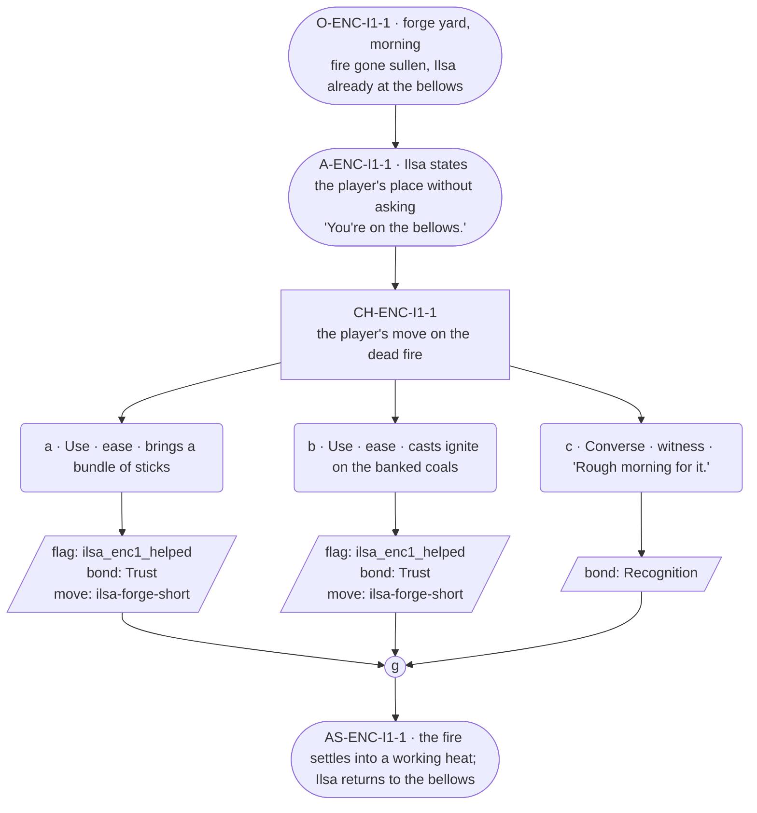

# ENC-ilsa-1 — line comparison

## Approved structure (Phase 1)

Structure (click to expand)

# ENC-ilsa-1 — Blacksmith festival goal, encounter 1 of 3

## Part A — Mini Architect Brief

**Reveal carried:** State 1 of the centerpiece shortfall — the forge won't
hold heat (`ilsa-forge-short` registry, mishap-pool state 1). The pressure
here is the role's, not the family thread's — no Bram material in this
scene.

**State of the shortfall:** Work stalled at the most basic level; nothing
about the ore or the missing part yet.

**Sizing:** 7 beats — 2 setting beats, one 3-option choice node, one
consequence beat, one close.

**Mechanical ruling — pass/fail gate.** Passes on **a** (item) or **b**
(spell) — `knowledge_flag(ilsa_enc1_helped)` + `bond_event(Trust, weight
2)` + `thread_move(ilsa-forge-short)`. **c** — `bond_event(Recognition,
weight 2)` only, no thread move.

**Constraint worth naming:** **No `bond_band()` predicate anywhere in this
scene** — Ilsa's canon flag 11 and her thread registry both bar bond-band
gating outright. Her settled-declarative grammar (arrangements stated
already-true, no question mark) governs her one dialogue line.

---

## Part B — Choice Designer Output

### Content block

**Incoming state (O-ENC-I1-1):** Ilsa's forge yard, morning. The forge
fire has gone sullen — smoke instead of heat. She's already working the
bellows herself, arrangement-first as always.

**A-ENC-I1-1:** She doesn't ask for help. She states where the player is
useful before they've said anything: "You're on the bellows." — settled
present, no proposal grammar, the offer arriving as already-decided fact.

**CH-ENC-I1-1 (3 options, ungated):**
- **a · Use · ease** — `surface_action`: brings a bundle of sticks
  (`item_sticks`) to feed the fire. Ilsa takes them without pausing, works
  them in. Records `knowledge_flag(ilsa_enc1_helped)` + `bond_event(Trust,
  weight 2)` + `thread_move(ilsa-forge-short)`.
- **b · Use · ease** — `surface_action`: casts *ignite* on the banked coals
  (component `item_sticks`). The fire catches properly; Ilsa feels the
  heat change through the bellows handle and adjusts her rhythm to match,
  wordless. Records `knowledge_flag(ilsa_enc1_helped)` + `bond_event(Trust,
  weight 2)` + `thread_move(ilsa-forge-short)`.
- **c · Converse · witness** — `player_line`: "Rough morning for it." —
  Ilsa: "It'll come round." Flat, certain, no elaboration. Records
  `bond_event(Recognition, weight 2)`, no thread move.

Converges at **J-ENC-I1-1**.

**AS-ENC-I1-1:** The fire settles into a working heat either way — visibly
better if a/b, unchanged-but-tended if c. Ilsa goes back to the bellows
without comment.

**Close:** No line closes the scene; the forge's new heat is the closing
image (object slot).

**Action-slot ratio:** 2 action beats across the scene ≈ within range.

**Long-run placement:** None. Her sanctioned long run is reserved for
lineage/household history only, which has no place in a work-stall beat.

**Equal weight:** a and b both restore the fire by a different route; c
respects her self-sufficiency without touching the work — a legitimate
read, since she never asks.

### Mermaid graph

**Self-verify:** parses clean, no `bond_band()` predicate anywhere, ids
scoped `-I1-`, options match prose, genuine gather.

## Generated lines, by model

### setup

| Model | Word count | Text |
|---|---|---|
| styletune | 25 | Smoke drifts from the forge where the fire has gone sullen. Ilsa works the bellows alone, her rhythm steady and practiced. "You're on the bellows." |
| violetlotus | 78 | Ilsa works the bellows steadily, smoke still coiling up from the forge's mouth. She looks over at the player. "You're on the bellows." Her voice is flat, certain. "The near end of the bench is yours." She steps back, giving the player space at the bellows. "Put us down for it, then. That's hands enough, the two of us." She returns to her work, hands sure on the lever. The forge waits, fire ready to be coaxed back. |
| crimson | 35 | Ilsa works the bellows alone, the forge fire smoldering instead of burning. She sees the player arrive and states, "You're on the bellows," her tone flat and certain, as if the task were already theirs. |
| gemma26b | 28 | The forge fire is a sullen thing, casting out smoke instead of heat. Ilsa works the bellows herself, her hands steady on the wood. "You're on the bellows." |

### option_a

| Model | Word count | Text |
|---|---|---|
| styletune | 8 | Ilsa accepts the bundle of sticks without pausing. |
| violetlotus | 103 | The player brings a bundle of sticks to the fire. Ilsa takes them without pausing, works them in. "That's hands enough, the two of us." The forge fire catches properly, and she feels the heat change through the bellows handle. She adjusts her rhythm to match, wordless. "You'll sit here." She indicates the place at the bellows, already decided and stated as fact. The player takes their place, ready to help. The fire settles into a working heat. Ilsa goes back to the bellows without comment, and they work the forge together in a new rhythm. The fire's warmth is the closing image. |
| crimson | 35 | The player brings a bundle of sticks to feed the fire. Ilsa takes them without pausing, works them in. The fire catches properly. "There, that's it," she says, settling into a rhythm with the bellows. |
| gemma26b | 27 | The player brings a bundle of sticks to the forge. Ilsa takes them without pausing and works them into the coals. "It'll take a while to catch." |

### option_b

| Model | Word count | Text |
|---|---|---|
| styletune | 38 | The player casts *ignite* on the banked coals, sending a flare through the forge. Ilsa's hands tighten on the bellows handle as the heat shifts through the metal, her rhythm falling into steady alignment with the new flame. |
| violetlotus | 44 | The player casts ignite on the banked coals, and the fire catches properly. Ilsa feels the heat change through the bellows handle and adjusts her rhythm to match, wordless. The fire settles into a working heat. She goes back to the bellows without comment. |
| crimson | 29 | The player casts *ignite* on the banked coals, and the fire catches properly. Ilsa feels the heat change through the bellows handle, and adjusts her rhythm to match, wordless. |
| gemma26b | 29 | The player casts a spark into the banked coals. The fire catches, and Ilsa feels the heat through the bellows handle, her rhythm settling into a new, steady pace. |

### option_c

| Model | Word count | Text |
|---|---|---|
| styletune | 23 | The player watches the smoke curl from the coals. "Rough morning for it."  Ilsa keeps her rhythm against the bellows. "It'll come round." |
| violetlotus | 36 | Ilsa adjusts the bellows' rhythm, feeling the fire's new heat through the handle. "It'll come round." Flat, certain, no elaboration. The forge fire settles into a working heat. Ilsa goes back to the bellows without comment. |
| crimson | 38 | The player speaks, "Rough morning for it." Ilsa, working the bellows, responds without pause, "It'll come round." Her voice is flat, certain, and she gives no further elaboration. The fire continues to smolder, its state unchanged but tended. |
| gemma26b | 17 | The player says, "Rough morning for it."  Ilsa returns her gaze to the fire. "It'll come round." |

