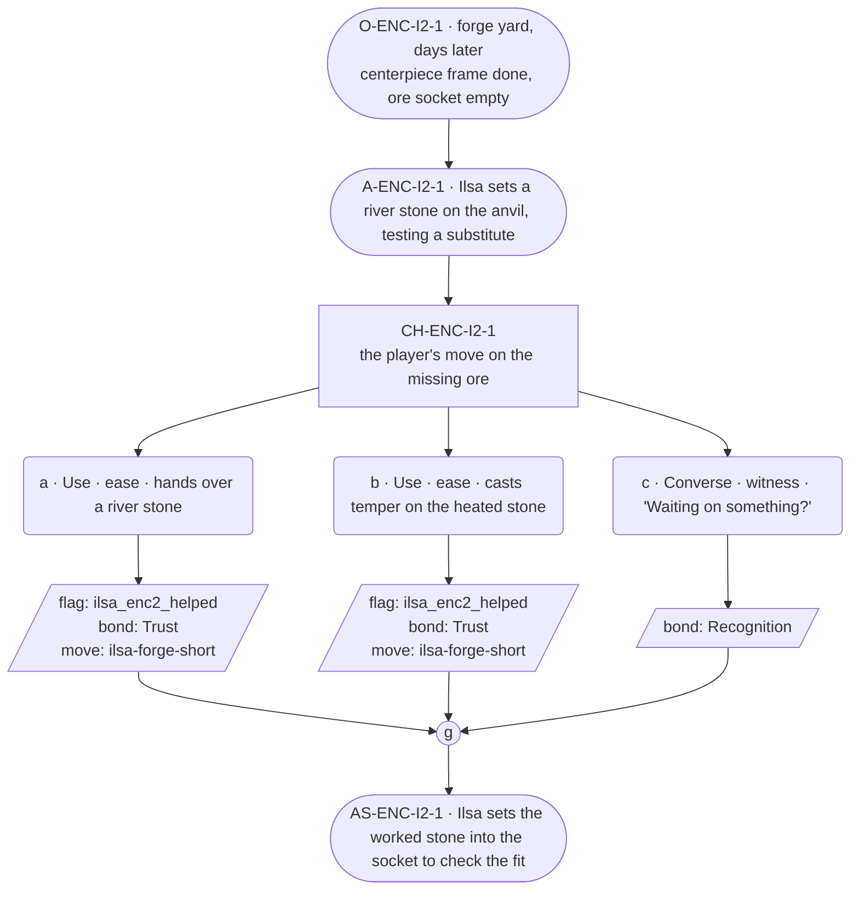

# ENC-ilsa-2 — line comparison

## Approved structure (Phase 1)

Structure (click to expand)

# ENC-ilsa-2 — Blacksmith festival goal, encounter 2 of 3

## Part A — Mini Architect Brief

**Reveal carried:** State 2 — a part is missing, the special ore not in
town yet (`ilsa-forge-short` registry, mishap-pool state 2). This state is
the one that shares its event with `ilsa-kin-no-show` (Bram was to bring
the ore) — this scene reads it from the work's side only, per the
registry's ruling that each thread reads its own facet. No Bram material
surfaces here; that stays `NGT-ilsa`'s territory.

**State of the shortfall:** The centerpiece is stalled on a component she
can't source alone, not on labor.

**Sizing:** 7 beats — 2 setting beats, one 3-option choice node, one
consequence beat, one close.

**Mechanical ruling — pass/fail gate.** Same shape: **a**/**b** passes —
`knowledge_flag(ilsa_enc2_helped)` + `bond_event(Trust, weight 2)` +
`thread_move(ilsa-forge-short)`. **c** — `bond_event(Recognition, weight
2)` only.

**Constraint worth naming:** No `bond_band()` gating. This scene reads the
ore gap as `delta_situation` only (uncapped, per her card's delta_rule) —
it is not a `delta_cast` fact being re-delivered, since the ore's absence
was already established by the registry, referenced here rather than
re-stated as new.

---

## Part B — Choice Designer Output

### Content block

**Incoming state (O-ENC-I2-1):** The forge yard, a few days on. The
centerpiece's frame is done; the socket for the special ore sits empty.
Ilsa has laid out her tools around the gap without naming it.

**A-ENC-I2-1:** She sets a river stone on the anvil — the ore hasn't come,
so she's testing what a substitute would take. No mention of who was
meant to bring it.

**CH-ENC-I2-1 (3 options, ungated):**
- **a · Use · ease** — `surface_action`: hands over a river stone
  (`item_river_stone`) already picked from the forest. Ilsa turns it once
  in the light, sets to work on it as the substitute. Records
  `knowledge_flag(ilsa_enc2_helped)` + `bond_event(Trust, weight 2)` +
  `thread_move(ilsa-forge-short)`.
- **b · Use · ease** — `surface_action`: casts *temper* on the heated stone
  already on the anvil (components `item_river_stone` + `item_spring_water`
  — hardens a hot-worked piece evenly as it cools). The stone sets true on
  the first pass. Ilsa checks the edge with her thumb, says nothing.
  Records `knowledge_flag(ilsa_enc2_helped)` + `bond_event(Trust, weight
  2)` + `thread_move(ilsa-forge-short)`.
- **c · Converse · witness** — `player_line`: "Waiting on something?" —
  Ilsa: "It'll turn up." She doesn't say what. Records `bond_event
  (Recognition, weight 2)`, no thread move.

Converges at **J-ENC-I2-1**.

**AS-ENC-I2-1:** Ilsa sets the worked stone — real or substitute — into
the socket to check the fit. It sits, whichever way this went.

**Close:** No dialogue closes it; the fitted stone in the socket is the
close (object slot).

**Action-slot ratio:** 2 action beats across the scene ≈ within range.

**Long-run placement:** None.

**Equal weight:** a and b both move the substitute-metal path forward by a
different route; c respects that she won't ask outright.

### Mermaid graph

**Self-verify:** parses clean, ids scoped `-I2-`, no bond-band predicate,
options match prose, genuine gather, no long run.

## Generated lines, by model

### setup

| Model | Word count | Text |
|---|---|---|
| styletune | 48 | The forge yard has settled into a familiar rhythm over the past few days. The centerpiece frame stands complete, though the socket for the special ore remains empty. Ilsa has arranged her tools in a careful circle around the gap. She places a river stone on the anvil. |
| violetlotus | 93 | Ilsa stands in the forge yard, the frame of the centerpiece complete. She picks up a river stone from her tools and sets it on the anvil, testing it against the socket meant for the special ore that hasn't arrived. "This will do, for now." She starts to work the stone, her hands sure and steady. The sun climbs, and the anvil glows with the heat of her hammer. No mention of who was supposed to bring the ore, or when it might come. Just the work at hand, and Ilsa's quiet resolve. |
| crimson | 41 | Ilsa lays out her tools around the gaping socket, the empty space a quiet admission of what's missing. She picks up a river stone, turning it once in her calloused hands. "That'll do for now," she says, and sets to work. |
| gemma26b | 36 | The forge yard is quiet and the centerpiece's frame stands finished. Ilsa has laid her tools in a wide arc around the empty socket. She sets a river stone upon the anvil. "This is a start." |

### option_a

| Model | Word count | Text |
|---|---|---|
| styletune | 24 | The player hands over a river stone from the forest. Ilsa turns the stone once in the light before setting to work on it. |
| violetlotus | 113 | Ilsa turns the river stone over in her hands, studying its edges. "This'll do," she says, setting it on the anvil. "We'll make it work." She picks up her hammer and begins shaping the stone, the strikes echoing through the forge yard. The player sets another river stone beside the first, its surface already smooth from the forest floor. "There's more," they say, and Ilsa nods, her eyes on her work. "Good," she replies, "we'll need them." The hammer rings again, and the stone begins to take shape, a piece of the missing puzzle sliding into place. Ilsa doesn't look up, but the rhythm of her work seems to ease, a small smile |
| crimson | 34 | The player hands Ilsa a river stone, already picked from the forest. Ilsa turns it once in the light, sets to work on it as the substitute. "That's hands enough, the two of us." |
| gemma26b | 23 | The player hands over a river stone. Ilsa turns it once in the light and sets to work on it. "This will do." |

### option_b

| Model | Word count | Text |
|---|---|---|
| styletune | 26 | The player casts temper on the heated stone as it cools. The stone sets true on the first pass. Ilsa checks the edge with her thumb. |
| violetlotus | 68 | Ilsa casts *temper* on the heated stone already on the anvil, evening its hardening as it cools. The stone sets true on the first pass. She checks the edge with her thumb, says nothing. "The stone's set, Ilsa," the player says. Ilsa nods. "It'll do for now. Thanks for the help." She sets the worked stone into the socket, checking the fit. It sits, the substitute in place. |
| crimson | 72 | Ilsa nods at the player's suggestion, her hands already moving to the components. "Might as well see," she says, placing the river stone on the anvil and heating it. The player watches as she sprinkles spring water over the glowing stone, whispering a spell. The stone hisses and hardens, and Ilsa picks it up, turning it in the light. "That'll do," she says, fitting it into the socket with a satisfied nod. |
| gemma26b | 23 | The player casts temper over the heated stone. It sets true on the first pass, and Ilsa checks the edge with her thumb. |

### option_c

| Model | Word count | Text |
|---|---|---|
| styletune | 16 | The player asks, "Waiting on something?"  Ilsa continues her work without looking up. "It'll turn up." |
| violetlotus | 108 | The player: "Waiting on something?"  Ilsa: "It'll turn up." She doesn't say what. The anvil stands between them, the stone on it waiting. Ilsa's hands hover, not starting yet. She meets the player's eyes, silent, then looks back at the stone, hands still. A moment passes, neither speaking, then Ilsa turns back to her work, picking up a hammer, the question left unanswered. The stone awaits, whatever its future. The player watches, standing close, as Ilsa begins to shape it. No more words pass between them, just the rhythm of metal on stone, the clink and spark. The player understands, without a single extra word, that this is |
| crimson | 71 | Ilsa looks up as the player approaches, her expression unreadable. "Waiting on something?" the player asks. Ilsa's gaze returns to the anvil. "It'll turn up," she says, her voice flat and certain, as if the very fact of her words makes it so. She doesn't elaborate on what exactly will turn up, and the player is left to wonder as Ilsa resumes her work, the unspoken question hanging in the air. |
| gemma26b | 14 | The player asks, "Waiting on something?"  Ilsa does not look up. "It'll turn up." |

