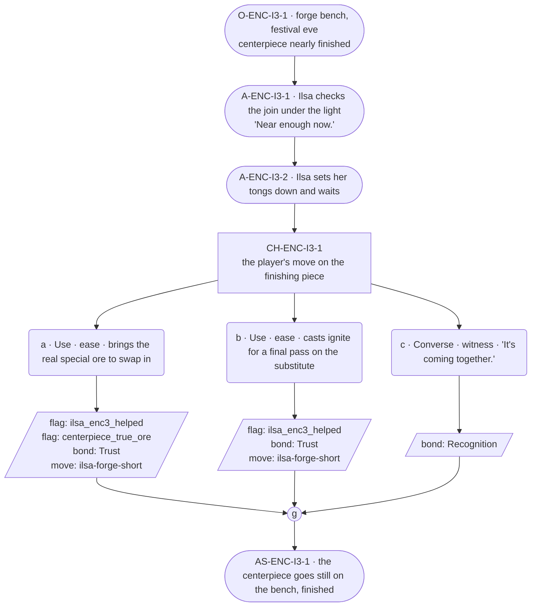

# ENC-ilsa-3 — line comparison

## Approved structure (Phase 1)

Structure (click to expand)

# ENC-ilsa-3 — Blacksmith festival goal, encounter 3 of 3

## Part A — Mini Architect Brief

**Reveal carried:** State 3 — closing state. Per the registry's ruled
outcome, without the real ore she finishes in replacement metal (the shape
but not the substance); the player can source the real ore to branch the
Arch to actually complete. This encounter stages that fork mechanically, at
compact scale.

**State of the shortfall:** The centerpiece is nearly done either way —
what differs is which metal finishes it. Both endings are authored; a
lit festival under a look-right piece is not a loss state (registry's own
ruling).

**Sizing:** 8 beats — 3 setting beats (the extra one stages the fork), one
3-option choice node, one consequence beat, one close.

**Mechanical ruling — pass/fail gate.** **a** (item: the real ore) or **b**
(spell: finishing the work with what's on hand) both pass —
`knowledge_flag(ilsa_enc3_helped)` + `bond_event(Trust, weight 2)` +
`thread_move(ilsa-forge-short)` — but **a** additionally records
`knowledge_flag(centerpiece_true_ore)`, branching the Arch's finish per
the registry's ruled outcome; **b** does not set that flag, so the
replacement-metal ending stands. **c** — `bond_event(Recognition, weight
2)` only, no thread move, no branch flag — a real fail path this time,
since it's the closing encounter.

**Constraint worth naming:** No `bond_band()` predicate. Neither ending
(true ore vs. replacement metal) is narrated as better in-scene — the
registry states explicitly that a lit festival under the wrong-metal piece
is not a loss state, so options a and b stay equal weight even though they
set different world flags.

---

## Part B — Choice Designer Output

### Content block

**Incoming state (O-ENC-I3-1):** Festival eve. The centerpiece stands
nearly finished on the bench, the socket still holding the substitute
stone from encounter 2 unless it's been swapped.

**A-ENC-I3-1:** Ilsa turns the piece under the light, checking the join.
"Near enough now" — settled, no elaboration.

**A-ENC-I3-2:** She sets her tongs down and waits — the first time in the
arc she's visibly not mid-task when the player arrives.

**CH-ENC-I3-1 (3 options, ungated):**
- **a · Use · ease** — `surface_action`: brings the real special ore
  (`item_river_stone`, sourced from the forest per the registry's branch
  condition) to swap into the socket. Ilsa sets it in, checks the seat,
  says nothing — but works a beat longer over this one than the
  substitute. Records `knowledge_flag(ilsa_enc3_helped)` +
  `knowledge_flag(centerpiece_true_ore)` + `bond_event(Trust, weight 2)` +
  `thread_move(ilsa-forge-short)`.
- **b · Use · ease** — `surface_action`: casts *ignite* one last time to
  re-heat the join for a final pass on the substitute piece. Ilsa finishes
  the seam, sets her tools down. Records
  `knowledge_flag(ilsa_enc3_helped)` + `bond_event(Trust, weight 2)` +
  `thread_move(ilsa-forge-short)`.
- **c · Converse · witness** — `player_line`: "It's coming together." —
  Ilsa: "It is." Nothing more offered. Records `bond_event(Recognition,
  weight 2)`, no thread move.

Converges at **J-ENC-I3-1**.

**AS-ENC-I3-1:** The centerpiece goes still on the bench, finished — true
ore or substitute, the shape complete either way.

**Close:** No line closes it; the finished piece under evening light is
the close (object slot).

**Action-slot ratio:** 3 action beats across the scene ≈ within range.

**Long-run placement:** None.

**Equal weight:** a and b both finish the piece; only the world-state flag
differs, and the registry itself rules neither ending a loss. c is a
legitimate final visit.

### Mermaid graph

**Self-verify:** parses clean, ids scoped `-I3-`, no bond-band predicate,
options match prose, genuine gather, no long run, world-branch flag stated
without ranking the two endings.

## Generated lines, by model

### setup

| Model | Word count | Text |
|---|---|---|
| styletune | 32 | The centerpiece sits nearly finished on the workbench, the socket still holding the substitute stone from the river. Ilsa turns the piece under the lamp and examines the join. "Near enough now." |
| violetlotus | 111 | Ilsa waits, the centerpiece nearly finished on the bench, the substitute stone still in the socket. She sets her tools down, the first time she's visibly not mid-task as the player arrives. "Near enough now," she says, settled, no elaboration. The light through the workshop window casts shadows across the piece, illuminating the intricate join that holds it together. She looks up at the player, her expression neutral but warm in a way that seems to welcome their presence. The workshop is quiet, the only sound the soft hum of the furnace in the corner, waiting for its next task. Ilsa's hands rest on the workbench, ready for what comes next. |
| crimson | 86 | Ilsa stands at her bench, the last piece of the centerpiece still in her hands, the socket awaiting its final stone. She turns it under the light, a slow, deliberate inspection, before setting it down with a soft clink. Her gaze lifts, and she sees the player enter the forge. "You're on time," she says, as if it were a fact, not a compliment. She sets a stool near the bench with a gesture of invitation, the place already yours. "Here," she states, warm and matter-of-fact. |
| gemma26b | 13 | Ilsa turns the piece under the light, checking the join. "Near enough now." |

### option_a

| Model | Word count | Text |
|---|---|---|
| styletune | 21 | The player slides the river stone into the socket. Ilsa sets it in place and examines the seat. "It fits now." |
| violetlotus | 64 | Ilsa sets the real special ore into the socket, checking the seat with care. She works over this piece a beat longer than the substitute, her hands steady and sure. The centerpiece stands finished, the true ore gleaming under the light. "It's done," she says, her voice flat and satisfied. "Let's go home." She gathers her tools and begins to pack up the forge. |
| crimson | 69 | The player takes out the special river stone and sets it into the socket. Ilsa picks it up, checks the fit, then pushes it home with a sure touch. She runs a bead of flux around the join, picks up her torch, and heats the stone until the solder liquefies and flows. When it cools, the fit is perfect. "That's hands enough," she says, and sets her tools down. |
| gemma26b | 40 | The player brings the river stone to the bench and sets it in the socket. Ilsa fits the ore into the join, her eyes on the seam, and she works it for a moment longer than she did the substitute. |

### option_b

| Model | Word count | Text |
|---|---|---|
| styletune | 22 | The player casts *ignite* over the joint. Ilsa works the seam until it seats, then sets her tools down. "It is finished." |
| violetlotus | 10 | Ilsa finishes the seam, sets her tools down. "It'll do." |
| crimson | 37 | Ilsa takes up the tongs again at the player's gesture, and re-heats the join one last time. She works the seam with steady focus until the line is smooth, then sets her tools down. "That's enough now." |
| gemma26b | 20 | The player casts a brief, warm light over the seam. "It's coming together."  Ilsa sets her tongs aside. "It is." |

### option_c

| Model | Word count | Text |
|---|---|---|
| styletune | 18 | The player watches the metal settle into place. "It's coming together."  Ilsa nods toward the work. "It is." |
| violetlotus | 71 | The player sets the tray down. "It's coming together." Ilsa looks up from her work, her face softening for a moment. "It is." Then she turns back to her tools, the space between them filled with unspoken understanding. A bond, forged in silence and shared purpose, holds strong. `bond_event(Recognition, weight 2)` is recorded, but no thread move occurs, as the scene finds its natural close with the completion of the centerpiece. |
| crimson | 8 | Ilsa looks up from the centerpiece. "It is." |
| gemma26b | 13 | "It's coming together."  The player watches the centerpiece, then Ilsa nods. "It is." |

