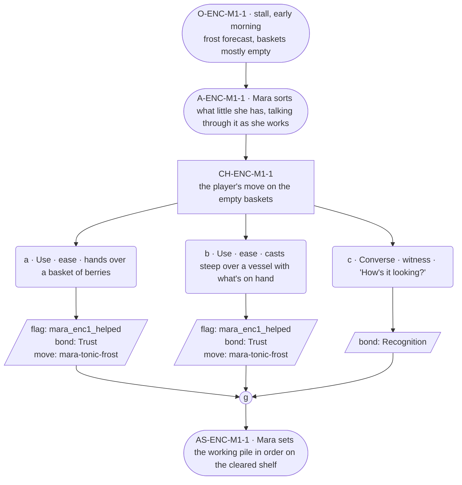

# ENC-mara-1 — line comparison

## Approved structure (Phase 1)

Structure (click to expand)

# ENC-mara-1 — Herbalist festival goal, encounter 1 of 3

## Part A — Mini Architect Brief

**Reveal carried:** State 1 of the tonic shortfall — herbs still out in
the forest as the frost nears (`mara-tonic-frost` registry, mishap-pool
state 1). First encounter; nothing prior assumed.

**State of the shortfall:** Nothing gathered yet against a hard deadline —
the frost, not a person, is the pressure.

**Sizing:** 7 beats — 2 setting beats, one 3-option choice node, one
consequence beat, one close.

**Mechanical ruling — pass/fail gate.** **a**/**b** passes —
`knowledge_flag(mara_enc1_helped)` + `bond_event(Trust, weight 2)` +
`thread_move(mara-tonic-frost)`. **c** — `bond_event(Recognition, weight
2)` only, no thread move.

**Constraint worth naming:** This is role-goal pressure (time itself), not
a grief beat — her card's fragments-only rule governs *loss* content
specifically, not ordinary work dialogue. Her ordinary line still sits in
the 20-50 word band per her card, distinct from the village median.

---

## Part B — Choice Designer Output

### Content block

**Incoming state (O-ENC-M1-1):** Mara's stall, early morning, frost
forecast for the week's end. Baskets sit mostly empty on the counter.

**A-ENC-M1-1:** Mara is already sorting what little she has, running on
longer than the village median as her card allows — she explains what
each half-basket still needs while her hands keep moving.

**CH-ENC-M1-1 (3 options, ungated):**
- **a · Use · ease** — `surface_action`: hands over a basket of berries
  (`item_berry`) gathered from the clearing. Mara checks them, nods, adds
  them to the working pile. Records `knowledge_flag(mara_enc1_helped)` +
  `bond_event(Trust, weight 2)` + `thread_move(mara-tonic-frost)`.
- **b · Use · ease** — `surface_action`: casts *steep* over a vessel of
  water with what herbs are on hand (components `item_berry` +
  `item_spring_water` — draws the virtue into the water, fast). Mara
  watches the color change, sets the vessel aside to work. Records
  `knowledge_flag(mara_enc1_helped)` + `bond_event(Trust, weight 2)` +
  `thread_move(mara-tonic-frost)`.
- **c · Converse · witness** — `player_line`: "How's it looking?" — Mara:
  "Tight, but it keeps." No task changes hands. Records `bond_event
  (Recognition, weight 2)`, no thread move.

Converges at **J-ENC-M1-1**.

**AS-ENC-M1-1:** Mara sets the working pile in order on the cleared shelf
— the same shelf her thread registry's `mara-set-for-two` scene later uses
for the drawer's sorting; referenced, not re-delivered.

**Close:** No line closes it; the ordered shelf is the close (object
slot).

**Action-slot ratio:** 2 action beats across the scene ≈ within range.

**Long-run placement:** None marked — her uncapped licence is reserved for
provenance, not for shortfall logistics.

**Equal weight:** a and b both add to the gathered stock by a different
route; c respects the work without adding to it.

### Mermaid graph

**Self-verify:** parses clean, ids scoped `-M1-`, options match prose,
genuine gather, no long run, no invented backstory.

## Generated lines, by model

### setup

| Model | Word count | Text |
|---|---|---|
| styletune | 45 | Frost clings to the wooden counter where Mara sorts the remaining stock into small clusters. "These half-baskets need to stay dry until the morning thaw, as the moisture will spoil the potency, but we'll manage if we keep them covered and close to the hearth." |
| violetlotus | 116 | Mara is already sorting what little she has, running on longer than the village median as her card allows — she explains what each half-basket still needs while her hands keep moving. "The frost'll be in by week's end," she says, "so we're down to what the ground gives up." She holds up a small bunch of berries, dark and tight to the stem. "These'll keep, though. Good for the tonic." Her voice is warm, exact, and present as she works. "It's all in how you store them." She sets the berries down with care and turns to the player. "We could use more of these, if you've a mind to gather. The clearing's not far |
| crimson | 38 | Mara sorts the few remaining items in her baskets, her hands moving with practiced efficiency. "The frost will be here by week's end," she murmurs, setting aside a wilted sprig. "We'll need to make sure the cellar's well-stocked." |
| gemma26b | 62 | Mara sorts the remaining bundles on the counter, her fingers working with a steady rhythm as she glances toward the frosted window. "The frost stays for the week, it looks," she says, her voice as calm as the morning. "We'll have to keep the baskets close to the hearth, and make sure the covers are pulled tight, just as they were before." |

### option_a

| Model | Word count | Text |
|---|---|---|
| styletune | 50 | The player sets the basket of berries down. Mara inspects each small fruit with quick fingers before tucking them into the working pile. "These will do nicely for the base, and I'm glad you brought them by, as the clearing always yields the sweetest harvest before the first hard freeze." |
| violetlotus | — | **FAILED**: leakage: out-of-scene character invented: 'Toby' is not in this scene's notes |
| crimson | 44 | The player hands over a basket of berries gathered from the clearing. Mara checks them, nods, adds them to the working pile. "Good, another set of hands. Hold this a second, mind the third step, and tell me your name while you're at it." |
| gemma26b | 43 | The player hands over a basket of berries gathered from the clearing. Mara checks their color and firmness, then adds them to the working pile. "These will hold, even with the frost coming, if we keep them in the cool of the cellar." |

### option_b

| Model | Word count | Text |
|---|---|---|
| styletune | 40 | The player casts *steep* over the water as the liquid swirls, drinking in the berries and spring water until the vessel deepens to a rich hue. Mara watches the color shift with interest and sets the bottle aside to work. |
| violetlotus | 57 | Mara watches the color change, sets the vessel aside to work. "It's a start. The rest we'll have to gather ourselves — the village is tight, but it keeps." She turns to the player. "Good, another set of hands — hold this a second, mind the third step, and tell me your name while you're at it." |
| crimson | 47 | The player casts *steep* over a vessel of water with what herbs are on hand. Mara watches the color change, sets the vessel aside to work. "That's the way, right?" the player asks. Mara nods, "Exactly so. Good hands you have. We'll make a proper tonic yet." |
| gemma26b | 36 | The player casts a steep over the vessel, pulling the virtue into the spring water. Mara watches the color change, then sets the vessel aside to work. "That'll do. The frost is coming, but it keeps." |

### option_c

| Model | Word count | Text |
|---|---|---|
| styletune | 38 | The player asks, "How's it looking?"  Mara continues sorting through the remaining stock, her fingers working quickly. "Tight, but it keeps. We have what we need to see us through, so long as we tend to it properly." |
| violetlotus | 119 | Mara pauses in her sorting, glances up as the player approaches. "Tight, but it keeps." She resumes her work, fingers precise and sure. "The berries are a help, but we're running short of what keeps. A good tonic, and we might see the week through." Her eyes flick to a corner of the stall, where a basket waits, empty and ready. "You know your way around a still, I take it?" Her hands never stop moving, even as she turns to face the player, a question in her eyes and on her lips. "We could use the help, if you've a mind to lend a hand." She gestures to the herbs laid out on the counter, a silent invitation |
| crimson | 61 | Mara looks up from her work, meeting the player's eyes as they speak. "How's it looking?" she says, "Tight, but it keeps." Her hands never stop moving, sorting and arranging the contents of her stall with practiced efficiency. She gestures to the mostly empty baskets. "The frost's coming — we'll need every bit of this to make it through the week." |
| gemma26b | 18 | "How's it looking?"  Mara adjusts the remaining baskets, her gaze sweeping the empty shelf. "Tight, but it keeps." |

