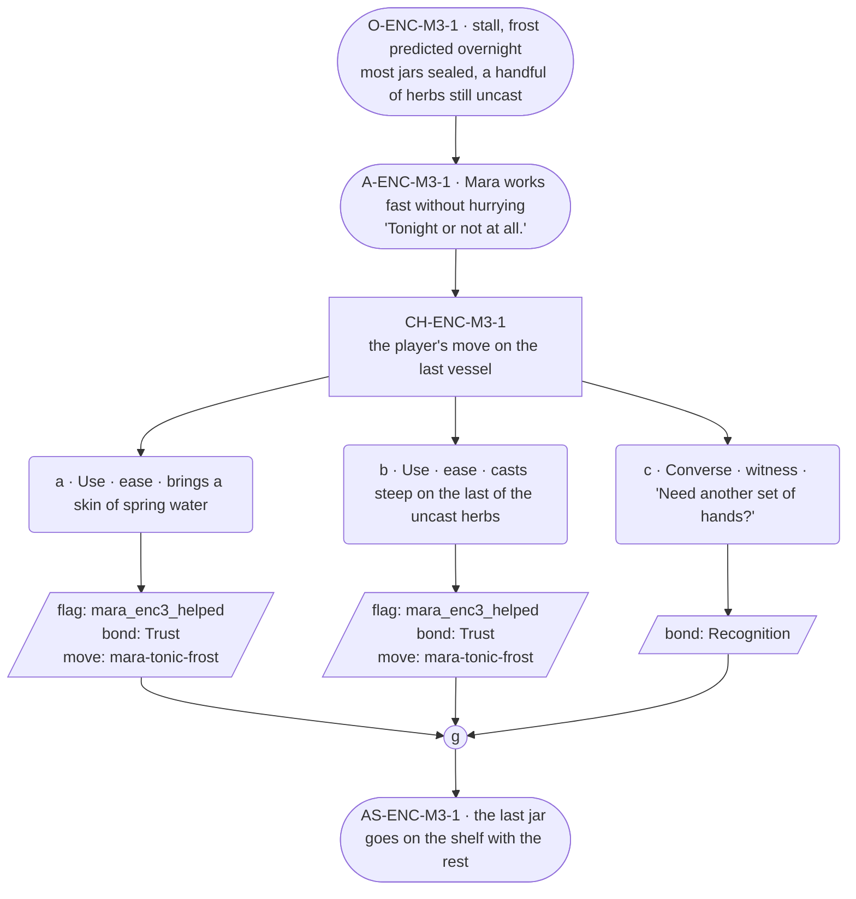

# ENC-mara-3 — line comparison

## Approved structure (Phase 1)

Structure (click to expand)

# ENC-mara-3 — Herbalist festival goal, encounter 3 of 3

## Part A — Mini Architect Brief

**Reveal carried:** State 3 — done or short (`mara-tonic-frost` registry,
closing state). The last push before the frost actually lands.

**Sizing:** 7 beats — 2 setting beats, one 3-option choice node, one
consequence beat, one close.

**Mechanical ruling — pass/fail gate.** **a**/**b** passes —
`knowledge_flag(mara_enc3_helped)` + `bond_event(Trust, weight 2)` +
`thread_move(mara-tonic-frost)`. **c** — `bond_event(Recognition, weight
2)` only, no thread move — the real fail path this time, since it's the
closing encounter.

**Constraint worth naming:** Still no drawer object, still no loss content
— this stays a work-pressure beat to the end, keeping the essence-thread
material (`NGT-mara`) undiluted for its own scene.

---

## Part B — Choice Designer Output

### Content block

**Incoming state (O-ENC-M3-1):** The stall, frost predicted overnight.
Most jars are filled and sealed; a handful of herbs sit uncast on the
counter.

**A-ENC-M3-1:** Mara works fast without hurrying — her hands the only
thing that speed up. "Tonight or not at all," said once, flat.

**CH-ENC-M3-1 (3 options, ungated):**
- **a · Use · ease** — `surface_action`: brings a skin of spring water
  (`item_spring_water`) for the last vessel. Mara pours it in without
  breaking her rhythm. Records `knowledge_flag(mara_enc3_helped)` +
  `bond_event(Trust, weight 2)` + `thread_move(mara-tonic-frost)`.
- **b · Use · ease** — `surface_action`: casts *steep* on the last of the
  uncast herbs. The color turns fast; Mara sets the finished vessel with
  the rest. Records `knowledge_flag(mara_enc3_helped)` +
  `bond_event(Trust, weight 2)` + `thread_move(mara-tonic-frost)`.
- **c · Converse · witness** — `player_line`: "Need another set of
  hands?" — Mara: "Not tonight." Keeps working alone. Records
  `bond_event(Recognition, weight 2)`, no thread move.

Converges at **J-ENC-M3-1**.

**AS-ENC-M3-1:** The last jar goes on the shelf with the rest — the row
complete or one short, depending on the pick.

**Close:** No line closes it; the shelf, full or nearly full, is the close
(object slot).

**Action-slot ratio:** 2 action beats across the scene ≈ within range.

**Long-run placement:** None — barred at this proximity to the deadline
payoff, same discipline as the deep-three cards apply at their own
payoffs.

**Equal weight:** a and b both finish the last vessel by a different
route; c is a legitimate final visit that respects her working alone.

### Mermaid graph

**Self-verify:** parses clean, ids scoped `-M3-`, options match prose,
genuine gather, no long run, no drawer object used.

## Generated lines, by model

### setup

| Model | Word count | Text |
|---|---|---|
| styletune | 32 | Mara works fast without hurrying, her hands moving in practiced motions to fill the remaining jars while frost threatens the night ahead. "Tonight or not at all," she says, her voice flat. |
| violetlotus | 126 | Mara stands at the counter of her herb stall, her hands moving swiftly as she measures out the last of the winter's herbs into a stone mortar. The air is thick with the scent of dried leaves and earth. "Tonight or not at all," she mutters, her voice flat and determined as she begins to grind the herbs into a fine powder. The frost is predicted overnight, and the last of the tonics need to be made before the first light of dawn. She works without hurrying, her hands steady and sure, knowing that the herbs' potency depends on the precise rhythm of her movements. The lanterns used to hang right there — mind your step, they'll be up again by evening, same as every year. |
| crimson | 95 | The lanterns used to hang right there — mind your step, they'll be up again by evening, same as every year. Mara pours the last of the spring water into the final vessel, her hands steady as she seals the jar with practiced ease. "Tonight or not at all," she murmurs, setting it down among the row of identical jars on the counter. She straightens up, stretching her back as she surveys the almost-complete line. Only a handful of herbs remain, waiting for the last spell to make them into tonics against the predicted frost. |
| gemma26b | 57 | The jars sit in a neat row, most of them already sealed, while a few sprigs of herbs remain uncast upon the counter. Mara works with a quick, steady hand, never hurrying her movements even as the frost begins to gather. "Tonight or not at all," she says, her voice flat against the quiet of the room. |

### option_a

| Model | Word count | Text |
|---|---|---|
| styletune | 44 | The player places the skin of spring water on the counter. Mara accepts it and pours the liquid steadily into the final vessel. "This will do perfectly—the water has the right clarity for this batch, and it saves us the trip to the well." |
| violetlotus | 122 | The player brings a skin of spring water to the counter. Mara pours it into the last vessel without pausing her work. "Tonight or not at all," she says flatly. The water turns the herbs a deep shade of green as she sets the finished jar among the others. "That's the last of them," she says, wiping her hands on her apron. "The frost will hold till dawn, then we'll see what we've saved." Her voice carries a quiet satisfaction, the job well done before the season's first freeze. The row of jars gleams under the lantern light, a silent testament to her careful work. She turns to the player, her eyes meeting theirs for a moment before she begins to clean |
| crimson | 75 | The player brings a skin of spring water to the counter. Mara pours it into the last vessel without missing a beat. "Good, another set of hands," she says, not looking up. "Hold this a second, mind the third step, and tell me your name while you're at it." She hands the player a bundle of herbs to keep steady while she ties them with a string. "Mara, right?" she asks, already knowing the answer. |
| gemma26b | 44 | The player sets a skin of spring water on the counter. Mara pours the liquid into the final vessel without breaking her rhythm. "Good, another set of hands—hold this a second, mind the third step, and tell me your name while you're at it." |

### option_b

| Model | Word count | Text |
|---|---|---|
| styletune | 27 | The player casts *steep* on the last of the uncast herbs, watching as the color deepens rapidly. Mara sets the finished vessel with the others and nods. |
| violetlotus | 82 | Mara casts *steep* on the last of the uncast herbs. The color turns fast; she sets the finished vessel with the rest. "That's the last of them. Good — I'll be able to get the cellar doors closed before dark." She wipes her hands on her apron, looking over the shelf of jars. "This is the most I've ever had ready this early. Thanks for your help." She opens the cellar door, the cool air rushing up to meet her. "After you." |
| crimson | 41 | The player casts *steep* on the last of the uncast herbs. The color turns fast; Mara sets the finished vessel with the rest. "The frost comes, but the spell holds," she says, her hands already moving on to the next task. |
| gemma26b | 24 | The player casts a steep on the last of the herbs. Mara sets the finished vessel with the rest. "Tonight or not at all." |

### option_c

| Model | Word count | Text |
|---|---|---|
| styletune | 37 | The player offers a steady hand to assist with the work. "Need another set of hands?" Mara doesn't look up from the glass, her fingers moving in a practiced arc as she seals the cork. "Not tonight." |
| violetlotus | 51 | The player: "Need another set of hands?"  Mara: "Not tonight." She keeps working alone, her hands never slowing as she finishes the last of the jars. "Tonight or not at all," she says again, this time with a faint sigh. The words are the only hint of the pressure she's under. |
| crimson | 18 | "Need another set of hands?" Mara paused, then resumed her work. "Not tonight," she said, not looking up. |
| gemma26b | 15 | The player asks, "Need another set of hands?" Mara doesn't stop her work. "Not tonight." |

