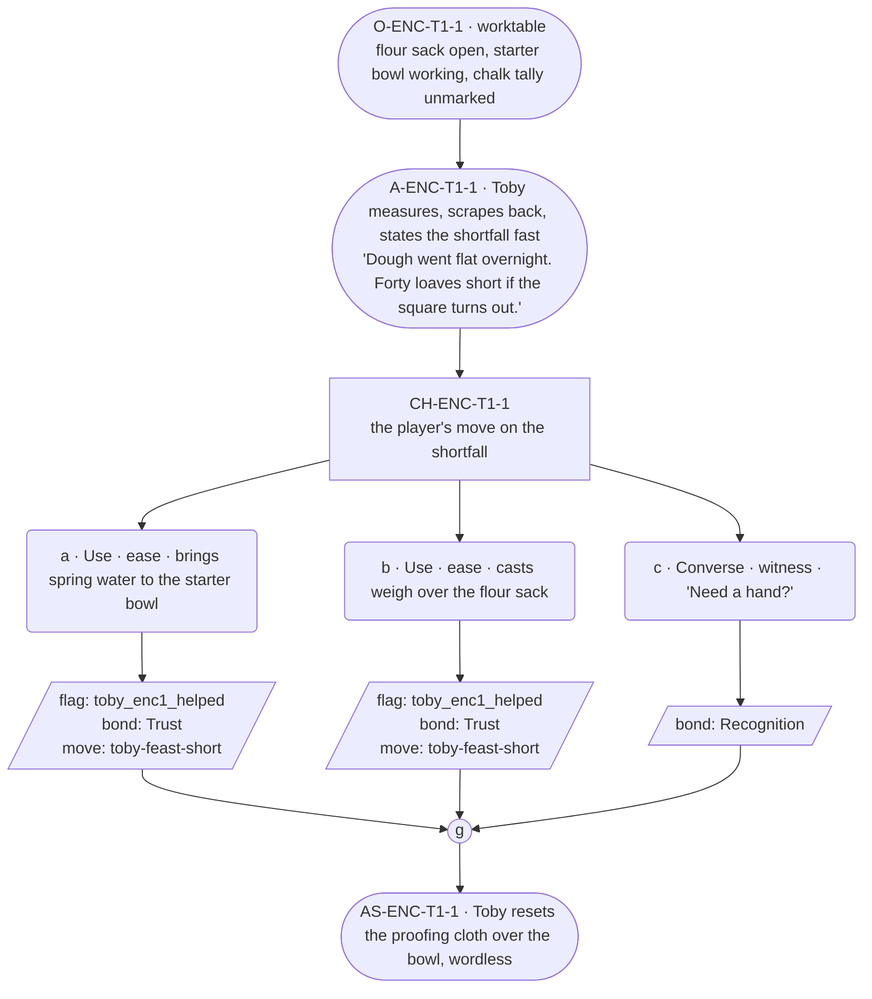

# ENC-toby-1 — line comparison

## Approved structure (Phase 1)

Structure (click to expand)

# ENC-toby-1 — Baker festival goal, encounter 1 of 3

## Part A — Mini Architect Brief

**Reveal carried:** The shortfall's first state — dough flat overnight, forty
loaves short if the square turns out (`toby.md` scene `bakery-feast-dough`;
`toby-feast-short` registry row, state 1: "dough flat"). The player's first
run at this encounter; nothing prior assumed.

**State of the shortfall:** Toby has already converted the crisis to
arithmetic before the player says anything — this is his `deflection_target`
in motion. The exact remaining count stays vague this encounter (reserved
for later states); what's visible is flour out, a starter that needs
building, and Toby already mid-task.

**Sizing:** 7 beats total — 2 scene-setting beats, one 3-option choice node,
one consequence beat, one close. One choice point, 2-3 options gathering to
a close, per the run's scene-size ruling.

**Mechanical ruling — pass/fail gate.** `ENC-toby-1` passes when the player
picks option **a** (item help) or **b** (spell help) — either records
`knowledge_flag(toby_enc1_helped)` + `bond_event(Trust, weight 2)` +
`thread_move(toby-feast-short)`. Option **c** (conversational/witness) does
not advance the thread — Toby is grateful for the company but the shortfall
doesn't move — records `bond_event(Recognition, weight 2)` only, no
`thread_move`. Still fully playable and warm; nothing punishes the fail
path. All three `ENC-toby-*` need an a/b pick this run for the feast to
finish.

**Constraint worth naming:** Toby's card bars any long run while he is
receiving, thanked, or seen. This encounter's help beat *is* a receiving
beat if the player succeeds, so the one licensed long run (if used at all)
sits at the arithmetic/logistics moment **before** help lands, never after.
Warmth stays constant regardless of pick — no option reads as the "nicer"
one.

---

## Part B — Choice Designer Output

### Content block

**Incoming state (O-ENC-T1-1):** Toby's worktable, morning. His flour sack
is open, a bowl of starter working beside it. A chalk tally leans against
the sack — marks made, none crossed off yet. He doesn't stop his hands when
the player enters.

**A-ENC-T1-1 (action beat, no choice):** Toby measures a scoop, frowns,
scrapes it back. He says, without looking up, that the dough went flat
overnight and the square's forty loaves short if the whole town turns out
— arithmetic delivered fast, one thought per turn, the shortfall converted
to a number before it can register as anything else. *(Not the sanctioned
long run — this stays under 40 words; it's Toby's ordinary tempo, not the
licensed exception.)*

**CH-ENC-T1-1 (3 options, ungated):** The player's move.
- **a · Use · ease** — `surface_action`: brings a skin of spring water over
  to the starter bowl (`item_spring_water`). Toby glances at it, says
  nothing, works it into the starter without breaking stride — the
  starter takes faster with it. Records `knowledge_flag(toby_enc1_helped)`
  + `bond_event(Trust, weight 2)` + `thread_move(toby-feast-short)`.
- **b · Use · ease** — `surface_action`: casts *weigh* over the flour sack
  (component `item_river_stone`; `content/magic/ignite.json`-sibling
  record `weigh.json` — bears the sack a hand's breadth, tells him exactly
  what's left without a scale big enough for the whole square). Toby reads
  the number off the air, recalculates out loud in three words, keeps
  going. Records `knowledge_flag(toby_enc1_helped)` +
  `bond_event(Trust, weight 2)` + `thread_move(toby-feast-short)`.
- **c · Converse · witness** — `player_line`: "Need a hand?" — Toby
  hesitates a half-beat, says "Not yet," keeps working. Records
  `bond_event(Recognition, weight 2)`, no `thread_move` — the fail path,
  still warm, still visited.

All three converge at **J-ENC-T1-1**.

**AS-ENC-T1-1 (action beat, post-gather):** Toby resets the proofing
cloth over the starter bowl — a small wordless beat marking the visit's
close, regardless of pick.

**Close:** The scene ends on Toby already reaching for the next task —
outward-animated, per his card, since nothing here put him in the
receiving-flat register long enough to hold.

**Action-slot ratio:** 2 action beats (A-ENC-T1-1, AS-ENC-T1-1) across the
scene's one choice node ≈ within the 1-per-3-to-5 range at this compact
scale.

**Long-run placement:** None marked in this scene — the arithmetic beat
stays under 40 words on purpose, since a marked long run here would sit one
beat too close to the receiving moment his card bars it from.

**Equal weight:** Options a and b are two equally valid ways to help
(item vs. role-spell) — neither is "the" answer, both pass the encounter,
both cost the player the same reach into their pack/mana. Option c respects
Toby's want without solving anything, which is itself a legitimate read —
he never pushes the player to intervene.

### Mermaid graph

**Self-verify:** mermaid parses (`flowchart TD`, no id collisions, stadium
for non-choice beats per the c1 exemplar's convention, correct shapes for
choice/option/records/gather). Every option appears once, prose and
diagram match ids exactly. Genuine gather at `J1` before the close beat.
Pass/fail stated mechanically, not just as flavor.

## Generated lines, by model

### setup

| Model | Word count | Text |
|---|---|---|
| styletune | 27 | Toby measures a scoop of flour and frowns, scraping the contents back into the sack. "Dough went flat overnight. Square's forty loaves short if everyone shows up." |
| violetlotus | 98 | Toby's worktable, morning. His flour sack is open, a bowl of starter working beside it. A chalk tally leans against the sack — marks made, none crossed off yet. He doesn't stop his hands when the player enters. Toby measures a scoop, frowns, scrapes it back. He says, without looking up, "The dough went flat overnight, and we're forty loaves short if the whole town turns out — the starter takes faster with water." He pours in a stream from the nearby skin, the starter rising visibly, and keeps measuring, counting under his breath. "That'll make it. Thanks." |
| crimson | 48 | Toby measures a scoop, frowns, scrapes it back. He says, without looking up, "Dough went flat overnight. Square's forty loaves short if the whole town turns out — arithmetic delivered fast, one thought per turn, the shortfall converted to a number before it can register as anything else." |
| gemma26b | 28 | Toby measures a scoop of flour, frowns, and scrapes it back into the sack. "Dough went flat overnight. If the whole square turns out, we're forty loaves short." |

### option_a

| Model | Word count | Text |
|---|---|---|
| styletune | 32 | The player brings over a skin of spring water and pours it into the bowl. Toby glances at the container, says nothing, and works the liquid into the mixture without breaking stride. |
| violetlotus | 114 | The player brings a skin of spring water over to the starter bowl. Toby glances at it, says nothing, works it into the starter without breaking stride — the starter takes faster with it. "The water's good. It'll tighten the crumb." He scoops, measures, recalculates the square's yield again in three words. His hands stay steady. "If we can get the first rise high enough." He doesn't slow down. "The square's still short." The water's help is acknowledged but not thanked — a fact, not a gift. The player's contribution is absorbed into the task. Toby keeps counting out the day's work, one number per thought, as if it's all he has to say |
| crimson | 33 | The player brings a skin of spring water over to the starter bowl. Toby glances at it, says nothing, works it into the starter without breaking stride. The starter takes faster with it. |
| gemma26b | 30 | The player brings a skin of spring water over to the starter bowl. Toby glances at the vessel, says nothing, and works the liquid into the starter without breaking stride. |

### option_b

| Model | Word count | Text |
|---|---|---|
| styletune | 24 | The player casts *weigh* over the flour sack. Toby reads the number off the air, recalculates out loud in three words, then keeps going. |
| violetlotus | 46 | The player casts *weigh* over the flour sack, and Toby reads the number off the air. "That's close. We'll need three more bags to make up the difference." He recalculates out loud in three words, then keeps working, the starter taking faster with the spring water. |
| crimson | 16 | Toby glances at the floating scale, recalculates out loud: "Twenty pounds short. The whole town's coming." |
| gemma26b | 30 | The player casts weigh over the flour sack. Toby reads the number off the air, mutters the new total, and keeps working. "Thirteen and a bit. Two more after hers." |

### option_c

| Model | Word count | Text |
|---|---|---|
| styletune | 3 | "Need a hand?" |
| violetlotus | 35 | Toby hesitates a half-beat. "Not yet," he says, keeping his hands busy. The player's offer hangs a moment before he turns it aside with a small shake of the head and goes back to measuring. |
| crimson | 107 | The player steps into Toby's workshop, the morning light slanting in through the high windows. Toby doesn't pause in his work, his hands deftly measuring out flour. "Dough went flat overnight," he says, not looking up. "Square's short forty loaves if the whole town turns out. Arithmetic's easy." He scrapes the measure back, starts again.  The player hesitates, then speaks up. "Need a hand?" Toby's hands falter for a heartbeat. "Not yet," he says, resuming his work. The starter bowl gets a quick reset, the proofing cloth draped over it with a small, efficient movement. Toby reaches for the next task without looking up, the scene closing |
| gemma26b | 9 | "Need a hand?"  Toby hesitates a half-beat. "Not yet." |

