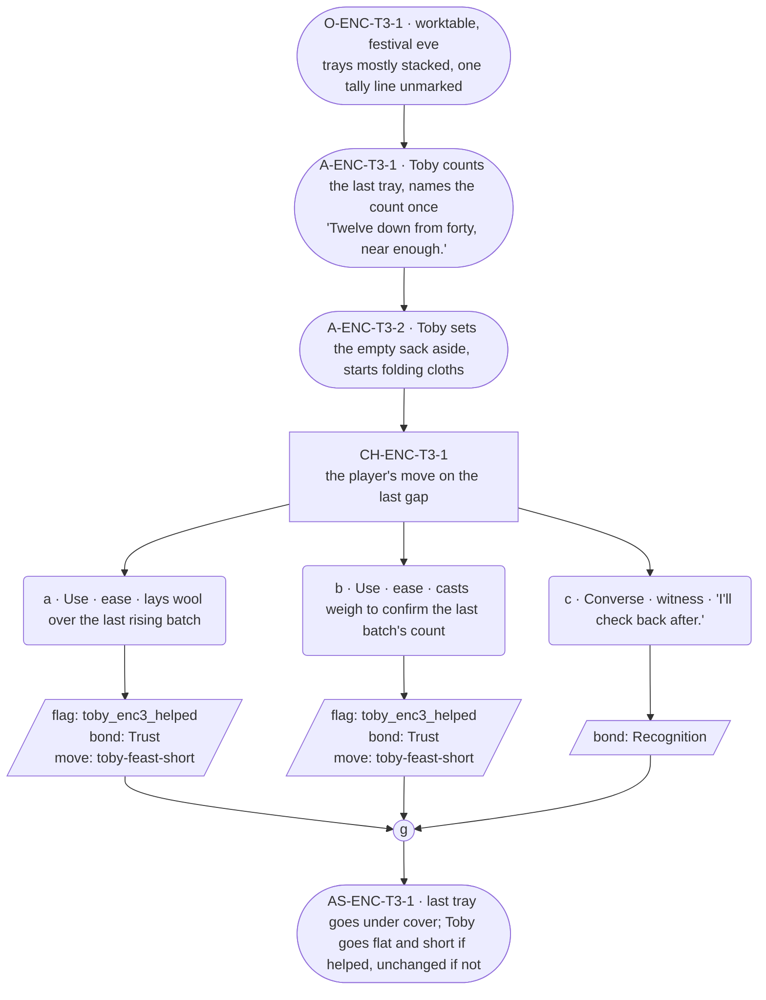

# ENC-toby-3 — line comparison

## Approved structure (Phase 1)

Structure (click to expand)

# ENC-toby-3 — Baker festival goal, encounter 3 of 3

## Part A — Mini Architect Brief

**Reveal carried:** State 3 of the shortfall — "twelve down from forty,"
the exact count finally named, and festival night fixed (`toby-feast-short`
registry, state 3). This is the closing encounter; if the player passed
1 and 2, this is where the arithmetic resolves in front of them.

**State of the shortfall:** Narrow now — twelve loaves, a number he'll say
once and move past. This is the first encounter allowed to state the exact
count (the c1 exemplar reserved it for a later conversation than its own
C1; this run's compact scale makes encounter 3 that later conversation).

**Sizing:** 8 beats — 3 setting beats (the extra one carries the exact-count
reveal), one 3-option choice node, one consequence beat, one close.

**Mechanical ruling — pass/fail gate.** Same shape as 1 and 2: **a**
(item) or **b** (spell) passes — `knowledge_flag(toby_enc3_helped)` +
`bond_event(Trust, weight 2)` + `thread_move(toby-feast-short)`. **c**
fails to advance — `bond_event(Recognition, weight 2)` only. If all three
encounters pass this run, the feast is understood to finish — that
resolution is a downstream/host concern, not something this scene states
in-fiction (no World Truth spoken, per canon flag 6).

**Constraint worth naming:** This is the closest the scene gets to a
payoff beat, so Toby's card bars any long run here absolutely, and bars
staying animated while the player's help visibly lands. If the player
passes, his response goes flat and short, not longer.

---

## Part B — Choice Designer Output

### Content block

**Incoming state (O-ENC-T3-1):** Festival eve. The worktable is nearly
clear — trays stacked, most of the square's order filled. The tally slate
shows one line left unmarked.

**A-ENC-T3-1:** Toby counts the last tray twice, says the number out loud
for the first time this arc — "Twelve down from forty, near enough" — flat,
fast, already moving to the next thing before the sentence finishes.

**A-ENC-T3-2:** He doesn't ask for help. He sets the empty flour sack aside
and starts folding proofing cloths, hands already busy with the next job
whether or not anyone answers.

**CH-ENC-T3-1 (3 options, ungated):**
- **a · Use · ease** — `surface_action`: brings a length of wool
  (`item_wool`) to lay over the last rising batch, keeping the heat in
  overnight. Toby checks the cover, nods once, says nothing. Records
  `knowledge_flag(toby_enc3_helped)` + `bond_event(Trust, weight 2)` +
  `thread_move(toby-feast-short)`.
- **b · Use · ease** — `surface_action`: casts *weigh* over the last batch
  to confirm the count matches the tally before it goes in. Toby reads the
  number, crosses the last mark himself. Records
  `knowledge_flag(toby_enc3_helped)` + `bond_event(Trust, weight 2)` +
  `thread_move(toby-feast-short)`.
- **c · Converse · witness** — `player_line`: "I'll check back after." —
  Toby: flat acknowledgment, keeps folding. Records `bond_event(Recognition,
  weight 2)`, no thread move.

Converges at **J-ENC-T3-1**.

**AS-ENC-T3-1:** If a or b was picked, Toby goes shorter and flatter than
the scene's earlier beats — his card's receiving-flat register, held for
exactly this one beat, then he's back to folding. If c, no shift; he was
never put in the receiving position.

**Close:** The last tray goes under cover either way. Nothing in-scene
declares the feast "saved" — that's the World Truth staying unstated.

**Action-slot ratio:** 3 action beats across the scene (A-1, A-2, AS-1) ≈
comfortably within range at this compact size.

**Long-run placement:** None — barred absolutely here per the payoff
proximity rule on his card.

**Equal weight:** a and b both close the last gap by a different route; c
is a legitimate final visit that doesn't force the player to intervene a
third time.

### Mermaid graph

**Self-verify:** parses clean, ids scoped `-T3-`, options match prose,
gather before close, no long run anywhere in the scene.

## Generated lines, by model

### setup

| Model | Word count | Text |
|---|---|---|
| styletune | 12 | Toby counts the last tray twice. "Twelve down from forty, near enough." |
| violetlotus | 113 | Toby sets the last tray in place, covers it with a length of wool, then picks up the empty flour sack. "Twelve down from forty," he says flatly, already moving to the next job. The worktable is nearly clear, the tally slate showing just one line left unmarked. He starts folding the proofing cloths, hands busy as he glances up at the player. "Overnight rise," he explains briefly, not stopping his work. "Morning's the busy part." The wool-covered tray waits, the last task before the feast. Toby doesn't ask for help, but his glance lingers, a silent invitation to the player's next move. The tension in the room is palpable — the work |
| crimson | 75 | The player stands by the worktable, the last tray of Festival rolls waiting to be covered. Toby, his hands dusted with flour, double-checks the tally slate, his brow furrowed in concentration. "Twelve down from forty, near enough," he mutters, setting the slate aside. He reaches for an empty flour sack, his hands already moving to fold it, but pauses, looking up at the player. "You're back," he says, his voice flat, not quite a question. |
| gemma26b | 12 | Toby counts the last tray twice. "Twelve down from forty, near enough." |

### option_a

| Model | Word count | Text |
|---|---|---|
| styletune | 21 | The player drapes the length of wool over the rising dough. Toby watches the cloth settle and gives a single nod. |
| violetlotus | 60 | Toby: "Twelve down from forty, near enough." He sets the empty flour sack aside and starts folding proofing cloths, hands already busy with the next job whether or not anyone answers.  The player brings a length of wool (item_wool) to lay over the last rising batch, keeping the heat in overnight. Toby checks the cover, nods once, says nothing.  [End] |
| crimson | 23 | The player brings a length of wool and lays it over the last rising batch. Toby checks the cover, nods once, says nothing. |
| gemma26b | 26 | The player lays a length of wool over the last rising batch to keep the heat in overnight. Toby checks the cover and nods once. "Good." |

### option_b

| Model | Word count | Text |
|---|---|---|
| styletune | 28 | The player casts *weigh* over the last batch to confirm the count. Toby reads the number off the slate and crosses the last mark with a quick stroke. |
| violetlotus | 29 | Toby reads the number, crosses the last mark himself. "Twelve down from forty, near enough." He says it fast, already moving to the next thing before the sentence finishes. |
| crimson | 10 | Toby reads the number, crosses the last mark himself. "Confirmed." |
| gemma26b | 15 | Toby reads the number, crosses the last mark himself. "Twelve down from forty, near enough." |

### option_c

| Model | Word count | Text |
|---|---|---|
| styletune | 20 | The player says, "I'll check back after." Toby gives a flat nod and continues folding the cloth without looking up. |
| violetlotus | 109 | Toby: "You're still here, then?" — flat, quick, already back to folding. The player: "I'll check back after." Toby: "Alright. I'll be here." — flat, fast, no pause. He doesn't look up from the cloths. The player's line is the only break in his rhythm; Toby returns to his work as if it never happened. The folding continues, steady and unceasing, as if to emphasize the futility of stopping. The player watches for a moment longer, then turns away. The scene ends with Toby's hands moving, the rhythm of the work table continuing on into the night. The player's words hang in the air for a moment, then fade |
| crimson | 21 | The player says, "I'll check back after."  Toby: "Appreciated," and keeps folding, the flat acknowledgment no longer than the task itself. |
| gemma26b | 10 | "I'll check back after."  Toby nods flatly and keeps folding. |

