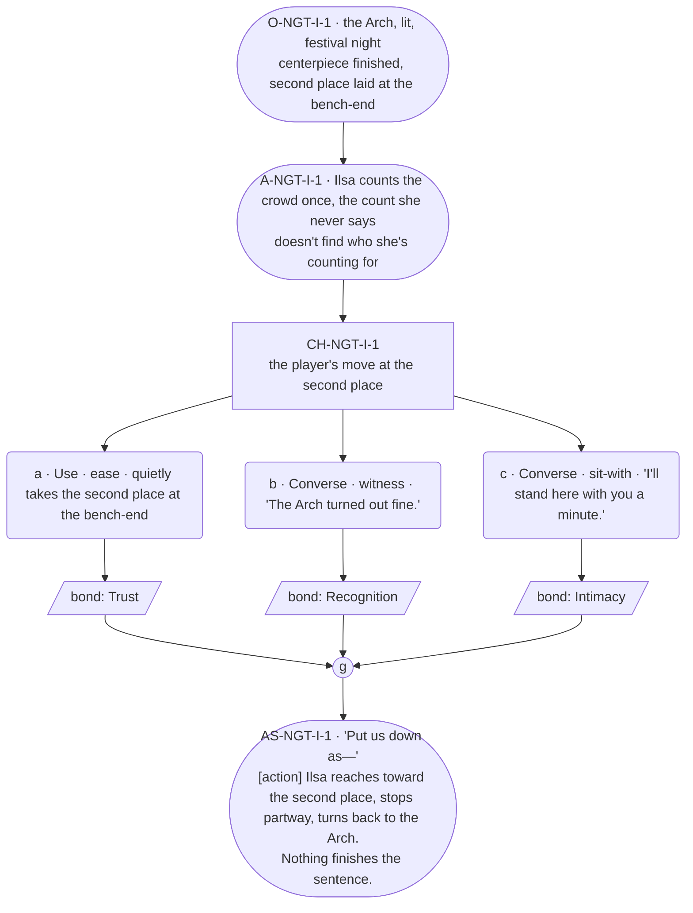

# NGT-ilsa — line comparison

## Approved structure (Phase 1)

Structure (click to expand)

# NGT-ilsa — Festival night, Ilsa

## Part A — Mini Architect Brief

**Reveal carried:** The standing second place at the Arch raising, Bram's
absence held rather than named, staged as festival night's version of
`ilsa-kin-no-show`'s core image. `ilsa-not-family` held in reserve as
texture only (Pip seated without being counted the same as blood) — not
staged directly, to keep one payoff beat to one fact, per her card's
delta_rule discipline.

**State:** Festival night, the Arch lit. The centerpiece (real ore or
substitute, whichever the encounters set) stands finished. A second place
is laid at the bench-end regardless.

**Sizing:** 7 beats — 2 setting beats, one 3-option choice node (witness /
ease / sit-with, never fix), one consequence beat, one close.

**Constraint worth naming — the load-bearing one.** **Zero `bond_band()`
predicates anywhere in this scene** — canon flag 11 bars bond-band gating
outright for Ilsa, and her own thread registry repeats the bar explicitly.
No option, gate, or availability condition may fork on her bond level. Her
weight-carrying beat must be the grammar tell — a sentence that doesn't
finish — never a longer line, per her card's failure-mode 3 (barred
absolutely: any long run near the absence).

---

## Part B — Choice Designer Output

### Content block

**Incoming state (O-NGT-I-1):** The Arch, lit, festival night. Ilsa stands
near the finished centerpiece. The bench nearby carries the standing
second place — an apron and tongs laid at the empty end, same as her
`ilsa_second_apron` echo furniture.

**A-NGT-I-1:** She counts the gathered crowd once, the way she always
counts before speaking — arrivals against a number she never says. She
doesn't find who she's counting for.

**CH-NGT-I-1 (3 options, ungated — witness / ease / sit-with, never
fix):**
- **a · Use · ease** — `surface_action`: quietly takes the second place at
  the bench-end, without asking whose it was. Ilsa's eyes go to the seat,
  then away. She doesn't correct the player, doesn't explain it. Records
  `bond_event(Trust, weight 2)`.
- **b · Converse · witness** — `player_line`: "The Arch turned out fine." —
  a fact stated plainly, no comment on the empty seat. Ilsa: "It did."
  Settled, certain. Records `bond_event(Recognition, weight 2)`.
- **c · Converse · sit-with** — `player_line`: "I'll stand here with you a
  minute." — Ilsa doesn't answer in words. She shifts half a step, making
  room. Records `bond_event(Intimacy, weight 2)`.

Converges at **J-NGT-I-1**.

**AS-NGT-I-1 (weight-carrying beat, fragment → action → fragment, per
rule 19 and her card's grammar-tell mechanism):** "Put us down as—" **[action]**
Ilsa reaches toward the second place, stops partway, turns back to the
Arch instead. Nothing finishes the sentence.

**Close:** No line closes it. The lit Arch and the still-laid second place
are the last image (object slot) — amplification stays visual.

**Action-slot ratio:** 2 action/object beats (A-NGT-I-1, AS-NGT-I-1) plus
the object close, against 3 dialogue-bearing options ≈ within range.

**Long-run placement:** None — her sanctioned run is for lineage/household
history only, and this beat is the absence itself, which her card bars
absolutely.

**Equal weight:** All three options witness the same unfinished thing from
a different angle — taking the seat, naming the work instead of the gap,
or simply standing near her. None fixes, none names Bram, none is ranked
above the others.

### Mermaid graph

**Self-verify:** parses clean, zero `bond_band()` predicates anywhere,
options match prose, genuine gather, weight carried by the unfinished
sentence + action per her card's grammar mechanism, no long run, Bram not
named in this scene.

## Generated lines, by model

### setup

| Model | Word count | Text |
|---|---|---|
| muse12b | 121 | The Arch is lit for the festival, the central hearth of the hall blazing with fresh logs, throwing light onto the long tables and benches. The great wooden structure looms at the far end, its beams thick with carvings worn smooth from years of touch. The smell of roasting meat and hot bread wafts through the air as people move about, setting tables and preparing for the feast.  Ilsa stands near the centerpiece, a massive arrangement of bread and flowers woven into a living wreath. Her hands rest lightly on the table as she surveys the room, eyes moving methodically as she counts. The second place at the nearest bench is set: a worn apron and tongs laid out, waiting for |
| violetlotus | 98 | The Arch, lit and festive, stood at the center of the room. Ilsa hovered nearby, her gaze fixed on the intricate centerpiece she'd crafted. A bench stood nearby, adorned with an apron and tongs at one end, a silent testament to a place once occupied. Ilsa counted the gathered crowd, her eyes flickering over each face, seeking one she couldn't quite find. The room hummed with anticipation, but for Ilsa, something crucial was still missing. She sighed, her shoulders slumping ever so slightly, as she turned back to the Arch, her unspoken thoughts hanging heavy in the air. |

### option_a

| Model | Word count | Text |
|---|---|---|
| muse12b | — | **FAILED**: leakage: second-person narration detected (4 you/your tokens outside quotes) — narrator/action beats are third-person only |
| violetlotus | 68 | The player quietly takes the second place at the bench-end, without asking whose it was. Ilsa's eyes go to the seat, then away. She doesn't correct the player, doesn't explain it. She says, "Put us down as—" and reaches toward the second place, but stops partway, turning back to the Arch instead. Nothing finishes the sentence. The lit Arch and the still-laid second place are the last image. |

### option_b

| Model | Word count | Text |
|---|---|---|
| muse12b | 115 | Ilsa turns slightly, eyes tracking the player as they step closer. She doesn't speak until they stop near the table, then she says, "It did," voice flat and final, as if the subject—whether the Arch or something else entirely—requires no further elaboration.  The apron and tongs on the bench remain untouched. The second place sits empty, waiting. The player's line acknowledges the work without naming the absence, and Ilsa responds in kind, giving no space for questions she doesn't intend to answer.  The candlelight catches the faintest crease between her brows as she turns back to the table. The space between them remains, but it is a steady one, measured and accepted. She doesn't look |
| violetlotus | 14 | The player says: "The Arch turned out fine." Ilsa responds: "It did." Settled, certain. |

### option_c

| Model | Word count | Text |
|---|---|---|
| muse12b | 117 | The player stands beside Ilsa at the centerpiece, the space between them small but not intrusive. The Arch looms over them both, the flames catching in the polished metal of the second place left empty at the end of the bench. The apron folds crisply, the tongs placed just so.  Ilsa does not speak, but she shifts slightly, turning her head toward the player. Not quite looking, but acknowledging the presence beside her. Her hands move as she adjusts something on the table, but there is no real task there—just a small motion, a small delay. Then she turns fully, her face half-lit by the glow of the fire and the distant lanterns.  "Here," she says, and |
| violetlotus | 106 | The player steps closer to Ilsa. "I'll stand here with you a minute." Ilsa doesn't answer in words. She shifts half a step, making room. The space between them widens, just a little, like a gap opening up in a sentence. Ilsa's hand starts to move, then stops, hovering near the bench end as if searching for something to finish the thought that never came. She turns back to the Arch, the lit centerpiece standing between them like a sentence waiting to be filled. The player stands with her, waiting, and together they look out at the gathering crowd, the festival night stretching out in silence. |

