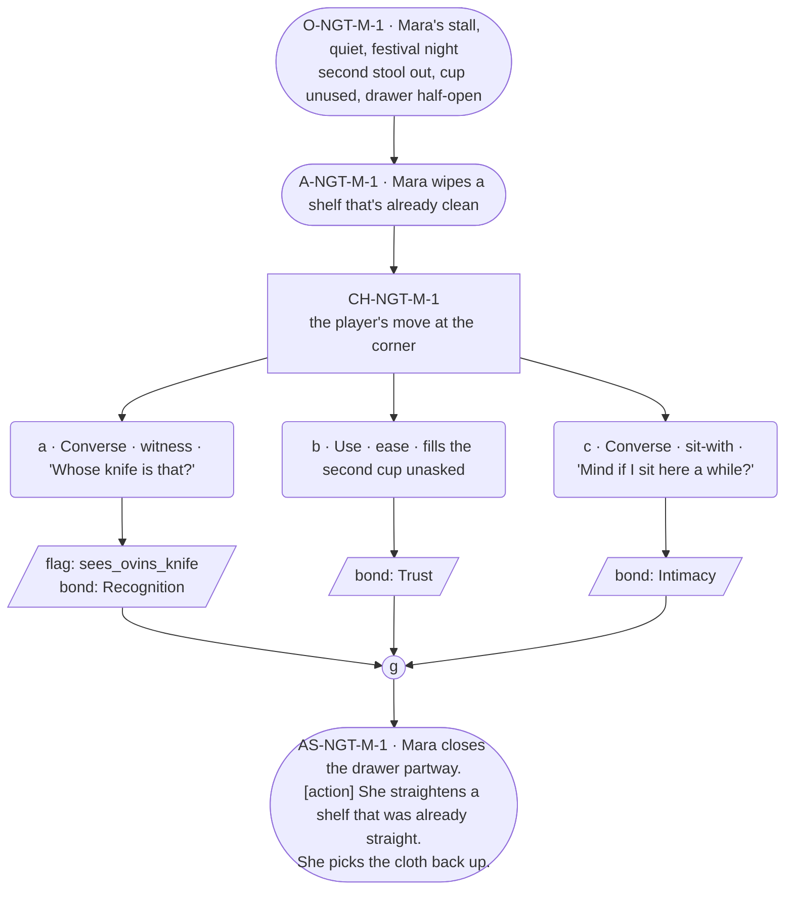

# NGT-mara — line comparison

## Approved structure (Phase 1)

Structure (click to expand)

# NGT-mara — Festival night, Mara

## Part A — Mini Architect Brief

**Reveal carried:** The corner set for two, staged as festival night's
version of `mara-set-for-two` (registry: "what is the keeping for?").
`mara-said-out-loud` held in reserve as texture only — Bex is not staged
in this scene; naming-near-her is that thread's own beat and doesn't need
restaging here to keep one payoff to one fact.

**State:** Festival night, the tonic served (real completion or a near
miss, whichever the encounters set — this scene doesn't distinguish, since
neither reading changes what the corner is). Mara's stall is quiet now,
the crowd moved on to the Arch.

**Sizing:** 7 beats — 2 setting beats, one 3-option choice node (witness /
ease / sit-with, never fix), one consequence beat, one close.

**Constraint worth naming — the two guardrails that bind hardest here.**
Her grief is **fragments + action slots only, never a long run** — barred
absolutely per her card's failure-mode 3. And her provenance licence
(unlimited length, marked but uncapped) covers an object's *history*,
never the loss itself — so if the player asks about an object in this
scene, the response may run long on *what it is and where it's been*, and
must stop cold the instant it would touch who it's for beyond the bare
sanctioned line. This scene uses **Ovin's pocket-knife**, whose rule is
stricter still: the bare fact only — "That was Ovin's, before." — zero
elaboration, ever (card canon flag 14).

---

## Part B — Choice Designer Output

### Content block

**Incoming state (O-NGT-M-1):** Mara's stall, quiet, festival night. The
second stool at the corner is out, same as always. A cup sits across from
hers, unused. The drawer of unclaimed things is visible, half-open from
earlier sorting.

**A-NGT-M-1:** Mara is doing a last pass over the stall, wiping a shelf
that's already clean — a small habitual tending. She doesn't stop when the
player arrives.

**CH-NGT-M-1 (3 options, ungated — witness / ease / sit-with, never
fix):**
- **a · Converse · witness** — `player_line`: "Whose knife is that?" —
  asking about the folding pocket-knife visible in the open drawer. Mara:
  "That was Ovin's, before." — bare, no elaboration, sentences stopping at
  the person per her card's precision-profile asymmetry. Records
  `knowledge_flag(sees_ovins_knife)` + `bond_event(Recognition, weight
  2)`.
- **b · Use · ease** — `surface_action`: takes the second cup and sets it
  where it already sits, filling it without being asked. Mara's hands
  pause over the shelf for a beat, then keep moving. Records `bond_event
  (Trust, weight 2)`.
- **c · Converse · sit-with** — `player_line`: "Mind if I sit here a
  while?" — gestures to the second stool. Mara: "It's usually empty
  anyway." She keeps working, doesn't stop the player. Records
  `bond_event(Intimacy, weight 2)`.

Converges at **J-NGT-M-1**.

**AS-NGT-M-1 (weight-carrying beat, fragment → action → fragment, per
rule 19):** Mara closes the drawer partway. **[action]** She straightens
a shelf that was already straight. She picks the cloth back up.

**Close:** No line closes it. The corner, the second stool, the drawer
half-closed — the last image (object slot).

**Action-slot ratio:** 2 action/object beats (A-NGT-M-1, AS-NGT-M-1) plus
the object close, against 3 dialogue-bearing options ≈ within range.

**Long-run placement:** None marked for the loss itself. Option a's
response is deliberately the shortest line in the scene — the bare
Ovin rule overrides even her usual longer-than-median band, per canon
flag 14.

**Equal weight:** a asks about an object and gets the sanctioned bare
fact; b tends to her without asking anything; c simply sits with her. None
names the loss, none fixes it, none is ranked above the others.

### Mermaid graph

**Self-verify:** parses clean, options match prose, genuine gather, no
long run about the loss, Ovin's bare-line rule held exactly (no
elaboration), Adren's doll and the whistle not invoked (single-object
scope kept), weight carried by fragment → action → fragment.

## Generated lines, by model

### setup

| Model | Word count | Text |
|---|---|---|
| muse12b | 116 | The stall is quiet, the second stool set out as always, a single cup placed opposite Mara's own. She moves through the space with the ease of repetition, a rag in her hand, wiping down surfaces that don't need it—habit more than necessity. A half-open drawer reveals the shapes of forgotten things, some familiar, others less so. A pocket-knife with a worn leather grip, the blade folded shut. The lanterns that used to hang here, now waiting in their boxes for the evening's lighting. She doesn't stop when the player approaches.  "Good, another set of hands." She doesn't pause, doesn't turn to look at you, just moves to the side to give space. "Hold this a |
| violetlotus | 116 | Mara's stall is quiet on this festival night, the second stool at her corner still out as always. A cup sits unused across from hers. The drawer of unclaimed things is half-open, the same as it was earlier when she was sorting through it. Now she does a last pass over the shelves, wiping one that's already clean, a small habitual tending. She doesn't stop when the player approaches. "The lanterns used to hang right there," she says, gesturing to an empty bracket, her voice matter-of-fact. "Mind your step, they'll be up again by evening, same as every year." She continues wiping, her hands steady and exact. The stall feels like a space held, not lost |

### option_a

| Model | Word count | Text |
|---|---|---|
| muse12b | 122 | The player picks up the folding pocket-knife from the open drawer, turning it over in their hands. Its handle is worn smooth by years of use, the steel catch still springing true when they press it open. The blade is dull from years of sharpening, but the edge remains serviceable—just like the soul who once held it. Mara does not look up from her cloth, her hands methodical as she wipes the shelf.  "That was Ovin's, before."  She speaks the words flatly, with none of her usual descriptive flourishes. No past tense slipping into her speech now. The words land like a final nail in the coffin of a life no longer spoken in the present. She turns away, moving to the |
| violetlotus | 111 | Mara pauses her cleaning, looks at the knife, then back at the player. "That was Ovin's, before." Her hands resume their task, wiping the already clean shelf. "It keeps," she adds, running a cloth over the counter's edge, "like everything in this cellar. Cold and dark, and somebody keeping an eye on it." The past tense slips in, unremarked, as she works. "You'd be surprised what still holds on when you tend it right." She closes the drawer partway, straightening a shelf that was already straight, then picks the cloth back up, her movements precise and exact. "Mind the third step on your way out," she says, not looking up, " |

### option_b

| Model | Word count | Text |
|---|---|---|
| muse12b | 120 | Mara does not look up as the player takes the second cup. Her hands move over the shelf, wiping, straightening, her cloth making small circles around each object. She pauses only to fill the cup from the bottle on the counter, her motions steady and unhurried. "There," she says, setting the full cup down opposite her own. "It's usually empty anyway."  She turns back to the shelf, but her fingers slow. The cloth hovers a moment longer than necessary over the glass bottle of dark syrup before she resumes wiping. The corner is clean, the cup is filled, and there is nothing left to do but wait, as the festival murmurs outside. She does not sit, does not drink. Instead |
| violetlotus | 110 | The player takes the second cup and sets it where it already sits, filling it without being asked.  Mara's hands pause over the shelf for a beat, then keep moving. "Good, another set of hands — hold this a second, mind the third step, and tell me your name while you're at it." She passes the player a cloth, the kind used for dusting, and bends to show them the tricky part of the shelf that always catches debris. Her words are warm, inviting the player to join in her quiet tending. She straightens a thing that was already straight, as if the act itself matters more than the outcome. |

### option_c

| Model | Word count | Text |
|---|---|---|
| muse12b | 118 | Mara wipes the shelf clean with her cloth, methodical in her motion, before she finally turns to the player. She pauses for a fraction of a second, assessing, then resumes moving.  "It's usually empty anyway," she says, not stopping the motion of her hands. "Another set of hands is good though. Hold this a second, mind the third step, and tell me your name while you're at it." She offers the player a small bundle of cloth-wrapped tools, their fingers brushing as the exchange is made.  She turns back to her work, wiping down the counter near the drawer, her motions precise but unhurried. A quiet tension hangs between you—this corner of the stall has always been empty, |
| violetlotus | 121 | The player asks, "Mind if I sit here a while?" gesturing to the second stool. Mara continues straightening the shelf, her hands never pausing. "It's usually empty anyway." She glances at the player, a small smile touching her lips, then goes back to her task. The second stool is left empty, a silent invitation to sit and stay for a while. The player takes a seat, feeling the warmth of Mara's welcome even as she works quietly around the stall. The second stool, meant for company, now holds the player's presence, if only for a moment. Mara's hands move with purpose, tending to the stall as if it were a living thing that needed care. The player feels a strange comfort |

