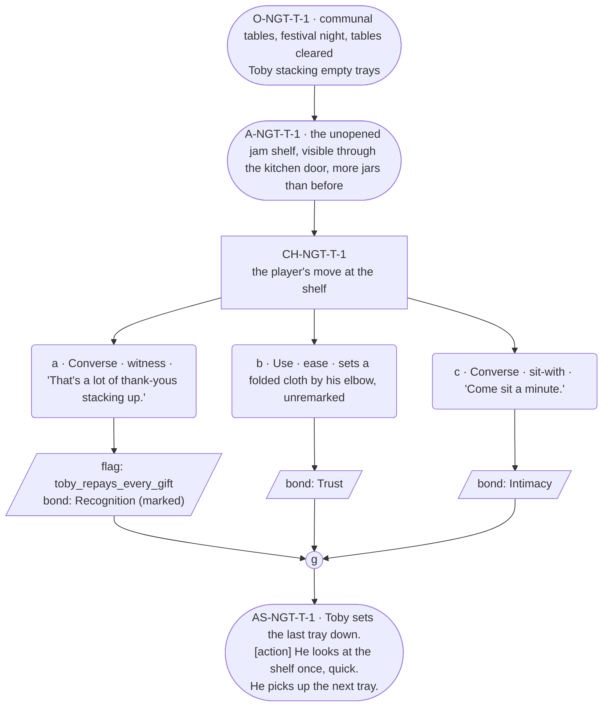

# NGT-toby — line comparison

## Approved structure (Phase 1)

Structure (click to expand)

# NGT-toby — Festival night, Toby

## Part A — Mini Architect Brief

**Reveal carried:** The `toby-unopened-jam` echo's payoff condition, staged
at compact scale — Toby keeping a shelf of thank-you gifts he never opens,
and what happens when the player names it back to him instead of just
adding to it. Seeded primarily from `toby-the-shelf` (registry: "what does
he do with what he is given?"), with the returned-shirt thread
(`toby-kept-and-returned`) held in reserve as texture only — this scene
does not stage the shirt's mend, to avoid overloading one payoff beat with
two facts.

**State:** Festival night, the tables already served — the card's own
`payoff_scene` timing for the echo. Incoming state assumes the player has,
across the run, given Toby at least one thing with nothing owed on it
(the give itself happens off this scene, in whichever earlier beat the run
afforded — this scene's job is only the naming).

**Sizing:** 7 beats — 2 setting beats, one 3-option choice node (witness /
ease / sit-with, never fix), one consequence beat, one close.

**Constraint worth naming — the hardest one on this card.** Toby is barred
from any long run while receiving, thanked, or seen, and **barred
absolutely at a payoff — festival night is exactly that.** Zero long runs
anywhere in this scene, full stop. His response to being named must go
flat and short, not warmer or longer, per his card's failure-mode 1 (never
stays animated while receiving).

---

## Part B — Choice Designer Output

### Content block

**Incoming state (O-NGT-T-1):** The communal tables, cleared of the meal,
lantern light up. Toby is behind the near table stacking empty trays —
still working, even now.

**A-NGT-T-1:** Behind him, visible on the shelf through the open kitchen
door, sit the unopened jars — more than at the arc's start, none opened.
He doesn't look at them. *(Object beat; the shelf is shown, not narrated.)*

**CH-NGT-T-1 (3 options, ungated — witness / ease / sit-with, never fix):**
- **a · Converse · witness** — `player_line`: "That's a lot of thank-yous
  stacking up." — names the shelf back to him directly. Toby's hands stop
  on the tray for exactly one beat. He says "Yeah" — nothing else — and
  goes back to stacking, faster than before. Records `knowledge_flag
  (toby_repays_every_gift)` + `bond_event(Recognition, weight 3)`.
- **b · Use · ease** — `surface_action`: sets a folded cloth on the table
  by his elbow, unremarked, and says nothing about it. Toby notices,
  doesn't comment, tucks it under the stack of trays. Records
  `bond_event(Trust, weight 2)` — witnessed, not named; the echo condition
  isn't met this way, and that's a legitimate, un-punished read.
- **c · Converse · sit-with** — `player_line`: "Come sit a minute." —
  Toby: "In a bit." He doesn't sit, but he slows down. Records
  `bond_event(Intimacy, weight 2)`.

Converges at **J-NGT-T-1**.

**AS-NGT-T-1 (weight-carrying beat, fragment → action → fragment, per
rule 19):** Toby sets the last tray down. **[action]** He looks at the
shelf once, quick, like checking it's still there. He picks up the next
tray.

**Close:** No line closes it. The lanterns are the last image (object
slot) — amplification stays visual, per the register's reconciliation
rule, never verbal.

**Action-slot ratio:** 2 action/object beats (A-NGT-T-1, part of AS-NGT-T-1)
plus the object close, against 3 dialogue-bearing options ≈ within range
at this compact size.

**Long-run placement:** None — barred absolutely, stated in the brief
above and held throughout.

**Equal weight:** a completes the echo condition; b and c don't, and
neither is worse — b stays fully in his warmth-channel logic (anticipation,
unremarked), c simply respects that he won't stop working. No option
scolds another; none is rewarded above rank (all record exactly one
`bond_event`, a records one plus the flag — the flag is state, not a
bigger reward).

### Mermaid graph

**Self-verify:** parses clean, no id collisions, options match prose
exactly, genuine gather, zero long runs anywhere (payoff proximity bar
held), witness/ease/sit-with framing used instead of "fix," fragment →
action → fragment weight-build present at AS-NGT-T-1.

## Generated lines, by model

### setup

| Model | Word count | Text |
|---|---|---|
| muse12b | 122 | The evening stillness hangs thick in the room, the lanterns' warm glow spilling across the cleared tables. Toby moves with the methodical ease of a man who knows his purpose. His hands stack the last tray onto the towering pile with a soft clink of wood against wood.  He pauses only briefly as he straightens, surveying the remaining work. The unopened jars catch his eye for a moment, lined up neat as soldiers on the shelf beyond the kitchen doorway. Then his gaze slides past them, focusing back on the trays. He picks up another, fingers moving deftly, setting it into place with the same care he gives everything he does.  The air smells of spent wax and damp stone, mingling with |
| violetlotus | 120 | The communal tables, cleared of the meal, lantern light up. Toby is behind the near table stacking empty trays — still working, even now. Behind him, visible on the shelf through the open kitchen door, sit the unopened jars — more than at the arc's start, none opened. He doesn't look at them. The player sits at the table, watching Toby work. After a moment, they say, "That's a lot of thank-yous stacking up." Toby's hands stop on the tray for exactly one beat. He says "Yeah" — nothing else — and goes back to stacking, faster than before. The jars on the shelf seem to multiply under his gaze, a silent testament to the debts he feels he must |

### option_a

| Model | Word count | Text |
|---|---|---|
| muse12b | 118 | The player sets the tray down. "That's a lot of thank-yous stacking up."  Toby's hands stop on the next tray for exactly one beat. His fingers press lightly against the wood before resuming their work, faster now than before, as if the movement itself might shake off the observation. He doesn't look up. He doesn't stop. Just: "Yeah."  The word is small, but not unkind. It is the acknowledgment of a man who does not need to be told what he already knows—that the jars represent a ledger, not charity. He will not say it aloud, but he knows what they mean. His hands move quickly, stacking one tray atop another with a practiced ease, but now there |
| violetlotus | 31 | The player says, "That's a lot of thank-yous stacking up."  Toby's hands stop on the tray for exactly one beat. He says, "Yeah," and goes back to stacking, faster than before. |

### option_b

| Model | Word count | Text |
|---|---|---|
| muse12b | 120 | The player sets the folded cloth on the table by Toby's elbow, the fabric smooth and still warm from the last use. Toby's hands don't stop, don't acknowledge. They just work—stacking trays with that same unbroken rhythm, moving the cloth from the table to the tray he's holding with no extra motion, as if the cloth had always belonged there. He tucks it under the stack, and the next tray comes down atop it.  Neither of them speak. The lantern light catches on the cloth's creases, the edges shifting as Toby lifts the full stack and carries it toward the kitchen door. He doesn't look back, but his step is just a little slower. A tiny concession. A debt acknowledged |
| violetlotus | 24 | The player sets a folded cloth on the table by Toby's elbow, unremarked. Toby notices, doesn't comment, tucks it under the stack of trays. |

### option_c

| Model | Word count | Text |
|---|---|---|
| muse12b | 119 | The player settles onto the bench, leaning against the table's solid edge. The wood is warm where the evening's meal was laid out, a quiet comfort that contrasts with the cool air near the open door.  "Come sit a minute," the player says, speaking gently but with purpose.  Toby hesitates only briefly before shaking his head. He keeps moving, but his hands slow just a fraction as he arranges the last tray.  "In a bit," he says, the words coming out almost automatic, like something he's said before to many people over many years. He doesn't look up from the trays, but he doesn't speed up again either, his movements methodical rather than rushed now that he's been asked. |
| violetlotus | 123 | The player says, "Come sit a minute." Toby replies, "In a bit." He doesn't sit, but he slows down his work, taking a moment to glance at the player before continuing to stack the trays. His pace is still measured, but the pause acknowledges the request without fully complying. The lantern light flickers softly, casting long shadows across the room as the evening stretches on. Toby's hands move with practiced efficiency, the trays stacking neatly one on top of the other. The player watches him for a moment before turning their attention back to the room, taking in the quiet bustle of the community as they prepare for the night. The tension in the air is palpable, a mixture of exhaustion and anticipation, |

