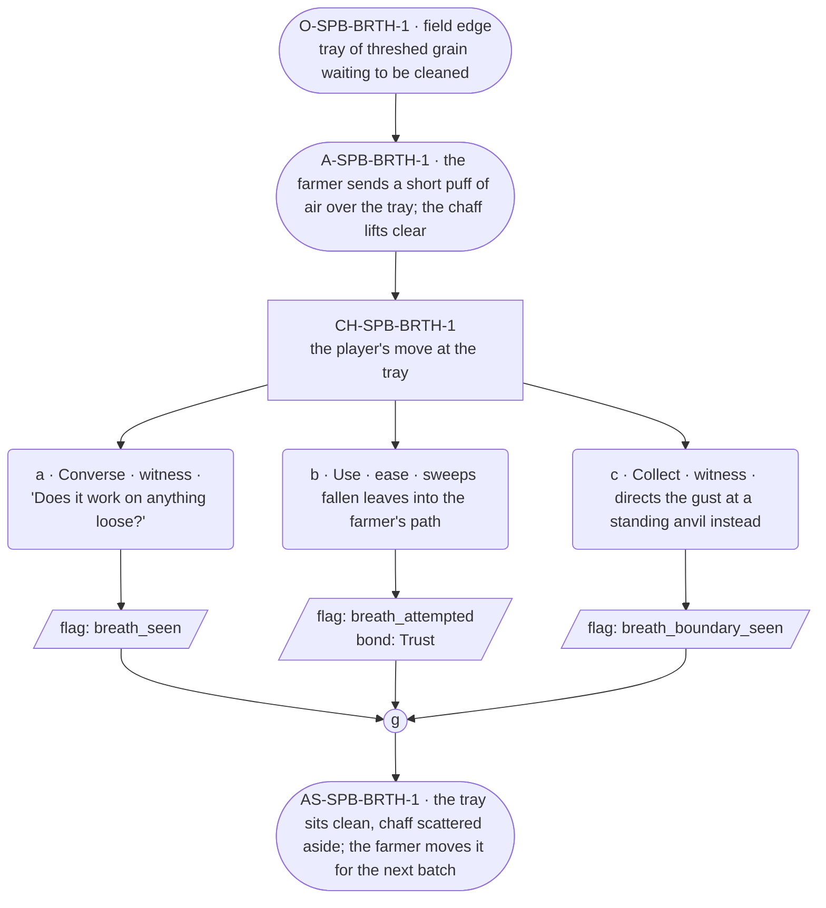

# SPB-breath — line comparison

## Approved structure (Phase 1)

Structure (click to expand)

# SPB-breath — Farmer spell beat: breath

## Part A — Mini Architect Brief

**Reveal carried:** First sight of `breath`, via the farmer winnowing at
the edge of the Town scene (`content/magic/breath.json` `learn_source`).
Components: `item_grass` + `item_dirt`. Canon starter spell. Clean effect
on `threshed_grain` (chaff lifts and blows clear); no_effect on `anvil`
(the gust breaks around it).

**Role holder:** Walk-on — "the farmer," named per register.md's walk-on
band.

**Sizing:** 6 beats — 2 setting beats, one 3-option choice node, one close.

---

## Part B — Choice Designer Output

### Content block

**Incoming state (O-SPB-BRTH-1):** The field edge, a tray of threshed
grain waiting to be cleaned before the festival stores.

**A-SPB-BRTH-1:** The farmer sends a short puff of directed air over the
tray — the chaff lifts clear in one pass, clean grain stays put.

**CH-SPB-BRTH-1 (3 options, ungated):**
- **a · Converse · witness** — `player_line`: "Does it work on anything
  loose?" — the farmer: "Loose and light, mostly. Grain, leaves." Records
  `knowledge_flag(breath_seen)`.
- **b · Use · ease** — `surface_action`: sweeps a pile of fallen leaves
  into the farmer's path for the same treatment — they scatter off in one
  gust. Records `knowledge_flag(breath_attempted)` + `bond_event(Trust,
  weight 2)`.
- **c · Collect · witness** — `surface_action`: directs the gust at a
  standing anvil nearby, out of curiosity — the gust breaks around it,
  no_effect. Records `knowledge_flag(breath_boundary_seen)`.

Converges at **J-SPB-BRTH-1**.

**Close (AS-SPB-BRTH-1):** The tray of grain sits clean, chaff scattered
off to the side. The farmer moves the tray aside for the next batch.

**Action-slot ratio:** 2 action beats across the scene ≈ within range.

**Long-run placement:** None.

**Equal weight:** a explains, b tries a plausible receiver and succeeds,
c tries a heavy fixed object and finds the boundary.

### Mermaid graph

**Self-verify:** parses clean, options match prose, genuine gather,
walk-on named and banded correctly.

## Generated lines, by model

### setup

| Model | Word count | Text |
|---|---|---|
| styletune | 38 | A tray of threshed grain rests at the field's edge, waiting for cleaning. The farmer exhales a focused puff of air across the tray. The chaff lifts away in a single sweep while the clean grain remains undisturbed. |
| violetlotus | 116 | The player approaches a weathered farmer, their eyes drawn to the tray of threshed grain sitting on the grass. The farmer looks up, a hint of curiosity in their tired eyes. "You're new to this festival, aren't you?" they say, their voice warm with understanding. "It's a bit different from the ones you might know." They gesture to the tray, a subtle smile playing at the corners of their mouth. "Here, watch this." They take a deep breath, and with a short, directed puff, send a gust of wind across the tray. Chaff lifts clear, leaving clean grain behind. The farmer nods, satisfied. "A small trick, but it makes the work easier." They look back at |
| crimson | 48 | The player stands at the edge of the field, watching the farmer work. A tray of recently threshed grain rests on the ground nearby, a light breeze occasionally stirring the chaff among the kernels. "Would you like a hand with that?" the player asks, nodding at the tray. |
| gemma26b | 34 | The farmer stands by the field edge, a tray of threshed grain resting before him. He exhales a short, directed puff of air that lifts the chaff clear from the grain in one pass. |

### option_a

| Model | Word count | Text |
|---|---|---|
| styletune | 27 | The player asks, "Does it work on anything loose?"  The farmer nods with a pleased smile. "Loose and light things work best, like grain or fallen leaves." |
| violetlotus | 33 | The farmer looks up at the player with a small smile, "Loose and light, mostly. Grain, leaves." They turn back to their work, "Other things, too, with practice." The player nods, understanding dawning. |
| crimson | 60 | The farmer looks up from their work, a spark of curiosity in their eyes. "Loose and light, mostly. Grain, leaves." They gesture to the scattered chaff. "Chaff's light too, but it's got a bit of weight to it, so it sticks around unless I give it a real push." They smile, pleased by the question. "What else you wondering about?" |
| gemma26b | 28 | The player asks, "Does it work on anything loose?"  The farmer puffs again, the air swirling over a patch of dry leaves. "Loose and light, mostly. Grain, leaves." |

### option_b

| Model | Word count | Text |
|---|---|---|
| styletune | 28 | The player sweeps a pile of fallen leaves into the farmer's path. The leaves scatter away in one sharp gust. "That's a useful trick for clearing the yard." |
| violetlotus | 51 | The player sweeps a pile of fallen leaves into the farmer's path. The farmer sends a short puff of directed air over the leaves, and they scatter off in one gust. "Loose and light, mostly. Grain, leaves." The farmer nods, pleased at the player's successful attempt. "You've a knack for it." |
| crimson | 52 | The player sweeps a pile of fallen leaves into the farmer's path. The farmer takes a deep breath and exhales a focused gust of air. The leaves scatter off in one smooth motion, leaving the path clear. "Loose and light, mostly. Grain, leaves," the farmer explains. "Anything else you'd like to try?" |
| gemma26b | 27 | The player sweeps a pile of fallen leaves into the farmer's path. The puff of air catches the pile and scatters the leaves away in one gust. |

### option_c

| Model | Word count | Text |
|---|---|---|
| styletune | 18 | The player directs the gust at the standing anvil. The air breaks around the metal without moving it. |
| violetlotus | 56 | The player directs the gust at a standing anvil nearby, out of curiosity. The gust breaks around it, no effect. The farmer looks up, surprised. "Whoa, careful! That's iron — it doesn't budge for wind." They glance at the player, reassessing. "You're curious, aren't you? I like that." The farmer's respect for the player grows slightly. |
| crimson | 45 | The player directs the gust at the standing anvil nearby, out of curiosity. The gust breaks around it, leaving the anvil untouched. "It doesn't move things heavy like that," the farmer explains, watching the player's experiment. "Just light, loose stuff. Anything solid, it flows around." |
| gemma26b | 20 | The player directs the puff at a standing anvil nearby. The gust breaks around the heavy metal without moving it. |

