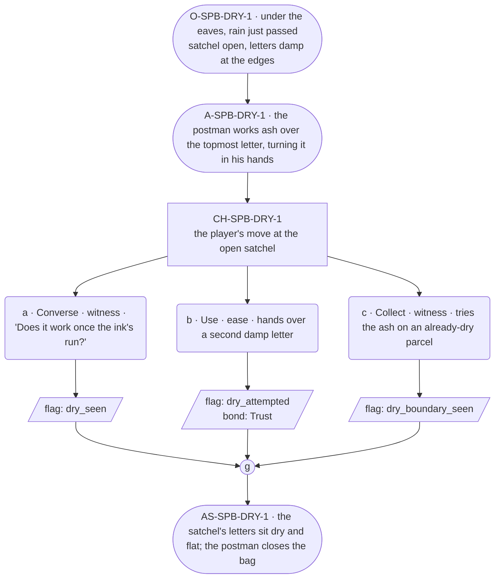

# SPB-dry — line comparison

## Approved structure (Phase 1)

Structure (click to expand)

# SPB-dry — Postman spell beat: dry

## Part A — Mini Architect Brief

**Reveal carried:** First sight of `dry`, via the postman rescuing a
rain-soaked satchel under the eaves (`content/magic/dry.json`
`learn_source`). Component: `item_ash`. State-dependent on
`soaked_letter` (caught early dries flat, ink intact); no_effect on
`dry_parcel` (nothing to take out).

**Role holder:** Walk-on — "the postman."

**Sizing:** 6 beats — 2 setting beats, one 3-option choice node, one close.

---

## Part B — Choice Designer Output

### Content block

**Incoming state (O-SPB-DRY-1):** Under the eaves, rain just passed. The
postman's satchel sits open, letters inside damp at the edges.

**A-SPB-DRY-1:** He works a pinch of ash over the topmost letter, turning
it in his hands — "Rounds run in all weather," he says, plain and
unhurried, walk-on band.

**CH-SPB-DRY-1 (3 options, ungated):**
- **a · Converse · witness** — `player_line`: "Does it work once the ink's
  run?" — the postman: "No. Has to be caught early." Records
  `knowledge_flag(dry_seen)`.
- **b · Use · ease** — `surface_action`: hands over a second damp letter
  from the bag — it dries flat, ink intact. Records `knowledge_flag
  (dry_attempted)` + `bond_event(Trust, weight 2)`.
- **c · Collect · witness** — `surface_action`: tries the ash on a
  parcel that's already dry, out of curiosity — no water to take out,
  no_effect. Records `knowledge_flag(dry_boundary_seen)`.

Converges at **J-SPB-DRY-1**.

**Close (AS-SPB-DRY-1):** The satchel's letters sit dry and flat. The
postman closes the bag, ready to move on.

**Action-slot ratio:** 2 action beats across the scene ≈ within range.

**Long-run placement:** None.

**Equal weight:** a explains, b tries and succeeds, c tries an already-
dry object and finds the boundary.

### Mermaid graph

**Self-verify:** parses clean, options match prose, genuine gather,
walk-on named and banded correctly.

## Generated lines, by model

### setup

| Model | Word count | Text |
|---|---|---|
| styletune | 37 | Damp letters rest inside the open satchel beneath the eaves as the rain ceases. The postman works a pinch of ash over the topmost envelope, turning it in his hands. "Rounds run in all weather," he says. |
| violetlotus | 59 | The postman stands in the shadow of the eaves, the rain having just passed. He opens his satchel, revealing a stack of damp letters inside. With practiced hands, he takes out the topmost envelope and begins to work a pinch of ash over it, turning it slowly. "Rounds run in all weather," he says, his voice steady and unhurried. |
| crimson | 51 | The postman shifts his weight, settling into the shelter of the eaves as the rain peters out. He sets his satchel down, the worn leather creaking, and flips the top open. Inside, the letters lie damp at the edges, the ink already smudging. He tuts softly, a sound of long-practiced disappointment. |
| gemma26b | 27 | The postman rubs a pinch of ash over the topmost letter, turning it carefully in his hands. "Rounds run in all weather," he says, plain and unhurried. |

### option_a

| Model | Word count | Text |
|---|---|---|
| styletune | 22 | The player asks, "Does it work once the ink's run?" The postman shakes his head slowly. "No. Has to be caught early." |
| violetlotus | 109 | The postman nods, "Ink's the tricky part, once it's taken on water. No, that's beyond me." He picks up another damp letter and works more ash into it, rubbing gently. "This is the best I can do, catch it early enough." The letter in his hand begins to dry, the ink remaining legible. "Rounds run in all weather," he repeats, packing the dry letter into his satchel. "Does it work once the ink's run?" the player asks. "No," the postman replies, "has to be caught early." He holds out the now-dry letter, a small smile playing at the corners of his mouth. "Here you go." He picks up a |
| crimson | 17 | The player: "Does it work once the ink's run?" The postman: "No. Has to be caught early." |
| gemma26b | 24 | The player asks, "Does it work once the ink's run?"  The postman turns a letter between his hands. "No. Has to be caught early." |

### option_b

| Model | Word count | Text |
|---|---|---|
| styletune | 29 | The player hands over a second damp letter from the satchel. The postman works his ash over the paper, and the document dries flat with the ink perfectly intact. |
| violetlotus | 92 | The player hands over a second damp letter from the bag. The postman takes it, working the ash over the paper — it flattens, ink preserved. "Appreciate the help," he says, smiling. "Rain's the postman's biggest foe." He tucks the now-dry letter into his satchel. "Won't do much for dry letters, though. Need to catch 'em early." He stands, ready to continue his rounds. "Thank you kindly," he adds, giving the player a nod. "Safe travels." The satchel's contents are now dry and flat, the postman moving on to deliver his mail. |
| crimson | 65 | The player hands over a second damp letter from the bag. The postman takes it, sprinkles the same pinch of ash over its surface. Slowly, the water beads up and rolls away, leaving the ink crisp and untouched. He looks up at the player, a hint of pleased surprise in his eyes. "Well, that works a treat. Never had a volunteer to test it before." |
| gemma26b | 28 | The player hands over a second damp letter from the satchel. The postman takes it, turning the paper slowly between his fingers, and it emerges flat and dry. |

### option_c

| Model | Word count | Text |
|---|---|---|
| styletune | 21 | The postman tests the ash on the dry parcel, but nothing happens. "That one's already settled," he explains with a shrug. |
| violetlotus | 41 | The player tries the ash on a parcel that's already dry, out of curiosity. The postman watches, then shakes his head. "No water to take out, no effect. Has to be caught early." He closes the satchel, ready to move on. |
| crimson | 42 | The player tries the ash on a parcel that's already dry, out of curiosity. The postman watches, a small furrow appearing in his brow as the dry parcel remains unchanged. "No water to take out, no effect. It's only good for damp." |
| gemma26b | 31 | The player tries the ash on a parcel that has already dried. "Does it work on things already dry?" The postman shrugs. "Not really. Needs some moisture to pull it out." |

