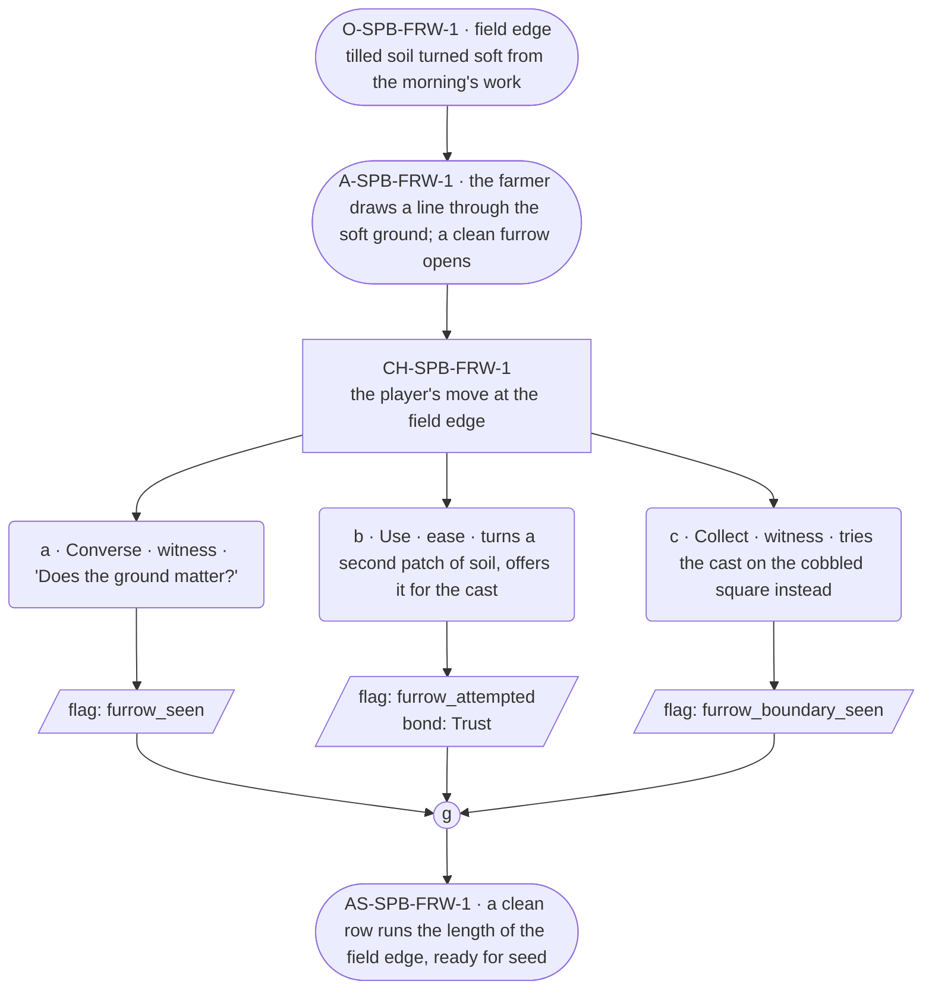

# SPB-furrow — line comparison

## Approved structure (Phase 1)

Structure (click to expand)

# SPB-furrow — Farmer spell beat: furrow

## Part A — Mini Architect Brief

**Reveal carried:** First sight of `furrow`, via the farmer opening a
seed-row without a plough at the field edge (`content/magic/furrow.json`
`learn_source`). Components: `item_sticks` + `item_dirt`. State-dependent
on `field_soil` — tilled and soft opens a clean furrow; packed hard or
frozen only scuffs. No_effect on `cobbled_square` (stone does not part).

**Role holder:** Walk-on — "the farmer."

**Sizing:** 6 beats — 2 setting beats, one 3-option choice node, one close.

---

## Part B — Choice Designer Output

### Content block

**Incoming state (O-SPB-FRW-1):** The field edge, tilled soil turned soft
from the morning's work. The festival week's planting is squeezed between
every other job.

**A-SPB-FRW-1:** The farmer sets sticks and a handful of dirt against the
soft ground and draws a line — a clean furrow opens the length of the
cast.

**CH-SPB-FRW-1 (3 options, ungated):**
- **a · Converse · witness** — `player_line`: "Does the ground matter?" —
  the farmer: "Has to be turned first. Packed ground just scuffs."
  Records `knowledge_flag(furrow_seen)`.
- **b · Use · ease** — `surface_action`: turns a second patch of soil with
  a hoe, then offers it for the same treatment — a clean furrow opens.
  Records `knowledge_flag(furrow_attempted)` + `bond_event(Trust, weight
  2)`.
- **c · Collect · witness** — `surface_action`: tries the cast on the
  cobbled square nearby instead, out of curiosity — stone does not part,
  no_effect. Records `knowledge_flag(furrow_boundary_seen)`.

Converges at **J-SPB-FRW-1**.

**Close (AS-SPB-FRW-1):** A clean row runs the length of the field edge,
ready for seed. The farmer moves to the next patch.

**Action-slot ratio:** 2 action beats across the scene ≈ within range.

**Long-run placement:** None.

**Equal weight:** a explains, b prepares the ground first and succeeds, c
tries an unworkable surface and finds the boundary.

### Mermaid graph

**Self-verify:** parses clean, options match prose, genuine gather,
walk-on named and banded correctly.

## Generated lines, by model

### setup

| Model | Word count | Text |
|---|---|---|
| styletune | 27 | Soft earth yields beneath the sun, tilled recently to prepare for the festival planting. The farmer presses sticks and dirt into the soil and draws a line. |
| violetlotus | 74 | The farmer stands at the field's edge, the earth soft and ready from the morning's work. She sets a pair of sticks into the ground and scoops up a handful of soil. "First the ground has to be turned," she says, drawing a line with her foot. A clean furrow opens, dark and waiting. "Packed dirt just scuffs, but this..." She trails off, nodding at the neat line of disturbed earth. "This is right." |
| crimson | 49 | The farmer sets a sturdy stick in the soft soil at the field's edge. "This'll be our starting point," they say, patting the earth around it. With a handful of dirt, they draw a straight line through the turned earth. "First things first," they murmur, "get the ground ready." |
| gemma26b | 27 | The farmer sets sticks and a handful of dirt against the soft ground and draws a line. "The festival week's planting is squeezed between every other job." |

### option_a

| Model | Word count | Text |
|---|---|---|
| styletune | 23 | The player asks, "Does the ground matter?" The farmer wipes sweat from his brow. "Has to be turned first. Packed ground just scuffs." |
| violetlotus | 31 | The farmer looks up, pleased. "Has to be turned first. Packed ground just scuffs."  The player: "Does the ground matter?" The farmer: "Has to be turned first. Packed ground just scuffs." |
| crimson | 41 | The farmer looks up from their work, a line of tilled soil stretching behind them. "Does the ground matter?" the player asks. "Has to be turned first," the farmer explains, prodding the soft earth with a stick. "Packed ground just scuffs." |
| gemma26b | 26 | The player asks, "Does the ground matter?" The farmer pauses to glance down at the dark soil. "Has to be turned first. Packed ground just scuffs." |

### option_b

| Model | Word count | Text |
|---|---|---|
| styletune | 26 | The player turns a second patch of soil with a hoe before offering it. The farmer nods approvingly as a clean furrow opens across the earth. |
| violetlotus | 55 | The player turns a second patch of soil with a hoe, then offers it for the same treatment. "Go ahead," the farmer says, "try it here." A clean furrow opens the length of the cast. "See? The ground's soft enough." The farmer smiles, pleased to see the player succeed. "It's a good day for planting." |
| crimson | 32 | The player turns a second patch of soil with a hoe, then offers it for the same treatment. A clean furrow opens. "Here," the farmer says, holding out the hoe, "you try." |
| gemma26b | 22 | The player turns a second patch of soil with a hoe, then offers it for the same treatment. A clean furrow opens. |

### option_c

| Model | Word count | Text |
|---|---|---|
| styletune | 15 | The player tries the cast on the cobblestones instead. The stone remains solid and unyielding. |
| violetlotus | 55 | The player tries the cast on the cobbled square instead, out of curiosity. "That doesn't work," the farmer says with a shake of the head. "The magic needs earth." The cobblestones remain unparted, unchanged. The farmer picks up the cast, dusting it off. "Come on, let's try it again in the field where it belongs." |
| crimson | 40 | The player tries the cast on the cobbled square nearby instead, out of curiosity. The stone does not part, and remains unbroken. "That won't work here," the farmer says, shaking their head. "This magic's bound to the earth, not stone." |
| gemma26b | 16 | The player tries the cast on the nearby cobbled square, but the stone does not part. |

