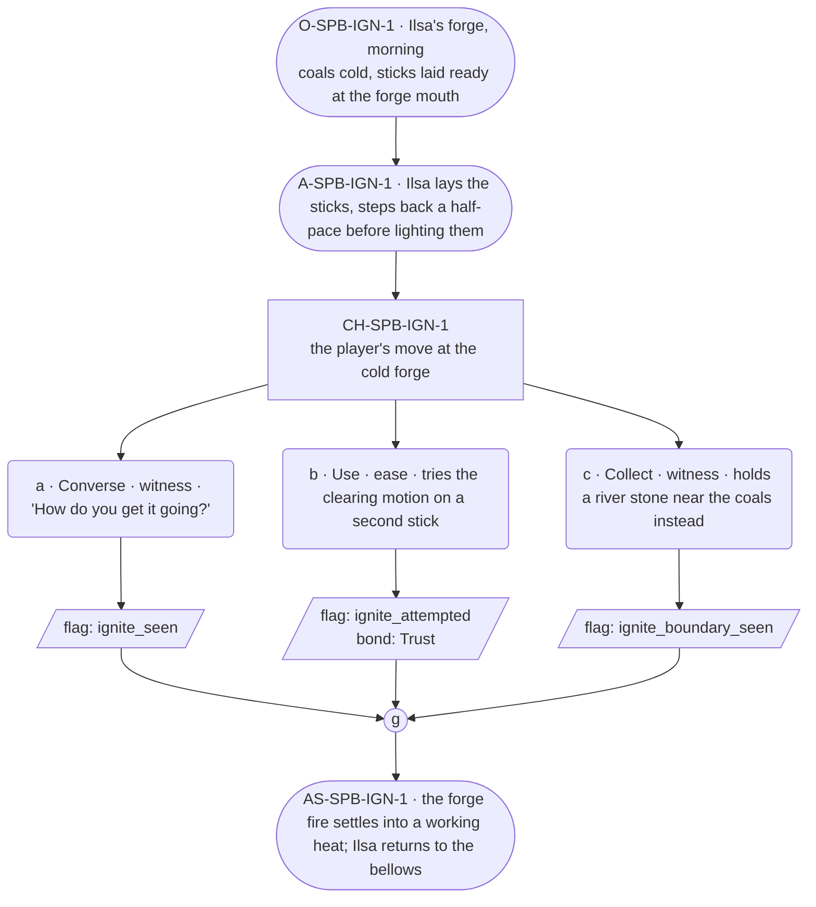

# SPB-ignite — line comparison

## Approved structure (Phase 1)

Structure (click to expand)

# SPB-ignite — Blacksmith spell beat: ignite

## Part A — Mini Architect Brief

**Reveal carried:** The first sight of `ignite` — introduced through Ilsa,
this life's Blacksmith, lighting the forge, per `content/magic/ignite.json`
(`learn_source`: "watch the blacksmith light the forge at the bench").
Component: `item_sticks`. Produces `item_flame` (and `item_heated_stone`
on a river-stone receiver — noted for texture, not staged here; that chain
belongs to F8, out of scope).

**State:** Ordinary workday, no thread material — spells attach to the
role, not the soul, so this scene stays generic-work rather than
arc-bearing.

**Sizing:** 6 beats — 2 setting beats, one 3-option choice node, one close.

**Constraint worth naming:** The phrase itself is never spoken as an
instruction — per the component-table discipline, the clue is physical
(sticks laid ready, a practiced motion) not verbal ("say ignite"). No
"remember/memory/forget" language anywhere near how the spell works
(guardrails check 7).

---

## Part B — Choice Designer Output

### Content block

**Incoming state (O-SPB-IGN-1):** Ilsa's forge, early morning. The banked
coals are cold. A bundle of sticks sits ready at the forge mouth — her
own daily habit, not staged for the player.

**A-SPB-IGN-1:** Ilsa lays the sticks into the forge mouth, settles them,
steps back a half-pace before doing anything else — a practiced clearance,
the physical clue (per the component table's confirm_action: cast on
inert material once).

**CH-SPB-IGN-1 (3 options, ungated):**
- **a · Converse · witness** — `player_line`: "How do you get it going?" —
  Ilsa: "You clear back first. Always." Settled, certain, no elaboration
  beyond the practical. Records `knowledge_flag(ignite_seen)`.
- **b · Use · ease** — `surface_action`: tries the same clearing motion on
  a second stick, off to the side. It catches, small and steady (per the
  `stick` receiver row). Records `knowledge_flag(ignite_attempted)` +
  `bond_event(Trust, weight 2)`.
- **c · Collect · witness** — `surface_action`: picks up a river stone
  lying nearby instead and holds it near the coals — the wrong material,
  no confirm_action licenses it yet, nothing catches. Records
  `knowledge_flag(ignite_boundary_seen)`.

Converges at **J-SPB-IGN-1**.

**Close (AS-SPB-IGN-1):** The forge fire settles into a working heat.
Ilsa returns to the bellows without comment, whichever way this went.

**Action-slot ratio:** 2 action beats (A-1, AS-1) across the scene ≈
within range.

**Long-run placement:** None.

**Equal weight:** a explains, b tries and succeeds, c tries the wrong
material and finds the boundary — all three are legitimate ways to learn
what the spell needs; none is punished, none is "correct."

### Mermaid graph

**Self-verify:** parses clean, options match prose, genuine gather, no
phrase spoken as instruction, no banned vocabulary, component table
(`item_sticks`) respected.

## Generated lines, by model

### setup

| Model | Word count | Text |
|---|---|---|
| styletune | 24 | The morning light catches the gray ash of the banked coals. Ilsa arranges a bundle of sticks at the forge mouth and steps back. |
| violetlotus | 109 | Ilsa's forge is cold and dark, the coals banked from the night before. She sets a bundle of sticks neatly at the forge mouth, her daily ritual, not for the player's sake. She takes a step back, pauses, then reaches for the bellows. "It's time," she says, a simple statement, not a question or request. She begins to work the bellows, coaxing the first flames from the dry tinder. "First light, first fire," she murmurs, more to herself than to the player. "Old way." The flames catch and grow, casting warm shadows on the walls of the forge. Ilsa watches the fire build, her expression unchanging. The player waits |
| crimson | 58 | Ilsa sets a bundle of sticks into the forge mouth, arranges them with practiced hands, then steps back half a pace, waiting. The forge is cold, the coals dormant beneath. She glances at the player, then back to the fire, her hands poised. "Always clear back first," she says, a statement of fact, not an invitation to debate. |
| gemma26b | 20 | Ilsa sets a bundle of sticks into the forge mouth, settling them into the ash. She steps back a half-pace. |

### option_a

| Model | Word count | Text |
|---|---|---|
| styletune | 22 | The player asks, "How do you get it going?"  Ilsa glances at the forge mouth and speaks. "You clear back first. Always." |
| violetlotus | 106 | The player asks, "How do you get it going?" Ilsa responds, "You clear back first. Always." She lays the sticks into the forge mouth, settles them, steps back a half-pace before doing anything else — a practiced clearance, the physical clue. She speaks the world dialect: one thought per turn, plain, confirming facts and never feelings, with the world's 75-word dialogue ceiling (loosened 2026-08-23) as a cap rather than a target — her ordinary line sits in the world's 5–7 word band, and that placement does not move just because the ceiling did. What marks her is grammar. Her arrangements arrive already decided and are stated |
| crimson | 35 | Ilsa pauses, turning her head slightly at the player's question. "You clear back first. Always." Settled, certain, no elaboration beyond the practical. She turns back to the forge, her hands already moving to the bellows. |
| gemma26b | 19 | The player asks, "How do you get it going?"  Ilsa steps back a half-pace. "You clear back first. Always." |

### option_b

| Model | Word count | Text |
|---|---|---|
| styletune | 24 | The player mimics her movement, clearing the same way on a separate stick. The wood catches with a small crackle, holding a steady glow. |
| violetlotus | 76 | The player tries the same clearing motion on a second stick, off to the side. It catches, small and steady. Ilsa watches, her eyes following the player's hands, and when the stick starts to smolder, she gives a brief nod of approval. "There it is," she says, her voice low and matter-of-fact. "Now you've got it." She moves to the bellows, her focus returning to the growing fire, leaving the player to observe their own accomplishment. |
| crimson | 37 | The player tries the same clearing motion on a second stick, off to the side. It catches, small and steady. Ilsa nods once, a slight dip of the chin. "Good," she says, and returns to the bellows. |
| gemma26b | 20 | The player tries the same clearing motion on a second stick, off to the side. It catches, small and steady. |

### option_c

| Model | Word count | Text |
|---|---|---|
| styletune | 16 | The player picks up a river stone from the floor and holds it near the coals. |
| violetlotus | 73 | The player picks up a river stone lying nearby instead and holds it near the coals. Ilsa glances at the stone, then looks away. "That won't catch." She returns to the bellows, her hands busy. No further explanation follows. The forge fire begins to take hold, but the stone remains unlit. Ilsa doesn't comment on the failed attempt. The lesson is clear without words: only the right materials will respond to the spell. |
| crimson | 74 | The player picks up a river stone and holds it near the coals. Ilsa glances at it, then back to the forge fire. "That's not the right kind," she says, her voice matter-of-fact. She sets the bellows aside and takes the stone from the player's hand, placing it back on the ground. "We use wood. Sometimes coal, but not stones." She returns to the bellows, resuming her work as if the interruption never happened. |
| gemma26b | 28 | The player picks up a river stone lying nearby and holds it near the coals. The light catches the edge of the rock, but the stone remains cold. |

