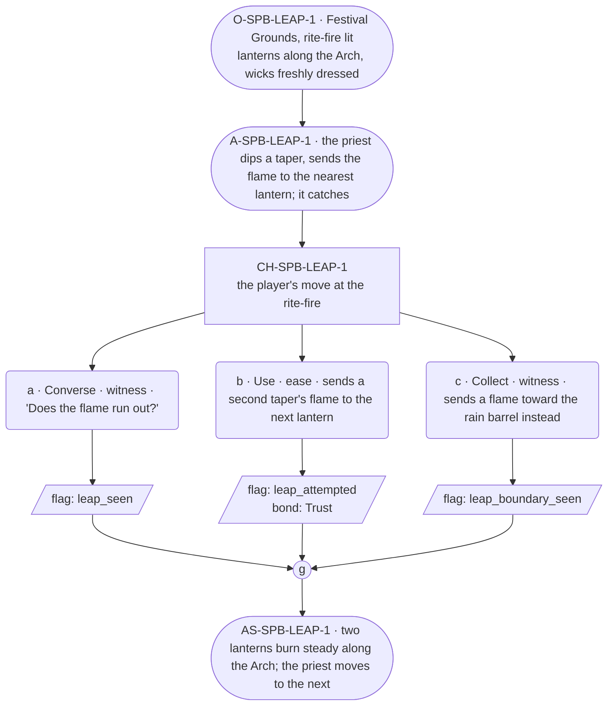

# SPB-leap — line comparison

## Approved structure (Phase 1)

Structure (click to expand)

# SPB-leap — Priest spell beat: leap

## Part A — Mini Architect Brief

**Reveal carried:** First sight of `leap`, via the priest dipping a flame
from the rite-fire and sending it lantern to lantern up the Lantern Arch
(`content/magic/leap.json` `learn_source`). Component: `item_flame`
(spent on cast — the cast moves a flame that already exists). State-
dependent on `cold_lantern`: wick dressed for the rite, the flame takes;
wick bare, it dies.

**Role holder:** Walk-on — "the priest," named per register.md's walk-on
band.

**Sizing:** 6 beats — 2 setting beats, one 3-option choice node, one close.

**Constraint worth naming:** The component is a flame that already
exists — the priest isn't creating fire, only spending one. The clue is
the dip-and-send motion at the rite-fire, never a spoken instruction.

---

## Part B — Choice Designer Output

### Content block

**Incoming state (O-SPB-LEAP-1):** The Festival Grounds, rite-fire lit. A
row of lanterns along the Arch, wicks freshly dressed for tonight.

**A-SPB-LEAP-1:** The priest dips a taper into the rite-fire, then sends
the flame across to the nearest lantern in one motion — it catches and
holds steady.

**CH-SPB-LEAP-1 (3 options, ungated):**
- **a · Converse · witness** — `player_line`: "Does the flame run out?" —
  the priest: "Depends how far it's asked to go. One flame, one send."
  Records `knowledge_flag(leap_seen)`.
- **b · Use · ease** — `surface_action`: dips a second taper and sends it
  to the next lantern along the row — the wick's dressed, it catches.
  Records `knowledge_flag(leap_attempted)` + `bond_event(Trust, weight
  2)`.
- **c · Collect · witness** — `surface_action`: sends a flame toward the
  rain barrel at the edge of the grounds instead, out of curiosity — it
  lands on the water and goes out, the flame spent for nothing. Records
  `knowledge_flag(leap_boundary_seen)`.

Converges at **J-SPB-LEAP-1**.

**Close (AS-SPB-LEAP-1):** Two lanterns along the Arch now burn steady.
The priest moves down the row toward the next dressed wick.

**Action-slot ratio:** 2 action beats across the scene ≈ within range.

**Long-run placement:** None.

**Equal weight:** a explains, b tries and succeeds, c spends a flame on
the wrong receiver and finds the cost of a miss.

### Mermaid graph

**Self-verify:** parses clean, options match prose, genuine gather,
walk-on named and banded correctly, spent-flame component respected.

## Generated lines, by model

### setup

| Model | Word count | Text |
|---|---|---|
| styletune | 33 | The Festival Grounds glow as the rite-fire burns bright, casting shadows across lanterns lined along the Arch. The priest dips a taper into the flames and sends the fire across in one motion. |
| violetlotus | 82 | The player stands at the edge of the Festival Grounds, watching the priest approach a row of lanterns, their wicks freshly dressed. A single flame burns steadily in the rite-fire nearby. The priest dips a taper into the flames, then sends the fire dancing through the air to the nearest lantern. It catches, and the lantern begins to glow. "One flame, one send," the priest murmurs, moving on to the next lantern. "A test of the festival's strength before the crowds arrive." |
| crimson | 70 | The Festival Grounds buzzed with anticipation as dusk settled. A row of lanterns lined the Arch, their wicks dressed and ready for the night's rite. "We gather to mark the solstice," the priest announced, his voice carrying over the crowd. He knelt by the rite-fire, its flames dancing in the cool evening air. "Let the light be sent, as our hearts and hopes are, to guide us through the dark." |
| gemma26b | 40 | Lanterns hang in a row along the Arch, their wicks freshly dressed for the night. The priest dips a taper into the rite-fire, sending the flame to the nearest lantern in one smooth motion. The wick catches and holds steady. |

### option_a

| Model | Word count | Text |
|---|---|---|
| styletune | 30 | The player asks, "Does the flame run out?" The priest glances up from the lantern, his lined face softening. "Depends how far it's asked to go. One flame, one send." |
| violetlotus | 24 | The priest pauses and turns to the player. "Does the flame run out?" "Depends how far it's asked to go. One flame, one send." |
| crimson | 25 | The priest looks up from the lantern wick, his hands still holding the taper. "Depends how far it's asked to go. One flame, one send." |
| gemma26b | 22 | The player asks, "Does the flame run out?"  The priest answers, "Depends how far it's asked to go. One flame, one send." |

### option_b

| Model | Word count | Text |
|---|---|---|
| styletune | 28 | The player dips a second taper into the fire and sends it to the next lantern along the row. The wick catches the flame instantly and holds steady. |
| violetlotus | 113 | The player dips a second taper and sends the flame to the next lantern. The wick catches and burns steadily. "I see," the player says, impressed. "It's a direct line." The priest nods, pleased. "The leap doesn't ask for much. Just a straight path." The lanterns now stretch down the Arch in a steady glow, each one alight and unwavering. The player looks along the line, understanding the simple power of the spell. "One flame, one send," the player murmurs, more to themselves than to the priest. The priest simply smiles, leaving the player to contemplate the magic in front of them. The flame has been sent, and the lanterns burn bright. The |
| crimson | 33 | The player dips a second taper and sends it to the next lantern along the row — the wick's dressed, it catches.  The priest nods, pleased. "Good. Steady now, one after the other." |
| gemma26b | 25 | The player dips a second taper into the rite-fire and sends the flame to the next lantern along the row, which catches and holds steady. |

### option_c

| Model | Word count | Text |
|---|---|---|
| styletune | 14 | The flame touches the water and dies instantly, leaving only a wisp of smoke. |
| violetlotus | 83 | The player sends a flame toward the rain barrel at the edge of the grounds instead, out of curiosity. It lands on the water and goes out, the flame spent for nothing. "Curiosity's a fine thing, but a wasted flame is a sorry thing to see." The priest shakes their head, moving to light the next lantern along the row. "It's a lesson best learned early, before the night gets long." The rain barrel glimmers in the fading light of the unspent flame. |
| crimson | 57 | The player sends a flame toward the rain barrel at the edge of the grounds instead, out of curiosity. It lands on the water and goes out, the flame spent for nothing. The priest turns, concern in their eyes. "A misaimed send's a wasted gift. The fire's meant for the lights, to guide us through the night." |
| gemma26b | 28 | The player sends the flame toward the rain barrel at the edge of the grounds. It lands on the water and goes out, the flame spent for nothing. |

