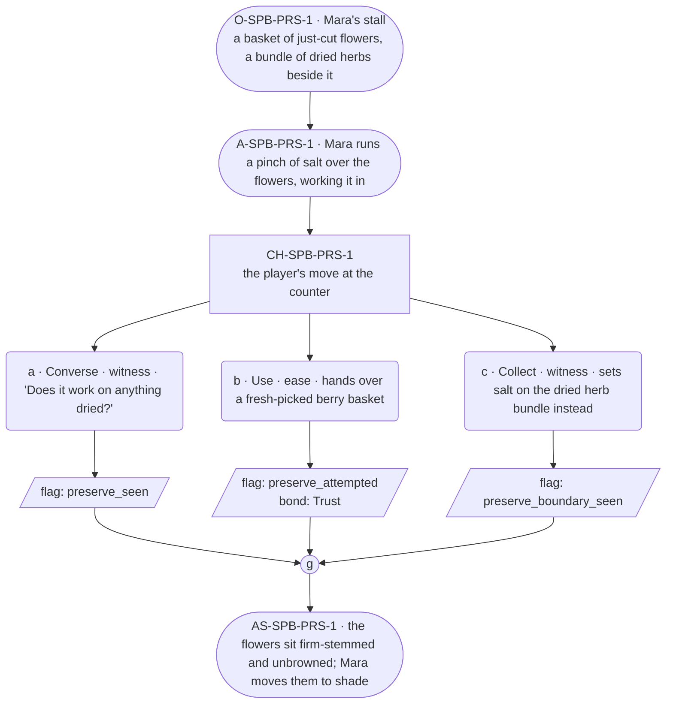

# SPB-preserve — line comparison

## Approved structure (Phase 1)

Structure (click to expand)

# SPB-preserve — Herbalist spell beat: preserve

## Part A — Mini Architect Brief

**Reveal carried:** First sight of `preserve`, via Mara laying cut herbs
by for the festival week (`content/magic/preserve.json` `learn_source`).
Component: `item_salt`. Clean effect on `cut_flowers`/fresh-picked things;
no_effect on `dried_herb_bundle` (already past fresh).

**State:** Ordinary workday, generic.

**Sizing:** 6 beats — 2 setting beats, one 3-option choice node, one close.

**Constraint worth naming:** No "remember/forget" language for how the
hold works — describe outcomes only (what stays fresh, what doesn't), per
her card canon flag 15.

---

## Part B — Choice Designer Output

### Content block

**Incoming state (O-SPB-PRS-1):** Mara's stall. A basket of just-cut
flowers sits beside a bundle of herbs already gone dry.

**A-SPB-PRS-1:** Mara runs a pinch of salt over the flowers, working it
in without ceremony — cut things need holding fast, before the day turns
them.

**CH-SPB-PRS-1 (3 options, ungated):**
- **a · Converse · witness** — `player_line`: "Does it work on anything
  dried?" — Mara: "No. Has to still be fresh." Records `knowledge_flag
  (preserve_seen)`.
- **b · Use · ease** — `surface_action`: hands over a fresh-picked
  berry basket for the same treatment — the berries hold at ripe.
  Records `knowledge_flag(preserve_attempted)` + `bond_event(Trust,
  weight 2)`.
- **c · Collect · witness** — `surface_action`: sets salt on the dried
  herb bundle instead, out of curiosity — nothing left to hold, no_effect.
  Records `knowledge_flag(preserve_boundary_seen)`.

Converges at **J-SPB-PRS-1**.

**Close (AS-SPB-PRS-1):** The flowers sit firm-stemmed, unbrowned, on the
counter. Mara moves them to the shaded end of the stall.

**Action-slot ratio:** 2 action beats across the scene ≈ within range.

**Long-run placement:** None.

**Equal weight:** a explains, b tries and succeeds, c tries the wrong
state (already past fresh) and finds the boundary.

### Mermaid graph

**Self-verify:** parses clean, options match prose, genuine gather,
component table respected, no banned vocabulary.

## Generated lines, by model

### setup

| Model | Word count | Text |
|---|---|---|
| styletune | 44 | A basket of just-cut flowers sits beside a bundle of herbs already gone dry on Mara's stall. Mara runs a pinch of salt over the blossoms, working the granules into the petals without ceremony. "Cut things need holding fast, before the day turns them." |
| violetlotus | 79 | The basket of just-cut flowers sits beside a bundle of herbs already gone dry. Mara runs a pinch of salt over the flowers, working it in without ceremony — cut things need holding fast, before the day turns them. "This keeps the bloom on," she says, "for a time." She sets the basket down and turns to the player. "You here to learn or to sell?" she asks, her eyes already moving to the next thing that needs tending. |
| crimson | 25 | Mara runs a pinch of salt over the flowers, working it in without ceremony — cut things need holding fast, before the day turns them. |
| gemma26b | 35 | Mara pinches salt between her thumb and forefinger and sprinkles it over the freshly cut flowers, working it into the stems without ceremony. "Needs to be held fast before the day turns them," she says. |

### option_a

| Model | Word count | Text |
|---|---|---|
| styletune | 43 | The player asks, "Does it work on anything dried?" Mara shakes her head while continuing her work. "No. Has to still be fresh. Once the sap has drawn back and the cells have collapsed, the salt can't find anything left to hold onto." |
| violetlotus | 115 | Mara looks up, hands still working the flowers. "No. Has to still be fresh." She sets the salt aside, picks up a small, dark berry from a basket beside her. "These, though — they keep the same, no matter how long they've been on the vine." She holds the berry out for the player to take. "Here, feel for yourself." Her eyes meet the player's, a small smile touching her lips. "Taste it. Tell me if it's any different from when it was first picked." Her voice carries a gentle challenge, an invitation to experience the magic she's talking about. The berry, held out in her palm, seems to glow slightly in the stall's soft |
| crimson | 67 | The player hands over a small bundle of fresh-cut wildflowers, still dewy at the edges. "Does it work on anything dried?"  Mara takes the flowers, runs her fingers over the stems, checking their firmness. "No. Has to still be fresh." She sprinkles a pinch of salt into her palm, rubbing it gently into the petals and leaves. "Cut things need holding fast, before the day turns them." |
| gemma26b | 26 | the player asks, "Does it work on anything dried?"  Mara shakes her head, her fingers still busy with the salt. "No. Has to still be fresh." |

### option_b

| Model | Word count | Text |
|---|---|---|
| styletune | 45 | The player hands over a basket of fresh-picked berries for the salt treatment. Mara accepts them with a nod and runs her fingers through the fruit, coating them in the white granules. "These will hold at ripe, keeping their color even as the sun sets." |
| violetlotus | 112 | Mara looks up as the player hands over the basket of fresh berries. "Good thinking," she says, sprinkling a pinch of salt over them. "This should keep them from going soft. Thank you for bringing these in." She smiles, her eyes crinkling at the corners. "It's always nice to have a helping hand." The berries sit plump and ripe on the counter, unblemished by time. Mara moves them to the shaded end of the stall, out of direct sunlight. "They'll be perfect for the market tomorrow," she says, her voice warm with gratitude. "You've done well." The player feels a sense of accomplishment, knowing they've helped preserve something beautiful. Mara's trust in |
| crimson | 46 | Mara takes the berry basket. "Good choice, these'll be ripe through the festival. Hold still a moment." She runs a pinch of salt over the berries, working it in as she speaks. "It's the fresh things need this. Once something's gone, there's no holding it back." |
| gemma26b | 42 | the player offers a basket of berries picked this morning. Mara nods, her fingers working the salt over the fruit with a steady rhythm. "This works just as well, so long as it's still ripe and has not started to go soft." |

### option_c

| Model | Word count | Text |
|---|---|---|
| styletune | 36 | The player sets a pinch of salt onto the dried bundle. Mara shakes her head slowly. "Those have already given up their life to the air, so there is nothing left for the salt to hold." |
| violetlotus | 113 | Mara shakes her head, taking the salt from the player's hand. "This won't hold it any longer." She brushes the grains into a bowl, saving them for the next cutting. "The drying's done. Salt can't put that freshness back." She sets the bundle in the player's hand, and the player feels its weight, dry and complete. "But you see how it holds now, with the salt?" She gives a nod to the flowers, standing green and unbrowned. "That's how you know the work's done." The player looks from the flowers to the herbs, the difference clear. "I see." The player sets the bundle on the counter, understanding the limit of the salt's work. |
| crimson | 29 | Mara's eyes narrow as she watches the salt fall onto the dry herb bundle. "No. Has to still be fresh," she says, her voice flat. The herbs remain unchanged. |
| gemma26b | 38 | The player sets a pinch of salt on the bundle of dried herbs, testing the edges of the practice.  "Does it work on things that are already done?" Mara asks, her hands moving with a steady, rhythmic grace. |

