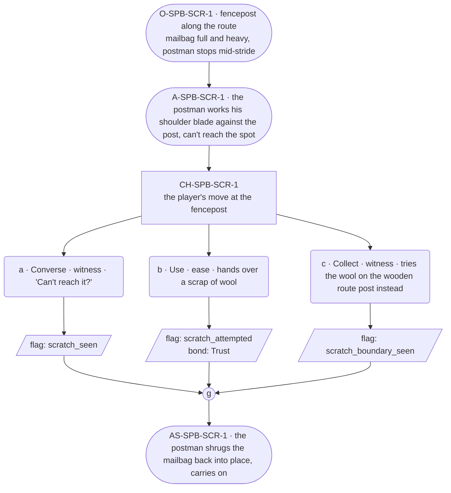

# SPB-scratch — line comparison

## Approved structure (Phase 1)

Structure (click to expand)

# SPB-scratch — Postman spell beat: scratch

## Part A — Mini Architect Brief

**Reveal carried:** First sight of `scratch`, via the postman pausing
mid-route under the full festival mailbag, casting on the strap-itch no
hand reaches (`content/magic/scratch.json` `learn_source`). Component:
`item_wool`. Canon starter spell, effect: soothes an itch in an
unreachable place — a bodily event, not a mood (per the magic index's
ruling that living receivers may be legal targets here specifically).

**Role holder:** No deep soul holds Postman this life — the holder is a
**walk-on** (named per register.md's walk-on band: no card, may explain
themselves, runs warmer and longer than a deep soul). Named in this
content block as "the postman"; Lines should write him in the walk-on
band, not a carded soul's register.

**State:** Ordinary route, generic.

**Sizing:** 6 beats — 2 setting beats, one 3-option choice node, one close.

**Constraint worth naming:** `scratch` is the one spell whose intended
receiver is alive — the physical-outcome rule is load-bearing here.
Relief of an itch is legal; contentment or gratitude is not, and whatever
the postman does about the relief belongs in the response as an observed
reaction, never a stated feeling.

---

## Part B — Choice Designer Output

### Content block

**Incoming state (O-SPB-SCR-1):** A fencepost along the route, festival
mailbag full and heavy. The postman stops, working one shoulder.

**A-SPB-SCR-1:** He works his shoulder blade against the post, can't
reach the spot, gives up and just holds still a second — a walk-on's
plain frustration, no deflection needed.

**CH-SPB-SCR-1 (3 options, ungated):**
- **a · Converse · witness** — `player_line`: "Can't reach it?" — the
  postman: "Right between the blades. Never can." Full sentence, warm,
  explains himself — walk-on band. Records `knowledge_flag(scratch_seen)`.
- **b · Use · ease** — `surface_action`: hands over a scrap of wool for
  him to work with — he settles it against the itch and it fades; his
  shoulders drop and roll once. Records `knowledge_flag
  (scratch_attempted)` + `bond_event(Trust, weight 2)`.
- **c · Collect · witness** — `surface_action`: tries the wool on the
  wooden route post instead, out of curiosity — nothing itches there,
  no_effect. Records `knowledge_flag(scratch_boundary_seen)`.

Converges at **J-SPB-SCR-1**.

**Close (AS-SPB-SCR-1):** The postman shrugs the mailbag back into place
and carries on down the lane.

**Action-slot ratio:** 2 action beats across the scene ≈ within range.

**Long-run placement:** None.

**Equal weight:** a explains, b relieves the itch (a bodily event, not a
mood — response stays physical), c tries an object and finds nothing
there.

### Mermaid graph

**Self-verify:** parses clean, options match prose, genuine gather,
walk-on named and banded correctly, physical-outcome rule respected
(relief only, no stated gratitude/mood).

## Generated lines, by model

### setup

| Model | Word count | Text |
|---|---|---|
| styletune | 28 | The postman pauses along the fence line, the mailbag heavy on one shoulder. He presses his shoulder blade against a post and grimaces, unable to reach the spot. |
| violetlotus | 71 | The postman stops at a fencepost along the route, the festival mailbag heavy and full on his shoulder. He works his shoulder blade against the post, trying to reach a spot that itches. Giving up, he leans against the post, taking a moment's respite. "Can't quite reach it," he mutters to himself, a plain frustration on his face. His eyes flicker to the player, wondering if they might have any ideas. |
| crimson | 61 | The postman pauses at the fencepost, his shoulders hunching as he shifts the heavy mailbag. He works his shoulder blade against the rough wood, trying to reach an elusive itch between his shoulder blades. With a sigh, he gives up and stands still, his breath misting in the chilly air. "Never can reach it," he mutters to himself, shaking his head. |
| gemma26b | 23 | The postman halts by a fencepost, shifting his weight and working his shoulder blade against the wood. "Right between the blades. Never can." |

### option_a

| Model | Word count | Text |
|---|---|---|
| styletune | 31 | The player gestures toward the man's shoulder. "Can't reach it?"  The postman grimaces as he shifts his weight. "Right between the shoulder blades. I can never quite reach that spot properly." |
| violetlotus | 84 | The postman nods. "Right between the blades. Never can." He shifts the mailbag, settling it more evenly. "But it's good to be moving again, once the itch lets up." He starts down the lane with a springier step, the wool scrap still in hand. The player watches him go, a small smile playing at their lips. It seems the festival's magic can reach even the most unexpected places. They turn back to the path, eager to see what other surprises the day might bring. |
| crimson | 54 | "Right between the blades. Never can." The postman's shoulders hunch as he leans back against the post, rubbing the spot with the side of his fist. "Appreciate the offer, but it's no use." He shifts the mailbag higher and trudges on, leaving the player standing there with the scrap of wool still in hand. |
| gemma26b | 19 | "Can't reach it?"  The postman shifts his weight, sighing with a tired grin. "Right between the blades. Never can." |

### option_b

| Model | Word count | Text |
|---|---|---|
| styletune | 28 | The player hands over a scrap of wool for him to work with. The postman settles the fabric against the itch and his shoulders drop and roll once. |
| violetlotus | 55 | The postman settles the scrap of wool against the spot, and the itch fades. His shoulders drop, roll once. "I'd thank you for that. Right between the blades — never can reach it myself." He gives a small nod, adjusts the mailbag, and continues on his way. The player's small kindness has earned some trust. |
| crimson | 32 | The player hands the postman a scrap of wool. The postman settles it against the spot on his back, and his shoulders drop and roll once. "Thank you, I feel human again." |
| gemma26b | 21 | The postman accepts the scrap of wool, settling it against the itch until it fades. His shoulders drop and roll once. |

### option_c

| Model | Word count | Text |
|---|---|---|
| styletune | 11 | The player presses the wool against the post. No relief comes. |
| violetlotus | 51 | The player tries the wool on the wooden route post instead, out of curiosity. It doesn't help. The postman watches, then shrugs, resettling his mailbag. "No itch there, of course. Just my skin." He turns back to his route, leaving the player to wonder about the strange sensations some people feel. |
| crimson | 23 | The player tries the wool on the wooden route post instead, out of curiosity. The postman watches, unimpressed. "Not gonna work on wood." |
| gemma26b | 14 | The player presses a scrap of wool against the wooden post. Nothing itches there. |

