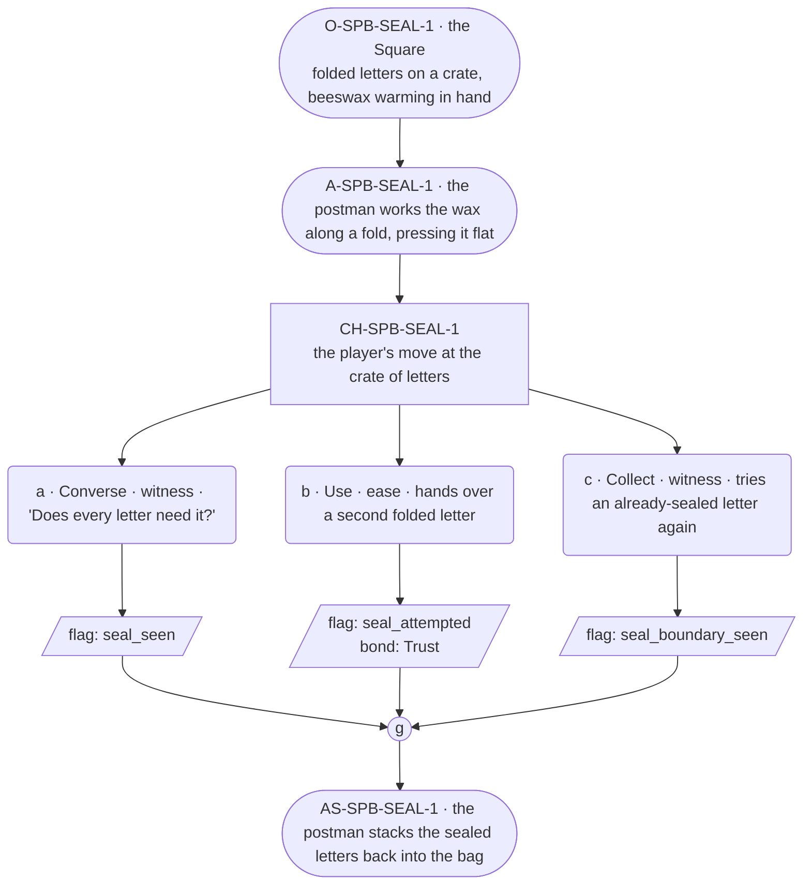

# SPB-seal — line comparison

## Approved structure (Phase 1)

Structure (click to expand)

# SPB-seal — Postman spell beat: seal

## Part A — Mini Architect Brief

**Reveal carried:** First sight of `seal`, via the postman closing the
festival letters in the Square before his rounds (`content/magic/seal.json`
`learn_source`). Component: `item_beeswax`. Clean effect on `folded_letter`
(seals weather-tight); no_effect on `sealed_letter` (already closed).

**Role holder:** Walk-on — "the postman," named per register.md's walk-on
band.

**Sizing:** 6 beats — 2 setting beats, one 3-option choice node, one close.

**Constraint worth naming:** No spoken instruction — the clue is the
wax and the motion of pressing the fold shut.

---

## Part B — Choice Designer Output

### Content block

**Incoming state (O-SPB-SEAL-1):** The Square, a stack of folded letters
on a crate, a lump of beeswax warming in the postman's hand.

**A-SPB-SEAL-1:** He works the wax along a fold, pressing it flat — "A
letter that opens in the rain is a letter lost," he says, warm and
explaining, walk-on band.

**CH-SPB-SEAL-1 (3 options, ungated):**
- **a · Converse · witness** — `player_line`: "Does every letter need
  it?" — the postman: "Just the ones going out today. Rain's coming."
  Records `knowledge_flag(seal_seen)`.
- **b · Use · ease** — `surface_action`: hands over a second folded
  letter for the same treatment — it seals shut along the fold. Records
  `knowledge_flag(seal_attempted)` + `bond_event(Trust, weight 2)`.
- **c · Collect · witness** — `surface_action`: picks up an
  already-sealed letter and tries it again, out of curiosity — nothing
  changes, it's already closed. Records `knowledge_flag
  (seal_boundary_seen)`.

Converges at **J-SPB-SEAL-1**.

**Close (AS-SPB-SEAL-1):** The postman stacks the sealed letters back
into the bag, ready for the rounds.

**Action-slot ratio:** 2 action beats across the scene ≈ within range.

**Long-run placement:** None.

**Equal weight:** a explains, b tries and succeeds, c tries an already-
sealed letter and finds the boundary.

### Mermaid graph

**Self-verify:** parses clean, options match prose, genuine gather,
walk-on named and banded correctly.

## Generated lines, by model

### setup

| Model | Word count | Text |
|---|---|---|
| styletune | 41 | A stack of folded letters rests on a wooden crate in the square as the postman works a lump of beeswax along a fold. "A letter that opens in the rain is a letter lost," he explains with a warm smile. |
| violetlotus | 118 | The player finds themselves in the Square, a quiet, open space with a few scattered crates and a lone postman. On one crate sits a stack of folded letters, their creases crisp and clean. The postman, a warm, friendly figure with a twinkle in his eye, is holding a lump of beeswax in his hand. He works it along the edge of one of the letters, his fingers deft and practiced. "A letter that opens in the rain is a letter lost," he says, his voice rich with experience and wisdom. The wax seals the fold shut with a satisfying snap. He looks up, noticing the player's presence, and smiles. "Just the ones going out today. Rain's coming |
| crimson | 36 | The postman's calloused hands work deftly, pressing a lump of warm beeswax along the folds of a letter. "A letter that opens in the rain," he says, eyes focused on his task, "is a letter lost." |
| gemma26b | 32 | The postman smooths a bead of warming beeswax along a crease in the paper. "A letter that opens in the rain is a letter lost," he says, his voice warm and explanatory. |

### option_a

| Model | Word count | Text |
|---|---|---|
| styletune | 31 | The player asks, "Does every letter need it?"  The postman smiles as he works. "Just the ones going out today. Rain's coming, and I'd hate to see their words run together." |
| violetlotus | 44 | The postman looks up from his wax, a gentle smile on his face. "A letter that opens in the rain is a letter lost," he says, warm and explaining. "Just the ones going out today. Rain's coming." The player nods, taking in the information. |
| crimson | 25 | "Does every letter need it?" the player asks, curious about the beeswax. The postman smiles warmly, explaining, "Just the ones going out today. Rain's coming." |
| gemma26b | 21 | The player asks, "Does every letter need it?"  The postman smiles and says, "Just the ones going out today. Rain's coming." |

### option_b

| Model | Word count | Text |
|---|---|---|
| styletune | 23 | The player hands over a second folded letter. The postman presses the wax down firmly, and the letter seals shut along the fold. |
| violetlotus | 48 | The player hands over a second folded letter. The postman takes it, pressing the warm beeswax along its fold, sealing it shut with practiced ease. "There you go," he says, "one more letter that'll weather the rain." The player's letter joins the stack, ready for the postman's rounds. |
| crimson | 58 | The player hands over a second folded letter to the postman. He takes it, a little surprised but pleased, and works the warm beeswax along its creases. "Ah, you're a quick learner," he says, pressing the folds flat. "Just like that, it's sealed. Ready for the journey ahead." He hands the letter back, now protected from the rain. |
| gemma26b | 19 | The player hands over a second folded letter. The postman presses the wax across the fold, sealing it shut. |

### option_c

| Model | Word count | Text |
|---|---|---|
| styletune | 24 | The player picks up an already-sealed letter and tries to press the wax again. The wax resists the movement, leaving the seal completely undisturbed. |
| violetlotus | 60 | The player picks up an already-sealed letter and tries it again, out of curiosity — nothing changes, it's already closed. "It's no use, once it's sealed," the postman says, with a hint of patience in his voice. "This one's been bound shut for a while now." He gently takes the letter back, adding it to the stack of sealed envelopes. |
| crimson | 36 | The player picks up an already-sealed letter and tries to reseal it, out of curiosity. The postman watches, amused. "No, no. That one's already gone through. A letter that opens again is a letter lost twice." |
| gemma26b | 26 | The player picks up an already-sealed letter and tries to apply the wax, but the letter remains unchanged. "Already closed, see?" the postman says, looking pleased. |

