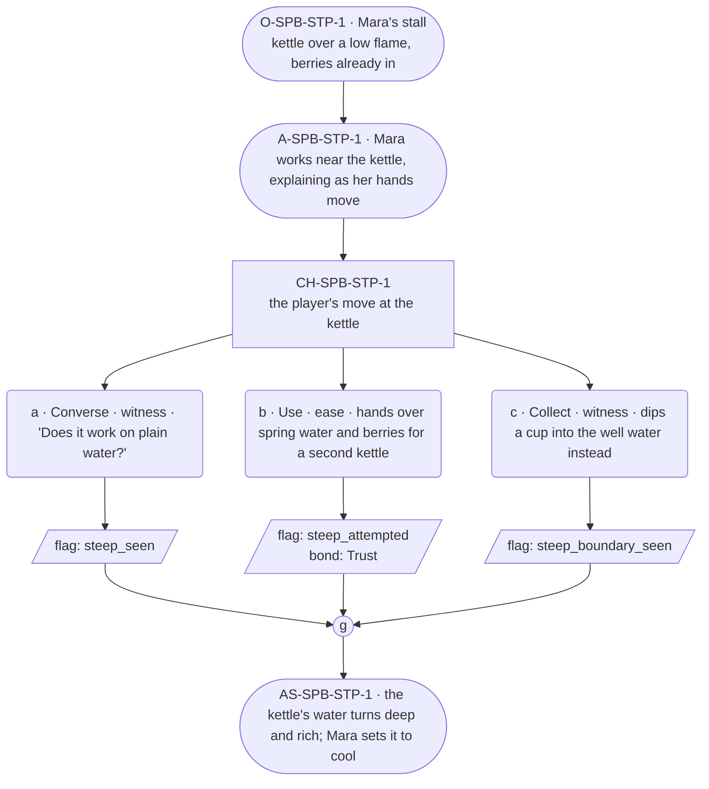

# SPB-steep — line comparison

## Approved structure (Phase 1)

Structure (click to expand)

# SPB-steep — Herbalist spell beat: steep

## Part A — Mini Architect Brief

**Reveal carried:** First sight of `steep`, via Mara drawing a batch of
tonic (`content/magic/steep.json` `learn_source`). Components: `item_berry`
+ `item_spring_water`. State-dependent on `kettle_of_water` — with herbs
in it, the water takes color and virtue fast; plain, no_effect.

**State:** Ordinary workday, generic.

**Sizing:** 6 beats — 2 setting beats, one 3-option choice node, one close.

**Constraint worth naming:** Mara's ordinary line sits in her 20-50-word
band, not the village median — she explains while her hands work, which
is her warmth, per her `voice_register`. No "remember/forget" language
describing the draw.

---

## Part B — Choice Designer Output

### Content block

**Incoming state (O-SPB-STP-1):** Mara's stall. A kettle of water sits
over a low flame, berries already dropped in.

**A-SPB-STP-1:** Mara sets her hand near the kettle, explaining as she
works — the water takes the berries' color fast when the cast draws it,
slow otherwise, and either way it's better than waiting on the fire
alone.

**CH-SPB-STP-1 (3 options, ungated):**
- **a · Converse · witness** — `player_line`: "Does it work on plain
  water?" — Mara: "Not on its own. Needs something in it first." Records
  `knowledge_flag(steep_seen)`.
- **b · Use · ease** — `surface_action`: hands over a fresh skin of
  spring water and a handful of berries for a second kettle. The color
  takes in moments. Records `knowledge_flag(steep_attempted)` +
  `bond_event(Trust, weight 2)`.
- **c · Collect · witness** — `surface_action`: dips a cup straight into
  the well water instead, out of curiosity — it only takes a faint,
  unwanted discoloration from leaf-litter, not a real draw (per the
  `well_water` receiver). Records `knowledge_flag(steep_boundary_seen)`.

Converges at **J-SPB-STP-1**.

**Close (AS-SPB-STP-1):** The kettle's water turns deep and rich. Mara
lifts it off the flame, sets it to cool.

**Action-slot ratio:** 2 action beats across the scene ≈ within range.

**Long-run placement:** None marked — her uncapped licence is reserved
for provenance, not this beat.

**Equal weight:** a explains, b tries and succeeds, c tries the wrong
receiver and finds a near-miss rather than nothing.

### Mermaid graph

**Self-verify:** parses clean, options match prose, genuine gather,
component table respected, no banned vocabulary.

## Generated lines, by model

### setup

| Model | Word count | Text |
|---|---|---|
| styletune | 40 | Mara rests her hand near the kettle as steam rises, watching the water darken. "The water takes the berries' color fast when the cast draws it, but slower otherwise, and either way it's better than waiting on the fire alone." |
| violetlotus | 85 | The player enters Mara's stall, where a kettle of water sits over a low flame, berries already dropped in. Mara sets her hand near the kettle, explaining as she works — the water takes the berries' color fast when the cast draws it, slow otherwise, and either way it's better than waiting on the fire alone. She smiles warmly at the player. "Good, another set of hands — hold this a second, mind the third step, and tell me your name while you're at it." |
| crimson | 58 | The kettle of water burbles gently over the low flame, already dotted with a handful of berries. Mara stands beside it, her hand hovering near the heat, explaining the process as she works. "The water takes the color fast when the cast draws it, slower otherwise. Either way, it's better than letting the fire do all the work." |
| gemma26b | 36 | Mara rests her hand near the kettle, watching the water. "The cast draws the berries' color fast, but it'll take a while if you just leave it to the fire. It's better to keep it moving." |

### option_a

| Model | Word count | Text |
|---|---|---|
| styletune | 48 | The player asks, "Does it work on plain water?"  Mara continues to stir the pot without looking up. "Not on its own, no. It needs something in it first to give the magic a handle to grab onto, otherwise the color just sits there like a stubborn stain." |
| violetlotus | 112 | The player looks at the kettle, curious. "Does it work on plain water?" Mara's hands pause near the kettle as she answers, "Not on its own. Needs something in it first." She resumes her work, explaining as she does. "The water takes the berries' color fast when the cast draws it, slow otherwise, and either way it's better than waiting on the fire alone." She sets the kettle down, letting the berries steep. "The cast helps the water draw the color in, but it still needs a start. That's the trick." She looks up, catching the player's eye with a small smile. "Just like most things, I suppose." The kettle's water turns |
| crimson | 33 | Mara glances at the player's cup of well water, the faint discoloration visible. "Not from the well, no," she says, shaking her head. "Needs the draw from the spring first, then it'll take." |
| gemma26b | 24 | The player asks, "Does it work on plain water?" Mara's hand hovers near the kettle. "Not on its own. Needs something in it first." |

### option_b

| Model | Word count | Text |
|---|---|---|
| styletune | 56 | The player hands over a fresh skin of spring water and a handful of berries. Mara pours the mixture into the second kettle and watches as the water transforms. "That's the trick to it—when you give the heat something to grab onto first, the draw takes hold much faster than it ever would on its own." |
| violetlotus | 117 | The player hands over a fresh skin of spring water and a handful of berries. Mara nods, accepting the offer. "Good, another set of hands — hold this a second, mind the third step, and tell me your name while you're at it." She takes the water and berries, placing them gently in the kettle. The water begins to take on the deep, rich color almost immediately, far faster than the first kettle. "See that? The cast draws it quicker when there's more to pull from. That's how you know it's working right." She smiles warmly, appreciating the player's help and the successful demonstration. "What did you say your name was?" she asks, turning her attention back |
| crimson | 82 | The player hands over a fresh skin of spring water and a handful of berries. "Here, try this." Mara takes the offerings with a warm smile, "Good, another set of hands. Just like that, thank you." She pours the water into a second kettle, adds the berries, and sets it over the flame. The color takes in moments, darkening the water almost immediately. Mara nods, satisfied. "That's the trick to it. The cast draws faster when there's something in the water already." |
| gemma26b | 55 | The player offers a fresh skin of spring water and a handful of berries for a second kettle. The water takes on a deep hue in moments, and Mara gives a small, approving nod. "That's the way. The color takes fast when the cast draws it, and it's better than waiting on the fire alone." |

### option_c

| Model | Word count | Text |
|---|---|---|
| styletune | 27 | The player dips the cup into the well water instead. The liquid turns a pale, unappetizing gray from the sediment below, failing to draw any true color. |
| violetlotus | 92 | Mara watches the player dip a cup into the well water. She frowns, a moment of confusion before understanding. "Not like that," she says, gently. "The well's too shallow, too much leaf-litter. It needs a draw from the deep water, a touch of magic to bring out the color." She takes the cup, sets it aside, and pours fresh water from the kettle into another cup. "This is the right way." She hands the steaming cup to the player. "The cast takes the water's color much faster than the well ever could." |
| crimson | 64 | The player dips a cup straight into the well water instead, out of curiosity — it only takes a faint, unwanted discoloration from leaf-litter, not a real draw. Mara watches, her hands still, as the player lifts the cup and examines the water. She says nothing, but her eyes narrow slightly, a moment of silent appraisal before she turns back to her own work. |
| gemma26b | 48 | The player dips a cup straight into the well water to see. Mara watches the cup, noting how the liquid takes on a faint, unwanted discoloration from the floating leaf-litter. "It catches what is there, but it doesn't draw anything new. It's just the well being the well." |

