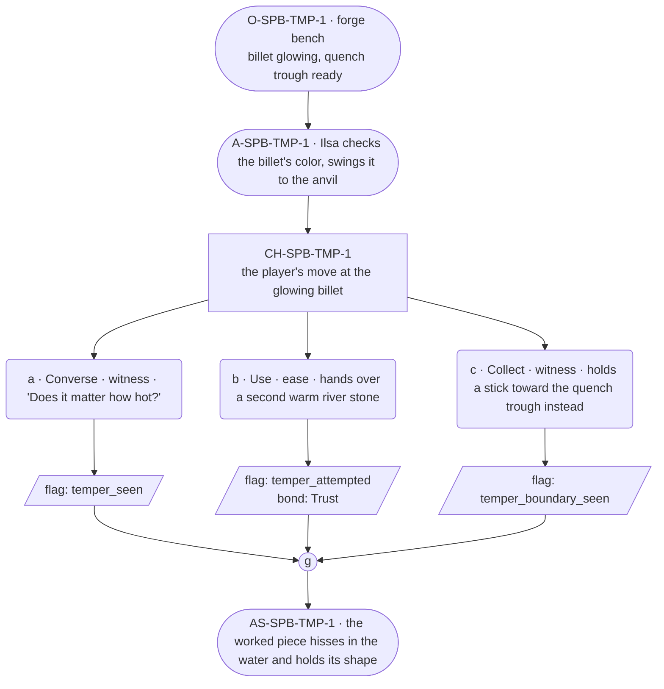

# SPB-temper — line comparison

## Approved structure (Phase 1)

Structure (click to expand)

# SPB-temper — Blacksmith spell beat: temper

## Part A — Mini Architect Brief

**Reveal carried:** First sight of `temper`, via Ilsa quenching a glowing
piece at the bench (`content/magic/temper.json` `learn_source`).
Components: `item_river_stone` + `item_spring_water`. State-dependent on
the `forge_billet` receiver — glowing hot hardens evenly; cold, no_effect.

**State:** Ordinary workday, generic.

**Sizing:** 6 beats — 2 setting beats, one 3-option choice node, one close.

**Constraint worth naming:** The clue is the quench motion and the
state-dependence itself (has to be hot) — never a spoken phrase-as-
instruction.

---

## Part B — Choice Designer Output

### Content block

**Incoming state (O-SPB-TMP-1):** The forge bench. A billet glows from the
fire, tongs holding it steady. A trough of spring water sits ready beside
the anvil.

**A-SPB-TMP-1:** Ilsa turns the billet once more in the coals, checking
the color, then swings it to the anvil — the state-dependent clue: it has
to be hot for this to matter at all.

**CH-SPB-TMP-1 (3 options, ungated):**
- **a · Converse · witness** — `player_line`: "Does it matter how hot?" —
  Ilsa: "Glowing, not just warm." Flat, exact. Records `knowledge_flag
  (temper_seen)`.
- **b · Use · ease** — `surface_action`: hands over a second river stone,
  already sitting warm near the fire, for Ilsa to work on the same way.
  It hardens evenly under her hands. Records `knowledge_flag
  (temper_attempted)` + `bond_event(Trust, weight 2)`.
- **c · Collect · witness** — `surface_action`: picks up a stick lying
  nearby and holds it toward the quench trough instead — wood takes no
  temper, nothing happens (per the `stick` receiver's no_effect). Records
  `knowledge_flag(temper_boundary_seen)`.

Converges at **J-SPB-TMP-1**.

**Close (AS-SPB-TMP-1):** The worked piece hisses in the water and holds
its shape. Ilsa checks the edge with her thumb, sets it aside.

**Action-slot ratio:** 2 action beats across the scene ≈ within range.

**Long-run placement:** None.

**Equal weight:** a explains, b tries and succeeds, c finds the boundary
on the wrong material — all legitimate, none punished.

### Mermaid graph

**Self-verify:** parses clean, options match prose, genuine gather, no
phrase spoken as instruction, component table respected.

## Generated lines, by model

### setup

| Model | Word count | Text |
|---|---|---|
| styletune | 44 | The forge bench holds a billet glowing orange in the fire, gripped steady by tongs while a trough of spring water waits beside the anvil. Ilsa turns the metal once more in the coals to check its color before swinging it to the anvil. |
| violetlotus | 60 | The forge bench, its stones warm underfoot. Ilsa, sleeves rolled up, turns the billet in the coals. "Glowing, not just warm," she says, flat and exact. The metal's color deepens to the point she needs. She swings it to the anvil with a solid clink. The player watches, a stick in hand, wondering if the water will change it too. |
| crimson | 35 | Ilsa swings the billet to the anvil, its glowing surface sending a flicker of heat into the air. "It needs to glow, not just be warm," she says flatly, her gaze fixed on the metal. |
| gemma26b | 39 | The forge bench holds a glowing billet steady between the coals and the anvil. A trough of spring water sits ready. Ilsa turns the piece once more in the fire, checking the color, then swings it toward the anvil. |

### option_a

| Model | Word count | Text |
|---|---|---|
| styletune | 19 | The player asks, "Does it matter how hot?"  Ilsa tests the heat against the metal. "Glowing, not just warm." |
| violetlotus | 12 | Ilsa turns to face the player. "Glowing, not just warm." Flat, exact. |
| crimson | 31 | Ilsa turns the billet once more in the coals, checking the color, then swings it to the anvil. "Glowing, not just warm," she says flatly. "That's the only way it matters." |
| gemma26b | 17 | The player asks, "Does it matter how hot?"  Ilsa sets the metal down. "Glowing, not just warm." |

### option_b

| Model | Word count | Text |
|---|---|---|
| styletune | 31 | The player offers a second river stone that has been warming near the fire. Ilsa takes it and works the metal against the stone. The surface hardens evenly under her hands. |
| violetlotus | 60 | The player hands Ilsa a second river stone, already sitting warm near the fire. Ilsa takes it without a word and begins to work it the same way, shaping it evenly under her hands. The stone hardens, holding the temper. Ilsa sets it aside, giving a small nod. "That one's ready." The player's choice has proven they understand the process. |
| crimson | 59 | The player hands Ilsa a second river stone, warm from near the fire. Ilsa takes it and starts to work it the same way, her movements confident and precise. "This one's ready," she says, not looking up. The stone hardens evenly under her touch, the temper taking hold. "There," she finishes, setting it down beside the first. "Both done." |
| gemma26b | 20 | The player hands over a second river stone, already sitting warm near the fire. It hardens evenly under her hands. |

### option_c

| Model | Word count | Text |
|---|---|---|
| styletune | 27 | The player picks up a stick from the ground and holds it toward the quench trough. The wood absorbs the water without change, remaining unchanged and soft. |
| violetlotus | 91 | Ilsa shakes her head. "Wood won't take a temper." She turns back to the glowing billet. "It's the metal that has to change." She taps the tongs against the anvil, setting a rhythm as the metal cools. "Steady, like this." She demonstrates, working the billet in time. "You'll feel it start to harden." The billet hisses as she dips it into the water. "There. It'll hold now." She sets the piece aside and reaches for the next. "Your turn." She offers the tongs to the player. "See what you can do." |
| crimson | 39 | The player picks up a stick lying nearby and holds it toward the quench trough. The stick hisses briefly but emerges unchanged. Ilsa watches without comment, then turns back to the anvil, setting the properly tempered piece beside it. |
| gemma26b | 24 | The player picks up a nearby stick and holds it toward the quench trough. The wood takes no temper, and the water merely hisses. |

