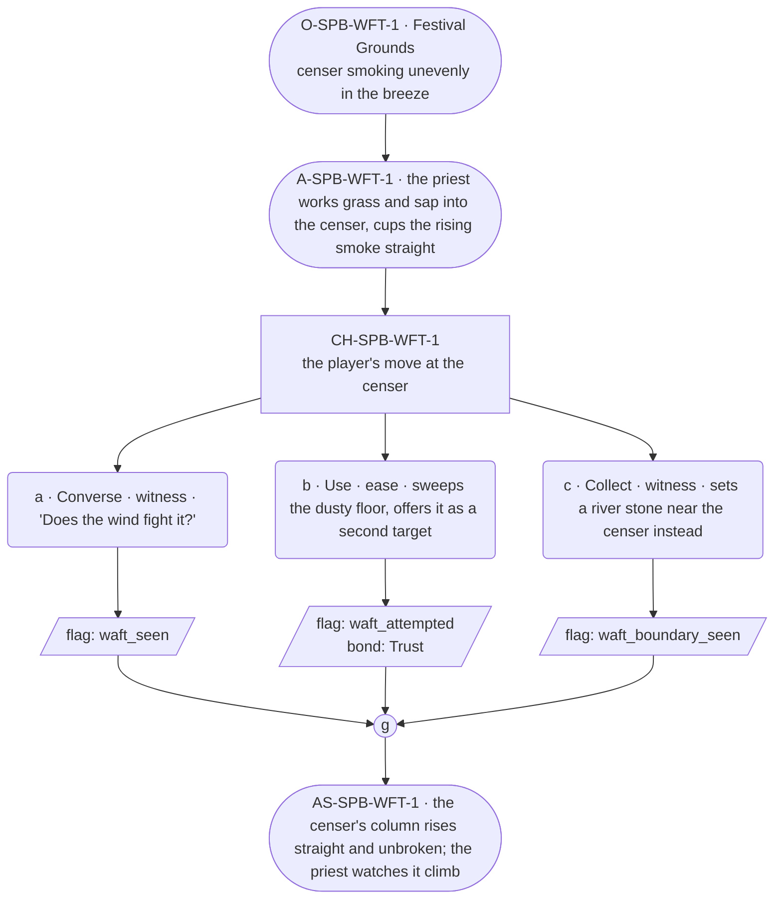

# SPB-waft — line comparison

## Approved structure (Phase 1)

Structure (click to expand)

# SPB-waft — Priest spell beat: waft

## Part A — Mini Architect Brief

**Reveal carried:** First sight of `waft`, via the priest sending censer
smoke up straight at the Festival Grounds (`content/magic/waft.json`
`learn_source`). Components: `item_grass` + `item_tree_sap`. Clean effect
on `censer_smoke` (rises in a single straight column); no_effect on
`river_stone` (nothing about it can rise or drift).

**Role holder:** Walk-on — "the priest."

**Sizing:** 6 beats — 2 setting beats, one 3-option choice node, one close.

---

## Part B — Choice Designer Output

### Content block

**Incoming state (O-SPB-WFT-1):** The Festival Grounds, a censer smoking
unevenly in the breeze. The priest kneels beside it, unhurried.

**A-SPB-WFT-1:** He works grass and sap into the censer, cups his hands
around the rising smoke — it steadies and climbs straight, undisturbed by
the wind.

**CH-SPB-WFT-1 (3 options, ungated):**
- **a · Converse · witness** — `player_line`: "Does the wind fight it?" —
  the priest: "Not once it's called straight." Records `knowledge_flag
  (waft_seen)`.
- **b · Use · ease** — `surface_action`: sweeps the dusty floor near the
  censer, offering it as a second thing to lift — the dust rises in a
  thin sheet and drifts out the doorway. Records `knowledge_flag
  (waft_attempted)` + `bond_event(Trust, weight 2)`.
- **c · Collect · witness** — `surface_action`: sets a river stone near
  the censer instead, out of curiosity — nothing about it can rise or
  drift, no_effect. Records `knowledge_flag(waft_boundary_seen)`.

Converges at **J-SPB-WFT-1**.

**Close (AS-SPB-WFT-1):** The censer's column rises straight and unbroken
over the Grounds. The priest sits back, watching it climb.

**Action-slot ratio:** 2 action beats across the scene ≈ within range.

**Long-run placement:** None.

**Equal weight:** a explains, b tries a plausible receiver and succeeds,
c tries an inert stone and finds the boundary.

### Mermaid graph

**Self-verify:** parses clean, options match prose, genuine gather,
walk-on named and banded correctly.

## Generated lines, by model

### setup

| Model | Word count | Text |
|---|---|---|
| styletune | 49 | A censer smokes unevenly in the breeze across the Festival Grounds. The priest kneels beside it in an unhurried manner, working grass and sap into the container before cupping his hands around the rising smoke. The smoke steadies beneath his touch and climbs straight upward, undisturbed by the wind. |
| violetlotus | 50 | The priest kneels beside the censer, unhurriedly working grass and sap into it. He cups his hands around the rising smoke, and it steadies, climbing straight and undisturbed by the wind. "Once it's called straight, the wind won't fight it," he murmurs, his voice calm and steady like the smoke. |
| crimson | 63 | The player steps into the Festival Grounds, a wide grassy expanse bordered by the old stone walls of the village. In the center, a priest in simple robes kneels beside a smoking censer, tending to the fragrant wisps of smoke with careful, deliberate movements. The air is filled with the scent of burning herbs and the gentle rustling of leaves in the breeze. |
| gemma26b | 41 | The priest kneels beside a censer smoking unevenly in the breeze. He works grass and sap into the embers, cupping his hands around the rising smoke until it steadies and climbs straight, undisturbed by the wind. "Not once it's called straight." |

### option_a

| Model | Word count | Text |
|---|---|---|
| styletune | 19 | The player asks, "Does the wind fight it?" The priest looks up and replies, "Not once it's called straight." |
| violetlotus | 86 | The priest looks up, a small smile touching his lips. "It's a simple truth, but a profound one," he says, his voice soft yet clear. "Once something is called straight, the wind respects that. It can't change its path." He turns his gaze back to the censer, the steady column of smoke rising into the sky. "Just as some things in life, once they're set, they won't be moved by the winds of change." The player nods thoughtfully, the priest's words resonating with their own experiences. |
| crimson | 41 | "Does the wind fight it?" the player asks.  The priest glances up, then returns his gaze to the censer. "Not once it's called straight," he says, holding his hands around the steady column of smoke. "The wind doesn't touch it then." |
| gemma26b | 19 | The player asks, "Does the wind fight it?" The priest smiles at the smoke. "Not once it's called straight." |

### option_b

| Model | Word count | Text |
|---|---|---|
| styletune | 29 | The player sweeps the dusty floor near the censer, offering it as a second thing to lift. The dust rises in a thin sheet and drifts out the doorway. |
| violetlotus | 97 | The player sweeps the dusty floor near the censer, offering it as a second thing to lift. The dust rises in a thin sheet and drifts out the doorway.  The priest watches, a small smile tugging at the corners of his mouth. "Well done," he says, "You've a knack for this." His eyes follow the dust as it disappears into the sunlight. "The Festival will be pleased." He turns back to the censer, hands still cupped around its steady stream of smoke. "Now, let's see what else you can raise." His gaze shifts to the player, expectant. |
| crimson | 39 | The player sweeps the dusty floor near the censer, offering it as a second thing to lift. The dust rises in a thin sheet and drifts out the doorway. "Well, would you look at that," the priest murmurs, pleased. |
| gemma26b | 47 | The player sweeps a dusting of dirt from the floor near the censer, sending a thin sheet of dust to rise and drift out the doorway. The priest watches the particles climb in a steady line, his eyes following them to the very edge of the smoke. |

### option_c

| Model | Word count | Text |
|---|---|---|
| styletune | 19 | The player sets a river stone near the censer. The stone remains stubbornly in place, neither rising nor drifting. |
| violetlotus | — | **FAILED**: leakage: structural marker leaked into output: 'Records ' |
| crimson | 34 | The player sets a river stone near the censer. The column of smoke flows around the stone, rising undisturbed as if it weren't there. The priest watches, expressionless. "It rises from what it can." |
| gemma26b | 25 | The player places a river stone near the censer. The heavy object rests firmly on the earth, unable to rise or drift with the breeze. |

