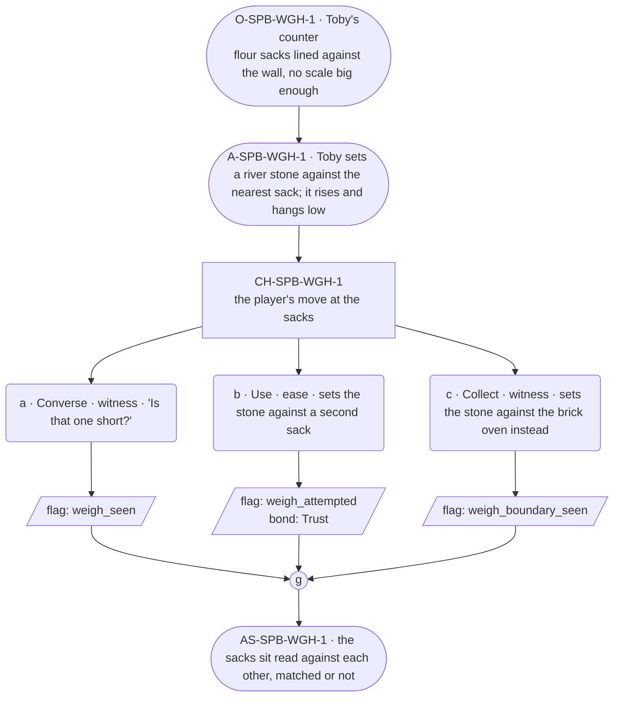

# SPB-weigh — line comparison

## Approved structure (Phase 1)

Structure (click to expand)

# SPB-weigh — Baker spell beat: weigh

## Part A — Mini Architect Brief

**Reveal carried:** First sight of `weigh`, via Toby settling the flour
sacks at the counter (`content/magic/weigh.json` `learn_source`).
Component: `item_river_stone`. Clean effect on `flour_sack` (hangs at a
height set by heft); no_effect on `brick_oven` (built into the floor,
nothing to bear up).

**State:** Ordinary workday, generic.

**Sizing:** 6 beats — 2 setting beats, one 3-option choice node, one close.

**Constraint worth naming:** Same discipline as `SPB-portion` — Toby stays
fast, exact about quantities (`precision_profile`), never elaborating.

---

## Part B — Choice Designer Output

### Content block

**Incoming state (O-SPB-WGH-1):** Toby's counter, flour sacks lined up
against the wall — no scale in town built for feast quantities.

**A-SPB-WGH-1:** Toby sets a river stone against the nearest sack. It
rises a hand's breadth and hangs — heavy, low.

**CH-SPB-WGH-1 (3 options, ungated):**
- **a · Converse · witness** — `player_line`: "Is that one short?" — Toby:
  "Hangs low. That's full." Fast, exact. Records `knowledge_flag
  (weigh_seen)`.
- **b · Use · ease** — `surface_action`: sets the stone against a second
  sack the same way — it hangs level with the first, matched. Records
  `knowledge_flag(weigh_attempted)` + `bond_event(Trust, weight 2)`.
- **c · Collect · witness** — `surface_action`: sets the stone against the
  brick oven instead, out of curiosity — built into the floor, nothing to
  bear up, no_effect. Records `knowledge_flag(weigh_boundary_seen)`.

Converges at **J-SPB-WGH-1**.

**Close (AS-SPB-WGH-1):** The sacks sit read against each other, matched
or not. Toby's already onto the next task.

**Action-slot ratio:** 2 action beats across the scene ≈ within range.

**Long-run placement:** None.

**Equal weight:** a explains, b tries and succeeds, c finds the boundary
on an immovable object.

### Mermaid graph

**Self-verify:** parses clean, options match prose, genuine gather,
component table respected.

## Generated lines, by model

### setup

| Model | Word count | Text |
|---|---|---|
| styletune | 22 | Toby leans a river stone against the nearest flour sack. The stone rises a hand's breadth and hangs heavy against the grain. |
| violetlotus | 116 | The sacks are lined up against the wall, each a different size and fullness. Toby sets a river stone against the nearest one. It rises a hand's breadth and hangs — heavy, low. "That's full," he says, fast and exact. He moves on to the next sack, his eyes flicking to the stone, to the sack, to the stone again, checking and rechecking. The flour shifts slightly inside, settling under the weight. Toby adjusts the sack, aligning it with its neighbor. "Even now," he mutters, more to himself than to the player. He picks up another stone, this one smaller, and sets it against the next sack. It too hangs low, not quite matching the first. |
| crimson | 28 | Toby sets a river stone against the nearest sack. It rises a hand's breadth and hangs — heavy, low. "Hangs low. That's full," he says, fast and exact. |
| gemma26b | 50 | Toby stands before the line of flour sacks leaning against the wall. He pulls a smooth river stone from his apron, checking its weight in his palm before setting it against the nearest sack. It hangs low, the fabric bulging a hand's breadth above the ground. "Hangs low. That's full." |

### option_a

| Model | Word count | Text |
|---|---|---|
| styletune | 19 | The player asks, "Is that one short?"  Toby nods, adjusting his grip on the sack. "Hangs low. That's full." |
| violetlotus | 36 | The player looks at the sack, then at Toby. "Is that one short?" Toby sets the stone against a third sack. It rises the same, level. "Hangs low. That's full." Fast, exact. He doesn't look up. |
| crimson | 34 | Toby sets the stone against a third sack. It hangs high, lighter than the others.  "Is that one short?" the player asks.  Toby glances at the sack, fast and exact. "Hangs high. That's light. |
| gemma26b | 17 | The player asks, "Is that one short?"  Toby's gaze stays on the sack. "Hangs low. That's full." |

### option_b

| Model | Word count | Text |
|---|---|---|
| styletune | 19 | The player sets the stone against the second sack. The rock holds steady, hanging perfectly level with the first. |
| violetlotus | 42 | The player sets the stone against a second sack the same way — it hangs level with the first, matched.  Toby glances up, then back to his work. "Two of a kind now." A brief nod, the closest he comes to praise. |
| crimson | 35 | The player sets the stone against a second sack the same way — it hangs level with the first, matched. Toby glances up, notes it with a nod. "Right. You've got a feel for it." |
| gemma26b | 18 | The player sets the stone against a second sack the same way. It hangs level with the first. |

### option_c

| Model | Word count | Text |
|---|---|---|
| styletune | 17 | The player sets the stone against the brick oven floor. The stone simply drops, finding no purchase. |
| violetlotus | 80 | The player sets the stone against the brick oven. The stone clatters to the floor, unmoved. "Built in. Nothing to bear up," Toby says, not looking up from the sacks. He doesn't explain further, already moving on to the next task. The oven stands solid and immovable, offering no information beyond its own unyielding nature. Toby records the boundary in his mind, but doesn't dwell on it. The sacks remain, waiting for his attention. He turns to them, stone forgotten. |
| crimson | 32 | The player sets the stone against the brick oven. It rests flat and immovable, bearing no weight. Toby glances over, sees the oven and the stone. "Oven's built in, won't bear up." |
| gemma26b | 20 | The player sets the stone against the brick oven instead. It sits flat against the floor, leaving the weight unmeasured. |

