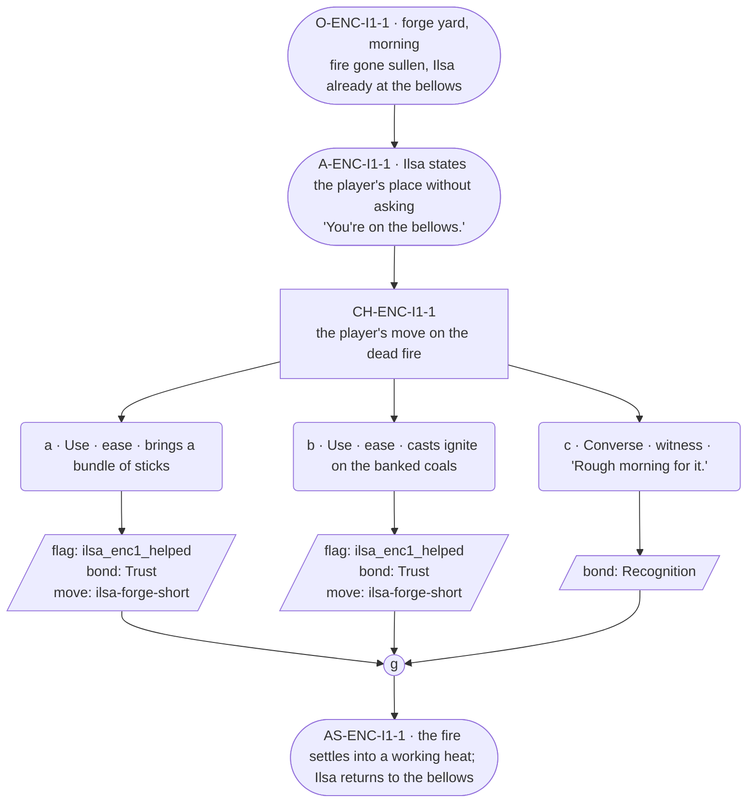

# ENC-ilsa-1 — Blacksmith festival goal, encounter 1 of 3

## Part A — Mini Architect Brief

**Reveal carried:** State 1 of the centerpiece shortfall — the forge won't
hold heat (`ilsa-forge-short` registry, mishap-pool state 1). The pressure
here is the role's, not the family thread's — no Bram material in this
scene.

**State of the shortfall:** Work stalled at the most basic level; nothing
about the ore or the missing part yet.

**Sizing:** 7 beats — 2 setting beats, one 3-option choice node, one
consequence beat, one close.

**Mechanical ruling — pass/fail gate.** Passes on **a** (item) or **b**
(spell) — `knowledge_flag(ilsa_enc1_helped)` + `bond_event(Trust, weight
2)` + `thread_move(ilsa-forge-short)`. **c** — `bond_event(Recognition,
weight 2)` only, no thread move.

**Constraint worth naming:** **No `bond_band()` predicate anywhere in this
scene** — Ilsa's canon flag 11 and her thread registry both bar bond-band
gating outright. Her settled-declarative grammar (arrangements stated
already-true, no question mark) governs her one dialogue line.

---

## Part B — Choice Designer Output

### Content block

**Incoming state (O-ENC-I1-1):** Ilsa's forge yard, morning. The forge
fire has gone sullen — smoke instead of heat. She's already working the
bellows herself, arrangement-first as always.

**A-ENC-I1-1:** She doesn't ask for help. She states where the player is
useful before they've said anything: "You're on the bellows." — settled
present, no proposal grammar, the offer arriving as already-decided fact.

**CH-ENC-I1-1 (3 options, ungated):**
- **a · Use · ease** — `surface_action`: brings a bundle of sticks
  (`item_sticks`) to feed the fire. Ilsa takes them without pausing, works
  them in. Records `knowledge_flag(ilsa_enc1_helped)` + `bond_event(Trust,
  weight 2)` + `thread_move(ilsa-forge-short)`.
- **b · Use · ease** — `surface_action`: casts *ignite* on the banked coals
  (component `item_sticks`). The fire catches properly; Ilsa feels the
  heat change through the bellows handle and adjusts her rhythm to match,
  wordless. Records `knowledge_flag(ilsa_enc1_helped)` + `bond_event(Trust,
  weight 2)` + `thread_move(ilsa-forge-short)`.
- **c · Converse · witness** — `player_line`: "Rough morning for it." —
  Ilsa: "It'll come round." Flat, certain, no elaboration. Records
  `bond_event(Recognition, weight 2)`, no thread move.

Converges at **J-ENC-I1-1**.

**AS-ENC-I1-1:** The fire settles into a working heat either way — visibly
better if a/b, unchanged-but-tended if c. Ilsa goes back to the bellows
without comment.

**Close:** No line closes the scene; the forge's new heat is the closing
image (object slot).

**Action-slot ratio:** 2 action beats across the scene ≈ within range.

**Long-run placement:** None. Her sanctioned long run is reserved for
lineage/household history only, which has no place in a work-stall beat.

**Equal weight:** a and b both restore the fire by a different route; c
respects her self-sufficiency without touching the work — a legitimate
read, since she never asks.

### Mermaid graph

**Self-verify:** parses clean, no `bond_band()` predicate anywhere, ids
scoped `-I1-`, options match prose, genuine gather.
