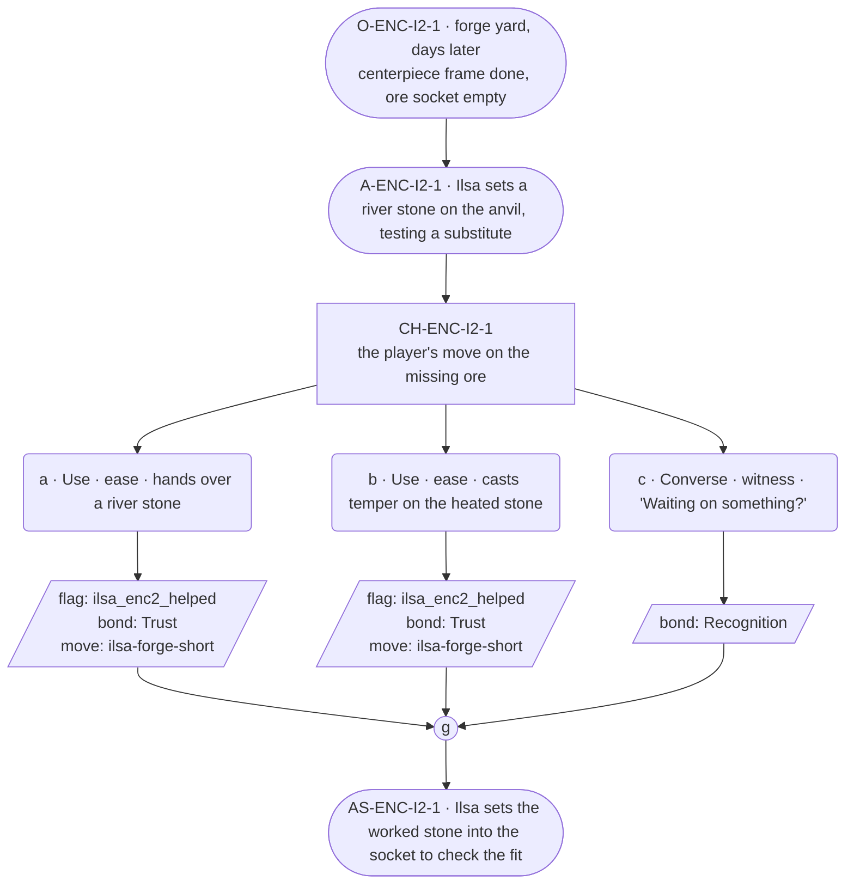

# ENC-ilsa-2 — Blacksmith festival goal, encounter 2 of 3

## Part A — Mini Architect Brief

**Reveal carried:** State 2 — a part is missing, the special ore not in
town yet (`ilsa-forge-short` registry, mishap-pool state 2). This state is
the one that shares its event with `ilsa-kin-no-show` (Bram was to bring
the ore) — this scene reads it from the work's side only, per the
registry's ruling that each thread reads its own facet. No Bram material
surfaces here; that stays `NGT-ilsa`'s territory.

**State of the shortfall:** The centerpiece is stalled on a component she
can't source alone, not on labor.

**Sizing:** 7 beats — 2 setting beats, one 3-option choice node, one
consequence beat, one close.

**Mechanical ruling — pass/fail gate.** Same shape: **a**/**b** passes —
`knowledge_flag(ilsa_enc2_helped)` + `bond_event(Trust, weight 2)` +
`thread_move(ilsa-forge-short)`. **c** — `bond_event(Recognition, weight
2)` only.

**Constraint worth naming:** No `bond_band()` gating. This scene reads the
ore gap as `delta_situation` only (uncapped, per her card's delta_rule) —
it is not a `delta_cast` fact being re-delivered, since the ore's absence
was already established by the registry, referenced here rather than
re-stated as new.

---

## Part B — Choice Designer Output

### Content block

**Incoming state (O-ENC-I2-1):** The forge yard, a few days on. The
centerpiece's frame is done; the socket for the special ore sits empty.
Ilsa has laid out her tools around the gap without naming it.

**A-ENC-I2-1:** She sets a river stone on the anvil — the ore hasn't come,
so she's testing what a substitute would take. No mention of who was
meant to bring it.

**CH-ENC-I2-1 (3 options, ungated):**
- **a · Use · ease** — `surface_action`: hands over a river stone
  (`item_river_stone`) already picked from the forest. Ilsa turns it once
  in the light, sets to work on it as the substitute. Records
  `knowledge_flag(ilsa_enc2_helped)` + `bond_event(Trust, weight 2)` +
  `thread_move(ilsa-forge-short)`.
- **b · Use · ease** — `surface_action`: casts *temper* on the heated stone
  already on the anvil (components `item_river_stone` + `item_spring_water`
  — hardens a hot-worked piece evenly as it cools). The stone sets true on
  the first pass. Ilsa checks the edge with her thumb, says nothing.
  Records `knowledge_flag(ilsa_enc2_helped)` + `bond_event(Trust, weight
  2)` + `thread_move(ilsa-forge-short)`.
- **c · Converse · witness** — `player_line`: "Waiting on something?" —
  Ilsa: "It'll turn up." She doesn't say what. Records `bond_event
  (Recognition, weight 2)`, no thread move.

Converges at **J-ENC-I2-1**.

**AS-ENC-I2-1:** Ilsa sets the worked stone — real or substitute — into
the socket to check the fit. It sits, whichever way this went.

**Close:** No dialogue closes it; the fitted stone in the socket is the
close (object slot).

**Action-slot ratio:** 2 action beats across the scene ≈ within range.

**Long-run placement:** None.

**Equal weight:** a and b both move the substitute-metal path forward by a
different route; c respects that she won't ask outright.

### Mermaid graph

**Self-verify:** parses clean, ids scoped `-I2-`, no bond-band predicate,
options match prose, genuine gather, no long run.
