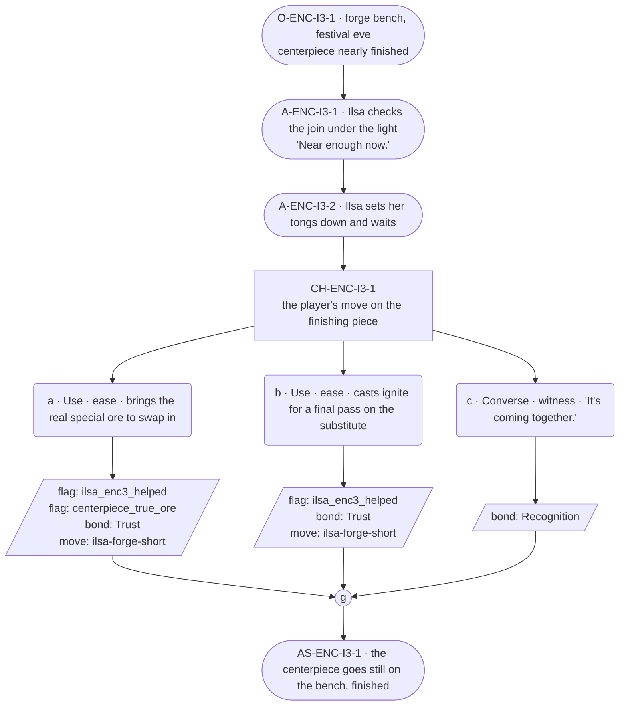

# ENC-ilsa-3 — Blacksmith festival goal, encounter 3 of 3

## Part A — Mini Architect Brief

**Reveal carried:** State 3 — closing state. Per the registry's ruled
outcome, without the real ore she finishes in replacement metal (the shape
but not the substance); the player can source the real ore to branch the
Arch to actually complete. This encounter stages that fork mechanically, at
compact scale.

**State of the shortfall:** The centerpiece is nearly done either way —
what differs is which metal finishes it. Both endings are authored; a
lit festival under a look-right piece is not a loss state (registry's own
ruling).

**Sizing:** 8 beats — 3 setting beats (the extra one stages the fork), one
3-option choice node, one consequence beat, one close.

**Mechanical ruling — pass/fail gate.** **a** (item: the real ore) or **b**
(spell: finishing the work with what's on hand) both pass —
`knowledge_flag(ilsa_enc3_helped)` + `bond_event(Trust, weight 2)` +
`thread_move(ilsa-forge-short)` — but **a** additionally records
`knowledge_flag(centerpiece_true_ore)`, branching the Arch's finish per
the registry's ruled outcome; **b** does not set that flag, so the
replacement-metal ending stands. **c** — `bond_event(Recognition, weight
2)` only, no thread move, no branch flag — a real fail path this time,
since it's the closing encounter.

**Constraint worth naming:** No `bond_band()` predicate. Neither ending
(true ore vs. replacement metal) is narrated as better in-scene — the
registry states explicitly that a lit festival under the wrong-metal piece
is not a loss state, so options a and b stay equal weight even though they
set different world flags.

---

## Part B — Choice Designer Output

### Content block

**Incoming state (O-ENC-I3-1):** Festival eve. The centerpiece stands
nearly finished on the bench, the socket still holding the substitute
stone from encounter 2 unless it's been swapped.

**A-ENC-I3-1:** Ilsa turns the piece under the light, checking the join.
"Near enough now" — settled, no elaboration.

**A-ENC-I3-2:** She sets her tongs down and waits — the first time in the
arc she's visibly not mid-task when the player arrives.

**CH-ENC-I3-1 (3 options, ungated):**
- **a · Use · ease** — `surface_action`: brings the real special ore
  (`item_river_stone`, sourced from the forest per the registry's branch
  condition) to swap into the socket. Ilsa sets it in, checks the seat,
  says nothing — but works a beat longer over this one than the
  substitute. Records `knowledge_flag(ilsa_enc3_helped)` +
  `knowledge_flag(centerpiece_true_ore)` + `bond_event(Trust, weight 2)` +
  `thread_move(ilsa-forge-short)`.
- **b · Use · ease** — `surface_action`: casts *ignite* one last time to
  re-heat the join for a final pass on the substitute piece. Ilsa finishes
  the seam, sets her tools down. Records
  `knowledge_flag(ilsa_enc3_helped)` + `bond_event(Trust, weight 2)` +
  `thread_move(ilsa-forge-short)`.
- **c · Converse · witness** — `player_line`: "It's coming together." —
  Ilsa: "It is." Nothing more offered. Records `bond_event(Recognition,
  weight 2)`, no thread move.

Converges at **J-ENC-I3-1**.

**AS-ENC-I3-1:** The centerpiece goes still on the bench, finished — true
ore or substitute, the shape complete either way.

**Close:** No line closes it; the finished piece under evening light is
the close (object slot).

**Action-slot ratio:** 3 action beats across the scene ≈ within range.

**Long-run placement:** None.

**Equal weight:** a and b both finish the piece; only the world-state flag
differs, and the registry itself rules neither ending a loss. c is a
legitimate final visit.

### Mermaid graph

**Self-verify:** parses clean, ids scoped `-I3-`, no bond-band predicate,
options match prose, genuine gather, no long run, world-branch flag stated
without ranking the two endings.
