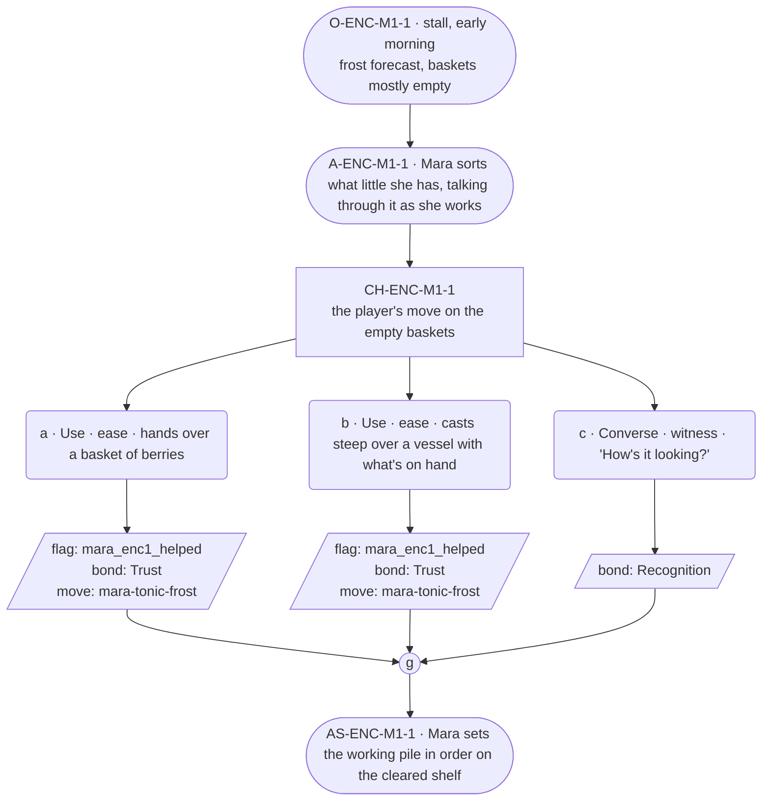

# ENC-mara-1 — Herbalist festival goal, encounter 1 of 3

## Part A — Mini Architect Brief

**Reveal carried:** State 1 of the tonic shortfall — herbs still out in
the forest as the frost nears (`mara-tonic-frost` registry, mishap-pool
state 1). First encounter; nothing prior assumed.

**State of the shortfall:** Nothing gathered yet against a hard deadline —
the frost, not a person, is the pressure.

**Sizing:** 7 beats — 2 setting beats, one 3-option choice node, one
consequence beat, one close.

**Mechanical ruling — pass/fail gate.** **a**/**b** passes —
`knowledge_flag(mara_enc1_helped)` + `bond_event(Trust, weight 2)` +
`thread_move(mara-tonic-frost)`. **c** — `bond_event(Recognition, weight
2)` only, no thread move.

**Constraint worth naming:** This is role-goal pressure (time itself), not
a grief beat — her card's fragments-only rule governs *loss* content
specifically, not ordinary work dialogue. Her ordinary line still sits in
the 20-50 word band per her card, distinct from the village median.

---

## Part B — Choice Designer Output

### Content block

**Incoming state (O-ENC-M1-1):** Mara's stall, early morning, frost
forecast for the week's end. Baskets sit mostly empty on the counter.

**A-ENC-M1-1:** Mara is already sorting what little she has, running on
longer than the village median as her card allows — she explains what
each half-basket still needs while her hands keep moving.

**CH-ENC-M1-1 (3 options, ungated):**
- **a · Use · ease** — `surface_action`: hands over a basket of berries
  (`item_berry`) gathered from the clearing. Mara checks them, nods, adds
  them to the working pile. Records `knowledge_flag(mara_enc1_helped)` +
  `bond_event(Trust, weight 2)` + `thread_move(mara-tonic-frost)`.
- **b · Use · ease** — `surface_action`: casts *steep* over a vessel of
  water with what herbs are on hand (components `item_berry` +
  `item_spring_water` — draws the virtue into the water, fast). Mara
  watches the color change, sets the vessel aside to work. Records
  `knowledge_flag(mara_enc1_helped)` + `bond_event(Trust, weight 2)` +
  `thread_move(mara-tonic-frost)`.
- **c · Converse · witness** — `player_line`: "How's it looking?" — Mara:
  "Tight, but it keeps." No task changes hands. Records `bond_event
  (Recognition, weight 2)`, no thread move.

Converges at **J-ENC-M1-1**.

**AS-ENC-M1-1:** Mara sets the working pile in order on the cleared shelf
— the same shelf her thread registry's `mara-set-for-two` scene later uses
for the drawer's sorting; referenced, not re-delivered.

**Close:** No line closes it; the ordered shelf is the close (object
slot).

**Action-slot ratio:** 2 action beats across the scene ≈ within range.

**Long-run placement:** None marked — her uncapped licence is reserved for
provenance, not for shortfall logistics.

**Equal weight:** a and b both add to the gathered stock by a different
route; c respects the work without adding to it.

### Mermaid graph

**Self-verify:** parses clean, ids scoped `-M1-`, options match prose,
genuine gather, no long run, no invented backstory.
