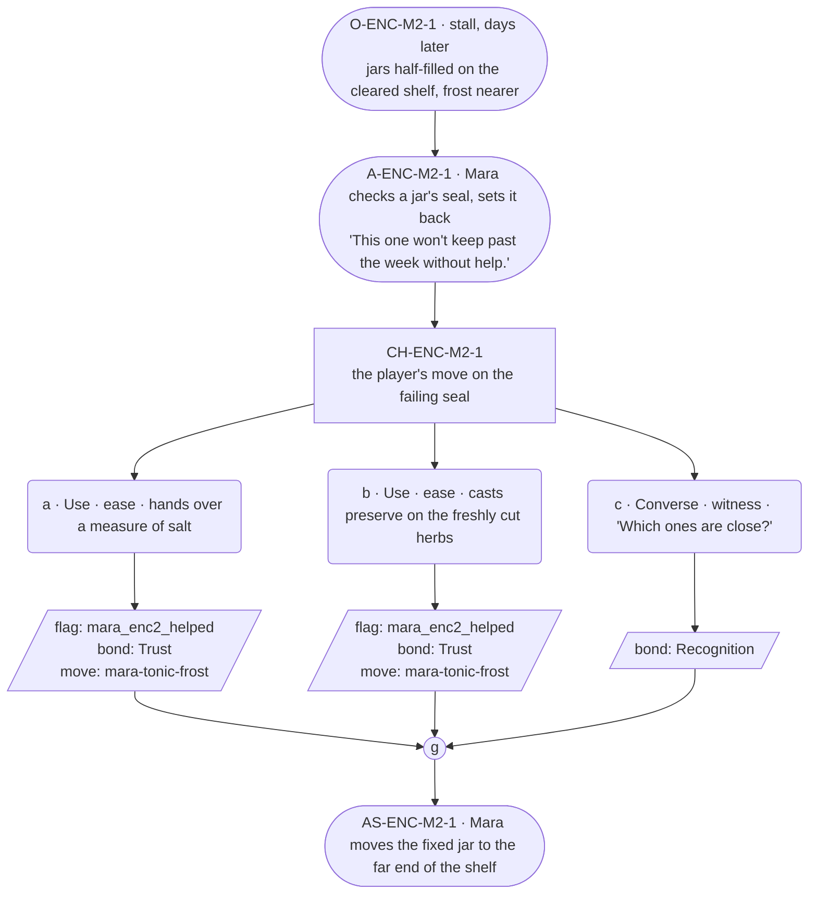

# ENC-mara-2 — Herbalist festival goal, encounter 2 of 3

## Part A — Mini Architect Brief

**Reveal carried:** State 2 — jars filling on the cleared shelf
(`mara-tonic-frost` registry, mishap-pool state 2). Work is progressing;
the frost is closer.

**Sizing:** 7 beats — 2 setting beats, one 3-option choice node, one
consequence beat, one close.

**Mechanical ruling — pass/fail gate.** **a**/**b** passes —
`knowledge_flag(mara_enc2_helped)` + `bond_event(Trust, weight 2)` +
`thread_move(mara-tonic-frost)`. **c** — `bond_event(Recognition, weight
2)` only.

**Constraint worth naming:** No object from her drawer (the whistle,
Ovin's knife, Adren's doll) appears in this scene — those are reserved for
the essence thread (`NGT-mara`), and this scene stays inside the tonic
work only, per the "declared once and referenced" discipline for shared
material.

---

## Part B — Choice Designer Output

### Content block

**Incoming state (O-ENC-M2-1):** The stall, a few days on. Jars line the
cleared shelf, roughly half filled. The frost is nearer.

**A-ENC-M2-1:** Mara checks a jar's seal against the light, sets it back —
"This one won't keep past the week without help," said plainly, no
elaboration on what "help" costs her to say.

**CH-ENC-M2-1 (3 options, ungated):**
- **a · Use · ease** — `surface_action`: hands over a measure of salt
  (`item_salt`). Mara works it into the jar's seal, checks it again — the
  fix holds this time. Records `knowledge_flag(mara_enc2_helped)` +
  `bond_event(Trust, weight 2)` + `thread_move(mara-tonic-frost)`.
- **b · Use · ease** — `surface_action`: casts *preserve* on the freshly
  cut herbs beside the jars (component `item_salt` — holds a freshly cut
  or picked thing at fresh). The batch stops wilting mid-cast; Mara notes
  it without looking up. Records `knowledge_flag(mara_enc2_helped)` +
  `bond_event(Trust, weight 2)` + `thread_move(mara-tonic-frost)`.
- **c · Converse · witness** — `player_line`: "Which ones are close?" —
  Mara points out two jars, says nothing further. Records `bond_event
  (Recognition, weight 2)`, no thread move.

Converges at **J-ENC-M2-1**.

**AS-ENC-M2-1:** Mara moves the fixed jar to the far end of the shelf,
away from the ones still at risk — a small sorting act, wordless.

**Close:** No line closes it; the reordered shelf is the close (object
slot).

**Action-slot ratio:** 2 action beats across the scene ≈ within range.

**Long-run placement:** None.

**Equal weight:** a and b both save a jar by a different route; c
respects the work without touching the risk.

### Mermaid graph

**Self-verify:** parses clean, ids scoped `-M2-`, options match prose,
genuine gather, no long run, no drawer object used.
