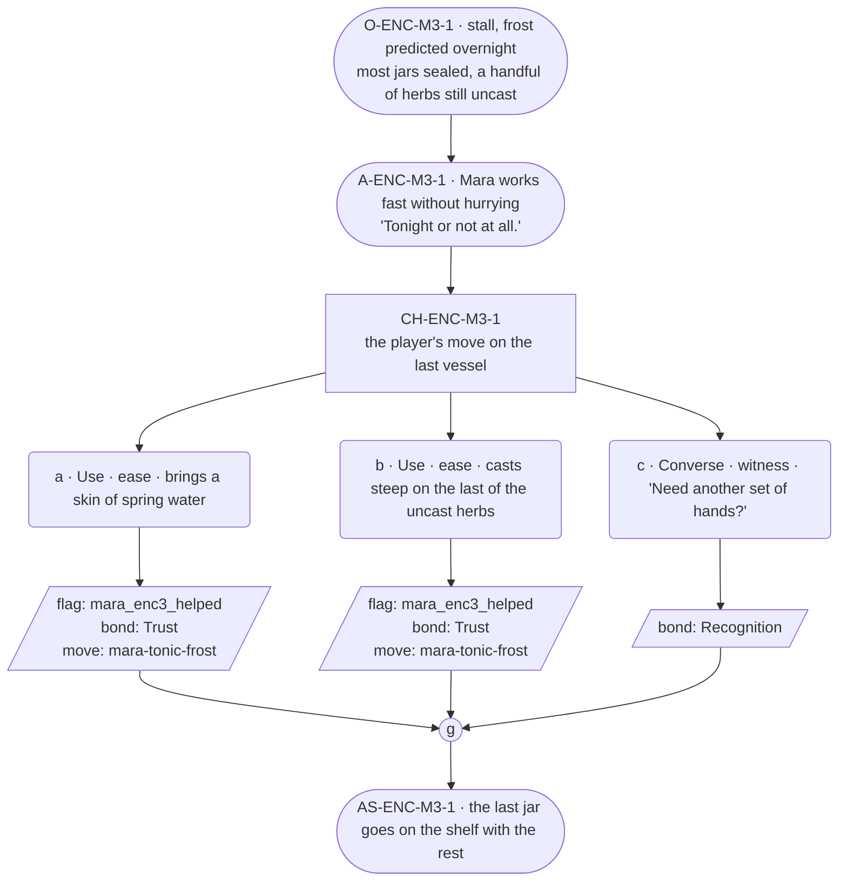

# ENC-mara-3 — Herbalist festival goal, encounter 3 of 3

## Part A — Mini Architect Brief

**Reveal carried:** State 3 — done or short (`mara-tonic-frost` registry,
closing state). The last push before the frost actually lands.

**Sizing:** 7 beats — 2 setting beats, one 3-option choice node, one
consequence beat, one close.

**Mechanical ruling — pass/fail gate.** **a**/**b** passes —
`knowledge_flag(mara_enc3_helped)` + `bond_event(Trust, weight 2)` +
`thread_move(mara-tonic-frost)`. **c** — `bond_event(Recognition, weight
2)` only, no thread move — the real fail path this time, since it's the
closing encounter.

**Constraint worth naming:** Still no drawer object, still no loss content
— this stays a work-pressure beat to the end, keeping the essence-thread
material (`NGT-mara`) undiluted for its own scene.

---

## Part B — Choice Designer Output

### Content block

**Incoming state (O-ENC-M3-1):** The stall, frost predicted overnight.
Most jars are filled and sealed; a handful of herbs sit uncast on the
counter.

**A-ENC-M3-1:** Mara works fast without hurrying — her hands the only
thing that speed up. "Tonight or not at all," said once, flat.

**CH-ENC-M3-1 (3 options, ungated):**
- **a · Use · ease** — `surface_action`: brings a skin of spring water
  (`item_spring_water`) for the last vessel. Mara pours it in without
  breaking her rhythm. Records `knowledge_flag(mara_enc3_helped)` +
  `bond_event(Trust, weight 2)` + `thread_move(mara-tonic-frost)`.
- **b · Use · ease** — `surface_action`: casts *steep* on the last of the
  uncast herbs. The color turns fast; Mara sets the finished vessel with
  the rest. Records `knowledge_flag(mara_enc3_helped)` +
  `bond_event(Trust, weight 2)` + `thread_move(mara-tonic-frost)`.
- **c · Converse · witness** — `player_line`: "Need another set of
  hands?" — Mara: "Not tonight." Keeps working alone. Records
  `bond_event(Recognition, weight 2)`, no thread move.

Converges at **J-ENC-M3-1**.

**AS-ENC-M3-1:** The last jar goes on the shelf with the rest — the row
complete or one short, depending on the pick.

**Close:** No line closes it; the shelf, full or nearly full, is the close
(object slot).

**Action-slot ratio:** 2 action beats across the scene ≈ within range.

**Long-run placement:** None — barred at this proximity to the deadline
payoff, same discipline as the deep-three cards apply at their own
payoffs.

**Equal weight:** a and b both finish the last vessel by a different
route; c is a legitimate final visit that respects her working alone.

### Mermaid graph

**Self-verify:** parses clean, ids scoped `-M3-`, options match prose,
genuine gather, no long run, no drawer object used.
