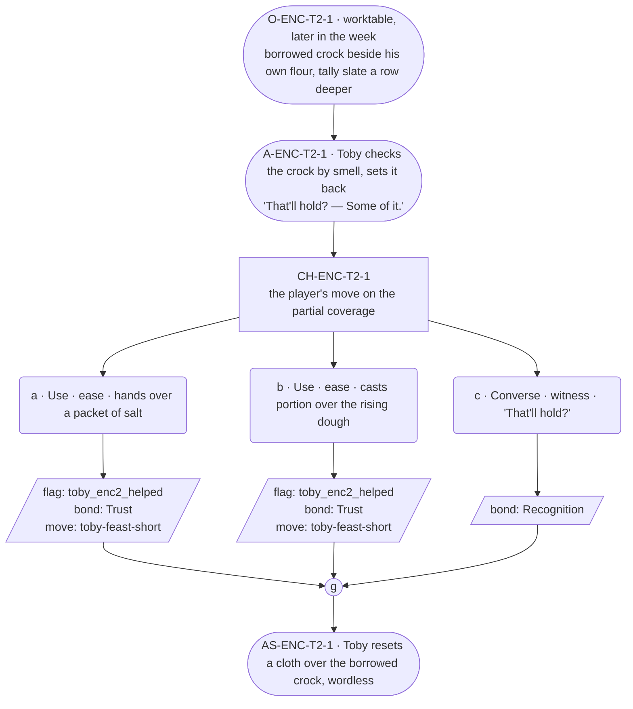

# ENC-toby-2 — Baker festival goal, encounter 2 of 3

## Part A — Mini Architect Brief

**Reveal carried:** State 2 of the shortfall — starter begged off a
neighbor, the borrowed crock sitting beside his own flour, tally marks
started (`toby-feast-short` registry, state 2). The ask itself stays
offscreen, as the c1 exemplar established; only its aftermath is staged.

**State of the shortfall:** Partial coverage — the crock closes some of the
gap, not all. Exact numbers still withheld (reserved for encounter 3).

**Sizing:** 7 beats — 2 setting beats, one 3-option choice node, one
consequence beat, one close.

**Mechanical ruling — pass/fail gate.** Passes on option **a** (item) or
**b** (spell) — records `knowledge_flag(toby_enc2_helped)` +
`bond_event(Trust, weight 2)` + `thread_move(toby-feast-short)`. Option
**c** records `bond_event(Recognition, weight 2)` only, no thread move —
fail path, still warm, still playable.

**Constraint worth naming:** The borrowed crock is an object the player can
act on directly without asking who it belongs to — per rule 6, closed
paths (who Toby begged it from) stay closed; the crock is examinable, not
explained.

---

## Part B — Choice Designer Output

### Content block

**Incoming state (O-ENC-T2-1):** Toby's worktable, later the same week. A
crock that isn't his — someone else's culture, lid balanced on top — sits
beside his own flour. The tally slate now carries a second row of marks.

**A-ENC-T2-1:** Toby angles the crock toward the light, checks it by smell
without comment, sets it back down. He says the starter's holding "some of
it" when the player glances at the slate — flat, honest, no arithmetic
offered unprompted this time.

**CH-ENC-T2-1 (3 options, ungated):**
- **a · Use · ease** — `surface_action`: hands over a packet of salt
  (`item_salt`) — matches the bakery's own shortfall canon (Smith's short
  on salt in the approved scene). Toby tucks it in with the borrowed
  starter and calls it "bakery weight," the same move that forecloses a
  debt. Records `knowledge_flag(toby_enc2_helped)` + `bond_event(Trust,
  weight 2)` + `thread_move(toby-feast-short)`.
- **b · Use · ease** — `surface_action`: casts *portion* over the rising
  dough (component `item_river_stone`; parts a divisible mass into equal
  measures — a whole town served alike). Toby watches the mass settle into
  even lumps, resets his count against it. Records
  `knowledge_flag(toby_enc2_helped)` + `bond_event(Trust, weight 2)` +
  `thread_move(toby-feast-short)`.
- **c · Converse · witness** — `player_line`: "That'll hold?" — Toby: "Some
  of it." No task changes hands. Records `bond_event(Recognition, weight
  2)`, no thread move.

Converges at **J-ENC-T2-1**.

**AS-ENC-T2-1:** Toby resets a cloth over the borrowed crock, same wordless
gesture as the close of encounter 1 — a repeated motif, not a re-delivered
fact (reference is free; the crock itself is the delta this scene).

**Close:** Toby is already turning to the next tray; nothing here holds him
in the receiving register long enough to register as a payoff.

**Action-slot ratio:** 2 of 4 non-choice-node beats are action ≈ within
range.

**Long-run placement:** None. His flat "Some of it." is the deliberate
opposite of a long run — honest, minimal, un-elaborated.

**Equal weight:** a and b both close part of the gap by a different route
(a real good vs. a role-spell); c respects the shortfall without touching
it. No option scolds another; none is rewarded above the others in kind.

### Mermaid graph

**Self-verify:** parses clean, no id collisions with ENC-toby-1 (all ids
scoped `-T2-`), options match prose exactly, genuine gather before close.
