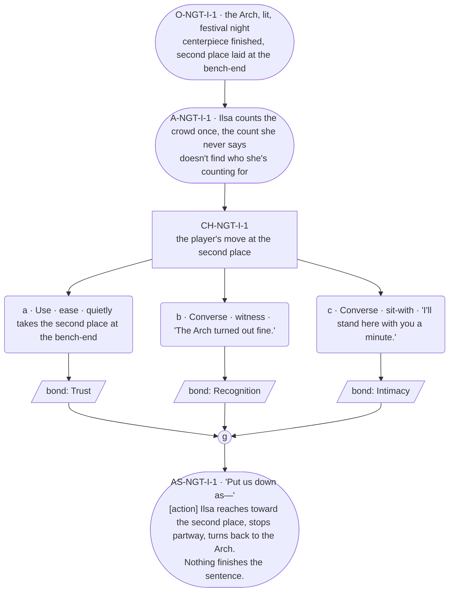

# NGT-ilsa — Festival night, Ilsa

## Part A — Mini Architect Brief

**Reveal carried:** The standing second place at the Arch raising, Bram's
absence held rather than named, staged as festival night's version of
`ilsa-kin-no-show`'s core image. `ilsa-not-family` held in reserve as
texture only (Pip seated without being counted the same as blood) — not
staged directly, to keep one payoff beat to one fact, per her card's
delta_rule discipline.

**State:** Festival night, the Arch lit. The centerpiece (real ore or
substitute, whichever the encounters set) stands finished. A second place
is laid at the bench-end regardless.

**Sizing:** 7 beats — 2 setting beats, one 3-option choice node (witness /
ease / sit-with, never fix), one consequence beat, one close.

**Constraint worth naming — the load-bearing one.** **Zero `bond_band()`
predicates anywhere in this scene** — canon flag 11 bars bond-band gating
outright for Ilsa, and her own thread registry repeats the bar explicitly.
No option, gate, or availability condition may fork on her bond level. Her
weight-carrying beat must be the grammar tell — a sentence that doesn't
finish — never a longer line, per her card's failure-mode 3 (barred
absolutely: any long run near the absence).

---

## Part B — Choice Designer Output

### Content block

**Incoming state (O-NGT-I-1):** The Arch, lit, festival night. Ilsa stands
near the finished centerpiece. The bench nearby carries the standing
second place — an apron and tongs laid at the empty end, same as her
`ilsa_second_apron` echo furniture.

**A-NGT-I-1:** She counts the gathered crowd once, the way she always
counts before speaking — arrivals against a number she never says. She
doesn't find who she's counting for.

**CH-NGT-I-1 (3 options, ungated — witness / ease / sit-with, never
fix):**
- **a · Use · ease** — `surface_action`: quietly takes the second place at
  the bench-end, without asking whose it was. Ilsa's eyes go to the seat,
  then away. She doesn't correct the player, doesn't explain it. Records
  `bond_event(Trust, weight 2)`.
- **b · Converse · witness** — `player_line`: "The Arch turned out fine." —
  a fact stated plainly, no comment on the empty seat. Ilsa: "It did."
  Settled, certain. Records `bond_event(Recognition, weight 2)`.
- **c · Converse · sit-with** — `player_line`: "I'll stand here with you a
  minute." — Ilsa doesn't answer in words. She shifts half a step, making
  room. Records `bond_event(Intimacy, weight 2)`.

Converges at **J-NGT-I-1**.

**AS-NGT-I-1 (weight-carrying beat, fragment → action → fragment, per
rule 19 and her card's grammar-tell mechanism):** "Put us down as—" **[action]**
Ilsa reaches toward the second place, stops partway, turns back to the
Arch instead. Nothing finishes the sentence.

**Close:** No line closes it. The lit Arch and the still-laid second place
are the last image (object slot) — amplification stays visual.

**Action-slot ratio:** 2 action/object beats (A-NGT-I-1, AS-NGT-I-1) plus
the object close, against 3 dialogue-bearing options ≈ within range.

**Long-run placement:** None — her sanctioned run is for lineage/household
history only, and this beat is the absence itself, which her card bars
absolutely.

**Equal weight:** All three options witness the same unfinished thing from
a different angle — taking the seat, naming the work instead of the gap,
or simply standing near her. None fixes, none names Bram, none is ranked
above the others.

### Mermaid graph

**Self-verify:** parses clean, zero `bond_band()` predicates anywhere,
options match prose, genuine gather, weight carried by the unfinished
sentence + action per her card's grammar mechanism, no long run, Bram not
named in this scene.
