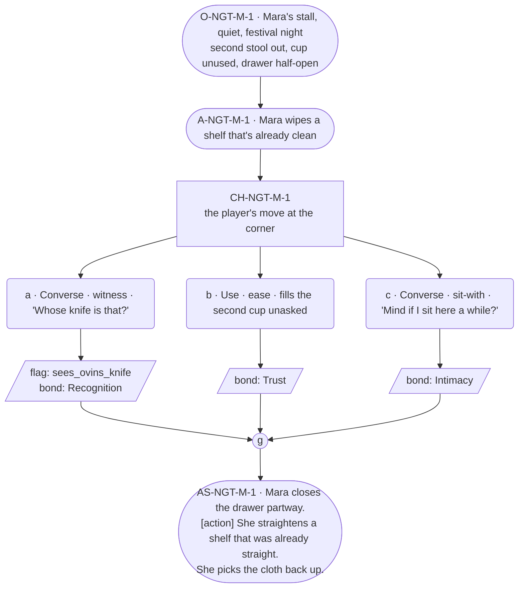

# NGT-mara — Festival night, Mara

## Part A — Mini Architect Brief

**Reveal carried:** The corner set for two, staged as festival night's
version of `mara-set-for-two` (registry: "what is the keeping for?").
`mara-said-out-loud` held in reserve as texture only — Bex is not staged
in this scene; naming-near-her is that thread's own beat and doesn't need
restaging here to keep one payoff to one fact.

**State:** Festival night, the tonic served (real completion or a near
miss, whichever the encounters set — this scene doesn't distinguish, since
neither reading changes what the corner is). Mara's stall is quiet now,
the crowd moved on to the Arch.

**Sizing:** 7 beats — 2 setting beats, one 3-option choice node (witness /
ease / sit-with, never fix), one consequence beat, one close.

**Constraint worth naming — the two guardrails that bind hardest here.**
Her grief is **fragments + action slots only, never a long run** — barred
absolutely per her card's failure-mode 3. And her provenance licence
(unlimited length, marked but uncapped) covers an object's *history*,
never the loss itself — so if the player asks about an object in this
scene, the response may run long on *what it is and where it's been*, and
must stop cold the instant it would touch who it's for beyond the bare
sanctioned line. This scene uses **Ovin's pocket-knife**, whose rule is
stricter still: the bare fact only — "That was Ovin's, before." — zero
elaboration, ever (card canon flag 14).

---

## Part B — Choice Designer Output

### Content block

**Incoming state (O-NGT-M-1):** Mara's stall, quiet, festival night. The
second stool at the corner is out, same as always. A cup sits across from
hers, unused. The drawer of unclaimed things is visible, half-open from
earlier sorting.

**A-NGT-M-1:** Mara is doing a last pass over the stall, wiping a shelf
that's already clean — a small habitual tending. She doesn't stop when the
player arrives.

**CH-NGT-M-1 (3 options, ungated — witness / ease / sit-with, never
fix):**
- **a · Converse · witness** — `player_line`: "Whose knife is that?" —
  asking about the folding pocket-knife visible in the open drawer. Mara:
  "That was Ovin's, before." — bare, no elaboration, sentences stopping at
  the person per her card's precision-profile asymmetry. Records
  `knowledge_flag(sees_ovins_knife)` + `bond_event(Recognition, weight
  2)`.
- **b · Use · ease** — `surface_action`: takes the second cup and sets it
  where it already sits, filling it without being asked. Mara's hands
  pause over the shelf for a beat, then keep moving. Records `bond_event
  (Trust, weight 2)`.
- **c · Converse · sit-with** — `player_line`: "Mind if I sit here a
  while?" — gestures to the second stool. Mara: "It's usually empty
  anyway." She keeps working, doesn't stop the player. Records
  `bond_event(Intimacy, weight 2)`.

Converges at **J-NGT-M-1**.

**AS-NGT-M-1 (weight-carrying beat, fragment → action → fragment, per
rule 19):** Mara closes the drawer partway. **[action]** She straightens
a shelf that was already straight. She picks the cloth back up.

**Close:** No line closes it. The corner, the second stool, the drawer
half-closed — the last image (object slot).

**Action-slot ratio:** 2 action/object beats (A-NGT-M-1, AS-NGT-M-1) plus
the object close, against 3 dialogue-bearing options ≈ within range.

**Long-run placement:** None marked for the loss itself. Option a's
response is deliberately the shortest line in the scene — the bare
Ovin rule overrides even her usual longer-than-median band, per canon
flag 14.

**Equal weight:** a asks about an object and gets the sanctioned bare
fact; b tends to her without asking anything; c simply sits with her. None
names the loss, none fixes it, none is ranked above the others.

### Mermaid graph

**Self-verify:** parses clean, options match prose, genuine gather, no
long run about the loss, Ovin's bare-line rule held exactly (no
elaboration), Adren's doll and the whistle not invoked (single-object
scope kept), weight carried by fragment → action → fragment.
