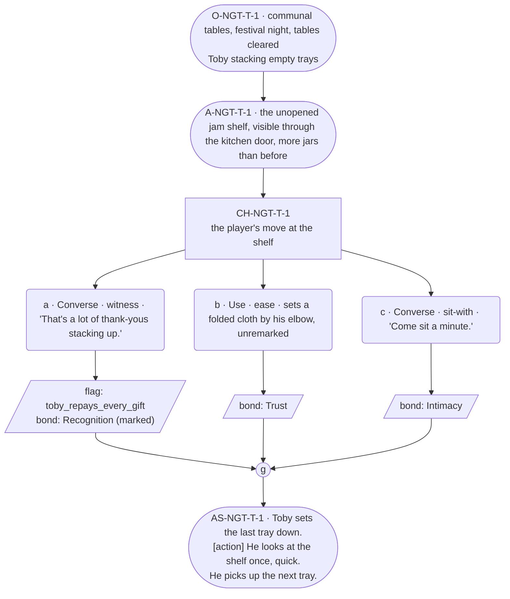

# NGT-toby — Festival night, Toby

## Part A — Mini Architect Brief

**Reveal carried:** The `toby-unopened-jam` echo's payoff condition, staged
at compact scale — Toby keeping a shelf of thank-you gifts he never opens,
and what happens when the player names it back to him instead of just
adding to it. Seeded primarily from `toby-the-shelf` (registry: "what does
he do with what he is given?"), with the returned-shirt thread
(`toby-kept-and-returned`) held in reserve as texture only — this scene
does not stage the shirt's mend, to avoid overloading one payoff beat with
two facts.

**State:** Festival night, the tables already served — the card's own
`payoff_scene` timing for the echo. Incoming state assumes the player has,
across the run, given Toby at least one thing with nothing owed on it
(the give itself happens off this scene, in whichever earlier beat the run
afforded — this scene's job is only the naming).

**Sizing:** 7 beats — 2 setting beats, one 3-option choice node (witness /
ease / sit-with, never fix), one consequence beat, one close.

**Constraint worth naming — the hardest one on this card.** Toby is barred
from any long run while receiving, thanked, or seen, and **barred
absolutely at a payoff — festival night is exactly that.** Zero long runs
anywhere in this scene, full stop. His response to being named must go
flat and short, not warmer or longer, per his card's failure-mode 1 (never
stays animated while receiving).

---

## Part B — Choice Designer Output

### Content block

**Incoming state (O-NGT-T-1):** The communal tables, cleared of the meal,
lantern light up. Toby is behind the near table stacking empty trays —
still working, even now.

**A-NGT-T-1:** Behind him, visible on the shelf through the open kitchen
door, sit the unopened jars — more than at the arc's start, none opened.
He doesn't look at them. *(Object beat; the shelf is shown, not narrated.)*

**CH-NGT-T-1 (3 options, ungated — witness / ease / sit-with, never fix):**
- **a · Converse · witness** — `player_line`: "That's a lot of thank-yous
  stacking up." — names the shelf back to him directly. Toby's hands stop
  on the tray for exactly one beat. He says "Yeah" — nothing else — and
  goes back to stacking, faster than before. Records `knowledge_flag
  (toby_repays_every_gift)` + `bond_event(Recognition, weight 3)`.
- **b · Use · ease** — `surface_action`: sets a folded cloth on the table
  by his elbow, unremarked, and says nothing about it. Toby notices,
  doesn't comment, tucks it under the stack of trays. Records
  `bond_event(Trust, weight 2)` — witnessed, not named; the echo condition
  isn't met this way, and that's a legitimate, un-punished read.
- **c · Converse · sit-with** — `player_line`: "Come sit a minute." —
  Toby: "In a bit." He doesn't sit, but he slows down. Records
  `bond_event(Intimacy, weight 2)`.

Converges at **J-NGT-T-1**.

**AS-NGT-T-1 (weight-carrying beat, fragment → action → fragment, per
rule 19):** Toby sets the last tray down. **[action]** He looks at the
shelf once, quick, like checking it's still there. He picks up the next
tray.

**Close:** No line closes it. The lanterns are the last image (object
slot) — amplification stays visual, per the register's reconciliation
rule, never verbal.

**Action-slot ratio:** 2 action/object beats (A-NGT-T-1, part of AS-NGT-T-1)
plus the object close, against 3 dialogue-bearing options ≈ within range
at this compact size.

**Long-run placement:** None — barred absolutely, stated in the brief
above and held throughout.

**Equal weight:** a completes the echo condition; b and c don't, and
neither is worse — b stays fully in his warmth-channel logic (anticipation,
unremarked), c simply respects that he won't stop working. No option
scolds another; none is rewarded above rank (all record exactly one
`bond_event`, a records one plus the flag — the flag is state, not a
bigger reward).

### Mermaid graph

**Self-verify:** parses clean, no id collisions, options match prose
exactly, genuine gather, zero long runs anywhere (payoff proximity bar
held), witness/ease/sit-with framing used instead of "fix," fragment →
action → fragment weight-build present at AS-NGT-T-1.
