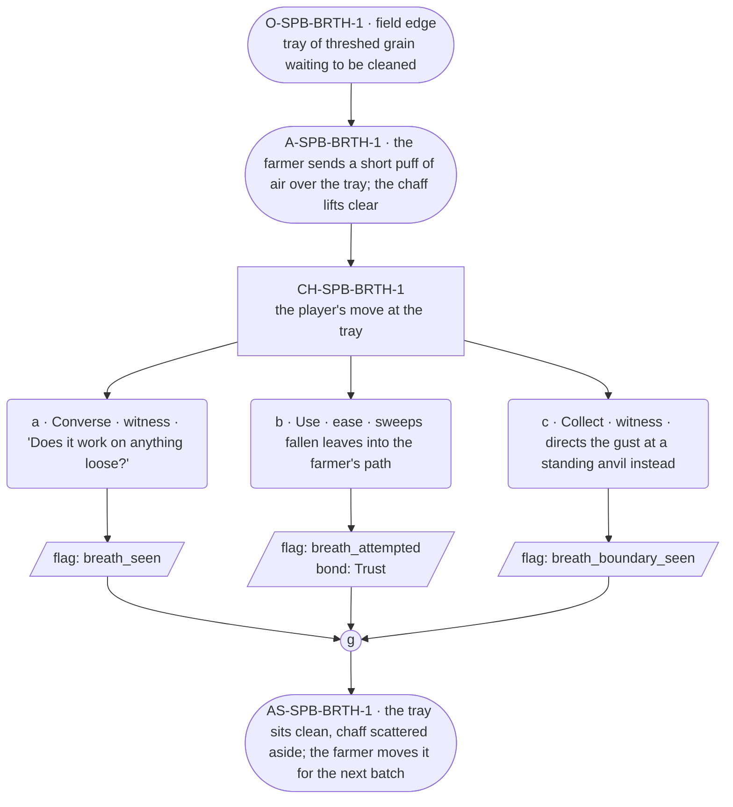

# SPB-breath — Farmer spell beat: breath

## Part A — Mini Architect Brief

**Reveal carried:** First sight of `breath`, via the farmer winnowing at
the edge of the Town scene (`content/magic/breath.json` `learn_source`).
Components: `item_grass` + `item_dirt`. Canon starter spell. Clean effect
on `threshed_grain` (chaff lifts and blows clear); no_effect on `anvil`
(the gust breaks around it).

**Role holder:** Walk-on — "the farmer," named per register.md's walk-on
band.

**Sizing:** 6 beats — 2 setting beats, one 3-option choice node, one close.

---

## Part B — Choice Designer Output

### Content block

**Incoming state (O-SPB-BRTH-1):** The field edge, a tray of threshed
grain waiting to be cleaned before the festival stores.

**A-SPB-BRTH-1:** The farmer sends a short puff of directed air over the
tray — the chaff lifts clear in one pass, clean grain stays put.

**CH-SPB-BRTH-1 (3 options, ungated):**
- **a · Converse · witness** — `player_line`: "Does it work on anything
  loose?" — the farmer: "Loose and light, mostly. Grain, leaves." Records
  `knowledge_flag(breath_seen)`.
- **b · Use · ease** — `surface_action`: sweeps a pile of fallen leaves
  into the farmer's path for the same treatment — they scatter off in one
  gust. Records `knowledge_flag(breath_attempted)` + `bond_event(Trust,
  weight 2)`.
- **c · Collect · witness** — `surface_action`: directs the gust at a
  standing anvil nearby, out of curiosity — the gust breaks around it,
  no_effect. Records `knowledge_flag(breath_boundary_seen)`.

Converges at **J-SPB-BRTH-1**.

**Close (AS-SPB-BRTH-1):** The tray of grain sits clean, chaff scattered
off to the side. The farmer moves the tray aside for the next batch.

**Action-slot ratio:** 2 action beats across the scene ≈ within range.

**Long-run placement:** None.

**Equal weight:** a explains, b tries a plausible receiver and succeeds,
c tries a heavy fixed object and finds the boundary.

### Mermaid graph

**Self-verify:** parses clean, options match prose, genuine gather,
walk-on named and banded correctly.
