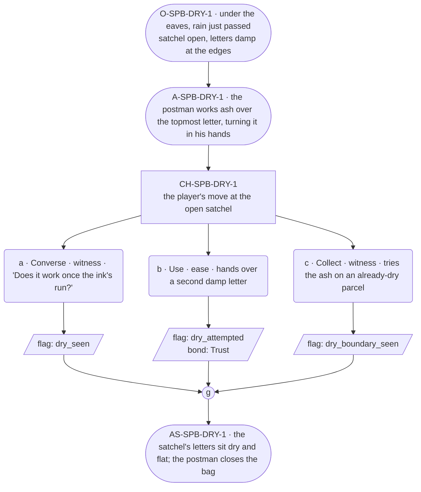

# SPB-dry — Postman spell beat: dry

## Part A — Mini Architect Brief

**Reveal carried:** First sight of `dry`, via the postman rescuing a
rain-soaked satchel under the eaves (`content/magic/dry.json`
`learn_source`). Component: `item_ash`. State-dependent on
`soaked_letter` (caught early dries flat, ink intact); no_effect on
`dry_parcel` (nothing to take out).

**Role holder:** Walk-on — "the postman."

**Sizing:** 6 beats — 2 setting beats, one 3-option choice node, one close.

---

## Part B — Choice Designer Output

### Content block

**Incoming state (O-SPB-DRY-1):** Under the eaves, rain just passed. The
postman's satchel sits open, letters inside damp at the edges.

**A-SPB-DRY-1:** He works a pinch of ash over the topmost letter, turning
it in his hands — "Rounds run in all weather," he says, plain and
unhurried, walk-on band.

**CH-SPB-DRY-1 (3 options, ungated):**
- **a · Converse · witness** — `player_line`: "Does it work once the ink's
  run?" — the postman: "No. Has to be caught early." Records
  `knowledge_flag(dry_seen)`.
- **b · Use · ease** — `surface_action`: hands over a second damp letter
  from the bag — it dries flat, ink intact. Records `knowledge_flag
  (dry_attempted)` + `bond_event(Trust, weight 2)`.
- **c · Collect · witness** — `surface_action`: tries the ash on a
  parcel that's already dry, out of curiosity — no water to take out,
  no_effect. Records `knowledge_flag(dry_boundary_seen)`.

Converges at **J-SPB-DRY-1**.

**Close (AS-SPB-DRY-1):** The satchel's letters sit dry and flat. The
postman closes the bag, ready to move on.

**Action-slot ratio:** 2 action beats across the scene ≈ within range.

**Long-run placement:** None.

**Equal weight:** a explains, b tries and succeeds, c tries an already-
dry object and finds the boundary.

### Mermaid graph

**Self-verify:** parses clean, options match prose, genuine gather,
walk-on named and banded correctly.
