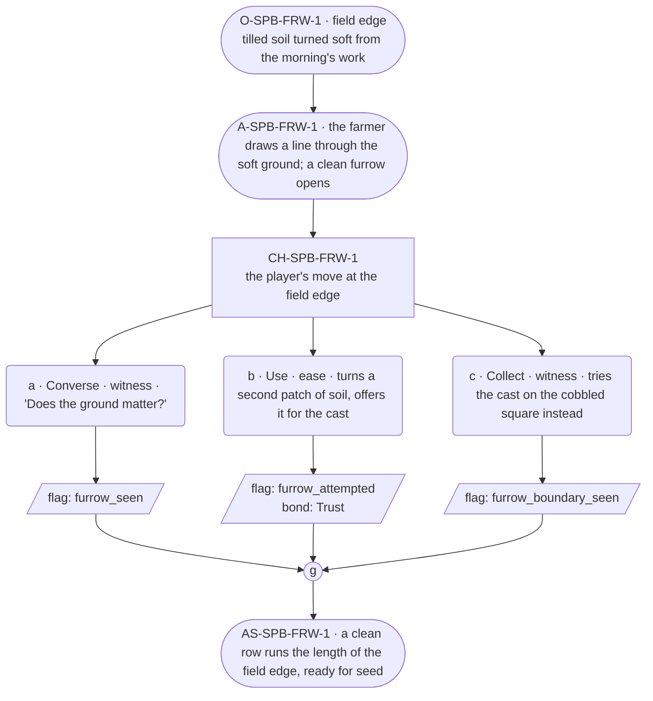

# SPB-furrow — Farmer spell beat: furrow

## Part A — Mini Architect Brief

**Reveal carried:** First sight of `furrow`, via the farmer opening a
seed-row without a plough at the field edge (`content/magic/furrow.json`
`learn_source`). Components: `item_sticks` + `item_dirt`. State-dependent
on `field_soil` — tilled and soft opens a clean furrow; packed hard or
frozen only scuffs. No_effect on `cobbled_square` (stone does not part).

**Role holder:** Walk-on — "the farmer."

**Sizing:** 6 beats — 2 setting beats, one 3-option choice node, one close.

---

## Part B — Choice Designer Output

### Content block

**Incoming state (O-SPB-FRW-1):** The field edge, tilled soil turned soft
from the morning's work. The festival week's planting is squeezed between
every other job.

**A-SPB-FRW-1:** The farmer sets sticks and a handful of dirt against the
soft ground and draws a line — a clean furrow opens the length of the
cast.

**CH-SPB-FRW-1 (3 options, ungated):**
- **a · Converse · witness** — `player_line`: "Does the ground matter?" —
  the farmer: "Has to be turned first. Packed ground just scuffs."
  Records `knowledge_flag(furrow_seen)`.
- **b · Use · ease** — `surface_action`: turns a second patch of soil with
  a hoe, then offers it for the same treatment — a clean furrow opens.
  Records `knowledge_flag(furrow_attempted)` + `bond_event(Trust, weight
  2)`.
- **c · Collect · witness** — `surface_action`: tries the cast on the
  cobbled square nearby instead, out of curiosity — stone does not part,
  no_effect. Records `knowledge_flag(furrow_boundary_seen)`.

Converges at **J-SPB-FRW-1**.

**Close (AS-SPB-FRW-1):** A clean row runs the length of the field edge,
ready for seed. The farmer moves to the next patch.

**Action-slot ratio:** 2 action beats across the scene ≈ within range.

**Long-run placement:** None.

**Equal weight:** a explains, b prepares the ground first and succeeds, c
tries an unworkable surface and finds the boundary.

### Mermaid graph

**Self-verify:** parses clean, options match prose, genuine gather,
walk-on named and banded correctly.
