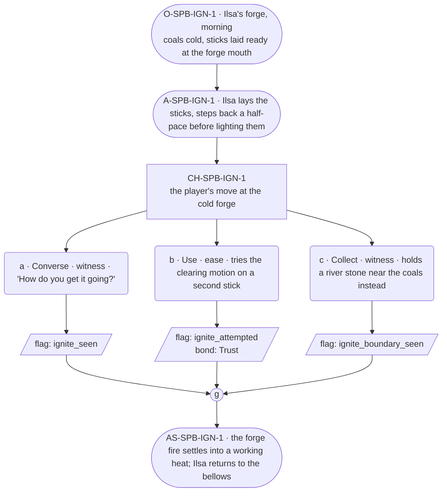

# SPB-ignite — Blacksmith spell beat: ignite

## Part A — Mini Architect Brief

**Reveal carried:** The first sight of `ignite` — introduced through Ilsa,
this life's Blacksmith, lighting the forge, per `content/magic/ignite.json`
(`learn_source`: "watch the blacksmith light the forge at the bench").
Component: `item_sticks`. Produces `item_flame` (and `item_heated_stone`
on a river-stone receiver — noted for texture, not staged here; that chain
belongs to F8, out of scope).

**State:** Ordinary workday, no thread material — spells attach to the
role, not the soul, so this scene stays generic-work rather than
arc-bearing.

**Sizing:** 6 beats — 2 setting beats, one 3-option choice node, one close.

**Constraint worth naming:** The phrase itself is never spoken as an
instruction — per the component-table discipline, the clue is physical
(sticks laid ready, a practiced motion) not verbal ("say ignite"). No
"remember/memory/forget" language anywhere near how the spell works
(guardrails check 7).

---

## Part B — Choice Designer Output

### Content block

**Incoming state (O-SPB-IGN-1):** Ilsa's forge, early morning. The banked
coals are cold. A bundle of sticks sits ready at the forge mouth — her
own daily habit, not staged for the player.

**A-SPB-IGN-1:** Ilsa lays the sticks into the forge mouth, settles them,
steps back a half-pace before doing anything else — a practiced clearance,
the physical clue (per the component table's confirm_action: cast on
inert material once).

**CH-SPB-IGN-1 (3 options, ungated):**
- **a · Converse · witness** — `player_line`: "How do you get it going?" —
  Ilsa: "You clear back first. Always." Settled, certain, no elaboration
  beyond the practical. Records `knowledge_flag(ignite_seen)`.
- **b · Use · ease** — `surface_action`: tries the same clearing motion on
  a second stick, off to the side. It catches, small and steady (per the
  `stick` receiver row). Records `knowledge_flag(ignite_attempted)` +
  `bond_event(Trust, weight 2)`.
- **c · Collect · witness** — `surface_action`: picks up a river stone
  lying nearby instead and holds it near the coals — the wrong material,
  no confirm_action licenses it yet, nothing catches. Records
  `knowledge_flag(ignite_boundary_seen)`.

Converges at **J-SPB-IGN-1**.

**Close (AS-SPB-IGN-1):** The forge fire settles into a working heat.
Ilsa returns to the bellows without comment, whichever way this went.

**Action-slot ratio:** 2 action beats (A-1, AS-1) across the scene ≈
within range.

**Long-run placement:** None.

**Equal weight:** a explains, b tries and succeeds, c tries the wrong
material and finds the boundary — all three are legitimate ways to learn
what the spell needs; none is punished, none is "correct."

### Mermaid graph

**Self-verify:** parses clean, options match prose, genuine gather, no
phrase spoken as instruction, no banned vocabulary, component table
(`item_sticks`) respected.
